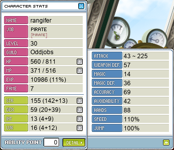
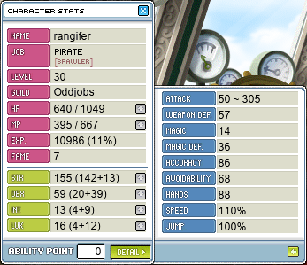

# rangifer’s diary: pt. ii

I started off today by picking up some papers 📃, for the purpose of wrapping presents 🎁 and so on (even if Christmas 🎄 isn’t for another 11.5 months or so…), and one of the characters who I like to do this with is my I/L 🧊🌩️ [magelet](https://oddjobs.codeberg.page/odd-jobs.html#luk-mage), **cervine**. Now, technically this is a diary for **rangifer**, not cervine (nor any of my other characters), but… whatever. I’ve been farming up colourful papers [at Red Kentauruses 🟥🐎](https://maplelegends.com/lib/map?id=240020000) for a while now; I like to sit at the bottom of the map and gather them alternately on the left and right side, only to maul them repeatedly — and I do mean _very_ repeatedly — with Ice Strike, until they are subdued. [Red Kentauruses](https://maplelegends.com/lib/monster?id=8140102) are weak to ice 🌡️, and have relatively low (495) MDEF for their level (88), both of which are very good for me as an I/L magelet; MDEF can otherwise chew away a large portion of my damage (lower damage per line means that MDEF values chew up a proportionally larger amount of that damage), and extra damage due to elemental weakness is a multiplier (1.5) that is applied _before_ defense is taken into account, thus making it especially powerful for me as a magelet, for the same reason 😄.

I wanted to try doing the same at [Taipei 101 🇹🇼](https://maplelegends.com/lib/map?id=742000000), as my magelet is level 93, meaning that anything there that is at least level 73 (= 93 − 20) is fair game. Mannequins of some species are the usual suspect here, and the lowest-level species of mannequin are [Kid Mannequins](https://maplelegends.com/lib/monster?id=9410032), at level 75. Perfect! The wrapping papers drop quite a bit more frequently [at Kid Mannequins](https://maplelegends.com/lib/map?id=742010100) 😮… these mannequins may not be weak to ice, but they have a bit less MDEF (430 < 495) and, more importantly, _a whole lot less HP_ (8.5k < 37.0k). Plus, they tend to spawn a little more readily and accessibly (due to the simple map layout, and the teleporter 🚪 from bottom to top). I expected the amount of EXP that I got (per unit time, i.e. EPM or EPH) to be at least a little bit less, considering how favourable Red Kentauruses are for me, but a quick-and-dirty EPM test showed that I was apparently wrong — these creepy dolls give enough EXP (in the ballpark of 2.1M EPM) to push my EPM up to at least what I get at Red Kentauruses… maybe even a bit more!

## It’s rangifer time

Once my buddy and fellow odd-jobber **Boymoder** logged on, it was KPQ time! We even did a few KPQs with **Mings**, a [permabeginner](https://oddjobs.codeberg.page/odd-jobs.html#permabeginner) of the **Flow 🍃** guild (allied with **Oddjobs**) who also played **NoobIet** (`Noobiet`), the [dagger warrior](https://oddjobs.codeberg.page/odd-jobs.html#dagger-warrior) 🗡️🛡️, from the previous diary entry! After a few KPQs, Mings had to leave to finish up some questing, but Boymoder and I carried on until we hit the fabled _level 30_! Finally, we could advance to second job 📈. Speaking of second job, there are some interesting mechanics at work within both rangifer’s and Boymoder’s second jobs 🤓…

## Fucking [STRlords](https://oddjobs.codeberg.page/odd-jobs.html#str-assassin), how do they work?

As mentioned in the previous entry, Boymoder is a STRlord. While it may seem at first that claws 🧤 are effectively useless for STRlords (unlike for LUK-based assassins), this is not exactly true, and tends to become less true as the STRlord levels up (particularly, culminating in skills like [Shadow Meso 💸](https://maplelegends.com/lib/skill?id=4111004), [Avenger ✴️](https://maplelegends.com/lib/skill?id=4111005), and even [Venomous Star 🐍](https://maplelegends.com/lib/skill?id=4120005)). Since we are just advancing to second job, the question presents itself: what skill build makes the most sense for a second job STRlord? To help answer this question, I made use of my [damage calculator 🧮](https://oddjobs.codeberg.page/dmg-calc/) to get some rough estimates of how useful each second job assassin skill is.

### The baseline

The model used here is roughly level 43 (give or take). Level 43 is an arbitrary level that was chosen because it is high enough to have a sizable quantity of second job SP, and is just high enough to make use of the [Maple Kandayo](https://maplelegends.com/lib/equip?id=01472032), and is a good level for LPQ! The weapon being used is assumed to be a maple 🍁 claw of some kind ([Maple Claw](https://maplelegends.com/lib/equip?id=01472030), Maple Kandayo, or [Maple Skanda](https://maplelegends.com/lib/equip?id=01472055)). Basic attacking (bound to the `Ctrl` key by default) is used as the baseline here, and [Drain 🧛](https://maplelegends.com/lib/skill?id=4101005) replaces it when Drain is at least level 1.

The “**CV**” in the tables below stands for the [coefficient of variation](https://en.wikipedia.org/wiki/Coefficient_of_variation).

- 220 STR
- 35 DEX (10 from equipment)
- 35 LUK (31 from equipment)
- 65 WATK (33 from weapon + 20 from [Cider](https://maplelegends.com/lib/use?id=2022002) + 2 from cape + 10 from gloves)
- 10% mastery (the lowest possible mastery)
- 100% dmg multi (basic attack)
- 0% crit chance
- 0% crit multi
- speed 3 (all maple claws are speed 3)
- 100 WDEF (the [Bloctopus](https://maplelegends.com/lib/monster?id=3230302) has exactly this much WDEF)

|          | **Per-hit** | **DPS** |
| -------: | ----------: | ------: |
| **Mean** |       154.9 |   234.7 |
|   **CV** |      15.76% |  12.80% |

### Only maxed [Drain](https://maplelegends.com/lib/skill?id=4101005)

|          | **Per-hit** | **DPS** |
| -------: | ----------: | ------: |
| **Mean** |       248.1 |   375.9 |
|   **CV** |      15.74% |  12.78% |

### Only maxed [Claw Mastery](https://maplelegends.com/lib/skill?id=4100000)

|          | **Per-hit** | **DPS** |
| -------: | ----------: | ------: |
| **Mean** |       173.3 |   262.6 |
|   **CV** |       7.94% |   6.45% |

### Only maxed [Critical Throw](https://maplelegends.com/lib/skill?id=4100001)

|          | **Per-hit** | **DPS** |
| -------: | ----------: | ------: |
| **Mean** |       232.6 |   352.4 |
|   **CV** |      37.30% |  30.30% |

### Only with [Claw Booster](https://maplelegends.com/lib/skill?id=4101003)

|          | **Per-hit** | **DPS** |
| -------: | ----------: | ------: |
| **Mean** |       154.9 |   258.1 |
|   **CV** |      15.76% |  12.20% |

### All maxed

|          | **Per-hit** | **DPS** |
| -------: | ----------: | ------: |
| **Mean** |       364.5 |   607.5 |
|   **CV** |      25.20% |  19.52% |

### Only maxed [Lucky Seven](https://maplelegends.com/lib/skill?id=4001344)

This is not a serious entry, but is included here just in case anyone thought that using Lucky Seven was a good idea for STRlords. Unfortunately, the damage formula is just no good for STRlords (STR and DEX are not taken into account at all).

|          | **Per-hit** | **DPS** |
| -------: | ----------: | ------: |
| **Mean** |        95.6 |   144.9 |
|   **CV** |      40.40% |  32.82% |

### Skeletal skill build

So, it seems from the calculations above that a skill build should probably look something like:

1. Max [Haste](https://maplelegends.com/lib/skill?id=4101004)
2. +3 [Endure](https://maplelegends.com/lib/skill?id=4100002) \[3\]
3. Max Drain
4. +3 Claw Mastery \[3\]
5. +1 Critical Throw \[1\]
6. +2 Claw Mastery \[5\]
7. +6 Claw Booster \[6\]
8. Max Critical Throw
9. Max Claw Mastery
10. ???
11. Profit

…or something like that.

## Fucking [pugilists](https://oddjobs.codeberg.page/odd-jobs.html#pugilist), how do they work?

The core mechanic of pugilists — indeed, their _raison d’être_ — is the fact that pirates (first job and onwards) can attack 🚫without any weapons🚫 equipped. Naturally, this suggests the question: but how tho? The answer, of course, is punching 👊🏾. And kicking 🦵🏾. You know, [unarmed](https://en.wikipedia.org/wiki/Subak) [martial arts](https://en.wikipedia.org/wiki/Taekkyon) [and shit](https://en.wikipedia.org/wiki/Taekwondo). But how _much_ tho?

    maxDmgUnarmed(PSM, STR, DEX, WATK) := (STR * PSM + DEX) * WATK / 100

    minDmgUnarmed(PSM, STR, DEX, WATK) := (STR * PSM * 0.1 * 0.9 + DEX) * WATK / 100

Note that there is no “mastery” here; [Knuckler Mastery](https://maplelegends.com/lib/skill?id=5100001) really does only apply when a (proper) knuckler is equipped. Hooray for forever-unstable damage~! “`PSM`” stands for “primary stat multiplier”, and for unarmed attacks, is 3 for first job pirates, and 4.2 for second (and onwards) job pirates. Yes, that’s right. It, bizarrely, depends on your job 🤨.

First job rangifer:

Second job rangifer:

The only difference between these two images is job advancement. There are no changes in equipment, AP allocation, nor SP allocation between them. Besides the obvious and large difference in damage range, some other quirks are present here:

- Second (and onwards) job brawlers differ from first job pirates in how they calculate their total WACC (`DEX * 0.6 + LUK * 0.3` for pirates, `DEX * 0.9 + LUK * 0.3` for brawlers). So my total WACC gets a considerable boost.
- Second (and onwards) job brawlers also differ from first job pirates in how they calculate their total AVOID, but MapleLegends has made some changes to how this works, and so I honestly have no idea what’s going on here.

## Second job; prospects

Now that rangifer is a brawler, and level 31, KPQ time has (sadly 😢) come to an end. But she has some great things to look forward to:

- The nifty DPS boost from hitting second job 💪🏾.
- Being my first character with somewhat high MAXHP (I do not wash any of my characters), thanks to [Improve MaxHP](https://maplelegends.com/lib/skill?id=5100000).
- Other sweet-ass second job skills, like [Oak Barrel](https://maplelegends.com/lib/skill?id=5101007), [Corkscrew Blow](https://maplelegends.com/lib/skill?id=5101004), and [Backspin Blow](https://maplelegends.com/lib/skill?id=5101002) (brawlers are heaps of fun to play in combat!).
- LPQ! 🛑🐀🐙👀🐋

I prefer to quest rather than grind (unless I can party quest, of course, in which case I do that), so the journey from level 31 to level 35 will take place mostly in Nautilus Harbour 🚢 and Ariant 🏜️. I probably won’t end up finishing the entire first saga of the Ariant questline, because I prefer to start LPQing more-or-less as soon as I hit level 35. So the next entry will probably just be questing, and sometime very soon, you can expect a whole lot of LPQing from rangifer 🦌!
