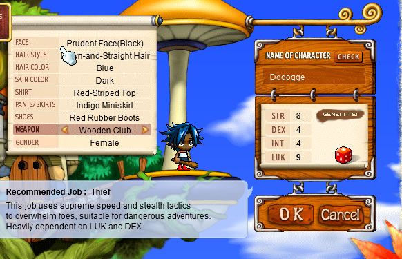
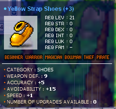
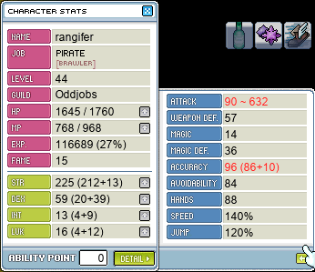

# rangifer’s diary: pt. vi

Whew! Today was quite the mapling 🍁 session…! I started off today, as you’d expect, LPQing it up~ 🛑🐀🐙👀🐋 **Boymoder**, being the speed demon she is, now has a roughly half-dozen level lead over rangifer! We did some LPQs and met (and met back up with) several lovely people 💖. And **Mings**, ally (and guildmate, on another character) [permabeginner 🔰](https://oddjobs.codeberg.page/odd-jobs.html#permabeginner), was able to join us! Here’s da LPQ gang at one point in our LPQscapades:

His name is a bit obscured in this screenshot, but the name of the second-from-the-left character is **StabApples** 🔪🍎. We did a number of LPQs with him, and he told us about a new guild on MapleLegends by the name of **Beginner** (at least, I do believe it was singular… maybe it was “Beginners”…). Beginner is a relatively new guild that, from what I understand, is quite similar to [**Oddjobs** 🍏](https://oddjobs.codeberg.page/): the guild is dedicated to odd-jobbed characters, like permabeginners 🔰, but also including many others. Hopefully Beginner can join the **Suboptimal** alliance one day! It wasn’t until after a number of LPQs that StabApples found out that I was the leader of Oddjobs:

StabApples was looking to make an [HP warrior 🛡️🛡️🛡️](https://oddjobs.codeberg.page/odd-jobs.html#hp-warrior), and decided he wanted to join Oddjobs, so the guild now has a level 16 HP warrior by the name of **DontDie** 🚫☠️🚫! I hope to one day see DontDie shred apart [the golems in LPQ](https://maplelegends.com/lib/monster?id=9300013)!! At that point our LPQ party had naturally dissolved, and Boymoder went to go card 🎴 hunt while StabApples created DontDie.

I myself went to hop on my I/L 🧊🌩️ [magelet](https://oddjobs.codeberg.page/odd-jobs.html#luk-mage), **cervine**, to farm up those 100 wrapping papers 🎁📃 [at Kid Mannequins](https://maplelegends.com/lib/map?id=742010100). Ally and permabeginner 🔰 extraordinaire **OmokTeacher** (you may know him as **Slime**; he created the permabeginner guide on the MapleLegends forums) was in Taipei 101 🇹🇼 as well, just [the map directly above me](https://maplelegends.com/lib/map?id=742010200), so I went to say hi 👋🏾! At the same time, **Outside** (a.k.a. **braidgame**, **TestChars**) was creating a brand spankin’ new [LUK warrior 🍀⚔️🍀](https://oddjobs.codeberg.page/odd-jobs.html#luk-warrior) by the name of **Dodogge** (from “Dodge” → “Dod” + “ge” → “Dod” + _“og”_ + “ge”), to be a member of Oddjobs:

Pictured: Dodogge is created! And with stellar dice rolls 🎲🎲🎲🎲, too!

The intent is to go the spearman 🔱 route in order to get [Hyper Body](https://maplelegends.com/lib/skill?id=1301007) as a party 🥳 buff (especially for guild-only and alliance-only boss runs), while maximising AVOID and still getting some viable melee ⚔️ damage options in third job ([Dragon Fury 🐲🤬](https://maplelegends.com/lib/skill?id=1311004), [Crusher](https://maplelegends.com/lib/skill?id=1311001), [Dragon Roar 🐲🔊](https://maplelegends.com/lib/skill?id=1311006)). Check out some of the sweet AVOID-centric equipment Dodogge has lined up!:

 with 15 AVOID and 10 LUK")

The [Christmas Tree 🎄](https://maplelegends.com/lib/equip?id=01332032) is not a weapon for serious combat, of course, but is useful in cases where Dodogge really only wants/needs the extra AVOID (this one, in particular, has a total AVOID of 14 ✨).

After I had said hi to OmokTeacher and went back down to finish up my 100 papers (and leveled cervine up from 93 to 94!! 😄), OmokTeacher and I decided to check out [Warped Path of Time ⏳ 4](https://maplelegends.com/lib/map?id=220060300) ([Spirit Vikings 👻🚣](https://maplelegends.com/lib/monster?id=8141000)). OmokTeacher had suggested to me that I try out Spirit Vikings on my level 98 [woodman 💪🏾🌲🏹](https://oddjobs.codeberg.page/odd-jobs.html#woodsman), **capreolina**. There is a spot at the bottom of the map where you can stand on a smol platform and use area-of-effect attacks to whittle the Spirit Vikings down. Generally, archers 🏹 (due to [Arrow Rain 🏹🌧️](https://maplelegends.com/lib/skill?id=3111004) and [Arrow Eruption 🏹🌋](https://maplelegends.com/lib/skill?id=3211004)) and I/L mages (due to [Ice Strike 🧊💥](https://maplelegends.com/lib/skill?id=2211002)) are the ones who are capable of this, so it could be a decent spot for cervine as well! Now, Spirit Vikings have a boatload ⛵ (pun intended) of HP (50k) and quite a bit of WDEF as well (830), so they do take a good while to whittle down, but naturally have high EXP to make up for it (2.1k before multipliers). I’m still getting the hang of this map, since it can be difficult for me to properly lure the Spirit Vikings. The ones on bottom require me to come down to them to be lured (unlike using Ice Strike and hitting them from the platforms above, Arrow Rain does not have quite that low of a bottom edge on its hitbox; only the smol middle platform is low enough for Arrow Rain to reach down), and the ones on top have to be treated very carefully, so that I don’t get knocked off by their magic attacks 😬 (which deal damage to me equal to roughly 50% of my MAXHP).

OmokTeacher accompanied me with his I/L 🧊🌩️ archmage 🧙, **Slimu**, and showed me how to duck down (down arrow key) when on the smol platform in order to dodge magic attacks and force the Spirit Vikings closer… at which point they are too close to magic attack you. I tried bit of a shaky EPM (experience per minute) test 📋, using `@epm 5`; Slimu was not partied with me, but was killing some mobs up higher on the map, so I had some advantage from that, hopefully making up for my poor manoeuvering… The result (extrapolated out to 60 minutes) was roughly 2.22M EPH (experience per hour). That’s some very solid EPH 😀, but I was sure that I was getting higher EPH at Taipei 101 🇹🇼; I had already done another (also a tad shaky) EPM test at Kid Mannequins on cervine, and got 2.16M EPH or so. That’s less than 2.22M EPH, obviously, but capreolina is quite a bit swifter at dispatching mannequins than cervine is, so I expected it to be much better for capreolina. Plus, with 50k HP and 830 WDEF, Spirit Vikings were just a slow place to farm 100 wrapping papers anyways 😅. Maybe I’ll come back later for the still decent EXP and much less potion burn 💰! And just to be sure, I ran yet another `@epm 5` with capreolina at [Male Mannequins](https://maplelegends.com/lib/map?id=742010103): roughly 3.38M EPH 😲!! Wowza. The potion burn 💰 is pretty hefty though, as Male Mannequins can hit me for anywhere from 1.3k~2.3k damage (depending on the attack and whether or not they are powered up) per hit, which is a lot to withstand (and thus a lot of fairly inefficient [Barbarian Elixir](https://maplelegends.com/lib/use?id=2002025) consumption) for poor capreolina, who only has 3.3k MAXHP or so 🤕.

Eventually it was back to LPQing again~~ I met some more lovely people 💝 — including **BeepBipBoop**, who _is_ a cutie and should not be ashamed of their female character ✨ — and leveled rangifer up to a whopping level 44! And Boymoder hit level 50~! 🎉 And she was off in search of [Zakum prequests](https://maplelegends.com/lib/map?id=211042300) and then a [Zakum Helmet](https://maplelegends.com/lib/equip?id=01002357) >:D. Here we are duoing [Alishar 🐋](https://maplelegends.com/lib/monster?id=9300012):

We’re pretty stronk 💪🏾 at this point, so duoing Alishar was a piece of cake! I’m pretty sure Boymoder whited Alishar 💪🏾💪🏾💪🏾 in at least two of our LPQs, with that super OP [Guan Yu](https://maplelegends.com/lib/equip?id=01442025) (94 WATK, if I recall correctly)!! Here’s a little look at rangifer’s stats at level 44:

When fighting Alishar, I simply pop on my 11 WACC, 2 DEX [Sad Mask 🎭](https://maplelegends.com/lib/equip?id=01012111) for the extra ≈13 WACC, in favor of my slightly more damage-oriented [1 WATK Rudolph’s 🦌 Red Nose 🔴](https://maplelegends.com/lib/equip?id=01012015).

Whew, alright 🥱. I’m quite sure I’ve missed some things here 💩🧠💩, but I do suspect that to be enough for one diary entry! Thanks for reading!! <3

