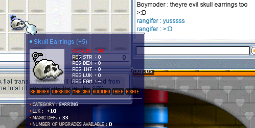

# rangifer’s diary: pt. vii

First thing I did today was farm up 100 wrapping papers 🎁📃 on my I/L 🧊🌩️ magelet **cervine**, and then hopped on rangifer to attempt some kind of catching up 🏃🏾‍♀️ with **Boymoder**! Boymoder was not online at the time, but had already went and gotten a [Zakum Helmet](https://maplelegends.com/lib/equip?id=01002357)(!!), and was still at level 50 (for lack of a final [Alishar card 🎴](https://maplelegends.com/lib/use?id=2388004) to complete her set). Unfortunately for me, at the time, LPQ was basically dead… It took upwards of 20 minutes or so to actually scrounge up a functional party, but I was able to get in a few LPQs. I met **CalmTofu**, an F/P 🔥🧪 wizard 🧙‍♀️ who was very nice and who I am now buddied with! Also on my buddylist now are **Gluck** and **meh1234**; Gluck and his brother, GIuck (`Giuck`), are two Estonians 🇪🇪 playing twinned mages 🧙🧙, and meh1234 is a Dutch 🇳🇱 up-and-coming assassin ✴️✴️ just playing the game casually!!

That party naturally dissolved as both Glucks left and meh1234 had to leave as well. After a brief break, I wanted to keep LPQing, so I went to channel 1 in search of a new party. At this point LPQ was a _little_ more happenin’, but it still proved quite difficult to put together a functional party. In fact, we had a party of 5 going, but with no one who could fight at range 🏹 (and thus no way to pass stage 7), it was going to be difficult to fill that last spot. A fighter 🪓⚔️ by the name of **zerotozero** (or as I address her, 020) convinced us through sheer charisma ✨ alone to accept her into the party and go as a group of 6… without any range. Not being able to pass stage 7 would mean just completing the first 6 stages and then calling it quits 💨, but the rest of the party was accepting enough of the idea that we indeed ventured forth, without _any_ party members so cowardly as to pick off their foes from a distance 🚫🏹🚫!

Besides none of us being capable of ranged combat, none of us were very good at combat in general… 😅 Being the odd job that rangifer is ([pugilist 👊🏾](https://oddjobs.codeberg.page/odd-jobs.html#pugilist), in particular), it’s already enough of a struggle to stay relevant in combat (although I make for great crowd control!!). But in this case, I was very nearly carrying the party 💪🏾! We even had with us **Lokun**, a very friendly [permabeginner 🔰](https://oddjobs.codeberg.page/odd-jobs.html#permabeginner) with whom I’ve done many an LPQ, but who was unfortunately unable to deal any damage, because he is HP washing ⛑️ so hard (beginners are actually considerably worse off than even archers/sins/gunslingers when it comes to HP)! We… actually did quite a number of half-LPQs like this, getting through it with nothing other than a lot of jokes and good fun socialising 🎉!

Pictured: The strugglebus poses for a group photo.

We also found out that rangifer is actually ranged 🏹, with her fists 👊🏾👊🏾!! At least, I can kill the bottom rat 🐀 in stage 7, haha. This is, unfortunately, little more than a party trick, since I have no way of killing the other two rats 🐀🐀. [I even filmed myself doing it during one of the attempts 📺](https://www.youtube.com/watch?v=6Aj18ZFaxOU), and although it’s a rocky start, I get the satisfaction of hitting a rat from range for a whopping 2.45k damage 😮 with just one [Corkscrew 🍾🔩 Blow](https://maplelegends.com/lib/skill?id=5101004)!! Take that, anyone who thought rangifer’s name was a corruption of “range” (it’s not; _Rangifer_ is [the genus of reindeer 🦌](https://en.wikipedia.org/wiki/Reindeer)), and was taken aback by my brawler 👊🏾 status!

Joining the strugglebus 🚌 later, was Boymoder! She got to complete her Alishar card set 🎴🎴🎴🎴🎴 and show off her incredible damage 💥 (at least, for an odd job) using her newfangled zhelm, and of course her epic-level [Guan Yu](https://maplelegends.com/lib/equip?id=01442025) mentioned in the previous diary entry ^^

Boymoder was the range 🏹 that we needed, and once **JohnTheWand** 🪄 (a.k.a. John “The Wand” Johnson; pictured above) had to leave, a party member of ours — a spearman 🔱 by the name of **moma** — stepped in with his I/L 🧊🌩️ wizard 🧙 so that we would still be capable of doing the “mage portal” 🧙🚪🧙 in stage 5. Unfortunately for moma, there really was no one else out in the channel 1 LPQ lobby to replace JohnTheWand other than himself… I say “unfortunately”, because playing a mage in LPQ made moma’s head hurt 😒. Even worse is the fact that we were often forced to go as a party of 5, putting more burden on the mage during stage 5. And **LTDxyz** (pictured above), at around this time, was helping his roommate out with something IRL (something very sweaty 💦, it seems, as he complained about being sweaty afterwards), so several of our runs were effectively with a party of 4. LPQers will know that stage 8 of LPQ _requires_ at least 5 characters, and will also know that in order to clear a stage, all party members must be present. So LTDxyz couldn’t be _completely_ AFK the entire time… and I’m not exactly sure how it happened, but it became a custom to simply spam the chat 💬🗯️💬🗯️💬 with a multitude of excessively long messages like “REEEEEEEEEEEEEEEEEEEEEEEEEEEEEEEEEEEEEEEEEEEEEEEEEEEEEEEEEEEEEEEEEEEEE” until LTDxyz finally took notice 👀, and came to the next map — or switched to a different box (stage 8), as the case may have been.

Boymoder had been popping in and out of the FM 🛍️ during the times that we were in-between LPQs, and she managed to scroll 📜 herself some really nice 10 LUK 🍀 [Skull Earrings 💀👂](https://maplelegends.com/lib/equip?id=01032012)!!:

Somehow, these LPQs that probably would have been considered “miserable” by most peoples’ standards were extremely fun for us (at least, for everyone except moma, who _claimed_ to be miserable… and maybe also for LTDxyz, who was not exactly having the funnest time doing sweaty 💦 things…), thanks to the people that we were with 💕, and the struggles that we collectively encountered (and surmounted!) along the way 🥳.

…And then [the power went out ⬛](https://en.wikipedia.org/wiki/Power_outage) in my neck of the forest 🌲🌲🌲, so this diary post is a bit late 🕰️ >.<
