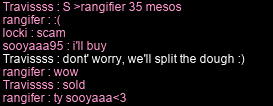

# rangifer’s diary: pt. viii

As usual for this event, the first thing I did today was farm up 100 wrapping papers 🎁📃 on my I/L 🧊🌩️ [magelet](https://oddjobs.codeberg.page/odd-jobs.html#luk-mage) **cervine**… Then it was time to LPQ 🛑🐀🐙👀🐋!!!! I was lucky enough to LPQ with ally and [permabeginner 🔰](https://oddjobs.codeberg.page/odd-jobs.html#permabeginner) **drainer** (**mae**, also known in-game as the priest 🛐 **technopagan** and the [gish 🗡️✨](https://oddjobs.codeberg.page/odd-jobs.html#gish) **raving**)~ I met mae when I was OPQing with my [swashbuckler ⚔️🔫🏴‍☠️](https://oddjobs.codeberg.page/odd-jobs.html#swashbuckler), **hydropotina**, so it was very nice to be reunited with her and PQing again (but this time, LPQ style)!!

We were looking for a ranged 🏹 character at one point, and all we found was another brawler 👊. But, I knew (from experience playing my swashbuckler) that guns 🔫 were prefectly capable of acting as the range 🏹 required for LPQ. The brawler in question had [their starter gun 🔫](https://maplelegends.com/lib/equip?id=01492014) with them still, and they were able to pick up [some bullets](https://maplelegends.com/lib/use?id=2330000) from the local shop 🏪. I was convinced that this would do the trick, since I never had any issues on my swashbuckler (despite being [pure STR 💪🏾💪🏾💪🏾](https://oddjobs.codeberg.page/odd-jobs.html#swashbuckler)), and there is no pirate 🏴‍☠️ equivalent of [Keen Eyes 👁️🔍](https://maplelegends.com/lib/skill?id=4000001). However, when we got to stage 7, they were actually completely incapable of hitting the rats 🐀!! They had gone for [Dash 🏃](https://maplelegends.com/lib/skill?id=5001005) instead of [Double Shot](https://maplelegends.com/lib/skill?id=5001003), so my only explanation, as far as I could tell, was that Double Shot has longer range than basic-attacking with a gun.

After a few LPQs, though, LPQ got kinda dead as everyone left 👋🏾. And mae had been staying up pretty late 🥱, so she decided that it was time to go and sleep 😴. After a while, I ended up getting picked up by another group who auctioned me off for a mere 35 mesos ;(

Luckily, even if some people (looking at you, **locki**…) seemed to not deem me worth 35 mesos 😭, **sooyaaa95** had my back…

After a few more LPQs, rangifer was some 18% of the way through level 48, and I decided to take a break to farm wrapping papers 🎁📃… but this time, on my [woodman 💪🏾🌲🏹](https://oddjobs.codeberg.page/odd-jobs.html#woodsman), **capreolina**! I’ve actually just [filmed a roughly 2-minute demo video of me playing my woodman, which you can watch on the Oddjobs 🍏 YouTube channel 📺](https://www.youtube.com/watch?v=74GgNliahYQ)!! Once I finished up gathering my 200th wrapping paper that session 😵, I proceeded to get even _more_ worthless garbage 🗑️ from [Santa's Helper](https://maplelegends.com/lib/npc?id=9999900)! Wow, cool 😅!

At this point, I hopped on my [STR priest 💪🏾🛐](https://oddjobs.codeberg.page/odd-jobs.html#str-mage), **cervid**, because my friend **Justin** (known in-game as **Justinorino**, or, in this case, as **Sopooroh**) needed some help [at CDs 💿💿](https://maplelegends.com/lib/map?id=742010203); I would be there to furiously [Heal ❤️‍🩹](https://maplelegends.com/lib/skill?id=2301002) (with most of my magelet’s gear on, and a [Wizard Elixir 🧙🏾‍♀️⚗️](https://maplelegends.com/lib/use?id=2002018) active, I’m able to achieve a TMA of a whopping 249 with just 20 base INT!) as he [rawr](https://maplelegends.com/lib/skill?id=1311006)’d 📢 the [C](https://maplelegends.com/lib/monster?id=9410031)[D](https://maplelegends.com/lib/monster?id=9410030)s to death 💿☠️. This went quite well — especially after we figured out that it was best for him to cast [Hyper Body](https://maplelegends.com/lib/skill?id=1301007) for my benefit, then cancel it out on himself so that he lost a smaller absolute quantity of HP per rawr. That way my STR-mage-trying-really-hard Heals would not be so ineffective, as they somewhat were with his nearly 30k HP when Hyper Body was active 😅.

Then, once Justin was done training, I went back to researching gear upgrades 👚📈. I’ve spent a _lot_ of cash 💰💰💰 (which I do not regret; the fact is that INT/MATK gear has, unfortunately, extremely inflated prices due to the existence of washing & leeching 😖) outfitting my magelet, and it’s time that I do something similar with the rest of my characters. Fortunately, I’ve chosen the rest of my character’s jobs such that they are all essentially pure STR 💪🏾💪🏾💪🏾… they all crave WATK, DEX, WACC, and — to some extent — STR, on their gear. For this reason, I do a lot of gear sharing ♻️, and at the moment, the mainstays of this shared gear are (not counting temporary items, of course):

| **Type** | **Name**                                                             | **Stats**               |
| -------- | -------------------------------------------------------------------- | ----------------------- |
| Face     | [Sad Mask](https://maplelegends.com/lib/equip?id=01012111)           | 2 DEX, 11 WACC, 2 AVOID |
| Ear      | [Single Earring](https://maplelegends.com/lib/equip?id=01032001)     | 6 DEX                   |
| Back     | [Pink Gaia Cape](https://maplelegends.com/lib/equip?id=01102084)     | 2 WATK, 7 DEX           |
| Body     | [Bathrobe for Women](https://maplelegends.com/lib/equip?id=01051098) | 18 DEX, 9 WACC          |
| Hands    | [Purple Marker](https://maplelegends.com/lib/equip?id=01082177)      | 9 WATK, 2 DEX           |
| Feet     | [Silver Strap Shoes](https://maplelegends.com/lib/equip?id=01072264) | 6 DEX, 15 JUMP, 2 SPEED |

And I’m really looking to squeeze out some more WATK, and more DEX/WACC. It’s going to take a lot of [owls 🦉🦉🦉](https://maplelegends.com/lib/cash?id=5230000), but hopefully I will be doing some really nice damage!! ⚔️💥

