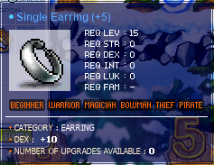
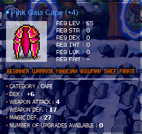
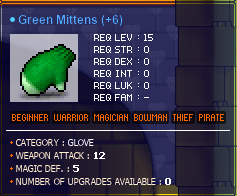
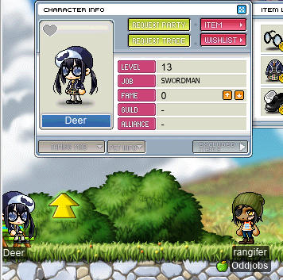
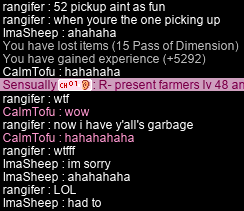

# rangifer’s diary: pt. ix

So this is a bit of a tough one, but only because I have peepee poopoo brain 💩🧠💩 and can’t remember anything that happened more than 10 minutes ago. I didn’t really have time to start this diary entry “on schedule”… 📅 not that there really is a schedule, but I’ve been trying to start writing these things every _roughly_ 24 hours or so, mostly because of aforementioned peepee poopoo brain affecting my ability to even recall stuff that happened. But that’s OK, as I’ve got plenty of pretty pictures 🖼️ for this one…!

## That’s not rangifer!

I played some of my other characters~ My I/L 🧊🌩️ [magelet](https://oddjobs.codeberg.page/odd-jobs.html#luk-mage), **cervine**, is still spamming [Ice Strike ❄️](https://maplelegends.com/lib/skill?id=2211002) at [Kid Mannequins](https://maplelegends.com/lib/monster?id=9410032). And my [woodman 💪🏾🌲🏹](https://oddjobs.codeberg.page/odd-jobs.html#woodsman), **capreolina**, is still getting beaten to a pulp 💥 by [Male Mannequins](https://maplelegends.com/lib/monster?id=9410034)! Wow!

In other news, my [swashbuckler ⚔️🔫🏴‍☠️](https://oddjobs.codeberg.page/odd-jobs.html#swashbuckler), **hydropotina**, received quite the upgrade! She hit level 85, which means it’s time to put on those [Sky Skis ☁️🎿](https://maplelegends.com/lib/equip?id=01432018) that I purchased a while ago!! You can watch her doing fatty damage 💪🏾💪🏾💪🏾 with it (and with her [Canon Shooter 🔫](https://maplelegends.com/lib/equip?id=01492022)!) [on the Oddjobs YouTube channel 📺](https://www.youtube.com/watch?v=3V7aLNJFJx4)! I’ll be MPQing on this character until I hit level 86~

## Equipment upgrade

In the previous diary entry, I mentioned wanting to upgrade the equipment 👚📈 of my physical-attacking characters (i.e. all of them except cervine). To that end, I’ve already snagged some upgrades! Check it out!!:

That’s 4 extra DEX!

That’s 1 fewer DEX, but 2 extra WATK!!

Also losing DEX here (2 DEX, in particular), but gaining 3 extra WATK!!! (…and 5 extra MDEF. Nice.)

These were some tough upgrades to make, not just due to cost, but also knowing that I’m losing some stats (3 DEX) by upgrading the WATK gear. This is, thankfully, made up for by the earring upgrade, so there’s a net gain of +1 DEX and +5 WATK!

## Name thief!!

As some people may know, I used to have a [STR cleric 💪🏾🛐](https://oddjobs.codeberg.page/odd-jobs.html#str-mage) by the name of **deer** 🦌 (not on MapleLegends, though). When I came to MapleLegends, I found that this name was already taken!! So I named my STR priest **cervid**, and my [woodman](https://oddjobs.codeberg.page/odd-jobs.html#woodsman) **capreolina** (previously known, somewhat confusingly, as “cervid”, renamed to “capreolina” once my STR priest had taken that name). I looked up “deer” on the rankings a while ago, and found an inactive level 13 warrior had taken the name. Today, however, I saw a [smega 📣](https://maplelegends.com/lib/cash?id=5072000) from them! So I tracked them down (read: used `/find`) to see if they really were real:

Alas… ‘tis too late now. I’ve already five(!) characters, and a longstanding name for each one. 😔

## rangifer LPQs to 50

I did some more LPQs 🛑🐀🐙👀🐋 on rangifer, enough to get me to level 50 (woohoo!) and roughly 50% EXP. I had the privilege of playing with a friend who I’d previously met at LPQ, **CalmTofu**, and met a new friend, **ImaSheep 🐑** (`imasheep`)! ImaSheep taught me how to play [52 pickup 🎴🎴🎴](https://en.wikipedia.org/wiki/52_pickup) with the passes in LPQ (“spread ‘em out”)… then the leadership post was passed to me, and then _I_ was the recipient of this little game:

Throwing your garbage ETC items down with the passes 🚮 really helps to spice up a classic game of 52 pickup, it seems.

Now that I’m level 50, expect to see some 🔥🔥🔥hot Zakum prequest action🔥🔥🔥 in the future, and some (oh yes, _lots of_) OPQ ✨.
