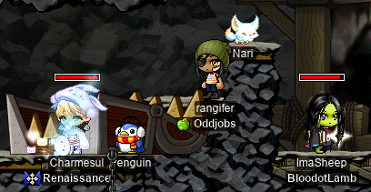

# rangifer’s diary: pt. x

Alright this one is another doozy 😵. Bear with me, as I _attempt_ to recollect my peepee-poopoo-brain 💩🧠💩 memories of the events that should be going into this journal.

## Farming teeth

In preparation for rangifer doing her Zakum prequests, I had my [woodman 💪🏾🌲🏹](https://oddjobs.codeberg.page/odd-jobs.html#woodsman) **capreolina** farm up the 30 [Zombie’s Lost Gold Teeth 🌟🦷🦷🌟](https://maplelegends.com/lib/etc?id=4000082). With [Arrow Rain 🏹🌧️](https://maplelegends.com/lib/skill?id=3111004), it was reasonably easy to shred [these zombies 🧟](https://maplelegends.com/lib/monster?id=5130108) and farm up some gold teeth, although of course the drop rate is notoriously poor, so farming 30 takes a while ⏳…

## Odd jobs meet up for the end of the New Year’s event

As the end of the New Year’s event neared, **Outside** (**braidgame**, **Dodogge**, **TestChars**, **Romilda**) had the idea to get as many odd-jobbers together as we could, and take a group photo at the Christmas Tree~! 🎄

Odd-jobbed Christmas Tree photos~

Pictured: The screenshot I took once **Rort** (level 44 [permabeginner 🔰](https://oddjobs.codeberg.page/odd-jobs.html#permabeginner)) had arrived.

Pictured: The original group screenshot that I took.

Pictured: Goofy-mode screenshot that I took shortly after the original screenshot.

Pictured: **OmokTeacher** (level 90 [permabeginner 🔰](https://oddjobs.codeberg.page/odd-jobs.html#permabeginner); a.k.a. **Slime**) chair-glitching at the tree’s apex, before he realised that all chairs look like [Relaxers](https://maplelegends.com/lib/setup?id=3010000) in event maps.

Unfortunately, not everyone could make it for the group photos 🙁. But I love you all very much 💗💖!!

## Passerine invents a new odd job

**Passerine 🐦** (a.k.a. **cobbages**, **Runelite**) has brought a brand-new (as far as I know) odd job to the **Oddjobs** guild: [bullet bucc 🔫](https://oddjobs.codeberg.page/odd-jobs.html#bullet-bucc)! Bullet buccs are vaguely similar to [DEX brawlers](https://oddjobs.codeberg.page/odd-jobs.html#dex-brawler), except with the restriction that they can only fight when they have a gun 🔫 equipped. This, obviously, locks them out of most of their skills (but somewhat humourously, does not prevent them from using [Flash Fist 🔫👊](https://maplelegends.com/lib/skill?id=5001001)!). But they should be considerably tankier 🛡️ than ordinary gunslingers (due to [Improve MaxHP ⛑️](https://maplelegends.com/lib/skill?id=5100000)), and get some neato skills like [Oak Barrel 🌳🛢️](https://maplelegends.com/lib/skill?id=5101007) and [Speed Infusion](https://maplelegends.com/lib/skill?id=5121009). We still have to test whether or not [Stun Mastery 💫](https://maplelegends.com/lib/skill?id=5110000) and, particularly, [Energy Charge 🔋](https://maplelegends.com/lib/skill?id=5110001) function for bullet buccs. I have, however, already added it to [the list of odd jobs on the Oddjobs website](https://oddjobs.codeberg.page/odd-jobs.html).

Pictured: Passerine advances to brawler, as somewhat begrudgingly allowed by [Kyrin](https://maplelegends.com/lib/npc?id=1090000).

## Killing [Blue Mushmom](https://maplelegends.com/lib/monster?id=9400205) on cervid

Outside (level 94 [permabeginner 🔰](https://oddjobs.codeberg.page/odd-jobs.html#permabeginner)) recently soloed Blue Mushmom 🟦🍄🟦 (you can [watch it on his YouTube channel 📺](https://www.youtube.com/watch?v=m6L3Mqd9eH4)). And he was kind enough to help me out with a respawn timer ⏲️ (I’ve been looking for a Blue Mushmom for [a quest](https://bbb.hidden-street.net/quest/victoria-island/eliminating-blue-mushmom)), so I actually managed to catch the respawn 😄!!

You can watch [the video of me killing that Blue Mushmom on the Oddjobs YouTube channel 📺](https://www.youtube.com/watch?v=oXsYfpUGYE8)!! I logged on to **cervid** (my level 98 [STR priest 💪🏾🛐](https://oddjobs.codeberg.page/odd-jobs.html#str-mage)) in a bit of a rush, and had to transfer some gear as well, so I’m a bit flustered and have some poor character control in the video 😳… All good though! [BMM](https://maplelegends.com/lib/monster?id=9400205) went down like a chump, F5!!! 🤬

The quest reward is… a bit underwhelming, though. It’s good to have a BMM kill under my belt, but the quest just gave me +0.65% EXP and a [one-handed sword WATK 60% scroll](https://maplelegends.com/lib/use?id=2043001) 🤷🏾‍♀️.

## LPQing with CalmTofu

I did rangifer’s final LPQs 🛑🐀🐙👀🐋 with my friend (who I met at LPQ) **CalmTofu**, who I’ve mentioned in an older diary entry. I decided to [film one and put it on the Oddjobs YouTube channel 📺](https://www.youtube.com/watch?v=pHCPtFF2DTI), although do note that while I _am_ level 50 in that LPQ, I still hadn’t gotten my [Zakum Helmet](https://maplelegends.com/lib/equip?id=01002357) yet!

I noticed that from around level 45 onward, it became quite common for rangifer to “white” (i.e. deal the most damage to) [Alishar 🐋](https://maplelegends.com/lib/monster?id=9300012); partly, this is due to the simple fact that I’ve outleveled the lion’s share of LPQers at that point (many will leave early for EPQ at level 45), but I think another part of this is that rangifer’s second job power peaks towards early second job. As second job goes on, and my enemies get considerably stronger — the game expecting my power to swell as my second job skills start to fill out — I have little, as a pugilist 👊🏾🦵🏾, to show for it. I cannot upgrade my weapon (since I don’t use one!), cannot use my [Booster](https://maplelegends.com/lib/skill?id=5101006), cannot upgrade my [mastery](https://maplelegends.com/lib/skill?id=5100001), and my second-job attacking skills are important… but only in tandem. None of them are spammable, and none of them attack more than 3 enemies at once, so the meat of my damage still comes from my [first](https://maplelegends.com/lib/skill?id=5001002) job [skills](https://maplelegends.com/lib/skill?id=5001001). The leap from LPQ to OPQ is, in my experience, a sobering one for odd-jobbed characters, and I expect the same for rangifer. We shall see~

## EPQing with allies

When I finished up LPQing, two of my allies from the **Flow 🍃** guild, **JumpQuest** (a.k.a. Slime, OmokTeacher) and **theking**. We were able to trio EPQ pretty easily! They (or at least, JumpQuest) were committed to using so-called “sweaty strats”, including having one person go to the right side after getting the first 3 potions in stage 2, and then having the 4th potion `/trade`’d to them. Unfortunately for them, I had not done EPQ in a while (I prefer to just do LPQ and then OPQ, since their level ranges are contiguous and I prefer both of them to EPQ), so I was a little rusty >.<

But we had a great time and got good EXP ✨!!

## Scrolling glasses

I had LPQed enough times on rangifer to get two pairs of glasses 👓👓, and now was the time to scroll 📜 ‘em! I failed _three_ [30%s](https://maplelegends.com/lib/use?id=2040203) on the first pair (none of which boomed, haha). My luck 🍀 on the second was better:

I failed the first 30%, succeeded the second, and then succeeded on [a 60%](https://maplelegends.com/lib/use?id=2040201). Not bad! Once I finally buy myself a pair of [Spectrum Goggles 🥽](https://maplelegends.com/lib/equip?id=01022082) (and get rangifer to level 70+, for that matter), these may be obsoleted, but for now they work quite well!

## EPQing with ImaSheep

My LPQ friend **ImaSheep** 🐑 (mentioned in an older diary entry) was level 49 and raring to EPQ, and I was already at EPQ after having run with the allies from Flow — so it was once again EPQ time! We were EPQing in a party led by a cleric named **Charmesul**, and shortly after an EPQ or two, we added **MukiDay**’s (who I know from LPQing on cervid with!!) hunter 🏹 to our ranks. Oh, and ImaSheep summarily kicked my ass at [Match Cards 🎴](https://maplelegends.com/lib/etc?id=4080100):

We had some pretty smooth runs, and rangifer ended up getting to level 53~! I knew I wasn’t going to be completing the card set, so I was rolling a 10-sided die 🎲 (`@roll 10`) instead of a 100-sided one (`@roll 100`) at the end; eventually MukiDay caught on, but I always like seeing how long it takes for people to notice that I’m not just _really_ unlucky. Once Charmesul got his [Glittering Altaire Earrings](https://maplelegends.com/lib/equip?id=01032061), we decided it was Zakum prequest time!

## Zakum prequests with MukiDay, ImaSheep, and Charmesul

Me, ImaSheep, and Charmesul all needed to do the Zakum prequests, and MukiDay graciously decided to help us ❤️, even though she didn’t need the prequests done!! The prequests took… perhaps a bit longer than they should have (in part due to me being an idiot lol), but MukiDay was very patient and generous with us ❤️.

We walked 🚶 all the way to [Entrance to Zakum Altar](https://maplelegends.com/lib/map?id=211042400) before realising that none of us had initiated the Zakum prequests with our third job instructors… 🤦🏾‍♀️ It’s, I suppose, an easy mistake to make, considering that this initial step is so trivial — and seemingly pointless. Why do I have to get permission from my job instructor? The world may never know 🤷🏾‍♀️.

Once we had gone back to [El Nath 🏔️](https://maplelegends.com/lib/map?id=211000000) and actually done this trivial step, we needed a way to get back to the Entrance to Zakum Altar. I fumbled around a bit by starting the walk back, thinking I would indeed have to walk all the way back (which I’m not averse to doing; I actually kinda enjoy the perilous trek 🥾 that is the path from El Nath to Zakum’s Altar), but MukiDay was kind enough to come just outside of [the Dead Mine](https://maplelegends.com/lib/map?id=211041500) so that we could [teleport](https://maplelegends.com/lib/cash?id=5041000) to her and save… well, at least a majority of the walk. I was still considerably slower than both ImaSheep and Charmesul in getting to the Altar, mostly due to my distinct lack of [the Teleport skill](https://maplelegends.com/lib/skill?id=2101002) 🚫🧙🚫…

And so we trioed the first quest of the Zakum prequest trilogy, where you find a bunch of [keys 🗝️🗝️🗝️](https://maplelegends.com/lib/etc?id=4001016) and use them to open a big fat chest:

…it may have been long enough since my last time doing this prequest that I was just a tad bit lost, even with [a guide 🗺️](https://forum.maplelegends.com/index.php?threads/zakum-prequest-guide.2738/) open in my web browser. But we made good time, nevertheless!!

Then it was time for the dreaded second prequest: the jump quest (ZJQ). I’m of the opinion that anyone who completes this jump quest already deserves a Zakum Helmet…

ImaSheep nailed both stages of the JQ in a solid 6 minutes or so 😮!!! I’d frankly never heard of someone completing the entire ZJQ at such a swift pace, so credit goes to ImaSheep for being the pro-est ZJQer I know :P

Charmesul and I were, naturally, a good bit slower 🐌, but with some guiding tips from ImaSheep and MukiDay, we both finished within a reasonable time 👍🏾.

Once the first two prequests were done, there was only one left: collecting 30 [Zombie’s Lost Gold Teeth 🌟🦷🦷🌟](https://maplelegends.com/lib/etc?id=4000082). As mentioned earlier in this diary entry, I had already farmed these teeth up, so I was essentially done at this point. But ImaSheep and Charmesul went out to meet MukiDay in the Dead Mine and do some farming. I think they made some considerable progress (having roughly 7 teeth or so, per person), but MukiDay was generous enough to buy the rest of the teeth for them 🥰!!! And so we all had our [Eyes of Fire 🔥👁️🔥](https://maplelegends.com/lib/etc?id=4001017)~

## GM buffs on cervid

GM buffs were announced by Kimmy, and so I hurried to figure out what I might do with them. No one was online in my alliance (**Suboptimal**) who was ready to grind (**Boymoder** was OPQing at the time), and so I made myself decide on which character I wanted to solo grind throughout GM buffs: cervid ([STR priest 💪🏾🛐](https://oddjobs.codeberg.page/odd-jobs.html#str-mage)), or capreolina ([woodman 💪🏾🌲🏹](https://oddjobs.codeberg.page/odd-jobs.html#woodsman))? In retrospect, I think I actually made the _wrong_ choice in choosing cervid (as she can supply her own [Holy Symbol](https://maplelegends.com/lib/skill?id=2311003), of course); I chose cervid because she is normally so difficult to solo train. Nevertheless, having made the decision — and, uhm, having _forgotten_ that I could pick “both” by simply having one accept GM buffs and immediately hide in the Cash Shop while I trained on the other 🤦🏾‍♀️ — I was able to make efficient use of said GM buffs.

I tried some quick-and-dirty `@epm 5` tests, both [at Kid Mannequins](https://maplelegends.com/lib/map?id=742010100) and [at Fancy Amps](https://maplelegends.com/lib/map?id=742010201):

- Kid Mannequins (level 98 cervid, GM buffs): ≈1.15M exp/h
- Fancy Amps (level 98 cervid, GM buffs): ≈1.12M exp/h

So, the difference as measured here is pretty slight, but I decided to be greedy (thanks to the GM [Hyper Body](https://maplelegends.com/lib/skill?id=1301007) and the extra WDEF from GM [Bless](https://maplelegends.com/lib/skill?id=2301004)) and go for [Kid Mannequins](https://maplelegends.com/lib/monster?id=9410032). By the end of the GM buffs, my exp had gone up by about +11.7%. Considering that I grinded consistently (such sweat!) throughout the entire GM buffs’ duration (45 minutes, I think?), that’s kinda brutal 😬, but is to be expected for a [permabeginner](https://oddjobs.codeberg.page/odd-jobs.html#permabeginner)-like job, such as [STR priest](https://oddjobs.codeberg.page/odd-jobs.html#str-mage).

Of note, however, was my maxed [Doom 🐌](https://maplelegends.com/lib/skill?id=2311005) skill, which allowed me to turn fast-moving, hard-hitting Kid Mannequins into slow-moving, barely-hitting (usually **MISS**es, otherwise just “**1**”s) [Blue Snails 🟦🐌🟦](https://maplelegends.com/lib/monster?id=0100101)! It’s even more useful on monsters with magic attacks 🪄, since those are disabled as well.

## rangifer gets that Zakum Helmet

Not terribly long after finishing the Zakum prequests on rangifer, someone was already accepting buyers for an AFK Zakum run~ So it was already time for rangifer to get her Zakum Helmet!

The first run had a [skillbook 📘](https://maplelegends.com/lib/use?id=2280010) buyer, as well as three(!) helm buyers, myself included… Then Zakum decided to drop just one(!) helm, and so two of us were left helmless! Three helm buyers is already probably too many, but Zakum being extra stingy with the helms didn’t help matters, either. Oh, and I may have forgotten to buy extra [Safety Charms](https://maplelegends.com/lib/cash?id=5130000) for this first run 😅… So I did lose just a bit of EXP…

In between the two runs, **FatSloth 🦥** (level 162 buccaneer, who served as the party’s resident bucc throughout both runs) was kind enough to help me test out whether or not [Stun Mastery 💫](https://maplelegends.com/lib/skill?id=5110000) and [Energy Charge 🔋](https://maplelegends.com/lib/skill?id=5110001) work with a gun 🔫 equipped! This is pretty crucial information for the novel [bullet bucc](https://oddjobs.codeberg.page/odd-jobs.html#bullet-bucc) odd job mentioned above. As it turns out, Stun Mastery _does_ work with a gun (although bullet buccs have no way of doing the stuns themselves)! And unfortunately, Energy Charge does not… 😔

The bishop from the first run had to leave, and so for the second run, another was recruited: **ChrisBS**. I already knew Chris from meeting him at MPQ (Magatia Party Quest; RnJPQ) on my I/L 🧊🌩️ [magelet](https://oddjobs.codeberg.page/odd-jobs.html#luk-mage), **cervine**! And now, down to two helm buyers for this second run, Zakum dropped two helmets: one for each of us. Here’s what I ended up with:

It’s a passable Zhelm, with just below-average STR (14 < 15), and an average amount of total WACC (average DEX, +1 WACC from above-average LUK, −1 WACC from below-average raw WACC). The defenses are a tad subpar, with slightly below-average WDEF and MDEF, and average AVOID. But hey, I’ll take it! 😀 It sure beats my [Rudolph’s Hat](https://maplelegends.com/lib/equip?id=01002850)…

## Mist training with Tacgnol

After I had gotten my Zhelm, guildmate and F/P 🔥🧪 [gishlet](https://oddjobs.codeberg.page/odd-jobs.html#luk-gish) extraordinaire **Tacgnol** (a.k.a. **Boymoder**, **Taima**, **Mojyo**, **Yotsubachan**) wanted to do some [mist 🧪🌫️](https://maplelegends.com/lib/skill?id=2111003) training with cervid at [Shaolin Temple Square](https://maplelegends.com/lib/map?id=702050000)! As you may recall from an older diary entry, [Tacgnol and I tried out some mist training at Skeles 🦴](https://www.youtube.com/watch?v=2bbaPwgfwnc) before, but it seems that STS is a better spot. The map is a good bit easier to work with, and the monsters aren’t quite as high-level, making them significantly easier to hit.

As someone who has never played an F/P 🔥🧪 mage themselves, I continue to be amazed (repeatedly, it seems) by the power of [Poison Mist 🧪🌫️](https://maplelegends.com/lib/skill?id=2111003)! Mist training in a duo like this is intense stuff, and although it was a good bit easier to survive at STS than it was [at Skeles](https://maplelegends.com/lib/map?id=240040511), I did still manage to die once… The EXP was so good though, I was recording some ≈7M exp/h!!

This mist training session was quite the doozy, but boy did it pay off… Not only was it enough EXP to finish up the last bit of level 98 (and thus get cervid to level 99), but cervid even managed to hit level 100 (and Tacgnol to hit level 96)!!!!! 😲😲😲

Holy moly! I must admit I’ve never actually played a character with a level this high, so seeing three digits in the bottom-left corner of my screen is a whole new experience for me!! 🎉🎉🎉

And now that cervid is level 100, she can finally make use of the fabled [Crimson Arcglaive 🟥🔱🟥](https://maplelegends.com/lib/equip?id=01442068), normally considered a [permabeginner](https://oddjobs.codeberg.page/odd-jobs.html#permabeginner)’s 🔰 weapon; but for a [STR priest 💪🏾🛐](https://oddjobs.codeberg.page/odd-jobs.html#str-mage) like cervid, the Arcglaive means even more than that: it even gives MATK ✨ (89 on average)! Very useful for my [Heal](https://maplelegends.com/lib/skill?id=2301002)s ❤️‍🩹!!

I’ll likely be trying to get more Crimson Arcglaive(s) in the future, but for right now, Taima was generous enough to give me her failed Arcglaive 😍 (105 WATK, 90 MATK, 4 STR, 5 SPEED, 1 WDEF, 0 slots)!!:

❤️
