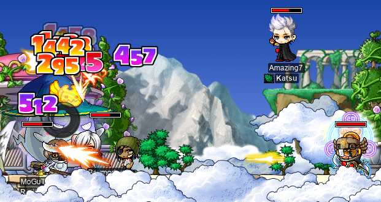
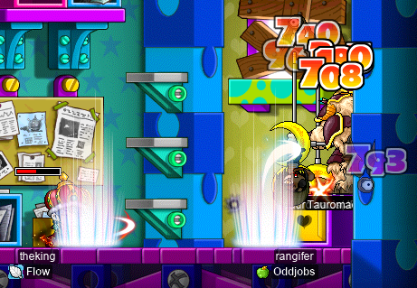

# rangifer’s diary: pt. xi

Spoiler alert: rangifer 🦌 goes from level 53 at the beginning of this diary entry, to 59 at the end 🔥🔥!! Only 6 more levels before my [PGC](https://maplelegends.com/lib/equip?id=01102084) :P

## rangifer [OPQ](https://maplelegends.com/lib/map?id=200080101)s for the first time

Now that rangifer had some fun at [EPQ](https://maplelegends.com/lib/map?id=300030100) and was level 53, it was time for OPQ (as planned)! At first, things looked a little bleak 😑; I went to the [OPQ lobby](https://maplelegends.com/lib/map?id=200080101) in channel 1 and there was absolutely no one there 🏜️ (other than myself). After a while though, someone finally showed up: a spearman 🔱 by the name of **MoGuTou**! Mo was kind enough to [smega 📣](https://maplelegends.com/lib/cash?id=5072000) once or twice to try to recruit some folks for OPQ, and also brought his level 70 ranger 🏹 “mule” to fill in another slot so that we could reach the 5-person threshold. Lo and behold, our party did eventually fill up ✨! In fact, after the formation of our party, OPQ was actually unnaturally lively 🥳 for a while ^^. I love to see PQs getting some love ❤️.

Things were running fairly smoothly, and I was getting a lot of EXP ([OPQ](https://maplelegends.com/lib/map?id=200080101) is very good EXP, particularly for those in the bottom half of the 51~70 level range)… then we had to call a GM 👮. As it turns out, if you kill a [Pixie](https://maplelegends.com/lib/monster?id=9300047) when it’s too close to the map’s boundary (the left or right wall 🧱🧱), the [very small and nearly invisible 🔍 ETC item that they drop](https://maplelegends.com/lib/etc?id=4001050) will drop [outside of the map](https://en.wiktionary.org/wiki/out_of_bounds#English). But you need _all_ of said nearly-invisible ETC items in order to complete the party quest, so Mo called up `@gm` to ask for a replacement. **Wyndham** responded almost immediately 🦸 (wow!), and **KonekoDxD**’s pet (**Sanho**) 🦊 continued in their futile attempts to pass through the map’s boundaries and retrieve the ETC item:

Wyndham graciously returned the item to us 👍; but before he could leave, someone referred to him as “she”, and Wyndham assured us that — invisible as he may be to the naked eye 👁️ — he is most definitely a “he”. I thought that misgendering invisible gamemasters was a kinda funny thing that I didn’t really expect to see when I started OPQing, but as it turns out, it’s more likely than you think…

So, um, yeah… It turns out that the Pixies dropping a teeny tiny ETC item is not the only case where this bug occurs. During one of our OPQ boss battles, someone told me to use my [Corkscrew Blow 🍾🔩](https://maplelegends.com/lib/skill?id=5101004) and [Backspin Blow](https://maplelegends.com/lib/skill?id=5101002) to pin [Papa Pixie](https://maplelegends.com/lib/monster?id=9300039) to the wall, for the benefit of our party’s DPM… Papa Pixie drops a (thankfully much more visible) ETC item called [Even Stranger Seed 🌱](https://maplelegends.com/lib/etc?id=4001054) that is, once again, necessary to complete OPQ. Once again, the GM response was quite prompt 🦸, and **Mirror** 🪞 kindly returned the seed to us. But she did not leave before someone had the chance to misgender her~ 🙈 Quite the coincidence.

Throughout the rest of my OPQs, I’ve been very careful (some would say, paranoid 👀) about keeping monsters away from walls >.< . I think that getting this bug 🐛 twice in one session is quite enough to learn that lesson…

Here we were, killing Papa Pixie — well, I suppose **Amazing7** and **SniperD** are probably doing the lion’s share of the DPS in this image, but the rest of us were definitely in there tearin’ it up as well:

In the middle of our OPQing, we got some juicy GM buffs~ The WATK granted by GM buffs is the same as that of a [Cider 🍶](https://maplelegends.com/lib/use?id=2022002) (+20 WATK). My [STRlord 💪✴️✴️](https://oddjobs.codeberg.page/odd-jobs.html#str-assassin) friend **Boymoder** with that buff (she had been using [Coke Zero Pills 💊](https://maplelegends.com/lib/use?id=2022078), which grant +15 WATK), managed to hit 1000+ damage [crits](https://maplelegends.com/lib/skill?id=4100001) on OPQ mobs with [her claw](https://maplelegends.com/lib/equip?id=01472054) at just level 61!!

Later on, Dutch 🇳🇱 hermit ✴️✴️ **ImAnAss** taught some curious party members a few random noun phrases 🥔 in [Dutch](https://en.wikipedia.org/wiki/Dutch_language):

…and then graduated OPQ; congrats on level 71! 🎉

All in all, I actually managed to do a whopping **17** OPQs in that session (whew…)! 😅

## rangifer maxes her skills ;~;

By level 55 or so, rangifer had already essentially maxed all of her skills… without any reason to put SP into [Knuckler Mastery](https://maplelegends.com/lib/skill?id=5100001) nor into [Knuckler Booster](https://maplelegends.com/lib/skill?id=5101006), I’ve a lot of SP just kinda sitting around. Here are my second job skills, at level **59**:

")

")

My first job skills look about how you would expect, with the caveat that I’ve chosen to forgo [Dash 🏃🏾‍♀️](https://maplelegends.com/lib/skill?id=5001005) (because all first job SP must be spent in order to take second job advancement, I had to put 1 SP into a skill that is thoroughly useless without any weapons: [Double Shot 🔫🔫](https://maplelegends.com/lib/skill?id=5001003)). Dash is kind of like [Final Attack](https://maplelegends.com/lib/skill?id=1300002) in many ways; it’s difficult to perform in combat with much precision without accidentally setting off the skill, and there’s no way to toggle the skill on and off. Dash has very clear utility when travelling 🚴🏾‍♀️, but the possibility of accidentally triggering it (by pressing the left or right arrow key twice) while in combat, or when trying to navigate difficult terrain (e.g. [the OPQ bonus stage](https://maplelegends.com/lib/map?id=920011100)), makes it more trouble than it’s really worth, in my opinion 😕. If I’m feeling real saucy, I might just burn some NX in order to SP reset my way into trying Dash on for size.

So actually, as soon as I level up just once more (to level 60), I’ll max out [MP Recovery](https://maplelegends.com/lib/skill?id=5101005) and have 1 leftover SP to be spent on… well, nothing. By level 70, I’ll have **31** such SP >.<

Inevitably, this SP will have to be thrown away 🗑️ on Double Shot and/or Knuckler Mastery/Booster, so that I can job advance to marauder, but for now I will prefer to see it just sitting there…

MP Recovery, by the way, is, um, an interesting skill. It’s _kind of_ a waste of SP (at least, for knuckler-using brawlers), but has a neat animation. I definitely do plan on using it when there’s free/cheap healing (e.g. a party member casting [Heal](https://maplelegends.com/lib/skill?id=2301002)), but for now I haven’t really bothered with it, particularly due to its cumbersome cooldown ⏲️. The cooldown decreases with level, so once I fully max it out, it will only be 25 seconds. 25 seconds might(?) be a tad too long, but then again, brawlers/marauders aren’t exactly MP-hungry, so it probably works pretty well! I do wish, though, that at the maximum level of the skill, it at _least_ recovered a _little bit_ more MP than 1 times the HP spent (like 1.1 or something, I have no idea really). That way it could at least be… nominally “efficient” to invest SP in, in most cases. I’ll try to remember to give an update on my thoughts, once I actually max the skill and use it in anger 👍🏾.

## LMPQing with allies

Some of my allies in the **Flow 🍃** guild (**theking 👑** and **JumpQuest**; JumpQuest is a.k.a. **OmokTeacher**, **Slime**) were LMPQing (Ludibrium Maze Party Quest, which takes place in [Ludibrium proper](https://maplelegends.com/lib/map?id=220000000), and is not to be confused with Ludibrium Party Quest 🛑🐀🐙👀🐋, which takes place on [the 101st floor of the Eos Tower](https://maplelegends.com/lib/map?id=221024500)) and asked if I wanted to join. I hadn’t seriously done LMPQ in quite a while, so I was a bit rusty… LMPQ is almost entirely neglected 🏜️ (except when played among friend groups, as in this case), even with all of the wonderful (and sometimes _not_ that wonderful) potions ⚗️ that it gives you.

Here I am, [upside-down 🙃](https://maplelegends.com/lib/skill?id=5001002) and walking on the blade of a [Tauromacis](https://maplelegends.com/lib/monster?id=9400218)’s spear 🔱, as theking chucks [throwing stars ✴️✴️](https://maplelegends.com/lib/use?id=2070006) directly at my head:

And here we all are, about to give [creepy clown man 🤡](https://maplelegends.com/lib/npc?id=9103000) our [tickets 🎫](https://maplelegends.com/lib/etc?id=4001106) so that he will give us strange potions ⚗️ to drink 🥴:

And that’s the LMPQ experience! Not pictured are the screenshots of me simultaneously straining to remember which integers correspond to which portals (pro tip: it’s \[+4, +7, −3\] from left to right) whilst struggling to do basic integer addition [modulo](https://en.wikipedia.org/wiki/Modular_arithmetic) 15\* 😖.

All jokes aside, it really is fun to do some LMPQ with friends 😄, as long as it’s in short bursts — the very brief and repetitive nature eventually gets to ya 😵. The EPM (assuming that you really do optimise and spam the thing) really ain’t so bad 🤷🏾‍♀️, and that’s even with our dinky little party; killing the Tauromacis as swiftly as possible is paramount. Oh, and the meso loss due to potion use is _very much_ actually a meso _gain_ 💵… just make sure that you purchase the maximum possible number of slots for your USE inventory.

---

\*[Actually 14](https://en.wikipedia.org/wiki/Off-by-one_error), but the rooms are [one-indexed](https://en.wikipedia.org/wiki/Zero-based_numbering), so it’s confusing. Whatever.

## capreolina imbued with GM boofs

I got to take advantage of some more GM buffs~ ✨✨ And this time, on my [woodman 💪🏾🌲🏹](https://oddjobs.codeberg.page/odd-jobs.html#woodsman), **capreolina**. I didn’t really have time to research good training spots (if anyone has any suggestions for a level 99 woodman, do let me know~ ☺️), so I just stuck with [the ol’ Male Mannequins](https://maplelegends.com/lib/map?id=742010103). Now, Male Mannequins sting badly 💥, and they sting often, and [I take hits like a wet paper bag 🤕](https://tvtropes.org/pmwiki/pmwiki.php/Main/GlassCannon), so I generally just hope to break even with respect to meso 💵 gain/[loss](https://maplelegends.com/lib/use?id=2002025). The GM buffs really help with this, though, so I had an easier time than I usually do.

capreolina went from level 98 & ≈91% EXP to level 99 & 30.58% EXP in the duration of the GM buffs 🔥! I had [Echo of Hero 🦸🦸](https://maplelegends.com/lib/skill?id=0001005) active on me for the first 40 minutes or so, and I took a quick-and-dirty `@epm 5` test with some impressive results (bearing in mind, of course, that this is with both Echo of Hero and [GM buffs](https://maplelegends.com/lib/skill?id=2311003)): ≈4.19M exp/h!! 😮 No wonder I got around about _40%_ EXP in the span of just one GM buff~

Stay tuned for more OPQ (yesss) and _maybe_ even a special little [magelet](https://oddjobs.codeberg.page/odd-jobs.html#luk-mage) surprise~? (Wow??) 😇

