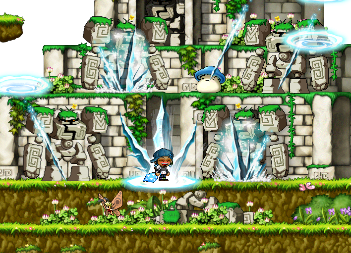

# rangifer’s diary: pt. xii

I am here to deliver on the “special little [magelet](https://oddjobs.codeberg.page/odd-jobs.html#luk-mage) surprise” teased in the previous diary entry.

Since I seem to have made a habit of creating a new guide for every odd job that I play — and I do plan on going all the way to making one for [swashbucklers ⚔️🔫](https://oddjobs.codeberg.page/odd-jobs.html#swashbuckler), although probably not for [pugilists 👊🏾🦵🏾](https://oddjobs.codeberg.page/odd-jobs.html#pugilist) — I’ve made [one for magelets, based on my experience with my (currently level 95) I/L 🧊🌩️ magelet, **cervine**](https://oddjobs.codeberg.page/guides/magelet/).

And there’s even [a crappy little video I made to go along with it, which you can watch on the Oddjobs YouTube channel 📺](https://www.youtube.com/watch?v=fpRjuySOTtU).

[**“Fate’s Warlock, Fortune’s Witch: The Magelet”**](https://oddjobs.codeberg.page/guides/magelet/)

## Tryna OPQ

OPQ was off to a bit of a rocky 🪨🪨 start, just trying to get a party going:

The other 5%, of course, is when we’re doing [the Sealed
Room ⚖️](https://maplelegends.com/lib/map?id=920010500)…

We did manage to pull together a party 🥳, though, and my newly-priest 🛐 (congrats~!) friend **BishopXeph** was streaming 📹 on [Twitch](https://www.twitch.tv/) and wanted to try OPQ before outleveling it for good! And try it, he did; we only managed two OPQs before the party disintegrated enough to preclude further OPQs, and an arduous two OPQs they were… I was the only one in either of the PQs who had done OPQ before (or at least, had done it in recent memory), so there was a considerably higher teaching-to-doing-ratio than in your average OPQ. It’s always a good thing, though! Indoctrinating — excuse me, I mean _welcoming_ — new people into the (O/M/E/L/etc.)PQ world is a fun and healthy thing, especially if it means more active PQs!! 😃

Once the party partly disintegrated and the remaining members of the party were getting antsy 🐜 (it didn’t look like we were going to get another OPQ party member anytime soon), our focus shifted to LMPQ, which has the same level range as OPQ (51~70), but a more flexible party size (3~6 instead of OPQ’s 5~6). So on the boat to Ludi we went, ready to stuff our USE inventories with random nonsense~ 🧃🧃🧃

We managed to get quite a few LMPQs done, and rangifer hit level 60~! And so I’ve finally maxed [MP Recovery](https://maplelegends.com/lib/skill?id=5101005). I realise now that the main reason why MP Recovery seems so whimpy is because of my low MAXHP at this point. Because MP Recovery consumes a portion (10%) of your MAXHP, you can recover more MP simply by having higher MAXHP; and furthermore, once I surpass that critical threshold for [percentage-based HP potions](https://maplelegends.com/lib/use?id=2002021) (some 4,667 or so MAXHP), I’ll be paying fewer mesos per point of HP anyways, making the 1:1 HP:MP ratio of MP Recovery cost-effective (as pointed out by **iPippy** in response to my previous diary entry!).

## A quirky barrel

Speaking of brawler skills, here’s one with a bit of a visual quirk: [Oak Barrel 🌳🛢️](https://maplelegends.com/lib/skill?id=5101007). Here’s rangifer, in [bathrobe](https://maplelegends.com/lib/equip?id=01051098), because my normal outfit covers up my legs/feet entirely:

And here’s the same rangifer, just after using Oak Barrel:

Can you [spot 👁️ the difference](https://en.wikipedia.org/wiki/Spot_the_difference)? ;)

## cervid and OmokTeacher battle Capt. Latanica for great justice

There were some GM buffs that went off, and [permabeginner 🔰](https://oddjobs.codeberg.page/odd-jobs.html#permabeginner) & ally **OmokTeacher** (a.k.a. **Slime**) wanted to use them to kill [Capt. Latanica](https://maplelegends.com/lib/monster?id=9420513). I got the GM buffs as well, on my [STR priest 💪🏾🛐](https://oddjobs.codeberg.page/odd-jobs.html#str-mage) **cervid**, and I was eager to do something with them as well. I’d never fought Capt. Latanica before, so I was excited to see this guy for myself. OmokTeacher was kind enough to give me a [White Essence](https://maplelegends.com/lib/etc?id=4000381) (necessary to fight the captain himself), as well as lend me some [HP potions](https://maplelegends.com/lib/use?id=2022205) in case I needed more than I usually carry (I can usually get away with mostly just [Heal](https://maplelegends.com/lib/skill?id=2301002)ing), and even a few [Heartstoppers](https://maplelegends.com/lib/use?id=2022245) to speed up the process a bit!!! As it turned out, I didn’t really need the HP potions, but it’s better safe than sorry.

Our first Capt. Latanica run went quite smoothly, taking roughly 8 minutes and 15 seconds from start to finish. Just as we finished, someone announced an [Echo](https://maplelegends.com/lib/skill?id=0001005) in [the FM](https://maplelegends.com/lib/map?id=910000000), so we went to grab that, and decided that was a good excuse to do another Capt. Lat run!

But, that meant doing the repeatable bit of the Capt. Lat quest to get another White Essence:

By the time that we finished the quest and got the White Essence, the GM buffs had nearly run out. It wasn’t a big deal for me, as I could still survive Capt. Lat (even his magic attack 🚢) with relative ease. And missing out on GM [Holy Symbol](https://maplelegends.com/lib/skill?id=2311003) wasn’t a problem for either of us, as I have my own Holy Symbol. But OmokTeacher, even with his quite high MAXHP and defences — at least, for a level 91 permabeginner — wouldn’t be able to take even one hit from Capt. Lat’s magic attack 🚢 without the aid of GM [Hyper Body](https://maplelegends.com/lib/skill?id=1301007). So if we did decide to go for it anyways, it was gonna be real spicy 🌶️✨.

…And so we hurried to summon Capt. Lat, so that we could at least have GM buffs for the very start of the boss fight, before the captain’s minions are summoned. You can [watch this _extra spicy 🌶️✨_ Capt. Latanica fight on the Oddjobs YouTube channel 📺](https://www.youtube.com/watch?v=OwrBetxkVCA). Will OmokTeacher make it? Or will a single stray magic attack 🚢 be the end of him ⚰️, leaving only me to avenge his poor soul 👻???

After that, OmokTeacher suggested that I try the full Capt. Lat prequest myself sometime; it gives a pretty solid EXP reward, and I do love me some boss quests, like:

- [Stumpy’s 🌲](https://bbb.hidden-street.net/quest/victoria-island/the-old-tree),
- [Eliza’s 🔥🐈‍⬛🔥](https://bbb.hidden-street.net/quest/el-nath-mt-aquaroad/goddess-pet),
- [Snowman’s ⛄](https://bbb.hidden-street.net/quest/el-nath-mt-aquaroad/snowfield-giant),
- etc.

So here I am, finishing the lion’s share of the prequest, for great justice:

")

")

Pictured above: Is [Doom 🐌](https://maplelegends.com/lib/skill?id=2311005) the greatest skill in the game? Scientists 🥼 are still seeking 🔬🧪 the answer to this question.

Ta-ta for now~! ❤️

