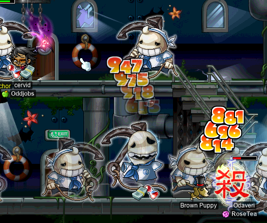
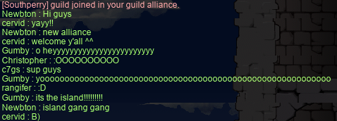

# rangifer’s diary: pt. xiii

## Finishing up the Capt. Lat prequest

The first thing I did was go to finish up [the Capt. Latanica prequest](https://bbb.hidden-street.net/quest/singapore/the-secret-of-ghostship); I needed to kill some 170 or so more [Mr. Archors](https://maplelegends.com/lib/monster?id=9420512). I went to [GS6](https://maplelegends.com/lib/map?id=541010050) and lo & behold, there was a bandit there [Savage Blow](https://maplelegends.com/lib/skill?id=4201005)ing the Mr. Anchors to death. So I asked if I could party with them, just to get the kills that I needed. **Odaveri** kindly obliged, and we did a little party grinding in GS6 together. This made the rest of the 300 Mr. Anchors go by quite a bit faster, since not only did we have 2 people, but Odaveri killed them quite a bit faster than me, haha~

Hopefully next time, I will be solo-killing [the captain himself](https://maplelegends.com/lib/monster?id=9420513)! F5!!

## OPQ. OPQ. OPQ.

Again, as usual, a bit of a rocky start with getting an OPQ party goin’.

And I’m still not sure what **louu**’s [smega](https://maplelegends.com/lib/cash?id=5072000) response is supposed to mean here…:

But a party did eventually form, and I got to do a number of OPQs, again with **BLiiND** and **KonekoDxD**!

We spent a lot of time going into [the Room of Darkness](https://maplelegends.com/lib/map?id=920011000) and looking for Diary Pages. A certain Diary Page in particular, actually: [the 5th page](https://maplelegends.com/lib/etc?id=4001068). Supposedly, the Diary Page droprates in MapleLegends were tweaked way back when, in order to make all 10 Diary Pages have identical drop rates. But we had three separate party members at various times looking for Diary Pages, and every time, the most sought-after one was the 5th. BLiiND was forced to commit suicide numerous times in search of the 5th page, and we resorted to just “rushing” the Room of Darkness by completing [the first stage](https://maplelegends.com/lib/map?id=920010000), then the Room of Darkness, then starting over again. And by the end of it, BLiiND very nearly overleveled the quest!! In order to complete the diary, you not only have to have all 10 pages, but you have to have them in your inventory as you complete [the bonus stage](https://maplelegends.com/lib/map?id=920011100). This means sticking around for an entire OPQ, since the bonus stage is only unlocked by killing [the final boss](https://maplelegends.com/lib/monster?id=9300039). And yet, the quest is only available to those who are level 70 or below (for no apparent reason, considering that OPQ has its own level limits anyways).

## Southperry joins Suboptimal!!

While I was OPQing, **Newbton** (level 82(!) [islander](https://oddjobs.codeberg.page/odd-jobs.html#islander) and leader of the **Southperry** guild) logged on and whispered me that he was ready to join the **Suboptimal** alliance!! For those not aware, **Suboptimal** already contained **Oddjobs** (odd-job-only guild) and **Flow** (largely off-island [permabeginner](https://oddjobs.codeberg.page/odd-jobs.html#permabeginner) guild). And so Southperry was a natural addition to the alliance!:

I think we can now safely boast “the highest concentration of beginners in an alliance chat”…

Pictured: **Christopher** of Southperry, **Gumby** of Flow, **Newbton** of Southperry, and **cervid** (me) of Oddjobs, collectively representing all three member guilds of Suboptimal.

## More OPQ F555555555555555555

No, really. More OPQ. By the end of this session, I had done **21** whole OPQs (for a total of **40** OPQs in rangifer’s lifetime)!! Oh, and I finished my [Papa Pixie Card](https://maplelegends.com/lib/use?id=2388012) set (5/5)! ^^

I continued doing a lot of OPQs with **Romain**, a level 63 bandit who was one of the party members looking for that pesky 5th page~

**Boymoder** was able to join for quite a few OPQs (but not before leveling up her [permabeginner](https://oddjobs.codeberg.page/odd-jobs.html#permabeginner), **Taima**, to level 103!!!!!!! Grats!!!!!!!!!!!!!!!!!!!), and is now level 67! When GM buffs were active, I even saw a 1.3k [critical](https://maplelegends.com/lib/skill?id=4100001) [Drain](https://maplelegends.com/lib/skill?id=4101005) >:O

And I met and befriended **sweetmochi**, a level 58 brawler who was new to OPQ. I helped train up at least three (almost certainly more) people in the ways of OPQ during this session! If you’re in level range (51~70), don’t be shy, even if you’ve never OPQed before!! We don’t bite!!!

## rangifer + Stoppers + Echo = ???

By the time that I had had enough OPQs (21 is a lot, even for me, haha…) and the party partially dissolved, I was finally level 65!! It’s [PGC](https://maplelegends.com/lib/equip?id=01102084) timeee~ I had been using a 2 WATK [Ragged Black Cape](https://maplelegends.com/lib/equip?id=01102082) since level 25, and it served me quite well. But my PGC has **4** WATK — as well as 6 DEX, for the little extra damage boost, and especially for the WACC/AVOID.

Now, +2 WATK might not seem like much — and maybe it isn’t — but I might note that as a [pugilist](https://oddjobs.codeberg.page/odd-jobs.html#pugilist) I’m pretty starved for WATK, with the whole no-weapons-no-shields thing… And so I did a little test, looking at the higher number of my damage range and comparing my Ragged Black Cape with my PGC (with a [Cider](https://maplelegends.com/lib/use?id=2022002) active): 979 → 1013. Again, it looks like a modest change, but every little bit that helps me to overcome my foes’ WDEF is a great boon. My range is pretty pathetic when simply basic attacking, so by the time I get past WDEF, my skills (e.g. 270% damage from [Flash Fist](https://maplelegends.com/lib/skill?id=5001001)) are multiplying some pretty sad-looking damage numbers.

I mentioned how dramatically WATK (particularly, using Ciders 24/7, something which is… basically necessary, as a pugilist) increases my damage in alliance chat, and **OmokTeacher** (a.k.a. **Slime**) had the idea to try out my damage with a [Heartstopper](https://maplelegends.com/lib/use?id=2022245)! OmokTeacher was kind enough to give me one of his Heartstoppers, and fortuitiously enough, at about the same time, an [Echo](https://maplelegends.com/lib/skill?id=0001005) was announced. So I was about to be doing some truly unwarranted quantities of damage, to some poor unsuspecting [Orbis Tower](https://maplelegends.com/lib/map?id=200080500) monsters.

I recorded [a little 40-second clip of rangifer utterly obliterating Sentinels, which you can watch on the Oddjobs YouTube channel](https://www.youtube.com/watch?v=KPGP7bNfeBI).

