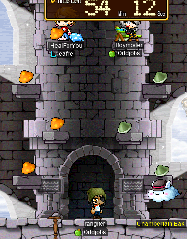
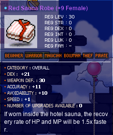

# rangifer’s diary: pt. xiv

You ever just do some (read: way too many) OPQs, and then call it a day?

## Decorating OPQ

Those who’ve done a number of OPQs will know that OPQ loves to give you ores (as an end reward). Not special ores, but like, [Aquamarine Ores](https://maplelegends.com/lib/etc?id=4020002) and shit. Now, most of them may be worthless, but that doesn’t make them any less beautiful. And OPQ is a bit of an austere place, so decorating it really helps to liven up the mood a little bit. I won’t go into a full-fledged photo gallery here, but here’s one possible example (although this one doesn’t make use of any ores):

## OPQing

When I logged on today, **Boymoder** and the crew (including **Aduro**, **Romain**, **Cleu**, **44ayuh**, and **KonekoDxD**) were already at it! I was fortunate enough to join them when **KonekoDxD** had to leave for a while:

## New robe!

Mid-OPQ, I bought myself a shiny new [robe](https://maplelegends.com/lib/equip?id=01051017)!:

Wearing something like this is not quite typical for brawlers/marauders/buccaneers, as they would rather wear well-scrolled [jobbed overalls](https://maplelegends.com/lib/equip?id=01052131), but I use robes like this (which lack job requirements and stat requirements) so that I can share them between my characters. I have five characters (at the moment… every time I tell myself that “this will be the last one”, I somehow manage to make yet another character >.<), and of those five, _four_ are pure STR:

- **cervid** (DEXless [STR priest](https://oddjobs.codeberg.page/odd-jobs.html#str-mage))
- **capreolina** ([woodman](https://oddjobs.codeberg.page/odd-jobs.html#woodsman))
- **hydropotina** ([swashbuckler](https://oddjobs.codeberg.page/odd-jobs.html#swashbuckler))
- **rangifer** (DEXless [pugilist](https://oddjobs.codeberg.page/odd-jobs.html#pugilist))

…and all four will be sharing this robe.

Here I am, trying it on for the first time:

Snazzy~

## OPQing: the sequel

We shedded some party members, but I was determined to recruit some more (and to find out what [the “Bigshot Megaphone”](https://maplelegends.com/lib/cash?id=5390009) looks like):

We were joined once again by my friend **sweetmochi**, and also recruited **Kimbow**, who was new to OPQ! We were also joined by **NobleFantasm** (a.k.a. **SiriusPlaque**, **SmallMight**), who I met [at MPQ](https://maplelegends.com/lib/map?id=261000021), and who kindly gifted me the [Toy of 101](https://maplelegends.com/lib/equip?id=01402038) that I use as my main melee weapon (mostly on my [STR priest](https://oddjobs.codeberg.page/odd-jobs.html#str-mage))! We discussed more about Toys of 101, questing, dying to [demon cat-dragons](https://maplelegends.com/lib/monster?id=9300044) in the pursuit of [crystals](https://maplelegends.com/lib/etc?id=4005000), and various other topics:

Upon hitting level **67**, rangifer hit the 3k MAXHP mark! It’s fun to — for once — be playing a character who isn’t either horribly squishy, or a mage…

## Boymoder ascends to the rank of STRmit

While we were OPQing, Boymoder hit level 70!!! That meant it was time not for first, not for second, but for _third_ job advancement!!!! And third job is where it really gets juicy for [STRlords](https://oddjobs.codeberg.page/odd-jobs.html#str-assassin), too… or should I say, “STRmits” ([homophonic](https://en.wikipedia.org/wiki/Homophone) with “stir mitts”).

And so it was. Boymoder is a hermit now!! Congrats!!! And, probably, MapleLegends’s first ever STRmit! Wowie~

## OPQing: the teaquel

Boymoder came back to OPQ, now equipped with level 1 [Avenger](https://maplelegends.com/lib/skill?id=4111005), just in time to join our second run (and later runs) with a new crew:

Kimbow was still with us, but also brought along **Pikemeister**. And **StabApples** (a member of **Oddjobs**, on his [HP warrior](https://oddjobs.codeberg.page/odd-jobs.html#hp-warrior) **DontDie**) joined as well, bringing along **Losers** guildmate **Pamzy**! Our first run (before Boymoder returned from her third job advancement quest) was a real doozy, as everyone besides myself (and, to some extent, Kimbow, although she had only started learning OPQ some 1 or 2 hours earlier…) was new to OPQ. I think everyone still got the hang of it! But it’s a lot more _chaotic_ than just one or two new people who are able to simply follow along with the rest of the party, haha.

By the end of all this, rangifer had done some **18** OPQs… I think that’s more than enough for one day, and that leaves rangifer at level 68. Just two more levels, and I can have my very own [personal bubble](https://maplelegends.com/lib/skill?id=5110001)! Wow.

I do have a lingering question about Energy Charge, though: won’t the maximum level (40) of the skill interfere with my use of [Ciders](https://maplelegends.com/lib/use?id=2022002)? My WATK is naturally _so low_ as a weaponless and shieldless combatant, that I rely on having a Cider (or some >20 WATK buff, in special cases) active at all times. But at maximum level, Energy Charge should override Ciders (as it also grants +20 WATK) any time that it triggers. Yet, it only lasts for 50 seconds, at which point it dissipates, and I am forced to use another Cider… Isn’t that a bit of a waste? Or maybe I’m misunderstanding something here.

