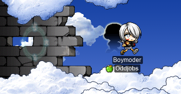
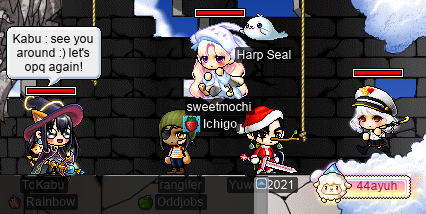
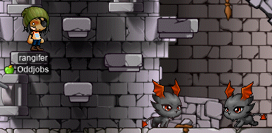
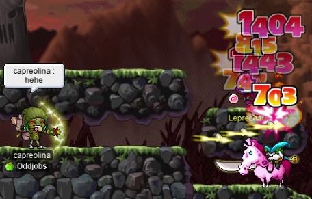
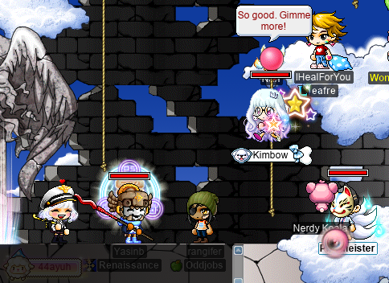
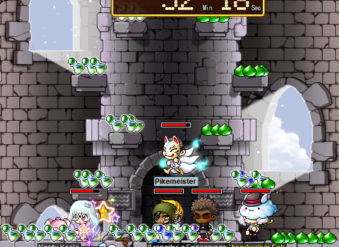
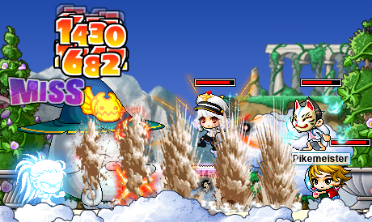

# rangifer’s diary: pt. xv

## Boymoder hits level 72

I logged on _just_ in time (really, it was instantly after I logged on) to see **Boymoder** hit level 72! And you know what that means: [Flash Jump](https://maplelegends.com/lib/skill?id=4111006)! She had been [PPQ](https://maplelegends.com/lib/map?id=251010404)ing, but came to [the OPQ lobby](https://maplelegends.com/lib/map?id=200080101) to say hi!:

Boymoder can now deftly swap between two roles: [permabeginner](https://oddjobs.codeberg.page/odd-jobs.html#permabeginner)-with-Flash-Jump, and [Avenger](https://maplelegends.com/lib/skill?id=4111005)-spammer-with-Flash-Jump!!

## OPQ with Kabu, sweetmochi, GucciMochi, KimKim, and Yuwen2021

We were having a bit of a rough time getting a party of 5~6 together for OPQ. But F/P wizard **Kabu** came to the rescue when I mentioned that I was recruiting for OPQ in alliance chat (Kabu also has an [HP fighter](https://oddjobs.codeberg.page/odd-jobs.html#hp-warrior) by the name of **Verta**, in **Oddjobs**)! Here we are, just before Kabu had to leave:

Two friends of mine, **GucciMochi** (a.k.a. **GucciKimchi**) and **KimKim** (a.k.a. **Melokie**, **Skateboard**, **Alrightyo**) offered to come to OPQ when I mentioned that we were looking to fill a missing spot! KimKim had to travel to Orbis by foot (and by ship), so we did an OPQ with GucciMochi (at which point we had two “mochi”s in our party, including **sweetmochi**) before she got there. GucciMochi had to go, so KimKim took her spot and enchanted us all with her glorious snow-white beard~

## 東京は雪が降っています

Once KimKim had to leave, we continued OPQing with various other people — with me during most of the OPQs that I did were my friends **IHealForYou** and **44ayuh**, and also **Kimbow** and **Pikemeister**! 44ayuh remarked that it was snowing in Tokyo (and too cold to go out with her kimono on), Kimbow remarked that it was also snowing in Sweden (perhaps less surprising), and IHealForYou remarked that it was _not_ snowing in the Netherlands, but was rather raining instead (perhaps even less surprising).

44ayuh taught us how to do [the spicy kitty room](https://maplelegends.com/lib/map?id=920010900). If you go down below the Tower of Goddess itself, you enter the jail… If that sounds miserable, well, it kind of is. It’s completely dark (you can only see things within a smol radius of yourself), there’s moving spikes and other assorted booby traps everywhere, and thus, making your way to any useful part of the jail is difficult. But if you can make it into one of the jail cells, you will find something a little strange (and even more scary):

That’s right, [_spicy kitties_](https://maplelegends.com/lib/monster?id=9300044). Spicy kitties are named analogously with [spicy water](https://en.wikipedia.org/wiki/Lava), because when they touch you, it feels spicy! Sometimes it’s _too_ spicy, and you die. :( But rangifer has [a taste for spiciness][hp], so I’m able to get past these spicy kitties to get to their spicy treasure:

Now, the treasure pictured above isn’t a very impressive one, although it’s at least better than nothing. And you do occasionally (I saw this twice) get absolutely nothing at all. But the treasure that these kitties guard can be as spicy as the feline guardians themselves, so I was having fun hunting for that spicy treasure in every OPQ we did after that.

## Big horseman, headless foot

As I was taking a break from OPQ, **OmokTeacher** (a.k.a. **Slime**) let me know in alliance chat that he found a [Headless Horseman (HH)](https://maplelegends.com/lib/monster?id=9400549) at [Forgotten Path](https://maplelegends.com/lib/map?id=610010005) (ooo, spoopy), in case I wanted to try killing him on my level 99 [wood(wo)man](https://oddjobs.codeberg.page/odd-jobs.html#woodsman), **capreolina**. To be honest, I’d never so much as _attempted_ fighting HH before, but OmokTeacher assured me that Forgotten Path has a safe spot where HH can’t even hit you. capreolina was already in [New Leaf City (NLC)](https://maplelegends.com/lib/map?id=600000000), so I was able to walk to Forgotten Path with relative ease — that is, with OmokTeacher’s instructions… I hardly know my way around that tangled forest on my own.

I managed to kill HH, again with relative ease, in almost exactly 10 minutes! I actually filmed the fight, but I don’t plan on uploading it, heh… It’s pretty boring; “what will she do next??”… the answer is probably “[Strafe](https://maplelegends.com/lib/skill?id=3111006)”. But [my birdie](https://maplelegends.com/lib/skill?id=3111005) was a nice boon to my DPS; I usually don’t get a ton of use out of said birdie when I’m at range. The birdie is much more substantial in melee, where there’s nothing to replace it. But I wasn’t about to get close enough to that headless jerk to melee them!

I checked channel 1 to see if there was still an HH there, even though I knew that [Bigfoot (BF)](https://maplelegends.com/lib/monster?id=9400575) had already spawned there. I thought, maybe it would be possible to kill HH by staying out of BF’s reach. And if I fail, well, I lose a [charm](https://maplelegends.com/lib/cash?id=5130000)… When I got there though, a level 160 bishop by the name of **SweetPoof** was killing the BF with their level 135 hero. I had gotten [one of Headless Horseman’s heads](https://maplelegends.com/lib/etc?id=4031903) already, so I thought I would ask for permission to loot [Bigfoot’s Toe](https://maplelegends.com/lib/etc?id=4032013) if it drops; that way, I would have both of the boss items required for [the Silver Deputy Star quest](https://bbb.hidden-street.net/quest/masteria/bounty-hunter)! SweetPoof was kind enough to oblige, and so while she had BF pinned to the left side of the map, I went to work killing the HH. I finished first, since HH has less than one ninth(!) of the HP that BF has, and quite a bit less WDEF, for that matter. But not too long after, BF was slain, and the toe did drop!! Thanks SweetPoof!!! Now I just need some of [those pesky rags](https://maplelegends.com/lib/etc?id=4032011)…

## rangifer advances to marauder!!

At this point, rangifer had already OPQed to level 70!!! It was time to finally get crackin’ on that third job advancement quest. As part of this, was the obligatory job instructor fight:

If you think you’re just seeing things, you’re not — there are not one, not two, not three, not even four, but _five_ [Kyrins](https://maplelegends.com/lib/monster?id=9001004) in that image. Kyrin, apparently, loves to summon clones. I’m also getting hit by three [Somersault Kicks](https://maplelegends.com/lib/skill?id=5001002) simultaneously in that image. >.<

But I did eventually subdue the _real_ (shadow) Kyrin, and then proceeded to ace the [Holy Stone](https://maplelegends.com/lib/npc?id=2030006)’s quiz on my first try — with a little help from [my friend](https://maplelegends.com/lib/).

And so it was. rangifer advanced to _marauder:_

I put my first SP into [the bubble skill](https://maplelegends.com/lib/skill?id=5110001); here’s rangifer in her first-ever bubble:

That means rangifer is officially a Big Girl™ now!! Wowie!!!

## rangifer’s final OPQs

Because OPQ has a level range of 51~70, rangifer was still eligible to OPQ (for one more level)! And so I rejoined the crew:

We taught, as usual, quite a few new people how to OPQ today! Here I am, demonstrating how clearing [the “On the Way Up” stage](https://maplelegends.com/lib/map?id=920010700) works:

It seems that the use of [Gray codes](https://en.wikipedia.org/wiki/Gray_code) is not popular in this stage…

Here, Kimbow and Pikemeister have decorated [the Lounge](https://maplelegends.com/lib/map?id=920010600), as a “gift” for IHealForYou (either that, or OPQ has an ectoplasm problem…):

After a few OPQs, I was nearing the end of the line… level 71. And so I did level, in the middle of an OPQ. It was time to flex my new level 71 powers in a party quest that was not intended to have such things…:

Yes, I’m aware that [Shockwave](https://maplelegends.com/lib/skill?id=5111006) (or [memewave](https://forum.maplelegends.com/index.php?threads/a-buccaneers-field-guide-2020.34735/), if you prefer) is not a very well-regarded skill… But I absolutely adore [Transformation](https://maplelegends.com/lib/skill?id=5111005), and little else brings me quite as much joy as dealing not-insignificant quantities of damage as I repeatedly punch the ground to cause mini-earthquakes. So I gotta put the meme skillpoint in there.

[hp]: https://en.wikipedia.org/wiki/Health_(game_terminology)
