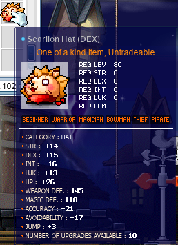
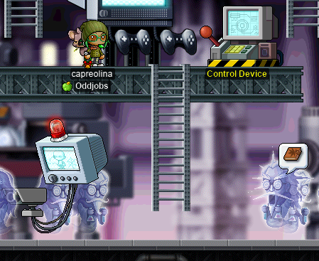
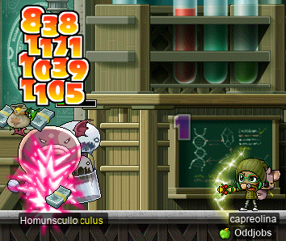
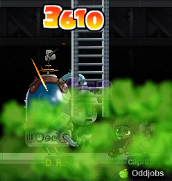
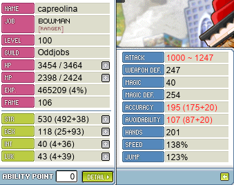
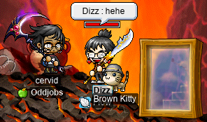

# rangifer’s diary: pt. xvii

## MPQ needs medical attention

It’s true. MPQ is one of my favourite PQs, and yet sadly dusty ;(

See also: “[Yeah, MPQ. It’s pretty obscure; you’ve probably never heard of it…](https://forum.maplelegends.com/index.php?threads/yeah-mpq-it%E2%80%99s-pretty-obscure-you%E2%80%99ve-probably-never-heard-of-it%E2%80%A6.34976/)”

I tried 2 [smegas](https://maplelegends.com/lib/cash?id=5072000) of this kind on two different occasions (along with some other smegas), to no avail.

Actually, someone who I was in a hopefully-MPQ party with (but who did not speak English very well) got smega muted for recruiting for MPQ. Now, I realise that it’s probably just an automated mute — the recruit message was perfectly innocent, but was exactly the same in most of the smegas, so maybe a spam filter caught it. But, it felt a little sad that someone got a smega mute for advertising the one PQ that needs it the most…

## Getting capreolina a new helm(s)

**capreolina** is my [wood(wo)man](https://oddjobs.codeberg.page/odd-jobs.html#woodsman), and when I got a [zhelm](https://maplelegends.com/lib/equip?id=01002357) for her (back when she was level 56 or so), I actually had pretty good luck; the STR/DEX/INT/LUK was 16/16/16/17! I’ve been slowly (they are expensive!!) buying [helmet for DEX 60% scrolls](https://maplelegends.com/lib/use?id=2040029) for a while now, since I basically need an unlimited quantity of them… such is the curse of having 941 (actually, just 5, but it feels like 941) characters. In any case, so far I’ve used 8(!) such scrolls on capreolina’s zhelm. At this point, 5 of those 8 have failed. Ouch. So much for 60% success rate, and so much for wasting even more money to finish off the last 2 slots.

Rather than give up, I plan to work up a fresh new helm, and switch to that helm once it (hopefully) surpasses the zhelm.

To that end, I decided that I wanted to try getting a [Scarlion Hat](https://maplelegends.com/lib/equip?id=01003025) instead of a Zakum Helmet this time. I’d actually never tried it before, so I had to figure out how to do the prequests. Luckily I found [a guide](https://maplesushi.wordpress.com/2009/10/30/scarlion-and-targa-quests/), and set to work completing the prequests so that I could buy a Scarlion Hat service:

If the backgrounds look a little mangled in some of these screenshots, it’s because I’ve turned down the graphics quality all the way. For some reason, Fantasy Theme Park is the one place where the game’s performance takes a nosedive (severely lowering framerate and making it difficult to play).

As I was hunting [Vikerolas](https://maplelegends.com/lib/monster?id=9420539), a level 155 [nightlord](https://maplelegends.com/lib/skill?id=4121007) by the name of **DeeTheDon** came along, while card-hunting, and apologised for killing some of the mobs on the map before he noticed that I was already there. In honesty, I didn’t even notice either, and I said not to worry about it. DeeTheDon asked what I was doing killing Vikerolas, and I said that I was not card-hunting, but just doing a quest. He graciously offered to help with the quest, asking what ETC items I needed:

And he even helped me out with all of the parts of the quests that I had yet to complete!! It was very nice of him, helping to kill the monsters that I needed for the quest even when they wouldn’t drop any cards he needed. The monsters required to be killed for the Scarga prequests are quite tough (like [Galloperas](https://maplelegends.com/lib/monster?id=9420540)), and I’m quite sure that it would have taken me _much_ longer without his help. Thanks again, DeeTheDon!!!

Fortunately for me, shortly after I finished the prequests, someone smega’d, selling Scarlion Hats. I agreed to pay for the service, and they assured me that I wouldn’t need any HP (good, since I don’t have much to spare as an unwashed archer…). Here I am, at the [Scarlion](https://maplelegends.com/lib/monster?id=9420547) run, cowering as far away from the boss as possible, alongside the party’s resident [SE](https://maplelegends.com/lib/skill?id=3221002) mule:

One of the two who were killing Scar, a level 169 [paladin](https://maplelegends.com/lib/skill?id=1221009) by the name of **Chronicles**, recognized my guild, **Oddjobs**, and was asking me a few questions about the guild and my odd job ([wood(wo)man](https://oddjobs.codeberg.page/odd-jobs.html#woodsman)) during the run. Funny enough, he demonstrated a technique that he likes to use with bosses like Scarlion, which he calls “mosh pitting” — a technique also commonly used by [permabeginners](https://oddjobs.codeberg.page/odd-jobs.html#permabeginner), particularly when trying to avoid a boss’s deadly magical attacks:

In this case, the benefit is mostly a lot of mesos saved due to [potions](https://maplelegends.com/lib/use?id=2002021) not being used.

Once Scarlion was finally dead for good, two hats dropped. I take this to be standard: one [DEX](https://maplelegends.com/lib/equip?id=01003025), one [STR](https://maplelegends.com/lib/equip?id=01003026) (correct me if I’m wrong, I’ve only been to one run). And so I got to loot both of them!:

")

On average, the DEX one is better for me. But as it turned out in this particular case, the STR one is clearly superior. Hopefully, I can land some 60%s on it >.<

…And they let me loot some of the crappier 60% scrolls that dropped from Scar, hehe. Thanks y’all!

## Finishing up the Magatia questline on capreolina

I’ve made it my goal to complete the [Magatia](https://maplelegends.com/lib/map?id=261000000) questline (which culminates in [For Phyllia](https://bbb.hidden-street.net/quest/mu-lung-nihal-desert/for-phyllia)) on all of my characters that graduate [MPQ](https://maplelegends.com/lib/map?id=261000021) (level 86+). **cervid** (my [STR priest](https://oddjobs.codeberg.page/odd-jobs.html#str-mage)) already completed the questline, but capreolina was only partway through. So it was off to [Authorized Personnel Only](https://maplelegends.com/lib/map?id=261020401) to fite some [Sites](https://maplelegends.com/lib/monster?id=6110301). Oh, and a [Security Camera](https://maplelegends.com/lib/monster?id=7090000), apparently:

Security Cameras are one of those weird minibosses that spawns in certain maps: they are initially completely invincible, but once you perform some ritual (in this case, talking to the[Control Device](https://maplelegends.com/lib/npc?id=2111025) NPC), they suddenly become very weak and easy to kill. Security Cameras are technically level 10(!) monsters (for reference, [Ribbon Pigs](https://maplelegends.com/lib/monster?id=1210101) and [Dark Stumps](https://maplelegends.com/lib/monster?id=1110101) are also level 10 monsters), but have 16k HP, a knockback damage threshold of 1500, and 300 WATK! Extremely overpowered for a level 10 monster, but quite modest in comparison to the Sites that spawn in the same map.

For [The Hidden Words](https://bbb.hidden-street.net/sub_quest/mu-lung-nihal-desert/the-hidden-words), a special quest item ([Homunsculer’s Blood](https://maplelegends.com/lib/etc?id=4031737)) has to be obtained by killing [Homunscullo](https://maplelegends.com/lib/monster?id=8110300):

Homunscullos are not bosses, but they strangely only spawn in one map, with two spawnpoints, each having a 90 minute respawn time. And they have a relatively impressive 27k HP. So they’re kinda like minibosses.

[The Black Magician’s Magic Pentagram](https://bbb.hidden-street.net/sub_quest/mu-lung-nihal-desert/the-black-magicians-magic-pentagram) has you kill [Homunculus](https://maplelegends.com/lib/monster?id=7110301) for a [Magic Stone of Honesty](https://maplelegends.com/lib/etc?id=4031740), although (according to Hidden Street, at least) in GMS it actually dropped from Homunscullos. And for the [Magic Stone of Trust](https://maplelegends.com/lib/etc?id=4031741), you have to obtain it from [D. Roy](https://maplelegends.com/lib/monster?id=7110300). Unfortunately, D. Roy drops [a card](https://maplelegends.com/lib/use?id=2384034), so finding a D. Roy can be a bit tricky. And because the Magic Stone doesn’t have a 100% drop rate, this ends up being kind of a pain in the ass in many cases.

On the way to [the map that spawns D. Roys](https://maplelegends.com/lib/map?id=261020500), I took a shortcut through [Secret Basement Path](https://maplelegends.com/lib/map?id=261030000) (which can only be entered after once has completed [the requisite quest](https://bbb.hidden-street.net/quest/mu-lung-nihal-desert/the-secret-quiet-passage)), and was surprised to meet someone in there!:

**BaiRanger** informed me that she was waiting for [a special miniboss](https://maplelegends.com/lib/monster?id=8220002) to spawn. That was news to me, as I didn’t even realise that monsters could spawn in that map!

capreolina got a little lucky, and I was able to find two D. Roys after not too long of channel surfing and waiting:

…And one dropped the stone! Yay! At that point the questline was basiclly complete, pending some annoying walking and talking (made easier, thanks to [TP rocks](https://maplelegends.com/lib/cash?id=5041000)), hehe.

## capreolina hits level 100~

Now that capreolina finished the Magatia questline, she only needed some 2~3% more EXP to level up form 99 to 100! So I headed to [the Phantom Forest](https://maplelegends.com/lib/map?id=610010004) in search of some [HH](https://maplelegends.com/lib/monster?id=9400549)s :P

Unfortunately, I didn’t find any at [Forgotten Path](https://maplelegends.com/lib/map?id=610010005), so I wandered around some of the other maps in search of an HH. And I did find one, at [Hollowed _\[sic\]_ Ground](https://maplelegends.com/lib/map?id=682000001). Killing an HH here is a _lot_ more difficult than at Forgotten Path, as there are [Jr. Wraiths](https://maplelegends.com/lib/monster?id=3230101) that rapidly spawn over the entire map (not great for when I’m using [my bow](https://maplelegends.com/lib/equip?id=01452045)), and no safe spot where I can attack HH without fear of retribution. I had GM buffs active, so I figured with the [HB](https://maplelegends.com/lib/skill?id=1301007) and the [HS](https://maplelegends.com/lib/skill?id=2311003), it was worth trying anyways. And it was rough; I very nearly ran out of GM buffs before HH went down, but I did make it! And that was enough to put capreolina into the triple-digit levels!!:

The 5 STR from leveling up was _just_ enough to put my damage range with my bow (with a [Cider](https://maplelegends.com/lib/use?id=2022002) active, but no [Echo](https://maplelegends.com/lib/skill?id=0001005)) into the quadruple-digit numbers, for both the top _and_ bottom of the range! ^^

## cervid finishes the Capt. Latanica quest

I had finished the [Capt. Latanica](https://maplelegends.com/lib/monster?id=9420513) prequest on my [STR priest](https://oddjobs.codeberg.page/odd-jobs.html#str-mage), cervid, but not actually done the quest to kill him yet. With the convenience of GM buffs active on me, I decided to take on this boss solo. With just GM buffs (20 WATK; same as a [Cider](https://maplelegends.com/lib/use?id=2022002)) + Echo, I was able to solo Capt. Latanica in just about 20 minutes and 28 seconds (20:28)! I filmed the whole thing, and [you can watch a timelapsed version of the fight on the Oddjobs YouTube channel](https://www.youtube.com/watch?v=-WmxpmtfSeg)~!

## Beginners need Zhelms, too!

Two of the [permabeginners](https://oddjobs.codeberg.page/odd-jobs.html#permabeginner) in **Flow** (a largely permabeginner guild that is part of the **Suboptimal** alliance, alongside **Oddjobs** and **Southperry**), **drainer** (a.k.a. **maebee**, **technopagan**) and **Dizz**, are around the level that they are trying to get a hold of a [Zakum Helmet](https://maplelegends.com/lib/equip?id=01002357). But, for those who have not played a permabeginner before, you should know that beginners have _extremely_ low MAXHP. If you thought that assassins, archers, and gunslingers were fragile… try a beginner on for size. So even getting to [Entrance to Zakum Altar](https://maplelegends.com/lib/map?id=211042400) (necessary to do the prequests) proves difficult or impossible for a level 50~60 beginner.

Dizz was talking about this in alliance chat, and I honestly forgot for a few seconds that I was even playing a priest, because I offered to kill monsters to help clear the way… but of course, I could just [door](https://maplelegends.com/lib/skill?id=2311002) them there! Dizz wanted to try walking up, so we were taking the hike up to the [Forest of Dead Trees](https://maplelegends.com/lib/map?id=211041100), while I [doomed](https://maplelegends.com/lib/skill?id=2311005) some of the more powerful monsters that got in the way. Unfortunately, at one point Dizz slipped and fell, instantly dying to a [Lycanthrope](https://maplelegends.com/lib/monster?id=8140000). So we decided it was better for me to just go the rest of the way and then put up a door:

And the next day, I also helped put up a door for drainer, who had never done the Zakum prequests before — what a treat, to do the Zakum prequests for the first time… >.<

## Grinding Fancy Amps with Taima

**Taima** (a.k.a. **Boymoder**, **Tacgnol**) logged on, and we both wanted to MPQ… but since MPQ was not exactly a happenin’ place, we decided to do something else in the meantime, while I idled in [the MPQ lobby](https://maplelegends.com/lib/map?id=261000021) as rangifer. Taima wanted to train, and at least for now (especially when the permabeginners are planning to take on [Leviathan](https://maplelegends.com/lib/monster?id=8220003)(!) in just two weeks), the spot to be is [at Voodoos](https://maplelegends.com/lib/map?id=682000501), because they have such low WATK (no potions really necessary, when every hit that you take is for 1 damage), and more importantly, drop [Heartstoppers](https://maplelegends.com/lib/use?id=2022245) to be used at boss runs. But since I offered to come along and train as well, Taima decided that we were better off grinding for very high (by our standards) EPH, and so the place to be was [at Fancy Amps](https://maplelegends.com/lib/map?id=742010201):

We grinded at Fancy Amps as a duo of level 103 beginner and level 101 STR priest for… a long time. Pretty mentally exhausting, but by the end of it, I was roughly 22.5% higher in EXP than when we started! And Taima saw a similar increase as well, although obviously a bit less due to the level difference between us. I recorded a little EPM test (`@epm 3`) to get an idea of what our peak EPH was like, and we were getting something like 1.7M EPH at peak! Wow! Not bad for some basic-attacking goofballs like ourselves.

I had put a single meme SP into [Summon Dragon](https://maplelegends.com/lib/skill?id=2311006) on my previous levelup, so Taima kindly gave me a few [Summoning Rocks](https://maplelegends.com/lib/etc?id=4006001) to try it out! At level 1, it actually only lasts 10 seconds, but here is a crappy screenshot of us testing out whether it **MISS**es or not (spoiler: it **MISS**es every time):

But that’s OK, because they are my cute tiny dragonito friend~

## cervid tries out card-hunting

Now, cervid was my first real character on MapleLegends, and as a result, I was a bit clueless about what monster cards were… Add to that the fact that I was largely questing early on (and doing some training in [Ellinia tree dungeons](https://maplelegends.com/lib/map?id=100040001)), and cervid has the fewest card sets out of all of my characters, despite being the oldest and highest-level. >.< After grinding Fancy Amps with Taima, Taima was talking about card hunting to get her [tier 2 ring](https://maplelegends.com/lib/equip?id=01119004). I checked my book (and `@checkstat`), and found that I had (and it pains me to say this) just 3 sets…:

- [Slime](https://maplelegends.com/lib/use?id=2380005) (of course).
- [Dark Axe Stump](https://maplelegends.com/lib/use?id=2381008) (because why not…?).
- [Franken Lloyd](https://maplelegends.com/lib/use?id=2388014) (MPQQQQQQQ~).

Ahem. So, I figured I should probably get that huntin’ goin’:

And I even got some [gachapon tickets](https://maplelegends.com/lib/cash?id=5220010) along the way~:

After a bit of mucking about around [Henesys](https://maplelegends.com/lib/map?id=100000000) and [Lith Harbour](https://maplelegends.com/lib/map?id=104000000) — including a very oddly-shaped, biodiverse, and otherwise basically useless map that I love, by the name of [Beach Hunting Ground](https://maplelegends.com/lib/map?id=104010002) — I’m now at an ever-so-slightly more respectable card set count of 7. Expect more card-hunting in the future, I hope~

And Taima got her tier 2 ring! Yayy!! <3
