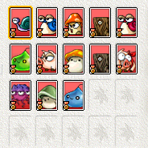
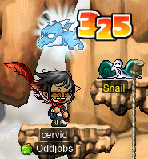
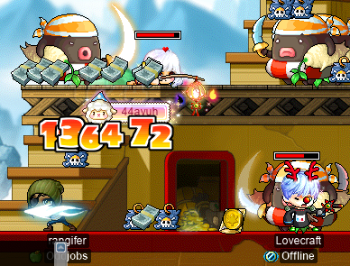
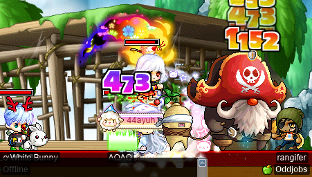

# rangifer’s diary: pt. xviii

## More card-hunting for cervid~

I did some more card-hunting on my [STR priest](https://oddjobs.codeberg.page/odd-jobs.html#str-mage), **cervid**, as my goal is to at least get a [tier 1 ring](https://maplelegends.com/lib/equip?id=01119003) for her! I was still working on that first page, so it was all Victoria Island maps for me:

cervid card-hunting for that first page~

And I’ve completed the entire first page!!:

Yay! ^^

While I was in Victoria Island, I decided to try out [my dragonito](https://maplelegends.com/lib/skill?id=2311006) again, but this time on some much lower-level monsters. Here I am, with a [Wizard Elixir](https://maplelegends.com/lib/use?id=2002018) active and my [Crimson Arcglaive](https://maplelegends.com/lib/equip?id=01442068) in hand, watching my lil dragonito absolutely _slay_ some [Snails](https://maplelegends.com/lib/monster?id=0100100):

## Training at Voodoos with Taima!

My level 103 [permabeginner](https://oddjobs.codeberg.page/odd-jobs.html#permabeginner) friend and guildmate **Taima** was training [at Voodoos](https://maplelegends.com/lib/map?id=682000501), to get some EXP, and equally importantly, some [Heartstoppers](https://maplelegends.com/lib/use?id=2022245) for permabeginner/odd-jobbed boss runs~ I decided to join her, and by our powers combined, we were able to squeeze out some 850k EPH or so! Not as good as the roughly 1.7M from grinding [at Fancy Amps](https://maplelegends.com/lib/monster?id=9410029), but pretty respectable for such an easy place to train, that also gives those sweet Heartstoppers. Training at Voodoos is particularly easy for permabeginners like Taima, because of the way that WDEF’s effectiveness varies based on the combination of your class and level. Beginners can get hit for 1 damage every time by [Voodoos](https://maplelegends.com/lib/monster?id=9400561) with only a relatively modest WDEF. As a STR priest, on the other hand, I was getting hit for roughly 60~70 damage per hit, even with all of my gear equipped, max [Magic Armour](https://maplelegends.com/lib/skill?id=2001003), and max [Invincible](https://maplelegends.com/lib/skill?id=2301003)!

## Finally MPQin’ a lil

**Boymoder** (a.k.a. Taima, **Tacgnol**) and I were able to, eventually, pull together a functional [MPQ](https://maplelegends.com/lib/map?id=261000021) party. It was the two of us, plus **Whitebeard1** (who I was already familiar with, having [OPQ](https://maplelegends.com/lib/map?id=200080101)ed and MPQed with him before), and **IHealForYou**, who is a friend of mine from OPQ. IHealForYou was new to MPQ, so Boymoder and I showed him the ways~

Whitebeard1 is — like me — a marauder, but does… a lot more damage than I do, thanks to being an ordinary marauder, rather than a [pugilist](https://oddjobs.codeberg.page/odd-jobs.html#pugilist) like myself. So when we finally got to the final stage (boss fight), I decided that even with a relatively small amount of time on the clock (only 15 minutes or so, because we were a bit slow in the earlier stages, as Whitebeard1 and IHealForYou were still learning), we should fight [Angy Fanky](https://maplelegends.com/lib/monster?id=9300140) for the big EXPs, and “true ending” of the PQ.

Unfortunately, Whitebeard1 (and IHealForYou) were having some internet issues, and our main DPS, Whitebeard1, died almost immediately after the boss fight started:

Because IHealForYou was having internet issues as well, he died later on in the boss fight. Boymoder and I tried our damnedest to kill Angy Fanky before time ran out (we gave up on protecting [Romeo](https://maplelegends.com/lib/npc?id=2112009) about halfway through), but once we had run out of time, Angy Fanky was unfotunately still at 2% HP or so. :/

We did another MPQ, which fortunately was much faster and cleaner — although this time, of course, we went with [Non-Angy Fanky](https://maplelegends.com/lib/monster?id=9300139). Not the true ending, but still, we at least fully completed the PQ and each got our random end-reward items and [marbles](https://maplelegends.com/lib/etc?id=4001160).

## Loitering at MPQ

After the two MPQs that we did, it’s mostly been loitering in the MPQ lobby, unfortunately. My friend from OPQ, **44ayuh**, has been waiting with me, along with Whitebeard1 and Boymoder. Here I am, loitering in the Alcadno MPQ lobby, dabbing:

And here I am in the same place, but naked — at least, naked NX-wise:

I _look_ like I do a lot of damage. But, looks can be deceiving…

And here I am, joined by 44ayuh and **Lovecraft**, as we wait for a mage (MPQ requires at least 1 mage):

## PPQ it is

Eventually, 44ayuh, Lovecraft, and I gave up, and decided that it was [PPQ](https://maplelegends.com/lib/map?id=251010404) time:

I’m not a big fan of PPQ myself, and the EXP is more geared towards characters in the 55~70 level range (somewhat similar to OPQ), but it was nice to try it out on my pugilist~

