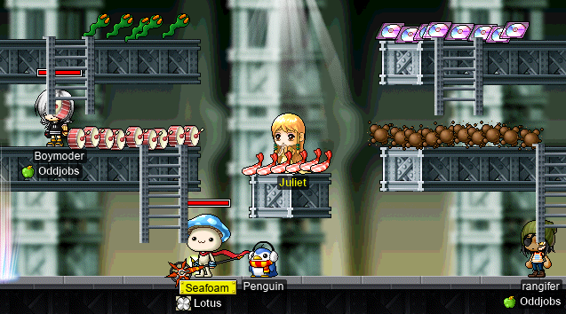
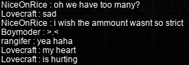
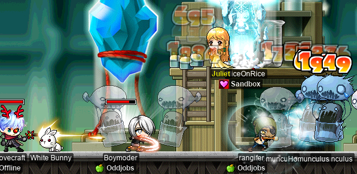
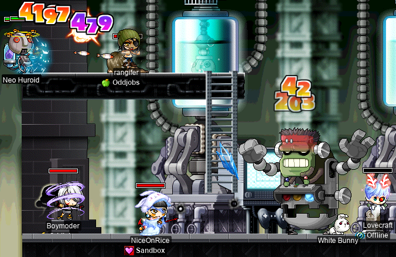

# rangifer’s diary: pt. xxi

## cervid solos bosses~

I’ve posted two videos of **cervid** (by [STR priest](https://oddjobs.codeberg.page/odd-jobs.html#str-mage)) soloing bosses, and forgot to include them in the previous diary entry. Both of these bosses are level 100~

Here I am, soloing [Capt. Latanica](https://maplelegends.com/lib/monster?id=9420513) in 20 minutes and 28 seconds (most of the fight is [timelapsed](https://en.wikipedia.org/wiki/Time-lapse_photography) for brevity):

[**Level 101 STR priest solos Capt. Latanica in 20:28 w/ Echo + 20 WATK buff**](https://www.youtube.com/watch?v=-WmxpmtfSeg)

And here I am, soloing two(!?) [Crimson Balrogs](https://maplelegends.com/lib/monster?id=8150000) at once:

[**STR priest solos 2 Crimson Balrogs**](https://www.youtube.com/watch?v=vBaELbfJVqE)

## Boomin’ ducks

I’ve had five [level 100 Duck Tubes](https://maplelegends.com/lib/equip?id=01322064) sitting in my inventory, that I got from opening boxes during the last summer event. At the time, I was just hoping that one day I would manage to achieve level 100 at all. Well, I now have a level 105 [STR priest](https://oddjobs.codeberg.page/odd-jobs.html#str-mage) and a level 100 [wood(wo)man](https://oddjobs.codeberg.page/odd-jobs.html#woodsman), both of whom could make good use of such a Duck Tube, especially when paired with a nice shield! So I decided it was time to round up those duckies and give em a couple good scrolls. Because the Duck Tube has kinda underwhelming WATK (90 on average), is a one-handed blunt weapon, and isn’t particularly fast (speed 5, which is generally the slowest speed you would expect from a one-handed weapon), it needs a good scrollin’. Thankfully, one-handed blunt weapon scrolls (particularly, for our case, [30% for WATK](https://maplelegends.com/lib/use?id=2043205)) are quite cheap. So I was pretty excited to scroll these:

- 86 WATK, 3 AVOID, 5 SPEED
- 92 WATK, 4 AVOID, 5 SPEED
- 94 WATK, 4 AVOID, 4 SPEED
- 94 WATK, 4 AVOID, 6 SPEED
- 95 WATK, 3 AVOID, 5 SPEED

All of these were clean, so 7 slots each. This is a pretty damn good lineup; four out of the five tubes are above average, and the average WATK of all five tubes is 92.2 > 90.

I used 30%s on every one of these bad boys, and you’ll never guess what happened: all five (no really, every single one) boomed on the first slot! Wow! I really _do_ love scrolling. Haha!

## Chillin’ with Gambolpuddy-chan

**Taima** (a.k.a. **Boymoder**, **Tacgnol**, **Yotsubachan**) got the itch to play a [DEXginner](https://oddjobs.codeberg.page/odd-jobs.html#dex-beginner), so she went ahead and made one by the name of [**Gambolpuddy**](https://en.uesp.net/wiki/Lore:Gambolpuddy)! Gambolpuddy-chan has big stronk (weapon) accuracy, and big stronk minimum damage that lays waste to every shroom in sight!! Here I am, as my [besinner](https://oddjobs.codeberg.page/odd-jobs.html#besinner) **hashishi**, training with Gambolpuddy-chan:

At the end of the day, don’t we _all_ just wanna KPQ?

## MPQ with Seafoam and taipan

While I was playing hashishi alongside Gambolpuddy, we both were also on our MPQ-level characters: for me, **rangifer** the [pugilist](https://oddjobs.codeberg.page/odd-jobs.html#pugilist), and for Gambolpuddy, **Boymoder** the [STRlord](https://oddjobs.codeberg.page/odd-jobs.html#str-assassin). A [smega](https://maplelegends.com/lib/cash?id=5072000) or two later, and we managed to pull together people for a functional MPQ party! Joining us were two priests: **Seafoam** and **taipan**!:

Unfortunately, shortly before we could finish the third stage of our first MPQ, taipan bit the dust:

D:

taipan has limited time, so she decided she had to leave anyways. But we were able to finish that MPQ. We opted for [the calm version of Angy Fanky](https://maplelegends.com/lib/monster?id=9300139)…:

We also had some fun decorating [the Juliet-side MPQ lobby](https://maplelegends.com/lib/map?id=261000021):

And Seafoam said that his [penguin](https://maplelegends.com/lib/cash?id=5000023) needed a name, so my immediate suggestion was **Heliodorf**. After all, what better name for a smol penguin? And so it was:

Seafoam was new to MPQ, so Boymoder and I taught him the ropes. He said he enjoyed the PQ, so maybe we’ll see Seafoam (and/or one of his other characters) at MPQ again soon!!

## cervid trawls the Orbis Tower for cards

You already know what it is: more card-hunting for cervid! This time, featuring [the Orbis Tower](https://maplelegends.com/lib/map?id=200080200)!:

Orbis Tower card finds~

After finding these sets, I can probably get away with just finishing up some partially-completed sets to get my [T1 ring](https://maplelegends.com/lib/equip?id=01119003)~

## MPQ be bumpin’

Another day, hopefully more MPQs! And to my pleasant surprise, we got the MPQ lobby pretty bumpin’!:

Unfortunately, while we did have quite a few people, we were _just_ short of the number of folks (8) that we would need to split into two parties. MPQ regrettably requires _exactly_ 4 players per party:

But we were able to resolve the issue after a while, effectively splitting into two parties. In my party was Boymoder, an outlaw by the name of **Lovecraft**, and an I/L mage by the name of **NiceOnRice**. The rest of us were, uhm, maybe not so hot when it came to dishing out damage, buy NiceOnRice proved to be more than capable of picking up the slack. Here we are, farming up some [liquids](https://maplelegends.com/lib/etc?id=4001132) in stage 3:

Our first [Angy Fanky](https://maplelegends.com/lib/monster?id=9300140) fight didn’t go terribly well; Lovecraft found his pet to be inadequate for his HP-potion-using needs:

…But we made it through the fight just fine (if perhaps more slowly), and saved [Romeo](https://maplelegends.com/lib/npc?id=2112009) successfully~

Our PQs after that were generally smoother, and at one point we were joined by the priest **lostbearbear**, who is also pictured above.

And rangifer is now level 75 (and more than halfway to 76~)!!

## Party at Maya’s house

Some buddies of mine who I met as **rusa** (my [DEX spear(wo)man](https://oddjobs.codeberg.page/odd-jobs.html#dex-warrior)) [at LPQ](https://maplelegends.com/lib/map?id=221024500), including **ToxicChicken** and **Hemo** (a.k.a. **hxmo**), hosted a party [at Maya’s house](https://maplelegends.com/lib/map?id=100000001) (a map which is bizarrely called “Henesys Townstreet”) during the hour before a server maintenance.

Much mesos were showered around, many illicit drugs were consumed, mae (**drainer**, **maebee**, **xX17Xx**) was there, **JamesCharIes** paid a visit (and even shared a few top-secret beauty tips), we helped a new player learn how MapleLegends works, and **Kimmy** even paid a visit (presumably to bust us, but this was 2~3 minutes before a maintenance, so we were all about to scram anyways…):

