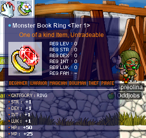

# rangifer’s diary: pt. xxii

## Scrolling a STR robe

I’ve been almost exclusively using [DEX](https://maplelegends.com/lib/use?id=2040501) robes (both [bath](https://maplelegends.com/lib/equip?id=01051098) and [sauna](https://maplelegends.com/lib/equip?id=01051017)) on my physical-attacking characters for a while now, since I benefit from the extra damage, WACC, and those who can also range (my [wood(wo)man](https://oddjobs.codeberg.page/odd-jobs.html#woodsman) **capreolina** and my [swashbuckler](https://oddjobs.codeberg.page/odd-jobs.html#swashbuckler) **hydropotina**) can benefit even more from the extra damage, when at range. Now that I have **rusa**, my [DEX spear(wo)man](https://oddjobs.codeberg.page/odd-jobs.html#dex-warrior), I decided to invest in a [STR](https://maplelegends.com/lib/use?id=2040532) robe as well!

The DEX robe that I normally use works well enough on rusa, but she really only cares about the damage (she has _plenty_ of WACC…), and DEX doesn’t contribute _nearly_ as much STR to her damage. The reason for this is not that rusa is pure DEX, but because she is a warrior using appropriate weapons (polearms and spears, in this case). That means [mastery](https://maplelegends.com/lib/skill?id=1300001), and quite high PSM (primary stat multiplier) values. In particular, polearms have an “average” (ignoring the effects of any WDEF) PSM of 5.0 ⋅ 60% + 3.0 ⋅ 40% = 4.2. But that’s when basic-attacking (or using skills that animate identically, like [Power Strike](https://maplelegends.com/lib/skill?id=1001004) or [Slash Blast](https://maplelegends.com/lib/skill?id=1001005)); in third job, rusa will have access to skills like [Dragon Fury: Polearm](https://maplelegends.com/lib/skill?id=1311004) and [Spear Crusher](https://maplelegends.com/lib/skill?id=1311001), both of which guarantee a PSM of 5.0(!) on every hit. This means that, depending on how you estimate it, each point of STR contributes as much damage as somewhere between 3.0 and 3.8 points of DEX!

And, in any case, a STR robe could be useful on my other characters as well, in contexts where I can stand to lose the WACC.

Unfortunately, while I was able to get a number of good results when [owling](https://maplelegends.com/lib/cash?id=5230000) for [male robes](https://maplelegends.com/lib/equip?id=01050100) scrolled for STR, nothing came up after a few owls (and even [smegas](https://maplelegends.com/lib/cash?id=5072000)) for female ones. And come to think of it, I’ve owled for female robes many (really, very many) times… and I don’t recall ever seeing a STR one. So it seemed that I had to go for it myself~

I sunk more mesos into this than I’d like to admit, and after booming a number of them — mostly with [70%s](https://maplelegends.com/lib/use?id=2040531), because more than half of the 70%s that I used boomed, although I did use two [30%s](https://maplelegends.com/lib/use?id=2040533) (ow, pricey!!) — I ended up with no real choice other than [60%](https://maplelegends.com/lib/use?id=2040532)ing the whole way:

")

…Aaaaand it’s average! I may have lost a sizeable amount of net worth in the process, but at least this robe is, uhm, usable. So rusa will be sticking with this one for the foreseeable future~

## cervid gets her T1 ring!

My [STR priest](https://oddjobs.codeberg.page/odd-jobs.html#str-mage), **cervid**, was back at it again with the card hunting. And with my very first monster book ring in sight!:

Hunting to 30 card sets~

Ah, finally. That last [Cactus card](https://maplelegends.com/lib/use?id=2381023) was all I needed. Oh, and a [Garnet](https://maplelegends.com/lib/etc?id=4021000)!:

I know it might seem kinda dumb (the [tier 1 ring](https://maplelegends.com/lib/equip?id=01119003) is not exactly considered a big accomplishment, especially with 9 higher tiers…), but it was cool to finally do some card-hunting in earnest and get myself my first-ever monster book ring. ^^

## Finishing capreolina’s Scar Hat

As detailed in diary pt. xvii, my [wood(wo)man](https://oddjobs.codeberg.page/odd-jobs.html#woodsman) **capreolina** paid for a [Scarlion](https://maplelegends.com/lib/monster?id=9420549) run and got two hats (one [STR](https://maplelegends.com/lib/equip?id=1003026), one [DEX](https://maplelegends.com/lib/equip?id=1003025)). Since then, I have tried my hand at [scrolling](https://maplelegends.com/lib/use?id=2040029) the better of the two (the STR one), and finished it with excellent results!!:

Finally, some good scrolling results!!! Now capreolina’s headgear is all sorted ^^

Maybe I will [scroll the other one for HP](https://maplelegends.com/lib/use?id=2040004)…

## Meet potpan

As some readers may already know, I’ve been [advocating for MPQ](https://forum.maplelegends.com/index.php?threads/yeah-mpq-it%E2%80%99s-pretty-obscure-you%E2%80%99ve-probably-never-heard-of-it%E2%80%A6.34976/) for a little while now, and I figured it’s time to suck it up and make Yet Another Character™ so that I can have an MPQ mule. I don’t think I’ve seen any MPQ mules before (unlike mules for KPQ and LPQ), but of course, any MPQ mule would have to be a mage of some kind. So here she is, all ready to KPQ:

Her name is **potpan**; just like she is (or rather, will be) a servant of Romeo & Juliet PQ, she is named after [Potpan](https://en.wikipedia.org/wiki/Characters_in_Romeo_and_Juliet#Anthony,_Potpan,_unnamed_Servants), a servant in William Shakespeare’s [_Romeo & Juliet_](https://en.wikipedia.org/wiki/Romeo_and_Juliet). potpan will be my only character who isn’t an odd job; she will just be an ordinary, INT-based, F/P mage. As a result, she will likely not feature very heavily in this diary. But on one glorious day (I hope), she will achieve level 71 and meet her true calling!!

## capreolina gets her T1 ring also~

Now that cervid got her T1 ring, I want to work on some of my other characters’ rings as well. capreolina needs rings even more than cervid, since she is quite fragile, being an archer and all that. Luckily for capre, I made her after cervid, when I was a little more aware of what monster cards were, so I already had 23 or so sets completed. Here’s capre, finishing up 7 more partially-completed sets:

capre wants that T1~

And so it is. Now capre doesn’t have to lug that stinky [T0 ring](https://maplelegends.com/lib/equip?id=01119002) around anymore, either ^^

