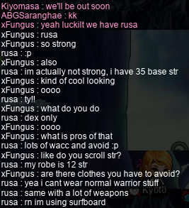

# rangifer’s diary: pt. xxvi

## Dextrous arm, agile punch?

In diary pt. v, I explored the math behind third job [pugilists](https://oddjobs.codeberg.page/odd-jobs.html#pugilist). In particular, the intent was to compare to a third job [STRmit](https://oddjobs.codeberg.page/odd-jobs.html#str-assassin), as a kind of hypothetical “**rangifer** vs. **Boymoder**”. Here, I want to use a similar model, with similar assumptions, to compare this hypothetical pugilist to a hypothetical third job [DEXaneer](https://oddjobs.codeberg.page/odd-jobs.html#dex-brawler): all skills in question are maxed out, the monster target is the same level as the attacking player character, the monster target has 400 WDEF, attacks are uninterrupted, etc. Oh, and the DEXaneer needs some stats/gear (again, for consistency, based on a roughly level 100 DEXaneer):

- 60 STR (11 of which is from the scrolled [Maple Golden Claw](https://maplelegends.com/lib/equip?id=01482022), and 45 of which is from other gear)
- 571 DEX (50 of which is from gear)
- 105 WATK (72 from [knuckler](https://maplelegends.com/lib/equip?id=01482022) + 20 from [Energy Charge](https://maplelegends.com/lib/skill?id=5110001)/[Cider](https://maplelegends.com/lib/use?id=2022002) + 3 from [cape](https://maplelegends.com/lib/equip?id=01102084) + 10 from gloves)

Oh, and what is so great about [DEX brawlers](https://oddjobs.codeberg.page/odd-jobs.html#dex-brawler), you ask? Well, a number of things:

- Like so many other odd jobs who rely on secondary stats for damage, DEXaneers have _much_ more stable damage than their ordinary STR-based counterparts.
- DEXaneers have _the highest WACC of any job in the game_, for a few reasons:
    - They are pure DEX (duh). And more pure than, say, [DEX warriors](https://oddjobs.codeberg.page/odd-jobs.html#dex-warrior) or [DEX mages](https://oddjobs.codeberg.page/odd-jobs.html#dex-mage), because those jobs need other stats (STR and INT respectively) for job advancement.
    - Brawlers/marauders/buccaneers gain a whopping 0.9(!) WACC per point of DEX. This is significantly more than any other job; in second place are the warriors/magicians/[beginners](https://oddjobs.codeberg.page/odd-jobs.html#dex-beginner), who get 0.8 WACC per DEX.
    - Like many other jobs, brawlers can benefit from +20 WACC due to [mastery](https://maplelegends.com/lib/skill?id=5100001) from second job onwards, but _in addition to that_, brawlers also have the +20 WACC from [Bullet Time](https://maplelegends.com/lib/skill?id=5000000)!
    - The DEXaneer’s weapon of choice is the [Maple Golden Claw](https://maplelegends.com/lib/equip?id=01482022), which grants a whopping 30(!) WACC on average, clean.
    - In third job, the DEXaneer benefits from [Energy Charge](https://maplelegends.com/lib/skill?id=5110001), which, at max level, when active, grants a +20 WACC buff. This is more than you would get from consumables (barring rarer, unavailable-from-NPCs ones like [Amorian Baskets](https://maplelegends.com/lib/use?id=2022181)), and is on par with [Bless](https://maplelegends.com/lib/skill?id=2301004).
- DEXaneers also have the highest AVOID of any job in the game… well, usually. In MapleLegends, DEXaneers were severely nerfed due to the preponderance of, uh, muling, present in MapleLegends. In more GMS-like servers, DEXaneers will get a whopping 1.5 AVOID per point of DEX!! That, combined with the AVOID from [Bullet Time](https://maplelegends.com/lib/skill?id=5000000) and even [Energy Charge](https://maplelegends.com/lib/skill?id=5110001), can make DEXaneers into some real slippery bastards!
- DEXaneer swag (duh).

OK then, on to the numbers! I’ll be making use of [my damage calculator](https://oddjobs.codeberg.page/dmg-calc/) for crunching these numbers:

### [Energy Drain](https://maplelegends.com/lib/skill?id=5111004)

Energy Drain is the marauder’s main single-target DPS skill (at least, for pugilists, DEXaneers, and normal marauders). Entering all of the relevant data for this hypothetical Energy Drain (“Damage multi” should be 360%, since we assume Energy Drain to be maxed), we immediately notice something: the damage is _much_ more stable than the pugilist’s. This is, of course, to be expected; pugilists tend to have perhaps the most unstable damage in the game (yes, even more unstable than that of the [STRginner](https://oddjobs.codeberg.page/odd-jobs.html#permabeginner)!), and DEXaneers are expected to have even more stable damage than their non-odd-jobbed counterparts. The damage range per-hit is 1882~2527 (compare this to the pugilist’s 1~4652), and the [CV](https://en.wikipedia.org/wiki/Coefficient_of_variation) per-hit is 8.4% (compare this to the pugilist’s whopping 57.7%!).

The actual _[expected](https://en.wikipedia.org/wiki/Expected_value)_ damage per-hit here is roughly 2204.1 (somewhat worse than the pugilist’s 2326.5). Fortunately for the DEXaneer, they can use [booster](https://maplelegends.com/lib/skill?id=5101006) to achieve one speed category better than the pugilist; the [Maple Golden Claw](https://maplelegends.com/lib/equip?id=01482022) is speed 5, minus 2 from booster bringing it to speed 3, whereas bare hands have speed 4. This assumes no [Speed Infusion](https://maplelegends.com/lib/skill?id=5121009), because we are considering third job here (the pugilist is more favourable by fourth job, because SI does work on unarmed combatants), so the _DPS_ ends up being ever-so-slightly more favourable for the DEX marauder, in the end: 4321.8 DPS (versus the pugilist’s 4308.3 DPS). Of course, this is basically a tie; the difference here can be easily bridged by minor adjustments in equipment. But, we can at least reasonably conclude that at this level (roughly 100), versus a roughly 400 WDEF monster, the DEXaneer is a bit worse in per-hit damage, but makes up for it with a bit faster attacking speed.

It’s worth noting here, that any WATK or STR that the DEXaneer can get from their gear represents a large advantage for them over the pugilist. The WATK advantage is obvious; the pugilist’s only methods of increasing their WATK is from secondary equipment like [capes](https://maplelegends.com/lib/equip?id=01102084) (particularly when combined with [Chaos Scrolls](https://maplelegends.com/lib/use?id=2049100) and some good luck), [gloves](https://maplelegends.com/lib/equip?id=01082179), and even [pendants](https://maplelegends.com/lib/equip?id=01122059) (again, particularly when combined with a Chaos Scroll and some good luck). But DEXaneers have the modest advantage of using a weapon. They are still somewhat similar to the pugilist, in that they are very limited beyond a certain relatively early level; their best bet is the [Maple Golden Claw](https://maplelegends.com/lib/equip?id=01482022). But the Maple Golden Claw is situated further on in the game, at level 64, rather than the pugilist’s capped WATK from level 31 onwards. And the Golden Claw can at least, in principle, be scrolled arbitrarily well. The pugilist patiently awaits the day that they can scroll their own fists!

The disparity in STR is perhaps more stark: the [effective](https://en.wikipedia.org/wiki/Expected_value) PSM (primary stat multiplier) for the second/third/fourth job pugilist is (4.2 + 4.2 ⋅ 0.1 ⋅ 0.9) ÷ 2 = 2.289. The effective PSM for the second/third/fourth job DEXaneer is (4.8 + 4.8 ⋅ 0.6 ⋅ 0.9) ÷ 2 = 3.696. This means that the DEXaneer benefits roughly 3.696 ÷ 2.289 = 1.615 _times_ more from each point of STR. But actually, this advantage is even greater, because the DEXaneer has so much more WATK. In any case, of course the DEXaneer has a hard time getting STR (as they have 4 base STR for life), but the point is that their equipment empowers them more than it does the pugilist (who suffers from lower WATK and a lower effective PSM).

But what about [Stun Mastery](https://maplelegends.com/lib/skill?id=5110000)? You can [check for yourself](https://oddjobs.codeberg.page/dmg-calc/), but because Stun Mastery is only taken into account after WDEF, it doesn’t really change anything about the comparison of DEXaneer vs. pugilist.

### [Energy Blast](https://maplelegends.com/lib/skill?id=5111002) (+ [Somersault Kick](https://maplelegends.com/lib/skill?id=5001002))?

Again, skill bonuses are after WDEF, so we will skip this corresponding section from the original “[STRlord](https://oddjobs.codeberg.page/odd-jobs.html#str-assassin) vs. pugilist”.

## hydro ruins a helm, and gets a new one…

My level 85 [swashbuckler](https://oddjobs.codeberg.page/odd-jobs.html#swashbuckler), **hydropotina**, has been using her [zhelm](https://maplelegends.com/lib/equip?id=01002357) since level 51 or so. As usual, I like to play it safe: I get/buy a helm, and then use 60% and/or 100% scrolls on it. [Helmet for DEX 60% scrolls](https://maplelegends.com/lib/use?id=2040029) are a bit pricey, but are my only realistic option for squeezing utility out of my head equipment spot. hydro’s helm was looking pretty good at first, but after a bad run of 60%s failing (I am the consummate master of failing truly unfortunate quantities of 60%s in a row), I was stuck with a merely “(+3)” zhelm that had 2(!) slots remaining. Rather than waste even _more_ money, it was time for a new helmet…

I saw someone [smega](https://maplelegends.com/lib/cash?id=5072000)ing to sell AFK zhelms for a mere 10 million mesos, so I hopped on hydro to take advantage of the deal. When I got there, someone recognised me as a member of **Oddjobs**, and asked what was odd about my character. For those unfamiliar, [swashbucklers](https://oddjobs.codeberg.page/odd-jobs.html#swashbuckler) (a.k.a. swashies, cowgirls/cowboys, STR sairs, or — in third job particularly — STRlaws) are essentially just pure STR (20 base DEX) gunslingers. In melee, they can fight with [Somersault Kick](https://maplelegends.com/lib/skill?id=5001002), and at range, with [Double Shot](https://maplelegends.com/lib/skill?id=5001003) (and many others, like [Burst Fire](https://maplelegends.com/lib/skill?id=5210000), [Ice Splitter](https://maplelegends.com/lib/skill?id=5211005), etc.). Also, at range, they benefit from [Recoil Shot](https://maplelegends.com/lib/skill?id=5201006), and regardless of whether they are in melee or at range, they can benefit from skills like [Wings](https://maplelegends.com/lib/skill?id=5201005), [Bullet Time](https://maplelegends.com/lib/skill?id=5000000), [Octopus](https://maplelegends.com/lib/skill?id=5211001), etc. I actually have [a work-in-progress guide to swashbucklers](https://oddjobs.codeberg.page/guides/swashbuckler/), if you’re really interested.

I was asked if I wanted to pay a more usual rate (12M mesos) to be a solo buyer and loot any and all zhelms that drop. I hesitantly said yes, considering that I have typically, in the past, paid that much even on runs with 2 or 3 buyers (and thus much more slim chances for relooting). Plus, I’m a little tired of having to deal with kinda-crappy zhelms, anyways. In the end, I maybe could have said “no” and still managed to get the same outcome (for a somewhat lower price), but oh well :P

It seems that now, both of my pirate characters (the other being **rangifer**, my [pugilist](https://oddjobs.codeberg.page/odd-jobs.html#pugilist)) have purchased a zhelm from **FatSloth**! As it turned out though, only one zhelm dropped >.< …Oh well, at least that meant that I didn’t have to make any decisions, hehe. Fortunately, it was a pretty nice helm! And, I used both of the [60%](https://maplelegends.com/lib/use?id=2040029)s that I already had on-hand, and passed both!!:

Here’s hoping the good luck continues…

## rusa is not strong

**rusa** is my [DEX spearwoman](https://oddjobs.codeberg.page/odd-jobs.html#dex-warrior). She is not strong, or at least, not **STR**ong, considering that she is stuck with 35 base STR for life (a pitiful STR, for a warrior). When using [Crusher](https://maplelegends.com/lib/skill?id=1311001) or [Fury](https://maplelegends.com/lib/skill?id=1311004) (I’m not third job yet, but, you know, eventually…), the PSM is a whopping 5.0 (assuming I’m using the “correct” weapon). That would put my [effective](https://en.wikipedia.org/wiki/Expected_value) PSM at (5.0 + 5.0 ⋅ 0.6 ⋅ 0.9) ÷ 2 = 3.85. This more or less equates to — as always, depending on the exact situation — something like 3.0~3.8 _times_ more of a benefit to my damage per point of STR, than per point of DEX. This applies to ordinary spear(wo)men as well, but because I’m pure DEX, I really don’t need any more total WACC (“total” in the sense that we include WACC contributions from DEX and LUK, in addition to raw WACC) from my gear. So I’m very free to be greedy and squeeze as much STR as possible out of my gear.

As covered in pt. xxii of this diary, I scrolled myself a very average 12 STR [robe](https://maplelegends.com/lib/equip?id=01051098) after sinking in _way_ too many goddamn mesos. The next part of gearing for STR, I’ve decided, is getting myself a pair of [Glittering Altaire Earrings](https://maplelegends.com/lib/equip?id=01032061). These earrings are the only possible source of STR on earrings (+2 STR), other than [the crappier Altaire Earrings that you upgrade into the glittering ones](https://maplelegends.com/lib/equip?id=01032060) (+1 STR), and [Element Pierce](https://maplelegends.com/lib/equip?id=01032062), which is level 110, only gives +1 STR (on average; +0~2 STR in general), and is _very_ expensive.

The requirement for Glittering Altaire Earrings is still rather steep, however: a whopping **50** [EPQ](https://maplelegends.com/lib/map?id=300030100)s. Now, I’m a PQ junkie myself, but EPQ isn’t really my favourite. I’d probably put it second-to-last on my PQ ranking, as I do at least prefer it to [PPQ](https://maplelegends.com/lib/map?id=251010404). So, because the first half of EPQ’s level range (EPQ is level 45~55) is a [subinterval](https://en.wikipedia.org/wiki/Subset) of [LPQ](https://maplelegends.com/lib/map?id=221024500)’s level range (35~50), and the latter half is a subinterval of [OPQ](https://maplelegends.com/lib/map?id=200080101)’s level range (51~70), I generally just skip EPQ altogether, and go straight from LPQ to OPQ. In this case, however, I want those damn earrings, even if they are regrettably untradeable!! D:

However, even if rusa is not strong, she would certainly have her EPQ party members believing otherwise (I partly blame the abundance of, ahem, [INT-based non-mages](https://maplelegends.com/lib/cash?id=5050000), for this):

## Taking a break from EPQ, for my own sanity

After having done quite a few EPQs, I decided that it was time to take a break for my own mental health, so I went and transfered a bunch of shit between my characters. I have too much garbage, and too many characters — not to mention the fact that I have poopy-brain — so this took me a while >.<

Once I was more-or-less settled, I decided to take a leisurely stroll over to ye olde [Forgotten Path (FP)](https://maplelegends.com/lib/map?id=610010005) to check for any [HH](https://maplelegends.com/lib/monster?id=9400549)s. I did manage to find one:

Any time I can find an HH here, I kill it, as my [woodwoman](https://oddjobs.codeberg.page/odd-jobs.html#woodsman), **capreolina**. The EXP is somewhat modest (5.5%-ish at my level, 101), but it “only” (“only” being relative to odd-jobbers of my level…) takes me 10 minutes or so to kill the guy, and there’s always some chance that he will drop [a head](https://maplelegends.com/lib/etc?id=4031903), which is worth [a bit of EXP and mesos](https://bbb.hidden-street.net/sub_quest/masteria/one-step-a-head). Plus, at FP, it costs me nearly zero mesos to kill the guy, because he rarely hits me at all (HH is incapable of jumping over that fat stair you can see pictured above). I, [for some reason](https://en.wikipedia.org/wiki/Psychology), enjoy the little mini-boss fights and little chunks of EXP more than grinding away at [some random training map](https://maplelegends.com/lib/map?id=742010100) for however long I can withstand it…

Unfortunately, this HH didn’t drop a head for me. I did, however, make more _mesos_ than usual, as HH did decide to gift me [a crisp 325k mesos](https://maplelegends.com/lib/equip?id=01372009).

## OK… more EPQing, I guess

Aaaand it was back to EPQ for rusa! Chop chop!! This time, I got to PQ with my friend **Yukko** (a.k.a. **Taima**, **Boymoder**, **Tacgnol**, **Gambolpuddy**, **Yotsubachan**), the brawler~

After doing a number of EPQs during this renewed EPQ spree, I had done a grand total of **23 EPQs** that day alone. Whew. Just 13 more for the earrings… heh…

Oh, and as I went to leave the EPQ lobby to go back to [the Altaire Camp](https://maplelegends.com/lib/map?id=300000000), I accidentally stumbled on a [Mossy Snail card](https://maplelegends.com/lib/use?id=2382076):

^^
