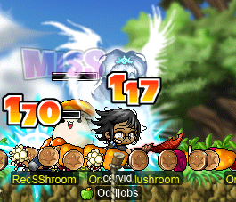
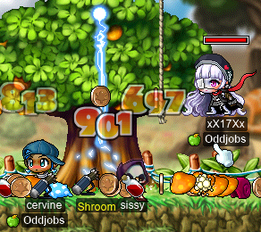
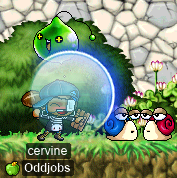
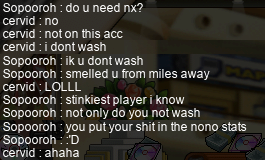
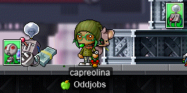
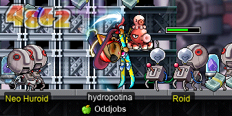
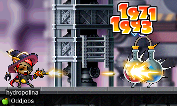
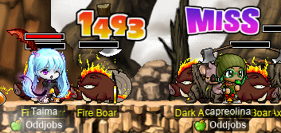

# rangifer’s diary: pt. xxvii

You know what time it is: Valentine’s event!!! This is my first time experiencing the Valentine’s event on MapleLegends.

## Mushroom Garden

Ally **Soblet** was about to be done farming at [Mushroom Garden](https://maplelegends.com/lib/map?id=104030001) around the time that I logged on, and they offered to give away their map. So, not _entirely_ sure what I was going to be using the map for, I decided to accept the offer, since no one else was. Here’s my [STR priest](https://oddjobs.codeberg.page/odd-jobs.html#str-mage), **cervid**, farmin’ it up using her off-brand, dollar-store [SR](https://maplelegends.com/lib/skill?id=2311004):

Shortly after, a couple of other allies (of the **Suboptimal** alliance) came and joined me, including **gogigagagigo** (a [permarcher](https://oddjobs.codeberg.page/odd-jobs.html#permarcher)), **drainer** (a [permabeginner](https://oddjobs.codeberg.page/odd-jobs.html#permabeginner); a.k.a. **xX17Xx**, **maebee**), and **Dizz** (also a [permabeginner](https://oddjobs.codeberg.page/odd-jobs.html#permabeginner); a.k.a. **Brains**):

Later on, I swapped over to my I/L [magelet](https://oddjobs.codeberg.page/odd-jobs.html#luk-mage), **cervine**, and drainer swapped over to her [permarogue](https://oddjobs.codeberg.page/odd-jobs.html#permarogue), **xX17Xx**:

## Farming elsewhere

We also tried farming in some other locations, like at the [Thicket Around the Beach II](https://maplelegends.com/lib/map?id=104000300), as well as [Right Around Lith Harbor](https://maplelegends.com/lib/map?id=104000100). Because I was making so much use of [Thunderbolt](https://maplelegends.com/lib/skill?id=2201005) (normally, for damage, [Ice Strike](https://maplelegends.com/lib/skill?id=2211002) is my spell of choice, with Thunderbolt largely relegated to luring monsters), I decided to real quickly scroll myself a [Pyogo Mushroom](https://maplelegends.com/lib/equip?id=01382016). I keep all of my staff/wand scrolls on cervine anyways, and because I normally rely on the elemental amplification from my [Elemental Wand 3](https://maplelegends.com/lib/equip?id=01372037), a Pyogo would actually make me deal more damage with Thunderbolt than my usual elemental wand:

And later, I tried farming for [Red Valentine Roses](https://maplelegends.com/lib/equip?id=01442048) at [The Burnt Land III](https://maplelegends.com/lib/map?id=106000120):

By the end of this session, I had farmed enough roses (and also thanks to help from my allies!) to complete three sets, so that I could get a [Ring of Passion](https://maplelegends.com/lib/equip?id=01112962) on cervid, capreolina, and cervine! I still have more characters left to grind for, though…

## Trying out Voodoos with drainer

We also decided that trying out [Voodoos](https://maplelegends.com/lib/monster?id=9400561) would be a good idea; they don’t hit very hard, give decent EXP, drop [Heartstoppers](https://maplelegends.com/lib/use?id=2022245), and also drop [Blue Valentine Roses](https://maplelegends.com/lib/equip?id=1442049)! Here I am, farming Voodoos with drainer:

## Healing a friend at CDs

A friend of mine, **Sopooroh** (a.k.a. **Justinorino**), was farming [at CDs](https://maplelegends.com/lib/map?id=742010203) and needed someone to [Heal](https://maplelegends.com/lib/skill?id=2301002) for his [rawrs](https://maplelegends.com/lib/skill?id=1311006), so I came to help out for a bit. When it came to splitting amongst us the NX tickets dropped by the CDs, I insisted that I didn’t need the NX:

## capreolina tries out Romeo & Juliet’s quest

Then, I wanted to try out [Romeo](https://maplelegends.com/lib/npc?id=2112004) & [Juliet](https://maplelegends.com/lib/npc?id=2112003)’s quest for some sweet chairs. So I took my [wood(wo)man](https://oddjobs.codeberg.page/odd-jobs.html#woodsman), **capreolina**, to [Magatia](https://maplelegends.com/lib/map?id=261000000). And I got quite a few monster cards along the way :O

And after not too long, I could finally sit in my victory chair:

## hydropotina also tries out Romeo & Juliet’s quest

Since I already had my [swashbuckler](https://oddjobs.codeberg.page/odd-jobs.html#swashbuckler), **hydropotina**, in Magatia (for [MPQ](https://maplelegends.com/lib/map?id=261000021), as she is, still, in level range), I decided to do the same questline on her as well:

Oh, and I can’t forget to take care of [Rurumo](https://maplelegends.com/lib/monster?id=6090004) before it sends me back to town!:

## Farming at The Burnt Land III with Taima

And to end things here, I farmed some more at The Burnt Land III, this time with **Taima** (a.k.a. **Boymoder**, **Tacgnol**, **Yotsubachan**, **Gambolpuddy**):

We managed to farm up not one, but two [glass shoes](https://maplelegends.com/lib/etc?id=4001000), as well as a [Red Valentine Rose](https://maplelegends.com/lib/equip?id=01442048) and two or three [Love Tickets](https://maplelegends.com/lib/etc?id=4000174)~!

<3
