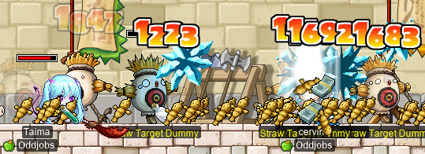
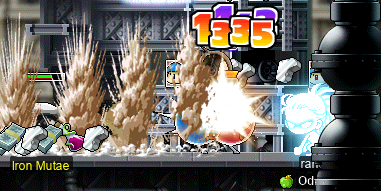
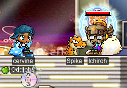

# rangifer’s diary: pt. xxviii

Valentine’s Event, part II: Electric Boogaloo~

## Rose/card-hunting with Taima

When I logged on, my [permabeginner](https://oddjobs.codeberg.page/odd-jobs.html#permabeginner) friend **Taima** (a.k.a. **Boymoder**, **Tacgnol**, **Yotsubachan**, **Gambolpuddy**) was farming [MDT](https://maplelegends.com/lib/monster?id=7130300)s for [their cards](https://maplelegends.com/lib/use?id=2385020), and a chance at getting [Yellow Valentine Roses](https://maplelegends.com/lib/equip?id=1442047). Oh, and the EXP is decent as well (but not really worth it, in general). So I decided to join her:

These bastards have 40k(!) HP and 750 WDEF, so it takes us a while to chew through each one. So despite [this map](https://maplelegends.com/lib/map?id=220070201) being (very) large, we never actually moved from this one pair of platforms! Taima was able to finish her MDT card set, yay!! Although neither of us ever saw any Yellow Valentine Roses drop from these guys. Probably not the best place to farm for equips, with all of that HP, tbh…

So, to _really_ find some yellow roses, we headed over to [a practice field](https://maplelegends.com/lib/map?id=250020000) to farm from the [Straw Target Dummies](https://maplelegends.com/lib/monster?id=5120503) there. Here I am with Taima, playing my I/L [magelet](https://oddjobs.codeberg.page/odd-jobs.html#luk-mage), **cervine**:

And we both completed our Straw Target Dummy cards from start to finish!:

Once we had finished our card sets and gotten a rose or two, we headed to [a lab in Magatia](https://maplelegends.com/lib/map?id=261020600) in order to farm [Iron Mutae](https://maplelegends.com/lib/monster?id=4110300):

I went ahead and finished my [Rurumo](https://maplelegends.com/lib/monster?id=6090004) card set on my [swashbuckler](https://oddjobs.codeberg.page/odd-jobs.html#swashbuckler), **hydropotina**, while Taima took a trip back to Victoria Island to finish up the event quests. And I completed an Iron Mutae card set as well ^^:

…And was excited to get a [White Valentine Rose](https://maplelegends.com/lib/equip?id=01442050) from these metalline critters:

## Taima hits level 105!!

And while we were farming Iron Mutaes, Taima hit level 105!! Congrats!!!!

So stronk :')

## A lil more rose/card-hunting with Taima

We both came back to Iron Mutaes later, me playing my [pugilist](https://oddjobs.codeberg.page/odd-jobs.html#pugilist) **rangifer**, and Taima now on her [STRmit](https://oddjobs.codeberg.page/odd-jobs.html#str-assassin), **Boymoder**. Here I am, [memewaving](https://maplelegends.com/lib/skill?id=5111006) Rurumo to death, for the laffs:

Although Boymoder is only level 76 in this image (STRmits take a while to really mature), her [Avenger](https://maplelegends.com/lib/skill?id=4111005) is still fearsome :O

Oh, and we got a few more Iron Mutae cards, heh.

## rang finishes the chair quest

While we were farming at Iron Mutaes, I took the time to complete [Romeo](https://maplelegends.com/lib/npc?id=2112004) & [Juliet](https://maplelegends.com/lib/npc?id=2112003)’s quest on rangifer. I got a bit unlucky with the [Love Ticket](https://maplelegends.com/lib/etc?id=4000174) drop chances — either that, or I’m just terribly inefficient at killing these on rangifer — but I did complete the quest from front to back:

!")

## Time to really make use of those baskets~

The daily quest of this event rewards a [Chocolate Basket](https://maplelegends.com/lib/use?id=2020024). The basket is basically just portable GM buffs (including [HB](https://maplelegends.com/lib/skill?id=1301007), [HS](https://maplelegends.com/lib/skill?id=2311003), GM [Bless](https://maplelegends.com/lib/skill?id=2301004), and [Haste](https://maplelegends.com/lib/skill?id=4201003)), but it is untradeable and OoaK (one of a kind), so you can’t actually do the quest the next day until you somehow consume the basket. So it was time for me to really try to squeeze every bit of use out of my baskets — and, for that matter, out of the bonus event EXP. After using the basket on my [wood(wo)man](https://oddjobs.codeberg.page/odd-jobs.html#woodsman), **capreolina**, I did a quick and dirty EPM (experience per minute) test [at Kid Mannequins](https://maplelegends.com/lib/map?id=742010100), solo:

4.1M EPH, wowza. That is more solo EPH than I’ve ever recorded before!! But after my test, I decided it would be a good idea to check for any [CD maps](https://maplelegends.com/lib/map?id=742010203). I found a map that was occupied just by a [shadower](https://maplelegends.com/lib/skill?id=4221007) by the name of **Ichiroh**, and asked if he maybe wanted to party up. Ichiroh kindly accepted, and I did a similar EPM test here, as well:

7.7M~7.8M EPH. Holy shit. Using up capre’s basket was enough to get her from level 101 & 37.61% EXP to level 102 & 3.41% EXP!! Yayyy~

Once my basket ran out, I came back as my I/L [magelet](https://oddjobs.codeberg.page/odd-jobs.html#luk-mage), **cervine**, to use another basket:

Another EPM test revealed similar numbers O\_O

And that was enough to level cervine up as well! Now level 96!!

Thanks for the party, Ichiroh!

