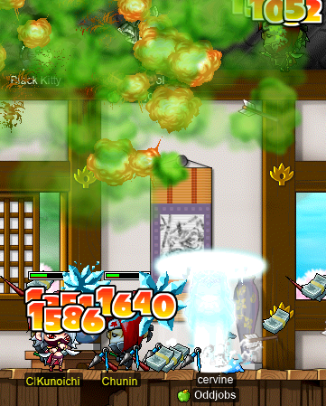

# rangifer’s diary: pt. xxix

## rusa rawr

**rusa** is my [DEX spear(wo)man](https://oddjobs.codeberg.page/odd-jobs.html#dex-warrior), who you may recognise from previous diary entries. As of this writing, she’s level 55, and the V-day event is putting a damper on her progress, as I focus on doing way too much grinding on my other characters. But, I’ve been concerned for rusa’s third-job future. Whatever will I spend my skill points on? [Dragon Fury: Polearm](https://maplelegends.com/lib/skill?id=1311004)? [Spear Crusher](https://maplelegends.com/lib/skill?id=1311001)?

Or perhaps… [rawr](https://maplelegends.com/lib/skill?id=1311006). After all, it’s common knowledge that rawring [at CDs](https://maplelegends.com/lib/map?id=742010203) is extremely effective; at max level, rawr has enough range to hit two of the platforms simultaneously! The issue is that each rawr consumes HP, and a lot of it. Even at max level (the HP consumption decreases with skill level), rawr drains the dragon knight for 30% of their MAXHP. So rawring as a method of training doesn’t really function without a priest to [Heal](https://maplelegends.com/lib/skill?id=2301002) the dragon knight. The issue is, then, a question of how effective my rawr could really be. If, as a STRless dragon knight, my rawr is just too pitiful, it’s likely not worth investing in (at least, not until later on), because who would want to continuously heal me as I roar myself to pieces? Maybe if I cut a deal, like letting the priest take all of the loot, or have a priest ally (likely a [STR priest](https://oddjobs.codeberg.page/odd-jobs.html#str-mage), in that case) who is willing to train with me, it could work. But we need to know in more detail what we’re dealing with, in order to decide whether or not to focus on rawr as an attacking skill.

I’m going to attempt to project the damage that I would deal, at three different levels, using a mixture of gear I already own (this is most of the gear), and some gear that I don’t (but plan on getting anyways):

### The gear

- [Ravana Helmet](https://maplelegends.com/lib/equip?id=01003068) | +18 STR, +18 DEX (clean; I don’t have this yet)
- [Sad Mask](https://maplelegends.com/lib/equip?id=01012111) | +6 DEX
- [Spectrum Goggles](https://maplelegends.com/lib/equip?id=01022082) | +4 DEX
- [Glittering Altaire Earrings](https://maplelegends.com/lib/equip?id=01032061) | +2 STR, +8 DEX (I don’t have these yet, so we’re assuming an average scrolling outcome for [60%](https://maplelegends.com/lib/use?id=2040317)s)
- [Pink Gaia Cape](https://maplelegends.com/lib/equip?id=01102084) | +4 WATK, +6 DEX
- [Bathrobe for Women](https://maplelegends.com/lib/equip?id=01051098) | +12 STR (my sad robe)
- [Silver Deputy Star](https://maplelegends.com/lib/equip?id=01122014) | +5 STR, +5 DEX
- [Green Mittens](https://maplelegends.com/lib/equip?id=01082228) | +12 WATK
- Green Christmas Sock | +5 STR, +6 DEX
- [Ellin Savior’s Ring](https://maplelegends.com/lib/equip?id=01119001) | +1 STR, +1 DEX
- [Monster Book Ring \<Tier 1\>](https://maplelegends.com/lib/equip?id=01119003) | +1 STR, +1 DEX (I don’t have this yet either, but rusa should have no problem getting T1)
- [Ring of Passion](https://maplelegends.com/lib/equip?id=01112962) | +3 STR, +3 DEX

**Total:** +16 WATK, +47 STR, +58 DEX

### The buff

We’re assuming that I’m using [Cider](https://maplelegends.com/lib/use?id=2022002) (+20 WATK).

### The weapons

The weapons outline the three levels that we’re doing calculations for: level 81 is the earliest that rawr can be maxed out, level 85 is the first level that allows using the [Sky Ski](https://maplelegends.com/lib/equip?id=01432018), and level 95 is the first level that allows using the [Purple Surfboard](https://maplelegends.com/lib/equip?id=01442057).

- [White Mop](https://maplelegends.com/lib/equip?id=01442022) | speed 6, +100 WATK, +7 STR
- [Sky Ski](https://maplelegends.com/lib/equip?id=01432018) | speed 6, +109 WATK, +7 STR
- [Purple Surfboard](https://maplelegends.com/lib/equip?id=01442057) | speed 5, +111 WATK, +4 STR

### The base stats

The three DEX values are for levels 81, 85, and 95, respectively.

- STR: 35
- DEX: 387/407/457

### The target

We’re going to be pessimistic and only compare against the stronger of the two CDs: [Greatest Oldies](https://maplelegends.com/lib/monster?id=9410031). The weaker of the two, [Latest Hits Compilation](https://maplelegends.com/lib/monster?id=9410030), is actually thrice as abundant (because exactly three spawn when a Greatest Oldies is slain), and has less WDEF (300 < 400).

- Level: 76
- WDEF: 400
- HP: 8500

The level won’t be an issue here, because the lowest level for rusa that we consider is 81 ≥ 76.

### The results

#### Level 81

- Range ([avg](https://en.wikipedia.org/wiki/Expected_value)): 1503~2134 (1818.7)
- DPS: 1377.8

#### Level 85

- Range ([avg](https://en.wikipedia.org/wiki/Expected_value)): 1711~2377 (2043.6)
- DPS: 1548.2

#### Level 95

- Range ([avg](https://en.wikipedia.org/wiki/Expected_value)): 1896~2550 (2222.9)
- DPS: 1807.2

### To rawr, or not to rawr?

Keeping in mind that this is just the pessimistic case ([Greatest Oldies](https://maplelegends.com/lib/monster?id=9410031) only), we might consider level 86 as the crucial level here; rusa would fully graduate [MPQ](https://maplelegends.com/lib/map?id=261000021) at this level, and we would be expecting to do roughly 2050 damage per-rawr-per-Greatest-Oldies. Greatest Oldies have 8500 MAXHP, so that’s some 8500 ÷ 2050 ≈ 4.1 hits to kill them, on average. As I kind of expected, this is fairly impressive for an odd job like a STRless warrior, but is likely not going to cut it for those with more ordinary expectations.

Our main point of comparison is [Dragon Fury: Polearm](https://maplelegends.com/lib/skill?id=1311004), so let’s check that out with the same assumptions, at level 81:

- Range ([avg](https://en.wikipedia.org/wiki/Expected_value)): 1730~2525 (2127.5)
- DPS: 2954.9

Now, that’s a lot more impressive, but keep in mind that there is no new weapon to use at level 85 (unlike with rawr, where rusa can switch to Sky Skis), that there is a much smaller reach (no massive AoE), and that Fury only hits up to 6 monsters at once. However, Fury is much more versatile (it basically just works anywhere), and doesn’t demand that a priest be surgically attached to the dragon knight’s side. So Fury is probably the way to go here, less exciting as it may be.

That being said, even if I do go Fury, I will likely put at least one SP into rawr, if only to be able to [mist](https://maplelegends.com/lib/skill?id=2111003) train with **Tacgnol**, if she ever needs someone with [high accuracy](https://oddjobs.codeberg.page/odd-jobs.html#dex-warrior) to finish off monsters that are far too high level…

## Farming cards & farming the event, all at once

If I can, I like to:

- Farm cards
- Farm roses
- Farm event ETC items
- Farm [Love Tickets](https://maplelegends.com/lib/etc?id=4000174)

…all at the same time! One good spot for this is at [The Burnt Land V](https://maplelegends.com/lib/map?id=106000140), or, if I don’t need any more [Lupin cards](https://maplelegends.com/lib/use?id=2382029), [The Burnt Land III](https://maplelegends.com/lib/map?id=106000120):

cervid, farming~

Victory! Oh, and I finished all three card sets of the monsters that spawn at The Burnt Land V!!

cervine, farming~

Oh, and another good spot is at [the Alcadno Lab, Area B-3](https://maplelegends.com/lib/map?id=261020600):

## hashishi and Gambolpuddy, the dynamic KPQ duo

My [besinner](https://oddjobs.codeberg.page/odd-jobs.html#besinner), **hashishi**, and her [DEXginner](https://oddjobs.codeberg.page/odd-jobs.html#dex-beginner) friend, **Gambolpuddy** (a.k.a. **Taima**, **Tacgnol**, **Boymoder**, **Yotsubachan**), make an excellent duo! They are both non-standard permabeginners, as they are both STRless!:

Here they are, in their first-ever [KPQ](https://maplelegends.com/lib/map?id=103000800):

Our party was a bit of a strugglebus, as we were joined by a new magician by the name of **xXHabibXx**, and a new archer by the name of **Maise**, so I somehow ended up being the main DPS of the party! We also had some struggles with staying alive:

Lucky, neither hashishi nor Gambolpuddy have any accuracy issues, as they are pure LUK, and pure DEX, respectively. So with bit of extra effort and time, we were able to pull through these KPQs.

## Grinding CDs with Gumby and ayunah

GM buffs were given out not too long after I logged on, and ally and [permabeginner](https://oddjobs.codeberg.page/odd-jobs.html#permabeginner) **Gumby** was hoping to use the GM buffs to grind at [Taipei 101](https://maplelegends.com/lib/map?id=742000000). I suggested heading to [CDs](https://maplelegends.com/lib/map?id=742010203), so we headed there as a duo, with me playing my [wood(wo)man](https://oddjobs.codeberg.page/odd-jobs.html#woodsman), **capreolina**. After a little bit, a priest by the name of **ayunah**, who already knew Gumby from [PPQ](https://maplelegends.com/lib/map?id=251010404), showed up and formed a trio with us:

We were there for quite a while (a little over two hours), and got a lot of EXP; enough for Gumby to be over 97% of the way ot level 103(!), and enough for capre to be about 90% of the way to that same level!!

## More farming cards & farming the event

I went back onto my [STR priest](https://oddjobs.codeberg.page/odd-jobs.html#str-mage), **cervid**, and headed to [Golem’s Temple I](https://maplelegends.com/lib/map?id=106010103) for some more farming:

cervid farming @ Golem’s Temple I~

## Rose farming with Tacgnol

**Tacgnol**, Gambolpuddy/Taima’s F/P [gishlet](https://oddjobs.codeberg.page/odd-jobs.html#luk-gish), came online, and she wanted to do some event farming. I was prepared to do the same with my I/L [magelet](https://oddjobs.codeberg.page/odd-jobs.html#luk-mage), **cervine**, so by [our elements combined](https://maplelegends.com/lib/skill?id=2111006), we formed a fierce [Chunin](https://maplelegends.com/lib/monster?id=9400401)-farming duo!:

Not pictured above are cervine and Tacgnol, for their appearances being obscured by the flurry of third-job mage spells…

Oddly enough, despite the fact that the map we were in was actually an exact 50/50 split of Chunins and [Kunoichis](https://maplelegends.com/lib/monster?id=9400406), we both ended up with 5/5 Kunoichi cards (with 1 or 2 cards left to spare), but only 2/5 Chunin cards each!:

And after quite a while of killing these slippery ninjas, we finally found one (1) [rose](https://maplelegends.com/lib/equip?id=1442048):

We gave up on Chunins and decided to move to [STD](https://maplelegends.com/lib/monster?id=5120503)s, with me now playing cervid:

I was able to get to 4/5 STD cards pretty quickly, but once the final card proved to be somewhat elusive, I resorted to verbally intimidating the straw dummies. And it worked, almost immediately!:

## OmokTeacher scrolls another Arcglaive

Ally and [permabeginner](https://oddjobs.codeberg.page/odd-jobs.html#permabeginner) extraordinaire **OmokTeacher** (a.k.a. **Slime**, **Slimu**) hasd been trying to beat his completely perfect (118 WATK!!!!!) [Blood Snowboard](https://maplelegends.com/lib/equip?id=01442017) by scrolling [Crimson Arcglaives](https://maplelegends.com/lib/equip?id=01442068). For those not familiar, Crimson Arcglaives are _extraordinarily_ difficult to craft, but OmokTeacher managed to muster yet another 400 [Crimson Woods](https://maplelegends.com/lib/etc?id=4032004). And with [Baby Typhons](https://maplelegends.com/lib/monster?id=9400573) being fixed (so that they are now killable), he was able to farm up the [Typhon Feathers](https://maplelegends.com/lib/etc?id=4032005) necessary to complete the next Crimson Arcglaive. Much to everyone’s excitement, the Arcglaive came out with the maximum possible WATK (107)!!! So we all gathered in what is a nearly religious experience for odd-jobbers, scrolling an Arcglaive:

Aaaand it boomed on the first slot. :(

Oh well, we’ll get ‘em next time.

## Some more KPQ with hashishi & Gambolpuddy

hashishi and Gambolpuddy went out for another few KPQs, including one with a swordsman by the name of **Thrusting**, who left our party after one PQ that he described as “miserable”, because he couldn’t contribute in combat the entire time:

## A little more CD grinding, with peelings

And for just a last little grinding sesh, I headed to CDs and found a dragon knight by the name of **peelings** who was grinding there. I asked if I could join their party, and they kindly obliged. I’m not sure whether or not to consider what peelings was doing to be “solo” grinding or not:

In any case, peelings was very quick about rebuffing [HS](https://maplelegends.com/lib/skill?id=2311003) and [HB](https://maplelegends.com/lib/skill?id=1301007) on me, and was very nice. And I got enough EXP to bring capre to level 103!!! Yayyy~

<3
