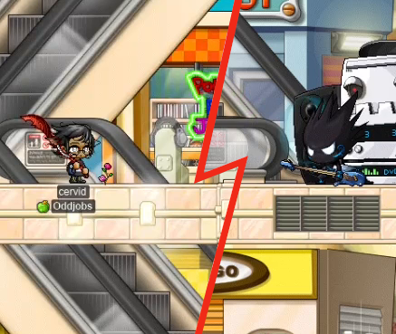
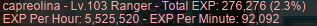

# rangifer’s diary: pt. xxx

## cervid solos the Spirit of Rock!!

I used a [V-day basket](https://maplelegends.com/lib/use?id=2020024) to solo the [Spirit of Rock](https://maplelegends.com/lib/monster?id=9410035) on my [STR priest](https://oddjobs.codeberg.page/odd-jobs.html#str-mage), **cervid**! The Spirit of Rock is a real tough boss, and tough to even find one, as well…

You can [watch the full struggle — I mean, fight — on the Oddjobs YouTube channel](https://www.youtube.com/watch?v=D5fhczQQz3c)!

## Gambolpuddy and hashishi are back, for great KPQ!

I logged on, and Kelsey (**Gambolpuddy**; also **Taima**, **Tacgnol**, **Boymoder**, **Yotsubachan**) was already raring to [KPQ](https://maplelegends.com/lib/map?id=103000800)! So off I was to hop onto my [besinner](https://oddjobs.codeberg.page/odd-jobs.html#besinner), **hashishi**, to PQ with her [DEXginner](https://oddjobs.codeberg.page/odd-jobs.html#dex-beginner) Gambolpuddy:

Our first party was us two, plus two [pirates](https://maplelegends.com/lib/skill?id=5001002) who were new to the server:

Later on, a fellow claw-wielding KPQer by the name of **Gwisin** managed to be rather impressed (or unimpressed…?) with my damage. I think she was confusing the damage number from each of my basic attacks with one of the two lines of a [Lucky Seven](https://maplelegends.com/lib/skill?id=4001344):

…Little did she know, I was more DEXless than she even imagined!

Here I am, having a staredown with Gambolpuddy — although, I look more confused than fierce, at least in comparison to Gambolpuddy:

Shortly after having a staredown, we found out that, bizarrely, the [F6](https://en.wikipedia.org/wiki/Function_key) facial expression shows _on top of_ the [Smiling Mask](https://maplelegends.com/lib/equip?id=01012108):

In any case, we KPQed for quite a while. hashishi leveled up to 30!:

And we fully graduated KPQ (level 31):

The [Red Flowery Tube](https://maplelegends.com/lib/equip?id=01322022) you see me wielding above was dropped on the ground next to the [Mushroom Shrine](https://maplelegends.com/lib/map?id=800000000) [gachapon](https://maplelegends.com/lib/npc?id=9100105). The 11 SPEED really helps me get around, even if I can’t exactly do damage with the thing, having 4 base STR and 4 base DEX. One’s trash is another’s treasure~!

## capreolina grinds CDs solo, and with Gumby

In another episode of [basket](https://maplelegends.com/lib/use?id=2020024)-using, I was grinding alone [at CDs](https://maplelegends.com/lib/map?id=742010203) for a bit on my [wood(wo)man](https://oddjobs.codeberg.page/odd-jobs.html#woodsman) **capreolina**. CDs are my go-to place because I know they’re overpowered, based on others’ treatment of the map and the people who I see training there, and tbh I don’t know where else to goooo~

With the [HS](https://maplelegends.com/lib/skill?id=2311003) from the basket, and me simply soloing a map full of [CD](https://maplelegends.com/lib/monster?id=9410031)s, I managed to reach an alarmingly high EPH of 5.5M!! :O

About a quarter of the way through my basket, I was joined by ally and [permabeginner](https://oddjobs.codeberg.page/odd-jobs.html#permabeginner) **Gumby**. I got enough experience on capre to hit level 104!!:

## cervine wraps up the chair quests

I needed to do only a little bit more to finish [Romeo](https://maplelegends.com/lib/npc?id=2112004) & [Juliet](https://maplelegends.com/lib/npc?id=2112003)’s quest on my I/L [magelet](https://oddjobs.codeberg.page/odd-jobs.html#luk-mage) **cervine**. This now puts me at five total completions of the questline, haha:

So many chairs~

## capre grinds Fancy Amps with Taima

**Taima** (Kelsey’s ultra-str0nk [permabeginner](https://oddjobs.codeberg.page/odd-jobs.html#permabeginner)) and I chomped some [baskets](https://maplelegends.com/lib/use?id=2020024) and decided to grind together [at Fancy Amps](https://maplelegends.com/lib/map?id=742010201). We had a blast:

And Taima reported that her `@epm` recording read 2.59M EPH!! Quite a bit better than my usual duo with her, on my [STR priest](https://oddjobs.codeberg.page/odd-jobs.html#str-mage) **cervid**, partly owing to the bonus event EXP, and partly owing to capre’s [flurry of projectiles](https://maplelegends.com/lib/skill?id=3111004) tearing the [Fancy Amps](https://maplelegends.com/lib/monster?id=9410029) to shreds.

## Finishing two more rose sets~

To this point, I had managed to hunt two [Red Valentine Roses](https://maplelegends.com/lib/equip?id=01442048), six(!) [white ones](https://maplelegends.com/lib/equip?id=01442050), and a [yellow one](https://maplelegends.com/lib/equip?id=01442047). I wanted to use these to complete at least two more rose sets, so when **OmokTeacher** (**Slime**, **Slimu**) remarked in alliance chat that he had way too many [blue roses](https://maplelegends.com/lib/equip?id=01442049) from grinding [at Voodoos](https://maplelegends.com/lib/map?id=682000501), I offered to trade two of my white roses for two of his blue ones. He insisted that the blue roses were truly worthless to him, and kindly gave me two for free!! Thank you~~

Similarly (and even more to my surprise), when I then sent out a [smega](https://maplelegends.com/lib/cash?id=5072000) offering to trade my white roses for a yellow one, **Thanato** kindly offered to donate me a yellow rose! When I met up with her in [the FM](https://maplelegends.com/lib/map?id=910000000) to trade, I asked if she was also **Satania**, who I had met before with **Tacgnol** when we went to rose farm [at Chunins](https://maplelegends.com/lib/map?id=800040203) (see the previous diary entry). She assured me that she was not Satania, but that I was not the first person to tell her that she looked like Satania. In any case, thanks so much Thanato for the rose!! Time for two more [cute rings](https://maplelegends.com/lib/equip?id=01112962)~
