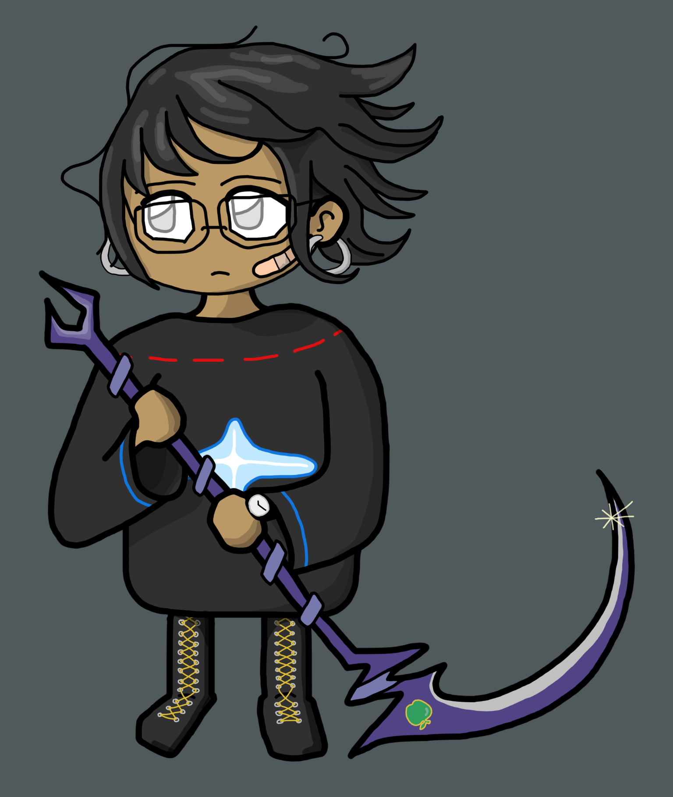
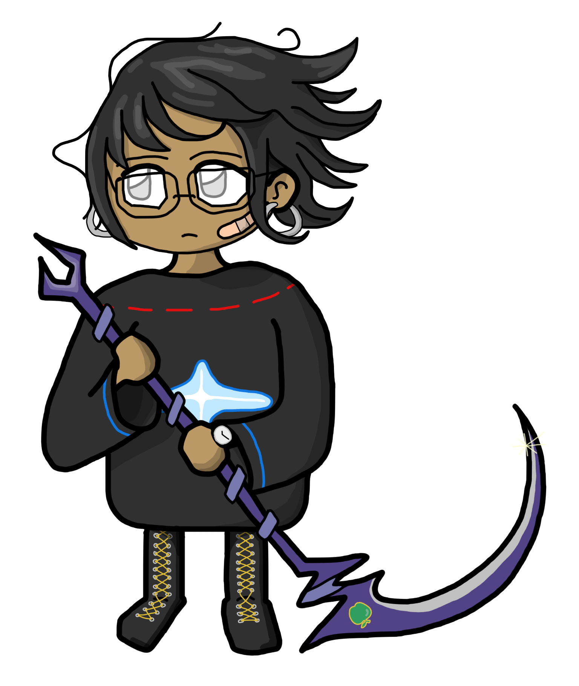

# rangifer’s diary: pt. xxxi

This is a special entry of rangifer’s diary! I’ve drawn a lil picture in [Krita](https://krita.org/), which is a new program to me. I’m not much of an illustrator, and tbh I’ve only ever sketched stuff out in [Inkscape](https://inkscape.org/) (basically, an abuse of Inkscape lol). So my art style is kinda basic and geometrical. With the power of some very basic Krita stuff that took me a lil while to figure out, I managed to add some shading, so it doesn’t look quite so flat!

I’m licencing the image under the [CC BY-SA 4.0](https://creativecommons.org/licenses/by-sa/4.0/) licence, or any later version of the same licence :)

cervid

cervid (transparent/no background)

❤️
