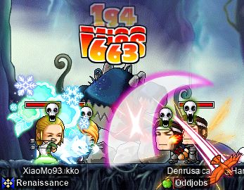
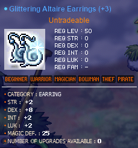
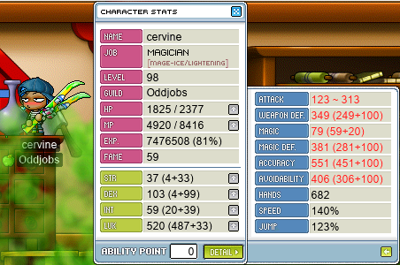
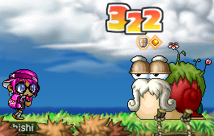
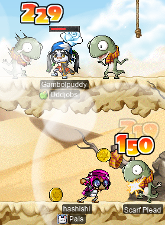
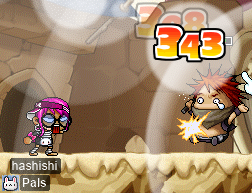
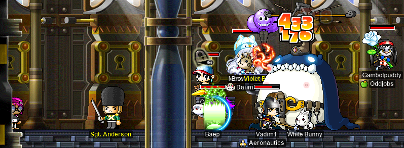

# rangifer’s diary: pt. xxxii

## Voodoos with cervid

I needed somewhere to do the daily V-day event quest on my [STR priest](https://oddjobs.codeberg.page/odd-jobs.html#str-mage), **cervid**, so I headed over [to Voodoos](https://maplelegends.com/lib/map?id=682000501) to hopefully farm some [Blue Valentine Roses](https://maplelegends.com/lib/equip?id=1442049) and [Heartstoppers](https://maplelegends.com/lib/use?id=2022245) in addition to the event ETC items. I farmed there for 60 minutes, and I did manage to scrounge up one or two blue roses:

And about 7 Heartstoppers as well, which will make great fodder for alliance boss runs:

Oh, and the EXP isn’t awful, either:

## cervine is lonely at CDs

Next, I wanted to use a [basket](https://maplelegends.com/lib/use?id=2020024) on my I/L [magelet](https://oddjobs.codeberg.page/odd-jobs.html#luk-mage), **cervine**, and get some EXPs~~

My usual strategy is roaming around the various [CDs](https://maplelegends.com/lib/map?id=742010203) channels and asking if anyone wants to party together. Sometimes this achieves good results, and I can duo (or even trio) a CDs map for the duration of my basket, and sometimes it’s just mostly [leechers](https://maplelegends.com/lib/skill?id=2321008)… This time, it was mostly just leechers, so I ground for about 60 minutes all by my lonesome:

Once the basket was finished, I went to try to scrounge up some more event ETC items. Along the way, I found some cards:

(I completed the Orange Mushroom set with the above card lol)

## rusa graduates EPQ!!

For the duration of the event so far, my [DEX spear(wo)man](https://oddjobs.codeberg.page/odd-jobs.html#dex-warrior) **rusa** has been languishing, unable to escape [EPQ](https://maplelegends.com/lib/map?id=300030100) and level up (to level 56) without first completing 13 more EPQs. So I set out to fix that. And **Yukko** (a.k.a. **Taima**, **Gambolpuddy**, **Tacgnol**, **Boymoder**, **Yotsubachan**) came to join me!:

Here we are, fighting [the Big Bad Rock Man (BBRM)](https://maplelegends.com/lib/monster?id=9300178):

After Yukko had to leave, I was determined to finish the remaining EPQs. So after an hour or so, we recuperated a party and I was able to finish all 50(!) EPQs and hit level 56 at the same time!! [Earringssss](https://maplelegends.com/lib/equip?id=01032061)~~~~~~!:

I soon set out to [scroll](https://maplelegends.com/lib/use?id=2040317) these damned things and finally get it all over with. And with average luck (3 ÷ 5 = [60%](https://maplelegends.com/lib/use?id=2040317)), I am very content with my EPQ-torture consolation prize!:

## Tacgnol and cervine try mist training in the Sutra Depository

My friend and guildmate **Tacgnol**, the F/P [gishlet](https://oddjobs.codeberg.page/odd-jobs.html#luk-gish), had previously tried some [Poison Mist](https://maplelegends.com/lib/skill?id=2111003) training [in the Sutra depository](https://maplelegends.com/lib/map?id=702070400) alongside a [dark knight](https://maplelegends.com/lib/skill?id=1311006). She was eager to give it another go, and asked if I had any characters who would be capable of mist training there. For reference, there are three general categories of monsters in the Sutra Depository: bronze ones, silver ones, and gold ones:

- Bronze: Level 120, 43 AVOID
- Silver: Level 125, 45 AVOID
- Gold: Level 130, 75 AVOID

(I’m leaving out [Wooden Fish](https://maplelegends.com/lib/monster?id=9600018) here; they are considerably easier to hit than any of the metalline monsters, and only appear in [7 F](https://maplelegends.com/lib/map?id=702070400) anyways)

As you can see, these are extremely powerful creatures. And gold ones take the cake, with a completely bonkers avoidability of 75!! I found that my [STR priest](https://oddjobs.codeberg.page/odd-jobs.html#str-mage), **cervid**, was reasonably capable of hitting the bronze and silver creatures. But the gold ones… Well, I considered cervine, but I’m honestly not sure how magical accuracy works, and I suspect in any case that her magical attacks would not hit these things. But I forgot that, of course, cervine has another trick up her sleeve: melee. Now, melee is not exactly the specialty of [magelets](https://oddjobs.codeberg.page/odd-jobs.html#luk-mage); we leave that up to the [gishlets](https://oddjobs.codeberg.page/odd-jobs.html#luk-gish), [gishes](https://oddjobs.codeberg.page/odd-jobs.html#gish), [STR mages](https://oddjobs.codeberg.page/odd-jobs.html#str-mage), and so on. So I was obviously not expecting to do any more than 1 damage per hit to any of the things in the Sutra Depository. But 1 damage is all I need, as that’s exactly how many HP the monsters have after Poison Mist is done with them!

With GM [Bless](https://maplelegends.com/lib/skill?id=2301004) and some gear borrowed from my physical-attacking characters, I managed to achieve a whopping 551 WACC!!!:

Very doable, even for golden monsters. So we trained at [5-6 F](https://maplelegends.com/lib/map?id=702070300)! You can [watch a lil video of us testing out 5-6 F mist training for the first time on the Oddjobs YouTube channel](https://www.youtube.com/watch?v=TbbmrnC_-j8)!

And I got some cards along the way, hehe~ cervine just might finish her [Mini Gold Martial Artist card](https://maplelegends.com/lib/use?id=2387014) set before she finishes hers for [Ribbon Pigs](https://maplelegends.com/lib/use?id=2380009), LOL:

And we witnessed the tragic loss of one (1) **DuckNation** guild member along the way ;(

## More card-hunting/rose-farming/event-ETC-farming with cervid

Aaaand it is time for more hunting with cervid~~

This time, I wanted to get [Yellow](https://maplelegends.com/lib/equip?id=01442047)/[Red](https://maplelegends.com/lib/equip?id=01442048) Valentine Roses, event ETC items, _and_ cards. So I was off to [Orbis](https://maplelegends.com/lib/map?id=200000000), and to the [Garden of 3 Colours](https://maplelegends.com/lib/map?id=200010100):

You can see above, the tears on the cat-unicorn’s face as I one-shot them into oblivion. It’s times like this, that I wonder whether or not _I’m_ the _real_ villain…

Oh, and two more sets down for cervid >:)

For some reason, I’ve been getting [White Chocolates](https://maplelegends.com/lib/etc?id=4031109) like 6 times less frequently than the other three kinds of V-day event ETC items. So you can imagine how pleased I was to finally find one in a hundred:

And to find a rose :D

## capreolina using a basket at CDs again

It was time to basket it up again, and this time on my [wood(wo)man](https://oddjobs.codeberg.page/odd-jobs.html#woodsman), **capreolina**! This time I was fortunate enough to find a party after a bit of solo grinding, with a priest by the name of **oRob**. I was getting really nice EPM (experience per minute), and it got even a tad bit better when a [dark knight](https://maplelegends.com/lib/skill?id=1311006) by the name of **fartmane** came along to trio with us:

Whew. 8.3M is some _bonkers_ EPH. Particularly when not even mist training, heh.

## Gambolpuddy and hashishi bridge the gap between KPQ and LPQ

Now that my [besinner](https://oddjobs.codeberg.page/odd-jobs.html#besinner), **hashishi**, and her [DEXginner](https://oddjobs.codeberg.page/odd-jobs.html#dex-beginner) friend **Gambolpuddy** had already graduated [KPQ](https://maplelegends.com/lib/map?id=103000800), it was time to bring them up from level 31 to level 35! For great [LPQ](https://maplelegends.com/lib/map?id=221024500)!! I started out with tidying up just a few quests from Victoria Island:

Mano’s quest EXP wasn’t as amazing now that I was level 31, but still pretty good, and I wanted that sweet, sweet fame as well.

Here we both are, working on [For Kyrin](https://bbb.hidden-street.net/quest/victoria-island/for-kyrin):

Turns out, [the first Jr. Wraiths map](https://maplelegends.com/lib/map?id=103000103) is really quite bad for hashishi, haha. A lot of claw-punching [Stirges](https://maplelegends.com/lib/monster?id=2300100) >.<

Once we had tidied up to our liking, we headed over to [Ariant](https://maplelegends.com/lib/map?id=260000000) to ride the Ariant questline to level 35. While attempting to board the ship from [Ellinia](https://maplelegends.com/lib/map?id=101000000) to [Orbis](https://maplelegends.com/lib/map?id=200000000), [Cherry](https://maplelegends.com/lib/npc?id=1032008) rudely stopped me:

After Cherry relented, we took the ship and found [a strange book](https://maplelegends.com/lib/etc?id=4031157) in one of its compartments:

Once we were at Ariant, it was time to get started killing some desert critters:

Ariant questline

Pictured above: hashishi and Gambolpuddy being absolute sex icons.

## Gambolpuddy and hashishi get to LPQ~

After we finished up the last remainder of Gambolpuddy’s level 34, it was time for LPQ!! Our first LPQ was a real strugglebus. We almost didn’t have a party at all, until I realised that my failed/abandoned [OPQ](https://maplelegends.com/lib/map?id=200080101) mule would make a fine LPQ mule for this purpose. Unfortunately, we were still vastly underpowered, and I was struggling a bit to multiclient my way through. A party member asked whether or not me or Gambolpuddy used the [Maroon Mop](https://maplelegends.com/lib/equip?id=01442023); I replied that even if such a weapon existed (it doesn’t, in MapleLegends), we are both STRless, so we couldn’t equip the thing anyways. Confused as to how we could both be STRless [permabeginners](https://oddjobs.codeberg.page/odd-jobs.html#permabeginner), I showed him the life of the [besinner](https://oddjobs.codeberg.page/odd-jobs.html#besinner):

Later on, we did form an actually functional party (thank god), and here we are in one of the dark rooms, tring to get a pass from those god forsaken eyeballs:

I didn’t have any HP gear for poor hashishi, so I was stuck cowering in the corner of the last stage, for fear of being one-shot (I have some 536 MAXHP or so, in this image):

And after finally retiring from our first LPQ sesh, we found out that hashishi actually _does_ have [Dark Sight](https://maplelegends.com/lib/skill?id=4001003), but only in a very particular spot of the [Ludibrium pharmacy](https://maplelegends.com/lib/map?id=220000002):

I’m a real sin now~

## cervine at MP1

And I took my I/L [magelet](https://oddjobs.codeberg.page/odd-jobs.html#luk-mage), **cervine**, to [MP1](https://maplelegends.com/lib/map?id=541000100) to try some [card](https://maplelegends.com/lib/use?id=2383068)-hunting and [rose](https://maplelegends.com/lib/equip?id=1442047)-hunting and [event-ETC](https://maplelegends.com/lib/etc?id=4031109)-hunting:

cervine at MP1

These floatye boyes are a lil stingy with the card drops, but I did get a handful, and may come back to finish ‘em up :)
