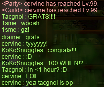
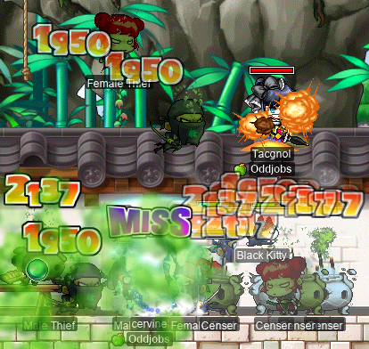
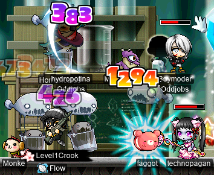
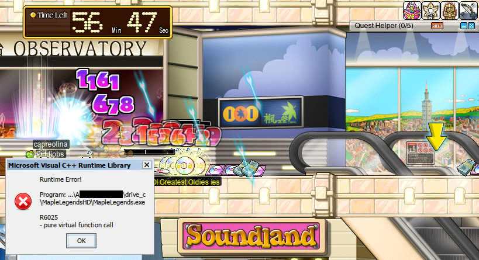

# rangifer’s diary: pt. xxxiii

## More Shaolin Temple mist training with Tacgnol and cervine

It was time to attempt even more [Poison Mist](https://maplelegends.com/lib/skill?id=2111003) training with my friend and guildmate **Tacgnol** the F/P [gishlet](https://oddjobs.codeberg.page/odd-jobs.html#luk-gish) (a.k.a. **Taima**, **Boymoder**, **Gambolpuddy**, **Yotsubachan**) [in the Sutra Depository, section 5-6 F](https://maplelegends.com/lib/map?id=702070300)! With some experience under our belts, we’re gradually getting better at hitting these [slippery, high-level monsters](https://maplelegends.com/lib/monster?id=9600019). Before starting, my I/L [magelet](https://oddjobs.codeberg.page/odd-jobs.html#luk-mage) **cervine** was already most of the way through level 98, so I hit level 99 pretty quickly:

I _did_ level up to 100 in (a bit) less than an hour, but we encountered a bit of a difficulty along the way. When I was some 92%~93% of the way through level 99, Tacgnol leveled up to level 105(!), which meant that we were more than 5 levels apart. Apparently, this screws up the EXP sharing, so I was stuck at exactly 92.68% (I think it was) for a while before I noticed, and drew attention to it. So we had to quickly (before our [basket](https://maplelegends.com/lib/use?id=2020024)s ran out) shuffle over to [STS (Shaolin Temple Square)](https://maplelegends.com/lib/map?id=702050000) to finish up my level 99:

The mobs in STS are a bit less formidable (although still extremely high HP), so I was able to hit them and do reasonable damage with my normal attacks, like [Ice Strike](https://maplelegends.com/lib/skill?id=2211002). And cervine hit level 100~! :D

## More hunting with cervid~

I did a bit more card/event-ETC-item/rose hunting on my [STR priest](https://oddjobs.codeberg.page/odd-jobs.html#str-mage) **cervid**. This time, I started at [Luster Pixies](https://maplelegends.com/lib/monster?id=5120000), because I was 0/5 on [their cards](https://maplelegends.com/lib/use?id=2383020), and they drop [Yellow Valentine Roses](https://maplelegends.com/lib/equip?id=1442047)! Oh, and I managed to squeeze a [White Chocolate](https://maplelegends.com/lib/etc?id=4031109) out of one of them, which is always welcome (for some reason they are much more stubborn to drop for me than the other event ETC items):

cervid @ Luster Pixies~

I went from 0/5 to 5/5 Luster Pixie cards there (yay!), and so I moved [to Chunins](https://maplelegends.com/lib/map?id=800040202) to hunt those instead:

cervid @ Chunins~

As I expected based on my time killing [Chunins](https://maplelegends.com/lib/monster?id=9400401) with Tacgnol, they were a bit stingy with [the cards](https://maplelegends.com/lib/use?id=2383054), so I only ended up with 1 or 2.

## Heading to MPQ with the crew

Ally (member of **Flow**, and thus of **Suboptimal**) sniper **Level1Crook** was trying to form a functional [MPQ](https://maplelegends.com/lib/map?id=261000021) party, so I headed over to Magatia as my [swashbuckler](https://oddjobs.codeberg.page/odd-jobs.html#swashbuckler), alongside my [STRmit](https://oddjobs.codeberg.page/odd-jobs.html#str-assassin) friend **Boymoder**. When we got there, there were many [vomits and throw-ups](https://maplelegends.com/lib/cash?id=5160000) to be had:

We were joined also by **technopagan** the priest (a.k.a. **drainer**, **xX17Xx**, **maebee**, all members of Suboptimal), and **BLiiND** the chief bandit (a.k.a. **CaptainNemo**, also a member of Suboptimal). BLiiND had to leave, though, so I was able to get a spot in this MPQ crew:

And so mae (technopagan) was able to get her first-ever MPQ experience and learn how it works! Unfortunately she had to leave after that, so we only got in 1 PQ. Thankfully, though, it _was_ a “true ending”: we killed [Angy Fanky](https://maplelegends.com/lib/monster?id=9300140), and saved our boy [Romeo](https://maplelegends.com/lib/npc?id=2112009). Oh, and no one died!

## Trying to use a basket on capreolina

Now that I had used a [basket](https://maplelegends.com/lib/use?id=2020024) on cervid and cervine, I went to go use one also on my [wood(wo)man](https://oddjobs.codeberg.page/odd-jobs.html#woodsman), **capreolina**. It was a bit of a rough start, as I was looking around [CDs map](https://maplelegends.com/lib/map?id=742010203)s looking for anyone to party with so that I could use my basket with them, but found no one (and didn’t find any open maps, either). But it was about to get worse, as I simply entered one of the CDs dungeons and used my basket there. I got in just about three minutes of solo grinding before my game client unexpectedly crashed:

:(

Apparently, this is a known, longstanding bug with [the Puppet skill](https://maplelegends.com/lib/skill?id=3111002). Quite frankly, I never use Puppet, and I only have the skill because it’s a pre-requisite for [my birdy](https://maplelegends.com/lib/skill?id=3111005). I decided, for no particular reason, to test it out real quick on [CDs](https://maplelegends.com/lib/monster?id=9410031) for the first time, and crashed within just one second of doing so. Let’s just say I’ve unbound Puppet from my keybindings… R.I.P. capre’s EXP~

## A little event ETC hunting with cervine

Before I went to turn in my quest for another basket on cervine, I decided to do just a bit of event ETC hunting at the [Henesys Hunting Ground](https://maplelegends.com/lib/map?id=104040001):

[White Chocolate](https://maplelegends.com/lib/etc?id=4031109) success!!

## rusa does the chair quest

And now that my [DEX spear(wo)man](https://oddjobs.codeberg.page/odd-jobs.html#dex-warrior) **rusa** is free of [EPQ](https://maplelegends.com/lib/map?id=300030100) (and thus able to gain EXP), it was time for her to do [Romeo](https://maplelegends.com/lib/npc?id=2112004) & [Juliet](https://maplelegends.com/lib/npc?id=2112003)’s chair quest! The first place I went to look for [Love Tickets](https://maplelegends.com/lib/etc?id=4000174) was [at Cube Slimes](https://maplelegends.com/lib/map?id=261010001), and the [Cube Slimes](https://maplelegends.com/lib/monster?id=3110300) were so kind as to almost immediately drop an amazing [Korean Fan](https://maplelegends.com/lib/equip?id=01332020) for me!!:

Over the course of the quest, I managed to finish the sets for both monsters in that map, [Rumo](https://maplelegends.com/lib/monster?id=3110302) and [Cube Slime](https://maplelegends.com/lib/monster?id=3110300):

To wrap up the quest, I headed to [HHGII](https://maplelegends.com/lib/map?id=104040001) to collect some cards and event ETC items there as well:

rusa @ HHG~

And I guess the rose gods smile upon rusa, because she could not stop getting those damn roses:

LOL <3
