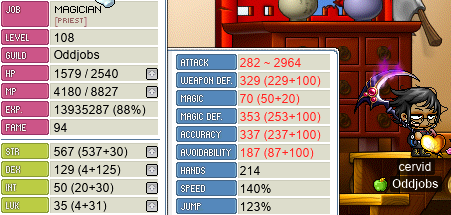

# rangifer’s diary: pt. xxxiv

Grind. Grind. Grind. Grind. Grind. …

## cervid hunts more Chunins

For more card/event-ETC/rose hunting, I headed back [to Chunins](https://maplelegends.com/lib/map?id=800040202) with my [STR priest](https://oddjobs.codeberg.page/odd-jobs.html#str-mage), **cervid**. My previous 60-minute sweatgrind session at [Chunins](https://maplelegends.com/lib/monster?id=9400401) yielded just one [card](https://maplelegends.com/lib/use?id=2383054), so I still needed four more to complete the set… Another 60-minute sweatgrind session got me two cards, leaving just two more to go:

cervid @ Chunins, again~

The above-pictured [Dark Snowboard](https://maplelegends.com/lib/equip?id=1442016) was the first of two Dark Snowboards that I got in this farming sesh. This one is 70 WATK (quite good, one less WATK than perfect), and the other one is basically useless, at just 61 WATK…

At this point, I was still starved for [White Chocolates](https://maplelegends.com/lib/etc?id=4031109)~

My third Chunin farming sesh got me the two cards that I needed to complete the set! All in all, it was about 2.5 hours of continuous grinding on the Chunins map in order to get 5 cards.

## More event ETCs

Because I was still starved for [White Chocolates](https://maplelegends.com/lib/etc?id=4031109), and there was no end in sight, I decided to just [smega](https://maplelegends.com/lib/cash?id=5072000) asking to trade my other event ETC items in exchange for other folks’ White Chocolates. Fortunately for me, a number of people replied to my smega, including **Phuonggo**, who kindly donated five White Chocolates to me in exchange for a whole lot of nothing! Thanks Phuonggo!!:

And to round out my collection, I went to [HHGII](https://maplelegends.com/lib/map?id=104040001) on my [STR priest](https://oddjobs.codeberg.page/odd-jobs.html#str-mage), **cervid**, [Kebob](https://maplelegends.com/lib/equip?id=01332053) in hand:

## LPQ with the crew~

We were able to gather up me, **Kelsey** (**Gambolpuddy**, **Taima**, **Tacgnol**, **Boymoder**, **Yotsubachan**), and **mae** (**maebee**, **drainer**, **xX17Xx**) for some [LPQ](https://maplelegends.com/lib/map?id=221024500)in’! In order to fill up our party and be capable of doing the thief and mage portals, I tagged along with my assassin mule **sets** (just to do the thief portal), and we invited some other folks from outside of the guild as well. After our mage disconnected during the stage that has the mage portal (ouch), we exited that PQ with style:

Pictured above are **hashishi**, my [besinner](https://oddjobs.codeberg.page/odd-jobs.html#besinner), **maebee**, mae’s [woodwoman](https://oddjobs.codeberg.page/odd-jobs.html#woodsman), and **Gambolpuddy**, Kelsey’s [DEXginner](https://oddjobs.codeberg.page/odd-jobs.html#dex-beginner).

We did manage to fully complete at least two LPQs or so, though :P

## Some more mist training at Shaolin Temple with Tacgnol

My I/L [magelet](https://oddjobs.codeberg.page/odd-jobs.html#luk-mage), **cervine**, and Kelsey’s F/P [gishlet](https://oddjobs.codeberg.page/odd-jobs.html#luk-gish), **Tacgnol**, were headed back to the [Shaolin Temple](https://maplelegends.com/lib/map?id=702100000) region of China in order to do some more [Poison Mist](https://maplelegends.com/lib/skill?id=2111003) training! Unfortunately, like last time, we were only able to stay at [the 5-6 F section of the Sutra Depository](https://maplelegends.com/lib/map?id=702070300) for so long before Tacgnol outleveled me, and we were forced to go back to [STS](https://maplelegends.com/lib/map?id=702050000)… Here I am, getting a [Censer](https://maplelegends.com/lib/monster?id=9600017) card:

After a brief break, Tacgnol was ready to use another [basket](https://maplelegends.com/lib/use?id=2020024) to do some more mist training. Rather than be stuck at STS all day, I moved over to my [STR priest](https://oddjobs.codeberg.page/odd-jobs.html#str-mage), **cervid**, who is higher level. Of course, cervid is at quite the disadvantage w.r.t. WACC, because she is DEXless and LUKless (unlike cervine, who is pure LUK). I was able to make up for some of this just by being higher level (if you are lower level than your target, the probability of hitting scales down linearly with the size of the level gap, _ceteris paribus_), but also, Kelsey helped me out by letting me borrow some pretty insane WACC/DEX gear, including a 14 DEX [YAC](https://maplelegends.com/lib/equip?id=01102040) and a [Guan Yu](https://maplelegends.com/lib/equip?id=01442025) with 50 WACC and some 17 or so DEX!!! Here is cervid, achieving 337(!) WACC with the help of a basket:

We trained enough to get cervid to level 109 (yayy!), and I even got some [Silver Spearman](https://maplelegends.com/lib/monster?id=9600024) cards along the way:

## Grind sesh @ Fancy Amps w/ Taima

In order to get both cervid, and Kelsey’s [STRginner](https://oddjobs.codeberg.page/odd-jobs.html#permabeginner), **Taima**, some EXP, we headed over [to Fancy Amps](https://maplelegends.com/lib/map?id=742010201) for a 60-minute grind sesh:

Which meant inching even closer to the fabled level 110~ Wowie ^^

## Starting the Taipei 101 concert quest

Some may be familiar with [Dreamy Park Concert](https://maplelegends.com/lib/quest?id=8683), a quest in [Taipei 101](https://maplelegends.com/lib/map?id=742000000). I completed this quest a while back, on my [woodwoman](https://oddjobs.codeberg.page/odd-jobs.html#woodsman) **capreolina**, because **Tab** (known in-game as **Outside**, **Dodogge**, **TestChars**, **Romilda**) informed me of the quest’s existence and claimed that it rewards a random Umbrella weapon on completion. The promise of an Umbrella was enough to get me to try it, although I will say that the quest is quite painful, simply due to [one part of the quest](https://maplelegends.com/lib/quest?id=8686) which requires you to collect 200 ETC items from each species of Perfume (thus 600 Perfume ETCs in total). Now, killing [Perfumes](https://maplelegends.com/lib/monster?id=9410022) is kind of a massive pain in the ass, because killing them initially doesn’t do anything. Once they die, you have to wait for it to spawn a [Transformed Perfume](https://maplelegends.com/lib/monster?id=9410023), and then kill that. Because of the delay, and because the Transformed version does not retain the aggro of the original, and because the Transformed version uses magical ranged attacks, and because the ETC items only drop from _some_ of the killed Transformed Perfumes, among other things, collecting 600 [Perfume ETCs](https://maplelegends.com/lib/etc?id=4000314) is not something that I could ever look forward to…

The first time that I completed this quest, on capreolina, I got fairly lucky, and got a [Black Umbrella](https://maplelegends.com/lib/equip?id=01302026) (the two rewards that you generally really want are the Black and [Beige](https://maplelegends.com/lib/equip?id=01302029) Umbrellas). Of course, I boomed the thing on the first slot, which really made me feel vindicated for all of the hard work that I put into the quest. This time, my motivation for doing the quest (this time, on my [STR priest](https://oddjobs.codeberg.page/odd-jobs.html#str-mage) **cervid**) is only partially the Umbrella; it has come to my attention that this quest leads into another questline that involves getting the [Spirit of Rock’s Music Score](https://maplelegends.com/lib/etc?id=4000323). I actually already have this item, from [when I soloed the Spirit of Rock on cervid](https://www.youtube.com/watch?v=D5fhczQQz3c). Taima has been wanting to try duoing the [Spirit of Rock](https://maplelegends.com/lib/monster?id=9410035) with me, both of us with [basket](https://maplelegends.com/lib/use?id=2020024) in hand, and if that were to result in SoR dropping his Music Score, that would mean we could complete the quest at the same time! That is, as long as I complete the pre-requisite quest first, so that means a lot of perfume-killing for cervid…

## rusa OPQs for the first time

My [DEX spearwoman](https://oddjobs.codeberg.page/odd-jobs.html#dex-warrior), **rusa**, tried out [OPQ](https://maplelegends.com/lib/map?id=200080101) for the first time! I met up with some fine OPQers, including **Lvoe**, **June31st**, **TheHadesGod**, **SaMa**, **meringuesoup**, **MoedB**, and someone with whom I’ve actually OPQed before: **LegendKnight**. **LegendKnight** is the spearman/DK of **IHealForYou**, who you might recognise from previous entries where my [pugilist](https://oddjobs.codeberg.page/odd-jobs.html#pugilist), **rangifer**, was at OPQ. Here he is, decorating OPQ for old times’ sake:

Here we are, fighting [Papa Pixie](https://maplelegends.com/lib/monster?id=9300039):

…and rusa is now level 58! Neato~

## A lil more grind, for capre and cervine~

I went to use my [baskets](https://maplelegends.com/lib/use?id=2020024) on my [woodwoman](https://oddjobs.codeberg.page/odd-jobs.html#woodsman) **capreolina**, and my I/L [magelet](https://oddjobs.codeberg.page/odd-jobs.html#luk-mage), **cervine**. I tried sending out a [smega](https://maplelegends.com/lib/cash?id=5072000) on capre, asking if anyone wanted to party up with a, um, crappy level 106 ranger. Sometimes I find it best to just not tell anyone that I’m a woodwoman, and just pretend I’m a normal ranger who just has crappy gear and a lot of INT (and hope they don’t notice that my bow damage is way too stable for that to be the case…). I did get a response from a level 10X priest who was willing to come [to Gallos (Galloperas)](https://maplelegends.com/lib/map?id=551030100) and try training with me. When he got to Gallos, though, he ran into a bishop who was [Genesis’ing](https://maplelegends.com/lib/skill?id=2321008) the map, and decided to inquire about leech. Before I realised what was going on (I was in a different channel for most of the exchange), the bishop had agreed to give Gallos leech to us two as long as we provided them with potions. I expressed a lack of interest, but the person who replied to my smega was kind enough to insist on providing all of the potions, thus amounting to completely free leech for me… I felt rude having to reject their offer, but I insisted that my guild does not allow leeching, and left them to their business.

I tried a little bit of solo grinding in another Gallos channel, with basket active, just to see how that would compare to the same EPH (experience per hour) [at CDS](https://maplelegends.com/lib/map?id=742010203):

This might be a slight underestimate insofar as the map was a little bit new to me (although I had trained there a bit before), but still indicates pretty clearly that this is worse EPH than CDs for me. Plus, the potion cost is even significantly steeper than at CDs! So for the remaining duration of my basket, I headed to CDs to get a solo EPH of around 5.5M~5.6M.

I did the same on cervine (except without the brief excursion to Gallos; I was at CDs the whole time), getting her closer to 102 (and thus to 103, when I can start using [Elemental Staves](https://maplelegends.com/lib/equip?id=01382047)!)~ Although, somewhat ironically (considering that cervine is a mage), I get considerably less EPH on cervine; “only” about 3.3M~3.4M when soloing CDs with basket during the event.

<333
