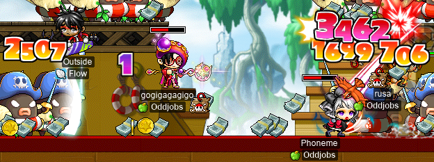
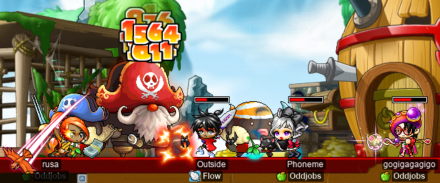
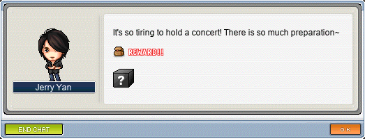
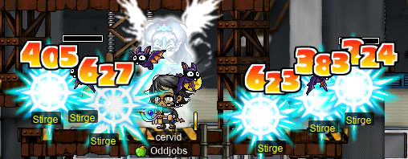
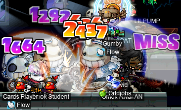
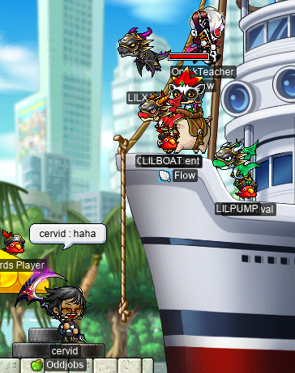

# rangifer’s diary: pt. xxxv

## PPQ with allies~

**Tab** (known in-game as **Outside**, **TestChars**, **Dodogge**, **Romilda**) wanted to do some alliance-only (**Suboptimal**-only) [PPQ](https://maplelegends.com/lib/map?id=251010404)s. Once we were able to get together, we had a formidable crew:

- Outside ([STRginner](https://oddjobs.codeberg.page/odd-jobs.html#permabeginner) of **Flow**)
- **rusa** (my [DEX spearwoman](https://oddjobs.codeberg.page/odd-jobs.html#dex-warrior), of **Oddjobs**)
- **Phoneme** ([permamagician](https://oddjobs.codeberg.page/odd-jobs.html#permamagician) of Oddjobs)
- **gogigagagigo** ([permarcher](https://oddjobs.codeberg.page/odd-jobs.html#permarcher) of Oddjobs)

Suboptimal PPQing

gogigagagigo got a key from the boss during one of the runs, so we set out to get him some sweet loot, and fight [angy lord pirate](https://maplelegends.com/lib/monster?id=9500175):

Tab then had to leave, but we were able to keep going as a full Oddjobs party for a few runs:

Oddjobs PPQing

By the end of all of this, rusa had leveled up to level 59! Yay!

## cervid wraps up Jerry Yan’s quest

As featured in the diary entry before this one, my [STR priest](https://oddjobs.codeberg.page/odd-jobs.html#str-mage) **cervid** has been working on [Jerry Yan](https://maplelegends.com/lib/npc?id=9330055)’s quest, [Dreamy Park Concert](https://maplelegends.com/lib/quest?id=8683). I got the hard part out of the way first, getting those pesky [perfume ETC](https://maplelegends.com/lib/etc?id=4000315)s partway done. I finished them up now, for a total of 600(!!) perfume ETCs…

So it was time to gather up the rest of the ETCs (the easier ones):

Gathering Taipei 101 ETCs~

Having nearly finished the [Cheap Amp ETC](https://maplelegends.com/lib/etc?id=4000317)s, cervid got enough EXP to hit level 110!!! Finally, I can buy a [MoN](https://maplelegends.com/lib/equip?id=01122059), hehe~~

Now that I finally had every single one of the 1200 ETC items necessary, it was time for my reward:

I think the [Green Umbrella](https://maplelegends.com/lib/equip?id=01302027) is (correct me if I’m wrong) the worst possible reward here. In any case, I was hoping for a [Beige Umbrella](https://maplelegends.com/lib/equip?id=01302029) or [Black Umbrella](https://maplelegends.com/lib/equip?id=01302026). Thanks a lot, Mr. Yan…

## hydropotina tries CDs for the first time

Now that my [swashbuckler](https://oddjobs.codeberg.page/odd-jobs.html#swashbuckler), **hydropotina**, has graduated [MPQ](https://maplelegends.com/lib/map?id=261000021), she’s all on her own. Most of my characters at this point are stuck [at CDs](https://maplelegends.com/lib/map?id=742010203), and with hydro’s ability to shred up to six monsters at once with her [Somersault Kick (SSK)](https://maplelegends.com/lib/skill?id=5001002), CDs are the obvious choice for her as well…

(This is with event EXP + [basket](https://maplelegends.com/lib/use?id=2020024).) Pretty impressive for level 86!! Along with my SSK, I also have my [octo](https://maplelegends.com/lib/skill?id=5211001) and my [birdy](https://maplelegends.com/lib/skill?id=5211002) on my side. It can, however, be rather frustrating to corral the CDs so that I can kill them reasonably efficiently. Because I have my [skis](https://maplelegends.com/lib/equip?id=01432018) equipped when doing this, I can’t benefit from [Recoil Shot](https://maplelegends.com/lib/skill?id=5201006), and my reach is very close-range (SSK has about the horizontal range of basic-attacking with a dagger…). So I have to make some careful movements, and make use of my basic-attacking (not good for damage, but has more reach than using SSK; although, the boxes/crates in the map often get in the way of this) to try to round up these circular bastards so that I can bicycle-kick them into oblivion.

I met **LABanditz** (a [shadower](https://maplelegends.com/lib/skill?id=4221007)) here, who graciously agreed to grind with me, and even added me to BL afterwards :)

## cervid hunting with basket

I wanted to eat up a [basket](https://maplelegends.com/lib/use?id=2020024) on my [STR priest](https://oddjobs.codeberg.page/odd-jobs.html#str-mage) **cervid**, but, as usual, it’s harder for me to seriously benefit from the basket on cervid than it is on my other characters. So I used it for a little casual farming:

Farming with cervid~

Aaand I finished my [Stirge card](https://maplelegends.com/lib/use?id=2381003) set~

It looks like [Jr. Neckis](https://maplelegends.com/lib/monster?id=2130103) have too much AVOID for this [SR](https://maplelegends.com/lib/skill?id=2311004) strategy to work for my STR priest:

…But a lil bit of brute force does the trick.

## Captain Latanica wanted dead, not alive!

**Slime** (**OmokTeacher**, **Slime**, **Slimu**) wanted to run quad [Capt. Lat](https://maplelegends.com/lib/monster?id=9420513)s for great justice (and great EXP)! The idea was to use a single [basket](https://maplelegends.com/lib/use?id=2020024) not too long before server reset (reset being 00:00:00 [UTC](https://en.wikipedia.org/wiki/Coordinated_Universal_Time)), then kill two Capt. Lats, then wait until reset, and then kill two more. Assuming that we plan it right and kill the guy quickly enough, this allows us to do four(!) Capt. Lats in the span of a single basket (which lasts for 60 minutes). The reason for orienting this around the reset time is that Capt. Lat is considered a raid boss, so you can only kill him up to a maximum of twice daily. So I set about getting some more [White Essences](https://maplelegends.com/lib/etc?id=4000381) so that I would have three ready for our runs. My [woodwoman](https://oddjobs.codeberg.page/odd-jobs.html#woodsman), **capreolina**, had never done the prequest before, so I went to do that:

capre does the Capt. Lat prequests~

I got so many cards from the [Mr. Anchors](https://maplelegends.com/lib/monster?id=9420512) that I was able to finish the set for both capre and cervid!

Once I had finished the prequests on capre, and done the repeatable White Essence quest on cervid, I had three essences ready to go (I already had one from before this), so we gathered in [GS7](https://maplelegends.com/lib/map?id=541010060) to prepare:

So it was me, as my level 110 [STR priest](https://oddjobs.codeberg.page/odd-jobs.html#str-mage) cervid, and two [STRginners](https://oddjobs.codeberg.page/odd-jobs.html#permabeginner), **OmokTeacher** and **Gumby**.

Each run took 5~5.5 minutes each! So fast :O! So after four successful Capt. Lat kills, we finally got to see the boat cleaned up:

Clean boat ✨

## hydro grinds CDs with Taima

I went back [to CDs](https://maplelegends.com/lib/map?id=742010203) with my [swashbuckler](https://oddjobs.codeberg.page/odd-jobs.html#swashbuckler), **hydropotina**, for some more [basket](https://maplelegends.com/lib/use?id=2020024) grinding. But this time, I was joined by my [STRginner](https://oddjobs.codeberg.page/odd-jobs.html#permabeginner) friend, **Taima** (**Tacgnol**, **Boymoder**, **Gambolpuddy**, **Yotsubachan**, **Numidium**)! And we ground enough to get Taima some pretty solid EXP, as well as get hydro from level 87 to level 88!:

## General grinding nonsense

Not included in this diary are the numerous episodes of me painstakingly grinding at CDs every day on my [woodwoman](https://oddjobs.codeberg.page/odd-jobs.html#woodsman), **capreolina**, and my I/L [magelet](https://oddjobs.codeberg.page/odd-jobs.html#luk-mage) **cervine**, as well as some other sad (and occasionally, less sad) grinding sessions. capreolina is now level 107, and cervine is 102 (so close to that [Elemental Staff 3](https://maplelegends.com/lib/equip?id=01382047)!).

## I’m an idiot

**Tacgnol** (**Taima**, **Boymoder**, **Gambolpuddy**, **Yotsubachan**, **Numidium**) graciously offered to do some [Poison Mist](https://maplelegends.com/lib/skill?id=2111003) training with me, again with me playing cervid, and with us grinding at [the 5-6 F section of the Sutra Depository](https://maplelegends.com/lib/map?id=702070300). Short story shorter, some 3%~5% or so of the way through the 60 minute duration of our [basket](https://maplelegends.com/lib/use?id=2020024)s, I died.

I didn’t have the basket quest ready, so I was kinda screwed, and we ended up deciding to move to [3-4 F](https://maplelegends.com/lib/map?id=702070200) (which has no golden monsters). But I was so frazzled, I was frequently forgetting to re-[HS](https://maplelegends.com/lib/skill?id=2311003) myself and was just generally kind of frustrated with myself for unexpectedly dying…

After Tacgnol’s basket was done, we went to go do something more chill, and [LPQ](https://maplelegends.com/lib/map?id=221024500)ed on her [DEXginner](https://oddjobs.codeberg.page/odd-jobs.html#dex-beginner) **Gambolpuddy**, with my [besinner](https://oddjobs.codeberg.page/odd-jobs.html#besinner) **hashishi** (and my MPQ-mule-to-be, **potpan**).

<3
