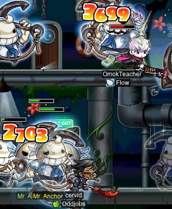
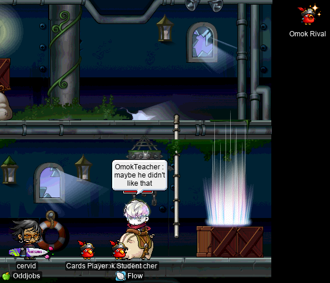
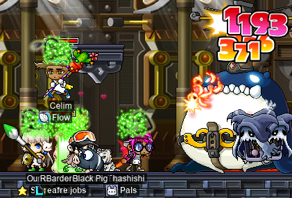
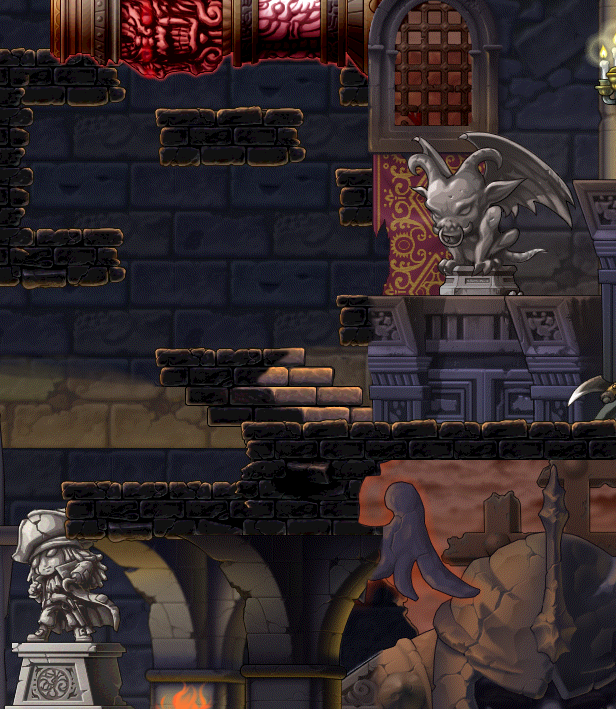
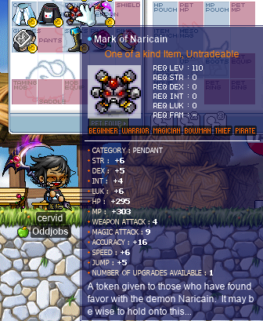
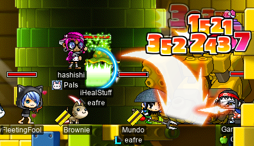
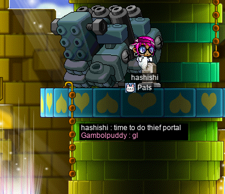
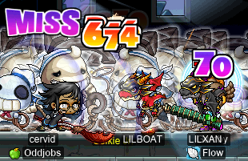
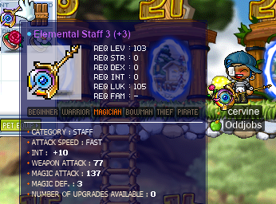
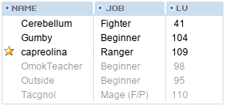

# rangifer’s diary: pt. xxxvi

## cervid and OmokTeacher slay Capt. Latanica (four times)

Oh, you thought we were only gonna kill [Capt. Lat](https://maplelegends.com/lib/monster?id=9420513) four times _once_? Think again! Capt. Lat must pay for their crimes a thousandfold!! Here I am on my [STR priest](https://oddjobs.codeberg.page/odd-jobs.html#str-mage), **cervid**, doing the quest to get some more [White Essences](https://maplelegends.com/lib/etc?id=4000381):

**Omok Rival** left us with an ominous portent just before we went to slay the captain:

Omok Rival enters the void~

…But the Capt. Lat runs turned out just fine! We slayed all 4 captains easily within the span of one [basket](https://maplelegends.com/lib/use?id=2020024). And got some joocy EXPs~

## LPQ with doiob and Celim

Some allies of mine, **doiob** ([STR cleric](https://oddjobs.codeberg.page/odd-jobs.html#str-mage) and member of **Oddjobs**) and **Celim** ([STRginner](https://oddjobs.codeberg.page/odd-jobs.html#permabeginner) and member of **Flow**), wanted to [LPQ](https://maplelegends.com/lib/map?id=221024500), and my [besinner](https://oddjobs.codeberg.page/odd-jobs.html#besinner) **hashishi** was in level range as well! So off we went:

We get a few confused questions about why we were still beginners, in LPQ… and I did surprise at least one person by throwing stars as soon as we entered the PQ (if [besinners](https://oddjobs.codeberg.page/odd-jobs.html#besinner) have anything, it is surely the element of surprise…). And again, we got some joocy EXPs, which is always nice~

## Getting a MoN for cervid~

Now that my [STR priest](https://oddjobs.codeberg.page/odd-jobs.html#str-mage) **cervid** has since hit level 110(!), I have been on the lookout for folks selling [MoN](https://maplelegends.com/lib/equip?id=01122059)s. I found some sellers, and set off into the mysterious unknown that was CWKPQ. I’d never actually seen any of it, and I got to attend two runs.

It seemed to me (based on what I saw) that CWKPQ is somewhere between a PQ like [OPQ](https://maplelegends.com/lib/map?id=200080101) and a raid boss like [Zakum](https://maplelegends.com/lib/map?id=280030000). Like traditional PQs, CWKPQ demands the presence of some classes (presumably to encourage diversity in the jobs that players choose to play), starts out with a series of stages that are not _necessarily_ combat-oriented (puzzles, JQs, etc.), and culminates in a boss fight at the end. Unlike traditional PQs, and more like raid bosses, CWKPQ requires significant pre-questing, uses “expedition”-style signups to circumvent the limitation on parties that they can only hold up to 6 characters, and spends most of its time on the boss-fighting. One of the stages features a large statue, which must have special items placed on corresponding parts of the statue in order to complete the statue and move to the next stage. That concept will be very familiar to OPQers — but, whereas only a small portion of the time spent OPQing is spent killing [Papa Pixie](https://maplelegends.com/lib/monster?id=9300039), the majority of the time spent CWKPQing is spent bossing.

Here is a composite of some screenshots that I took of CWKPQ’s interior, because I think CWKPQ looks cool and spooky~:

CWKPQ composite

And I got a [MoN](https://maplelegends.com/lib/equip?id=01122059)!!:

Obviously I was shooting for a 5 WATK one, but I didn’t like my odds when it came to relooting another one (as I would be paying just as many mesos, even if I ended up downgrading, which was fairly likely). This one is almost there (4 WATK), and the other stats are quite good. Maybe in the future when I can pay to loot enough MoNs to seek a 5 WATK one, I will upgrade :P

## hashishi and Gambolpuddy embark on more LPQ (mis)adventures

It is time for another episode in the series: _LPQ shenanigans with hashishi & Gambolpuddy_!

This time, we ended up LPQing with some LPQ mules who dealt truly unwarranted quantities of damage and were sometimes found throwing [stars whose worth is in excess of 100 million mesos](https://maplelegends.com/lib/use?id=2070019)!

(Pictured above is **FleetingFool**, an LPQ mule.)

At one point, though, we did have some trouble just finding any [mage](https://maplelegends.com/lib/skill?id=2301001), and unfortunately LPQ mules can’t help with that. **Boredom**, another LPQ mule, wanted to attempt the PQ anyways, suggesting that our gunslinger party member could make use of [Recoil Shot](https://maplelegends.com/lib/skill?id=5201006) to fall off of each platform in the mage portal, and then recoil back to the platform just below it. Gambolpuddy and I were skeptical of this, since we both believed there to be a large platform spanning the width of the map, at the top of the map (where you enter), that blocks downjumps and absolutely requires [Teleport](https://maplelegends.com/lib/skill?id=2301001) to bypass. But we gave it a try anyways, as we didn’t seem to be getting a mage any time soon, and Boredom promised to [commit suicide to atone for his dishonour](https://en.wikipedia.org/wiki/Seppuku) in the case that he was wrong…

Because Gambolpuddy and I are [beginners](https://oddjobs.codeberg.page/odd-jobs.html#permabeginner), we had nothing to lose from also dying, so we took leaps into [the golems](https://maplelegends.com/lib/monster?id=9300013) for fun. I managed to survive them (on the basis of no more than some fortunate timing), and decided to try my hand at doing the thief portal. After all, I am a (be)sin(ner)!:

## cervid does a little more card-hunting

I did some more card-hunting on my [STR priest](https://oddjobs.codeberg.page/odd-jobs.html#str-mage), **cervid**, and managed to complete my [Jr. Necki](https://maplelegends.com/lib/monster?id=2130103), [Horny Mushroom](https://maplelegends.com/lib/monster?id=2110200), and [Zombie Mushroom](https://maplelegends.com/lib/monster?id=2230101) sets!:

card-hunting with cervid~

## cervine duos with FireKatana at CDs

As part of my quest to force myself (lol) to use my [baskets](https://maplelegends.com/lib/use?id=2020024) every day, I was [at CDs](https://maplelegends.com/lib/map?id=742010203), grinding as my I/L [magelet](https://oddjobs.codeberg.page/odd-jobs.html#luk-mage) **cervine**. Some way into my basket, as I was solo grinding, an F/P mage by the name of **FireKatana** showed up and ask to party, and I obliged. F/P mages are a rare sight indeed at CDs (unless they are giving leech with [Meteor Shower](https://maplelegends.com/lib/skill?id=2121007), I suppose), because they are generally off somewhere else doing [Poison Mist](https://maplelegends.com/lib/skill?id=2111003) training. FireKatana was not using Poison Mist much, if at all, instead opting for [Explosion](https://maplelegends.com/lib/skill?id=2111002) spam.

Some 15 or so minutes into our duoing, FireKatana grew so concerned with my troublingly low damage that he started repeatedly spamming [Meditation](https://maplelegends.com/lib/skill?id=2101001) on me to see if that would “fix” my damage… Pro tip: I already had a 20 MATK boost from the basket, and in any case, I have my own maxed Meditation. So of course, this did nothing. It was at that point that FireKatana had had about enough of me:

Oh well, more solo CDs it is…

## cervid and Gumby slay Capt. Latanica (four times)

_MOAR_ Capt. Lat slaying!! This time, **OmokTeacher** (**Slime**, **Slimu**) couldn’t make it, so I duoed with **Gumby** (another [STRginner](https://oddjobs.codeberg.page/odd-jobs.html#permabeginner) from **Flow**):

Duoing Capt. Lat 4 times with Gumby~

")

## Duoing CDs with Gumby

I also did some duo [CD](https://maplelegends.com/lib/monster?id=9410031)s grinding with Gumby, who, thankfully, did not leave due to my poor damage like FireKatana did :P

We got some pretty solid EXP (Gumby was getting somewhere around 3M EPH, I think), although unfortunately Gumby’s game crashed about 3 seconds(!) into the duration of his first [basket](https://maplelegends.com/lib/use?id=2020024) :( So he had to relog and get another basket to grind with.

## Preparing to slay Ravana :O

In preparation for our alliance’s (**Suboptimal**’s) all-odd-job [Ravana](https://maplelegends.com/lib/monster?id=9420014) run that we had planned a few days prior, I went and completed the Ravana pre-quests on my [woodwoman](https://oddjobs.codeberg.page/odd-jobs.html#woodsman) **capreolina**:

The Ravana pre-quests can be kind of a pain in the ass (especially if you’re, say, relatively low-level, and/or are an odd-jobber…), as the monsters that you’re required to kill have some pretty steep stats, and very high HP. This culminates in killing [Strong Stone Goblins](https://maplelegends.com/lib/monster?id=9420013) for their bright red panties, which tends to be very difficult indeed, considering their high level (99), very high HP (60k), high WDEF (850), high AVOID (38), and just all-around overpoweredness. The expensive bit of the quest consists in the dozen or so [crystals](https://maplelegends.com/lib/etc?id=4005000) that you need, but if you’re not committed to collecting/crafting these all yourself (god help you), they can be relatively easily purchased in the FM anyways.

Oh, and the pre-quests reward 10 [Guavas](https://maplelegends.com/lib/use?id=2022230), which is nice for my [magelet](https://oddjobs.codeberg.page/odd-jobs.html#luk-mage) :P

## Scrolling a usable Elemental Staff

Now that my I/L [magelet](https://oddjobs.codeberg.page/odd-jobs.html#luk-mage) **cervine** is level 103, she can finally make an upgrade that will give her a bit of a damage boost :O, thanks to the [Elemental Staff 3](https://maplelegends.com/lib/equip?id=01382047)! I actually bought up probably a dozen or more of these things, all clean (along with a similar, but smaller, number of [Elemental Staves 4](https://maplelegends.com/lib/equip?id=01382048)), with the intent to throw a lot of [30%](https://maplelegends.com/lib/use?id=2043805)s and hope that I can pass two on the same staff (and then improve later on, by getting progressively more greedy as I try to beat my previous highest TMA staff). I never managed to pass more than one on the same staff, and couldn’t even pass more than one [70%](https://maplelegends.com/lib/use?id=2043804) on the same staff, so I was just booming them (and just generally horribly failing) left and right… until this one.

I actually failed the first three(!) slots of this thing, but it had quite good stats when clean, and staff 30%s are relatively cheap, so I continued trying (particularly due to **Dizz**, who was actively encouraging me in alliance chat to be as greedy as possible) and managed to actually pass a 30% on the fourth slot. Oh, and another 30% pass on the fifth slot :O… At that point, the thing was already better than my crappy staff I was lugging around to use at the time, so I could honestly have just [60%](https://maplelegends.com/lib/use?id=2043801)ed the last two slots. Even at (+2) with an embarrassing only two slots left, the thing was already glowing purple. But Dizz and **OmokTeacher** egged me on, and OmokTeacher helped me by [owl](https://maplelegends.com/lib/cash?id=5230000)ing for more staff 30%s, so I set out to 30% those last two…

One did fail, but the other passed, and it survived the whole way (yes, it survived all _seven_ 30%s)! And hey, passing 3/7 is a 42.86% success rate, which is better than 30%, heh. I hope to do better than this in the future (this weapon is very important, as it is the only thing empowering me to get the EXP for level 120, and even then I have to keep using it [until level 130](https://maplelegends.com/lib/equip?id=01372041)), but for now this is a great upgrade!!

## Attempting an all-odd-job Ravana run for the first time!!

As mentioned, we planned an **all-odd-job Ravana run**. The day and the time was now, and so we gathered up at the entrance to Ravana’s lair, desperately trying to get ready. We had some people show up a little late, although it didn’t matter too much, since we really just needed people to show up at all, for a full party of 6. I had prepared a ton of USE items for the run:

Including some >2.4k [PE](https://maplelegends.com/lib/use?id=2000005)s, six [apples](https://maplelegends.com/lib/use?id=2022179), 60 [unripe apples](https://maplelegends.com/lib/use?id=2012008), a bunch of [Diamond Arrows](https://maplelegends.com/lib/use?id=2060004), a stack of [ACP](https://maplelegends.com/lib/use?id=2022178)s (which it turns out we really don’t need, but better safe than sorry), and some other crap. Our party did eventually form, though:

- **Cerebellum**, level 41 [HP fighter](https://oddjobs.codeberg.page/odd-jobs.html#hp-warrior).
- **Gumby**, level 104 [STRginner](https://oddjobs.codeberg.page/odd-jobs.html#permabeginner) (of **Flow**).
- **capreolina**, my level 109 [woodwoman](https://oddjobs.codeberg.page/odd-jobs.html#woodsman) ranger (of **Oddjobs**).
- **OmokTeacher**, level 98 [STRginner](https://oddjobs.codeberg.page/odd-jobs.html#permabeginner) (of Flow).
- **Outside**, level 95 [STRginner](https://oddjobs.codeberg.page/odd-jobs.html#permabeginner) (of Flow).
- **Tacgnol**, level 110 F/P [gishlet](https://oddjobs.codeberg.page/odd-jobs.html#luk-gish) (of Oddjobs).

We were really scrambling to get our shit together, trying to make sure that everyone had enough PEs, enough WATK buffs (apples/unripe apples/[heartstoppers](https://maplelegends.com/lib/use?id=2022245)), etc. Especially because OmokTeacher (**Slime**) called in a favour from **Steve** (known in-game as **OpTiC**, level 200 marksman of **Kyoto**), who blessed our run with a very helpful [Echo of Hero](https://maplelegends.com/lib/skill?id=0001005)!:

Steve was very patient with us and wished us good luck, and so off we went to give it our best shot! At first, things went quite well; Ravana behaved more-or-less predictably, and in a way that allowed me to [Strafe](https://maplelegends.com/lib/skill?id=3111006) him with minimal interruption (this was particularly a concern for me, since I was doing a lot of damage and was the only one not meleeing). He telegraphs his attacks quite a bit, and many of them simply missed me because I was not in the way, or I stepped out of the way, or they simply **MISS**ed. Of course, the attacks that do hit tend to do a bit more than 5k damage each, so using a PE immediately after each hit (pet auto HP on 100%!) is necessary for all of us (except Cerebellum, as an HP warrior); for example, with [HB](https://maplelegends.com/lib/skill?id=1301007) from [basket](https://maplelegends.com/lib/use?id=2020024), I was sitting at 5584 MAXHP. We also seemed to be doing pretty decent DPS at first, surely enough to keep pace with the 60 minute time limit.

As the run went on, I started to notice how much Ravana was healing himself. Our damage seemed more impressive at first, before he really started healing himself in earnest, but once he did start healing quickly, our DPS was only beating his healing by a small amount. So, it seemed we could still be on pace to finish in 60 minutes, but it was going to be a pretty tight squeeze.

Then we had the first real mishap of the run: OmokTeacher died, a few minutes into the run. Although he definitely had his pet’s auto HP set to 100%, and set to use PEs, and he said that he was rapidly spamming the PE hotkey in the moments before he died, these things were finnicky enough to kill him anyways. I kind of figured (and OmokTeacher likely did as well) that this was just an inevitability, or at least something that was likely enough to happen, with no way of stopping it. Pet auto HP is well-known to sporadically fail at seemingly random times, and even manual inputs have this issue; in my personal experience doing a lot of manual potting in dangerous situations, one press often works, a double-press is necessary in more dire situations (even if you only need one potion to be consumed), and in general there _is no particular limit_ on how many times you press your potion’s hotkey before the game actually registers the potion usage.

It is here that I should note that one of our party members (Gumby) had actually not participated in the fight yet. Unfortunately, he had an important report due very soon (just a small number of hours) that he had to cram and get finished before the deadline. So he said that he would probably not be able to participate in the fight at all for the first 20~30 minutes, but could stand AFK (or semi-AFK) in the far corner with his pets there to heal him. This worked well enough, as he was still alive after the first 30 minutes or so of the fight (Ravana had yet to waddle far enough to actually get near Gumby, so Gumby had only tanked a handful of magical attacks). That was good, because we had long since realised that we really needed Gumby’s DPS to be able to kill Ravana within the time limit, especially since OmokTeacher died.

So about 30 minutes into the fight, Gumby was finally able to join. Fortunately for Gumby, he has a whole lot of HP for a beginner (due in part to his [T8 ring](https://maplelegends.com/lib/equip?id=01119010), which will be [T9](https://maplelegends.com/lib/equip?id=01119011) soon~!). Unfortunately for Gumby, upon entering the battle, he almost immediately had a mishap similar to OmokTeacher, and died as well. At that point, the run was _definitely_ hopeless, and so we quit early to save ourselves the massive potion/consumable cost.

Although we did fail our first attempt, this was essentially to be expected, and it gave us a lot of information that will be very useful on our next attempt. Although the run was a full 30+ minutes before we bailed out, it felt more like 3 minutes to me, because I was so intent on killing that half-dozen-armed bastard. I really do hope to try again, and I know that we can do it, although I will say that each attempt is quite costly; among other things, I used some 7M~8M mesos worth of consumables just in that botched half-run.

Here’s hoping for another full-party all-odd-job Ravana run <3
