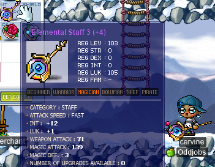
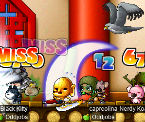
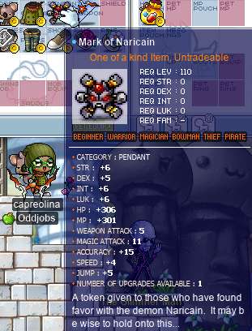
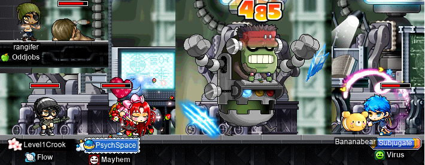
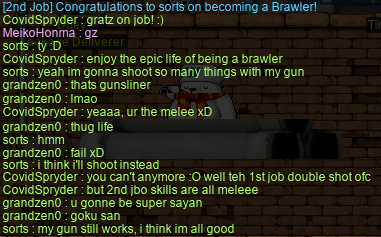

# rangifer’s diary: pt. xxxvii

## STAFF UPGRADE YEAAAHH

In the previous diary entry (xxxvi), I showed off the new [Elemental Staff 3](https://maplelegends.com/lib/equip?id=01382047) that I made for my I/L [magelet](https://oddjobs.codeberg.page/odd-jobs.html#luk-mage), **cervine**; it was TMA 147. Well, I’ve already managed to best it! Meet my new and improved TMA 151 Ele Staff 3!!:

cervine is doing some pretty epic damage with those [Ice Strikes](https://maplelegends.com/lib/skill?id=2211002) now — at least, for a magelet…

## More Capt. Lat, with Taima and OmokTeacher!

We were back at it again with the quad [Capt. Lat](https://maplelegends.com/lib/monster?id=9420513)s~~

This time, **Taima** (**Tacgnol**, **Boymoder**, **Gambolpuddy**, **Yotsubachan**, **Numidium**), [STRginner](https://oddjobs.codeberg.page/odd-jobs.html#permabeginner) of **Oddjobs**, was coming with us! Here we are (with me as **cervid**, the [STR priest](https://oddjobs.codeberg.page/odd-jobs.html#str-mage)), trioing Capt. Lat (also pictured is, of course, **OmokTeacher** (**Slime**)):

Unfortunately, while trying to save precious mesos on potions, OmokTeacher bit the dust and lost his [basket](https://maplelegends.com/lib/use?id=2020024) buffs :( So Taima and I continued on to finish the rest of the quad Capt. Lat:

Unfortunately, Taima died in the third (i.e. penultimate) Capt. Lat fight, but she bravely came back for the fourth and final fight _without_ the [HB](https://maplelegends.com/lib/skill?id=1301007) from basket :O! And survived! Oh, and I got a [Capt. Lat card](https://maplelegends.com/lib/use?id=2388058) from the third fight, in which I had to solo the last portion:

Take that, ‘tanica!!!!

## More mist training with Tacgnol

I did some more [mist](https://maplelegends.com/lib/skill?id=2111003) training with **Tacgnol**, the F/P [gishlet](https://oddjobs.codeberg.page/odd-jobs.html#luk-gish). Tacgnol wanted to use two [basket](https://maplelegends.com/lib/use?id=2020024)s, but I only had one on my [STR priest](https://oddjobs.codeberg.page/odd-jobs.html#str-mage), **cervid**, so I ended up also using a basket on my [woodwoman](https://oddjobs.codeberg.page/odd-jobs.html#woodsman) **capreolina**:

The EXP from this mist training session got capreolina very close to level 110, so with some [more training](https://maplelegends.com/lib/map?id=742010203) under her belt, it was off to get a [MoN](https://maplelegends.com/lib/equip?id=01122059)!:

## capreolina gets a MoN~

Now that I had already seen CWKPQ twice when getting a [MoN](https://maplelegends.com/lib/equip?id=01122059) for cervid, getting one for capre was not quite as nervewracking (although still a little bit lol). My concern initially was that I would not have enough HP to survive looting MoNs that drop, but **Toughish** assured me that he could [Rush](https://maplelegends.com/lib/skill?id=1121006) each boss out to the left side before it dies, so that the MoN would drop far away from where they were fighting. Here capre is, mid-CWKPQ, with Toughish roleplaying as a [bearded mushroom](https://en.wikipedia.org/wiki/Hericium_erinaceus):

And I was _very_ grateful to be so fortunate as to get an amazing 5 WATK MoN, the first one that I looted!!!:

With the MoN on my neck, a [basket](https://maplelegends.com/lib/use?id=2020024) in my stomach, [Echo of Hero](https://maplelegends.com/lib/skill?id=0001005) active on me, and sweat dripping down my face, I was able to record an `@epm 5` for a whopping _solo_ EPH of 6.45M!:

…Although this proved not to be very sustainable…

## LPQing with Pals

I bumped into a friend of mine, **PeachyKid** (**JustPeachy**) [at CDs](https://maplelegends.com/lib/map?id=742010203), and we did some grinding together, with me playing my I/L [magelet](https://oddjobs.codeberg.page/odd-jobs.html#luk-mage), **cervine**:

We ground until my [basket](https://maplelegends.com/lib/use?id=2020024) ran out, by which point we were both rather tired of the grind (especially Peachy, who loathes grinding, in favour of PQing instead). While we were there, though, **Melokie** (**Alrightyo**, **Skateboard**) showed up to hang out with us a bit, and we got the idea to go and [LPQ](https://maplelegends.com/lib/map?id=221024500) with our lower-level characters, alongside another friend, **Aino** (**Tsukino**)! Here we are, fighting [Alishar](https://maplelegends.com/lib/monster?id=9300012) for great justice (here I’m playing as my [besinner](https://oddjobs.codeberg.page/odd-jobs.html#besinner), **hashishi**):

Along the way, we had a party member by the name of **protea** who noticed mid-PQ that I was a [beginner](https://oddjobs.codeberg.page/odd-jobs.html#permabeginner):

Beginner on the inside, assassin on the outside!!!

## rusa is back at it again with the OPQ

I did some more [OPQ](https://maplelegends.com/lib/map?id=200080101) as my [DEX spearwoman](https://oddjobs.codeberg.page/odd-jobs.html#dex-warrior), **rusa**. At OPQ I met **Bulgoki** the chief bandit and **Introvertida** the F/P mage:

Bulgoki is on the left, Introvertida is on the right, and pictured here also is **Valfreyea** (with yellow-red hair and a red cap). Unfortunately, this crappy screenshot is the only one that I took… In any case, rusa is now level 61~

## X-TREME mist training sesh w/ Tacgnol

I did some more mist training with Tacgnol, but this time only as cervid. We actually went for just about **3** hours (taking breaks in between hours, of course), once with GM buffs, and twice more with baskets. During the GM buffs, all of the [5-6 F](https://maplelegends.com/lib/map?id=702070300) and [7 F](https://maplelegends.com/lib/map?id=702070400) maps were taken, so we tried out the [Forest of Towers (FoT)](https://maplelegends.com/lib/map?id=702080000):

After that we went back to 5-6 F, but by the time we were finally done, we were absolutely pooped:

On the bright side, by the time we finished, cevid was level 113, and Tacgnol was level 117!!

## Finishing my final chair quests of the event

I had already started and completed most of [Romeo](https://maplelegends.com/lib/npc?id=2112004) & [Juliet](https://maplelegends.com/lib/npc?id=2112003)’s chair quest on my [besinner](https://oddjobs.codeberg.page/odd-jobs.html#besinner), **hashishi**, and my [MPQ](https://maplelegends.com/lib/map?id=261000021)-mule-to-be, **potpan**. I wanted to finish, but the drop-rate for [Love Tickets](https://maplelegends.com/lib/etc?id=4000174) had been lowered so much that it proved to be quite difficult to get even a single Love Ticket. Along the way, though, I did find this:

And eventually, I was in fact able to finish the quest on both of them:

…Although I did give up entirely on finishing the questline on **sets**, after a few hours(!) of grinding. Hunting even for [gachapon tickets](https://maplelegends.com/lib/cash?id=5220000) turns out to be quite a bit more fruitful than hunting for Love Tickets…

## More MPQ with Level1Crook and PsychSpace

Sniper and **Flow** guild member **Level1Crook** was wanting to [MPQ](https://maplelegends.com/lib/map?id=261000021) to finish his [Franky card](https://maplelegends.com/lib/use?id=2388014) set, and, naturally enough, was having a difficult time of it. So I offered to help with my [pugilist](https://oddjobs.codeberg.page/odd-jobs.html#pugilist), **rangifer**, once the party had filled up to 3 and they just needed one more. And so off we went:

And Level1Crook was able to finish his Franky card set after just a few PQs! Grats!!

## Meet sorts

I regret(?) to inform you that I had yet another idea for yet another character. At this point, I am definitely a crazy cat lady, if you replace the cats with MapleStory characters…

In any case, I had the idea to create a wonky (and yes, odd-jobbed) [LPQ](https://maplelegends.com/lib/map?id=221024500) mule. Because anyone with maxed [Double Shot](https://maplelegends.com/lib/skill?id=5001003) (the first job pirate skill), an equippable gun, and some usable bullets, can serve as range for LPQ, and because [Oak Barrel](https://maplelegends.com/lib/skill?id=5101007) allows brawlers to do the thief portal, I have had the idea for a while now to create a brawler LPQ mule. I decided that pure DEX was the way to go (for high WACC, AVOID, and ranged DPS), so meet **sorts**, the [DEX brawler](https://oddjobs.codeberg.page/odd-jobs.html#dex-brawler):

I toyed with the idea of being a [bullet bucc](https://oddjobs.codeberg.page/odd-jobs.html#bullet-bucc) in addition to being a DEXaneer, and as of yet I’ve only been using guns, but I think that in the future I will opt for a more gun/knuckler hybrid style, in true DEXaneer spirit.

Either way, I was inducted into **Meiko**’s (**MeikoHonma**) guild at the tender level of 21, when I first showed up for some [KPQ](https://maplelegends.com/lib/map?id=103000800) action. Meiko has a guild by the name of **Renaissance** (part of the **Enlightend** _\[sic\]_ alliance) that is dedicated to helping new players and giving them a community! I’m not exactly the target audience for this, but I obliged anyways, to see what was going on inside the guild/alliance, and perhaps help out some newbies myself :)

I had a little bit of fun in alliance chat when I took second job advancement:

And, actually, sorts is already level 35, hehe. So she’s already prepared to serve LPQ and the fine people who inhabit it!

## Duoing HH with OmokTeacher

**OmokTeacher** (**Slime**) came online and wanted to fight the [Headless Horseman (HH)](https://maplelegends.com/lib/monster?id=9400549), so I gathered my equipment together onto my [STR priest](https://oddjobs.codeberg.page/odd-jobs.html#str-mage) to prepare. We were lucky enough to find an HH at the first [Hollowed _\[sic\]_ Ground](https://maplelegends.com/lib/map?id=682000001) map that we checked! As OmokTeacher prepared the [potions](https://maplelegends.com/lib/use?id=2020012) necessary to survive, I did a little card-hunting and went from 1/5 [Jr. Wraith](https://maplelegends.com/lib/monster?id=3230101) cards to 5/5!:

The fight with HH went pretty swiftly, although OmokTeacher had some issues with surviving, due to HH’s rather vicious magical attacks:

And the EXP from HH dying was enough to being cervid to level 114!! Yay~~~

## Booming another Toy

**SmallMight** (**SiriusPlaque**) was kind enough to let me take the last of his clean [Toys of 101](https://maplelegends.com/lib/equip?id=01402038), in exchange for another completion of his special player-bestowed-to-player quest: to hunt for 50 [Power Crystal Ores](https://maplelegends.com/lib/etc?id=4004000). This one was 94 WATK, 4 STR, 4 DEX, and 7 slots, and I had a [30% scroll](https://maplelegends.com/lib/use?id=2044005) stowed away for a while, waiting to use it on this Toy. And by “use it on this Toy”, I mean blow the Toy up on its first slot. :(

As per usual, my hands seem not to be made for scrolling. Oh well, I’ll have to find a way to get _even more_ of the damned things…
