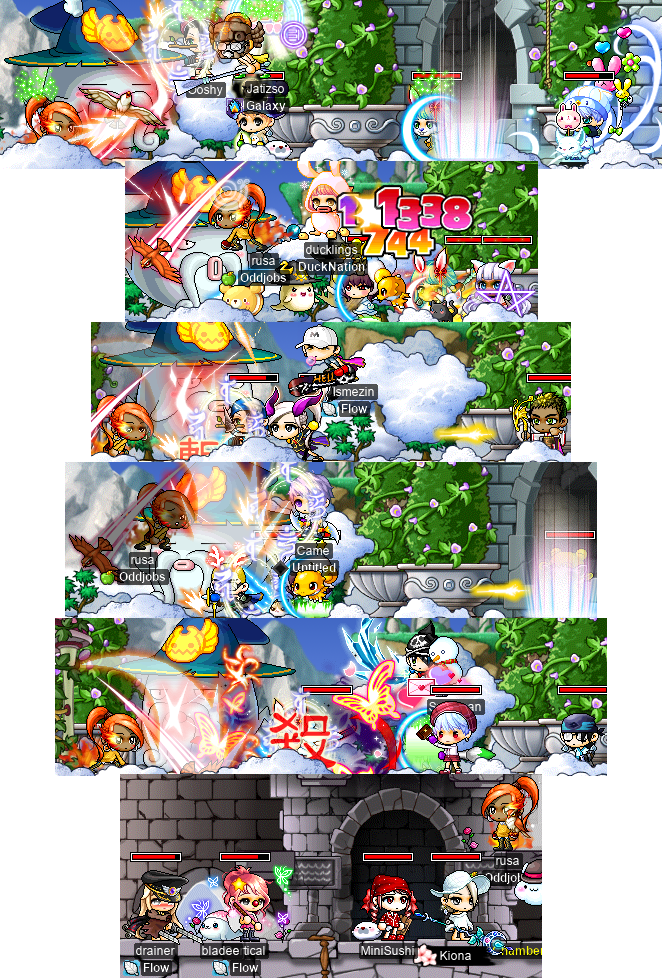
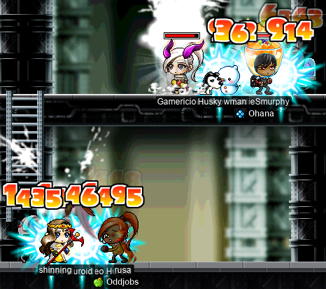
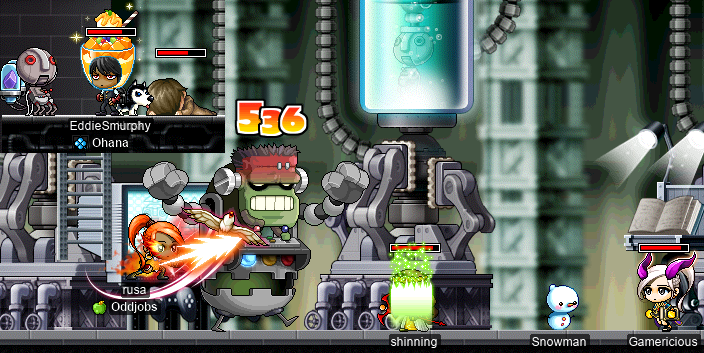

# rangifer’s diary: pt. xxxviii

## End of the V-day event

Now that the V-day event had come to a close, it was time to redeem all of those [chocolates](https://maplelegends.com/lib/etc?id=4036069). I toyed with the idea of trading all of mine in for [Unripe Onyx Apples](https://maplelegends.com/lib/use?id=2012008), but because I was already getting a bunch of those anyways (from characters who were too low level to do the raffle), and because I didn’t feel like making another character just to hold apples, I spent all of the chocolates that I could on raffling. Here are my results (“gets” refers to the number of raffle instances that produced that item, whereas “qty” is the actual quantity of that item obtained across all raffles combined):

Total number of raffles: **58** (**232** chocolates).

| item                                | gets | qty | useful |
| :---------------------------------- | ---: | --: | :----- |
| New Year Lunchbox                   |    9 | 450 | yes    |
| New Year Rice Soup                  |    5 |  50 | yes    |
| Owl of Minerva                      |    5 |  15 | no     |
| Sweet Heart                         |    4 |   8 | no     |
| Triangular Sushi                    |    4 |  12 | no     |
| Cookiebear                          |    3 |   3 | no     |
| Unripe Onyx Apple                   |    3 |   9 | yes    |
| Bananabear                          |    2 |   2 | no     |
| Bunny Heart-Shaped Balloon          |    2 |   2 | no     |
| Heart Headset                       |    2 |   2 | no     |
| Mickey Mouse Balloon                |    2 |   2 | no     |
| Blue Pony Overalls                  |    1 |   1 | no     |
| Cupid’s Wings Cape                  |    1 |   1 | no     |
| Cutesy Heart                        |    1 |   1 | no     |
| Friends of the Forest Camping Chair |    1 |   1 | no\*   |
| Glow Stick of Love                  |    1 |   1 | no     |
| Man’s Shirt                         |    1 |   1 | no     |
| Porong Fan                          |    1 |   1 | no     |
| Ramling Hair Pin                    |    1 |   1 | no     |
| Ramling PJs (Sky)                   |    1 |   1 | no     |
| Red Circle Chair                    |    1 |   1 | yes    |
| Red Pony Overalls                   |    1 |   1 | no     |
| Red Ribbon Hairband                 |    1 |   1 | no     |
| Strawbear                           |    1 |   1 | no     |
| Teddy Earmuffs                      |    1 |   1 | no     |
| Valentine’s Day Sweet Chocolate     |    1 |   1 | no     |
| White Choco Bunny                   |    1 |   1 | no     |
| White Mouse Headband                |    1 |   1 | no     |

\*The Friends of the Forest Camping Chair is untradeable and therefore useless.

So, obviously, this is prettty much crap. Of the things that are at least _nominally_ useful, we have:

- 450 [New Year Lunchboxes](https://maplelegends.com/lib/use?id=2022045), which I consumed over the course of roughly 60 minutes of training/grinding.
- 50 [New Year Rice Soups](https://maplelegends.com/lib/use?id=2022048) (4.17 hours’ worth), which I have yet to use, but the +30 WACC buff might come in handy when really trying to stretch for a higher hit rate on high-level monsters.
- 9 Unripe Onyx Apples, which feels like a bit of a joke, considering that I can (and did) just get those by directly exchanging chocolates for them.
- 1 [Red Circle Chair](https://maplelegends.com/lib/setup?id=3010031), which is the only actually actually “good” item that I managed to raffle; hopefully it will be worth something some 7 or so months from now…

## Gathering up ETC items for the Ellin Ring quest

I have, I think, four more characters who have yet to obtain an [Ellin Savior’s Ring](https://maplelegends.com/lib/equip?id=01119001), who I want to eventually get one:

- **hashishi**, my [besinner](https://oddjobs.codeberg.page/odd-jobs.html#besinner) (who especially needs it, considering that +100 MAXHP may as well be portable [HB](https://maplelegends.com/lib/skill?id=1301007) for hashishi).
- **potpan**, my F/P mage [MPQ](https://maplelegends.com/lib/map?id=261000021) mule.
- **sets**, my assassin [OPQ](https://maplelegends.com/lib/map?id=200080101) mule.
- **sorts**, my [DEXaneer](https://oddjobs.codeberg.page/odd-jobs.html#dex-brawler) [LPQ](https://maplelegends.com/lib/map?id=221024500) mule.

So I decided to just go ahead and collect all of the ETC items that I would need for the final quest in the chain, for all four characters. That means:

- 400 [Hardened Pieces of Steel](https://maplelegends.com/lib/etc?id=4000358).
- 400 [Dark Stone Golem Rubbles](https://maplelegends.com/lib/etc?id=4000025).
- 300 [Wild Kargo Eyes](https://maplelegends.com/lib/etc?id=4000027).
- 200 [Firewoods](https://maplelegends.com/lib/etc?id=4000018).
- 400 [Firebomb Flames](https://maplelegends.com/lib/etc?id=4000081).
- 100 [Lazy Buffy Marbles](https://maplelegends.com/lib/etc?id=4000129).

I actually collected all 400 Hardened Pieces of Steel, along with a little over 100 of the Firebomb Flames, while futilely attempting to complete the V-day chair quest on sets. For the rest, though, I hopped onto my I/L [magelet](https://oddjobs.codeberg.page/odd-jobs.html#luk-mage), **cervine**:

I, naturally, got cervine a few cards along the way:

And I am now the proud owner of all 1800 ETC items listed above ^^;

## …wooOOOoosa…

You already know what time it is: [OPQ](https://maplelegends.com/lib/map?id=200080101) time!! My [DEX spearwoman](https://oddjobs.codeberg.page/odd-jobs.html#dex-warrior), **rusa**, was back at it again… Well, my buddy **Introvertida** invited me to OPQ, but when I got there, my spot in the party had been filled, so I farmed cards to get rusa from 0/5 [Sentinel cards](https://maplelegends.com/lib/use?id=2381032) to 5/5:

And then it was time for a whole lot of OPQing…

rusa @ OPQ~

And I met some lovely people along the way, like **avocatto**, **Ooshy**, **Erebus0**, **ducklings** (a [permabeginner](https://oddjobs.codeberg.page/odd-jobs.html#permabeginner)), **nangs420**, **Gamericious**, **Came**, and **Kiona** & **MiniSushi**! And I got to OPQ with some **Suboptimal** allies, like **Ismezin**, **drainer**, and **Cortical** (all [permabeginners](https://oddjobs.codeberg.page/odd-jobs.html#permabeginner))!

<333

## potpan LPQs with odd-jobbers

My [MPQ](https://maplelegends.com/lib/map?id=261000021)-mule-to-be, **potpan**, is still at [LPQ](https://maplelegends.com/lib/map?id=221024500) going for that second pair of Broken Glasses. potpan herself is, perhaps, not very interesting yet: she won’t be able to fulfil her destiny until at least level 71, so for now, she just does obscene quantities of damage with [Fire Arrow](https://maplelegends.com/lib/skill?id=2101004), and that’s about it. But I did join my [DEXginner](https://oddjobs.codeberg.page/odd-jobs.html#dex-beginner) friend **Gambolpuddy** (**Taima**, **Tacgnol**, **Boymoder**, **Yotsubachan**, **Numidium**) there at LPQ:

And later, when Gambolpuddy had left — and indeed, most LPQers had left — I was forced, out of desperation, to run both potpan _and_ **sorts** (my [DEXaneer](https://oddjobs.codeberg.page/odd-jobs.html#dex-brawler) LPQ mule) if I wanted to keep LPQing. It was a little mind-bending for me, since I already have enough trouble controlling just _one_ character, as it is, but I was able to bang out a solid 2 or 3 LPQs this way:

Which means that sorts was finally able to fulfil her destiny for the first time :P

## OmokTeacher defects!

**OmokTeacher** (**Slime**) may have defected once again, back to **Flow**, but we will remember That One Time™ that he left Flow to join the dark side — I mean, to join **Oddjobs**…

## woosa advances to the rank of DEXgon knight

After many an [OPQ](https://maplelegends.com/lib/map?id=200080101), it was finally time for my [DEX spearwoman](https://oddjobs.codeberg.page/odd-jobs.html#dex-warrior), **rusa**, to advance to dragon — I mean, DEXgon knight.

On the way to & from [El Nath](https://maplelegends.com/lib/map?id=211000000), I stumbled upon a stray [Fire Sentinel card](https://maplelegends.com/lib/use?id=2381038) and a stray [Jr. Pepe card](https://maplelegends.com/lib/use?id=2382023):

Here’s rusa, on the way to kick [Dances With Balrog](https://maplelegends.com/lib/monster?id=9001000)’s ass:

I’ve been screen-recording rusa soloing a variety of bosses (starting with [King Slime](https://maplelegends.com/lib/monster?id=9300003)), and eventually I will record enough to stitch together into a sweet YouTube video :) Her fight with Dances With Balrog will be in there as well~

As discussed in a previous diary entry, I have been debating rusa’s third job skill build. Having thought about it since then, and with **NobleFantasm** (**SiriusPlaque**, **SmallMight**) suggesting that it may even be possible for me to [Heal](https://maplelegends.com/lib/skill?id=2301002) my*self* (with **cervid**, my [STR priest](https://oddjobs.codeberg.page/odd-jobs.html#str-mage)) [at CDs](https://maplelegends.com/lib/map?id=742010203), and with me actually remembering that [rawr](https://maplelegends.com/lib/skill?id=1311006) targets up to _15_ monsters at once (much more than [Fury](https://maplelegends.com/lib/skill?id=1311004)’s 6), I have decided that I want rusa to have max rawr by the time that she hits level 86 (and thus graduates [MPQ](https://maplelegends.com/lib/map?id=261000021)). I will be rushing to level 16 Fury before then (as Fury tends to be more useful in MPQ), but I decided to be a little greedy and put 3 SP into [Sacrifice](https://maplelegends.com/lib/skill?id=1311005) so that I could have level 1 rawr by the time I was level 71. Here is rusa, rawring for the first time, in the middle of an OPQ:

## woosa MPQs for the first time~

And now that rusa had fatefully graduated from OPQ ;( it was time for her to MPQ for the first time, with **EddieSmurphy** the marauder, **Gamericious** (a priest, who I already knew from OPQ), and **shinning** the priest:

As usual, being both low-level (less than 77 or so) and being an odd-jobbed character made it a struggle to really contribute the the combat portions of MPQ. But, as always with rusa, I love being able to cast [HB](https://maplelegends.com/lib/skill?id=1301007) and [IW](https://maplelegends.com/lib/skill?id=1301006) on my party members, so that I can feel useful even when my damage is lacking :P

I’ve actually already completed the [Ravana](https://maplelegends.com/lib/monster?id=9420014) prequests on rusa, and I hope to tag along on some Ravana runs soon, so I can get some [dolls](https://maplelegends.com/lib/etc?id=4000390), and hopefully a nice [Ravana Helmet](https://maplelegends.com/lib/equip?id=01003068) (rusa is still using a [Rudolph’s Horn](https://maplelegends.com/lib/equip?id=01002728))~!
