# rangifer’s diary: pt. xxxix

## Suboptimal Capt. Lat

We did an all-**Suboptimal** [Capt. Latanica](https://maplelegends.com/lib/monster?id=9420513) run, featuring:

- Me playing **rusa**, my [DEXgon knight](https://oddjobs.codeberg.page/odd-jobs.html#dex-warrior) (**Oddjobs**).
- **OmokTeacher** (**Slime**), a [STRginner](https://oddjobs.codeberg.page/odd-jobs.html#permabeginner) (**Flow**).
- **Gumby**, a [STRginner](https://oddjobs.codeberg.page/odd-jobs.html#permabeginner) (Flow).
- **Phoneme** (**Cortical**, **GishGallop**), a [permamagician](https://oddjobs.codeberg.page/odd-jobs.html#permamagician) (Oddjobs).
- **Outside** (**TestChars**, **Dodogge**), a [STRginner](https://oddjobs.codeberg.page/odd-jobs.html#permabeginner) (Flow).

As rusa, I could do the job of providing [HB](https://maplelegends.com/lib/skill?id=1301007) for our party, drastically reducing the risk of death, particularly for the permabeginners of our party. To prepare, I went ahead and completed the prequests:

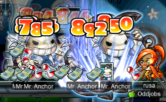

Hoo-rah for [Dragon Fury](https://maplelegends.com/lib/skill?id=1311004)!

We did two runs, both of which I filmed:

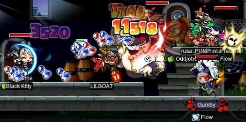

(Apologies for the poor image quality; this is a frame extracted from a video.)

Good times and some nice EXP were had by all, although unfortunately we were not able to bring Gumby from 4/5 [Capt. Lat cards](https://maplelegends.com/lib/use?id=2388058) to 5/5, as neither run dropped a card :/ Gumby has actually managed to achieve the [T9 ring](https://maplelegends.com/lib/equip?id=01119011)(!!) as a [permabeginner](https://oddjobs.codeberg.page/odd-jobs.html#permabeginner) by farming all the cards himself!!! Hopefully T10 one day!!!! :O

## Scrolling a new STR robe

After realising that I really would not be able to purchase a [bath](https://maplelegends.com/lib/equip?id=01051098)/[sauna](https://maplelegends.com/lib/equip?id=01051017) robe scrolled for STR, due to the general lack of STR robes (overall STR scrolls are generally too pricey for people to find it worthwhile to use them on non-endgame overalls), and the even further lack of specifically female ones, I decided… I’m really very unhappy with the 12 STR one that I ended up with after spending some 11M+ mesos on scrolls >.<

So, using just about a _third_ of the funds that I used to make my 12 STR robe, I managed to scroll a nice upgrade!!:

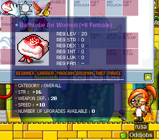

16 STR, finally a STR robe I don’t have to be embarrassed about…

## MPQ <3

In the previous diary entry, rusa was just starting to [MPQ](https://maplelegends.com/lib/map?id=261000021). Now, she has graduated (level >85)! It really feels like a blur, and an extremely fun one thanks to the people with whom I MPQed~

rusa, MPQing

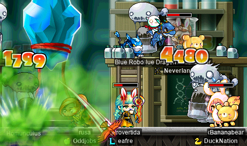

Pictured above: MPQ stage 3 with **Harlez** (a chief bandit), **Introvertida** (an F/P mage), and **ducklings**, a [STRginner](https://oddjobs.codeberg.page/odd-jobs.html#permabeginner) of **DuckNation** who was always there to bravely defend us from the mutaes during the fight with [Angy Fanky](https://maplelegends.com/lib/monster?id=9300140)~! <3333

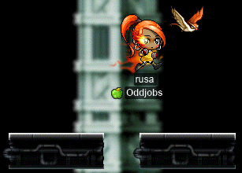

Pictured above: rusa during stage 6.

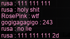

Pictured above: rusa gets a rather impressive-looking stage 6 combo of `111 111 111 2d`! (Note that this is slightly less impressive than it looks, because the first `1` is effectively a `4`.)

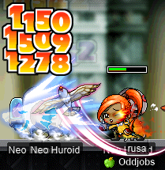

Pictured above: rusa trying out [Spear Crusher](https://maplelegends.com/lib/skill?id=1311001) for the first time~ Stab, stab, stab!

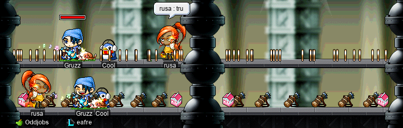

Pictured above: **Gruzz** (I/L mage) loves decorating stage 6.5. He also likes typing his stage 6 combos in chat in coded forms that make my head spin. F3

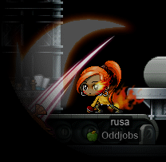

Pictured above: rusa doing the left-hand JQ in stage 4.

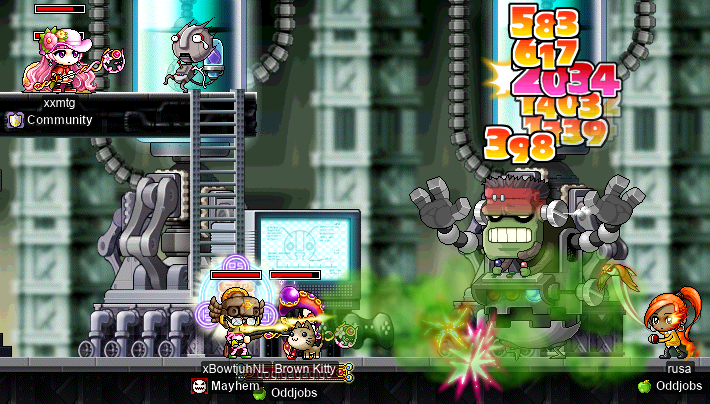

Pictured above: Angy Fanky fight with **gogigagagigo** ([permarcher](https://oddjobs.codeberg.page/odd-jobs.html#permarcher) of **Oddjobs**), **xBowtjuhNL** (a sniper), and **xxmtg** (an I/L mage).

Pictured above: rusa dies during the Angy Fanky fight >.<

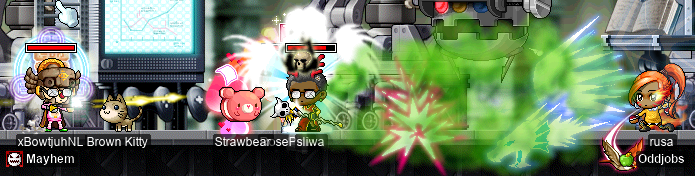

Pictured above: Angy Fanky fight with **RosePink** (an F/P mage who is a bit difficult to see in this image), **sliwa** (a priest), and xBowtjuhNL.

I really had an absolute blast MPQing as rusa, and I’ll be honest, I was a little “F4” irl when I did eventually graduate. One of the amazing things about MPQ, in my personal experience, is that, because the PQ is so difficult for its level and requires a lot of teamwork and cooperation, because it takes so many PQs to get from level 71 to level 86, and because MPQ gets such little traffic (compared to KPQ, LPQ, EPQ, or even OPQ), MPQ has the ability to occasionally produce camaraderie more intense than I’ve frankly ever seen in other areas of MapleStory. A solid MPQ party that PQs together regularly is one of the greatest blessings one can receive in this game. So I would like to thank some of the people with whom I MPQed as rusa:

- **ducklings**
- **Harlez**
- **Gruzz**
- **Radiohead**
- **Eoka**
- **RosePink**
- **xBowtjuhNL**
- **sliwa**
- …and any lovely people who should be on this list, but are not, due to my feeble memory.

And on that note, I have worked my way from level 71 to level 86 through MPQ on several other characters. But because I only started writing a diary relatively recently, almost all of this experience has gone unwritten. So, still bearing in mind my feeble memory and recollections, I want to make an attempt to thank the people who made those experiences possible:

- **Vauri**/**Cira**
- **PoultryWoman**/**Fabienne**
- **zoomzombie**
- **Trei**
- **StealthSword**
- **PeachyKid**
- **Tsukino**
- **Skateboard**
- **Tacgnol**/**Boymoder**
- **kuromii**
- **Jule**
- **CreepyTimmy**/**SillyTimmy**
- **ETAN**
- **PastaSauce**
- **JesseABadBoy**
- **Keki**
- **Zechs**
- **Pando**
- **DWN009**
- **DotAncient**
- **DogsAreCool**
- **BigScrund**
- **Zennko**
- **Lovecraft**
- **SweSticer**
- **CanTuna**
- **MitchFitch**
- **Ynnairam**
- …and _all_ of the lovely people who should be on this list, but are not, due to my feeble memory (and lack of more screenshots to reference).

<3333333333333333333333333333333333333333333333333333333333333333333333333333…

## Vertida’s wedding

**Introvertida**, and her cleric, **Extrovertida**, with whom I have done many an OPQ and MPQ, married herself. So off we were, rusa and the rest of the MPQ gang, to [Amoria](https://maplelegends.com/lib/map?id=680000000)~

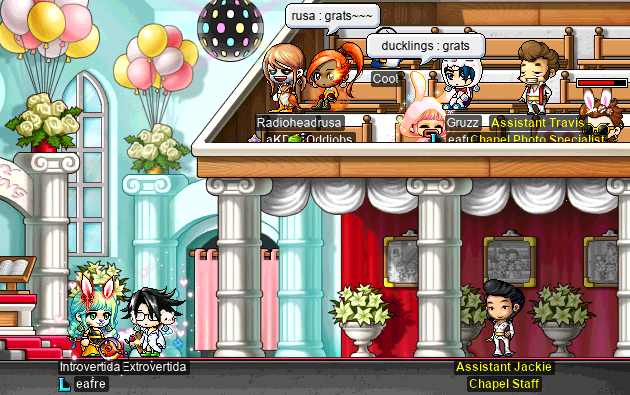

Congrats!! Haha~ To celebrate, we did an [HPQ](https://maplelegends.com/lib/map?id=100000200) together:

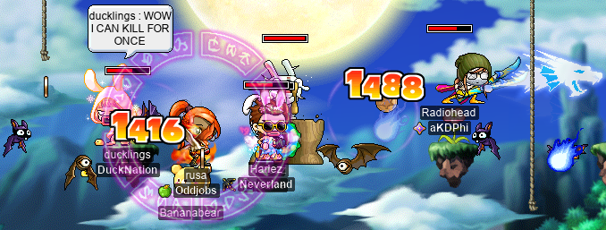

…and we even did the bonus stage, for that sweet, sweet EXP. 80k EPH, wow~!

We were going to fight [Crimson Balrog](https://maplelegends.com/lib/monster?id=8150000) on [the ship to Orbis](https://maplelegends.com/lib/map?id=200090010), with the mission being to protect ducklings (who would surely be one-shotted by its magical attack). But, none ever raided the particular ride we took:

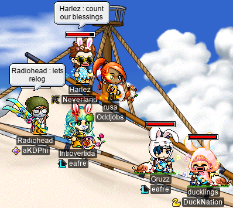

Also pictured above is the world-famous instrumental duo, **BBB** (Burnt Banana Bread).

## Graduated MPQ ;(

Now that rusa has graduated MPQ, it’s time for some questing, preparing for [CD](https://maplelegends.com/lib/map?id=742010203) grinding (lol), and ticking the rest of the bosses off of rusa’s hit list! As mentioned in the previous entry, I have been collecting footage of rusa soloing bosses since she was level 31, and I plan to compile all of the footage into an edited video/montage/whatever once I’ve ticked enough things off the hit list to my satisfaction. Here I am, [PPQ](https://maplelegends.com/lib/map?id=251010404)ing with **Radiohead**, with whom I had been MPQing:

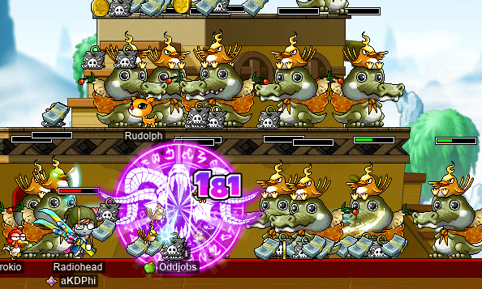

Although PPQ is a PQ I typically try to avoid (sorry, I just don’t find it fun), it was necessary to cross [Lord Pirate](https://maplelegends.com/lib/monster?id=9500175) off of the hit list. I also did the [Mu Lung](https://maplelegends.com/lib/map?id=250000000) questlines to kill [Tae Roon](https://maplelegends.com/lib/monster?id=7220000) ([The Forgotten Master](https://bbb.hidden-street.net/quest/mu-lung-nihal-desert/the-forgotten-master)) and to kill [King Sage Cat](https://maplelegends.com/lib/monster?id=7220002) ([Eliminating King Sage Cat](https://bbb.hidden-street.net/quest/mu-lung-nihal-desert/eliminating-king-sage-cat)). I had a little family reunion in [the Mu Lung forests](https://maplelegends.com/lib/map?id=250010500):

Oh, and I wanted to cross [Snack Bar](https://maplelegends.com/lib/monster?id=9410015) off of my hit list as well, and there was surprisingly little info out there about this, so I kinda just did Taiwan quests until I eventually got to the one that would allow me to fight Snack Bar:

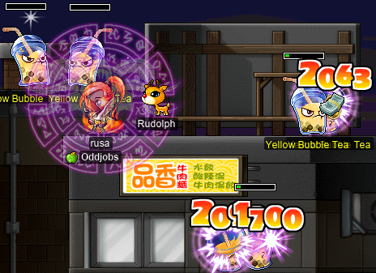

And I now have quite the collection of clips:

    rusa_vs._Alishar.mp4
    rusa_vs._Angry_Lord_Pirate.mp4
    rusa_vs._Angy_Fanky.mp4
    rusa_vs._Blue_Mushmom.mp4
    rusa_vs._Crimson_Balrogs.mp4
    rusa_vs._Dances_With_Balrog.mp4
    rusa_vs._Eliza.mp4
    rusa_vs._Jr._Balrog.mp4
    rusa_vs._Kimera.mp4
    rusa_vs._King_Sage_Cat.mp4
    rusa_vs._King_Slime.mp4
    rusa_vs._Male_Boss.mp4
    rusa_vs._Papa_Pixie.mp4
    rusa_vs._Poison_Golem.mp4
    rusa_vs._Snack_Bar.mp4
    rusa_vs._Tae_Roon.mp4

Now all I have left are:

- [Headless Horseman](https://maplelegends.com/lib/monster?id=9400549) (high HP/WDEF; waiting on [Ravana Helmet](https://maplelegends.com/lib/equip?id=01003068) to make my damage somewhat less pathetic)
- [Spirit of Rock](https://maplelegends.com/lib/monster?id=9410035) (high HP/WDEF; waiting on [Ravana Helmet](https://maplelegends.com/lib/equip?id=01003068) to make my damage somewhat less pathetic)
- [Capt. Latanica](https://maplelegends.com/lib/monster?id=9420513) (high HP/WDEF; waiting on [Ravana Helmet](https://maplelegends.com/lib/equip?id=01003068) to make my damage somewhat less pathetic)
- [Snowman](https://maplelegends.com/lib/monster?id=8220001) (waiting until level 90, so I can start the questline)
- [Thanatos](https://maplelegends.com/lib/monster?id=8170000) (high WDEF; waiting on [Ravana Helmet](https://maplelegends.com/lib/equip?id=01003068) to make my damage somewhat less pathetic)
- [Gatekeeper](https://maplelegends.com/lib/monster?id=8160000) (high WDEF; waiting on [Ravana Helmet](https://maplelegends.com/lib/equip?id=01003068) to make my damage somewhat less pathetic)

_Technically_, Thanatos and Gatekeeper are not considered bosses AFAIK. But they’re in there for funsies.

Oh, and the Ravana Helmet? It is commonly understood that, when you turn in [a doll](https://maplelegends.com/lib/etc?id=4000390), the probability of getting a Ravana Helmet from it (rather than one of the knockoffs) is 25%. As of yet, I have turned in **12** such dolls, and out of those 12 dolls, **0** of them resulted in a Ravana Helmet. For those [following along at home](https://en.wikipedia.org/wiki/Binomial_distribution), there’s a 0.75^12 = 3.17% chance of getting that few (or fewer, not that you could get less than 0) helms after 12 trials. Incredible. Hopefully I can finally get one at some point (20 STR please!!!)…
