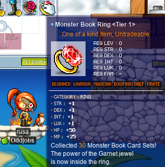
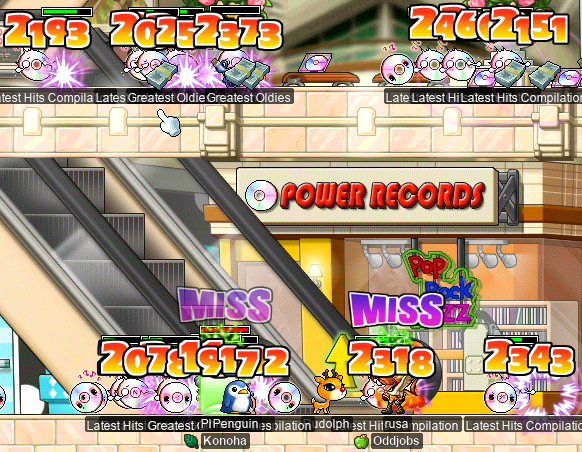
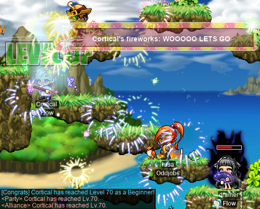
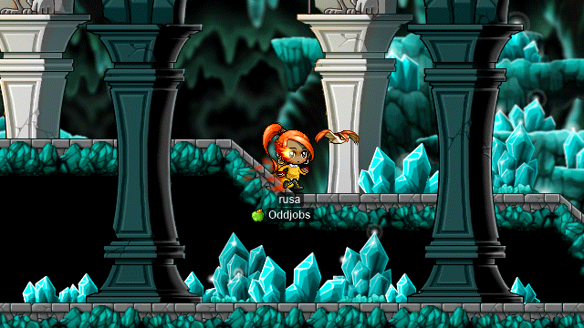
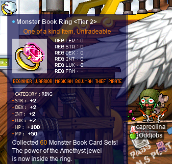
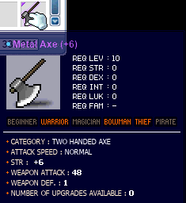
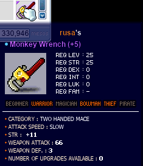
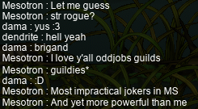
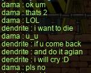

# rangifer’s diary: pt. xl

## Getting the T1 ring for rusa (and some questing along the way)

I wanted to do some card-hunting on my [DEXgon knight](https://oddjobs.codeberg.page/odd-jobs.html#dex-warrior), **rusa**, as a way to get a little beefier (more STR!), or maybe just as an excuse to [rawr](https://maplelegends.com/lib/skill?id=1311006). Who knows. In any case, lugging around a [T0 ring](https://maplelegends.com/lib/equip?id=01119002) is a little embarrassing, so off I went:

rusa card-hunting~

Completed the first tab~ Great start~~

_WHERE_ are the [Jr. Necki](https://maplelegends.com/lib/monster?id=2130103) cards ;(

And yeyy~ [T1 ring](https://maplelegends.com/lib/equip?id=01119003) for woosa!:

While I was at it, I went ahead and did the “Lost!” and “ReVersal” quests:

And [the level 52 followup to “I Need To Find My Daughter”](https://bbb.hidden-street.net/quest/victoria-island/the-alligators-at-the-swamp):

## cervid tidies up some missed quests

I never went and did the [King Sage Cat](https://maplelegends.com/lib/monster?id=7220002) and [Tae Roon](https://maplelegends.com/lib/monster?id=7220000) quests on my [STR priest](https://oddjobs.codeberg.page/odd-jobs.html#str-mage), **cervid**, so I went [back](https://maplelegends.com/lib/map?id=250000100) and did ‘em:

Some nifty cards along the way~

And down went the King Sage Cat:

And in like fashion, Tae Roon:

Oh, and I went ahead and did “Lost!”/“ReVersal” once more:

## Meet dama

Oh, my. You know the drill; yet _another_ one of deer’s shitty peepee poopoo garbo characters. This time, I was forced (forced, I tell you!!) by **Cort** (**Cortical**, **Phoneme**, **GishGallop**, **Subcortical**, **WizetWizard**, **MageFP**) to make a [brigand](https://oddjobs.codeberg.page/odd-jobs.html#brigand). For those not familiar, brigands are built like STR-based [permabeginners](https://oddjobs.codeberg.page/odd-jobs.html#permabeginner), but take the rogue → bandit → chief bandit → shadower job route. While they tend to play somewhat like ordinary permabeginners, brigands benefit from the obvious utility skills associated with rogues/dits/shads, and brigands are capable of attacking with [Disorder](https://maplelegends.com/lib/skill?id=4001002), [Steal](https://maplelegends.com/lib/skill?id=4201004), and even [Meso Explosion](https://maplelegends.com/lib/skill?id=4211006). Brigands do not use daggers.

While brigands are unusual for bandits in that they do not use daggers (some other bandit-based odd jobs, like [blood dit](https://oddjobs.codeberg.page/odd-jobs.html#blood-bandit) and [DEXdit](https://oddjobs.codeberg.page/odd-jobs.html#lukless-bandit), _do_ use daggers), I am playing [**dama**][dama] with a slightly more rogue-ish twist: the brigand equivalent of a sindit! Perhaps “sindit” is a bit of a misnomer here; brigands are barely dits, and even less so are they sins. Brigands must stick with basic-attacking when using claws, for lack of LUK to make any good use of [Lucky Seven](https://maplelegends.com/lib/skill?id=4001344). But brigands, unlike e.g. [besinners](https://oddjobs.codeberg.page/odd-jobs.html#besinner), have access to [Keen Eyes](https://maplelegends.com/lib/skill?id=4000001), which (when at max level) makes their claw-using genuinely ranged… even ranged enough to serve as range in [LPQ](https://maplelegends.com/lib/map?id=221024500)! And thus, much like the bandit can pretend that they are an assassin for a little while, as they continue to use Lucky Seven into their second-job life, so too can the brigand pretend that they are a [STR sin](https://oddjobs.codeberg.page/odd-jobs.html#str-assassin) for a little while, as they continue to use their claw into their second-job life.

Here I am, as lil baby dama (sporting some random equips that I had uselessly sitting in my cash shop inventory), getting harrassed by one of Cort’s [islanders](https://oddjobs.codeberg.page/odd-jobs.html#magelander):

I was, after having been forced(!) by Cort to create this character, harassed by them, nonstop, from the training camp (where Cort had a [camper](https://oddjobs.codeberg.page/odd-jobs.html#camper)) onwards, until I finally left the island for good…

But before then, we met up with **strainer** (**drainer**, **xX17Xx**, **maebee**) and chilled in [Amherst](https://maplelegends.com/lib/map?id=1010000):

Well, the harassment didn’t entirely stop upon leaving the island… Cort’s [besinner](https://oddjobs.codeberg.page/odd-jobs.html#besinner)-to-be (hopefully “to-be” soon, as long as the anniversary event comes with [cake forks](https://maplelegends.com/lib/equip?id=01472088)), **Amygdala**, had her fair share of telling me to CC PLS. And also of generally littering trash all over [Kerning City](https://maplelegends.com/lib/map?id=103000000):

And so I set off to bring dama up to KPQ level:

“**YEET**” goes the [Steel Titans](https://maplelegends.com/lib/equip?id=01472001)~

And although I did like dama’s cute lil noob look, I set out to come up with a look more permanent and more suitable (and with less event-bound equipment):

Again, with the trademark [Metal Axe](https://maplelegends.com/lib/equip?id=01412001) in hand (this particular axe also features further along in this diary entry…):

")

## rusa hunting for dolls yet again

rusa is back at it again, still looking for a [Ravana Helmet](https://maplelegends.com/lib/equip?id=01003068)… just… a helmet. Please.

Unfortunately, my luck was not about to improve right away, as I joined the single worst [Ravana](https://maplelegends.com/lib/monster?id=9420014) run I’ve attended yet. The group sent out a [smega](https://maplelegends.com/lib/cash?id=5072000) in an attempt to recruit “attackers”, but upon entering Ravana’s lair, I found myself realising that there were going to be no such attackers. Instead, it was a party of me… and three (3) bishops, the highest-level of which was 136. So I got to see a whole lot (well over 30 minutes, in fact!) of [Genesis](https://maplelegends.com/lib/skill?id=2321008) being spammed on a single monster. Indeed, despite being just level 89 at this point (and [STRless](https://oddjobs.codeberg.page/odd-jobs.html#dex-warrior), to boot), I was forced to contribute what meagre DPS I did have:

I had _very_ nearly run out of [Honsters](https://maplelegends.com/lib/use?id=2002021) by the time that Ravana was slain, and having spent well over 30 minutes in this painful Ravana run, and having spent roughly a million mesos worth of potions, I got to see something that I’d never seen in a Ravana run before: Ravana dying, and dropping absolutely zero [dolls](https://maplelegends.com/lib/etc?id=4000390) whatsoever. By this point, I was just miffed enough that I figured it was time to take a bit of a break from MapleStory…

Fortunately, my luck turned around not too long after I took a break, as I was able to attend a second run, this time with some lovely friends who had helped me before with getting Ravana dolls <3 I turned in this doll and, lo and behold, my first real helmet!!! It only took 15 tries (that is, 15 dolls, _not_ counting runs in which there were no dolls left for me to loot), but I finally got one! The first thing that I did was, of course, check the one stat that I really care about: the STR. And lo, it was the worst possible STR: 16!! Incredible. The search for more real helmets continues, I guess…

## Polishing off rusa’s hit list

Crappy as my new helmet was, it was still a lot better than [the level 10 hat](https://maplelegends.com/lib/equip?id=01002728) that I had been using since, well, level 10. So, I took this as being just good enough to push forward and finish off rusa’s hit list, for the work-in-progress video.

Down went [HH](https://maplelegends.com/lib/monster?id=9400549), [SoR](https://maplelegends.com/lib/monster?id=9410035), [Thanatos](https://maplelegends.com/lib/monster?id=8170000), [Gatekeeper](https://maplelegends.com/lib/monster?id=8160000), [Capt. Latanica](https://maplelegends.com/lib/monster?id=9420513):

And finally, after some grinding to get from level 89 to level 90 (expedited thanks to **Jacquemus**!) so that I could start [the Snowman quest](https://bbb.hidden-street.net/quest/el-nath-mt-aquaroad/snowfield-giant), rusa was able to tick the final boss off of her hit list:

Now I had all of the footage I needed for the video!! Now all that was left was to edit the damn thing…

## capreolina tidies up some missed quests as well~

I wanted to do the same for my [woodwoman](https://oddjobs.codeberg.page/odd-jobs.html#woodsman), **capreolina**, as I did for cervid, so I tidied up the [King Sage Cat](https://maplelegends.com/lib/monster?id=7220002) and [Tae Roon](https://maplelegends.com/lib/monster?id=7220000) quests:

With thanks to **Cortical**, I was, thankfully, able to kill a Tae Roon and finish that quest! I did the King Sage Cat one first, which involved nearly two hours of busy-waiting (>.<) at [the map where King Sage Cat spawns](https://maplelegends.com/lib/map?id=250010504), including a point at which I lost internet connection for 2 minutes or so, and had to desperately hope that no one sniped my map during the time that I was gone…

In any case, I also had not done the [Capt. Latanica](https://maplelegends.com/lib/monster?id=9420513) quest on capre, and I had a bit of a go at soloing Capt. Latanica. That did not turn out so well, as I simply got one-shotted by the captain, wasting my [White Essence](https://maplelegends.com/lib/etc?id=4000381) and my [Safety Charm](https://maplelegends.com/lib/cash?id=5130000).

Fortunately, however, **JumpQuest** (**OmokTeacher**, **Slime**) offered to help me out by duoing the captain with me! JumpQuest is a DK, so he was able to cast [HB](https://maplelegends.com/lib/skill?id=1301007) on me, which was more than enough to keep me alive. We made quick work of the captain!:

## rusa rawr!!!!!!!!

Again thanks to **Jacquemus**, I was set up with a low-level (73 at the time) priest by the name of **Phishem** as a [rawr](https://maplelegends.com/lib/skill?id=1311006) + [Heal](https://maplelegends.com/lib/skill?id=2301002) combo [at CDs](https://maplelegends.com/lib/map?id=742010203), on my [DEXgon knight](https://oddjobs.codeberg.page/odd-jobs.html#dex-warrior), **rusa**~!

At first, I was worried about my damage, being STRless and all, and so I made sure to be very clear that my damage would be… relatively lacking. But Jacquemus and Phishem said they were OK with it, and so off we went:

And it really turned out much better than I had speculated! The simply huge range of rawr, and its ability to hit up to 15 monsters at once, made my ability to generate EXP extremely impressive, even if it took me a few extra rawrs to really kill the things dead. I think I measured something like 6.8M(!) EPH with an `@epm 5`~

I was there at CDs for quite a while, with varying party lineups (at times, with party sizes up to 4 or 5~!), and had a heck of a lot of fun :P Who knew that grinding in a big ol’ party is less sad than solo grinding at CDs…?

## Cort scrolls a legendary artifact and then hits level 70

**Cortical** (**GishGallop**) scrolled a legendary artifact that we have (as odd jobbers) been speculating about for months, and that **Tacgnol** (**Taima**, **Boymoder**, **Numidium**, **Yotsubachan**) made an attempt at, after being so lucky as to find a [Flamekeeper Cordon](https://maplelegends.com/lib/equip?id=01082246) from a [Firebrand](https://maplelegends.com/lib/monster?id=9400578). Unfortunately (_very_ unfortunately), Tacgnol’s Flamekeeper Cordon had just one(!) pass out of the five [60% scrolls](https://maplelegends.com/lib/use?id=2040804) that she used on it. :( The issue here is not so much that it’s extremely difficult in general to pass some GFAs on a pair of gloves, but rather the issue is getting the Flamekeeper Cordons to begin with. They are rather rare, and the average of 8 MATK that they come with pushes their value up even further into the 40M~50M meso range, per-pair. But their potential is largely ignored: the combination of the 8 MATK with the 20 WACC makes it an amazing candidate for [gish](https://oddjobs.codeberg.page/odd-jobs.html#gish), [gishlet](https://oddjobs.codeberg.page/odd-jobs.html#luk-gish), and even [STR cleric/priest/bishop](https://oddjobs.codeberg.page/odd-jobs.html#str-mage) gloves.

Cort managed to find a pair for “only” 20M(!) mesos, and set out to prove the worth of these gloves once and for all. Thankfully, they had much better luck than Tacgnol, and was able to avenge her 2 WATK Flamekeeper Cordons:

8 WATK, 7 MATK, and 19 WACC on a pair of gloves… truly legendary.

And Cortical held their 3rd-job [permabeginner](https://oddjobs.codeberg.page/odd-jobs.html#permabeginner) party not too long after:

Congrats!!!

## “rusa is a STRless warrior.”

At this point I had finally finished the editing process for rusa’s video! You can [watch it on the Oddjobs YouTube channel](https://www.youtube.com/watch?v=RjBKefilPgs)!!:

This video compiles a series of many fights with boss monsters that rusa has soloed over her career, over the course of a 20~21 minute video!

Music

The music is “rusa’s Theme”, which I composed for the video, and have released under the [CC BY-SA 4.0](https://creativecommons.org/licenses/by-sa/4.0/)+. You can find the original [MuseScore](https://musescore.org/) file (the piece was written in, and then rendered with the built-in [MIDI](https://en.wikipedia.org/wiki/General_MIDI) sound(bank/font) of, MuseScore 3) at ​<https://codeberg.org/deer/gists/raw/branch/master/rusa-s_Theme.mscz>; you can also find the theme on bandcamp at <https://capreolina.bandcamp.com/album/rusa-s-theme>, if you wanna listen to it separately :P

## Attending Eoka and xBowtjuhNL’s wedding

I attended the wedding of **Eoka** and **xBowtjuhNL**, both of whom are lovely people I met while [MPQ](https://maplelegends.com/lib/map?id=261000021)ing on rusa!

The wedding was really cool, as I got to attend a premium wedding for the first time ever in my maple life. [Pila Present](https://maplelegends.com/lib/npc?id=9201014) skimped out on me a bit with the gift reward, awarding me just one (1) [Elixir](https://maplelegends.com/lib/use?id=2000004)… but it was still cool :P

The couple went to [China](https://maplelegends.com/lib/map?id=701010300) on honeymoon very shortly after the wedding, as they wanted to have a [cow](https://maplelegends.com/lib/monster?id=9600006) to [ex](https://en.wikipedia.org/wiki/Dowry)chan[ge](https://en.wikipedia.org/wiki/Bride_price) for the wedding, and unfortunately no GM was willing to comply with their request to `!mob 9600006` at their wedding :P

Congrats on the wedding <333!

## I am reminded why I rarely solo grind on cervid

My [STR priest](https://oddjobs.codeberg.page/odd-jobs.html#str-mage), **cervid**, is level 114 now, and at this point solo grinding is something that I do less and less often, for its lack of real EXP reward. But I got an [Echo of Hero](https://maplelegends.com/lib/skill?id=0001005), and wanted to test my hand at it in the usual spot once again: [Fancy Amps](https://maplelegends.com/lib/map?id=742010201). Keep in mind that I did an `@epm 5` with full damage gear equipped, and Echo of Hero, [Cider](https://maplelegends.com/lib/use?id=2022002), and [Holy Symbol](https://maplelegends.com/lib/skill?id=2311003) active the whole time:

With this as a benchmark, it would take an estimated 17+(!) hours of continuous sweatgrinding if I wanted to solo grind my way from the bottom of 114 (cervid is not actually at the bottom of 114, but just hypothetically) to 115. And this is with the luxuries of [Teleport](https://maplelegends.com/lib/skill?id=2301001), Holy Symbol, etc.

I got bored of that pretty quickly, and spent the rest of the Echo doing something that psychologically felt more productive to me…:

## capre hunts thousands, nay, millions of cards~! (…And hits level 112 in the process)

Speaking of card-hunting, it should be obvious to anyone who knows me or my diary that my excessive abundance of characters must be a serious barrier to getting higher-level [Monster Book Rings](https://maplelegends.com/lib/ring?filter=1&order=1&sort=1&search=monster+book). In an attempt to set some priorities, it seems that my [woodwoman](https://oddjobs.codeberg.page/odd-jobs.html#woodsman), **capreolina**, is somewhere near the top. Obviously, any character whatsoever can benefit from higher Monster Book Rings (unless they already have [T10](https://maplelegends.com/lib/equip?id=01119012), of course). But for cervid, for example, higher tiers are somewhat of a micro-optimisation. cervid is already extremely tanky, so the extra MAXHP and MAXMP helps, but not as much as you would hope; and the STR/DEX/INT/LUK can help too, although being pure STR already does most of what I want AP-wise anyways. So you can see how Monster Book Rings end up being more of a micro-optimisation.

On the other hand, my I/L [magelet](https://oddjobs.codeberg.page/odd-jobs.html#luk-mage) **cervine** can benefit relatively more: being somewhat less tanky than cervid makes the MAXHP/MAXMP matter more, and the TMA from the INT is extremely vital for cervine’s playability (especially at such a high level). Add to that the fact that cervine will _really_ need that MAXMP if she gets to fourth job (actually having enough MAXMP to cast [Blizzard](https://maplelegends.com/lib/skill?id=2221007) even once is a serious concern when you are INTless), and the bonus AVOID from the DEX and LUK, and farming rings for cervine is simply far more efficient than it is for cervid. Then there’s the really squishy characters: capreolina is my oldest and highest-level such character, being the un[washed](https://maplelegends.com/lib/cash?id=5050000) archer that she is. Also included here are my [swashbuckler](https://oddjobs.codeberg.page/odd-jobs.html#swashbuckler) **hydropotina**, being an unwashed slinger, and my [besinner](https://oddjobs.codeberg.page/odd-jobs.html#besinner) **hashishi**, being an unwashed [permabeginner](https://oddjobs.codeberg.page/odd-jobs.html#permabeginner). Even **rusa** can benefit quite a bit, as the STR is very desirable as a [STRless warrior](https://oddjobs.codeberg.page/odd-jobs.html#dex-warrior), the DEX helps damage as well, and even the MAXHP can help, in the case that rusa ever manages to hit [fourth job](https://maplelegends.com/lib/skill?id=1320006).

So I set off to card-hunt on capreolina (made smoother by [Arrow Rain](https://maplelegends.com/lib/skill?id=3111004)), and managed to muster a [T2 ring](https://maplelegends.com/lib/equip?id=01119004) and level 112 along the way~:

capre on the hunt~

YEET~

_W H E W ._

## Scrolling “jobbed beginner” weapons

There are some jobbed (meaning, “not equippable by beginners”) weapons that, as far as I know, have existed in MapleStory since version 1. In particular, I have in mind jobbed weapons that are not oriented towards the intended playstyle nor skills of the jobs that can equip them. There are actually (perhaps unbeknownst to many, or most, MapleLegends players) very many of these in the game (and even more, if you count ones not acquirable in MapleLegends), and many can even be purchased at ordinary NPCs.

Because of my new [brigand](https://oddjobs.codeberg.page/odd-jobs.html#brigand), **dama**, I got the chance to revisit some of these special weapons. I set out to scroll some of these, and this is what I came up with:

First is the [Metal Axe](https://maplelegends.com/lib/equip?id=01412001), which costs 3k mesos when purchased from an NPC. This is a two-handed axe that can _only_ be equipped by warriors, archers, and rogues. On average, these have 32 WATK clean, and that is what you will get if you buy one from an NPC. But I had one that I got from a monster drop, which was 35 WATK, and scrolled it to a nice purple glow~:

The last two slots were actually [100%](https://maplelegends.com/lib/use?id=2044100)ed, because the axe was supposed to be purple-glowing by the time it had 2 slots left; but **Noam** (**OmokTeacher**, **Slime**, **JumpQuest**) had apparently just been mistaken about how many excess stats above average you need to get a purple glow. So after a 100% scroll to see if a single extra stat was enough to do it, it was still blue-glowing. Only after the last slot landing a 100% scroll did I achieve the glow you see above.

And second was the [Monkey Wrench](https://maplelegends.com/lib/equip?id=01422004), which costs 20k mesos when purchased from an NPC. This weapon is similar to the Metal Axe in that it can _only_ be equipped by warriors, archers, and rogues, and also in that it is two-handed. But the Monkey Wrench is more powerful, being a level 25 weapon, and also it’s a blunt weapon, not an axe. After going through 22 [10% scrolls](https://maplelegends.com/lib/use?id=2044202), I finally managed to land one, and had quite good luck the rest of the way. It was already purple-glowing by the time that it had 1 slot left, but OmokTeacher convinced me to throw another [30%](https://maplelegends.com/lib/use?id=2044205) on it, which passed!!:

## The Brigand Brigade sets forth upon the land

Now that I had some sweet weapons for dama to use, it was time for the [Brigand](https://oddjobs.codeberg.page/odd-jobs.html#brigand) Brigade to roll out! Also in the brigade is **dendrite**, **Cortical**’s brigand. And with both of us at level 22, it was [KPQ](https://maplelegends.com/lib/map?id=103000800) time~:

[Wrench](https://maplelegends.com/lib/equip?id=01422004) power!! [Fruity Bamboo](https://maplelegends.com/lib/equip?id=01322051) power!!:

Here’s dama, showing off her STR sindit skillz at the boss fight:

After very many KPQs we were both level 29 and roughly 95% EXP. And dendrite _insisted_ that we race each other at [Shumi’s Lost Coin](https://bbb.hidden-street.net/quest/victoria-island/shumis-lost-coin) in lieu of hitting level 30, although I was reluctant (as usual) to do any JQing…

dendrite enticed me by promising me a gilded [eggs pan](https://maplelegends.com/lib/equip?id=01322027) (originally, the promise was for a “gild eggs pan”, meaning money for a guild expansion), if I were to emerge victorious in the JQ race. So off we went, and by throwing caution to the wind (and thus taking a truly immense quantity of lasers to the face), I actually managed to win the race!! dendrite challenged me to finish _again_ before they could finish for the first time, offering me another gilded eggs pan… Again, I was reluctant, but dendrite insisted that their pride was on the line, and so… uhm… I did it again:

Considering that I really did not want to make dendrite cry, and also didn’t want to do any more JQing, I made no attempt to complete the JQ a third time…

Once dendrite did finish (and revealed the prank to be literal “egg pans” this entire time… which I did not accept), we were both level 30, and so it was time to advance to bandit!!!:

We still don’t have [Steal](https://maplelegends.com/lib/skill?id=4201004) yet, as it has level 5 [Haste](https://maplelegends.com/lib/skill?id=4201003) as a pre-requisite, but soon we will Steal _ALL_ the things!!!!

[dama]: https://en.wikipedia.org/wiki/Dama_(genus)
