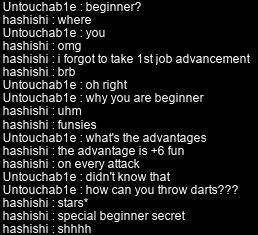

# rangifer’s diary: pt. xlii

## R>1 pog cleave for HH run

Continuing from where this series left off last entry, I want to throw in “the rest” of the odd, misshapen warrior jobs to our analysis. Although this list is, of course, not exhaustive, I will be using [the list of odd jobs on the Oddjobs website](https://oddjobs.codeberg.page/odd-jobs.html) as a reference when adding [permawarrior](https://oddjobs.codeberg.page/odd-jobs.html#permawarrior), [wand warrior](https://oddjobs.codeberg.page/odd-jobs.html#wand-warrior), [dagger warrior](https://oddjobs.codeberg.page/odd-jobs.html#dagger-warrior), and [LUK warrior](https://oddjobs.codeberg.page/odd-jobs.html#luk-warrior) into the fray. We will be skipping over [blood warriors](https://oddjobs.codeberg.page/odd-jobs.html#hp-warrior), as we really only care about the blood warrior’s [PG](https://maplelegends.com/lib/skill?id=1101007) damage. We will also only consider crusader variants of the wand and dagger warriors; WKs lack the ability to use their charges, and DKs lack the ability to use their [Crusher](https://maplelegends.com/lib/skill?id=1311001) skills, [Fury](https://maplelegends.com/lib/skill?id=1311004) skills, and sadly also [Dragon Roar](https://maplelegends.com/lib/skill?id=1311006) for some reason. This leaves the crusader, who thankfully retains their ability to [Shout](https://maplelegends.com/lib/skill?id=1111008) and, importantly, to use [Combo Attack](https://maplelegends.com/lib/skill?id=1111002).

Again, for a closer comparison and for ease of choice, the permawarrior will have the [Stonetooth Sword](https://maplelegends.com/lib/equip?id=01402037) as their weapon of choice. On the other hand, the rest of the jobs here cannot make use of this sword, either for weapon-restriction reasons (wand warriors can only use wands/staves, dagger warriors can only use daggers), or for stat-restriction reasons (LUK warriors would need at least 116 DEX from equipment to wield the Stonetooth Sword, which is _technically_ doable, but much too steep). Both our wand warrior and dagger warrior, naturally enough, need a shield; both of these jobs have access to the same shields that ordinary warriors do, ranging from the [Stolen Fence](https://maplelegends.com/lib/equip?id=01092003), to the [Maple Shield](https://maplelegends.com/lib/equip?id=01092030), to jobbed ones like the [Maple Warrior Shield](https://maplelegends.com/lib/equip?id=01092046), [Gold Kalkan](https://maplelegends.com/lib/equip?id=01092028), and even the almighty [Timeless Kite Shield](https://maplelegends.com/lib/equip?id=01092058)(!). We will be giving our wand and dagger warriors a quite nice shield, with 13 WATK and 10 STR. Because we consider our models to be roughly level 100, our dagger warrior will be using a [GDK](https://maplelegends.com/lib/equip?id=01332051) (although it should be noted that they have the possibility of upgrading to a [Dragon Kanzir](https://maplelegends.com/lib/equip?id=01332049) at level 110+). Our wand warrior will be using their usual endgame weapon, the [Heart Wand](https://maplelegends.com/lib/equip?id=01372033). Perhaps unfortunately, as far as I know, there is no way to obtain a Heart Wand with random stats, so the theoretical maximum WATK (barring the use of [Chaos Scrolls](https://maplelegends.com/lib/use?id=2049100)!) for a Heart Wand is not 50, but just 45. It should also be noted that while the Heart Wand is far and away the best weapon for wand warriors (and some similar jobs like [wandginner](https://oddjobs.codeberg.page/odd-jobs.html#wand-beginner)), there are other options: the misleadingly-named [Heart Staff](https://maplelegends.com/lib/equip?id=01372031) is a wand(!) offering the same benefits, although it has a pesky 43 LUK requirement, and the [Streetlight](https://maplelegends.com/lib/equip?id=01372017) would be a decent choice if it actually existed in MapleLegends; implementations without the “Heart” wands nor the Streetlight will have only the [Metal Wand](https://maplelegends.com/lib/equip?id=01372002) as their weapon of choice (similar to the [magelander](https://oddjobs.codeberg.page/odd-jobs.html#magelander)).

Our LUK warriors, as mentioned before, cannot use the Stonetooth Sword. Instead, our crusader and white knight variants will be using the [Toy of 101](https://maplelegends.com/lib/equip?id=01402038), which is notable for being a viable endgame weapon for _most_ sword-wielding odd jobs, including more beginner-like ones such as [STRginner](https://oddjobs.codeberg.page/odd-jobs.html#permabeginner), [STR mage](https://oddjobs.codeberg.page/odd-jobs.html#str-mage), [brigand](https://oddjobs.codeberg.page/odd-jobs.html#brigand), etc. As noted in the previous installation in this series, there are other good non-sword options for either crusaders or white knights, e.g. the [Maple Demon Axe](https://maplelegends.com/lib/equip?id=01412027) or [level 100 Duck Tube](https://maplelegends.com/lib/equip?id=01322064), respectively. And I want to give a special shoutout to the [Daiwa Sword](https://maplelegends.com/lib/equip?id=01402017) for its importance to DEX and LUK (and HP) fighters/pages/crusaders/white-knights. Our LUK DK can, thankfully, use the same exact weapon as our DEX DK model.

With all that said, let’s take a look at our models. As usual, they are all roughly level 100, and have pretty good gear:

### The model permawarrior

- 510 STR (45 of which is from gear)
- 120 DEX (60 of which is from gear)
- 146 WATK (113 from [sword](https://maplelegends.com/lib/equip?id=01402037) + 20 from [Cider](https://maplelegends.com/lib/use?id=2022002) + 3 from [cape](https://maplelegends.com/lib/equip?id=01102084) + 10 from gloves)

### The model wand warrior

- 550 STR (45 of which is from gear)
- 80 DEX (60 of which is from gear)
- 91 WATK (45 from [wand](https://maplelegends.com/lib/equip?id=01372033) + 13 from [shield](https://maplelegends.com/lib/equip?id=01092028) + 20 from [Cider](https://maplelegends.com/lib/use?id=2022002) + 3 from [cape](https://maplelegends.com/lib/equip?id=01102084) + 10 from gloves)

### The model dagger warrior

- 490 STR (45 of which is from gear)
- 140 DEX (60 of which is from gear)
- 153 WATK (107 from [dagger](https://maplelegends.com/lib/equip?id=01332051) + 13 from [shield](https://maplelegends.com/lib/equip?id=01092028) + 20 from [Cider](https://maplelegends.com/lib/use?id=2022002) + 3 from [cape](https://maplelegends.com/lib/equip?id=01102084) + 10 from gloves)

### The model LUKsader

The extra STR and DEX from gear here are due to the [Toy of 101](https://maplelegends.com/lib/equip?id=01402038) granting 3 STR and 3 DEX on average, when clean.

- 98 STR (63 of which is from gear)
- 52 DEX (48 of which is from gear)
- 137 WATK (104 from [sword](https://maplelegends.com/lib/equip?id=01402038) + 20 from [Cider](https://maplelegends.com/lib/use?id=2022002) + 3 from [cape](https://maplelegends.com/lib/equip?id=01102084) + 10 from gloves)

### The model LUK white knight

The extra STR and DEX from gear here are due to the [Toy of 101](https://maplelegends.com/lib/equip?id=01402038) granting 3 STR and 3 DEX on average, when clean.

- 98 STR (63 of which is from gear)
- 52 DEX (48 of which is from gear)
- 137 WATK (104 from [sword](https://maplelegends.com/lib/equip?id=01402038) + 20 from [Cider](https://maplelegends.com/lib/use?id=2022002) + 3 from [cape](https://maplelegends.com/lib/equip?id=01102084) + 10 from gloves)

### The model LUK dragon knight

- 95 STR (60 of which is from gear)
- 49 DEX (45 of which is from gear)
- 139 WATK (106 from [spear](https://maplelegends.com/lib/equip?id=01432018) + 20 from [Cider](https://maplelegends.com/lib/use?id=2022002) + 3 from [cape](https://maplelegends.com/lib/equip?id=01102084) + 10 from gloves)

### Comparing single-target DPS

As usual, we assume that all player characters and monsters have the same level. And, as in the “R>1 pog ranged for…” series, we will use 600 WDEF to reasonably represent a low- or mid-level boss monster. Additionally, because of the LUK white knight, elemental interactions now matter, so we now assume _by default_ that all monsters are neutral towards all elements; however, I will _also_ list the non-neutral cases separately. The permawarrior is using [Power Strike](https://maplelegends.com/lib/skill?id=1001004), the wand warrior, dagger warrior, and LUKsader are using Power Strike with maxed [Combo Attack](https://maplelegends.com/lib/skill?id=1111002), the LUK white knight is using Power Strike with maxed charge (that is, whichever charge they are using, e.g. [Fire Charge](https://maplelegends.com/lib/skill?id=1211003)), and the LUK dragon knight is using maxed [Spear Crusher](https://maplelegends.com/lib/skill?id=1311001):

| model                      |     DPS |
| :------------------------- | ------: |
| dagger warrior             | 14828.4 |
| wand warrior               |  9446.7 |
| permawarrior               |  5934.0 |
| LUK WK (fire weak)         |  4353.5 |
| LUKsader                   |  3868.9 |
| LUK WK (lightning weak)    |  3545.8 |
| LUK WK (ice weak)          |  2738.0 |
| LUK WK (fire neutral)      |  2468.8 |
| LUK WK (lightning neutral) |  1930.3 |
| LUK DK                     |  1350.2 |

So, I imagine that some of these results may be a bit surprising. As we can see from the dagger sader and the wand sader topping the chart here, [Combo Attack](https://maplelegends.com/lib/skill?id=1111002) is completely and utterly broken. While the wand warrior does clearly trail quite far behind the dagger warrior, they do have two advantages that the dagger warrior lacks: a higher PSM (primary stat multiplier; wands/staves _always swing_ and thus get a PSM of 4.4, whereas daggers get a PSM of 4.0 regardless of the animation), and naturally higher STR. The higher STR is due to the [Heart Wand](https://maplelegends.com/lib/equip?id=01372033) lacking stat requirements, whereas daggers tend to have quite high DEX requirements, like the [GDK](https://maplelegends.com/lib/equip?id=01332051) used for our model here, which has a DEX requirement of 140.

As is perhaps expected after this point, the permawarrior comes in third place with a very strong DPS of 5934. Then we have our LUK warriors. The LUK WK using [Fire Charge](https://maplelegends.com/lib/skill?id=1211003) versus a fire-weak monster comes out on top here, and while that is a fairly specific situation, there are even some boss monsters that are fire-weak: [Scarlion](https://maplelegends.com/lib/monster?id=9420549), [Blue Mushmom](https://maplelegends.com/lib/monster?id=9400205), [Male Boss](https://maplelegends.com/lib/monster?id=9400120), [Pianus (both)](https://maplelegends.com/lib/monster?id=8510000), [Bigfoot](https://maplelegends.com/lib/monster?id=9400575), [Blue King Goblin](https://maplelegends.com/lib/monster?id=7130401), [Bodyguard A](https://maplelegends.com/lib/monster?id=9400112), [The Boss](https://maplelegends.com/lib/monster?id=9400300), and even [one of Vergamot’s bodies](https://maplelegends.com/lib/monster?id=9400264)(‽). Otherwise, LUKsader is the most consistently high single-target DPS amongst the LUK warriors. Our poor, poor LUK DK gets left in the dust, with a measly (but still useful) DPS of 1350.2.

We also, of course, want to compare these figures to the figures calculated in the previous series, and in previous installations of this series. I’ve added some class-based (class as in: beginner, warrior, mage, archer, rogue, pirate) emojis to the “model” column to add some readability to this now quite lengthy table (N.B. some or none of these emojis may show up if you are viewing this on the MapleLegends forums, for some reason(‽)):

| model                         |     DPS |
| :---------------------------- | ------: |
| ⚔️ dagger warrior             | 14828.4 |
| 🥷 STRmit (SM)                 | 13807.5 |
| ⚔️ DEX WK (fire weak)         | 11856.8 |
| ⚔️ DEXsader                   | 10729.0 |
| ⚔️ DEX WK (lightning weak)    |  9977.1 |
| ⚔️ wand warrior               |  9446.7 |
| ⚔️ DEX WK (ice weak)          |  8097.5 |
| 🥷 Permarogue                  |  7658.0 |
| ⚔️ DEX WK (fire neutral)      |  7470.9 |
| 🏹 Wood(wo)man (bow)          |  6725.3 |
| 🏹 Wood(wo)man (xbow)         |  6690.6 |
| 🏴‍☠️ Permapirate                |  6669.1 |
| 🏴‍☠️ Swashbuckler (yes Octo)    |  6598.6 |
| ⚔️ DEX WK (lightning neutral) |  6217.8 |
| ⚔️ permawarrior               |  5934.0 |
| 🏴‍☠️ Swashbuckler (no Octo)     |  5614.4 |
| 🏹 Permarcher                 |  5614.0 |
| ⚔️ DEXgon knight              |  5054.7 |
| ⚔️ LUK WK (fire weak)         |  4353.5 |
| ⚔️ LUKsader                   |  3868.9 |
| ⚔️ LUK WK (lightning weak)    |  3545.8 |
| ⚔️ LUK WK (ice weak)          |  2738.0 |
| ⚔️ LUK WK (fire neutral)      |  2468.8 |
| ⚔️ LUK WK (lightning neutral) |  1930.3 |
| ⚔️ LUK DK                     |  1350.2 |

Wow. The dagger sader actually manages to beat out our [SM](https://maplelegends.com/lib/skill?id=4111004)-wielding [STRmit](https://oddjobs.codeberg.page/odd-jobs.html#str-assassin)!! That is some _truly_ bonkers DPS for an odd job. Our wand sader competes well with the best [DEX warriors](https://oddjobs.codeberg.page/odd-jobs.html#dex-warrior), and the permawarrior squeezes out a good bit more DPS than our DEXgon knight. When it comes to LUK warriors, though, we can now see the immense power that DEX has for warriors, with all of our LUK warriors collectively taking last place in this ranking. We can now see a little more clearly how our ranged odd job models from the previous series (like [permarogue](https://oddjobs.codeberg.page/odd-jobs.html#permarogue), [wood(wo)man](https://oddjobs.codeberg.page/odd-jobs.html#woodsman), [swashbuckler](https://oddjobs.codeberg.page/odd-jobs.html#swashbuckler), etc.) occupy the mid-to-high positions overall, with only our [SM](https://maplelegends.com/lib/skill?id=4111004)-wielding [STRmit](https://oddjobs.codeberg.page/odd-jobs.html#str-assassin) and our dagger sader occupying the truly highest tiers of theoretical single-target DPS at this level.

I also want to note that I did a quick-and-dirty comparison of a _fourth-job_ dagger hero with an equivalent DEX hero (both with maxed [ACA](https://maplelegends.com/lib/skill?id=1120003)), and found that the DEX hero tends to do quite a bit more DPS simply due to [Brandish](https://maplelegends.com/lib/skill?id=1121008). Our odd-weaponed warriors (wand and dagger) excel partly due to sword(wo)men/fighters/crusaders relying so heavily on [Power Strike](https://maplelegends.com/lib/skill?id=1001004) and [Slash Blast](https://maplelegends.com/lib/skill?id=1001005), combined with the fact that their killer skill in third job ([CA](https://maplelegends.com/lib/skill?id=1111002)) works with any melee weapon. Once we start getting into killer skills like Brandish (or [Crusher](https://maplelegends.com/lib/skill?id=1311001), or [Fire Charge](https://maplelegends.com/lib/skill?id=1211003), etc.) that are weapon-specific (as I believe Brandish is, although if Brandish actually _is_ usable with daggers and/or wands, please do let me know), these odd-weaponed warriors start to fall behind a bit.

**_IMPORTANT REMINDERS BEFORE ANYONE GOES AROUND TOUTING THESE NUMERIC FIGURES:_** Keep in mind (and I cannot stress this enough) that this is a purely one-dimensional — and somewhat shoddy — analysis using dummy models, _and_ that jobs cannot be reduced to raw single-target DPS numbers. The odd jobs that are listed above differ quite a bit in their playstyles and range of abilities. Furthermore, this only considers characters that are roughly level 100.

## More adventures of the Brigand Brigade

My [brigand](https://oddjobs.codeberg.page/odd-jobs.html#brigand), **dama**, and **Cort**’s (**Cortical**, **GishGallop**, **Phoneme**, **WizetWizard**, **Medulla**, **Cerebellum**) brigand, **dendrite**, collectively form the _**Brigand Brigade**_. And now that they were brigands for real (having taken second job advancement), it was time to finish up [KPQ](https://maplelegends.com/lib/map?id=103000800) and start heading towards level 35, for great [LPQ](https://maplelegends.com/lib/map?id=221024500)!

Here is dama, in her last-ever KPQ ;(

I hit level 31 just a bit before dendrite, so after dendrite completed their final KPQ without me, we headed off to wrap up some Victoria Island quests:

I hadn’t done [the Mano quest](https://bbb.hidden-street.net/quest/victoria-island/legend-of-the-snail) yet, so we went to get a [Rainbow-colored Snail Shell](https://maplelegends.com/lib/use?id=2210006):

…And soloing [Mano](https://maplelegends.com/lib/monster?id=2220000) made me feel very stronk. Much stronker than I actually am. Next up was the ol’ [MapleStory Basic Knowledge](https://bbb.hidden-street.net/quest/world-tour/maplestory-basic-knowledge) (for great [shoe jump 30%](https://maplelegends.com/lib/use?id=2040715)!):

While we were farming [Genins](https://maplelegends.com/lib/monster?id=9400400) for [their dolls](https://maplelegends.com/lib/etc?id=4000337), a bishop came along and started [Genesis](https://maplelegends.com/lib/skill?id=2321008)ing the map… It didn’t matter much to us, but we had been farming there the whole time, and I had mapowner, so we decided to try Cort’s little, uhm, “prank”, on someone for real:

But I guess being able to cast Genesis overrides mapowner, so we took up and left after no response.

Speaking of [brigands](https://oddjobs.codeberg.page/odd-jobs.html#brigand), now that dendrite & I were second-jobbers, we had access to what is perhaps the brigand’s signature skill: [Steal](https://maplelegends.com/lib/skill?id=4201004). Steal is somewhat unique to brigands, as ordinary bandits (and other odd-jobbed bandits, like [blood bandits](https://oddjobs.codeberg.page/odd-jobs.html#blood-bandit) and [DEXdits](https://oddjobs.codeberg.page/odd-jobs.html#lukless-bandit)) generally have little reason to use Steal. Most people probably don’t even know what it looks like:

The answer is: it looks cool. The way that a shadow of yourself shoots out in the direction that you attack makes the skill look somewhat “ranged” (at least, more so than a basic attack). But actually, weapon-wise, Steal animates identically to a basic attack (and when used with a claw, can only punch), similarly to [Disorder](https://maplelegends.com/lib/skill?id=4001002). So in addition to it being a fancier-looking basic attack, steal deals, at best (level 30 of the skill), the same damage as a basic attack, and at lower levels, deals _less_ damage than a basic attack. Its upside is its unique ability to steal items/mesos from the monster affected by it. According to the skill’s description, each use of Steal has a probability of success, and once a success happens, it can never happen again on that individual monster. The description says “the monster’s items”, but so far the only thing we’ve seen drop from a successful Steal is a meso coin (see [Pickpocket](https://maplelegends.com/lib/skill?id=4211003)). We also found out that Steal seems to still work even if you “MISS” your target (similarly to [MP Eater](https://maplelegends.com/lib/skill?id=2300000)).

In any case, we went to finish up the [99-kill quest](https://bbb.hidden-street.net/quest/victoria-island/polluted-1-evil-eye)s in [Sleepywood](https://maplelegends.com/lib/map?id=105040300) that we had access to:

And we went to Perion’s [Excavation Site](https://maplelegends.com/lib/map?id=101030101) to do [Winston](https://maplelegends.com/lib/npc?id=1022006)’s [two](https://bbb.hidden-street.net/quest/victoria-island/planting-trees) good ETC-[collecting](https://bbb.hidden-street.net/quest/victoria-island/shawn-the-excavators-request) quests:

Oh, right, cant forget [the kill 99 Curse Eyes quest](https://bbb.hidden-street.net/quest/victoria-island/polluted-2-curse-eye):

We also did the ETC-collecting quests at [Nautilus Harbour](https://maplelegends.com/lib/map?id=120000000), like [Lazy Little Calico](https://bbb.hidden-street.net/quest/victoria-island/lazy-little-calico), [For Kyrin](https://bbb.hidden-street.net/quest/victoria-island/for-kyrin), [A Hole in the Nautilus](https://bbb.hidden-street.net/quest/victoria-island/a-hole-in-the-nautilus), [Cleaning the Nautilus 2 & 3](https://bbb.hidden-street.net/quest/victoria-island/request-of-mrs-reade), etc., which was made much easier by the ETCs that Cort had stashed away on their mules.

At this point, we were already nearing level 35 without having even stepped foot anywhere in [Ariant](https://maplelegends.com/lib/map?id=260000000)! So we headed through [the](https://maplelegends.com/lib/map?id=120000101) warp [portal](https://maplelegends.com/lib/map?id=221000300) to Ludus Lake (specifically the [Omega Sector](https://maplelegends.com/lib/map?id=221000000) thereof) and finished up the rest of the way to level 35 by doing [an Omega Sector quest](https://bbb.hidden-street.net/quest/victoria-island/information-for-dr-kim) (unfortunately, [Chief Stan’s Letter](https://bbb.hidden-street.net/quest/victoria-island/chief-stans-letter) requires you to be level 35 to start it) and some [Ludibrium](https://maplelegends.com/lib/map?id=220000000) quests around the [Eos Tower](https://maplelegends.com/lib/map?id=221024400):

## Training w/ nangs420

I did a little bit of grinding on my [DEXgon knight](https://oddjobs.codeberg.page/odd-jobs.html#dex-warrior) **rusa**, with someone who I [OPQ](https://maplelegends.com/lib/map?id=200080101)ed with, and who has featured in a previous entry in this diary: **nangs420**. nangs sent out a [smega](https://maplelegends.com/lib/cash?id=5072000) asking if there were any DKs with whom she could party (being a priest herself), and I responded because I recognised her name and wanted to offer to grind if she didn’t mind my low damage. She recognised me as well, and said she wasn’t exactly counting damage numbers anyways, so off we went!:

The ol’ [CDs](https://maplelegends.com/lib/map?id=742010203), as usual. It should be noted that I have some _four_(!) characters (my [woodwoman](https://oddjobs.codeberg.page/odd-jobs.html#woodsman) **capreolina**, my I/L [magelet](https://oddjobs.codeberg.page/odd-jobs.html#luk-mage) **cervine**, my [swashbuckler](https://oddjobs.codeberg.page/odd-jobs.html#swashbuckler) **hydropotina**, and of course rusa) who are all, uhm, essentially “stuck” at CDs until level 120+. And that’s not even to mention my [STR priest](https://oddjobs.codeberg.page/odd-jobs.html#str-mage), **cervid**, who is there any time she’s on [Heal](https://maplelegends.com/lib/skill?id=2301002)ing duty!

In any case, we had a nice grind/farm session, and rusa got to level 96, which was just enough to put her MAXHP (with [HB](https://maplelegends.com/lib/skill?id=1301007)) into the quintuple digits!!:

Wowza, that’s the first time I’ve seen five whole digits down in my HP bar in my entire maple career…

## Suboptimal <3 HH

**OmokTeacher** (**Slime**, **JumpQuest**, **Slimu**) set us (**Suboptimal** members from **Flow** and/or **Oddjobs**) up with some [HH](https://maplelegends.com/lib/monster?id=9400549) fights when he found one roaming around [Forgotten Path (FP)](https://maplelegends.com/lib/map?id=610010005), which is notable for having a safe spot from which you can attack HH (as HH, unlike [BF](https://maplelegends.com/lib/monster?id=9400575), is incapable of jumping). I went to join the fight on my [swashbuckler](https://oddjobs.codeberg.page/odd-jobs.html#swashbuckler), **hydropotina**, and OmokTeacher & I were joined also by Cort (playing **Cortical**, their [STRginner](https://oddjobs.codeberg.page/odd-jobs.html#permabeginner)), and in our second FP HH fight, **Rort** (also a STRginner of Flow)!:

hydro doesn’t have enough HP to tank HH’s hits, so I had to very carefully cower behind the safe spot, coming out only to place my [Octopus](https://maplelegends.com/lib/skill?id=5211001), who was honestly probably doing like 30% of my DPS, thanks to bypassing WDEF calculations (HH was 12 levels above me). After the second fight, the EXP from HH’s second death was enough to level hydro up from 89 to 90! Yay for [new bullets](https://maplelegends.com/lib/use?id=2330004) (and my ability to be a “pirate sign” for CWKPQ, I suppose…?)!!

Later, we went again, but this time at [Hallowed Ground](https://maplelegends.com/lib/map?id=682000001), so I took my [DEXgon knight](https://oddjobs.codeberg.page/odd-jobs.html#dex-warrior) **rusa** so that I could [HB](https://maplelegends.com/lib/skill?id=1301007)/[IW](https://maplelegends.com/lib/skill?id=1301006) everyone and keep them alive. This time, it was me, OmokTeacher, **Celim** (a STRginner of Flow), and **Ismezin** (also a STRginner of Flow):

## Bulgoki’s wedding

I also attended the wedding of **Bulgoki**, a chief bandit friend of mine who I met in [OPQ](https://maplelegends.com/lib/map?id=200080101) and did one or two [MPQ](https://maplelegends.com/lib/map?id=261000021)s with:

Although he was just marrying one of his mules for the purpose of APQing, it was fun to have the whole (well ok, not exactly the whole, but a good portion of the) gang there :P <3

## MOAR CARDZ

My [woodwoman](https://oddjobs.codeberg.page/odd-jobs.html#woodsman), **capreolina**, is on the hunt again. It was time to start cardhunting in [KFT](https://maplelegends.com/lib/map?id=222000000) in earnest, and so I started hunting [Moon Bunnies](https://maplelegends.com/lib/monster?id=4230300):

Once I finished the set, I got that lovely lightbulb and was called to [Lith Harbour](https://maplelegends.com/lib/map?id=104000000) to upgrade to the [tier 3 ring](https://maplelegends.com/lib/equip?id=01119005)!!:

Wow~~ And back to KFT I went:

c a r d h u n t

Although nothing can be as annoying as [Perfumes](https://maplelegends.com/lib/monster?id=9410024), the [Blin](https://maplelegends.com/lib/monster?id=6130201)’s transforming nature is quite annoying as well.

As I went on [the ship from Orbis to Ellinia](https://maplelegends.com/lib/map?id=200090000), I quickly cowered in [the cabin](https://maplelegends.com/lib/map?id=200090001) as the plane took off, to avoid being slain by any [Crimson Balrogs](https://maplelegends.com/lib/monster?id=8150000). But the other person who was on the flight with me, a DK by the name of [**Pinaka**](https://maplelegends.com/lib/equip?id=01432030), slayed the Crimson Balrog for himself and was nice enough to let me loot the card!

Once I had finished the [Morphed Blin card](https://maplelegends.com/lib/use?id=2383046) set, all that was left for me in KFT was the [Scholar Ghost](https://maplelegends.com/lib/monster?id=6090003), the [9-tailed fox](https://maplelegends.com/lib/monster?id=7220001), and the [King Goblins](https://maplelegends.com/lib/monster?id=7130400). I didn’t exactly feel like suffering through the process of going from 0/5 Scholar Ghost cards to 5/5, so I decided to skip that for now. And I never plan on getting the 9-tailed fox set, as that monster is necessary for a quest, and is on a respawn timer, so I don’t want to grief anyone doing the quest. But I do want to get the King Goblins’ card sets, so I have been saving up the USE items from the requisite quests. Said quests are repeatable every so many hours, so in the meantime, I have been card-hunting in the adjacent [Aquarium](https://maplelegends.com/lib/map?id=230000000) region (Aqua Road):

## capre hits level 113

GM boofs were announced, and so I decided to do some more grinding [at CDs](https://maplelegends.com/lib/map?id=742010203) on capre. I was going to do some grinding there on hydropotina as well, but accidentally left some of her equipment on rusa, who is on the same account, so there was no way to transfer it after having already gotten the GM boofs.

In any case, I trioed in a party that was using one of their other characters to serve as an [SE](https://maplelegends.com/lib/skill?id=3121002)/[MW](https://maplelegends.com/lib/skill?id=3121000) mule, so we were all training with both of those buffs active. This, as is to be expected, really skyrocketed capre’s damage!:

And by the time everyone was done, I was roughly 90% EXP or so, so I decided to solo grind the rest of the way, so that I can be level 113 at our second [Ravana](https://maplelegends.com/lib/monster?id=9420014) run attempt very soon!:

:D

## hashishi is back at it again with the LPQs

I did some more [LPQ](https://maplelegends.com/lib/map?id=221024500)ing on my [besinner](https://oddjobs.codeberg.page/odd-jobs.html#besinner), **hashishi**!

I was partying with **TimmyDC**, who only needed 100(!) more LPQs to get that final 20th pair of [LPQ glasses](https://bbb.hidden-street.net/eq/eye-accessory/broken-glasses):

And also with the LPQ mule(?) **SpankVictim**, a perma-level-50 [fighter](https://maplelegends.com/lib/skill?id=1101006):

…and so hashishi inches closer to that second pair of glasses, and to [level](https://maplelegends.com/lib/equip?id=01002357) [50](https://maplelegends.com/lib/equip?id=01122014)!
