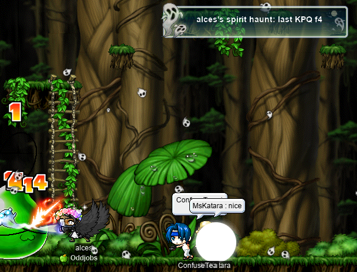
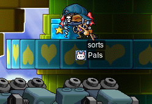
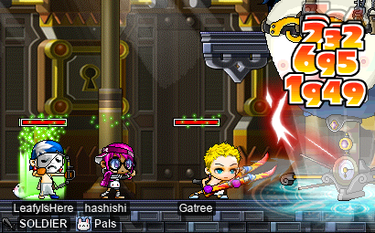
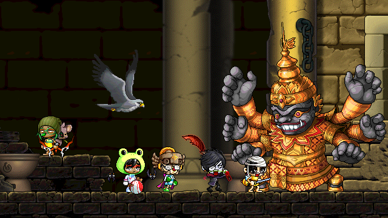

# rangifer’s diary: pt. xliii

## R>1 pogginner for Pap run

I think that this series is at the point now where we (and by “we”, I mean “I”) want to see representation from just about every odd job under the sun, or at least, the ones represented within [the list of odd jobs on the Oddjobs website](https://oddjobs.codeberg.page/odd-jobs.html). In doing so, we will realise that some of the distinctions that are made in common parlance, and made within the aforementioned list, cannot be accurately represented in this kind of analysis. This should be unsurprising, given that the kind of analysis done in this series is extremely narrow and one-dimensional. We have already seen, in the previous installation of this series, the total exclusion of one of the most primordial and well-known odd jobs: the [blood warrior](https://oddjobs.codeberg.page/odd-jobs.html#hp-warrior). The previous installation was supposed to include all warrior odd jobs that weren’t already represented, but we skipped blood warriors because we really only care about their [PG](https://maplelegends.com/lib/skill?id=1101007) damage, which almost entirely depends on the WATK of their opponent.

In this installation, I want to do something similar, but with beginners (rather than warriors). One distinction made by our handy odd jobs list that we already have to discard, is that of location. “[Islanders](https://oddjobs.codeberg.page/odd-jobs.html#islander)” in the broad sense are not really distinguishable from “[permabeginners](https://oddjobs.codeberg.page/odd-jobs.html#permabeginner)” in the broad sense, for the purpose of our analysis. Their only difference would be access to gear/items, but it doesn’t matter anyways, because we are only considering roughly-level-100 characters… something that doesn’t exist on the island. Similar comments apply to the [camper](https://oddjobs.codeberg.page/odd-jobs.html#camper), and also to the [magelander](https://oddjobs.codeberg.page/odd-jobs.html#magelander) (and other islander subspecies, e.g. perfectlander, STRlander, bloodlander, etc.). Furthermore, we will find ourselves collapsing a number of non-beginner jobs into these beginner jobs. While it is obviously true that [STRginners](https://oddjobs.codeberg.page/odd-jobs.html#permabeginner), [STR mages](https://oddjobs.codeberg.page/odd-jobs.html#str-mage), [brigands](https://oddjobs.codeberg.page/odd-jobs.html#brigand), [wood(wo)men](https://oddjobs.codeberg.page/odd-jobs.html#woodsman) (in melee), and [STRlords](https://oddjobs.codeberg.page/odd-jobs.html#str-assassin) (in melee), have dramatically different playstyles and ranges of abilities, they look just about the same for the purpose of this analysis, so we collectively refer to them here as “generic STR whacker”. Likewise, [DEXginner](https://oddjobs.codeberg.page/odd-jobs.html#dex-beginner) and [DEX mage](https://oddjobs.codeberg.page/odd-jobs.html#dex-mage) will be collectively referred to here as “generic DEX whacker”. Likewise, [besinners](https://oddjobs.codeberg.page/odd-jobs.html#besinner), claw-wielding [LUK warriors](https://oddjobs.codeberg.page/odd-jobs.html#luk-warrior), claw-wielding [magelets](https://oddjobs.codeberg.page/odd-jobs.html#luk-mage), and claw-wielding [lucc buccs](https://oddjobs.codeberg.page/odd-jobs.html#luk-bucc) will be collectively referred to as “generic claw-wielding non-rogue” (bit of a mouthful, but whatever).

So, this leaves us with the following four:

- [Wandginner](https://oddjobs.codeberg.page/odd-jobs.html#wand-beginner)
- [Generic claw-wielding non-rogue](https://oddjobs.codeberg.page/odd-jobs.html#besinner)
- [Generic STR whacker](https://oddjobs.codeberg.page/odd-jobs.html#permabeginner)
- [Generic DEX whacker](https://oddjobs.codeberg.page/odd-jobs.html#dex-beginner)

Equipping our wandginner will look very similar to equipping the [wand warrior](https://oddjobs.codeberg.page/odd-jobs.html#wand-warrior) in the previous installation, with the minor exception that I’ll be taking 3 STR off of the shield to reflect the disadvantage that the wandginner has due to only being able to equip shields that lack class requirements. Equipping the generic claw-wielding non-rogue will also be pretty simple, as we can just assume (like we did for the ranged [permarogue](https://oddjobs.codeberg.page/odd-jobs.html#permarogue)) that they are throwing [Ilbis](https://maplelegends.com/lib/use?id=2070006).

This brings us to the generic STR and DEX whackers. Picking a weapon here is inevitably bound to be controversial, as there are various weapons considered to be “endgame-worthy” for STRginners and their ilk: the [Crimson Arcglaive](https://maplelegends.com/lib/equip?id=01442068), the [Purple Surfboard (PSB)](https://maplelegends.com/lib/equip?id=01442057), the [Fan](https://maplelegends.com/lib/equip?id=01332030), and even the [Toy of 101](https://maplelegends.com/lib/equip?id=01402038). Which weapon(s) pans out to be “the best” is _very_ sensitive to the circumstances and assumptions that surround the choice of weapon. That being said, I want to immediately throw the Crimson Arcglaive out due to its extremely steep STR requirement of 300, which renders it unusable for DEX whackers. It’s easier and a bit more fair of a comparison if we can use the same weapon for both our generic STR and DEX whackers. Our other options lack significant stat requirements, with the slight exception of the Fan, but it requires just ≥31 STR from equipment for DEX whackers, which is pretty doable. That being said, choosing the Fan means pairing it with a shield, so we are going to throw out the Fan to keep things simpler. This leaves just the PSB and the Toy of 101; the Toy of 101 has its advantages, but because of the methods used in this analysis, we can nearly guarantee that the PSB comes out ahead of the Toy of 101, so we will be optimistic and pick the PSB.

With all that said, let’s take a look at our models. As usual, they are all roughly level 100, and have pretty good gear:

### The model wandginner

- 547 STR (42 of which is from gear)
- 80 DEX (60 of which is from gear)
- 91 WATK (45 from [wand](https://maplelegends.com/lib/equip?id=01372033) + 13 from [shield](https://maplelegends.com/lib/equip?id=01092028) + 20 from [Cider](https://maplelegends.com/lib/use?id=2022002) + 3 from [cape](https://maplelegends.com/lib/equip?id=01102084) + 10 from gloves)

### The model generic claw-wielding non-rogue

- 581 LUK (60 of which is from gear)
- 34 STR (30 of which is from gear)
- 34 DEX (30 of which is from gear)
- 70 WATK (10 from [claw](https://maplelegends.com/lib/equip?id=01472088) + 27 from [stars](https://maplelegends.com/lib/use?id=2070006) + 20 from [Cider](https://maplelegends.com/lib/use?id=2022002) + 3 from [cape](https://maplelegends.com/lib/equip?id=01102084) + 10 from gloves)

### The model generic STR whacker

- 550 STR (45 of which is from gear)
- 80 DEX (60 of which is from gear)
- 144 WATK (111 from [polearm](https://maplelegends.com/lib/equip?id=01442057) + 20 from [Cider](https://maplelegends.com/lib/use?id=2022002) + 3 from [cape](https://maplelegends.com/lib/equip?id=01102084) + 10 from gloves)

### The model generic DEX whacker

- 566 DEX (45 of which is from gear)
- 64 STR (60 of which is from gear)
- 144 WATK (111 from [polearm](https://maplelegends.com/lib/equip?id=01442057) + 20 from [Cider](https://maplelegends.com/lib/use?id=2022002) + 3 from [cape](https://maplelegends.com/lib/equip?id=01102084) + 10 from gloves)

### Comparing single-target DPS

As usual, we assume that all player characters and monsters have the same level. And, as in the “R>1 pog ranged for…” series, we will use 600 WDEF to reasonably represent a low- or mid-level boss monster. All models are, of course, limited to only basic-attacking.

| model                           |    DPS |
| :------------------------------ | -----: |
| Generic STR whacker             | 2227.8 |
| Wandginner                      | 1308.7 |
| Generic DEX whacker             |  966.0 |
| Generic claw-wielding non-rogue |  841.5 |

As expected, our generic STR whacker comes out on top here. What might come as somewhat of a surprise to some people is the fact that the wandginner compares very favourably to the other non-STR-based entries here, and the fact that the generic claw-wielding non-rogue is firmly in last place, despite being truly pure LUK (base stats of 4/4/4/`x`). While our wandginner obviously lacks WATK due to being restricted to wands/staves, they can still put as much AP into STR as they want (as long as they still have enough WACC to hit consistently), and benefit from the guaranteed PSM (primary stat multiplier, the primary stat being STR in this case) of 4.4 that wands/staves give. And while our generic claw-wielding non-rogue does have a metric shitton of LUK (even more than an ordinary rogue of the same level), they are _extremely_ starved for WATK due to getting exactly 10 WATK from their weapon (no matter how good their gear is), and they are hurting in the PSM department: claws have a PSM of just 3.6.

We also, of course, want to compare these figures to the figures calculated in the previous series, and in previous installations of this series. I’ve added some class-based (class as in: beginner, warrior, mage, archer, rogue, pirate) emojis to the “model” column to add some readability to this now quite lengthy table (N.B. some or none of these emojis may show up if you are viewing this on the MapleLegends forums, for some reason(‽)):

| model                              |     DPS |
| :--------------------------------- | ------: |
| ⚔️ dagger warrior                  | 14828.4 |
| 🥷 STRmit (SM)                      | 13807.5 |
| ⚔️ DEX WK (fire weak)              | 11856.8 |
| ⚔️ DEXsader                        | 10729.0 |
| ⚔️ DEX WK (lightning weak)         |  9977.1 |
| ⚔️ wand warrior                    |  9446.7 |
| ⚔️ DEX WK (ice weak)               |  8097.5 |
| 🥷 Permarogue                       |  7658.0 |
| ⚔️ DEX WK (fire neutral)           |  7470.9 |
| 🏹 Wood(wo)man (bow)               |  6725.3 |
| 🏹 Wood(wo)man (xbow)              |  6690.6 |
| 🏴‍☠️ Permapirate                     |  6669.1 |
| 🏴‍☠️ Swashbuckler (yes Octo)         |  6598.6 |
| ⚔️ DEX WK (lightning neutral)      |  6217.8 |
| ⚔️ permawarrior                    |  5934.0 |
| 🏴‍☠️ Swashbuckler (no Octo)          |  5614.4 |
| 🏹 Permarcher                      |  5614.0 |
| ⚔️ DEXgon knight                   |  5054.7 |
| ⚔️ LUK WK (fire weak)              |  4353.5 |
| ⚔️ LUKsader                        |  3868.9 |
| ⚔️ LUK WK (lightning weak)         |  3545.8 |
| ⚔️ LUK WK (ice weak)               |  2738.0 |
| ⚔️ LUK WK (fire neutral)           |  2468.8 |
| 🔰 Generic STR whacker             |  2227.8 |
| ⚔️ LUK WK (lightning neutral)      |  1930.3 |
| ⚔️ LUK DK                          |  1350.2 |
| 🔰 Wandginner                      |  1308.7 |
| 🔰 Generic DEX whacker             |   966.0 |
| 🔰 Generic claw-wielding non-rogue |   841.5 |

As expected, our beginners and beginner-a-likes rank pretty low in the ranking that we have so far. But, the generic STR whacker is able to beat certain [LUK warriors](https://oddjobs.codeberg.page/odd-jobs.html#luk-warrior) in certain situations.

**_IMPORTANT REMINDERS BEFORE ANYONE GOES AROUND TOUTING THESE NUMERIC FIGURES:_** Keep in mind (and I cannot stress this enough) that this is a purely one-dimensional — and somewhat shoddy — analysis using dummy models, _and_ that jobs cannot be reduced to raw single-target DPS numbers. The odd jobs that are listed above differ quite a bit in their playstyles and range of abilities. Furthermore, this only considers characters that are roughly level 100.

## Meet alces

Gather ‘round, y’all — it’s time for our regularly-scheduled “deer has an alt-itis crisis” moment. Meet **alces**, my undead [daggerlord](https://oddjobs.codeberg.page/odd-jobs.html#dagger-assassin):

(The text in the above screenshot is supposed to read “i’m fucking dead!!!”, but it ended up being half-obscured by my wings…)

For those not familiar with [daggerlords](https://oddjobs.codeberg.page/odd-jobs.html#dagger-assassin), they are perhaps better known as “ditsins”, because they are, in some sense, the opposite of a sindit. But daggerlords have a different concept at their core. While sindits opt for [L7](https://maplelegends.com/lib/skill?id=4001344)/[KE](https://maplelegends.com/lib/skill?id=4000001) throughout first job and the first half or so of second job, they do so opportunistically, to take advantage of L7 having a ridiculous damage formula; later on, they start to look much more like ordinary bandits. Daggerlords opt for [Double Stab](https://maplelegends.com/lib/skill?id=4001334), while still taking job advancements to assassin/hermit/nightlord (the latter job name being the namesake of “daggerlord”), but could not possibly do so opportunistically; Double Stab does not have a ridiculous damage formula like L7 does… it’s a pretty modest skill with extremely short reach. Instead, rather than Double Stab being the choice _skill_ of the daggerlord in the same way that L7 is the choice skill of the first/second job sindit, the dagger is the choice _weapon_ of the daggerlord, for life. Sindits use claws early on in their life simply because L7 requires its user to wield a claw; daggerlords, on the other hand, swear a _lifelong oath_ to never wield any weapon that is not a dagger. It is for this reason, and this reason alone, that daggerlords are essentially stuck with Double Stab as their only attack from first job onwards.

The joke here is that daggerlords can only make use of two of their second-job skills: [Haste](https://maplelegends.com/lib/skill?id=4101004) and [Endure](https://maplelegends.com/lib/skill?id=4100002)… the rest require their users to wield a claw ;( This makes daggerlords look a lot like [permarogues](https://oddjobs.codeberg.page/odd-jobs.html#permarogue) with Haste who never use claws :P

After advancing to assassin, I was able to do some of my last [KPQ](https://maplelegends.com/lib/map?id=103000800)s with fellow odd-jobber **attackattack** (**drainer**, **xX17Xx**, **maebee**, **strainer**), a [DEX warrior](https://oddjobs.codeberg.page/odd-jobs.html#dex-warrior) who will be going the page/WK/pally route!:

And then it was time for the saddest KPQ… my last:

I look forward to having to explain to other [LPQ](https://maplelegends.com/lib/map?id=221024500)ers why I can do the thief portal, but cannot range despite being an assassin… >w<

## On this episode of “Card-Hunting With capre”…

My [woodwoman](https://oddjobs.codeberg.page/odd-jobs.html#woodsman), **capreolina**, is still workin’ on them Monster Book Rings!!

capre on the hunt~

I finally accumulated enough of the USE items for summoning King Goblins ([Roasted Pork](https://maplelegends.com/lib/use?id=2022050), [Rice Wine](https://maplelegends.com/lib/use?id=2022052), and [Buckwheat Paste](https://maplelegends.com/lib/use?id=2022051)) to finish [the corresponding quest](https://bbb.hidden-street.net/quest/ludus-lake/goblin-at-black-mountain) and finish the three card sets at the same time!:

Now that that was over with, I decided to skip the rest of the upper Aquarium region for now (I’ll come back to it later), and head over to the Mu Lung Gardens region (which includes [Herb Town](https://maplelegends.com/lib/map?id=251000000)):

It pains me deeply to massacre my own kind ([_R. tarandus_](https://en.wikipedia.org/wiki/Reindeer) is a species of the [_Capreolinae_](https://en.wikipedia.org/wiki/Capreolinae) subfamily, from which capre gets her name), but I must do it! For the +1 allstat and 100 MAXHP~:

## sorts fulfills her destiny for the first time~

As some readers of this diary may remember, **sorts** is my [DEX brawler](https://oddjobs.codeberg.page/odd-jobs.html#dex-brawler) [LPQ](https://maplelegends.com/lib/map?id=221024500) mule. When I was looking to join an LPQ party on my [besinner](https://oddjobs.codeberg.page/odd-jobs.html#besinner), **hashishi**, the only folks I could find were a party that had a single slot left and needed a “sin”. Of course, what they _really_ meant was that they needed someone who was capable of both ranged attacking, and doing the “thief” portal. But sorts, despite being a brawler (and thus neither a sin nor a sindit), is perfectly capable of those two things as well; maxed [Double Shot](https://maplelegends.com/lib/skill?id=5001003) ensures that sorts is truly ranged when wielding a gun, and [Oak Barrel](https://maplelegends.com/lib/skill?id=5101007) is essentially [Dark Sight](https://maplelegends.com/lib/skill?id=4001003), with some minor differences. I didn’t want to be selfish and insist that I take both hashishi and sorts along (as that would have required at least one of their party members to leave), so I offered to just bring sorts with them so that they can LPQ successfully. It took a little bit of convincing that I really was _effectively_ an assassin, but after that, it went swimmingly:

So, in some sense, this is sorts in her “true form” for the first time, not just me multiclienting with her as a “barrel mule”!

## hashishi is freed from LPQ

My [besinner](https://oddjobs.codeberg.page/odd-jobs.html#besinner), **hashishi**, has been a bit stuck at LPQ for a while, because I wanted to get her two pairs of LPQ glasses (Broken Glasses) before she graduates. This means being slightly careful, because that’s at least 70 LPQs in total, and I can’t lose experience by killing myself.

I did some more LPQing with **SpankVictim**, but as his hunter, **LeafyIsHere**:

And had a lot of fun with **misosad**, [**Asklepios**](https://en.wikipedia.org/wiki/Asclepius), **TimmyDC** (as usual), **RatatouiIIe** (`Ratatouiiie`), and **Cerni** (R.I.P.):

And we were also joined by **StealSonBun** and **Mulgokie**, the latter of whom has appeared in previous diary entries as **Bulgoki**, the shadower:

And hashishi hit level 50 and 70 LPQ completions at just about the same time!! Before she moves on, I will of course want a [zhelm](https://maplelegends.com/lib/equip?id=01002357), but for that I have been instructed to wait for **Cortical** (**Phoneme**, **GishGallop**, **Cerebellum**, **Medulla**, **dendrite**, **MageFP**, etc.) to get to level 50 so that we can trio the Zakum prequests with **Gambolpuddy** (**Taima**, **Tacgnol**, **Boymoder**, **Numidium**, **Yotsubachan**)~

## A smol update on potpan and sets

Some may remember my characters **potpan** and **sets**, who are my [MPQ](https://maplelegends.com/lib/map?id=261000021) and [OPQ](https://maplelegends.com/lib/map?id=200080101) mules, respectively. Neither of them are odd-jobbed (indeed, my only non-odd characters), so I don’t usually include them in this diary unless they are already relevant.

But I have gotten sets to level 51+ (currently 56), so she is a fully-functional OPQ mule now! And she has a bit of a new look, perhaps as the heroine (or villain‽) of OPQ:

And potpan is nearly there (“there” being level 71, of course), as she is currently level 68, almost 69! And she has a new look as well:

I’ve done quite a few OPQs recently on these two, particularly with **GishGallop** and **xX17Xx**!

## All-odd-jobbed Ravana run, attempt #2

We finally got around to scheduling another attempt at killing [Ravana](https://maplelegends.com/lib/monster?id=9420014) with an odd-jobs-only party! Our first attempt is documented in pt. xxxvi of this diary, so check that out if you haven’t already. Fortunately for our second attempt, I no longer have a graphics driver bug that causes [VA-API](https://en.wikipedia.org/wiki/Video_Acceleration_API) to completely botch [H.264](https://en.wikipedia.org/wiki/H.264/MPEG-4_AVC) encoding(!), so I could actually produce some video evidence of our run this time. Our lineup for this attempt was:

- Me as **capreolina**, level 113 [woodwoman](https://oddjobs.codeberg.page/odd-jobs.html#woodsman) of **Oddjobs**.
- **OmokTeacher**, level 100 [STRginner](https://oddjobs.codeberg.page/odd-jobs.html#permabeginner) of **Flow**.
- **Cerebellum**, level 41 [blood fighter](https://oddjobs.codeberg.page/odd-jobs.html#hp-warrior).
- **Gumby**, level 105 STRginner of Flow.
- **Outside**, level 95 STRginner of Flow.

You can [watch a video of this attempt on the Oddjobs YouTube channel](https://www.youtube.com/watch?v=fGvKFvZdZhg)!

