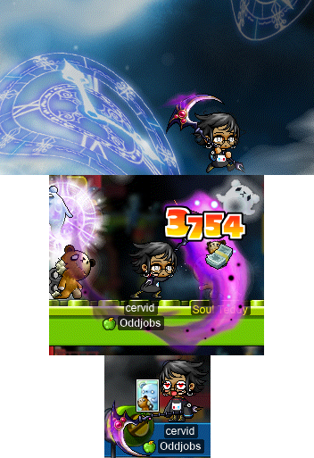
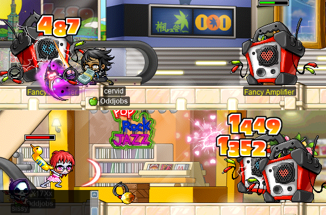
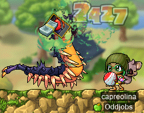

# rangifer’s diary: pt. xliv

## R>1 mageoid for Crimson Balrog runs

Now that this series has already covered “all” [permabeginners](https://oddjobs.codeberg.page/odd-jobs.html#permabeginner) and permabeginner-a-likes (see the previous diary entry), as well as “all” odd warrior jobs (see pt. xli and pt. xlii of this diary), it’s time to tackle the next one on the list (this list is in ascending order of ID, as expressed internally by MapleStory itself):

- beginners (0)
- warriors (100)
- magicians (200)
- archers (300)
- rogues (400)
- pirates (500)

That’s right, it’s mage time. But not just any mages; only goofy-ass odd-jobbed mageoid freaks allowed here!:

- [STR mages](https://oddjobs.codeberg.page/odd-jobs.html#str-mage)
- [DEX mages](https://oddjobs.codeberg.page/odd-jobs.html#dex-mage)
- [Permamagicians](https://oddjobs.codeberg.page/odd-jobs.html#permamagician)
- [Gishes](https://oddjobs.codeberg.page/odd-jobs.html#gish)
- [Gishlets](https://oddjobs.codeberg.page/odd-jobs.html#luk-gish)
- [Magelets](https://oddjobs.codeberg.page/odd-jobs.html#luk-mage)

We can actually eliminate the first two items on the above list; we included STR mages as “generic STR whackers” in the previous entry, and DEX mages as “generic DEX whackers”. The reason for this is that they are effectively indistinguishable from their permabeginner counterparts for the purpose of this analysis. While this _does_ simplify things, the remaining four items leave things still quite complicated indeed.

Our most straightforward archetype is that of the permamagician. Permamagicians never take second job advancement, so we don’t have any complications due to the three distinct mage paths (F/P, I/L, cleric/priest/bishop) offered from second job onwards. Additionally, we will be assuming that our model permamagician is a “normal” (read: entirely or almost entirely INT) one, and is thus not hybridised with other odd mage jobs like e.g. STR mage. Like most mages around this level (roughly level 100), the choice weapon of our permamagician is an Elemental Wand of some kind, because we assume them to be pure INT. Exactly which level 70 Elemental Wand is chosen, doesn’t matter terribly, because the permamagician has no access to elemental spells, so we will just use [the first one](https://maplelegends.com/lib/equip?id=01372035). Unfortunately, this means that we have to deal with TMA (total magic attack) gear for the first time, which functions quite a bit differently than gearing for physical attacks. And furthermore, in a server like MapleLegends, [mages](https://maplelegends.com/lib/skill?id=2321008) and [washing](https://maplelegends.com/lib/cash?id=5050000) gear are in such high demand, that a set of physical-attacking gear and TMA gear that are roughly the same level of quality, can differ _wildly_ in market value. So, choosing TMA gear that is “equivalent” to the kind of gear that we have supplied our physical-attackers with, seems to be a troubling task. To make things easier, any time that we want purely TMA gear, I will just be using a lightly modified version of the actual equipment that I use on my own I/L [magelet](https://oddjobs.codeberg.page/odd-jobs.html#luk-mage), **cervine**.

Speaking of magelets, our magelet models will be equipped very similarly to our permamagician model, with two caveats. One caveat is that the exact element of the magelet’s weapon matters, as we assume that none of our magelets are permamagicians, so they will all have access to elemental spells. The other caveat is that, because we assume all models to be “roughly level 100”, this brings Elemental _Staves_ into consideration. Elemental Staves are only equippable by those on the higher end of “roughly level 100”, because they require the mage to be at least level 103. So, in order to get numbers somewhere in between using an Elemental Wand and an Elemental Staff, we will be giving the magelet a TMA advantage on their gear equal to half of the difference between a wand and a staff. Besides the gearing considerations, we will have three different magelet models: one for each of the third job mage classes (F/P, I/L, priest). Actually, the [Heal](https://maplelegends.com/lib/skill?id=2301002) skill somewhat complicates things here; Heal is the main weapon of the cleric/priest magelet, because its damage (although, not its healing) scales on LUK. In addition, Heal changes its per-target damage based on how many targets there are in total. This makes Heal a super weird case here, but we will, for completeness, include a single model that does use Heal; we will use the best possible case, where the monster is the only other target of Heal besides the magelet themselves (and also, obviously the monster will be undead, and therefore susceptible to Heal).

This brings us to the gishlets and the gishes. These two odd jobs are extraordinarily complex; they prove to be more difficult to plan, build, and equip than perhaps any other job (odd or not) in the entire game, and their two modes of attacking (melee and magic) make our analysis even hairier than it already is. So we are actually going to leave gish(let)s their entire own entry in this series.

With all of that said, let’s take a look at our models:

### The model permamagician

- 613 INT (7 from [wand](https://maplelegends.com/lib/equip?id=01372035), 6 from [shield](https://maplelegends.com/lib/equip?id=01092003), 25 from hat/helmet, 3 from [glasses](https://bbb.hidden-street.net/eq/eye-accessory/broken-glasses), 5 from earrings, 10 from cape, 16 from [overall](https://maplelegends.com/lib/equip?id=01051098), 7 from gloves, 5 from [pendant](https://maplelegends.com/lib/equip?id=01122014), 3 from [shoes](https://maplelegends.com/lib/equip?id=01072078), 5 from rings)
- 146 raw MATK (97 from [wand](https://maplelegends.com/lib/equip?id=01372035), 9 from [shield](https://maplelegends.com/lib/equip?id=01092003), 10 from earrings, 6 from cape, 4 from gloves, 20 from [Wizard Elixir](https://maplelegends.com/lib/use?id=2002018))

And, as you’d expect, our permamagician will only be attacking with [Magic Claw](https://maplelegends.com/lib/skill?id=2001005).

### The model magelet

- 112 INT (7 from [wand](https://maplelegends.com/lib/equip?id=01372035)/[staff](https://maplelegends.com/lib/equip?id=01382045), 6 from [shield](https://maplelegends.com/lib/equip?id=01092003), 25 from hat/helmet, 3 from [glasses](https://bbb.hidden-street.net/eq/eye-accessory/broken-glasses), 5 from earrings, 10 from cape, 16 from [overall](https://maplelegends.com/lib/equip?id=01051098), 7 from gloves, 5 from [pendant](https://maplelegends.com/lib/equip?id=01122014), 3 from [shoes](https://maplelegends.com/lib/equip?id=01072078), 5 from rings)
- 535 LUK (30 of which is from gear)
- 163 raw MATK (114 from [wand](https://maplelegends.com/lib/equip?id=01372035)/[staff](https://maplelegends.com/lib/equip?id=01382045), 9 from [shield](https://maplelegends.com/lib/equip?id=01092003), 10 from earrings, 6 from cape, 4 from gloves, 20 from [Meditation](https://maplelegends.com/lib/skill?id=2101001)/[Wizard Elixir](https://maplelegends.com/lib/use?id=2002018))

For our F/P and I/L magelets, we assume that they are using an Elemental Wand/Staff that is appropriate for the spell being cast. We assume maxed [Element Amplification](https://maplelegends.com/lib/skill?id=2110001), and at least level 11 [Spell Booster](https://maplelegends.com/lib/skill?id=2111005). Because the F/P has three main attacking skills in third job ([Poison Mist](https://maplelegends.com/lib/skill?id=2111003), [Explosion](https://maplelegends.com/lib/skill?id=2111002), and [Element Composition](https://maplelegends.com/lib/skill?id=2111006)), whereas the I/L really only has two ([Ice Strike](https://maplelegends.com/lib/skill?id=2211002) and [Element Composition](https://maplelegends.com/lib/skill?id=2211006)), the F/P is in a bit of a tough position here. Thankfully, although [Fire Arrow](https://maplelegends.com/lib/skill?id=2101004) is 30 points of basic attack behind Element Composition, Fire Arrow does at least have a smaller attack period; we will include both spells (assuming that either one is maxed), to be fair to our F/P magelet.

For our priest magelet, we will have the aforementioned [Heal](https://maplelegends.com/lib/skill?id=2301002) case, as well as a case that uses [Magic Claw](https://maplelegends.com/lib/skill?id=2001005) (which will, at the same time, represent a magelet permamagician!), and two for [SR](https://maplelegends.com/lib/skill?id=2311004) (elementally neutral & weak).

For all elemental spells, we will be splitting into two cases, one for the monster being elementally neutral towards the spell, and one for it being elementally weak.

### Comparing single-target DPS

As usual, we assume that all player characters and monsters have the same level. And, as in the “R>1 pog ranged for…” series, we will use 600 WDEF & 600 MDEF to reasonably represent a low- or mid-level boss monster.

| model                                      |    DPS |
| :----------------------------------------- | -----: |
| Magelet (F/P Ele Comp; weak)               | 4520.7 |
| Magelet (I/L Ele Comp; weak)               | 4192.2 |
| Magelet (Fire Arrow; weak)                 | 3976.9 |
| Permamagician                              | 3307.3 |
| Magelet (F/P Ele Comp; neutral)            | 2877.8 |
| Magelet (Heal; 1 non-self target)          | 2853.7 |
| Magelet (I/L Ele Comp; neutral)            | 2658.8 |
| Magelet (Fire Arrow; neutral)              | 2498.2 |
| Magelet (SR; weak)                         | 1206.1 |
| Magelet (SR; neutral)                      |  699.2 |
| Magelet (priest/permamagician; Magic Claw) |  234.4 |

So the first thing that we notice here is that the elemental magelets can outperform our permamagician in cases where the monster is elementally weak to their element(s). This perhaps comes as a surprise, considering that the permamagician is pure INT, whereas our magelets are INTless by definition. But in more neutral settings, our permamagician comes out on top.

With our priestlet, we can see extremely clearly the effects of the 600 MDEF; Magic Claw takes the biggest hit, because MDEF is (unlike WDEF) effectively applied to individual _lines_ of damage, and Magic Claw has two of these! So MDEF counts against them _twice_, leaving the priestlet/permamagicianlet at a measly 234.4 DPS when using Magic Claw… And SR doesn’t fare very well either, because the priestlet has no pre-MDEF damage multipliers (besides elemental weakness, in that particular case), unlike the elemental magelets, who have both Element Amplification and an Elemental Wand/Staff.

We also, of course, want to compare these figures to the figures calculated in the previous series, and in previous installations of this series. I’ve added some class-based (class as in: beginner, warrior, mage, archer, rogue, pirate) emojis to the “model” column to add some readability to this now quite lengthy table (N.B. some or none of these emojis may show up if you are viewing this on the MapleLegends forums, for some reason(‽)):

| model                                         |     DPS |
| :-------------------------------------------- | ------: |
| ⚔️ dagger warrior                             | 14828.4 |
| 🥷 STRmit (SM)                                 | 13807.5 |
| ⚔️ DEX WK (fire weak)                         | 11856.8 |
| ⚔️ DEXsader                                   | 10729.0 |
| ⚔️ DEX WK (lightning weak)                    |  9977.1 |
| ⚔️ wand warrior                               |  9446.7 |
| ⚔️ DEX WK (ice weak)                          |  8097.5 |
| 🥷 Permarogue                                  |  7658.0 |
| ⚔️ DEX WK (fire neutral)                      |  7470.9 |
| 🏹 Wood(wo)man (bow)                          |  6725.3 |
| 🏹 Wood(wo)man (xbow)                         |  6690.6 |
| 🏴‍☠️ Permapirate                                |  6669.1 |
| 🏴‍☠️ Swashbuckler (yes Octo)                    |  6598.6 |
| ⚔️ DEX WK (lightning neutral)                 |  6217.8 |
| ⚔️ permawarrior                               |  5934.0 |
| 🏴‍☠️ Swashbuckler (no Octo)                     |  5614.4 |
| 🏹 Permarcher                                 |  5614.0 |
| ⚔️ DEXgon knight                              |  5054.7 |
| 🧙 Magelet (F/P Ele Comp; weak)               |  4520.7 |
| ⚔️ LUK WK (fire weak)                         |  4353.5 |
| 🧙 Magelet (I/L Ele Comp; weak)               |  4192.2 |
| 🧙 Magelet (Fire Arrow; weak)                 |  3976.9 |
| ⚔️ LUKsader                                   |  3868.9 |
| ⚔️ LUK WK (lightning weak)                    |  3545.8 |
| 🧙 Permamagician                              |  3307.3 |
| 🧙 Magelet (F/P Ele Comp; neutral)            |  2877.8 |
| 🧙 Magelet (Heal; 1 non-self target)          |  2853.7 |
| ⚔️ LUK WK (ice weak)                          |  2738.0 |
| 🧙 Magelet (I/L Ele Comp; neutral)            |  2658.8 |
| 🧙 Magelet (Fire Arrow; neutral)              |  2498.2 |
| ⚔️ LUK WK (fire neutral)                      |  2468.8 |
| 🔰 Generic STR whacker                        |  2227.8 |
| ⚔️ LUK WK (lightning neutral)                 |  1930.3 |
| ⚔️ LUK DK                                     |  1350.2 |
| 🔰 Wandginner                                 |  1308.7 |
| 🧙 Magelet (SR; weak)                         |  1206.1 |
| 🔰 Generic DEX whacker                        |   966.0 |
| 🔰 Generic claw-wielding non-rogue            |   841.5 |
| 🧙 Magelet (SR; neutral)                      |   699.2 |
| 🧙 Magelet (priest/permamagician; Magic Claw) |   234.4 |

Humourously enough, we now have two entries that can be beaten out by our [“generic claw-wielding non-rogue”](https://oddjobs.codeberg.page/odd-jobs.html#besinner)… But on the bright side for our odd mages considered in this entry, some of them compare quite favourably to the [permabeginners](https://oddjobs.codeberg.page/odd-jobs.html#permabeginner) and permabeginner-a-likes, as well as to [LUK warriors](https://oddjobs.codeberg.page/odd-jobs.html#luk-warrior)! As usual, many of these comparisons are quite awkward; for example, priestlets and I/L magelets are built more for multi-target DPS, not single-target. And we don’t even consider any of the poison abilities of our F/P magelet!

**_IMPORTANT REMINDERS BEFORE ANYONE GOES AROUND TOUTING THESE NUMERIC FIGURES:_** Keep in mind (and I cannot stress this enough) that this is a purely one-dimensional — and somewhat shoddy — analysis using dummy models, _and_ that jobs cannot be reduced to raw single-target DPS numbers. The odd jobs that are listed above differ quite a bit in their playstyles and range of abilities. Furthermore, this only considers characters that are roughly level 100.

## Doing some SG/MY quests with the crew~

I hopped on my [DEXgon knight](https://oddjobs.codeberg.page/odd-jobs.html#dex-warrior), **rusa**, because I was invited by my friends to do two [Capt. Lats](https://maplelegends.com/lib/monster?id=9420513), and I wanted to try to keep **ducklings** alive with [HB](https://maplelegends.com/lib/skill?id=1301007)+[IW](https://maplelegends.com/lib/skill?id=1301006). When I got there, we found out that they had already done their two Capt. Lats for the day, and we had to wait 90 minutes or so for reset (as in 00:00:00 [UTC](https://en.wikipedia.org/wiki/Coordinated_Universal_Time)) to happen.

So we went to do some [SG](https://en.wikipedia.org/wiki/Singapore)/[MY](https://en.wikipedia.org/wiki/Malaysia) quests:

We managed to each complete the “Malek’s Joy of Music” questline, which I now have on my list of favourite quests, as it awards a total of a whopping 26 fame by the end of it (although the EXP and meso rewards are not so good…)!

And we did successfully kill two Capt. Lats, although unfortunately, we could not steer the magical attacks away from ducklings enough to keep her alive :(

## rusa finally gets a good helm :O

I finally (after god knows how many dolls…) pulled a good [Ravana Helmet](https://maplelegends.com/lib/equip?id=01003068) for rusa!:

Although the DEX is just average (18), which makes it not _quite_ as good as a perfect 20/20 helm, the 20 STR makes it a real contender that I will probably end up throwing [helm DEX 60%](https://maplelegends.com/lib/use?id=2040029)s at in the future! I don’t know if I have the energy to keep farming dolls on rusa in hopes of another 20 STR helm :X Hopefully I have good scrolling luck…

## cervid joins a Ravana run!

I met **Bulgoki** (a shadower who has featured in some previous diary entries) at the [Golden Temple](https://maplelegends.com/lib/map?id=501000000) (the region where Ravana is) and found out that he was trying to put a pair of Ravana runs together. I wished him luck (and told him a little about our two failed all-odd-job attempts), but when he mentioned that he needed [HS](https://maplelegends.com/lib/skill?id=2311003), I offered to bring my [STR priest](https://oddjobs.codeberg.page/odd-jobs.html#str-mage), **cervid**, along.

And so I did!:

I managed to get, uhm, very smol quantities of EXP due to the DPS that I contributed~! Being the lowest level in the party and being more than 5 levels below Ravana’s level really didn’t help EXP-wise, but I was satisfied with the amount of DPS that I was able to deal without triggering Ravana’s special attacks by getting too close to it. And it was a fun experience!

## cervid goes questing

After finishing up with Ravana, I took cervid do to some questing. First, I wanted to do the [KFT](https://maplelegends.com/lib/map?id=222000000) quests “[Legends of Hometown](https://bbb.hidden-street.net/quest/ludus-lake/legends-of-hometown)” (which requires you to kill [the nine-tailed fox](https://maplelegends.com/lib/monster?id=7220001)) and “[Goblin at Black Mountain](https://bbb.hidden-street.net/quest/ludus-lake/goblin-at-black-mountain)” (which requires you to kill each of [the King Goblins](https://maplelegends.com/lib/monster?filter=1&order=1&sort=1&search=king+goblin)). The former would give a nifty EXP boost (almost 1% EXP at cervid’s level) and some fame, whereas I could get a [Goblin Bat](https://maplelegends.com/lib/equip?id=01322033) from the latter:

It may have taken me two hours of pointless waiting to do it, but I did find an [Old Fox](https://maplelegends.com/lib/monster?id=7220001) eventually, and killed it!:

And, after completing [the Roasted Pork quest](https://bbb.hidden-street.net/quest/ludus-lake/chil-sungs-roasted-pork) again, it was time to take out each one of the King Goblins in succession:

And I got my neato Goblin Bat! Although it’s not actually very useful to me at this point (if I want more TMA from my weapon, I can just use my fancy [Black Umbrella](https://maplelegends.com/lib/equip?id=01302026)), and is untradeable, the Goblin Bat is a very cute weapon, and I was very pleased to have good scrolling luck with it (passed a [30%](https://maplelegends.com/lib/use?id=2043205) and five [60%](https://maplelegends.com/lib/use?id=2043201)s)!:

I had the ETCs all ready for [Freed from Darkness](https://bbb.hidden-street.net/quest/victoria-island/freed-from-darkness), so I wanted to do that as well, which meant also doing the half-dozen or so quests that lead up to it, like [Sakura and the Teddy Bear](https://bbb.hidden-street.net/quest/world-tour/sakura-and-the-teddy-bear), [Doll in the Dark](https://bbb.hidden-street.net/quest/victoria-island/doll-in-the-dark), and [Soul in the Dark](https://bbb.hidden-street.net/quest/victoria-island/soul-in-the-dark):

Oh, and while I was at it, I felt it more fun to fight some [Crimson Balrogs](https://maplelegends.com/lib/monster?id=8150000) on my flights, rather than sit in the cabin:

## Introducing mae to Fancy Amps

**xX17Xx** (**drainer**, **attackattack**, **maebee**, **strainer**), who is a [permarogue](https://oddjobs.codeberg.page/odd-jobs.html#permarogue) of **Oddjobs**, was considering farming [Voodoos](https://maplelegends.com/lib/monster?id=9400561) for EXP and [mesos](https://maplelegends.com/lib/use?id=2022245). I mentioned that while Voodoos are obviously very good for mesos (and xX17Xx would be quite fast at farming them, with [L7](https://maplelegends.com/lib/skill?id=4001344)), if she wants good EXP, she might try [Fancy Amp](https://maplelegends.com/lib/monster?id=9410029)s; Fancy Amps have the extremely high EXP/HP ratios characteristic of [Taipei 101](https://maplelegends.com/lib/map?id=742000000), while being more suitable for single-target (and especially ranged single-target) attackers like xX17Xx, compared to something like [CDs](https://maplelegends.com/lib/map?id=742010203).

Of course, Fancy Amps (again, like other Taipei 101 monsters) hit like smol trucks, so I had to warm mae about the dangers, and there was an accidental death here or there. But after she tested solo EPM (experience per minute), I offered to come [to Fancy Amps](https://maplelegends.com/lib/map?id=742010201) with cervid, to test out some duo EPM (with [HS](https://maplelegends.com/lib/skill?id=2311003)):

So we have learned that this is, as expected, an excellent grinding spot for xX17Xx. Of course, being level 114, the EPM isn’t all that great for cervid, but still better than me just HSing myself and getting solo EXP from these amps…

## alces goes questing

Now that alces had officially graduated [KPQ](https://maplelegends.com/lib/map?id=103000800), it was time to work her way towards [LPQ](https://maplelegends.com/lib/map?id=221024500)~

I had a fun time doing the same with **dama**, my [brigand](https://oddjobs.codeberg.page/odd-jobs.html#brigand), without even going to [Ariant](https://maplelegends.com/lib/map?id=260000000), so I did something similar here. First up was [getting](https://bbb.hidden-street.net/quest/world-tour/maplestory-basic-knowledge) that [shoe JUMP 30%](https://maplelegends.com/lib/use?id=2040715):

And then finishing up some roughly level 20 quests, like [the 99 Green Mushroom kill quest](https://bbb.hidden-street.net/quest/victoria-island/danger-1-g-mushroom) and [the 100 Green Mushroom kill quest](https://bbb.hidden-street.net/quest/victoria-island/arwen-and-ellinia):

The [Mano](https://maplelegends.com/lib/monster?id=2220000) quest (had to wait nearly an hour for Mano to spawn >w<):

Almost all the other [Sleepywood](https://maplelegends.com/lib/map?id=105040300) 99-kill quests, including the ones for [Horny Mushrooms](https://maplelegends.com/lib/monster?id=2110200), [Zombie Mushrooms](https://maplelegends.com/lib/monster?id=2230101), [Evil Eyes](https://maplelegends.com/lib/monster?id=2230100), and [Jr. Boogies](https://maplelegends.com/lib/monster?id=3230301):

I got that sweet, sweet [level 25 cape](https://maplelegends.com/lib/equip?id=01102053):

Oh yeah, almost forgot [the Curse Eye 99-kill quest](https://bbb.hidden-street.net/quest/victoria-island/polluted-2-curse-eye):

At this point, it was time to go off to Ludus Lake to finish off level 34. Of note were [Cleaning Up Eos Tower](https://bbb.hidden-street.net/quest/ludus-lake/cleaning-up-eos-tower):

And Spider’s Out At Eos Tower:

The latter two of which was just enough to bump me up to level 35!! LPQ time, hehe~

## alces’s first LPQs

Believe it or not, I have yet to even find anyone who noticed that I’m an assassin. It helps to sometimes keep my NX weapon unequipped (revealing the [kfan](https://maplelegends.com/lib/equip?id=01332020) underneath), which is enough to make people assume that I’m a dit who just hasn’t got [SB](https://maplelegends.com/lib/skill?id=4201005) yet. And I always check to make sure that we have range in our party, since obviously I cannot fulfil that role; although I can do the “thief” portal quite well:

And so I found out, in my first [Alishar](https://maplelegends.com/lib/monster?id=9300012) fight, that being this squishy and this close-range really hurts:

Cue me chugging a hundred [White Potions](https://maplelegends.com/lib/use?id=2000002) per fight…

Oh, and I got to LPQ once again with **misosad**, who featured in a previous diary entry from when I was LPQing on my [besinner](https://oddjobs.codeberg.page/odd-jobs.html#besinner), **hashishi**:

misoded (R.I.P.)

## hashishi starts working towards her Ellin ring

Getting an [Ellin ring](https://maplelegends.com/lib/equip?id=01119001) for my [besinner](https://oddjobs.codeberg.page/odd-jobs.html#besinner), **hashishi**, is particularly important, as the +100 MAXHP represents a _considerable_ increase in her poor unwashed-permabeginner HP pool. And the slightly higher damage from the +1 allstat is nice as well! I had already collected a batch or two of ETC items for the final part of the questline ([Hardened Pieces of Steel](https://maplelegends.com/lib/etc?id=4000358), [Lazy Buffy Marbles](https://maplelegends.com/lib/etc?id=4000129), [Wild Kargo Eyes](https://maplelegends.com/lib/etc?id=4000027), etc.), so it was just up to hashishi to do the rest of the questline herself:

This is proving to be quite arduous, as besinners are somewhat lacking in the damage department:

I was hitting “**1**”s somewhat often, as pictured above, even with [Cider](https://maplelegends.com/lib/use?id=2022002) + [Echo of Hero](https://maplelegends.com/lib/skill?id=0001005) + some pretty damn good gear. But I continued on for a bit more before stopping to [OPQ](https://maplelegends.com/lib/map?id=200080101) on my [MPQ](https://maplelegends.com/lib/map?id=261000021) mule, **potpan**:

…So we won’t see that ring until a future installment of this diary :)

## More card-hunting for capre!

Oh, and we can’t forget my card-hunting fiend, **capreolina** (my [woodwoman](https://oddjobs.codeberg.page/odd-jobs.html#woodsman)). I finished up two more card sets in the Mu Lung Gardens region:

And that was enough to get me to my [T4 ring](https://maplelegends.com/lib/equip?id=01119006)!:

And then back to Mu Lung Gardens it was, to finish up the region (not including quest & party quest bosses):

Razing Mu Lung Gardens

I’m actually only 3/5 on [Master Dummy](https://maplelegends.com/lib/monster?id=5090001), but I will be finishing it up as I concurrently do some cards in China (which is conveniently a World Tour location, accessible through [Spinel](https://maplelegends.com/lib/npc?id=9000020)).

And so I decided to move on to the [Shanghai](https://maplelegends.com/lib/map?id=701000000) region of China:

Visiting Shanghai

quack

I found a random [BoMD](https://maplelegends.com/lib/equip?id=01452018) (not a good one or anything, just 77 WATK) while questing/hunting here, so I tried it on for size. Why not:

You ever hit a [centipede](https://maplelegends.com/lib/monster?id=9600009) so hard with a [fan](https://maplelegends.com/lib/equip?id=01332030) that a [card](https://maplelegends.com/lib/use?id=2388044) comes out?:

And I did finish the following set, as I’m very aware that it is a missable card set:

…And after waiting 90 minutes or so for a [Giant Centipede](https://maplelegends.com/lib/monster?id=9600010) to spawn in [that quest-only map](https://maplelegends.com/lib/map?id=701010324), I was able to successfully complete the questline!

<3
