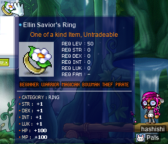
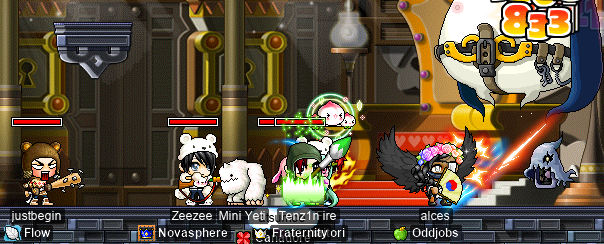
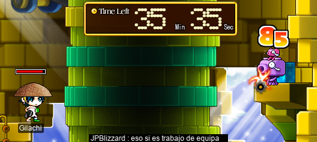
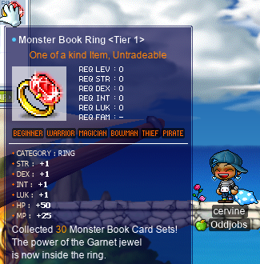

# rangifer’s diary: pt. xlv

## R>1 mixed attacker for King Sage Cat run

In the previous installment of this series (which is part of the previous diary entry), we took a look at odd-jobbed mages:

- [STR mages](https://oddjobs.codeberg.page/odd-jobs.html#str-mage)
- [DEX mages](https://oddjobs.codeberg.page/odd-jobs.html#dex-mage)
- [Permamagicians](https://oddjobs.codeberg.page/odd-jobs.html#permamagician)
- [Gishes](https://oddjobs.codeberg.page/odd-jobs.html#gish)
- [Gishlets](https://oddjobs.codeberg.page/odd-jobs.html#luk-gish)
- [Magelets](https://oddjobs.codeberg.page/odd-jobs.html#luk-mage)

And we were able to cover all of the above archetypes, with two exceptions: the gish and the gishlet. We skipped these two because they are the “mixed attackers” of the bunch; “mixed attacker” meaning one who attacks both with physical attacks _and_ with magical spells. As mentioned in the previous installment, mixed attacker jobs are extraordinarily complex; they prove to be more difficult to plan, build, and equip than perhaps any other job (odd or not) in the entire game. This makes the treatment, in this context (and other contexts, for that matter…), of gishes and gishlets unusually difficult. To simplify things, we will only be looking at the melee damage output of these mixed attackers. The reason for this is that melee damage is inherently single-target for mages, whereas their magic damage is possibly multi-target. So for their melee to be useful, they will need to focus on making it their primary mode of dealing single-target DPS.

First, we will consider the gishlet (a.k.a. LUK gish). Right off the bat, we will assume a “normal” gishlet build, which is DEXless; gishlets are INTless by definition, but not _necessarily_ DEXless. This still leaves the issue of how much AP is going into STR vs. going into LUK, and the issue of what equipment our gishlet is using. To solve these problems straightforwardly and simply, we will first assume that our gishlet model wants to be capable of successfully hitting a 35 AVOID monster 100% of the time, given that the monster is at or below their level. 35 AVOID is chosen because, while this _is_ somewhat lower than the AVOID of some monsters that the gishlet may want to train on (for example, [Latest Hits Compilations](https://maplelegends.com/lib/monster?id=9410030) have 35 AVOID, but [Greatest Oldies](https://maplelegends.com/lib/monster?id=9410031) have 40, so they will “**MISS**” the Greatest Oldies sometimes), it’s a reasonable bar to set for the gishlet while still retaining solid melee damage. Mixed attackers are generally limited by their MACC rather than their WACC, so we will just look at how much INT & LUK the gishlet needs to achieve this MACC goal, and assume that they will end up with enough WACC along the way (remember that LUK contributes to both MACC and WACC):

> effectiveMacc := (⌊INT ÷ 10⌋ + ⌊LUK ÷ 10⌋) ÷ (AVOID + 1) ⋅ (1 + 0.0415 ⋅ δ)

Above, we have the formula for calculating effective MACC, due to **Technolink**’s post, which was probably posted around late 2007/early 2008, and reposted by **Russt**, then reposted on **AyumiLove**’s blog [here](https://ayumilovemaple.wordpress.com/2009/09/06/maplestory-formula-compilation/). Technolink attributes this formula to **Thikket** and **Nekonecat**. The lowercase delta (“δ”) represents the difference in level between the monster and the player-character, to a minimum of zero. Because we assume the monster to be at or below the gishlet’s level, δ = 0, so we can simplify:

> effectiveMacc := (⌊INT ÷ 10⌋ + ⌊LUK ÷ 10⌋) ÷ (AVOID + 1)

And we want an AVOID of 35, so:

> effectiveMacc := (⌊INT ÷ 10⌋ + ⌊LUK ÷ 10⌋) ÷ 36

And we will treat ⌊INT ÷ 10⌋ + ⌊LUK ÷ 10⌋ as its own quantity, called intluk:

> effectiveMacc := intluk ÷ 36

And, Thikket & Nekonecat’s work defines the probability of hitting using a formula derived from [quadratic regression](https://en.wikipedia.org/wiki/Polynomial_regression):

> P(magicHit) = −2.5795 ⋅ effectiveMacc² + 5.2343 ⋅ effectiveMacc − 1.6749

Which unfortunately (or, fortunately, if you’re into it) means that we have to do some non-trivial algebra. Thankfully, the [quadratic formula](https://en.wikipedia.org/wiki/Quadratic_formula) will be doing almost all of the work here:

> 1 = −2.5795 ⋅ effectiveMacc² + 5.2343 ⋅ effectiveMacc − 1.6749
>
> 0 = −2.5795 ⋅ effectiveMacc² + 5.2343 ⋅ effectiveMacc − 2.6749

At which point, we can plug this into the quadratic formula: _a_ = −2.5795, _b_ = 5.2343, _c_ = −2.6749. Long story short, this does not produce any [real](https://en.wikipedia.org/wiki/Real_number) solutions (*b*² - 4*ac* is a negative quantity), which would seem to imply that a 100% hit-rate is impossible. In fact, the best that we can do is a hit-rate of ≈98.045% or so, which is considerably lower than most of the magical hit-rates that we observe in practice (because in practice, we often can observe hit-rates that are either 100%, or at least _extremely_ close to 100%). So it seems that our fancy-dancey quadratic regression result from 2007 is, at best, a vague approximation. This is not the place to discuss what the _actual_ magical hit-rate formula is, and we are already much too far [into the weeds](https://en.wiktionary.org/wiki/in_the_weeds), so we are going to just take what we can get from this formula, by aiming for a hit-rate of ≈98.045% instead of 100%. Because our [discriminant](https://en.wikipedia.org/wiki/Discriminant) is thus zero (and the [square root](https://en.wikipedia.org/wiki/Square_root) of zero is zero), the quadratic formula simplifies considerably:

> −*b* ÷ (2*a*)
>
> −5.2343 ÷ (2 ⋅ −2.5795)
>
> 1.0145958519092848

So the `effectiveMacc` value that we are shooting for is roughly ≈1.0145958519092848. So now we know how much `intluk` we want:

> effectiveMacc = intluk ÷ 36
>
> 1.0145958519092848 = intluk ÷ 36
>
> intluk = 36.52545066873425

But intluk is always an integer, so we have to take the [ceiling](https://en.wikipedia.org/wiki/Floor_and_ceiling_functions) of this quantity to get `intluk` = 37. This means that if, for example, the total INT of the gishlet were 100 (which would mean 80 INT from gear, which is reasonable if the gishlet is in full magic mode), we would need a total LUK of at least 270. This would really chew into the gishlet’s damage, because this implies a base LUK that is quite high, and thus a base STR that suffers. Based on this **total** LUK figure of (very) roughly ≈270, I want to just be generous and set the base LUK at 200. Some of this ≈70 LUK gap is obviously made up by gear, but the rest of it can be lost, and the gishlet can just deal with a subpar (by normal mage standards) hit-rate with magic.

For our gish, we will make similar assumptions; in particular, we only care about their melee damage. Gishes are actually somewhat more complex, even compared to gishlets, but thankfully we already have a calculator dedicated to a problem like this: the Oddjobs [Gish AP Calculator](https://oddjobs.codeberg.page/gish-ap-calc/). This software is by no means beta-, or even alpha-, quality software, and in fact it uses the same shitty quadratically-regressed magical hit-rate formula exposited above, but it will just have to do. Ultimately, I’m just getting tired of all this wacky mixed-attacker stuff, and any model that we decide on will always have way more asterisks attached to it than any other model.

So we start our base stats at the minimum for a magician: 4/4/20/4. I asked **GishGallop** (**Cortical**, **Phoneme**, **dendrite**, **WizetWizard**, **Medulla**, **Amygdala**), an I/L gish who is our resident gish expert, about what gear that they use on their actual gish. GishGallop is not as high of a level as our models here (our models here being roughly level 100), but the equipment is still representative. Here are the raw, unbuffed stats granted by GishGallop’s gear:

- STR: 38
- DEX: 30
- INT: 24
- LUK: 57
- WACC: 59
- WATK: 120
- MATK: 88

And we assume the use of [Sniper Pills](https://maplelegends.com/lib/use?id=2002008), [Ciders](https://maplelegends.com/lib/use?id=2022002), and maxed [Meditation](https://maplelegends.com/lib/skill?id=2201001), so the above WACC value becomes 69, the WATK becomes 140, and the MATK becomes 108. We have been assuming, for our other models, that each model has 517 base AP on top of the absolute minimum stats of 4/4/4/4. Because we are starting at 16 total stats higher than this, at 4/4/20/4, we will have 517 − 16 = 501 AP remaining. The weapon being used is a [Black Umbrella](https://maplelegends.com/lib/equip?id=01302026), which is a speed 5 one-handed sword (also note that using a sword precludes the use of [Spell Booster](https://maplelegends.com/lib/skill?id=2211005)). And we are assuming maxed [Ice Strike](https://maplelegends.com/lib/skill?id=2211002) and [Element Amplification](https://maplelegends.com/lib/skill?id=2210001). As usual, the monster has 600 WDEF and 600 MDEF, and as above, the monster has 35 AVOID. Then we only have to consider the “`wDominanceFactor`” (or “swagnitude”, as GishGallop likes to call it), which, simply put, determines roughly by what factor we want our single-target melee DPS to dominate our single-target magical DPS. We will leave this at the default value of 2.

For simplicity and some fairness, we will give the same weapon + shield combo to oour gishlet that we gave to our gish, so their total WATK, and attack speed values, and PSMs (primary stat multipliers), will be identical.

Please notice the _truly incredible_ number of assumptions that are baked into our gish (and gishlet) models (including, for example, the assumption that the gish is an I/L). With that in mind, let’s take a look at our models:

### The model gishlet

- 373 STR (60 of which is from gear)
- 49 DEX (45 of which is from gear)
- 200 + `x` LUK (`x` of which is from gear)
- 140 WATK

### The model gish

- 369 STR (38 of which is from gear)
- 34 DEX (30 of which is from gear)
- 209 INT (24 of which is from gear)
- 70 LUK (57 of which is from gear)
- 140 WATK

### Oops!

So, I’m only realising just now that these two separate models are unfair. And in any case, it just turns out that gish and gishlet are _just about identical_ for the purposes of our analysis here, since we don’t even consider their magic-casting abilities (amongst other things). So I want to just use the gishlet model above and be done with it.

### Comparing single-target DPS

As usual, we assume that all player characters and monsters have the same level. And, as in the “R>1 pog ranged for…” series, we will use 600 WDEF & 600 MDEF to reasonably represent a low- or mid-level boss monster.

| model             |    DPS |
| :---------------- | -----: |
| Gish(let) (melee) | 1238.3 |

So there’s nothing to compare yet, _per se_, as we ended up with just one (1) model after all of this effort. So we want to compare these figures to the figures calculated in the previous series, and in previous installations of this series. I’ve added some class-based (class as in: beginner, warrior, mage, archer, rogue, pirate) emojis to the “model” column to add some readability to this now quite lengthy table (N.B. some or none of these emojis may show up if you are viewing this on the MapleLegends forums, for some reason(‽)):

| model                                         |     DPS |
| :-------------------------------------------- | ------: |
| ⚔️ dagger warrior                             | 14828.4 |
| 🥷 STRmit (SM)                                 | 13807.5 |
| ⚔️ DEX WK (fire weak)                         | 11856.8 |
| ⚔️ DEXsader                                   | 10729.0 |
| ⚔️ DEX WK (lightning weak)                    |  9977.1 |
| ⚔️ wand warrior                               |  9446.7 |
| ⚔️ DEX WK (ice weak)                          |  8097.5 |
| 🥷 Permarogue                                  |  7658.0 |
| ⚔️ DEX WK (fire neutral)                      |  7470.9 |
| 🏹 Wood(wo)man (bow)                          |  6725.3 |
| 🏹 Wood(wo)man (xbow)                         |  6690.6 |
| 🏴‍☠️ Permapirate                                |  6669.1 |
| 🏴‍☠️ Swashbuckler (yes Octo)                    |  6598.6 |
| ⚔️ DEX WK (lightning neutral)                 |  6217.8 |
| ⚔️ permawarrior                               |  5934.0 |
| 🏴‍☠️ Swashbuckler (no Octo)                     |  5614.4 |
| 🏹 Permarcher                                 |  5614.0 |
| ⚔️ DEXgon knight                              |  5054.7 |
| 🧙 Magelet (F/P Ele Comp; weak)               |  4520.7 |
| ⚔️ LUK WK (fire weak)                         |  4353.5 |
| 🧙 Magelet (I/L Ele Comp; weak)               |  4192.2 |
| 🧙 Magelet (Fire Arrow; weak)                 |  3976.9 |
| ⚔️ LUKsader                                   |  3868.9 |
| ⚔️ LUK WK (lightning weak)                    |  3545.8 |
| 🧙 Permamagician                              |  3307.3 |
| 🧙 Magelet (F/P Ele Comp; neutral)            |  2877.8 |
| 🧙 Magelet (Heal; 1 non-self target)          |  2853.7 |
| ⚔️ LUK WK (ice weak)                          |  2738.0 |
| 🧙 Magelet (I/L Ele Comp; neutral)            |  2658.8 |
| 🧙 Magelet (Fire Arrow; neutral)              |  2498.2 |
| ⚔️ LUK WK (fire neutral)                      |  2468.8 |
| 🔰 Generic STR whacker                        |  2227.8 |
| ⚔️ LUK WK (lightning neutral)                 |  1930.3 |
| ⚔️ LUK DK                                     |  1350.2 |
| 🔰 Wandginner                                 |  1308.7 |
| 🧙 Gish(let) (melee)                          |  1238.3 |
| 🧙 Magelet (SR; weak)                         |  1206.1 |
| 🔰 Generic DEX whacker                        |   966.0 |
| 🔰 Generic claw-wielding non-rogue            |   841.5 |
| 🧙 Magelet (SR; neutral)                      |   699.2 |
| 🧙 Magelet (priest/permamagician; Magic Claw) |   234.4 |

So, I realise that after all of this work, and confusion, it’s quite underwhelming to end up with a single dainty number. But hopefully, this goes to show a little bit of the incredible complexity of mixed-attacker jobs, and also goes to show just how limited the kind of analysis that we’re doing here is. As perhaps expected, the gish(let) deals more than half of the DPS of the generic STR whacker, but not too much more. This reflects the AP distribution shifting somewhat away from STR in favour of LUK & INT.

**_IMPORTANT REMINDERS BEFORE ANYONE GOES AROUND TOUTING THESE NUMERIC FIGURES:_** Keep in mind (and I cannot stress this enough) that this is a purely one-dimensional — and somewhat shoddy — analysis using dummy models, _and_ that jobs cannot be reduced to raw single-target DPS numbers. The odd jobs that are listed above differ quite a bit in their playstyles and range of abilities. Furthermore, this only considers characters that are roughly level 100. Furthermore, gish(let)s are far too complex for their own good, and should be handled with extreme caution…

## hashishi finishes up the Ellin Forest questline

I promised to finish up the quests to get my [besinner](https://oddjobs.codeberg.page/odd-jobs.html#besinner), **hashishi**, her [Ellin ring](https://maplelegends.com/lib/equip?id=01119001) in the previous diary entry. And so, promptly, that was exactly what I (painstakingly) did:

Killing all of the [Primitive Boars](https://maplelegends.com/lib/monster?id=5250002) required for the quest proved to be quite the challenge, as they are quite fast (speed of −20) and I only very rarely knock them back (knockback of 500). So, being ranged-but-actually-not-ranged really bit me in the ass here:

But I was able to kill them, albeit slowly:

And finished the questline! Yay ring!!:

## hashishi tries out OPQ for the first time

**Redz** (**Permanovice**, **Hanger**) needed some help getting an [OPQ](https://maplelegends.com/lib/map?id=200080101) party together (in particular, he needed two more people), so I took my OPQ mule, [**sets**](https://codeberg.org/deer/gists/src/branch/master/pq_mules.md), as well as one more of my characters. The only other character that I had in level range was hashishi, so I supposed that it was time for hashishi to try out OPQ~

And thankfully, I had quite enough HP for [Papa Pixie](https://maplelegends.com/lib/monster?id=9300039) to not be capable of one-shotting me (although he can two-shot me with ease):

And we found out that despite using [a claw](https://maplelegends.com/lib/equip?id=01472088) as her main weapon, and using it to throw [stars](https://maplelegends.com/lib/use?id=2070006), hashishi seems to lack [Haste](https://maplelegends.com/lib/skill?id=4101004) entirely! How strange…

Too bad [Nimble Feet](https://maplelegends.com/lib/skill?id=0001002) isn’t a party buff!

## More LPQing with alces~

You may know **alces**, my undead [daggerlord](https://oddjobs.codeberg.page/odd-jobs.html#dagger-assassin). Well, she has been back at it again with the [LPQ](https://maplelegends.com/lib/map?id=221024500)s. This time, with **justbegin**, a [STRginner](https://oddjobs.codeberg.page/odd-jobs.html#permabeginner) of **Flow** (and now of **GangGang**):

And I did a few LPQs with **Gilachi** and some other hispanophone party members; Gilachi is an assassin who only wields a claw, so when we went off to our first run, I assumed that she could serve as range for our party (as she didn’t specify otherwise). Unfortunately for us, it turned out that Gilachi was very heavily HP [washing](https://maplelegends.com/lib/cash?id=5050000), and so when we did come to stage 7, she was hitting for two (2) damage per [L7](https://maplelegends.com/lib/skill?id=4001344) (1 damage per line)…

We struggled with it for a while, but once I gave her some of my [Ciders](https://maplelegends.com/lib/use?id=2022002) and [Sniper Pills](https://maplelegends.com/lib/use?id=2002008), as well as almost all of my equipment(!), she was able to hit for roughly 150~200 damage per L7! This was doable enough that we did finish our first LPQ, even if we lost one along the way (who left after seeing that Gilachi did no damage in stage 7):

Our following PQs featured **Wamu**, an LPQ mule who did more than enough to fill in the range gap in our party.

Oh, and I got to do a few LPQs with fellow **Oddjobs** member **attackattack**, the [DEX page](https://oddjobs.codeberg.page/odd-jobs.html#dex-warrior)!:

<3

## Getting ready to do some CWK crafting!

I’ve been thinking about doing some CWK (Crimson Wood Keep) crafting for a while now, particularly to start crafting myself some [Crimson Arcglaives](https://maplelegends.com/lib/equip?id=01442068), but also for some other assorted reasons. The Arcglaive is particularly valuable for my [STR priest](https://oddjobs.codeberg.page/odd-jobs.html#str-mage), **cervid**, as I can even make use of the MATK that it provides, and it’s also a premier endgame weapon for not just cervid, but also my [woodwoman](https://oddjobs.codeberg.page/odd-jobs.html#woodsman) **capreolina**, and even my [brigand](https://oddjobs.codeberg.page/odd-jobs.html#brigand), **dama**.

capreolina had already done a number of the CWK quests before, mostly to get access to [Mo](https://maplelegends.com/lib/npc?id=9201099)’s shop, so my starting point was completing [The Brewing Storm](https://bbb.hidden-street.net/quest/masteria/the-brewing-storm):

While you do only need to get 10 of [their ETC items](https://maplelegends.com/lib/etc?id=4032006) for this quest, [Stormbreakers](https://maplelegends.com/lib/monster?id=9400581) spawn so sparsely on the maps that they spawn on, and have such a low drop-rate for their badges, that this quest took me quite a while. But I was busy collecting [Windraider Badges](https://maplelegends.com/lib/etc?id=4032007) and, of course, [Crimson Wood](https://maplelegends.com/lib/etc?id=4032004) in the meantime, so it wasn’t too bad.

I also wanted to complete [Storming the Castle](https://bbb.hidden-street.net/quest/masteria/storming-the-castle), so I did most of the kills required for that quest over at [tPoS](https://maplelegends.com/lib/map?id=610020003) (which is the other map that spawns [Crimson Trees](https://maplelegends.com/lib/monster?id=9400586), aside from the more popular [Lower Ascent](https://maplelegends.com/lib/map?id=610020002)):

And I even completed [Mark of Heroism](https://bbb.hidden-street.net/quest/masteria/mark-of-heroism) as well, which proved to be a lot more annoying than I expected, as I had never farmed for [Typhon Feathers](https://maplelegends.com/lib/etc?id=4032005) before. But being able to skip the JQ that leads to CWM (Crimson Wood Mountains) is very convenient, and saves me the trouble of dying in the JQ, using [TP rocks](https://maplelegends.com/lib/cash?id=5041000), and/or [door](https://maplelegends.com/lib/skill?id=2311002)ing myself via cervid.

In order to do crafting, though, I also had to complete [The Fallen Warriors](https://bbb.hidden-street.net/quest/masteria/the-fallen-warriors). I had a smol number of [Elder Ashes](https://maplelegends.com/lib/etc?id=4032010) already on hand, but I was not about to farm the rest of the 50 myself, so I bought the rest on the [FM](https://maplelegends.com/lib/map?id=910000000) :P

And by the end of all of this, I had _just_ enough Windraider Badges to turn in for a raffle prize. So I turned them in and got…:

A very sad [Black Mamba](https://maplelegends.com/lib/equip?id=01472031) that is 3 WATK below average. Oh well. On the bright side, I had collected some 120(!) or so Crimson Woods ni my travels, so that’s all going towards my first Arcglaive craft!

## M0AR card-hunting with capre

Yup yup. More card-hunting with **capreolina**, my [woodwoman](https://oddjobs.codeberg.page/odd-jobs.html#woodsman) ranger!:

CARDS!

With the [Rooster](https://maplelegends.com/lib/monster?id=9600001) set finished, I was done with [Shanghai](https://maplelegends.com/lib/map?id=701000000), and so it was off to the Nihal Desert in search of even m0ar cardz:

 card get!")

And that was enough to get capre her [T5 ring](https://maplelegends.com/lib/equip?id=01119007)!!:

Yeyy~~

OK, back to work :P

MORE CARDS!

I did not finish the [Homunscullo](https://maplelegends.com/lib/monster?id=8110300) set, as I apparently don’t hate myself quite that much.

And with the [Homun](https://maplelegends.com/lib/monster?id=6110300) set finished, all that was left for me in the Nihal Desert was Homunscullo (yeah, no), [Kimera](https://maplelegends.com/lib/monster?id=8220002) (more respawn timers, also gross), [Deo](https://maplelegends.com/lib/monster?id=3220001) (Deo is on a respawn timer and is necessary for a quest, so I won’t grief any questers by trying to complete that set), [D. Roy](https://maplelegends.com/lib/monster?id=7110300) (more gross respawn timers), and [Security Camera](https://maplelegends.com/lib/monster?id=7090000) (you guessed it: even more nasty respawn timers). So it was time to move on to [Singapore](https://maplelegends.com/lib/map?id=540000000):

Yay for cute dark-coloured blobs~!

## Going to Japan with Cortical

**Cortical** (**GishGallop**, **Phoneme**, **WizetWizard**, **Medulla**, **dendrite**, **Amygdala**) was trying to farm cards from some monsters in Japan. After finding out that [Nightghost](https://maplelegends.com/lib/monster?id=9400003) cards are far more difficult than the early 2/5 lead Cort to believe, they asked for my help, so I headed over there on my [DEXgon knight](https://oddjobs.codeberg.page/odd-jobs.html#dex-warrior), **rusa**:

Indeed, even with rusa’s [incredible](https://maplelegends.com/lib/skill?id=1311006) mobbing [skills](https://maplelegends.com/lib/skill?id=1311004), the Nightghosts proved reluctant to drop even a single card. But eventually, after being joined by **Copo** (**Celim**, **Fino**, **Sommer**), a [permapirate](https://oddjobs.codeberg.page/odd-jobs.html#permapirate) of **Oddjobs**, we managed to make the Nightghosts break:

I didn’t loot this card, of course, it made the fifth in Cortical’s collection. With that all done, and with a bunch of ETC items turned into [Faito](https://maplelegends.com/lib/npc?id=9120010)’s exchange quest (in exchange for a bunch of useless garbage), we hung around Japan a little more. I tried my hand at hunting some [Male Boss](https://maplelegends.com/lib/monster?id=9400120)es, mostly in a vain attempt to get [Black Umbrellas](https://maplelegends.com/lib/equip?id=1302026) and/or [Japanese Maps](https://maplelegends.com/lib/equip?id=1402013), but ended up not getting anything other than [cards](https://maplelegends.com/lib/use?id=2386019). The drop rate was high enough, though, that I went from 0/5 to 5/5 very quickly!:

Nice~

## More PPQing with allies

Me, **mae** (**drainer**, **xX17Xx**, **attackattack**, **maebee**, **strainer**), **Celim** (**Copo**, **Fino**, **Sommer**), and **Cortical** (**GishGallop**, **Phoneme**, **WizetWizard**, **Medulla**, **dendrite**, **Amygdala**) were all online at the same time, and we decided that we wanted to do something all together. After some deliberation, we decided that Celim really likes [PPQ](https://maplelegends.com/lib/map?id=251010404), and the rest of us… were at least willing to tolerate a few runs, so we headed over to Herb Town to do some PPQs together:

As you can see in the above image, it was:

- Me, as my [swashbuckler](https://oddjobs.codeberg.page/odd-jobs.html#swashbuckler), **hydropotina**.
- Cort, as their I/L [gish](https://oddjobs.codeberg.page/odd-jobs.html#gish), **GishGallop**.
- mae, as her [permarogue](https://oddjobs.codeberg.page/odd-jobs.html#permarogue), **xX17Xx**.
- Celo, as his [STRginner](https://oddjobs.codeberg.page/odd-jobs.html#permabeginner), **Celim**.

And here we are, with me now in ranged-pew-pew mode, kicking the [Lord Pirate](https://maplelegends.com/lib/monster?id=9300119)’s ass:

And, by the end of is, Celim was inspired by seeing hydropotina in action enough that he set out to make his own swashbuckler (actually a kind of swashbuckler/[punch slinger](https://oddjobs.codeberg.page/odd-jobs.html#punch-slinger) hybrid), **Sommer**!

## capre hits level 114!!

Oh, and I did some sadgrinding [at CDs](https://maplelegends.com/lib/map?id=742010203) because of GM boofs. In the process, I managed to get capreolina to level up to 114!!:

Wow~ Now cervid and capreolina are both 114! But I expect cervid to pull ahead a bit, now that I am focussing on doing more grinding as her.

## cervine starts cleaning up her act

So, my I/L [magelet](https://oddjobs.codeberg.page/odd-jobs.html#luk-mage) **cervine** has felt somewhat neglected as of late, since I haven’t been playing her very often, and most recently I pretty much was just grinding as her. So, besides now being level 105, which is definitely too high-level for a magelet, I want to clean up her act. She is still lugging around that [T0 ring](https://maplelegends.com/lib/equip?id=01119002), has a lot of quests that she needs to get under her belt, and I even want to use her to farm [Crimson Wood](https://maplelegends.com/lib/etc?id=4032004), owing to her nice mobbing abilities and ability to [Teleport](https://maplelegends.com/lib/skill?id=2201002).

So, first things first, it was time to get rid of that T0 ring once and for all:

cervine on her first concerted effort to hunt for cards~

[Crimson Balrogs](https://maplelegends.com/lib/monster?id=8150000) are no match for my [Element Composition](https://maplelegends.com/lib/skill?id=2211006)!! (I didn’t actually finish this set, just got 1/5 on the way back to Victoia Island.)

[Pig](https://maplelegends.com/lib/monster?id=1210100) cards are always frustrating, considering that their card drop rate seems to be some 4 or so times lower than that of the [Ribbon Pig](https://maplelegends.com/lib/monster?id=1210101)…

I (thankfully!) got quite lucky with the [Jr. Necki](https://maplelegends.com/lib/monster?id=2130103) cards here, and finished the set even before I finished the [Octopus](https://maplelegends.com/lib/monster?id=1120100) set.

**Cortical**’s baby [dagger warrior](https://oddjobs.codeberg.page/odd-jobs.html#dagger-warrior), **Medulla**, came to harass — I mean, accompany, me on my quest:

I didn’t finish the [Shade](https://maplelegends.com/lib/monster?id=5090000) card set, I was just there killing Shades because Medulla told me to!!

And I got cervine her [first Monster Book ring](https://maplelegends.com/lib/equip?id=01119003)! Yey~:

:)
