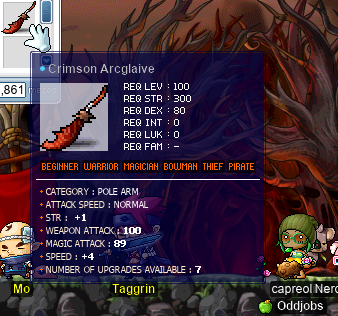

# rangifer’s diary: pt. xlvi

## R>1 toxophilite for ZMM run

In the previous installment of this series (which is part of the previous diary entry), we finished up looking at odd-jobbed mages. With that, we can now move on to the archers of the bunch! We’ve actually already covered most of the bases here. In particular, we already went over the following models:

- [Permarcher](https://oddjobs.codeberg.page/odd-jobs.html#permarcher)
- [Wood(wo)man](https://oddjobs.codeberg.page/odd-jobs.html#woodsman) (bow)
- Wood(wo)man (xbow)
- Generic STR whacker

The latter of which represents the wood(wo)man in melee. But this still leaves us with the following yet to be covered:

- [Bow-whacker](https://oddjobs.codeberg.page/odd-jobs.html#bow-whacker)
- [Bowginner](https://oddjobs.codeberg.page/odd-jobs.html#bowginner)

When it comes to equipping our models, they will look rather similar to the permarcher model; like the permarcher, bow-whackers and bowginners lack stat constraints, so they can wear basically any jobbed gear. Bowginners can only basic-attack with their bow, but are at least allowed to use arrows/quarrels, so the considerations that they have for weapon choice are basically the same as for the permarcher (in fact, the bowginner is just a restricted form of permarcher). As such, the bowginner model and permarcher model will have identical gear; in particular, we assume that they are using a crossbow. On the other hand, bow-whackers’ methods of combat are a bit more exotic, so it’s not immediately clear whether they should be using a bow, or a crossbow.

A simple look at [the damage formula](https://ayumilovemaple.wordpress.com/2009/09/06/maplestory-formula-compilation/) for [PKB](https://maplelegends.com/lib/skill?id=3101003) (the only attacking skill of bow-whackers) indicates that the PSM (primary stat multiplier) is the same _regardless of what type of weapon you use_. In particular, it’s 3.4, which is the ordinary PSM when using a bow (the PSM for crossbows is a more impressive 3.6). So it seems that this would give the advantage to bow-users, or at least make bow-users and crossbow-users break even. However, the particular weapons that we’re looking at ([Dark Nisrock](https://maplelegends.com/lib/equip?id=01452021) as a bow, [Dark Neschere](https://maplelegends.com/lib/equip?id=01462017) as a crossbow) are speed 6; with [booster](https://maplelegends.com/lib/skill?id=3201002), that’s speed 4. Speed 4 just so happens to be the only speed at which bows and crossbows have identical attack periods for standard attacks; at any other speed category, crossbows are slower (larger period). So the Dark Neschere is actually just better, with 3 extra WATK on average, and a slightly lower STR requirement as well.

With that in mind, let’s take a look at our models:

### The model bow-whacker

- 530 DEX (80 of which is from gear)
- 100 STR (25 of which is from gear)
- 143 WATK (110 from [crossbow](https://maplelegends.com/lib/equip?id=01462017) + 20 from [Cider](https://maplelegends.com/lib/use?id=2022002) + 3 from [cape](https://maplelegends.com/lib/equip?id=01102084) + 10 from gloves)

### The model bowginner

- 530 DEX (80 of which is from gear)
- 100 STR (25 of which is from gear)
- 148 WATK (110 from [crossbow](https://maplelegends.com/lib/equip?id=01462017) + 20 from [Cider](https://maplelegends.com/lib/use?id=2022002) + 3 from [cape](https://maplelegends.com/lib/equip?id=01102084) + 10 from gloves + 5 from [quarrels](https://maplelegends.com/lib/use?id=2061004))

### Comparing single-target DPS

As usual, we assume that all player characters and monsters have the same level. And, as in the “R>1 pog ranged for…” series, we will use 600 WDEF & 600 MDEF to reasonably represent a low- or mid-level boss monster. Our (x)bow-whacker is only using [PKB](https://maplelegends.com/lib/skill?id=3101003), and our (x)bowginner is only basic-attacking from a distance.

| model       |    DPS |
| :---------- | -----: |
| Bow-whacker | 2101.7 |
| Bowginner   | 1559.2 |

So, these two archer odd jobs don’t put out super impressive damage numbers, but their damage is at least respectable. It’s worth noting that the bow-whacker is not quite what it seems here: their attack has a 90% probability (per attack) of knocking the opponent back, as long as the opponent isn’t a boss monster, and it also hits up to 6 monsters at once. So, if you can get the hang of constantly pushing your enemies away from you, while simultaneously needing your enemies to be as close as possible to you so that you can hit them, the bow-whacker’s mobbing abilities are fairly impressive.

As usual, we want to compare these figures to the figures calculated in the previous series, and in previous installations of this series. I’ve added some class-based (class as in: beginner, warrior, mage, archer, rogue, pirate) emojis to the “model” column to add some readability to this now quite lengthy table (N.B. some or none of these emojis may show up if you are viewing this on the MapleLegends forums, for some reason(‽)):

| model                                         |     DPS |
| :-------------------------------------------- | ------: |
| ⚔️ Dagger warrior                             | 14828.4 |
| 🥷 STRmit (SM)                                 | 13807.5 |
| ⚔️ DEX WK (fire weak)                         | 11856.8 |
| ⚔️ DEXsader                                   | 10729.0 |
| ⚔️ DEX WK (lightning weak)                    |  9977.1 |
| ⚔️ Wand warrior                               |  9446.7 |
| ⚔️ DEX WK (ice weak)                          |  8097.5 |
| 🥷 Permarogue                                  |  7658.0 |
| ⚔️ DEX WK (fire neutral)                      |  7470.9 |
| 🏹 Wood(wo)man (bow)                          |  6725.3 |
| 🏹 Wood(wo)man (xbow)                         |  6690.6 |
| 🏴‍☠️ Permapirate                                |  6669.1 |
| 🏴‍☠️ Swashbuckler (yes Octo)                    |  6598.6 |
| ⚔️ DEX WK (lightning neutral)                 |  6217.8 |
| ⚔️ Permawarrior                               |  5934.0 |
| 🏴‍☠️ Swashbuckler (no Octo)                     |  5614.4 |
| 🏹 Permarcher                                 |  5614.0 |
| ⚔️ DEXgon knight                              |  5054.7 |
| 🧙 Magelet (F/P Ele Comp; weak)               |  4520.7 |
| ⚔️ LUK WK (fire weak)                         |  4353.5 |
| 🧙 Magelet (I/L Ele Comp; weak)               |  4192.2 |
| 🧙 Magelet (Fire Arrow; weak)                 |  3976.9 |
| ⚔️ LUKsader                                   |  3868.9 |
| ⚔️ LUK WK (lightning weak)                    |  3545.8 |
| 🧙 Permamagician                              |  3307.3 |
| 🧙 Magelet (F/P Ele Comp; neutral)            |  2877.8 |
| 🧙 Magelet (Heal; 1 non-self target)          |  2853.7 |
| ⚔️ LUK WK (ice weak)                          |  2738.0 |
| 🧙 Magelet (I/L Ele Comp; neutral)            |  2658.8 |
| 🧙 Magelet (Fire Arrow; neutral)              |  2498.2 |
| ⚔️ LUK WK (fire neutral)                      |  2468.8 |
| 🔰 Generic STR whacker                        |  2227.8 |
| 🏹 Bow-whacker                                |  2101.7 |
| ⚔️ LUK WK (lightning neutral)                 |  1930.3 |
| 🏹 Bowginner                                  |  1559.2 |
| ⚔️ LUK DK                                     |  1350.2 |
| 🔰 Wandginner                                 |  1308.7 |
| 🧙 Gish(let) (melee)                          |  1238.3 |
| 🧙 Magelet (SR; weak)                         |  1206.1 |
| 🔰 Generic DEX whacker                        |   966.0 |
| 🔰 Generic claw-wielding non-rogue            |   841.5 |
| 🧙 Magelet (SR; neutral)                      |   699.2 |
| 🧙 Magelet (priest/permamagician; Magic Claw) |   234.4 |

Perhaps the most interesting thing here is to compare the bowginner to the generic STR whacker. The generic STR whacker represents a lot of different jobs, but its standard incarnation is as the [STRginner](https://oddjobs.codeberg.page/odd-jobs.html#str-beginner), which is also the standard incarnation of permabeginners in general. If the bowginner answers the question “What would archery-focussed permabeginners look like, if beginners could equip (cross)bows?”, then it seems that they pay a DPS price in exchange for their far-reaching attacks. But this is to be expected; weapons of archery just have characteristically lower PSMs than typical STRginner weapons (polearms, swords, daggers, etc.), somewhat lower WATK on average, and don’t make up for it with their attack periods. Comparing to the generic claw-wielding non-rogue (whose standard incarnation is also a permabeginner: the [besinner](https://oddjobs.codeberg.page/odd-jobs.html#besinner)) is also tempting, although unfair to the generic claw-wielding non-rogue, as they cannot equip claws with a useful amount of WATK. A better comparison would be to the [clawginner](https://oddjobs.codeberg.page/odd-jobs.html#clawginner), but we haven’t got there yet!

**_IMPORTANT REMINDERS BEFORE ANYONE GOES AROUND TOUTING THESE NUMERIC FIGURES:_** Keep in mind (and I cannot stress this enough) that this is a purely one-dimensional — and somewhat shoddy — analysis using dummy models, _and_ that jobs cannot be reduced to raw single-target DPS numbers. The odd jobs that are listed above differ quite a bit in their playstyles and range of abilities. Furthermore, this only considers characters that are roughly level 100.

## More LPQ with alces

I did some more [LPQ](https://maplelegends.com/lib/map?id=221024500)ing on my undead [daggerlord](https://oddjobs.codeberg.page/odd-jobs.html#dagger-assassin), **alces**. I’ve been trying to avoid gaining too much EXP (too much EXP, to the point where I’m forced to repeatedly [kermit sewer slide](https://en.wikipedia.org/wiki/Suicide)) while on my quest to complete the [Alishar](https://maplelegends.com/lib/monster?id=9300012) card set, and yet still get in 50 EPQs for the [Glittering Altaire Earrings](https://maplelegends.com/lib/equip?id=01032061). I started LPQing at the bottom of level 35, but still, I was 3/5 Alishar cards at this point! I did get in a party with **Easelbear**, **Souz**, **ConfuseTea**, and **WickedPriest**, where we got in some good PQs, and made sure to get the GM boofs that were announced mid-PQ:

And I think I noticed that GM [Haste](https://maplelegends.com/lib/skill?id=4101004) gives a +21 JUMP buff…? I suppose it makes sense that it’s more powerful than the +20 JUMP of ordinary Haste, although one extra JUMP is still not enough to hit max JUMP of 123%, if the recipient has no JUMP from their equipment! In any case, I didn’t get any cards from these runs, although they were otherwise lovely runs.

Some days later, I was able to form a party soon after GM boofs were given out; I went to channel 1 of [the 101st floor of the Eos Tower](https://maplelegends.com/lib/map?id=221024500) (the LPQ lobby) and was surprised to see exactly no one. I thought I must be in the wrong channel, as there wasn’t even a single AFKer! But, after just a bit of patience, some people filtered in, and brought along some friends with them. So I was able to lead a full party of six that, believe it or not, stayed as the same lineup throughout all of our LPQs, and then dissipated entirely after so many runs.

We had some good luck with the infamous [stage 8](https://maplelegends.com/lib/map?id=922010800) seemingly both times that **TeslaCalls** tried to leave the other five of us to complete the stage, so that he had a chance to pee. So, on a third time, having already relieved himself, he tried to trick [Blue Balloon](https://maplelegends.com/lib/npc?id=2040043) by claiming to take another bathroom break, unfortunately to no avail:

It seems that this only served to violate any trust Blue Balloon had in our party >w<

Heres the same crew, fighting Alishar for the umpteenth time, only for no cards to drop:

Our runs were actually totally dry; not a single card dropped, and furthermore, the only equipment/NX that I managed to get out of any of the [bonus stages](https://maplelegends.com/lib/map?id=922011000) was a single [RAC](https://maplelegends.com/lib/equip?id=01102002). But our runs were all very speedy — we even had a run that took us less than 10 minutes!!

Unfortunately, after all of these LPQs were said and done, I had a good bit more EXP (enough to get to level 46), but still was at 3/5 Alishar cards ;(

## capre does a lil more card-hunting~

As usual, I did some more card-hunting on my [woodswoman](https://oddjobs.codeberg.page/odd-jobs.html#woodsman), **capreolina**; I didnt go quite as far as usual this time, as I already managed to catch up to and pass **Cortical**’s (**GishGallop**, **Phoneme**, **dendrite**, **Cerebellum**, **Medulla**, **WizetWizard**, **Amygdala**) card set count. Now that I proved my point, I’ve mostly left Cortical to do their card farming while I farm [wood](https://maplelegends.com/lib/etc?id=4032004) :P

But I did finish the main [CBD](https://maplelegends.com/lib/map?id=540000000) and [Ghost Ship](https://maplelegends.com/lib/map?id=541010000) region’s cards, and started on a few [Orbis](https://maplelegends.com/lib/map?id=200000000) cards as well :)

A few more cardz 4 capre~

I was thankful to actually get a [GS2](https://maplelegends.com/lib/map?id=541010010) map to make the [Slimy](https://maplelegends.com/lib/monster?id=9420510) cards easier…:

And with the [Selkie Jr.](https://maplelegends.com/lib/monster?id=9420511) set completed, I was done with this subregion of Singapore (I had already finished the [Mr. Anchor](https://maplelegends.com/lib/monster?id=9420512) long ago)! So I went off to [Orbis](https://maplelegends.com/lib/map?id=200000000) to start the Orbis cards that aren’t in [the tower](https://maplelegends.com/lib/map?id=200080100):

## Helping out Gruzz with Deep Ludi farming

My friend **Gruzz**, an I/L mage who I met when doing [MPQ](https://maplelegends.com/lib/map?id=261000021) on my [DEXgon knight](https://oddjobs.codeberg.page/odd-jobs.html#dex-warrior) **rusa**, sent out a distress signal ­— he was trying to farm [MDT](https://maplelegends.com/lib/monster?id=7130300)s for [their ETCs](https://maplelegends.com/lib/etc?id=4000148) for use in the corresponding Vic(toria Island)/Ludi(brium) quests. But MDTs are, regrettably, strong versus both ice and lightning, which makes farming them particularly painful for an I/L like Gruzz.

I responded to their cry for help, heading to Deep Ludi as **capreolina**, my level 114 [woodswoman](https://oddjobs.codeberg.page/odd-jobs.html#woodsman) ranger. As should, perhaps, be expected, I wasn’t quite as much help as I would have liked — I realistically did no more damage to the MDTs than Gruzz did — but having some company when farming is always nice :)

And once we had enough of those Binding Bridles, we headed to [normal Death Teddies](https://maplelegends.com/lib/monster?id=7130010) to farm, for related purposes, [Sealed Teddy Bears](https://maplelegends.com/lib/etc?id=4000147). We were taking turns looting cards, and when I looted one of the Death Teddy ones, I was mildly surprised to see that that card brought me to 4/5 of the set. So Gruzz was kind enough to give me the next card that dropped after that, so that I could finish the set!:

<3

## cervine is back at CDs again for another 60 minute grind

When GM boofs were announced, I took them away into the Cash Shop with my I/L [magelet](https://oddjobs.codeberg.page/odd-jobs.html#magelet) **cervine**, while in the meantime I was [LPQ](https://maplelegends.com/lib/map?id=221024500)ing on **alces**. Once LPQing was all done, I headed back to playing cervine, taking a quick trip from [KC](https://maplelegends.com/lib/map?id=103000000) to [Taipei 101](https://maplelegends.com/lib/map?id=742000000) so that I could use the GM boofs to grind for ≈60 minutes at my usual spot: [CDs](https://maplelegends.com/lib/map?id=742010203).

A fairly impressive 4.5M EPH (experience per hour)~! I managed to get some ≈29% or so EXP over the course of this one-hour grish sesh, which hopefully means that cervine will be leveling up from 105 to 106 soon~ ^^

## EPQ with Timpossible and atsumoo

I met up with my friend **CreepyTimmy** (**Timpossible**, **SillyTimmy**) in [the FM](https://maplelegends.com/lib/map?id=910000000), and met his friend **atsumoo**, who was discussing card set completion of the [EPQ](https://maplelegends.com/lib/map?id=300030100) boss, Poison Golem (a.k.a. Big Bad Rock Man, or BBRM). After some chatting (and waiting for poor atsumoo’s router to reboot itself), we decided to do a few EPQs ourselves, with me playing my undead [daggerlord](https://oddjobs.codeberg.page/odd-jobs.html#dagger-assassin), **alces**, for the occasion:

And we got atsumoo her 5/5 BBRM card set! alces is still relatively strong enough at this point that I feel like a valuable contributor to my party — especially when everyone else is a cleric — and these PQs served as my first dip into the 50 completions that I’ll need for [my earrings](https://maplelegends.com/lib/equip?id=01032061)~

I’m not a huge fan of EPQ myself (I would rank it lower than all of KPQ, LPQ, OPQ, and MPQ), but it’s still a decent PQ that I much prefer to, say, PPQ… So while I usually try to avoid it, the +2 allstat from the Glittering Altaire Earrings is _just too good_ for a daggerlord for me to pass up. STR and DEX contribute, relatively, a huge amount to my damage when compared even to ordinary bandits (who are already known for their affinity for allstat items), because daggerlords have 10% mastery for life; each point of LUK only contributes roughly ≈1.96 as much to my damage as each point of DEX (or each point of STR; STR & DEX are interchangeable in this particular context)! And if alces manages to get into the triple-digit levels, I will graduate from using DEXless daggers to using [big girl daggers](https://maplelegends.com/lib/equip?id=01332051), at which point the stats (STR, DEX, and LUK) from equipment become basically interchangeable (up to a point); for example, a point of DEX from equipment just frees up my base stats to add more base LUK. So earrings that already have 6(!) total stats when clean is kind of a big deal. Hopefully I have good luck/LUK when I do eventually throw five [60%](https://maplelegends.com/lib/use?id=2040321)s on the damn thing!

## My first Arcglaive

In my quest to upgrade my melee weaponry for my [STR priest](https://oddjobs.codeberg.page/odd-jobs.html#str-mage) **cervid**, my [woodswoman](https://oddjobs.codeberg.page/odd-jobs.html#woodsman) **capreolina**, and even possibly my [brigand](https://oddjobs.codeberg.page/odd-jobs.html#brigand) **dama**, I have boomed/ruined many a [Toy of 101](https://maplelegends.com/lib/equip?id=01402038). In fact, at some point I just stopped recording my depressing results in this diary, because it became too embarrassing, and became like a pointless series of excercises in “deer booms yet another Toy of 101 on the first slot”. I wish I could say that I saw any hope, but I never really managed to pass any scrolls at all on the many Toys of 101 that I was very fortunate enough to get my hands on.

But, as discouraging as this may all be, I figure that there’s just no point in giving up. Sure, my current arsenal is nothing to sneeze at, but it’s also fairly mediocre in my eyes. Pretty much everyone else that I know has better weapons than I do, and for obvious reasons, I take weapons very seriously (perhaps the most serious) of all my equipment, as weapons even partly define my characters. This has lead me to turn to a different avenue: the [Crimson Arcglaive](https://maplelegends.com/lib/equip?id=01442068).

One of the wonderful things about the Arcglaive, besides it being one of the main contenders for endgame weaponry for STR-based whacker jobs, is that it also comes with a healthy amount of MATK. This makes it perhaps the perfect endgame weapon for a STR priest like mine, as it contributes a lot to my [Heal](https://maplelegends.com/lib/skill?id=2301002)’s efficacy, in addition to being an amazing offensive weapon. So, with that in mind, I set out to gather up as many [Crimson Woods](https://maplelegends.com/lib/etc?id=4032004) as I could.

I farmed quite a few woods myself, got a very generous donation of some leftover woods due to **OmokTeacher** (**Slime**, **Slimu**)!, bought a number of woods for 40k mesos each, including a large amount from **Cortical** (**GishGallop**, **Phoneme**, **dendrite**, **Cerebellum**, **Medulla**, **WizetWizard**, **Amygdala**), who generously agreed to sell all of their woods to me, and lo — I had enough already to craft a glaive! I want to thank those who donated woods to me, and also those who sold woods to me, as I greatly appreciate the extra supply of this already-scarce ETC item!!

After a bit of ETC-buying from the free market, and a bit of being annoyed by [Typhon Feather](https://maplelegends.com/lib/etc?id=4032005) farming, I came to [Fiona](https://maplelegends.com/lib/npc?id=9201095) for the fateful craft:

And there it was: my first Crimson Arcglaive that I’ve ever crafted myself:

…Aaaand it’s kinda crappy. The WATK is somewhat poor (2 below average), and in fact, the only thing that isn’t below average is the MATK, which is just average. But I transfered the weapon over to cervid for the purpose of scrolling, and with Cortical as my witness, I failed the first slot (with a [30%](https://maplelegends.com/lib/use?id=2044405)), passed the second slot (again with a 30%)!, and boomed on the third slot, again with a 30%. It was nice to have at least _some_ sign of hope (at least it seems possible for me to pass a 30% on Crimson Arcglaives, even if I can’t do the same with Toys of 101), but unfortunately I had to be a bit more greedy than just passing a single 30%. Having started with a crappy Arcglaive and then failed the first slot, one 30% pass was not going to cut it — my estimates put the target WATK at roughly 115~116 in order to simply _match_ the DPS of my current highest-DPS weapon (a 111 WATK, 4 STR, [PSB](https://maplelegends.com/lib/equip?id=01442057)).

So, oh well. Who knows how many crafts and how many months it will take to make a weapon that is worth ever equipping, but for now, my woodswoman will be doing what woodswomen do best: felling trees.

## The Grindening™

So, admittedly, most of what I’ve been doing now is, uh, grinding like mad. Historically, I’ve really never been all that good at grinding; aside from my somewhat poor character control, my main weakness is simply lack of willpower to mindlessly grind. But I have, over the months, done quite a bit of grinding on my [STR priest](https://oddjobs.codeberg.page/odd-jobs.html#str-mage), **cervid**. With her at level 114, the prospect of being a bona fide STR _bishop_ seems so tantalisingly close. To be honest, getting to level 120 feels virtually like getting to level 200 by the standards of a somewhat low-powered odd job like STR priest.

Fortunately, with my [DEXgon knight](https://oddjobs.codeberg.page/odd-jobs.html#dex-warrior) **rusa** being at the level where she has maxed [rawr](https://maplelegends.com/lib/skill?id=1311006), I now have the opportunity to do an extra-specially-sad version of sadgrinding (something that I like to call “sadsadgrinding”): duo grinding [at CDs](https://maplelegends.com/lib/map?id=742010203) with myself, by splitting my two characters across two [machine](https://en.wikipedia.org/wiki/Personal_computer)s. Now, I admit that I had a pretty rocky start with this technique, and I was very unsure whether it would be feasible or not; my character control when controlling a single character at a time is pretty poor, so controlling two simultaneously resulted in a lot of lost efficiency… and a lot of accidentally killing myself. But with the power of pet auto-HP (just to prevent deaths; [Heal](https://maplelegends.com/lib/skill?id=2301002) makes HP pots unnecessary _most_ of the time), some in-game macros to make rebuffing easier, and a lot of patience, I managed to get to a functional state where my sadsadgrinding became worth the effort:

Woo hoo! rusa is a big girl noww~! But this would only escalate, as I became more proficient in sadsadgrinding, and started grinding for longer and more ungodly durations — don’t worry, I make sure to take breaks regularly :) With rusa getting a higher EPH than cervid, and with rusa starting at a much lower level, rusa levels up much more frequently. In fact, as of this writing, rusa is already level 111!! Even with my damage being probably three or four times worse than a more ordinary STRgon knight, rawr is just so ridiculously OP that rusa gets pretty insane (by my standards; it’s probably not all _that_ impressive compared to ordinary third-jobbers at CDs) EPH anyways. So, somewhat ironically, lil baby rusa just might end up as my second character to hit level 120, heh…

To make my sadsadgrinding slightly less sad, I invited **xX17Xx** (**drainer**, **attackattack**, **maebee**, **strainer**), [permarogue](https://oddjobs.codeberg.page/odd-jobs.html#permarogue) of **Oddjobs**, to come try CD grinding with me:

With xX17Xx on the top platform, and with me on the bottom platform (also hitting the middle platform with rawr’s AoE), we ground for a while, and found that xX17Xx got pretty sweet EPH from it! Unfortunately, while the EXP was still OK for cervid & rusa, a permarogue simply doesn’t have the arsenal (read: mobbing attack(s)) to reach the levels of CD-annihilation efficiency of something like rawr, so my EXP suffered a bit just from the lost efficiency. But it’s nice to have some company sometimes when grinding, and **Cortical** even stopped by to say hi as well ^^

Although, as mentioned before, rusa has been leveling up quite a bit as a result of this sadsadgrinding, my focus is of course on cervid. It’s a testament to just how much I’ve forced myself to — I mean, wanted to — grind, that cervid has now just hit level 118(!):

…When cervid was just 114 as of the previous diary entry! I’m at the point now where it takes me, uh, quite a bit of grinding just to get, say, 10% of a level. And with the EXP curve creeping up on me, I have had to attenuate my daily EXP percentage goals, so that I’m not forcing myself to grind for truly unreasonable hours. But, well, at level 118, that’s only two more levels, right? :D

Time will tell if I end up doing another diary entry before cervid’s level-120/fourth-job-advancement party :) Oh, that reminds me, I have to figure out how the heck fourth job advancement even works…

<333333333333
