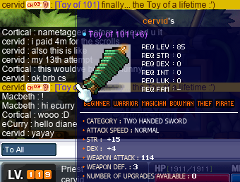
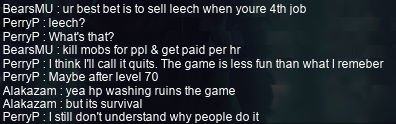
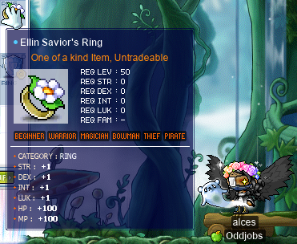
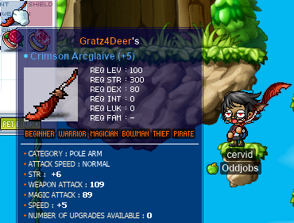

# rangifer’s diary: pt. xlvii

Alright, this is bound to be a big fat ol’ entry. Hopefully I can keep it to a reasonable length…

## R>1 vagrant for Old Fox run

In the previous installment of this series (which is part of the previous diary entry), we looked at the rest of the odd-jobbed archers. With that, we can now move on to the rogues of the bunch! We’ve already covered some of these previously. In particular, we already went over the following models:

- [STRmit](https://oddjobs.codeberg.page/odd-jobs.html#lukless-assassin) (SM)
- [Permarogue](https://oddjobs.codeberg.page/odd-jobs.html#permarogue)
- Generic STR whacker
- Generic DEX whacker

Where the “generic STR whacker” represents the [brigand](https://oddjobs.codeberg.page/odd-jobs.html#brigand) and STRmit in melee, and the “generic DEX whacker” represents the DEXmit (or even pure DEX brigand) in melee. But actually, the first two models here have misleading names. Our “STRmit” model only uses [Shadow Meso](https://maplelegends.com/lib/skill?id=4111004) (SM), so this model actually equally represents any LUKless hermit, not just STRmits. And our “permarogue” model only uses [Lucky Seven](https://maplelegends.com/lib/skill?id=4001344) (L7), meaning that it only represents half of the permarogue’s arsenal (the other half being [Double Stab](https://maplelegends.com/lib/skill?id=4001334)). So, it is now time that we must rename these models, to “LUKless hermit (SM)” and “permarogue (L7)”, respectively.

Nevertheless, this still leaves us with the following yet to be covered:

- LUKless hermit ([Avenger](https://maplelegends.com/lib/skill?id=4111005))
- [Daggerlord](https://oddjobs.codeberg.page/odd-jobs.html#dagger-assassin)
- [Grim reaper](https://oddjobs.codeberg.page/odd-jobs.html#grim-reaper)
- [Carpenter](https://oddjobs.codeberg.page/odd-jobs.html#carpenter)
- [Claw-puncher](https://oddjobs.codeberg.page/odd-jobs.html#claw-puncher)
- [LUKless dit](https://oddjobs.codeberg.page/odd-jobs.html#lukless-bandit)
- [Clawginner](https://oddjobs.codeberg.page/odd-jobs.html#clawginner)

We will be ignoring [blood dits](https://oddjobs.codeberg.page/odd-jobs.html#blood-bandit) entirely, because at this level (roughly level 100), their only real tool for dealing damage is [Meso Explosion](https://maplelegends.com/lib/skill?id=4211006). Our Double-Stab-using permarogue is represented by the daggerlord. And our claw-puncher model is a hermit.

You might wonder why we are adding a second model for the LUKless hermit — one that uses Avenger. After all, we are only studying single-target DPS here, and SM is obviously superior to Avenger in this respect. The reasons for adding an Avenger model are twofold:

1. LUKless hermits have extremely tight third-job SP requirements. Avenger, SM, and [Shadow Partner](https://maplelegends.com/lib/skill?id=4111002) all have a max level of 30, meaning that the LUKless hermit needs a whopping **90** third-job SP just to fill out their core arsenal; and that’s ignoring other very important skills like [FJ](https://maplelegends.com/lib/skill?id=4111006), [MU](https://maplelegends.com/lib/skill?id=4111001), etc. LUKless hermits can actually make efficient use of every single hermit skill (yes, even [SW](https://maplelegends.com/lib/skill?id=4111003)). As a result, only showing LUKless hermit damage under the assumption of max Shadow Partner and max SM could be somewhat misleading, depending on how exactly you interpret it.
2. Showing the LUKless hermit’s Avenger damage gives a more well-rounded picture of the STRmit. Avenger is unlike SM in that it takes into account LUK, WATK, STR, DEX, mastery, critical chance, and critical damage (all of which are ignored by SM). Furthermore, Avenger is the LUKless hermit’s only real mobbing skill, and thus their main skill when training.

With all that being said, we now have to equip our models.

Our LUKless hermit will be wearing LUK-focussed gear and using the most powerful claw available to LUKless rogues: the [Maple Skanda](https://maplelegends.com/lib/equip?id=01472055). We don’t really care whether they are a STRmit, a DEXmit, or something in between, because STR and DEX contribute equally to Avenger’s damage.

Our daggerlord/permarogue (Double Stab) model will be using a [GDK](https://maplelegends.com/lib/equip?id=01332051). Another reasonable option here would be the [Fan](https://maplelegends.com/lib/equip?id=01332030), as it is a full speed category faster than the GDK, and has less strenuous stat requirements. For the shield, we will assume the use of a [Khanjar](https://maplelegends.com/lib/equip?id=01092050) or similar, which gives a +7 WATK and +1 LUK advantage on average (when compared to a more ordinary shield like the [Pan Lid](https://maplelegends.com/lib/equip?id=01092008)). Our one-handed-weapon-wielding warriors were given a shield with 13 WATK and 10 STR, so we will give our Khanjar 20 WATK, 7 STR, and 1 LUK. The Khanjar has significant stat requirements, but we don’t really care, because they are strictly less strenuous than the GDK’s anyways.

Our grim reaper will, by definition, be using a [Scythe](https://maplelegends.com/lib/equip?id=01312002) (duh). It should be noted that this weapon is unavailable in MapleLegends, so in the context of ML, this model is purely theoretical. They will also need enough LUK (35 total) to equip the thing, but because our models are level 100 or so, we will assume that they can have a base LUK of roughly 4, and get roughly 31+ LUK from their gear. Otherwise, they are STR-focussed. Thanks to the Khanjar lacking any LUK requirements, their shield will actually be identical to that of the daggerlord model. Similar comments apply to the carpenter, which can only use the [Saw](https://maplelegends.com/lib/equip?id=01302001) (again, unavailable in MapleLegends), although the Saw is even simpler in that it lacks stat requirements.

Choosing a weapon for our claw-puncher is slightly more complicated. The obvious choice seems to be the [Red Craven](https://maplelegends.com/lib/equip?id=01472053) (this is the same weapon wielded by our L7-using permarogue model); however, the issue with the Red Craven is its extremely steep LUK requirement of 290. While this is not an issue for ordinary hermits, claw-punchers actually avoid LUK in favour of STR+DEX. On average, each point of LUK only contributes ≈55% as much to the claw-puncher’s damage as each point of DEX (or of STR). This actually makes the [Maple Skanda](https://maplelegends.com/lib/equip?id=01472055) a strong competitor to the Red Craven for our level ≈100 claw-puncher, but some very rough calculations indicate to me that they are basically tied at this point anyways, and at higher levels, using claws with LUK requirements would seem to dominate — you gain AP, but still need the same amount of LUK to wield your claw, thus exaggerating the WATK difference. So our claw-puncher will use the same exact weapon as our L7-using permarogue model.

Our LUKless dit will be equipped almost identically to our daggerlord model, thanks to the GDK and Khanjar both lacking LUK requirements. Mostly the AP build differs, with our LUKless dit preferring to pour AP into DEX when possible, as opposed to our daggerlord prefering LUK.

And finally, our clawginner, being a special type of claw-wielding permarogue, will be equipped identically to our L7-using permarogue model.

With all of that in mind, let’s take a look at our models:

### The model LUKless hermit (Avenger)

- 585 STR+DEX (60 of which is from gear)
- 64 LUK (60 of which is from gear)
- 105 WATK (45 from [claw](https://maplelegends.com/lib/equip?id=01472055) + 27 from [stars](https://maplelegends.com/lib/use?id=2070006) + 20 from [Cider](https://maplelegends.com/lib/use?id=2022002) + 3 from [cape](https://maplelegends.com/lib/equip?id=01102084) + 10 from gloves)

### The model daggerlord/permarogue (Double Stab)

Note that this model gets _somewhat_ juicier STR/DEX/LUK from its equipment, due to its access to jobbed clothing like e.g. the [Dark Pirate Skirt](https://maplelegends.com/lib/equip?id=01061106).

- 459 LUK (40 of which is from gear)
- 70 STR (40 of which is from gear)
- 140 DEX (60 of which is from gear)
- 160 WATK (107 from [dagger](https://maplelegends.com/lib/equip?id=01332051) + 20 from [shield](https://maplelegends.com/lib/equip?id=01092050) + 20 from [Cider](https://maplelegends.com/lib/use?id=2022002) + 3 from [cape](https://maplelegends.com/lib/equip?id=01102084) + 10 from gloves)

### The model grim reaper

- 555 STR (50 of which is from gear)
- 80 DEX (55 of which is from gear)
- 35 LUK (31 of which is from gear)
- 97 WATK (44 from [axe](https://maplelegends.com/lib/equip?id=01312002) + 20 from [shield](https://maplelegends.com/lib/equip?id=01092050) + 20 from [Cider](https://maplelegends.com/lib/use?id=2022002) + 3 from [cape](https://maplelegends.com/lib/equip?id=01102084) + 10 from gloves)

### The model carpenter

- 555 STR (50 of which is from gear)
- 80 DEX (55 of which is from gear)
- 92 WATK (39 from [sword](https://maplelegends.com/lib/equip?id=01302001) + 20 from [shield](https://maplelegends.com/lib/equip?id=01092050) + 20 from [Cider](https://maplelegends.com/lib/use?id=2022002) + 3 from [cape](https://maplelegends.com/lib/equip?id=01102084) + 10 from gloves)

### The model claw-puncher (hermit)

Like our daggerlord model, this model gets _somewhat_ juicier STR/DEX/LUK from its equipment, due to its access to jobbed clothing like e.g. the [Dark Pirate Skirt](https://maplelegends.com/lib/equip?id=01061106). Note that this is because we went the [Red Craven](https://maplelegends.com/lib/equip?id=01472053) route rather than the LUKless ([Maple Skanda](https://maplelegends.com/lib/equip?id=01472055)) route.

- 335 DEX (60 of which is from gear)
- 44 STR (40 of which is from gear)
- 290 LUK (40 of which is from gear)
- 91 WATK (58 from [claw](https://maplelegends.com/lib/equip?id=01472053) + 20 from [Cider](https://maplelegends.com/lib/use?id=2022002) + 3 from [cape](https://maplelegends.com/lib/equip?id=01102084) + 10 from gloves)

### The model LUKless dit

This model, unlike our daggerlord model, does not get access to jobbed clothing.

- 515 DEX (30 of which is from gear)
- 70 STR (30 of which is from gear)
- 64 LUK (60 of which is from gear)
- 160 WATK (107 from [dagger](https://maplelegends.com/lib/equip?id=01332051) + 20 from [shield](https://maplelegends.com/lib/equip?id=01092050) + 20 from [Cider](https://maplelegends.com/lib/use?id=2022002) + 3 from [cape](https://maplelegends.com/lib/equip?id=01102084) + 10 from gloves)

### The model clawginner

This model, in terms of stats/equipment is basically identical to the permarogue (L7) model from way back when.

- 490 LUK (25 of which is from gear)
- 140 DEX (80 of which is from gear)
- 29 STR (25 of which is from gear)
- 118 WATK (58 from [claw](https://maplelegends.com/lib/equip?id=01472053) + 20 from [Cider](https://maplelegends.com/lib/use?id=2022002) + 3 from [cape](https://maplelegends.com/lib/equip?id=01102084) + 10 from gloves + 27 from [stars](https://maplelegends.com/lib/use?id=2070006))

### Comparing single-target DPS

As usual, we assume that all player characters and monsters have the same level. And, as in the “R>1 pog ranged for…” series, we will use 600 WDEF & 600 MDEF to reasonably represent a low- or mid-level boss monster. Our grim reaper, carpenter, and claw-puncher are basic-attacking, our LUKless dit is using maxed [SB](https://maplelegends.com/lib/skill?id=4201005), and our clawginner is basic-attacking from a distance (with the power of [KE](https://maplelegends.com/lib/skill?id=4000001)!).

Oh, and speaking of attacking methods, our Avenger-using LUKless hermit needs to be mentioned here. Obviously, they will be using maxed [Avenger](https://maplelegends.com/lib/skill?id=4111005) with maxed [Shadow Partner](https://maplelegends.com/lib/skill?id=4111002). But this raises a few issues about WDEF. One is a mistake that I made way back in diary pt. iv, where I confused Avenger with [Assaulter](https://maplelegends.com/lib/skill?id=4211002), thus erroneously thinking that Avenger ignored defence any time the hermit’s level was at or above their target’s. And another is more subtle: is Shadow Partner’s damage multiplier (50% at max level, for any attack that isn’t a basic attack) a pre-defence multiplier, or a post-defence multiplier? Previously, I had assumed (noting that I had no way to prove one way or another) that it was pre-defence. However, I _now_ suspect that the reason why Shadow Partner’s damage multiplier differs based on whether or not the hermit is basic-attacking (80% for basic attacks, 50% for anything else) is because the multiplier is _post_-defence for skills (as skills have their own damage multipliers), but pre-defence for basic attacks (as there is no damage multiplier _per se_, so the multipler is applied directly to the minimum and maximum of the raw damage range). This would put basic attacks at a disadvantage that is compensated by the higher Shadow Partner damage multiplier. Also note that this means our previous DPS figure for “STRmit (SM)” (now “LUKless hermit (SM)”) would be incorrect; the updated value (14096.3 DPS) will be reflected in the table below this one:

| model                               |    DPS |
| :---------------------------------- | -----: |
| LUKless dit                         | 5928.2 |
| Daggerlord/permarogue (Double Stab) | 5223.5 |
| LUKless hermit (Avenger)            | 2575.5 |
| Clawginner                          | 1393.5 |
| Grim reaper                         | 1258.6 |
| Carpenter                           | 1210.7 |
| Claw-puncher (hermit)               |   88.2 |

Oh my. I mean, I knew that claw-punchers were abyssmal, but 88.2 DPS just looks truly sad. To the claw-puncher’s credit, most of the DPS is eaten up by the 600 WDEF; if the target has 0 WDEF instead, that figure shoots up by a factor of more than 6, to 543.6 DPS. Unsurprisingly, the grim reaper and carpenter are very close, with grim reapers just barely taking the lead in terms of DPS.

One interesting thing to note is the LUKless dit outperforming (although not by a huge margin) the daggerlord/permarogue at single-target stabbing, which may come as a surprise for those expecting the daggerlord to have a considerable advantage due to their high base LUK. The main reason is really the lack of mastery; daggerlords have 10% mastery for life, which means that each point of LUK contributes considerably less to their damage than it does for a bandit/CB/shadower (who has 60% mastery with daggers).

As usual, we want to compare these figures to the figures calculated in the previous series, and in previous installations of this series. I’ve added some class-based (class as in: beginner, warrior, mage, archer, rogue, pirate) emojis to the “model” column to add some readability to this now quite lengthy table (N.B. some or none of these emojis may show up if you are viewing this on the MapleLegends forums, for some reason(‽)):

| model                                         |     DPS |
| :-------------------------------------------- | ------: |
| ⚔️ Dagger warrior                             | 14828.4 |
| 🥷 LUKless hermit (SM)                         | 14096.3 |
| ⚔️ DEX WK (fire weak)                         | 11856.8 |
| ⚔️ DEXsader                                   | 10729.0 |
| ⚔️ DEX WK (lightning weak)                    |  9977.1 |
| ⚔️ Wand warrior                               |  9446.7 |
| ⚔️ DEX WK (ice weak)                          |  8097.5 |
| 🥷 Permarogue (L7)                             |  7658.0 |
| ⚔️ DEX WK (fire neutral)                      |  7470.9 |
| 🏹 Wood(wo)man (bow)                          |  6725.3 |
| 🏹 Wood(wo)man (xbow)                         |  6690.6 |
| 🏴‍☠️ Permapirate                                |  6669.1 |
| 🏴‍☠️ Swashbuckler (yes Octo)                    |  6598.6 |
| ⚔️ DEX WK (lightning neutral)                 |  6217.8 |
| ⚔️ Permawarrior                               |  5934.0 |
| 🥷 LUKless dit                                 |  5928.2 |
| 🏴‍☠️ Swashbuckler (no Octo)                     |  5614.4 |
| 🏹 Permarcher                                 |  5614.0 |
| 🥷 Daggerlord/permarogue (Double Stab)         |  5223.5 |
| ⚔️ DEXgon knight                              |  5054.7 |
| 🧙 Magelet (F/P Ele Comp; weak)               |  4520.7 |
| ⚔️ LUK WK (fire weak)                         |  4353.5 |
| 🧙 Magelet (I/L Ele Comp; weak)               |  4192.2 |
| 🧙 Magelet (Fire Arrow; weak)                 |  3976.9 |
| ⚔️ LUKsader                                   |  3868.9 |
| ⚔️ LUK WK (lightning weak)                    |  3545.8 |
| 🧙 Permamagician                              |  3307.3 |
| 🧙 Magelet (F/P Ele Comp; neutral)            |  2877.8 |
| 🧙 Magelet (Heal; 1 non-self target)          |  2853.7 |
| ⚔️ LUK WK (ice weak)                          |  2738.0 |
| 🧙 Magelet (I/L Ele Comp; neutral)            |  2658.8 |
| 🥷 LUKless hermit (Avenger)                    |  2575.5 |
| 🧙 Magelet (Fire Arrow; neutral)              |  2498.2 |
| ⚔️ LUK WK (fire neutral)                      |  2468.8 |
| 🔰 Generic STR whacker                        |  2227.8 |
| 🏹 Bow-whacker                                |  2101.7 |
| ⚔️ LUK WK (lightning neutral)                 |  1930.3 |
| 🏹 Bowginner                                  |  1559.2 |
| 🥷 Clawginner                                  |  1393.5 |
| ⚔️ LUK DK                                     |  1350.2 |
| 🔰 Wandginner                                 |  1308.7 |
| 🥷 Grim reaper                                 |  1258.6 |
| 🧙 Gish(let) (melee)                          |  1238.3 |
| 🥷 Carpenter                                   |  1210.7 |
| 🧙 Magelet (SR; weak)                         |  1206.1 |
| 🔰 Generic DEX whacker                        |   966.0 |
| 🔰 Generic claw-wielding non-rogue            |   841.5 |
| 🧙 Magelet (SR; neutral)                      |   699.2 |
| 🧙 Magelet (priest/permamagician; Magic Claw) |   234.4 |
| 🥷 Claw-puncher (hermit)                       |    88.2 |

The LUKless hermit (Avenger) obviously doesn’t look all that impressive when compared to the SM-using version, but 2575.5 DPS is pretty considerable, putting the Avenger-using LUKless hermit more-or-less on par with, say, a woods(wo)man using [Arrow Rain](https://maplelegends.com/lib/skill?id=3111004) or [Arrow Eruption](https://maplelegends.com/lib/skill?id=3211004). It is interesting to compare the clawginner with the [bowginner](https://oddjobs.codeberg.page/odd-jobs.html#bowginner) and the [generic claw-wielding non-rogue](https://oddjobs.codeberg.page/odd-jobs.html#besinner); it seems that the bowginner has the DPS advantage (although they cannot attack while in mid-air), and as expected, the besinner-based model is considerably worse than the clawginner (by a factor of roughly ≈1.66). Our daggerlord and LUKless dit models do quite well for themselves, ending up on the lower end of the highest-DPS bracket, comparable to the [DEXgon knight](https://oddjobs.codeberg.page/odd-jobs.html#dex-warrior), the [permarcher](https://oddjobs.codeberg.page/odd-jobs.html#permarcher), and the [permawarrior](https://oddjobs.codeberg.page/odd-jobs.html#permawarrior).

**_IMPORTANT REMINDERS BEFORE ANYONE GOES AROUND TOUTING THESE NUMERIC FIGURES:_** Keep in mind (and I cannot stress this enough) that this is a purely one-dimensional — and somewhat shoddy — analysis using dummy models, _and_ that jobs cannot be reduced to raw single-target DPS numbers. The odd jobs that are listed above differ considerably in their playstyles and range of abilities. Furthermore, this only considers characters that are roughly level 100.

## The grindening continues…

Das rite, it’s time for more **cervid** (my [STR priest](https://oddjobs.codeberg.page/odd-jobs.html#str-mage)) & **rusa** (my [DEXgon knight](https://oddjobs.codeberg.page/odd-jobs.html#dex-warrior)) duoing~

I was joined by **xX17Xx** (**drainer**, **attackattack**, **maebee**, **strainer**) again!:

And I also trioed (duoed?) with a CB by the name of **Outlaugh**, who was very nice and talked to me about my pure STR priest build:

While grinding alone, I accidentally made some extra cash by answering two trivia questions that I happened to see on [smega](https://maplelegends.com/lib/cash?id=5072000):

Oh, and speaking of rusa, I took the time to buy some 28(!) or so [first job SP resets](https://maplelegends.com/lib/cash?id=5050001) so that I could reset points out of [Slash Blast](https://maplelegends.com/lib/skill?id=1001005)/[Power Strike](https://maplelegends.com/lib/skill?id=1001004) into skills that were now more useful for me: [Improved HP Recovery](https://maplelegends.com/lib/skill?id=1000000) and [Iron Body](https://maplelegends.com/lib/skill?id=1001003) (IB, for the excess +20 WDEF over what I already get from [IW](https://maplelegends.com/lib/skill?id=1301006)).

Who needs chairs when you get 60 HP per tick while standing upright~?

## Cort gets cervine some cards @ KFT

**Cortical** (**GishGallop**, **Subcortical**, **Cerebellum**, **MageFP**, **dendrite**, **WizetWizard**, **Medulla**) was doing some [King Goblin](https://maplelegends.com/lib/monster?id=7130400) killing in the [KFT](https://maplelegends.com/lib/map?id=222000000) region, and was already done with the card sets, so they invited me to loot some. I decided to go there on my I/L [magelet](https://oddjobs.codeberg.page/odd-jobs.html#magelet), **cervine**:

Once Cort had run out of USE items to summon King Goblins with, we decided to check real quick if there were any [Old Foxes](https://maplelegends.com/lib/monster?id=7220001) around. To our immense surprise, there was one in just about every channel! After some convincing (I don’t like to kill quest bosses unless I’m doing the corresponding quest, lest someone actually doing the quest miss out on the kill), we decided to kill just one, for fun. And it even dropped a card, wowie~

Oh, and Cort told me to take this screencap because we looked cool, or something, so here it is:

And we hunted down some [Scholar Ghosts](https://maplelegends.com/lib/monster?id=6090003) for the cards as well (Cort was already 5/5 on the set, but I was 0/5):

I think after sweeping all 8 channels, I ended up with 1 or 2 cards.

## The tragic miracle of the Toys of 101

As anyone who knows me or has read my diary knows, I am the consummate expert of booming/ruining [Toys of 101](https://maplelegends.com/lib/equip?id=01402038). I’ve only documented a smol number of the Toys that I’ve actually boomed/ruined, as it’s frankly too embarrassing to even bother with.

However, it was on this special day that I finally managed not to ruin one. It was actually not a great start, even; the Toy in question was one that Cortical bought on [the FM](https://maplelegends.com/lib/map?id=910000000) (and kindly gifted to me <3), and that had 93 WATK clean. Now, that _is_ above average (average is 92), but I needed it to turn out with at least 109 WATK just to be better than the Toy that I could get from **SiriusPlaque**/**SmallMight** once I finished their quest. And I would need at least 111 WATK to be better than **OmokTeacher**’s (**Slime**, **Slimu**) Toy, which I believe is currently **Gumby**’s main weapon. And that’s just comparing Toys to Toys; once we start comparing to [PSB](https://maplelegends.com/lib/equip?id=01442057)s and [Crimson Arcglaive](https://maplelegends.com/lib/equip?id=01442068)s, the situation is even more dire for the Toy (at least, in terms of DPS; the Toy is easily superior in terms of per-hit damage).

But, to my immense surprise, I managed to pass three(!) [30%](https://maplelegends.com/lib/use?id=2044005)s and three [60%](https://maplelegends.com/lib/use?id=2044001)s on the thing, resulting in this beauty (114 WATK, 15 STR, 4 DEX, 3 WDEF, 0 slots):

Finally… after months of effort and countless Toys of 101 boomed on the first slot (lol), I had a truly powerful Toy of 101 that I scrolled myself! I was extremely excited to finally have a weapon that I coul be proud of.

And then, less than a day later, Cort took a look in **Soblet**’s shop and found two clean Toys of 101 with 96(!) WATK each. Cort encouraged me to buy one, and I was not impressed with the mathematics of the situation (pretty unlikely I would be able to get more than 114 WATK, even with an optimal scrolling strategy; I think the probability was around 6.5%), but decided to go with it anyways. Cort bought the other one, and had me do the scrolling on their behalf, since they were not high enough level to hold the thing yet (Toy of 101 is a level 85 weapon).

Much to my chagrin, Cort’s very first(!) shot at scrolling a Toy of 101 had immense success: it actually passed the same scrolls that my Toy did (although one of the 60%s was actually a [70%](https://maplelegends.com/lib/use?id=2044004), they give the same stats on success anyways), and because that Toy started out with 3 extra WATK clean when compared to mine, it ended up at a whopping 117 WATK (and 15 STR, 4 DEX, 3 WDEF, and 0 slots)… To see the Toy that I had spent months of trial and error (95% of which were errors, to be clear) to make, beaten in my own hands by Cort’s Toy and Cort’s scrolls was quite an… interesting feeling.

And then it was time to scroll _my_ 96 WATK clean Toy. It, of course, boomed on the first slot (as per usual).

Although there may be no justice in MapleStory, at least Cort has been nice enough to let me use their Toy in the meantime, while they are still below level 85…

## alces does too many EPQs

So, as mentioned perviously, I decided that I _do_ want to go for the [Glittering Altaire Earrings](https://maplelegends.com/lib/equip?id=01032061) for my undead [daggerlord](https://oddjobs.codeberg.page/odd-jobs.html#dagger-assassin), **alces**. The +6 stats (+2 STR, +2 DEX, +2 LUK) when _clean_ is just too good to pass up. So off I went to do 50(!) iterations of [a PQ that I’m honestly not all that fond of](https://maplelegends.com/lib/map?id=300030100) (or at least, I prefer [LPQ](https://maplelegends.com/lib/map?id=221024500) and [OPQ](https://maplelegends.com/lib/map?id=200080101) to it)…

The EPQ boss (Poison Golem) can hit pretty hard on its third and final body; as an unwashed assassin, that meant possibly getting two-shot by the thing, all while I’m trying to get as close as possible so that I can reach it with my [Double Stab](https://maplelegends.com/lib/skill?id=4001334). So, as a result, I actually died at the end of one run, and overall, many HP potions were consumed…:

Here I am, also at the boss, with **rosiee** and **Drasisk** (and **PastryDish**, again):

One party that I ran with was joined by **PerryP**, who was new to the server. And, to be honest, I kinda felt bad for the guy:

R.I.P. PerryP’s innocence, at the tender age of level 45…

Eventually, after a full 50 EPQs, I had finished the [Poison Golem card](https://maplelegends.com/lib/use?id=2388039) set and gotten the 50 [fragments](https://maplelegends.com/lib/etc?id=4001198) necessary for my Glittering Altaire Earrings. I bought up five [ear LUK 60%](https://maplelegends.com/lib/use?id=2040321)s on [the FM](https://maplelegends.com/lib/map?id=910000000), and went ahead and scrolled the thing. Much to my disappointment, **only 1 of the 5 scrolls passed**, leaving me with a completely useless pair of earrings in exchange for my 50 EPQ completions. Not gonna lie, I was pretty upset by this… In order to have another chance at beating my current (tradeable, I might add) earrings, I would need to do another full 50 EPQs (and this time, getting zero EXP and zero cards per run) to get another Glittering pair. Rather than torture myself in this way in order to (maybe!) get revenge on RNGsus (who apparently dislikes me quite a bit), I decided to just give up and outlevel EPQ (I was already just about level 56 anyways).

## Hanging with Gruzz & xBowtjuhNL

**Gruzz** and **xBowtjuhNL** were going to kill themselves two [Capt. Latanicas](https://maplelegends.com/lib/monster?id=9420513), and invited me to come along. With xBowtjuhNL at roughly 4k MAXHP clean, we weren’t sure if he would be able to tank magical attacks from the Captain. I offered to bring my [DEXgon knight](https://oddjobs.codeberg.page/odd-jobs.html#dex-warrior), **rusa**, for the [HB](https://maplelegends.com/lib/skill?id=1301007), but xBowtjuhNL insisted that he wanted to try just using [Sunblock](https://maplelegends.com/lib/use?id=2022277) instead. So I took my [STR priest](https://oddjobs.codeberg.page/odd-jobs.html#str-mage), **cervid**, for that sweet, sweet, [HS](https://maplelegends.com/lib/skill?id=2311003) :)

Oh, and I ran into **Skateboard** (**Melokie**, **Alrightyo**) on the way to [Singapore](https://maplelegends.com/lib/map?id=540000000) :P

Here we are, taking down Capt. Lat! F5

And after we had successfully slain Capt. Lat twice (xBowtjuhNL thankfully survived both times!), we collectively decided to head to Masteria to find ourselves an [HH](https://maplelegends.com/lib/monster?id=9400549) to fight. Gruzz and xBowtjuhNL didn’t know their way around the Haunted House/CWK region very well, and hadn’t fought HH before, so I acted as their tour guide. Luckily we were, indeed, able to find one!:

And the Headless Horseman went down like a chump, in just 3 or 4 minutes! No [head](https://maplelegends.com/lib/etc?id=4031903) though, unfortunately…

## Farming teefs for alces

I wanted to get alces a [zhelm](https://maplelegends.com/lib/equip?id=01002357), which meant doing the Zakum prequests. One of the three quests, of course, requires 30 [Zombie’s Lost Gold Teeth](https://maplelegends.com/lib/etc?id=4000082); rather than have alces [Double Stab](https://maplelegends.com/lib/skill?id=4001334) [Miner Zombies](https://maplelegends.com/lib/monster?id=5130108) to death, one by one, until I was fortunate enough to have 30 teeth drop, I decided to use this as a card-hunting opportunity for two of my other characters. First was my I/L [magelet](https://oddjobs.codeberg.page/odd-jobs.html#magelet) **cervine**:

Just a stray card I found on the way to [El Nath](https://maplelegends.com/lib/map?id=211000000) x)

And once cervine had 5/5 cards for both [Miner Zombies](https://maplelegends.com/lib/monster?id=5130108) and [Flyeyes](https://maplelegends.com/lib/monster?id=4230107), I switched over to my [swashbuckler](https://oddjobs.codeberg.page/odd-jobs.html#swashbuckler), **hydropotina**:

And while I was there, I went ahead and did the [Snowman](https://maplelegends.com/lib/monster?id=8220001) quest on hydro as well:

## alces loves questing

As folks who know me and/or have read my diary already know, I tend to stick to PQs that I like ([KPQ](https://maplelegends.com/lib/map?id=103000800), [LPQ](https://maplelegends.com/lib/map?id=221024500), [OPQ](https://maplelegends.com/lib/map?id=200080101), [MPQ](https://maplelegends.com/lib/map?id=261000021)) when I can. Because these PQs span the level range from 21 to 85 — except for the awkward 31~34 gap — I end up missing a lot of the juicy quests in the 35~85 level range, even if I do go back (after hitting level 86) and do some of the particularly relevant ones. With alces, I wanted to do something a little different, now that I had gotten what I wanted from LPQ/EPQ. So I set off to quest!

Questing with alces~

First up was actually the Zakum prequests, to make sure that I could buy a helm in the case that I found a seller :)

Free [Ice Sentinel](https://maplelegends.com/lib/monster?id=5200001) card along the way~

Thankfully, I’ve done the Zakum JQ enough times now that it doesn’t take me very long to complete the damned thing…

And with that out of the way, it was time to get that [Ellin Ring](https://maplelegends.com/lib/equip?id=01119001)! I already had enough ETCs left over to complete the very last part of the questline, so all that was left to do was the main bulk of the questline:

And just like that, a very juicy ring indeed, for a daggerlord:

After arranging a list of some quests that I wanted to tackle, I headed to Victoria Island to do the last two parts of the [Strange Dish](https://bbb.hidden-street.net/quest/victoria-island/strange-dish) questline:

And I did [The Old Tree](https://bbb.hidden-street.net/quest/victoria-island/the-old-tree) (the [Stumpy](https://maplelegends.com/lib/monster?id=3220000) questline) there as well:

(The [Axes](https://maplelegends.com/lib/etc?id=4000215) from these [Dark Axe Stumps](https://maplelegends.com/lib/monster?id=2130100) would come in handy when I later did [The Story Of Axes](https://bbb.hidden-street.net/quest/ludus-lake/the-story-of-axes) in [KFT](https://maplelegends.com/lib/map?id=222000000).)

And while I was in Victoria Island, I headed over to [Lith Harbor](https://maplelegends.com/lib/map?id=104000000) and took the transport to [Florina Beach](https://maplelegends.com/lib/map?id=110000000) to do [Defeat King Clang!](https://bbb.hidden-street.net/quest/victoria-island/defeat-king-clang) (the [King Clang](https://maplelegends.com/lib/monster?id=5220000) questline):

Oh yeah, [Colorful Tubes](https://maplelegends.com/lib/equip?id=01322026) drop from [Torties](https://maplelegends.com/lib/monster?id=4130101) :P

And with King Clang laid to rest, I headed back to Victoria Island, took the teleporter in [Nautilus Harbour](https://maplelegends.com/lib/map?id=120000000) that leads to the [Omega Sector](https://maplelegends.com/lib/map?id=221000000), and started doing some quests there. First off was [Chief Stan’s Letter](https://bbb.hidden-street.net/quest/victoria-island/chief-stans-letter), which I had already started back on Victoria Island. I then did the [Eliminating Grays](https://bbb.hidden-street.net/quest/ludus-lake/eliminating-grays) questline:

This questline also includes [Eliminating Chief Gray](https://bbb.hidden-street.net/quest/ludus-lake/eliminating-chief-gray), and [The History of Zeta Leticulan](https://bbb.hidden-street.net/quest/ludus-lake/the-history-of-zeta-leticulan); the latter of which has you collecting these weird cells:

I also did [Eliminating Mateon](https://bbb.hidden-street.net/quest/ludus-lake/eliminating-mateon) and [the first part of The Antidote](https://bbb.hidden-street.net/sub_quest/ludus-lake/collecting-100-mateon-tentacles) concurrently.

I also did [Fuel for MT-09](https://bbb.hidden-street.net/quest/ludus-lake/fuel-for-mt-09):

And with that, I headed up the Eos Tower towards [Ludibrium](https://maplelegends.com/lib/map?id=220000000), to do some Ludi quests and finish up some of the Omega Sector ones as well.

First was [Rightful Donation Culture](https://bbb.hidden-street.net/quest/ludus-lake/rightful-donation-culture), which is a kinda goofy quest where you just exchange a [Sapphire](https://maplelegends.com/lib/etc?id=4021005) for 15k EXP.

Then was [Cleaning Up the Inner Parts of Eos Tower](https://bbb.hidden-street.net/quest/ludus-lake/cleaning-up-the-inner-parts-of-eos-tower), which involves killing some [Trixters](https://maplelegends.com/lib/monster?id=2230103) and some [Black Ratz](https://maplelegends.com/lib/monster?id=3210205):

And while I was in the upper half of the Eos Tower, I went ahead and did [The Lost Guard](https://bbb.hidden-street.net/quest/ludus-lake/the-lost-guard). It actually took a while to get the requisite 30 fidget spinners — I mean, [Propellers](https://maplelegends.com/lib/etc?id=4000103), because [Helly](https://maplelegends.com/lib/monster?id=3210206)s spawn so sparsely on the [92nd](https://maplelegends.com/lib/map?id=221023600) and [91st](https://maplelegends.com/lib/map?id=221023500) floors:

With The Lost Guard completed, I had three or four dozen [Eos Rock Scrolls](https://maplelegends.com/lib/etc?id=4001020), and used two or three of them to get the [Bloctopus Key Chain](https://maplelegends.com/lib/etc?id=4000099) necessary to complete [Bloctopus is an Alien?](https://bbb.hidden-street.net/quest/ludus-lake/blocktopus-is-an-alien) (which I did complete later on).

I also did the entire [Toy Soldier’s Walnut](https://bbb.hidden-street.net/quest/ludus-lake/toy-soldiers-walnut) questline, which includes the [Dollhouse](https://bbb.hidden-street.net/quest/ludus-lake/dollhouse) quest (in which I initially searched downwards, only to find that the real dollhouse was at the very top — the very last one I checked…) and [Delivery to a Lost Time](https://bbb.hidden-street.net/quest/ludus-lake/a-delivery-to-a-lost-time), which requires killing [Tick-Tocks](https://maplelegends.com/lib/monster?id=4230113). Conveniently, the first part of [The Alarm Clock](https://bbb.hidden-street.net/quest/ludus-lake/the-alarm-clock) questline also requires Tick-Tock ETCs:

And while I was there, I ran into a [Timer](https://maplelegends.com/lib/monster?id=5220003) (unfortunately, the Timer questline does not exist in MapleLegends):

And I even did both parts of the [Mason the Collector](https://bbb.hidden-street.net/quest/ludus-lake/mason-the-collector) questline:

And with that, I headed over to the adjacent [KFT](https://maplelegends.com/lib/map?id=222000000) (at the bottom of the Helios Tower) to do some of the quests in that region.

I did [The Kids That Became the Sun and the Moon](https://bbb.hidden-street.net/quest/ludus-lake/the-kids-that-became-the-sun-and-the-moon) and [Tiger-Hunting](https://bbb.hidden-street.net/quest/ludus-lake/tiger-hunting):

As well as the entire [Goblin at Black Mountain](https://bbb.hidden-street.net/quest/ludus-lake/goblin-at-black-mountain) questline, which includes a web of prequests (e.g. [Kong Ji’s Request](https://bbb.hidden-street.net/quest/ludus-lake/kong-jis-request), [Brotherly Love](https://bbb.hidden-street.net/quest/ludus-lake/brotherly-love), etc.):

…And got a [nifty 5 STR cape](https://maplelegends.com/lib/equip?id=01102064)~

I also did [The Story of Axes](https://bbb.hidden-street.net/quest/ludus-lake/the-story-of-axes), [The Lost Seed](https://bbb.hidden-street.net/quest/ludus-lake/the-lost-seed) questline, and The Tree-Cutter’s Test.

I then completed [Mr. Shim’s Request](https://bbb.hidden-street.net/quest/ludus-lake/mr-shims-request) and [Cleaning Up Helios Tower](https://bbb.hidden-street.net/quest/ludus-lake/cleaning-up-helios-tower) concurrently:

…I actually finished this card set, thanks to Mr. Shim’s Request requiring over 300 [Retz](https://maplelegends.com/lib/monster?id=3210208) kills.

And then, I was off to the Mu Lung Gardens region, to do some quests there. This is currently where I’m at, quest-wise, and so far the only ones that I’ve actually completed are [Making the Body and Physics Medicine](https://bbb.hidden-street.net/quest/mu-lung-nihal-desert/making-the-body-and-physics-medicine), [No Gong’s Teaching](https://bbb.hidden-street.net/quest/mu-lung-nihal-desert/no-gongs-teaching), and whichever quest it is that lets you craft things with [Mr. Do](https://maplelegends.com/lib/npc?id=2090004):

…More [Bear Feet](https://maplelegends.com/lib/etc?id=4000283) to come…

Oh, and I did buy a zhelm; and it’s very nice!!:

## alces @ OPQ

With alces having graduated EPQ, the time is ripe for some OPQ. I was invited on Discord to OPQ by **slashmuslash**, and we’ve done quite a few OPQs now. alces now has quite a few OPQ completions under her belt, along with 4/5 [Papa Pixie](https://maplelegends.com/lib/monster?id=9300039) cards!:

And here is alces, mid-OPQ, wearing a [Blue Qi Pao](https://maplelegends.com/lib/equip?id=01041040) that someone dropped on the floor of the [Lounge](https://maplelegends.com/lib/map?id=920010600) stage:

F3

## cervid’s 120 party!!!

After so much grinding, my [STR priest](https://oddjobs.codeberg.page/odd-jobs.html#str-mage) **cervid** was level 119 and 99.99% EXP! I held a level 120 party, in which I leveled to 120, and job advanced to STR bishop!!!! This is a huge achievement for me, as I’ve been playing this character in one form or another for a long time now, and I’m extremely excited and honoured to become something as oddly… venerable(?) as _STR bishop_! I won’t say much more, and let the video that I made of the event speak for itself:

[**cervid’s 120 party** (YouTube)](https://www.youtube.com/watch?v=Pcfzg6Yd2Ag)

I feel like a sweaty MapleStory pro now, any time that I cast my [MW](https://maplelegends.com/lib/skill?id=2321000)1 :')

And of course, I had to continue the dumb joke that I started making when I job advanced to STR cleric:

Also, during my party, **Gruzz**, **xBowtjuhNL**, and **Harlez** (the latter of whom unfortunately did not make it to the party) presented me with an incredible gift: a [Crimson Arcglaive](https://maplelegends.com/lib/equip?id=01442068)! They combined their efforts to make one of these incredibly difficult-to-craft weapons — perhaps the perfect present for a STR bishop, as it gives solid MATK in addition to being an endgame-worthy melee DPS stick!! They were a little disappointed that it came out crappy (99 WATK clean, 3 lower than average, and just average MATK), but I scrolled it right then and there (with [60%](https://maplelegends.com/lib/use?id=2044401)s, as it really would be a shame to boom such an incredible present) to some pretty good results!:

And they even had the prudence to create a character with IGN `Gratz4Deer` to tag the item, so that it would forever be marked as a special present~!

<333333333333333333333333333…
