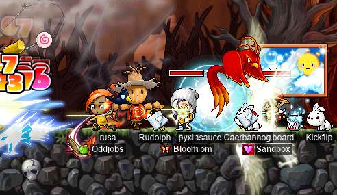
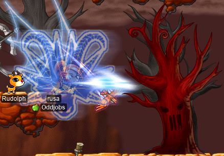
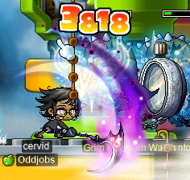
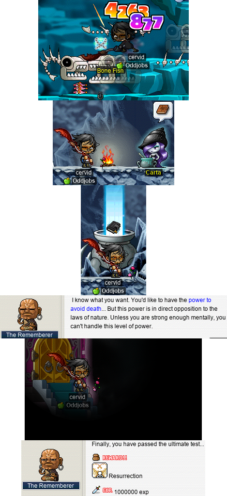
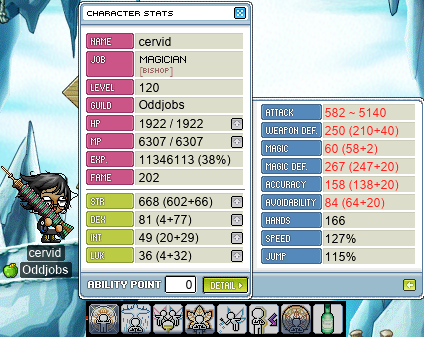
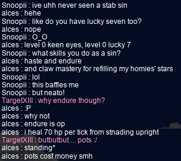
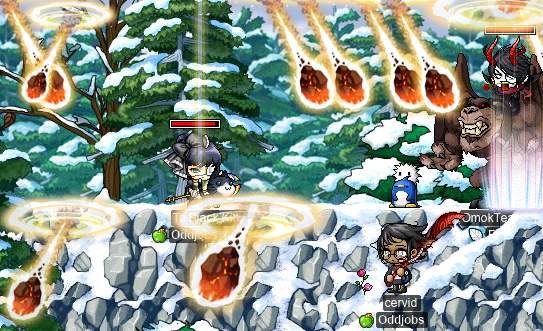

# rangifer’s diary: pt. xlviii

## R>1 privateer for Tae Roon run

In the previous installment of this series (which is part of the previous diary entry), we looked at the rest of the odd-jobbed rogues. With that, we can now move on to the pirates of the bunch! We’ve already covered some of these previously. In particular, we already went over the following models:

- [Permapirate](https://oddjobs.codeberg.page/odd-jobs.html#permapirate)
- [Swashbuckler](https://oddjobs.codeberg.page/odd-jobs.html#swashbuckler) (yes [Octo](https://maplelegends.com/lib/skill?id=5211001))
- Swashbuckler (no Octo)
- Generic DEX whacker

Where the “generic DEX whacker” represents the [summoner](https://oddjobs.codeberg.page/odd-jobs.html#summoner) in melee, sans summons, like a summoner version of the “swashbuckler (no Octo)” model. Technically, summoners are unconstrained in their AP build, so they could have more than 4 base STR, but this is suboptimal for summon DPS (which, notably, ignores WATK). But actually, the first three models here have misleading names. Our “permapirate” model only uses [Double Shot](https://maplelegends.com/lib/skill?id=5001003) (DS), meaning that it only represents one part of the permapirate’s arsenal (the other parts being [Flash Fist](https://maplelegends.com/lib/skill?id=5001001) (FF) and [Somersault Kick](https://maplelegends.com/lib/skill?id=5001002) (SSK)). Furthermore, this model also accurately represents the [bullet bucc](https://oddjobs.codeberg.page/odd-jobs.html#bullet-bucc) (assuming that their target is not stunned). And our “swashbuckler” models only use [Burst Fire](https://maplelegends.com/lib/skill?id=5210000) (BF), which ignores the swashbuckler’s SSK capabilities. So, it is now time that we must rename these models, to “permapirate/bullet bucc (DS)”, “swashbuckler (BF; yes Octo)”, and “swashbuckler (BF; no Octo)”, respectively. Note that Double Shot calls for a different AP build than Flash Fist and Somersault Kick, with DS being DEX-focussed, and the other two being STR-focussed. So our DS permapirate model will have a different AP build from the FF one below.

Nevertheless, this still leaves us with the following yet to be covered:

- Permapirate/[punch slinger](https://oddjobs.codeberg.page/odd-jobs.html#punch-slinger) (FF)
- Swashbuckler (SSK; yes Octo)
- Swashbuckler/[armed brawler](https://oddjobs.codeberg.page/odd-jobs.html#armed-brawler)/permapirate (SSK)
- [LUK bucc](https://oddjobs.codeberg.page/odd-jobs.html#luk-bucc) ([ED](https://maplelegends.com/lib/skill?id=5111004))
- LUK bucc (FF)
- [DEX brawler](https://oddjobs.codeberg.page/odd-jobs.html#dex-brawler) (ED)
- DEX brawler (FF)
- DEX brawler (DS)
- [Pugilist](https://oddjobs.codeberg.page/odd-jobs.html#pugilist) (ED)
- Pugilist (FF)
- [Bombadier](https://oddjobs.codeberg.page/odd-jobs.html#bombadier) (no summons)
- Bombadier (yes summons)
- [Pistol-whipper](https://oddjobs.codeberg.page/odd-jobs.html#pistol-whipper) ([HB](https://maplelegends.com/lib/skill?id=5211006))
- [Punch slinger](https://oddjobs.codeberg.page/odd-jobs.html#punch-slinger) (FF; yes Octo)
- [Summoner](https://oddjobs.codeberg.page/odd-jobs.html#summoner) (yes summons)
- [Begunner](https://oddjobs.codeberg.page/odd-jobs.html#begunner)

We will, unfortunately, not have a basic-attacking nor a SSK-using pistol-whipper model, because I genuinely do not know how meleeing with a gun works (if anyone does, please tell me!). But even with those two models missing, we are still at a whopping **16** pirate models (not including the ones already covered, which would make it 19 or 20, depending on how you count). That’s… too many models. For better or worse, pirates really _are_ just this complicated. So I want to split this out into at least two parts! In this first part, I will be considering the first ten models on the above list.

Our FF-using permapirate/punch slinger model will be using a [King Cent](https://maplelegends.com/lib/equip?id=01482012), and will get a little extra STR & DEX from their gear due to their ability to wear jobbed clothing (e.g. the [Red Belly Duke](https://maplelegends.com/lib/equip?id=01052131)). They will otherwise have as much STR as possible, because we assume that the FF-using permapirate is well-tuned to knuckler use.

Our SSK-using swashbuckler model will be very similar to the old (BF-using) swashbuckler model, except that they will be wielding a [Sky Ski](https://maplelegends.com/lib/equip?id=01432018), and will be a little more STR-focussed with their equips. The “swashbuckler/[armed brawler](https://oddjobs.codeberg.page/odd-jobs.html#armed-brawler)/permapirate (SSK)” model will be identical stat-wise and equipment-wise, but without the DPS from Octopus.

Our LUK bucc and DEX brawler models unfortunately will not get to wear jobbed clothing, and their weapon choices are limited to just the [Maple Golden Claw](https://maplelegends.com/lib/equip?id=01482022). The “DEX brawler (DS)” model is separate from our “permapirate/bullet bucc (DS)” model because it is restricted to having exactly 4 base STR.

Our pugilist, of course, uses no weapons at all, but they _will_ be capable of wearing jobbed clothing.

With all that in mind, let’s take a look at our models:

### The model permapirate/punch slinger (FF)

- 550 STR (45 of which is from gear)
- 100 DEX (80 of which is from gear)
- 119 WATK (86 from [knuckler](https://maplelegends.com/lib/equip?id=01482012) + 20 from [Cider](https://maplelegends.com/lib/use?id=2022002) + 3 from [cape](https://maplelegends.com/lib/equip?id=01102084) + 10 from gloves)

### The model swashbuckler/armed brawler/permapirate (SSK)

- 550 STR (45 of which is from gear)
- 80 DEX (60 of which is from gear)
- 139 WATK (106 from [spear](https://maplelegends.com/lib/equip?id=01432018) + 20 from [Cider](https://maplelegends.com/lib/use?id=2022002) + 3 from [cape](https://maplelegends.com/lib/equip?id=01102084) + 10 from gloves)

### The model LUK bucc

- 69 STR (65 of which is from gear; 5 extra from the [Maple Golden Claw](https://maplelegends.com/lib/equip?id=01482022))
- 65 DEX (45 of which is from gear)
- 530 LUK (25 of which is from gear)
- 105 WATK (72 from [knuckler](https://maplelegends.com/lib/equip?id=01482022) + 20 from [Cider](https://maplelegends.com/lib/use?id=2022002) + 3 from [cape](https://maplelegends.com/lib/equip?id=01102084) + 10 from gloves)

### The model DEX brawler

- 69 STR (65 of which is from gear; 5 extra from the [Maple Golden Claw](https://maplelegends.com/lib/equip?id=01482022))
- 566 DEX (45 of which is from gear)
- 105 WATK (72 from [knuckler](https://maplelegends.com/lib/equip?id=01482022) + 20 from [Cider](https://maplelegends.com/lib/use?id=2022002) + 3 from [cape](https://maplelegends.com/lib/equip?id=01102084) + 10 from gloves)

### The model DEX brawler (DS)

- 29 STR (25 of which is from gear)
- 606 DEX (85 of which is from gear; 5 extra from the [Maple Canon Shooter](https://maplelegends.com/lib/equip?id=01492022))
- 123 WATK (72 from [gun](https://maplelegends.com/lib/equip?id=01492022) + 20 from [Cider](https://maplelegends.com/lib/use?id=2022002) + 3 from [cape](https://maplelegends.com/lib/equip?id=01102084) + 10 from gloves + 18 from [bullets](https://maplelegends.com/lib/use?id=2330004))

### The model pugilist

- 550 STR (45 of which is from gear)
- 100 DEX (80 of which is from gear)
- 33 WATK (20 from [Cider](https://maplelegends.com/lib/use?id=2022002) + 3 from [cape](https://maplelegends.com/lib/equip?id=01102084) + 10 from gloves)

### Comparing single-target DPS

As usual, we assume that all player characters and monsters have the same level. And, as in the “R>1 pog ranged for…” series, we will use 600 WDEF & 600 MDEF to reasonably represent a low- or mid-level boss monster. We split out the LUK bucc, DEX brawler, and pugilist models into FF vs. ED models because they are only capable of using ED when their [Energy Charge](https://maplelegends.com/lib/skill?id=5110001) is active (which is always <100% uptime), and because they might not have ED maxed out (i.e. level 20). Furthermore, there is a DS model for the DEX brawler, because they are so good with guns, as a result of being pure DEX.

| model                                        |    DPS |
| :------------------------------------------- | -----: |
| Permapirate/punch slinger (FF)               | 7109.9 |
| DEX brawler (DS)                             | 6551.6 |
| Swashbuckler (SSK; yes Octo)                 | 5012.1 |
| Pugilist (ED)                                | 4141.3 |
| Swashbuckler/armed brawler/permapirate (SSK) | 4071.2 |
| DEX brawler (ED)                             | 3754.8 |
| Pugilist (FF)                                | 3106.0 |
| DEX brawler (FF)                             | 2815.9 |
| LUK bucc (ED)                                |  409.4 |
| LUK bucc (FF)                                |  307.1 |

Somewhat interestingly, out of these ten models, the highest single-target DPS is a melee model: the FF-using permapirate/punch slinger. In second place, ironically, is a melee-focussed build wielding a gun. It seems that the DEX brawler’s best bet — when they only care about single-target DPS — is actually wielding a gun! Our pugilist does a bit better damage than our DEX brawler when in melee (although not by much), and our SSK users stack up quite favourably. And then, of course, the LUK bucc… as expected, they do pretty poor damage; to be fair to them, most of their damage is eaten up by the 600 WDEF. If we instead assumed 0 WDEF, the DPS values for the ED and FF models would be 2371.0 and 1778.0, respectively.

As usual, we want to compare these figures to the figures calculated in the previous series, and in previous installations of this series. I’ve added some class-based (class as in: beginner, warrior, mage, archer, rogue, pirate) emojis to the “model” column to add some readability to this now quite lengthy table (N.B. some or none of these emojis may show up if you are viewing this on the MapleLegends forums, for some reason(‽)):

| model                                           |     DPS |
| :---------------------------------------------- | ------: |
| ⚔️ Dagger warrior                               | 14828.4 |
| 🥷 LUKless hermit (SM)                           | 14096.3 |
| ⚔️ DEX WK (fire weak)                           | 11856.8 |
| ⚔️ DEXsader                                     | 10729.0 |
| ⚔️ DEX WK (lightning weak)                      |  9977.1 |
| ⚔️ Wand warrior                                 |  9446.7 |
| ⚔️ DEX WK (ice weak)                            |  8097.5 |
| 🥷 Permarogue (L7)                               |  7658.0 |
| ⚔️ DEX WK (fire neutral)                        |  7470.9 |
| 🏴‍☠️ Permapirate/punch slinger (FF)               |  7109.9 |
| 🏹 Wood(wo)man (bow)                            |  6725.3 |
| 🏹 Wood(wo)man (xbow)                           |  6690.6 |
| 🏴‍☠️ Permapirate/bullet bucc (DS)                 |  6669.1 |
| 🏴‍☠️ Swashbuckler (BF; yes Octo)                  |  6598.6 |
| 🏴‍☠️ DEX brawler (DS)                             |  6551.6 |
| ⚔️ DEX WK (lightning neutral)                   |  6217.8 |
| ⚔️ Permawarrior                                 |  5934.0 |
| 🥷 LUKless dit                                   |  5928.2 |
| 🏴‍☠️ Swashbuckler (BF; no Octo)                   |  5614.4 |
| 🏹 Permarcher                                   |  5614.0 |
| 🥷 Daggerlord/permarogue (Double Stab)           |  5223.5 |
| ⚔️ DEXgon knight                                |  5054.7 |
| 🏴‍☠️ Swashbuckler (SSK; yes Octo)                 |  5012.1 |
| 🧙 Magelet (F/P Ele Comp; weak)                 |  4520.7 |
| ⚔️ LUK WK (fire weak)                           |  4353.5 |
| 🧙 Magelet (I/L Ele Comp; weak)                 |  4192.2 |
| 🏴‍☠️ Pugilist (ED)                                |  4141.3 |
| 🏴‍☠️ Swashbuckler/armed brawler/permapirate (SSK) |  4071.2 |
| 🧙 Magelet (Fire Arrow; weak)                   |  3976.9 |
| ⚔️ LUKsader                                     |  3868.9 |
| 🏴‍☠️ DEX brawler (ED)                             |  3754.8 |
| ⚔️ LUK WK (lightning weak)                      |  3545.8 |
| 🧙 Permamagician                                |  3307.3 |
| 🏴‍☠️ Pugilist (FF)                                |  3106.0 |
| 🧙 Magelet (F/P Ele Comp; neutral)              |  2877.8 |
| 🧙 Magelet (Heal; 1 non-self target)            |  2853.7 |
| 🏴‍☠️ DEX brawler (FF)                             |  2815.9 |
| ⚔️ LUK WK (ice weak)                            |  2738.0 |
| 🧙 Magelet (I/L Ele Comp; neutral)              |  2658.8 |
| 🥷 LUKless hermit (Avenger)                      |  2575.5 |
| 🧙 Magelet (Fire Arrow; neutral)                |  2498.2 |
| ⚔️ LUK WK (fire neutral)                        |  2468.8 |
| 🔰 Generic STR whacker                          |  2227.8 |
| 🏹 Bow-whacker                                  |  2101.7 |
| ⚔️ LUK WK (lightning neutral)                   |  1930.3 |
| 🏹 Bowginner                                    |  1559.2 |
| 🥷 Clawginner                                    |  1393.5 |
| ⚔️ LUK DK                                       |  1350.2 |
| 🔰 Wandginner                                   |  1308.7 |
| 🥷 Grim reaper                                   |  1258.6 |
| 🧙 Gish(let) (melee)                            |  1238.3 |
| 🥷 Carpenter                                     |  1210.7 |
| 🧙 Magelet (SR; weak)                           |  1206.1 |
| 🔰 Generic DEX whacker                          |   966.0 |
| 🔰 Generic claw-wielding non-rogue              |   841.5 |
| 🧙 Magelet (SR; neutral)                        |   699.2 |
| 🏴‍☠️ LUK bucc (ED)                                |   409.4 |
| 🏴‍☠️ LUK bucc (FF)                                |   307.1 |
| 🧙 Magelet (priest/permamagician; Magic Claw)   |   234.4 |
| 🥷 Claw-puncher (hermit)                         |    88.2 |

So it looks like, for pirates, FF is as good as it gets for single-target DPS! And DS is a close second; the “permapirate/bullet bucc (DS)” model should probably be higher DPS, if I had just taken into account jobbed clothing, but whatever. Pugilists and SSK-users (and DEX brawlers, for that matter) are prized for their mobbing abilities. And LUK buccs are LUK buccs.

**_IMPORTANT REMINDERS BEFORE ANYONE GOES AROUND TOUTING THESE NUMERIC FIGURES:_** Keep in mind (and I cannot stress this enough) that this is a purely one-dimensional — and somewhat shoddy — analysis using dummy models, _and_ that jobs cannot be reduced to raw single-target DPS numbers. The odd jobs that are listed above differ considerably in their playstyles and range of abilities. Furthermore, this only considers characters that are roughly level 100.

## Helping Cort out with some cards

**Cortical** (**GishGallop**, **Phoneme**, **Subcortical**, **MageFP**, **Medulla**, **dendrite**, **WizetWizard**) was card-hunting at [Magatia](https://maplelegends.com/lib/map?id=261000000) and was getting a little stuck on some of the more difficult monsters. Some of the monsters in Magatia a big fat tubs of HP, so as a [STRginner](https://oddjobs.codeberg.page/odd-jobs.html#str-beginner), Cort was having a hard time finishing those sets. So I promised to bring my [woodswoman](https://oddjobs.codeberg.page/odd-jobs.html#woodsman), **capreolina**, to help out! First off was finishing the [Homunculus](https://maplelegends.com/lib/monster?id=7110301) set:

We were also able to finish the [Homun](https://maplelegends.com/lib/monster?id=6110300) set in a reasonable time, which was a relief, since Cort had spent hours getting 1/5 cards when grinding alone.

Then we tackled [Sites](https://maplelegends.com/lib/monster?id=6110301):

And after sweeping all eight channels twice, I was able to go from 2/5 [Security Camera](https://maplelegends.com/lib/monster?id=7090000) cards to 3/5:

And while we were at it, I hopped onto my [DEXgon knight](https://oddjobs.codeberg.page/odd-jobs.html#dex-warrior) **rusa**, to help Cort get the [Male Boss](https://maplelegends.com/lib/monster?id=9400120) set right quick:

And while I was there, I got the set for capre as well :3

## Bossing with Skateboard, pyxi, Pastasauce, and ToasTea

While I was looking for something to do on my [STR bishop](https://oddjobs.codeberg.page/odd-jobs.html#str-mage) **cervid**, I ran into **Skateboard** (**Melokie**, **Alrightyo**), who was also looking for something to do. So we decided it was time for a [Ravana](https://maplelegends.com/lib/monster?id=9420014) run!:

I went, as cervid, with Skateboard, as well as **pyxi** (**quakken**) and **ToasTea**. None of us were _super_ strong, but everyone else’s damage was thankfully enough to make up for my pitiful STR bishop DPS. They were rather impressed with my damage, though, as I was able to knock back Ravana (albeit not very consistently, thanks to my wildly unstable damage). I had on Cort’s [Toy of 101](https://maplelegends.com/lib/equip?id=01402038), and was buffed with [Cider](https://maplelegends.com/lib/use?id=2022002), [MW](https://maplelegends.com/lib/skill?id=3121000), and [SE](https://maplelegends.com/lib/skill?id=3121002), so I was doing some pretty chunky damage by my own standards. And the others thought so as well, being somewhat surprised with how much damage a bishop is capable of doing in melee :P

Skateboard went to do some of the [CWK](https://maplelegends.com/lib/map?id=682000000) quests so that she could host CWKPQ, and ran into a [BF](https://maplelegends.com/lib/monster?id=9400575) along the way. We decided to fight that guy as well, although I had to attend the fight on rusa, as cervid would not be able to survive (and even rusa nearly gets one-shot by BF). The [HB](https://maplelegends.com/lib/skill?id=1301007) was probably nice for everyone else, anyways:

This time **Pastasauce** came along, and later, we fought another BF as well; rusa actually got big fatty EXP for both of these kills, which was really nice. And, once Skateboard was at [CWM](https://maplelegends.com/lib/map?id=610020002) for the quests, I had nothing else to do with rusa besides farm a few [woods](https://maplelegends.com/lib/etc?id=4032004):

## cervid does some fourth job quests!

Now that cervid is a (pure STR) bishop, it’s time for some 4th job skill questing!

cervid, 4th job questing~

The first order of business was the [Resurrection](https://maplelegends.com/lib/skill?id=2321006) skill questline. Before actually starting, I went ahead and collected the ETC items that I would need for the quest: 100 [Ice Pieces](https://maplelegends.com/lib/etc?id=4000150), 50 [Firebomb Flames](https://maplelegends.com/lib/etc?id=4000081), and 5 [Charms of the Undead](https://maplelegends.com/lib/etc?id=4000008). I headed over to [the Grim Phantom Watches map](https://maplelegends.com/lib/map?id=220070301) to kill some [GPW](https://maplelegends.com/lib/monster?id=8143000)s for myself:

As it turns out, these things are _tanky as hell_. With 60k HP and 850 WDEF each, it took me quite a while to whittle each one down, and desperately hope that it would drop an Ice Piece. After a few minutes of grinding and getting 4 Ice Pieces, though, I ran into **CtrlNoble** (**xNoble**, **1122Noble**, **1122**) on the same map, and asked if he had any spare Ice Pieces. He responded by dropping 346(!) Ice Pieces, so I thanked him graciously and, well, was off to do the next ETC hunt~

…In which I was joined by **Taima** (**Tacgnol**, **Boymoder**, **Numidium**, **Gambolpuddy**, **Yotsubachan**)! And so, 50 Firebomb Flames and 5 Charms of the Undead (I already had the charms) later, I was off to get Resurrection:

The JQ took me a while (indeed, two tries; the JQ has a 20 minute time limit) to complete successfully. The entire damn thing is completely dark; none of the platforms are visible, and to make things worse, there are [Flyeyes](https://maplelegends.com/lib/monster?id=4230107) flying around willy nilly! But I did eventually nail it, which was the last step that I needed to unlock this incredible skill. I plan on resurrecting many permabeginners (and other squishy odd-jobbers) in the future!!

Oh, and in the process, I fought some [Thanatos](https://maplelegends.com/lib/monster?id=8170000)es and managed to squeeze out a stray card:

The other skill questline that I could do on my own was the [Bahamut](https://maplelegends.com/lib/skill?id=2321003) questline. It just asks for 20 ETCs that can be obtained from any colour of [Wyvern](https://maplelegends.com/lib/monster?filter=1&order=1&sort=1&search=wyvern) in [Leafre](https://maplelegends.com/lib/map?id=240000000). This one is actually repeatable; each repetition requires more [Dragon Hearts](https://maplelegends.com/lib/etc?id=4031449) than the last, and increases the skill level cap by 5. I only did the first one (20 Dragon Hearts), as Bahamut is essentially a “meme skill” for me (as I have little to no MACC nor TMA, due to my INTless & LUKless nature), so a maximum level of 10 is just fine. Plus, Wyverns are quite the formidable opponent:

With Cort’s [Toy of 101](https://maplelegends.com/lib/equip?id=01402038), my own self-casted buffs (including [MW](https://maplelegends.com/lib/skill?id=2321000)1), [Cider](https://maplelegends.com/lib/use?id=2022002), and [Echo of Hero](https://maplelegends.com/lib/skill?id=0001005), I was able to achieve a maximum range of over 5.1k!!:

And finally, after having collected all 20 Dragon Hearts, Bahamut was mine:

…But not actually, since I haven’t had the spare SP to spend on it yet :P

## Attending the Bomberman event for the first time

GM **Mirror** hosted a Bomberman event, and since I was already in [Ludibrium](https://maplelegends.com/lib/map?id=220000000) anyways, I decided I might as well attend, with Taima!:

Unfortunately, while we both went in (the event is limited to roughly 100 players, I think), Taima’s game crashed immediately upon entering, so I was in there all alone >.<

The event itself is pretty chaotic and random (the last round resulted in a tie, as the last two players standing were killed at the same time), and I died with urgency during every round, but it was still cool to see. Especially with the funky visual glitch (this was also seen by the other players at the event):

And by the end, even if I didn’t win any of the rounds, I still got a [Scroll of Secrets](https://maplelegends.com/lib/etc?id=4031019)! So I went off to hunt for the key to unlock it:

…Aaaand got a sweet [topwear def 30% scroll](https://maplelegends.com/lib/use?id=2040405). Can’t win ‘em all, I guess.

## cervine grinds to level 106; capreolina grinds to level 115

It is time… for a grinding section! This time, featuring my I/L [magelet](https://oddjobs.codeberg.page/odd-jobs.html#magelet), **cervine**! And joined again by **Taima**/**Tacgnol**:

Unfortunately, CDs punch well above their weight, and permabeginners are as lightweight as it gets… But never fear! Tacgnol is here to [mist](https://maplelegends.com/lib/skill?id=2111003)[splode](https://maplelegends.com/lib/skill?id=2111002) the shit out of some CDs! We grinded as an I/L / F/P duo for a while, and in the process, I got cervine from level 105 to level 106 ^^

And here we are, burnt out from the grinding:

Later, I went to grind CDs on my [woodswoman](https://oddjobs.codeberg.page/odd-jobs.html#woodsman) **capreolina**, to get her from level 114 to 115:

I was joined again by Taima, this time on her [STRmit](https://oddjobs.codeberg.page/odd-jobs.html#lukless-assassin) **Boymoder**:

And, when that proved to be a little too difficult for Boymoder, again she grinded as Tacgnol. And capreolina is, in fact, now level 115 :)

Oh, and also, capre was my only character with [zring](https://maplelegends.com/lib/equip?id=01112920)s; fortunately, she only had two:

But that’s still a net loss of 200 HP… u\_u R.I.P.

## alces @ OPQ

And, as before, my undead [daggerlord](https://oddjobs.codeberg.page/odd-jobs.html#dagger-assassin) **alces** is on that [OPQ](https://maplelegends.com/lib/map?id=200080101) grind:

I took a break from OPQing to test out my damage with Cort’s [Fan](https://maplelegends.com/lib/equip?id=01332030) (an extremely powerful 102 WATK Fan, 10 more WATK than my own):

Yowza! Not pictured here is alces dealing >6k damage in a single [Double Stab](https://maplelegends.com/lib/skill?id=4001334) at level 65… O.O

I also had the pleasure of doing an OPQ or two with **lanlan**, who remained almost completely silent for the entirety of every run, but who was nevertheless quite capable of silently disciplining her party members:

## rusa+Tacgnol @ 5-6 F

**Tacgnol** needed a last-hitter at the [Sutra Depository 5-6 F](https://maplelegends.com/lib/map?id=702070300), so I brought along my [DEXgon knight](https://oddjobs.codeberg.page/odd-jobs.html#dex-warrior) **rusa**! rusa has effectively infinite WACC, and very [good](https://maplelegends.com/lib/skill?id=1311006) mobbing [skills](https://maplelegends.com/lib/skill?id=1311004), so she made a great last-hitter for this purpose. I even got a card or two along the way:

…One long grind session later, and this was enough to get Tacgnol to level 120, and rusa from 116 to 117!! Very nice~

## Tacgnol advances to the honourable rank of archgishlet!!

Now that Tacgnol was level 120, I attended **Tacgnol**’s 4th job advancement party~! It was quite fun, starting off with the 4th job advancement itself (Tacgnol had already collected the [Heroic Star](https://maplelegends.com/lib/etc?id=4031344) and the [Heroic Pentagon](https://maplelegends.com/lib/etc?id=4031343)):

And we (Tacgnol, myself, and **OmokTeacher**) collectively went through the [Meteor Shower](https://maplelegends.com/lib/skill?id=2121007) questline, culminating in the very first ever Meteor Shower (yes, the first one ever… except maybe for some used by normal-jobbed characters, but surely that doesn’t count…):

:OOOOO

Congrats!!! <3

## alces does a few more quests~

Moar questing 4 alces~

The first order of business was working on [Protecting the Peach Farm](https://bbb.hidden-street.net/quest/mu-lung-nihal-desert/protecting-the-peach-farm) (requires [Peach Monke](https://maplelegends.com/lib/monster?id=6130207) kills as well as [their ETCs](https://maplelegends.com/lib/etc?id=4000282)) and [Making Mastery Medicine](https://bbb.hidden-street.net/quest/mu-lung-nihal-desert/making-mastery-medicine) (requires various ETCs from around [Mu Lung](https://maplelegends.com/lib/map?id=250000000)/[Herb Town](https://maplelegends.com/lib/map?id=251000000), some of which are rare-ish: [Snake Leathers](https://maplelegends.com/lib/etc?id=4000281) and [Bear Feet](https://maplelegends.com/lib/etc?id=4000283)):

While I was near the map where [Reindeer](https://maplelegends.com/lib/monster?id=5120505) and Peach Monke spawn, I killed some [Book Ghosts](https://maplelegends.com/lib/monster?id=5120506) to complete the \[Advanced\] bit of [The Legendary Being’s Scroll](https://bbb.hidden-street.net/quest/mu-lung-nihal-desert/the-legendary-beings-scroll) questline:

![Legendary Being’s Scroll \[Advanced\] get!](alces-legendary-being-s-scroll-advanced-get.png "Legendary Being’s Scroll [Advanced] get!")

And I had to move on to Herb Town maps in order to gather the rest of my ETCs:

Once I completed the above-mentioned quests, I started on the Herb Town quests, particularly [Eliminating the Escaped Pot](https://bbb.hidden-street.net/quest/mu-lung-nihal-desert/eliminating-the-escaped-pot):

…Although I was called to OPQ before I finished the last 100 or so kills!

## Ravana w/ Gruzz, xBowtjuhNL, Eoka, and Harlez

I did more [Ravana](https://maplelegends.com/lib/monster?id=9420014) runs, this time with **Gruzz**, **xBowtjuhNL**, **Eoka**, and **Harlez**, all of whom I met while [MPQ](https://maplelegends.com/lib/map?id=261000021)ing on my [DEXgon knight](https://oddjobs.codeberg.page/odd-jobs.html#dex-warrior) **rusa**. It was also rusa who I took to Ravana, as well, so that xBowtjuhNL wouldn’t get one-shot by Ravana’s attacks. We were joined by I/L archmage **Subjugate** for our first run, which made things considerably smoother; for the second run, however, we were on our own:

Besides Harlez unfortunately dying to a pet auto HP potion failure, the run wasn’t too bad; xBowtjuhNL used an [apple](https://maplelegends.com/lib/use?id=2022179), I think, and I believe Gruzz used a few [Ssiws Cheeses](https://maplelegends.com/lib/use?id=2022273) as well! :O So the run didn’t take that much longer. I ended up with some extra mesos from splits, yet another [fake Ravana Helmet](https://maplelegends.com/lib/equip?id=01002581) (which I immediately dropped on the ground), and some joocy EXPs~

## alces advances to daggermit

After so many more OPQs, it was finally time… for alces to advance to daggermit! Third job stabby sin!! Proto-daggerlord!!!

[The Dark Lord](https://maplelegends.com/lib/monster?id=9001003) went down like a chump:

And so it was, hermit at last (although, unfortunately, no [FJ](https://maplelegends.com/lib/skill?id=4111006) until level 72…):

At the bottom there you can see **NightDood** congratulating me; NightDood is actually a fellow daggerlord! Good luck on your journey, NightDood~

## alces graduates OPQ academy

Having advanced to the rank of hermit, I headed back to OPQ to OPQ with I/L [gish](https://oddjobs.codeberg.page/odd-jobs.html#gish) and fellow **Oddjobs** member, **GishGallop**:

And we graduated OPQ at the exact same time, both leveling up to 71 on the same stage. Here we are, in our final OPQ:

Bye OPQ! See you again later :) And alces is off to more quests and some MPQ!!
