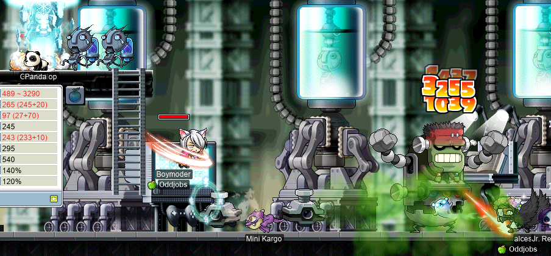
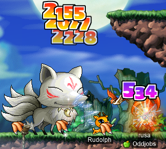

# rangifer’s diary: pt. xlix

## R>1 seafaring ne’er-do-well for Capt. Latanica run

In the previous installment of this series (which is part of the previous diary entry), we looked at some odd-jobbed pirate models. But there were so many pirate models that we only covered roughly half of them (“them” being the models remaining after those covered in the original version of this series). In particular, we already went over the following models:

- Permapirate/[punch slinger](https://oddjobs.codeberg.page/odd-jobs.html#punch-slinger) ([FF](https://maplelegends.com/lib/skill?id=5001001))
- Swashbuckler ([SSK](https://maplelegends.com/lib/skill?id=5001002); yes [Octo](https://maplelegends.com/lib/skill?id=5211001))
- Swashbuckler/[armed brawler](https://oddjobs.codeberg.page/odd-jobs.html#armed-brawler)/permapirate (SSK)
- [LUK bucc](https://oddjobs.codeberg.page/odd-jobs.html#luk-bucc) ([ED](https://maplelegends.com/lib/skill?id=5111004))
- LUK bucc (FF)
- [DEX brawler](https://oddjobs.codeberg.page/odd-jobs.html#dex-brawler) (ED)
- DEX brawler (FF)
- DEX brawler ([DS](https://maplelegends.com/lib/skill?id=5001003))
- [Pugilist](https://oddjobs.codeberg.page/odd-jobs.html#pugilist) (ED)
- Pugilist (FF)

We can now move on to the rest of the bunch!:

- [Bombadier](https://oddjobs.codeberg.page/odd-jobs.html#bombadier) (no summons)
- Bombadier (yes summons)
- [Pistol-whipper](https://oddjobs.codeberg.page/odd-jobs.html#pistol-whipper) ([HB](https://maplelegends.com/lib/skill?id=5211006); no Octo)
- Pistol-whipper (HB; yes Octo)
- [Punch slinger](https://oddjobs.codeberg.page/odd-jobs.html#punch-slinger) (FF; yes Octo)
- [Summoner](https://oddjobs.codeberg.page/odd-jobs.html#summoner) (yes summons)
- [Begunner](https://oddjobs.codeberg.page/odd-jobs.html#begunner)

(I’ve since split out the pistol-whipper model into two models: one with Octo, and one without.)

But, actually, I just realised that I have no clue what the “attack period” of the [Grenade](https://maplelegends.com/lib/skill?id=5201002) skill would even be, how such a period might be calculated, or what relation (if any??) it might have to the reality of trying to fight a boss monster using this skill. Grenade is a charged skill, and the level of charge determines the distance that the grenade is thrown. [**LazyBui**’s “Attack Speed Reference”](http://www.southperry.net/showthread.php?t=3217) also gives up on this skill, saying:

> Grenade counts as an attack from when the bomb blows up (so if you happen to unleash 5 before 1 hits the ground, they'll all count as attacks when they hit the ground). This makes calculation difficult. Suggestions welcomed.

So, unfortunately, I’m going to have to throw out both bombadier models. But that still leaves us with 5 more models to go.

Our pistol-whipper will be using the level 100 gun, and will get a little extra STR & DEX from their gear due to their ability to wear jobbed clothing (e.g. the [Red Belly Duke](https://maplelegends.com/lib/equip?id=01052131)). They will otherwise have as much DEX as possible, as the [Homing Beacon](https://maplelegends.com/lib/skill?id=5211006) skill can only be used when a gun is equipped. We further assume (in addition to other assumptions about how the skill’s damage is calculated) that the WATK from the outlaw’s bullets is **not** taken into account. The reasoning for this is that the Homing Beacon skill does not consume ammunition of any kind, and, indeed, the skill animation does not involve the outlaw’s gun at all (despite it requiring a gun to be equipped).

Our FF-using & Octo-using punch slinger model will be the same as the FF-using permapirate/punch slinger model from the previous entry. The only difference here is the use of Octopus.

Our summoner, due to the fact that outlaw summons scale primarily on DEX, will be very similar (AP-wise and equipment-wise) to the pistol-whipper model. And similar comments apply to the begunner, as well.

With all that in mind, let’s take a look at our models:

### The model pistol-whipper

- 550 DEX (45 of which is from gear)
- 100 STR (80 of which is from gear)
- 119 WATK (86 from [gun](https://maplelegends.com/lib/equip?id=01492012) + 20 from [Cider](https://maplelegends.com/lib/use?id=2022002) + 3 from [cape](https://maplelegends.com/lib/equip?id=01102084) + 10 from gloves)

### The model punch slinger

- 550 STR (45 of which is from gear)
- 100 DEX (80 of which is from gear)
- 119 WATK (86 from [knuckler](https://maplelegends.com/lib/equip?id=01482012) + 20 from [Cider](https://maplelegends.com/lib/use?id=2022002) + 3 from [cape](https://maplelegends.com/lib/equip?id=01102084) + 10 from gloves)

### The model summoner

- 550 DEX (45 of which is from gear)
- 100 STR (80 of which is from gear)
- 137 WATK (86 from [gun](https://maplelegends.com/lib/equip?id=01492012) + 18 from [ammunition](https://maplelegends.com/lib/use?id=2330004) + 20 from [Cider](https://maplelegends.com/lib/use?id=2022002) + 3 from [cape](https://maplelegends.com/lib/equip?id=01102084) + 10 from gloves)

### The model begunner

See “The model summoner”.

### Comparing single-target DPS

As usual, we assume that all player characters and monsters have the same level. And, as in the “R>1 pog ranged for…” series, we will use 600 WDEF & 600 MDEF to reasonably represent a low- or mid-level boss monster.

The main difficulty here is the summons. Octopus is pretty straightforward, for the most part, and so we just assume that it has 100% uptime in cases where summons’ DPS is taken into account. [Gaviota](https://maplelegends.com/lib/skill?id=5211002) is where things get a little messy. Gaviota can be somewhat difficult to work with; it has a bit of a casting time that interrupts the summoner’s ability to use other active skills (like attacking skills) and basic attacks, but it only attacks one time before disappearing. It then has to be resummoned, over and over, waiting for the 5 second cooldown each time. So, some summon-using models **only use Octopus**; these are identified with “yes Octo”. Other summon-using models **use both Octopus and Gaviota**; these are identified with “yes summons”. Calculating the DPS of Gaviota itself is pretty simple: just divide the average per-hit damage by 5 (as it has a 5 second cooldown). But the impact on other sources of DPS is more difficult to estimate. The most simple estimation is just to be as optimistic as possible, and pretend that Gaviota does not impact other sources of DPS at all. I’ll be using this simplification here, so, the only way that we take into account Gaviota’s difficulty of use is in deciding which models use Gaviota, and which ones don’t. This is basically accurate for models that don’t use Gaviota, but overestimates the DPS of models that do use Gaviota. So keep that in mind here.

| model                         |    DPS |
| :---------------------------- | -----: |
| Pistol-whipper (HB; yes Octo) | 9468.4 |
| Punch slinger (FF; yes Octo)  | 8106.3 |
| Pistol-whipper (HB; no Octo)  | 7810.2 |
| Summoner (yes summons)        | 5546.6 |
| Begunner                      | 1647.3 |

So we’ve got some pretty heavy hitters here; besides the begunner, all of these models put up some pretty chunky DPS numbers. The pistol-whipper does startling quantities of DPS, owing to Homing Beacon’s incredible 380% damage multiplier. And the summoner does what is perhaps a startling quantity of DPS as well, although do note that roughly 49.5% of that DPS is just from the summoner basic-attacking with their gun.

As usual, we want to compare these figures to the figures calculated in the previous series, and in previous installations of this series. I’ve added some class-based (class as in: beginner, warrior, mage, archer, rogue, pirate) emojis to the “model” column to add some readability to this now quite lengthy table (N.B. some or none of these emojis may show up if you are viewing this on the MapleLegends forums, for some reason(‽)):

| model                                           |     DPS |
| :---------------------------------------------- | ------: |
| ⚔️ Dagger crusader                              | 14828.4 |
| 🥷 LUKless hermit (SM)                           | 14096.3 |
| ⚔️ DEX WK (fire weak)                           | 11856.8 |
| ⚔️ DEXsader                                     | 10729.0 |
| ⚔️ DEX WK (lightning weak)                      |  9977.1 |
| 🏴‍☠️ Pistol-whipper (HB; yes Octo)                |  9468.4 |
| ⚔️ Wand crusader                                |  9446.7 |
| 🏴‍☠️ Punch slinger (FF; yes Octo)                 |  8106.3 |
| ⚔️ DEX WK (ice weak)                            |  8097.5 |
| 🏴‍☠️ Pistol-whipper (HB; no Octo)                 |  7810.2 |
| 🥷 Permarogue (L7)                               |  7658.0 |
| ⚔️ DEX WK (fire neutral)                        |  7470.9 |
| 🏴‍☠️ Permapirate/punch slinger (FF)               |  7109.9 |
| 🏹 Woods(wo)man (bow)                           |  6725.3 |
| 🏹 Woods(wo)man (xbow)                          |  6690.6 |
| 🏴‍☠️ Permapirate/bullet bucc (DS)                 |  6669.1 |
| 🏴‍☠️ Swashbuckler (BF; yes Octo)                  |  6598.6 |
| 🏴‍☠️ DEX brawler (DS)                             |  6551.6 |
| ⚔️ DEX WK (lightning neutral)                   |  6217.8 |
| ⚔️ Permawarrior                                 |  5934.0 |
| 🥷 LUKless dit                                   |  5928.2 |
| 🏴‍☠️ Swashbuckler (BF; no Octo)                   |  5614.4 |
| 🏹 Permarcher                                   |  5614.0 |
| 🏴‍☠️ Summoner (yes summons)                       |  5546.6 |
| 🥷 Daggerlord/permarogue (Double Stab)           |  5223.5 |
| ⚔️ DEXgon knight                                |  5054.7 |
| 🏴‍☠️ Swashbuckler (SSK; yes Octo)                 |  5012.1 |
| 🧙 Magelet (F/P Ele Comp; weak)                 |  4520.7 |
| ⚔️ LUK WK (fire weak)                           |  4353.5 |
| 🧙 Magelet (I/L Ele Comp; weak)                 |  4192.2 |
| 🏴‍☠️ Pugilist (ED)                                |  4141.3 |
| 🏴‍☠️ Swashbuckler/armed brawler/permapirate (SSK) |  4071.2 |
| 🧙 Magelet (Fire Arrow; weak)                   |  3976.9 |
| ⚔️ LUKsader                                     |  3868.9 |
| 🏴‍☠️ DEX brawler (ED)                             |  3754.8 |
| ⚔️ LUK WK (lightning weak)                      |  3545.8 |
| 🧙 Permamagician                                |  3307.3 |
| 🏴‍☠️ Pugilist (FF)                                |  3106.0 |
| 🧙 Magelet (F/P Ele Comp; neutral)              |  2877.8 |
| 🧙 Magelet (Heal; 1 non-self target)            |  2853.7 |
| 🏴‍☠️ DEX brawler (FF)                             |  2815.9 |
| ⚔️ LUK WK (ice weak)                            |  2738.0 |
| 🧙 Magelet (I/L Ele Comp; neutral)              |  2658.8 |
| 🥷 LUKless hermit (Avenger)                      |  2575.5 |
| 🧙 Magelet (Fire Arrow; neutral)                |  2498.2 |
| ⚔️ LUK WK (fire neutral)                        |  2468.8 |
| 🔰 Generic STR whacker                          |  2227.8 |
| 🏹 Bow-whacker                                  |  2101.7 |
| ⚔️ LUK WK (lightning neutral)                   |  1930.3 |
| 🏴‍☠️ Begunner                                     |  1647.3 |
| 🏹 Bowginner                                    |  1559.2 |
| 🥷 Clawginner                                    |  1393.5 |
| ⚔️ LUK DK                                       |  1350.2 |
| 🔰 Wandginner                                   |  1308.7 |
| 🥷 Grim reaper                                   |  1258.6 |
| 🧙 Gish(let) (melee)                            |  1238.3 |
| 🥷 Carpenter                                     |  1210.7 |
| 🧙 Magelet (SR; weak)                           |  1206.1 |
| 🔰 Generic DEX whacker                          |   966.0 |
| 🔰 Generic claw-wielding non-rogue              |   841.5 |
| 🧙 Magelet (SR; neutral)                        |   699.2 |
| 🏴‍☠️ LUK bucc (ED)                                |   409.4 |
| 🏴‍☠️ LUK bucc (FF)                                |   307.1 |
| 🧙 Magelet (priest/permamagician; Magic Claw)   |   234.4 |
| 🥷 Claw-puncher (hermit)                         |    88.2 |

As expected, the punch slinger _with_ Octo does roughly 1k more DPS than the punch slinger without. In the previous entry, I said: “it looks like, for pirates, FF is as good as it gets for single-target DPS!”. But it seems that I forgot that I wasn’t done with pirates yet. Turns out, the weirdly broken skill for odd-jobbed pirates is Homing Beacon!

Also worth noting is that the begunner ranks the highest in this table, out of all 3 (or 4, if you count [besinners](https://oddjobs.codeberg.page/odd-jobs.html#besinner), represented here as “generic claw-wielding non-rogue”) ranged beginners. However, when compared to their [bowginner](https://oddjobs.codeberg.page/odd-jobs.html#bowginner) and [clawginner](https://oddjobs.codeberg.page/odd-jobs.html#clawginner) siblings, the begunner is the least “ranged” out of the 3. They have no access to the equivalent of [The Eye of Amazon](https://maplelegends.com/lib/skill?id=3000002)/[Keen Eyes](https://maplelegends.com/lib/skill?id=4000001); this is because [Double Shot](https://maplelegends.com/lib/skill?id=5001003) (and later, other gunslinger/outlaw/corsair skills, although the begunner is a [permapirate](https://oddjobs.codeberg.page/odd-jobs.html#permapirate) by definition anyways) has reach built into the skill. Higher levels of Double Shot have larger reach, and maxing it out brings Double Shot on par with maxed The Eye of Amazon or maxed Keen Eyes. Yet begunners can only attack with basic-attacks, by definition. So their reach is quite poor (compare: the besinner).

**_IMPORTANT REMINDERS BEFORE ANYONE GOES AROUND TOUTING THESE NUMERIC FIGURES:_** Keep in mind (and I cannot stress this enough) that this is a purely one-dimensional — and somewhat shoddy — analysis using dummy models, _and_ that jobs cannot be reduced to raw single-target DPS numbers. The odd jobs that are listed above differ considerably in their playstyles and range of abilities. Furthermore, this only considers characters that are roughly level 100.

## A little sadsadgrinding to bring rusa near level 120, and cervid to 121!

I did some more sadsadgrinding, where I head [to CDs](https://maplelegends.com/lib/map?id=742010203) and start duo grinding with myself, featuring my [STR bishop](https://oddjobs.codeberg.page/odd-jobs.html#str-mage) **cervid**, and my [DEXgon knight](https://oddjobs.codeberg.page/odd-jobs.html#dex-warrior) **rusa**. While I was grinding with myself and listening to sad music, **Taima** (**Tacgnol**, **Boymoder**, **Inugami**, **Numidium**, **Gambolpuddy**) came to cheer me up and grind alongside me:

And by the time that I was finished with cervid+rusa CD grinding, I had gotten cervid to level 121 (hooray for [MW](https://maplelegends.com/lib/skill?id=2321000)5!), and later I came back (after some questing) to get rusa to level 119 and 99.98%! :O

## alces is an MPQ _fiend_

Now that my undead [daggermit](https://oddjobs.codeberg.page/odd-jobs.html#dagger-assassin), **alces**, had graduated [OPQ](https://maplelegends.com/lib/map?id=200080101), she was in level range for [MPQ](https://maplelegends.com/lib/map?id=261000021)! My initial instinct was to continue with the strategy I had when OPQing, which was to PQ when folks were around, and then opportunistically do questing whenever there weren’t any PQers.

But I decided to hold off on the questing, for EXP reasons. You see, once alces gets to level 86, there are no longer any PQs that really give decent EPH (and the situation only becomes more dire with higher levels); PQs like [PPQ](https://maplelegends.com/lib/map?id=251010404) (at least until level 101), [HPQ](https://maplelegends.com/lib/map?id=100000200), etc., still remain options, but their EXP is pretty lacking at that point. Also, I don’t really like PPQ (lol). I may (or may not) end up PPQing, for [cards](https://maplelegends.com/lib/use?id=2388011)/[hats](https://maplelegends.com/lib/equip?id=01002571), but the EXP story for my post-MPQ characters is generally just: grind and quest. And grind. Very sad grinding. So my strategy is to save the quests that I would otherwise be doing at this point, for after I graduate MPQ (level 86+). When I was OPQing, the quests that I was doing were relatively lower level, and so are of lesser consequence to a hypothetical level 86+ alces. Questing at the same time as MPQing, however, means quests that are more in the 65~85 level range or so, which are the quests that I think it wise to save for later. This is a particular concern for alces, who has a limited capacity to grind, due to her complete lack of multi-target attacking skills (and lack of reach, for that matter).

So, anyways, I’ve been MPQing.

Been MPQing~

Here I am, duoing the final MPQ stage with **slashmuslash**, because one of our other party members crashed, and the other party member is me (my MPQ mule, **potpan**):

I made sure to summon [Normal Fanky](https://maplelegends.com/lib/monster?id=9300139), and it was a great success! Later, I was joined by **Boymoder**, the [STRmit](https://oddjobs.codeberg.page/odd-jobs.html#lukless-assassin)!:

And I continued using potpan as a [Teleport](https://maplelegends.com/lib/skill?id=2101002) mule / fourth MPQ party member, so many more trio MPQs were had (thankfully, mostly successful):

And we were also joined by yet another **Oddjobs** member, **GishGallop** (**Cortical**, **Phoneme**, **dendrite**, **Subcortical**, **Medulla**, **WizetWizard**, **MageFP**) the I/L [gish](https://oddjobs.codeberg.page/odd-jobs.html#gish)!:

R.I.P. GishGallop, 2021~2021. u\_u

And here is a screenshot of the boss fight (vs. [Angy Fanky](https://maplelegends.com/lib/monster?id=9300140)) that we had during one of our all-Oddjobs trio MPQ runs:

And, later, we were able to complete this party when we were joined by a fourth Oddjobs member, **xX17Xx** the [permarogue](https://oddjobs.codeberg.page/odd-jobs.html#permarogue), who was fresh back from vacation! So we were able to run as a party of 4 and do proper guild runs of MPQ, the first of which, I filmed. You can [watch the full run on the Oddjobs YouTube channel](https://www.youtube.com/watch?v=JMbpxabx7SY), if you’d like. I’m sure GishGallop would really appreciate it if you did watch, and then left lots of comments about how sexy they are.

## Questing with rusa

I had some quests that I wanted to get done on my [DEXgon knight](https://oddjobs.codeberg.page/odd-jobs.html#dex-warrior), **rusa**, before she hit level 120. First of all, I decided a while ago that I wanted to skip getting rusa a [MoN](https://maplelegends.com/lib/equip?id=01122059), and go straight for an [HTP](https://maplelegends.com/lib/equip?id=01122000). My reasoning was basically that:

- Some calculations I did, suggested that an average [egg](https://maplelegends.com/lib/use?id=2041200)ed HTP does _way_ more for rusa’s DPS than even a 5 WATK MoN. This may seem counterintuitive, as the recieved wisdom is “HTP for mages, shads, and [washing machines](https://maplelegends.com/lib/cash?id=5050000); MoN for everyone else”, but as usual, odd jobs throw a wrench in recieved wisdom. rusa already has plenty of WATK, so 5 extra (that is, assuming I get a perfect WATK one) is pretty nice, but not as good as increasing the quantity on the other side of the multiplication sign; STRless as she is, rusa is more starved for stats than she is for WATK. So even if I got a 5 WATK MoN, I would still pine for the considerable DPS boost that an HTP offers (once I hit level 120+).
- Because rusa was leveling ridiculously quickly, it seemed worthwhile to not bother with the MoN at level 110, and simply wait another 10 levels, using my [Silver Deputy Star](https://maplelegends.com/lib/equip?id=01122014) in the meantime. HTPs are preciously expensive to buy (even non-AFK), and so skipping out on paying for a MoN (of dubious quality — again, no guarantee at all that I’d get a 5 WATK one) goes towards paying for an HTP.

But, now that I was getting close to level 120, I had to start worrying about a very important question: how does one even buy an HTP? I still don’t understand any of the details (if someone could enlighten me, that’d be great), but I was able to gather via some internet searches that I would have to collect the ETCs for the [Wars of the Dragons](https://bbb.hidden-street.net/quest/leafre/wars-of-the-dragons) questline:

Who knew? Leafre mobs drop cards! Wow~

I was a little scared that farming up a [Busted Dagger](https://maplelegends.com/lib/etc?id=4001079) might take way too long (I’ve heard some people imply that they’re pretty rare), but in the end it probably didn’t even take me a full hour of grinding [Cornians](https://maplelegends.com/lib/monster?id=8150201) to get one:

Phewf! And with that, all I needed was that [Manon’s Cry](https://maplelegends.com/lib/etc?id=4001076)… But I’d be waiting until my job advancement quest to get that one. So I left to go to [KFT](https://maplelegends.com/lib/map?id=222000000), in search of more quests.

I basically did all of the KFT quests — except for [Mr. Shim’s Request](https://bbb.hidden-street.net/quest/ludus-lake/mr-shims-request), which I’m not particularly fond of.

I fought enough [Hodoris](https://maplelegends.com/lib/monster?id=5100003) in the process of quests like [The Kids That Became the Sun and the Moon](https://bbb.hidden-street.net/quest/ludus-lake/the-kids-that-became-the-sun-and-the-moon) and [The Tree Cutter’s Test](https://global.hidden-street.net/quest/ludus-lake/the-tree-cutters-test), that I got a card:

I fought [the Old Fox](https://maplelegends.com/lib/monster?id=7220001) to solve the mystery of the [Legends of Hometown](https://bbb.hidden-street.net/quest/ludus-lake/legends-of-hometown) and return [Chil Nam](https://maplelegends.com/lib/npc?id=2071003) to his normal, chil(l) state:

On the way to [the haunted house](https://maplelegends.com/lib/map?id=222010401), I ran into some very [scholarly apparitions](https://maplelegends.com/lib/monster?id=6090003):

And finally, at the haunted house at the top of black mountain, I fought to the death with the [King Goblins](https://maplelegends.com/lib/monster?id=7130400) who would curse [this town](https://maplelegends.com/lib/map?id=222000000) and the [Helios Library](https://maplelegends.com/lib/map?id=222020000) with eternal darkness:

Consider this Korean folk town saved!

## A little light card-hunting, with alces

Although I didn’t want to do any questing on my undead [daggermit](https://oddjobs.codeberg.page/odd-jobs.html#dagger-assassin), **alces**, I was OK getting a little EXP here and there via other means, since I wasn’t really MPQing for [the pendant](https://maplelegends.com/lib/equip?id=01122010); the only thing I “needed” before graduating was a full set of [Franken Lloyd cards](https://maplelegends.com/lib/use?id=2388014). So I did some light card-hunting in the area around MPQ (Nihal Desert):

cardz~

## sorts, reporting for duty!

Oh, and I played a bit of my [DEX brawler](https://oddjobs.codeberg.page/odd-jobs.html#dex-brawler) [LPQ](https://maplelegends.com/lib/map?id=221024500) [mule](https://codeberg.org/deer/gists/src/branch/master/pq_mules.md), **sorts**, when I saw a distress [smega](https://maplelegends.com/lib/cash?id=5072000) seeking a “sin/dit” for LPQ. They were dismayed to see me show up with [a gun](https://maplelegends.com/lib/equip?id=01492003) in my hand, but I assured them that I was [most capable](https://maplelegends.com/lib/skill?id=5101007) of doing [the thief portal](https://maplelegends.com/lib/map?id=922010506), so off we went:

Mission success~

## Questing with cervine

I decided to do a little questing on my I/L [magelet](https://oddjobs.codeberg.page/odd-jobs.html#magelet), **cervine**, including doing [the Capt. Latanica questline](https://bbb.hidden-street.net/quest/singapore/the-secret-of-ghostship):

When I was farming the requisite [Slimys](https://maplelegends.com/lib/monster?id=9420510) at [GS2](https://maplelegends.com/lib/map?id=541010010), I found that I could actually hit both platforms with [Ice Strike](https://maplelegends.com/lib/skill?id=2211002) when standing on the top one:

And once I finished with the requisite 300 [Mr. Anchors](https://maplelegends.com/lib/monster?id=9420512):

…It was time to fight the big ghost downstairs: [Captain Latanica](https://maplelegends.com/lib/monster?id=9420513). I filmed the fight, and you can [watch a brief extract of it on the Oddjobs YouTube channel](https://www.youtube.com/watch?v=xC-3D_cEIlk)~!

I then headed to KFT, to do something very similar to what I did as rusa:

Doing many of the same quests, like [The Lost Seed](https://bbb.hidden-street.net/quest/ludus-lake/the-lost-seed):

Searching for [a clue](https://maplelegends.com/lib/etc?id=4031790) to the mystery of the [Legends of Hometown](https://bbb.hidden-street.net/quest/ludus-lake/legends-of-hometown):

Running into even _more_ [scholarly apparitions](https://maplelegends.com/lib/monster?id=6090003):

Fighting [the Old Fox](https://maplelegends.com/lib/monster?id=7220001) for great justice:

And casually Ice Striking the darkness away:

Consider this Korean folk town saved! Again!

## Grinding my braincells away for GM boofs

With an announcement of GM boofs, it was time for me to force myself to grind for not one, but two hours… First on cervine, but then also on my [swashbuckler](https://oddjobs.codeberg.page/odd-jobs.html#swashbuckler), **hydropotina**:

Which was enough to take hydro from level 90 to level 91! Noice~ I’ll have to consult my local neurologist for an estimate on how many more [CD](https://maplelegends.com/lib/monster?id=9410030)s I have to kill before I destroy the last of my braincells!

## rusa is a darksterity knight.

And finally… it was time to hold a mini-party for rusa’s level 120 and for her advancement to the honourable rank of [darksterity knight](https://oddjobs.codeberg.page/odd-jobs.html#dex-warrior)!! I decided to do the levelup at [Area C-3 of the Alcadno Research Institute’s lab](https://maplelegends.com/lib/map?id=261020500), as MPQ was where rusa really felt finally mature to me (as opposed to, erm, being an [HB](https://maplelegends.com/lib/skill?id=1301007) mule…), and was where I had the most fun playing her <3

As I was travelling to [Magatia](https://maplelegends.com/lib/map?id=261000000) for the mini-party, I was intercepted by **Gruzz**, **xBowtjuhNL**, and **Harlez**:

And you can [watch the video that I made of the mini-party, on the Oddjobs YouTube channel](https://www.youtube.com/watch?v=mcilYstZgYU)~! I’m very proud to now have not one, but two fourth-job odd-jobbed characters! rusa has been a blast to play, and I look forward to playing her even more in the future (including those joocy fourth-job skill quests)!

:D
