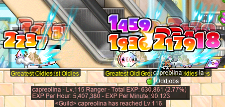
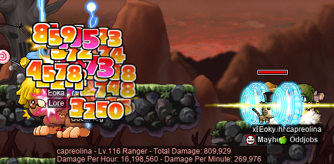
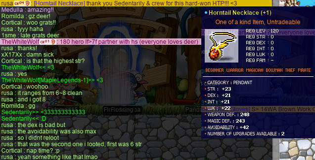

# rangifer’s diary: pt. li

Anniversary event time~!

## Taxonomising odd jobs, pt. i: What even _is_ an odd job, tho? §2

So, in the previous diary entry (in §1 of this part), I talked about taxonomy in general, and biological taxonomy in particular (which we’ll get back to, in later parts of this series). I gave some primitive definitions, which I will be using throughout this series (some of which may be unusual definitions, so you may want to take a look at that if you haven’t already). And, as part of this process of defining, we of course naturally came across the most important — and elusive — definition: what is an “odd job”?

I’ll start off with a small list of some things that I want to say about my conception of what an “odd job” is, and then elaborate on those:

- Defining a particular odd job (e.g. [permawarrior](https://oddjobs.codeberg.page/odd-jobs.html#permawarrior)) is **simple**.
- Insofar as an odd job is “odd”, it is **pure** in its “odd” aspect.
- Each particular odd job satisfies some intuitive notion of **natural**.
- The name that we are choosing to use here, “odd job”, is simultaneously fortunate and unfortunate. The “simplicity”, “purity”, and “naturalness” of odd jobs (as listed previously) justifies the use of the word “job” in the phrase “odd job”.
- Odd jobs are, to the extent possible, **atemporal**. I’m leaving the use of this word intentionally vague, for now.

Now, this is some fairly abstract verbiage here, so I do want to get into some specifics when elaborating on these bullet points. Consider the concrete examples that I use, to be [case studies](https://en.wikipedia.org/wiki/Case_study). There are some important boundary cases, where it is _less_ clear whether some build is (or is not) an “odd job”, and it is [these liminal creatures](https://en.wikipedia.org/wiki/Liminal_being) which do the most to help us clearly define what an “odd job” is.

### Defining a particular odd job is simple

Now, in using the term “simple” here, we of course have to acknowledge that “simple” is a relative — and in some cases, also subjective — term. That being said, odd jobs can generally be defined in terms of a **single** “hook” — to get an idea of what I mean, take a look at some examples:

- An [HP warrior](https://oddjobs.codeberg.page/odd-jobs.html#hp-warrior) is a **warrior who only adds AP into HP**.
- A [permamagician](https://oddjobs.codeberg.page/odd-jobs.html#permamagician) **stays a magician forever**.
- A [woods(wo)man](https://oddjobs.codeberg.page/odd-jobs.html#woodsman) is a **pure STR archer**.
- A [claw-puncher](https://oddjobs.codeberg.page/odd-jobs.html#claw-puncher) is a **claw-user who doesn’t throw projectiles**.
- A [grim reaper](https://oddjobs.codeberg.page/odd-jobs.html#grim-reaper) is any character who **exclusively uses the [Scythe](https://maplelegends.com/lib/equip?id=01312002)**.
- A [LUKless assassin](https://oddjobs.codeberg.page/odd-jobs.html#lukless-assassin) is, well, a **LUKless assassin**. Duh.

Hopefully that gets the idea across. Each one of these definitions _is a full and exact definition_ of the odd job in question — and yet, each one is a single, simple statement. The depth and complexity of odd jobs comes not from the difficulty and intricacy of how they are defined, but rather, this complexity is _emergent_ from the mechanics of the game onto which these odd jobs are grafted. For example, LUKless assassins are the only job in the game that can really make good use of the [Shadow Meso](https://maplelegends.com/lib/skill?id=4111004) skill; this makes LUKless assassins unique and interesting, but _cannot be found anywhere in the definition_ of what a LUKless assassin is.

A job that has a more baroque definition can still be odd (in our sense), but only insofar as it happens to be a restricted version of a particular, more primitive and fundamental, odd job. This more baroque job would be a subjob, in the sense defined previously, of one or more odd jobs. For example, a plumber [brigand](https://oddjobs.codeberg.page/odd-jobs.html#brigand) is defined in terms of a brigand — it is a bandit who fights like a [permabeginner](https://oddjobs.codeberg.page/odd-jobs.html#str-beginner) — but also restricts the weapon choices to an arbitrary set of particular melee weapons (e.g. [Monkey Wrench](https://maplelegends.com/lib/equip?id=01422004), [White Mop](https://maplelegends.com/lib/equip?id=01442022), etc.), based on their aesthetic conformance to the “plumber”/“janitor” aethetic.

### Insofar as an odd job is “odd”, it is pure in its “odd” aspect

Any build (even an optimal one) has restrictions placed on it, even if they are not part of the definition of the build, and even if they are not necessarily desired by a player who is playing such a build. This is because the game itself imposes its own restrictions. For example:

- **Restrictions on base stats**: e.g. anyone who has taken first class advancement as a warrior _necessarily_ has ≥35 base STR.
- **Restrictions on equipment**: e.g. bows that can be equipped by non-archers do not exist.
- **Restrictions on class advancement**: e.g. a character whose class is “archer” (grade 1) cannot class advance to “fighter” (grade 2).
- **Restrictions on SP expenditure**: Characters cannot spend SP on skills that they lack access to, and cannot spend SP that they don’t rightfully gain through levelup and/or class advancement.
- **Restrictions on skill usage**: Some skills can only be used when one of a particular set of weapons is equipped.
- **Restrictions on location**: e.g. any non-permabeginner must leave Maple Island, and can never return.

Optimal builds are only restricted by two things: which throughclass they are defined by, and what restrictions are imposed by the game itself (see the list above). On the other hand, odd jobs must necessarily have another category of restrictions: restrictions that define their odd job. Some examples of these kinds of restrictions are listed in the above “Defining a particular odd job is simple” section; for example, a [woods(wo)man](https://oddjobs.codeberg.page/odd-jobs.html#woodsman) is a **pure STR archer**. This is a restriction on what the archer’s base stats can be, that is not imposed by the game itself.

Again, as expounded in the “Defining a particular odd job is simple” section, these restrictions are indeed simple and singular, and thus we have a single “odd” aspect for each primitive odd job. A corollary of this simplicity is purity; the odd aspect is _taken to a logical extreme_, so as to clearly define the job as odd. This should, and does, polarise the difference between odd jobs and non-odd jobs (especially optimal ones).

As a result of MapleStory being well-understood now, even characters who strictly adhere to a platonic ideal of some particular odd job (I’ll use [dagger assassin](https://oddjobs.codeberg.page/odd-jobs.html#dagger-assassin) as a toy example) _can be highly optimised to the degree made possible by their strict restrictions_. In the case of the dagger assassin, these restrictions include (and are limited to) being an exclusively dagger-wielding assassin(/hermit/nightlord). This exacerbates, in my opinion, the need for pure/strict restrictions on what an “odd job” is, so that odd jobs maintain their identity even in the case where all of the following are true:

- Many builds are highly- or completely-optimised (we defined these as, appropriately, “optimal builds”).
- Many odd-jobbed builds are, insofar as they can be, highly- or completely-optimised.
- Some builds (odd-jobbed or not) are _not_ highly optimised, and thus occupy a grey area w.r.t. their raw “power” in exercising the skills that they possess.

And all of these things _are_ true, so we keep our odd-jobbed restrictions as pure as possible. An example of violating this principle would be “archer with less than 50 base DEX”. This could be considered a _simple_ definition, maybe, but the _purity_ is not there; an archer with 49 base DEX is neither DEXless nor pure DEX.

…Aaaand that’s enough rambling for one entry, so let’s get to the joocy stoof~

## capre is on that grind

With the bonus event EXP, and with anniversary coins dropping from monsters throughout the Maple World, my main goal for this event is to get my [woodswoman](https://oddjobs.codeberg.page/odd-jobs.html#woodsman) **capreolina** to level 120(!) before the end of the event! This is, for better or worse, going to require a truly copious quantity of [CDs](https://maplelegends.com/lib/monster?id=9410031) to be killed. So it is.

Funny enough, during the very earliest bits of the event, I was able to gather enough of the cream puffs (which also drop from any monster, like anniversary coins) to be in the top 10 puff farmers:

And so far, I’ve already got a levelup! Level 116, woohoo!!:

My EPH is, unfortunately, not _quite_ what it would be if I didnt have to go to the [FM](https://maplelegends.com/lib/map?id=910000000) to recast [HS](https://maplelegends.com/lib/skill?id=2311003) on myself… But still very high!!

## Moar odd MPQs

Oh yes, time for moaaar [MPQ](https://maplelegends.com/lib/map?id=261000021)! I was able to do some MPQs with **Boymoder** (**Taima**, **Tacgnol**, **Inugami**, **Numidium**, **Gambolpuddy**, **Hanyou**) the [STRmit](https://oddjobs.codeberg.page/odd-jobs.html#lukless-assassin). With MPQ awarding anniversary points on completion, and with the [Horus’ Eye](https://maplelegends.com/lib/equip?id=01122010) being so much more powerful now (yay!!!), I was expecting more people at MPQ. But it seems that [PPQ](https://maplelegends.com/lib/map?id=251010404) is the choice location to farm PQ points at this level range, and so the MPQ lobby still remains pretty dusty. But we did find some folks to run with, **Kurutak** and **FireHoe**:

MPQ awards 15 anniversary points on completion, which I was pleased to see. At least, until I found out that [LPQ](https://maplelegends.com/lib/map?id=221024500) awards 18 points on completion… It seems that whoever decided the point allocation has no experience with MPQ, otherwise they would have known that MPQ is far more difficult (and often, time-consuming) to clear than LPQ, and in addition, far more difficult to find a party for!

In any case, I was blessed enough to do some more **Oddjobs**-only runs, with **GishGallop** (**Cortical**, **Subcortical**, **Medulla**, **Phoneme**, **MageFP**, **dendrite**, **WizetWizard**, **Amygdala**) the I/L [gish](https://oddjobs.codeberg.page/odd-jobs.html#gish), and **xX17Xx** (**drainer**, **attackattack**, **maebee**, **strainer**) the [permarogue](https://oddjobs.codeberg.page/odd-jobs.html#permarogue):

And, once we were finished, I realised that I had enough [marbles](https://maplelegends.com/lib/etc?id=4001159) to do [Yulete](https://maplelegends.com/lib/npc?id=2112014)’s quests and get my Horus’ Eye!:

Wow… now that’s a pendant!!! :D Here’s hoping I can maybe have my other finished Horus’ Eyes (on characters who have already graduated MPQ) retroactively buffed…? Fingers crossed, although I’m not holding my breath.

## Fighting bosses with xBowtjuhNL, Harlez, Eoka, and Gruzz

I took on a number of bosses with the crew I met when MPQing with my [darksterity knight](https://oddjobs.codeberg.page/odd-jobs.html#dex-warrior) **rusa**! Here I am, [boop](https://maplelegends.com/lib/skill?id=1321003)ing [Ravana](https://maplelegends.com/lib/monster?id=9420014) with my newfound 4th job booping skill:

And an `@dpm` test that I did during a Ravana fight, which I was quite pleased with (this test was done with Ravana on the right-hand side, with me periodically Rushing, and also periodically hitting [underwear goblins](https://maplelegends.com/lib/monster?id=9420013) with my [Crusher](https://maplelegends.com/lib/skill?id=1311001)):

Oh, and we successfully fought Pink Bean… Okay, maybe not the _real_ Pink Bean, but we did do [PBPQ](https://maplelegends.com/lib/map?id=749020910):

And we beat the poofs out of [poof dad](https://maplelegends.com/lib/monster?id=9400569):

And I defeated [Capt. Latanica](https://maplelegends.com/lib/monster?id=9420513) twice with **Gruzz** and **xBowtjuhNL**, so later, when **Eoka** wanted to run, I hopped onto my [STR bishop](https://oddjobs.codeberg.page/odd-jobs.html#str-mage) **cervid** to help fight the ghost downstairs:

And afterwards, we headed to the Phantom Forest to hunt a [Bigfoot](https://maplelegends.com/lib/monster?id=9400575) :O Eoka & Gruzz did an excellent job keeping Bigfoot more-or-less in-place using [Thunderbolt](https://maplelegends.com/lib/skill?id=2201005), and xBowtjuhNL and I (with me playing as my [woodswoman](https://oddjobs.codeberg.page/odd-jobs.html#woodsman) **capreolina**) spammed [Strafe](https://maplelegends.com/lib/skill?id=3211006) and prayed that Bigfoot would not make a run for us. It did, a few times, but luckily there we no deaths. In fact, I was surprised at how quickly we downed the thing (just around 25 minutes), thanks to xBowtjuhNL’s Strafe doing like half a dozen times more damage than mine…

## Entering the money dragon’s lair for the first time

So, as mentioned in a previous diary entry, I planned on getting a [Horntail Necklace (HTP)](https://maplelegends.com/lib/equip?id=01122000) for my [darksterity knight](https://oddjobs.codeberg.page/odd-jobs.html#dex-warrior) **rusa**. Besides the avoidability obviously being really nice (especially with rusa’s avoidability already being naturally high compared to a normal warrior, albeit less so than a [LUK warrior](https://oddjobs.codeberg.page/odd-jobs.html#luk-warrior)), the sheer quantity of DEX and, particularly, STR, actually makes an [egg](https://maplelegends.com/lib/etc?id=4001094)ed HTP considerably better for rusa’s DPS than even a 5 WATK [MoN](https://maplelegends.com/lib/equip?id=01122059)!

**SiriusPlaque**/**SmallMight**, a friend of mine, helped me out with some very useful info about how buying an HTP actually goes down. I had never even been inside of Horntail’s cave before, so I was previously completely unaware of what to expect. In addition, he also pointed me to a friend who was selling HTPs in the near future, and vouched for them. And so I met the **SKIZZY** hosts on their Discord server! SKIZZY are **Sedentarily** (Sky) and **Jubilation** (also **ClickityKlak**; Izzy), along with members of the **Nimbus** guild, such as **cIoudy** and **xiaolongbaoo**.

There were some slight complications in preparing for the run; in particular, the anniversary event maintenance patch had changed a number of things that would significantly impact Horntail runners. Besides the smart buff system being disabled (which I do understand), I can’t say I know nearly enough about how Horntail works to say what these adverse changes were. Something to do with weapon cancel… seduce… In any case, the run was pushed 24 hours into the future. And here’s what Sky had to say in advance of the run:

And so, I prepared for war. I gathered up all the HP gear that I had, and scrolled some new cheap gear to supplement it. I gathered up roughtly 1.5k [PE](https://maplelegends.com/lib/use?id=2000005)s, 600 [ACP](https://maplelegends.com/lib/use?id=2022178)s, roughly 600 [Honster](https://maplelegends.com/lib/use?id=2002021)s, roughly 400 [Grilled Cheese](https://maplelegends.com/lib/use?id=2022189)s, and mentally braced myself for an experience that I had before only read about.

I showed up at [the entrance to the cave of life](https://maplelegends.com/lib/map?id=240040700) roughly half an hour in advance, and cIoudy was kind enough to lead me inside of the cave, where we waited for everyone else to show up:

In the cave of the Horned Tail

Some obscured names here are **Bruiserr**, who is around the centre of the image; **tinyboop**, who is at the top of the image; and **Jubilation**, who is beneath tinyboop. As you can see, I have a [Stolen Fence](https://maplelegends.com/lib/equip?id=01092003) in hand, as that 90 HP fence combined with a 157 HP [Emergency Rescue Tube](https://maplelegends.com/lib/equip?id=01322025) was part of my HP outfit.

Once everyone was ready to go, we headed to meet, uhm, one of Horntail’s heads:

Almost instantly, disaster struck, as tinyboop suffered a crash/disconnect on entering the map. This was particularly unfortunate, as tinyboop was the only archer in the crew, so that meant absolutely no [SE](https://maplelegends.com/lib/skill?id=3121002). This is, needless to say, a general drop in DPS, and quite a precipitous one for [nightlords](https://maplelegends.com/lib/skill?id=4121007) in particular! Things were pretty easy for me in these poking-head stages (the first two stages), as I could cower below the platform (as pictured) and take damage somewhat slowly.

After the first two stages were cleared, it was time to enter the heart of the cave, for real. In this part, the SKIZZY crew would have to combat Horntail in its entirety, with three heads, two arms, legs, and a rather dangerous tail. So, before actually summoning the beast, they set up what Izzy referred to as a “minigame for the buyer”:

The goal of this, erm, minigame, is that I try as hard as I can to stay between the meso coins — and in this case, the giant flashing stars — until, later, they would instruct me to move to the bottom-right corner of the map (where the now-deceased tail once was). I would somewhat periodically get knocked back (towards the left), and have to correct my position to get back into this region. Keep in mind that, throughout all of the fight, I would be anxiously watching both my HP and my buffs (as getting dispelled is somewhat common) in an effort to, you know not die.

Unfortunately, after the disconnecting of tinyboop at the very start of the run, things were not getting any better for the SKIZZY crew. They suffered not one, not two, but _three_ more (for a total of four) unfortunate crashes. The struggle was _very_ real, and after a full two hours of Horntail-fighting, Horntail was very close to total death… but not quite there. Because Horntail has a 2-hour time limit, this meant that the run was a failure, and we all got booted out of the lair. It seemed that, even with the smart buff system being disabled, and with Horntail being significantly harder than it was before the maintenance, the real enemy was not Horntail — it was the game itself, for all of its instability and its fatal bugs.

Needless to say, this was a bit demoralising for everyone, and I personally had just about ran out of potions. I had used nearly all(!) of my PEs and my Grilled Cheeses, although some of the potion loss was just due to sheer terror; I was a little greedy with the PE usage, on account of my “pls stay alive pls stay alive plsstayaliveplsstayaliveplsstayaliveplsstayaliveplsstayaliveplsstayalive” mindset. But the crew took a vote, and decided to continue on to do their second run anyways, as planned. After all, how likely was it to get that unlucky with the crashes again? Some of the crew members kindly supplied me with the extra potions I needed to survive another run, and so off we went!

And thankfully, the second run was indeed far better. As for myself, although I was somewhat fatigued by that point, I was less anxious, as I had already gone through the process before. There _was_ a crash during the third stage, but they were able to pull through and finish within the 2-hour timer.

By this point, I had endured just about four(!) nearly continuous hours of Horntail, and I was pretty pooped. I was able to loot an egg, and some HTPs, and ended up going with the second one that I looted:

Wowza. I love having an equipment item that I will simply never take off; a permanent addition to my combat outfit. And with this, my DPS (and avoidability!) is looking quite a bit more impressive:

Thanks so much, again, to the SKIZZY crew, for enduring Horntail through such adverse conditions, and getting me a lovely Horntail Necklace. <333
