# rangifer’s diary: pt. lii

## Taxonomising odd jobs, pt. i: What even _is_ an odd job, tho? §3

So, in the previous diary entry (in §2 of this part), I came up with a list of some things that I wanted to say about my conception of what an “odd job” is:

> - Defining a particular odd job (e.g. [permawarrior](https://oddjobs.codeberg.page/odd-jobs.html#permawarrior)) is **simple**.
> - Insofar as an odd job is “odd”, it is **pure** in its “odd” aspect.
> - Each particular odd job satisfies some intuitive notion of **natural**.
> - The name that we are choosing to use here, “odd job”, is simultaneously fortunate and unfortunate. The “simplicity”, “purity”, and “naturalness” of odd jobs (as listed previously) > justifies the use of the word “job” in the phrase “odd job”.
> - Odd jobs are, to the extent possible, **atemporal**. I’m leaving the use of this word intentionally vague, for now.

And, I elaborated on the first two items of this list. I want to elaborate on the rest of the items now; but first, I want to point out some things and clarify some terminology.

### A note on “power”

First, I want to make the simple observation that none of the items in the above list make statements about the overall “power” levels of odd jobs. Exactly what “power” even means in this case is dreadfully unclear. I want to mention that [the list of odd jobs which I curate](https://oddjobs.codeberg.page/odd-jobs.html) contains a kind of “power level” associated with each entry, which ranges from one apple (the lowest power) to three apples (the highest power), and is always an integer number of apples, so there are only three distinct possibilities. And, even with this rather loose and impressionistic rule of thumb (which I intended to help people get an idea for whether or not they might like playing a particular odd job), there are many cases in the list where I had a hard time picking how many apples the odd job should get. The overall “power” of a character — or worse yet, of a build — is complex and has many factors which are apparently unrelated to one another. So if a character is good at one thing but not at another, and another character is bad at the former but good at the latter, it can be difficult or impossible to judge which character is more “powerful”.

Someone who wants to include this notion of “power” in their definition of what an “odd job” is, is already frustrated by the inherent difficulty of defining one-dimensional “power”. That’s bad enough as it is, but to make matters worse, there is something intuitively less _natural_ about such a definition. We like to think of the “power” (whatever that may be) of a character as being _incidental_ to the way that their build is defined. For optimal builds, this is pretty straightforward: you just pick a throughclass, and the rest just kind of falls out of that choice (combined with the game mechanics). Each throughclass has its own skills, abilities, access to equipment, etc., and as a result, they are thus stronger or weaker in different ways. To give an odd-jobbed example, consider the [dagger warrior](https://oddjobs.codeberg.page/odd-jobs.html#dagger-warrior) and the [daggerlord](https://oddjobs.codeberg.page/odd-jobs.html#dagger-assassin). These two odd jobs are defined very similarly: you take a nonempty set of throughclasses, and then add the restriction that they can only use daggers. In the case of dagger warriors, the set is {fighter/crusader/hero, page/WK/paladin, spear(wo)man/DrK/DK}, and in the case of daggerlord, the set is {assassin/hermit/nightlord}. And yet, these two odd jobs differ considerably in their “power” in different areas. We generally expect that a dagger _sader_ does an incredible amount of DPS (for an odd job, at least), something like 2~3 times as much as the daggerlord of the same level. On the other hand, the daggerlord has their own tricks up their sleeve: [Haste](https://maplelegends.com/lib/skill?id=4101004), [Flash Jump](https://maplelegends.com/lib/skill?id=4111006), [MU](https://maplelegends.com/lib/skill?id=4111001), [Dark Sight](https://maplelegends.com/lib/skill?id=4001003), very high AVOID, more stable damage, etc. The complexity and nuance of the differences between these two odd jobs — including whatever their “power(s)” is/are — comes not from their definitions (as their definitions are both very simple, and both nearly identical), but rather are incidental.

To make things even slightly worse, odd jobs are apparently not very clustered together in terms of “power”, whatever that is. Consider the [besinner](https://oddjobs.codeberg.page/odd-jobs.html#besinner), who lacks the ability to fight very well (no actual range, because no [KE](https://maplelegends.com/lib/skill?id=4000001), but at the same time, in melee they can only claw-punch for roughly 1 damage per hit), lacks any serious single-target DPS (the rule of thumb that I often tout is “roughly ⅓ of the DPS of a [STRginner](https://oddjobs.codeberg.page/odd-jobs.html#str-beginner) of the same level”), and lacks any skills beyond 0th job. If we are to compare besinners to other odd — but apparently more robust — jobs like [DEX warrior](https://oddjobs.codeberg.page/odd-jobs.html#dex-warrior), our image of “what the power of ‘an odd-jobbed character’ is like”, must be blurry beyond comprehension.

All of that being said, we will come back to questions of “power” later on, and we will see how to resolve some of the ambiguity between a build which is “odd” versus a build which is “merely suboptimal”.

### A smol clarification of terminology

In §1 of this part, we defined terms like **build**, **job**, and **subjob**. When I am making statements here like “defining a particular odd job is simple”, the use of the term “job” (as in “odd job”) is crucial. An odd **job** is the most _abstract_, and within it, there are zero or more possible **subjobs** that could possibly be defined. The statements that I make about odd **jobs** (e.g. that they are defined in a way that is simple) don’t necessarily apply to odd **subjobs**. And odd **builds** are neither jobs nor subjobs; they are, by definition (because they are _odd_ builds), _associated_ with (at least) one odd **job**, and also with zero or more subjobs. The idea of a build being “associated with” a job (or subjob) can be thought of as a [set membership][element] relation (a job/subjob being thought of as an effectively-infinite set of builds that share common traits, the traits being what define the job/subjob). To make this a little more concrete, I will use my undead [daggermit](https://oddjobs.codeberg.page/odd-jobs.html#dagger-assassin) **alces** as an example:

- **IGN:** `alces`.
- **Level:** 82.
- **Build:** whatever alces’s build is (this includes my skill build, AP build, my equipment, etc.).
- **Job(s):** [stab sin](https://oddjobs.codeberg.page/odd-jobs.html#dagger-assassin).
- **Subjob(s):** DEXless stab sin, …
- **Throughclass:** {assassin, hermit, nightlord}.
- **Class:** hermit.
- **Grade:** 3.
- **Class progression (so far):** beginner → rogue → assassin → hermit.

The ellipsis at the end of the “Subjob(s)” entry indicates that we could, maybe (at least, in principle), concoct more subjobs that alces fits the definition for. This would be in addition to “DEXless stab sin”, which I think is a reasonably-defined subjob that alces does in fact qualify as (for now!). If I were to start adding base DEX, I would no longer be DEXless, and thus the set of subjobs that alces qualifies as would probably just be [the empty set](https://en.wikipedia.org/wiki/Empty_set).

Also note that while all characters are associated with some **class** and some **grade**, a character whose **grade** is strictly less than 2 is not associated with any particular **throughclass**.

### Each particular odd job satisfies some intuitive notion of natural

The first thing to note here is that this assertion is closely related to the assertion that “defining a particular odd job is simple”. Simplicity and naturalness are, in this case, related, although the addition of a “naturalness” requirement (on top of the simplicity requirement) does a little bit of cleanup, helping to further clarify exactly what sets of builds fit our [platonic](https://en.wikipedia.org/wiki/Platonic_forms) conception of an “odd job” (including separating out strictly-subjobs from proper jobs).

And, again like in the case of “simplicity”, “naturalness” is a nebulous term that is almost always relative — and in some cases, subjective. This time, I think some more examples are what we need:

- **Grim reaper vs. janitor/plumber:** As [can be seen](https://oddjobs.codeberg.page/odd-jobs.html#grim-reaper), in the list of odd jobs that I curate, the grim reaper gets its own entry. Janitors/plumbers are, at least superficially, pretty similar, right? Both are rogues who forfeit the usual armaments (claws, daggers) in favour of a deeply restricted set of melee weapons. But besides a possible simplicity argument (janitors/plumbers are restricted to an arbitrary set of individual weapon IDs, whereas grim reapers are just restricted to a single ID), the real reason why janitors/plumbers are restricted to merely a subjob (an odd subjob, at that) is because of the grim reaper’s _naturalness_. The very existence of the [Scythe](https://maplelegends.com/lib/equip?id=01312002) (well, it doesn’t exist in-game in MapleLegends, but it has been in MapleStory’s \*.wz files for a very long time, likely since beta versions of the game, and thus exists in MapleLegends’s data) begs for the grim reaper as an odd job. The reason is that _no build which is not a grim reaper would reasonably seriously use this weapon_. It is a truly _bizarre_ weapon: a one-handed axe that is, mysteriously, only equippable by rogues, and has stat requirements that one would expect of a rogue weapon of its level. It even requires a significant amount of LUK to wield (35). On the other hand, the restriction placed on plumbers/janitors is based on _aesthetic_ reasoning, and includes the use of weapons that are common to many jobs.
- **The brigand:** One odd job that is universally accepted as an odd job in every sense (particularly because of its age) is the [brigand](https://oddjobs.codeberg.page/odd-jobs.html#brigand). But, at the same time, the brigand is a job which might arguably fail the simplicity test. Brigands are characters of the bandit/CB/shadower throughclass who are LUKless. But that’s not all: brigands are _also_ disallowed from using daggers. This separates brigands from their [LUKless dit](https://oddjobs.codeberg.page/odd-jobs.html#lukless-bandit) cousins (who are not required to use daggers _per se_, but do use daggers as their primary weapons), but also complicates the definition of “brigand” somewhat. This is a somewhat delicate and subtle issue, which we may or may not get back to later, but suffice it to say that there’s more than one way to solve this apparent conundrum:
    - Accept that “dit who is LUKless and doesn’t use daggers” is a definition of “brigand” that is simple enough.
    - Accept that “brigand” is not an odd _job_ at all, but rather, is best thought of as a _subjob_ of LUKless dit.
    - Define brigands in a different way: a “brigand” is a dit who fights like a [permabeginner](https://oddjobs.codeberg.page/odd-jobs.html#str-beginner).
    - Lift the restriction that brigands must be LUKless.
    - Lift the restriction that brigands must be LUKless, and disallow them from using all “rogue-type” weapons (viz. claws & daggers), rather than just disallowing daggers.

    Even if we don’t necessarily pick one of these options (either because we pick something else entirely, or pick nothing at all), we want to think about why we have this issue in the first place. We generally accept that brigands are an odd job, and historically they have been one of the most primitive of all odd jobs — along with other “jobbed beginners” like [STR mages](https://oddjobs.codeberg.page/odd-jobs.html#str-mage) and [woods(wo)men](https://oddjobs.codeberg.page/odd-jobs.html#woodsman). I want to argue that the reason for this _is because of how “natural” brigands are, as a job_. Anyone who has played MapleStory before knows how it works: you have stick in hand (or hands, as the case may be), you whack snail with stick, snail dies, you get EXP and loot. Rinse and repeat. In this process, the first stat that becomes most important is STR. More STR means more strength, more strength means harder whack, harder whack makes more snails die, more snails dying means more EXP and loot for you. Of course, as MapleStory veterans, we know that all four main stats (STR, DEX, INT, LUK) have their uses, and all can be extremely powerful, depending on your build and on what you’re doing. But in this pure and unadulterated state of snail-whacking, there is only basic-attacking. And the simple beauty of MapleStory in its most primaeval form is something that permeated the earliest stages of the game’s life, and something that continues to permeate our conception of so-called “odd jobs”. When I say that this “is something that permeated the earliest stages of the game’s life”, you should think of some of the weapons which have been with us since version 1 (or rather, since beta versions of MapleStory): think of the [Metal Axe](https://maplelegends.com/lib/equip?id=01412001), the [Wooden Mallet](https://maplelegends.com/lib/equip?id=01422000), the [Monkey Wrench](https://maplelegends.com/lib/equip?id=01422004), the [Fusion Mace](https://maplelegends.com/lib/equip?id=01322004), etc. The latter is the only weapon listed here that is not equippable by brigands, as it is restricted to only warriors and mages. But what these weapons have in common, is that they are restricted in what classes can use them, and yet these restrictions allow classes which cannot idiomatically make use of the weapons. Yes, rogues can use the Metal Axe, but why would they? It’s a two-handed axe, so the main stat for its damage is STR, and the only other stat that contributes to its damage at all is DEX. But rogues are LUK-focussed! It seems that such weapons (often referred to as “jobbed beginner weapons” or similar) were designed by Wizet/Nekksyn with exactly this use-case in mind: that of the jobbed beginner. And the brigand is the prime example of a rogue-based jobbed beginner (although we shouldn’t forget the related, but very distinct, [LUKless assassin](https://oddjobs.codeberg.page/odd-jobs.html#lukless-assassin), which is _also_, of course, considered its own odd job).
- **The pugilist:** In a similar vein to the grim reaper example given above, the [pugilist](https://oddjobs.codeberg.page/odd-jobs.html#pugilist) is another odd job that seems to be directly suggested by the game-world itself. Pirates were a relatively late addition to the game (arriving after the addition of third (and maybe also fourth??) job, if I remember correctly), but they completed the six-part categorisation of all classes (beginner, warrior, mage, archer, rogue, pirate) that would continue to categorise all classes, even after Big Bang and through the present day. One of the things that pirates brought to the game was very simple: pirates are the only characters with the distinct privilege of being able to fight with their birthday suit on. And thus, the pugilist was born. One thing to note here is that “pugilist” usually refers only to pugilists of the brawler/marauder/buccaneer throughclass, because this is the most “natural” incarnation due to unarmed fighting being treated similarly to knuckle-wielding in many (but certainly not all) ways. But it is perfectly coherent to imagine a pugilist [punch slinger](https://oddjobs.codeberg.page/odd-jobs.html#punch-slinger)!
- **The islander/camper:** When it comes to location-based restrictions, the odd jobs that we have are some mixture of [islanders](https://oddjobs.codeberg.page/odd-jobs.html#islander) and [campers](https://oddjobs.codeberg.page/odd-jobs.html#camper). These clearly meet the “simplicity” requirement; for example, campers are simply defined as “any build which never leaves the Training Camp”. But this simplicity brings us to ask about other location-based restrictions. There are a few of these that have been done before or have been floated around as ideas for character builds, but perhaps the most salient example is the so-called “Sleepywood-locked challenge”. Being Sleepywood-locked (or not being so) _is_ a part of a given character’s build, as defined in §1. So it might be natural to ask: is a build “odd” simply by being Sleepywood-locked? The answer is, I think, pretty clearly “no”:
    - Maple Island and the Training Camp are both areas that can never be re-entered after they are exited. They are also areas that every character is essentially forced to go through, with the exception of Maple Island — Maple Island is optional, but only for campers! The same cannot be said of Sleepywood; Sleepywood would appear to just be a random area of the game which can be passed through for various reasons, or not, and can be entered and exited at will (and indeed, the Sleepywood-locked challenger has to briefly leave Sleepywood whenever they advance from grade 1 (or any higher grade) to the next). This is where the notion of “naturalness” comes in; both Maple Island and the Training Camp are _natural_, primitive choices for a location-based build restriction, and the same cannot really be said of any other areas in the game.
    - Because islanders and campers share the trait of never setting foot on Victoria Island, they are necessarily [permabeginners](https://oddjobs.codeberg.page/odd-jobs.html#str-beginner). Because we already consider all permabeginners (in the most general sense) to be odd, this makes all islander and camper builds odd by necessity. The same cannot be said of Sleepywood-locked characters, who are not necessarily permabeginners, and are not necessarily perma-firsts (builds that are permanently grade 1, e.g. [permawarrior](https://oddjobs.codeberg.page/odd-jobs.html#permawarrior)), and therefore can be played as simply Sleepywood-locked versions of optimal builds. “Sleepywood-locked permawarrior” is certainly odd, but is not an odd job; it would be a subjob of permawarrior. Because permawarrior is an odd job, this would make Sleepywood-locked versions odd as well. But any Sleepywood-locked ordinary warrior is not odd at all.

Okay, okay, I didn’t get as far as I thought I would before this started getting too wordy (and taking way too damn long to write), so I’ll stop here for now :)

## Some more odd MPQs~

Some guildmates and I (**GishGallop**/**Cortical**, **xX17Xx**, **Boymoder**) were back at it again with the [MPQ](https://maplelegends.com/lib/map?id=261000021)QQQQQQs~

It was our mission to get Cortical (the [STRginner](https://oddjobs.codeberg.page/odd-jobs.html#str-beginner) of the group) a brand spankin’ new [Horus’ Eye](https://maplelegends.com/lib/equip?id=01122010), and to get Boymoder (the [STRmit](https://oddjobs.codeberg.page/odd-jobs.html#lukless-assassin) of the group) an even _more_ brand spankin’ new Horus’ Eye — poor Boymoder completed (and indeed, perfected, passing all 3 slots) her Horus’ Eye _just before_ the maintenance that would buff the Horus’ Eye tremendously. And in this, we were successful!

Here I am, messing around with my single solitary SP that I spent on [Shadow Partner](https://maplelegends.com/lib/skill?id=4111002) for vanity:

")

And here we are, absolutely laying waste to [Angery Franky](https://maplelegends.com/lib/monster?id=9300140):

Now Franky truly knows the pain of being assailed by three odd-jobbed rogues at once!!

## Welcome LawdHeComin to Oddjobs!

We actually stopped MPQing for a bit because we saw **LawdHeComin** [item smega](https://maplelegends.com/lib/cash?id=5076000) a [STR mage](https://oddjobs.codeberg.page/odd-jobs.html#str-mage)/[gish](https://oddjobs.codeberg.page/odd-jobs.html#gish) robe that he’d made. I was actually aware of LawdHeComin’s character, around when my STR bishop **cervid** was but a wee baby, someone (I forget who) told me that LawdHeComin was the highest-level STR mage on MapleLegends. But it appeared he was inactive, having reached level 120 and stopped there. So I was (and so were the rest) surprised to see him online, and I decided to head to the [FM](https://maplelegends.com/lib/map?id=910000000) to say hi! I asked about his build, and later asked if he was interested in joining Oddjobs (as he was guildless at the time), and he said yes!

The first thing I asked LawdHeComin was whether he was a STR mage or not. He said yes, and so I said that I was as well. But we found out slightly later that LawdHeComin is actually an F/P [gish](https://oddjobs.codeberg.page/odd-jobs.html#gish), with some 200 or so base INT. This is a common point of confusion, as we often think of STR mages as being both INTless and LUKless (which is how I define them in [the list of odd jobs that I curate](https://oddjobs.codeberg.page/odd-jobs.html)), but historically, “STR mage” has been an umbrella term for _any_ mage builds who add base STR. The development of more modern terms to distinguish different types of odd mage builds, like “mixed attacker”, “gish(let)”, etc., is a recent development (relatively speaking).

## capre contends with rusa for the title of “ever-gaping maw into which all CDs must go”

It just isn’t another diary entry without some more ruthless and tireless [CD](https://maplelegends.com/lib/monster?id=9410031) annihilation. In my quest to ascend **capreolina** to the honourable rank of [woodsmaster](https://oddjobs.codeberg.page/odd-jobs.html#woodsman), I have once again deleted many a braincell in the pursuit of mass CDstruction.

I was joined by **Tacgnol** (**Taima**, **Boymoder**, **Numidium**, **Hanyou**, **Gambolpuddy**, **Nyanners**, **Inugami**, **Yotsubachan**), the F/P arch[gishlet](https://oddjobs.codeberg.page/odd-jobs.html#gishlet)! It was truly a strong CDs duo, with capreolina covering the top platform, and Tacgnol commanding the bottom two platforms with the almighty [Meteor Shower](https://maplelegends.com/lib/skill?id=2121007):

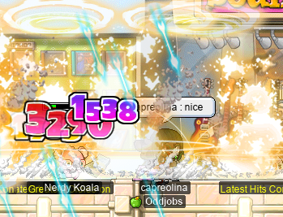

I did a quick `@epm` test, with some very nice results:

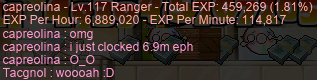

And now capre is level 117!

Wait, no; not pictured is capre hitting level _118_!! Getting closer~ :P

## PQing for pointz

With the anniversary event allowing us to purchase boxes full of random maple equipment goodies (and, in many cases, not-so-good-ies, but oh well), I have been spending every last point on the damned things. And as my thirst for maple equipment is unquenchable, so is my thirst for points. And a fun and efficient way to rack up the points is PQing! I did some [OPQ](https://maplelegends.com/lib/map?id=200080101)s with my pure LUK assassin OPQ mule, **sets**, and also got her her first [Goddess Wristband](https://maplelegends.com/lib/equip?id=01082232). The wristband used to be awarded for 40 full OPQ completions, but was just tweaked to a much more reasonable number of 20 completions; and, its stats were buffed, including making every clean wristband give exactly 3 WATK! So there was a chance for me to turn this thing into a glove better than the 12 WATK [Green Mittens](https://maplelegends.com/lib/equip?id=01082228) that I usually share between my characters. Because the wristband is untradeable anyways, and because [GFA60](https://maplelegends.com/lib/use?id=2040804)s are not terribly expensive, I tried my hand at passing every slot (to attain, ideally, a 13 WATK glove). And, uhm, somehow it worked:

Wow. If only I had this glove on, you know, a character I actually cared about (sorry, sets)! Even so, I was very pleased to make this amazing glove, and hopefully sets can make good use of it in the future. And, in any case, I did use it well in the OPQ runs I did for a couple points.

I have, as readers of this diary will know, an [LPQ](https://maplelegends.com/lib/map?id=221024500) mule by the name of **sorts**; sorts is a pure [DEX brawler](https://oddjobs.codeberg.page/odd-jobs.html#dex-brawler) who is very capable of fulfilling both the range _and_ thief-portal duties of LPQ, just like a sin or sindit. So I did some LPQs~

Here I am, fighting [nippled whale boss](https://maplelegends.com/lib/monster?id=9300012) alongside pure [STR cleric](https://oddjobs.codeberg.page/odd-jobs.html#str-mage) **Numidium**:

And later, I did some guild-only trio LPQ runs with the fine folks of **Pals** (in this case, **jule** and **Pasta**)! The first run, I made the grave mistake of doing what I usually do in [stage 7](https://maplelegends.com/lib/map?id=922010700): killing the three rats, and then coming down to help kill the [Rombots](https://maplelegends.com/lib/monster?id=9300010) (which, due to what I can only imagine is a typo, are internally referred to as “Rombads”). This left us rather, uhm, paralyzed, as my gun was not much use in a sea of bots, and I didn’t have a real knuckler to use, and jule and Pasta were [washing](https://maplelegends.com/lib/cash?id=5050000) just a little too hard to take care of it for me:

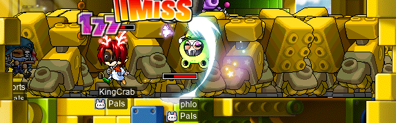

So, needless to say, we killed the Rombads individually in future runs. Oh, and we were also joined for 2 or 3 runs by Numidium!

## Bossing with ducklings, Gruzz, xBowtjuhNL, Eoka

It is time for more bossing and anni event goodies with **rusa**’s MPQ gang~

First, I helped out **xBowtjuhNL** with forming a PBPQ party, and we slayed the Pink Bea(n)st together:

And then it was time for some [Capt. Lat](https://maplelegends.com/lib/monster?id=9420513), with me playing my pure [STR bishop](https://oddjobs.codeberg.page/odd-jobs.html#str-mage) **cervid**:

And later, we were joined by **ducklings** (joyce), [STRginner](https://oddjobs.codeberg.page/odd-jobs.html#str-beginner) of **DuckNation**, who has learned the art of staying alive in Capt. Lat by staying inside of the boss as often as possible:

The really deadly bit of Capt. Lat’s arsenal is not his touch attacks, but rather, his magic attacks (in which he sends a boat zooming towards the players). With each magic attack dealing roughly four thousand damage, even [HB](https://maplelegends.com/lib/skill?id=1301007) was not going to be enough to let ducklings take a magic hit. So, by constantly taking touch damage, the magic attacks can (ideally) be completely avoided. But, of course, this is not an infallible process… Luckily, cervid has [the power to reverse death](https://maplelegends.com/lib/skill?id=2321006), and so I would be able to bring her back if she did die. Unfortunately, having never actually used the Resurrection skill yet, I had a bit of trouble figuring it out when I first had the chance to use it. As a result, rather than bringing ducklings back to life, I only managed to keep her company in the afterlife:

Oops.

While waiting for reset to come so that we could try again, I tried out the anniversary event JQ (the one with the gingerbread peoples walking around looking menacing). I was pitted against ducklings and **Gruzz** in a race to the finish, but with the knowledge that I just had to be patient, and with [RNG](https://en.wikipedia.org/wiki/Random_number_generation)sus on my side, I emerged victorious:

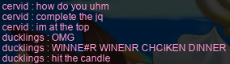

The JQ actually yields a very high points/hour ratio; each completion seems to take roughly 3~6 minutes if you’re patient, and a completion is worth 15 points. So I can see why the JQ is limited to 5 completions per week. That being said, I don’t really find it all that entertaining, so I think I’d rather just PQ anyways :P

And with that, reset had come, and we tried again; this time, ducklings _did_ manage to survive, and get those joocy points:

Another day, I did a few [PPQ](https://maplelegends.com/lib/map?id=251010404)s with Gruzz and ducklings, playing my [swashbuckler](https://oddjobs.codeberg.page/odd-jobs.html#swashbuckler) **hydropotina**:

And we later left PPQ to do some [Ravana](https://maplelegends.com/lib/monster?id=9420014) runs~! I had the idea of taking not just my [darksterity knight](https://oddjobs.codeberg.page/odd-jobs.html#dex-warrior) **rusa**, who could provide [HB](https://maplelegends.com/lib/skill?id=1301007) and help control Ravana with [Rush](https://maplelegends.com/lib/skill?id=1321003), but also cervid, who could provide the [Resurrection](https://maplelegends.com/lib/skill?id=2321006) necessary for ducklings in the event of an untimely death. This proved to be rather difficult, as I had some 10 or so buffs that I had to keep up, between my two characters combined, and in our first run, ducklings was AFK and forgot to turn on pet autopot, so I was forced to make use of my somewhat underwhelming STR bishop [Heal](https://maplelegends.com/lib/skill?id=2301002)s. All this while attacking Ravana, and corraling Ravana with Rush…

This first run did not work. ducklings died, but so did cervid, thanks to a pet autopot failure (or maybe my inability to keep all of buffs up consistently; I’m not sure). And the deaths were mostly because I accidentally tapped my left arrow key before Rushing, and Rushed Ravana towards ducklings and cervid…

But the next run was much better! ducklings still died, but I was able to successfully Resurrect her mid-battle, and then she survived all the way to the end!:

And with that, ducklings was able to get a Ravana Helmet (although [a fake one](https://maplelegends.com/lib/equip?id=01002581), at that), so we all had Ravana Helmets and could form SCARY GANG:

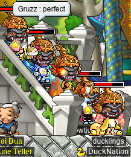

Terrifying to behold.

## rusa does some more fourth job skill quests

I did some more fourth job skill quests on my [darksterity knight](https://oddjobs.codeberg.page/odd-jobs.html#dex-warrior) **rusa**! First and foremost was to obtain [Berserk](https://maplelegends.com/lib/skill?id=1320006), so that I could spend the last of my three job advancement SPs. So I headed to [the bottom of the Helios Tower](https://maplelegends.com/lib/map?id=222020000) to meet with [Wiz the Librarian](https://maplelegends.com/lib/npc?id=2040052):

Wiz told me of an ancient and most powerful warrior named **Sayram**. Sayram is said to have mastered all three paths of the warrior: hero, paladin, and dark knight. Although this is clearly a legendary figure, it is commonly believed that Sayram was indeed a real historical figure… Although Sayram’s historicity could be called into question just due to the lack of knowledge about them. So, this was my quest: to investigate the artefacts left behind (and hopefully, still intact in one form or another) by the near-mythical Sayram.

I was told to head to [Leafre](https://maplelegends.com/lib/map?id=240000000), where I was told by the chieftain that [Griffey](https://maplelegends.com/lib/monster?id=8180001) was Sayram’s favourite creature; a creature that, in fact, Sayram used to ride, and who permanently bore Sayram’s necklace. My task was to recover this necklace:

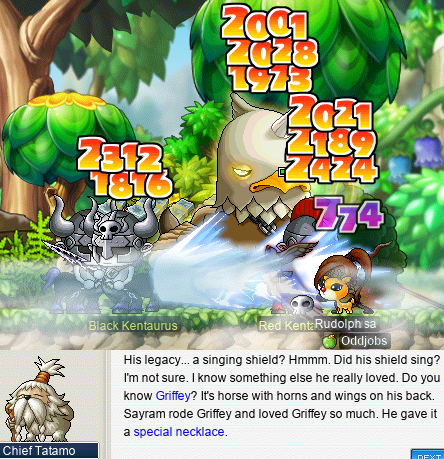

With the necklace successfully recovered, I went back to the chieftain. Wiz had mentioned to me a [singing](https://en.wikipedia.org/wiki/Acoustic_resonance) shield (apparently, the shield of Sayram), but the chieftain knew nothing of this shield — however, he knew someone who might.

So I headed into the deepest parts of Sleepywood:

To meet the **Insignificant Being**, who I think is perhaps a bit too hard on himself:

Luckily for me, the Insignificant Being had, in fact, some knowledge of this legendary shield. Apparently, if the shield were somewhere, it would be inside of a long-forgotten and abandoned shrine buried in the extremal reaches of Sleepywood’s sanctuary. This sounded just fine to me — but of course, there was a catch: the shrine is locked to outsiders. The only way to gain entry to the shrine is to obtain a special key… unfortunately for me, this special key is guarded by none other than the [Jr. Balrog](https://maplelegends.com/lib/monster?id=8130100). Now, be it due to sheer juniority, or perhaps due to some other reasons, Jr. Balrog is kind of a chump. This balrog has a mere 50k HP, but, the real challenge is not killing one, but rather _finding_ one to kill in the first place. So I headed to the sanctuary where Jr. Balrog resides:

And luckily, I was able to track one down after not too long:

And lo, there the key was!:

Armed with this strange-looking and cumbersome key, I was able to gain entry to The Forgotten Shrine:

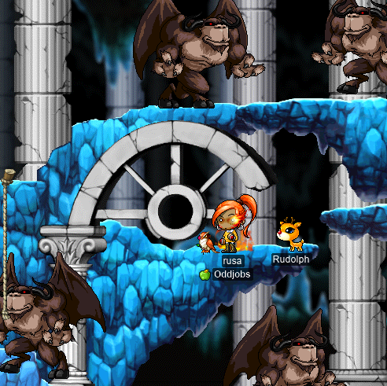

I was rather shocked to discover a veritable swarm of Jr. Balrogs inside of this forgotten shrine, but after killing them (and realising that they do not, in fact, drop the shield), I headed through the next portal into the upper region of the shrine. And there was a shield — actually, multiple shields, it seemed — encased in a thick layer of blue rock characteristic of deep Sleepywood. With a couple of well-placed whacks, I freed the shield from its petrification:

And with the shield (and key) in hand, I headed back to the Helios tower (through the Nautilus → Omega warp portal, to quickly get me from Victoria Island to Ludus Lake):

And with this singing shield, a strange key to a long-forgotten shrine, and a necklace that once belonged to Sayram (or rather, to Griffey…), I reported back to Wiz. As a reward for my efforts, and because Wiz apparently judged me a mighty warrior (debatable), Wiz bestowed upon me the teachings of one of Sayram’s most fearsome moves: Berserk.

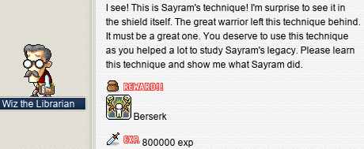

And, in parting, Wiz hoped that I would live up to the legend of Sayram (a bit of a high bar to set, but I’ll try my best), and that one day, he may be able to read of my adventures in the library…

With my single remaining SP now spent in Berserk, I went to try it out for the first time:

Wow… it may not be super usable yet (the zerk threshold for me, at this point, is roughly 3240 HP), and it may not give nearly as much extra damage at level 1 as it does at level 30, but that is still downright impressive. The damage boost is absolutely massive; at this rate, I almost feel like a normal warrior…

And with Berserk acquired, I went to unlock the [Hex of the Beholder](https://maplelegends.com/lib/skill?id=1320009) and [Aura of the Beholder](https://maplelegends.com/lib/skill?id=1320008) skills. This brought me to [the underbelly of the Ludibrium Clocktower](https://maplelegends.com/lib/map?id=220050300), where I was told by [Mr. Bouffon](https://maplelegends.com/lib/npc?id=2041021) (and likewise, by [Flo](https://maplelegends.com/lib/npc?id=2041023)) of the former evils of the Beholder. The Beholder who, I might remind you, is now my pet:

Apparently, blue is the colour of evil! And apparently, I just need some special scrolls with the right words to unlock the inner powers of the Beholder. These scrolls are dropped by [Thanatos](https://maplelegends.com/lib/monster?id=8170000) and [Gatekeeper](https://maplelegends.com/lib/monster?id=8160000), so off I went:

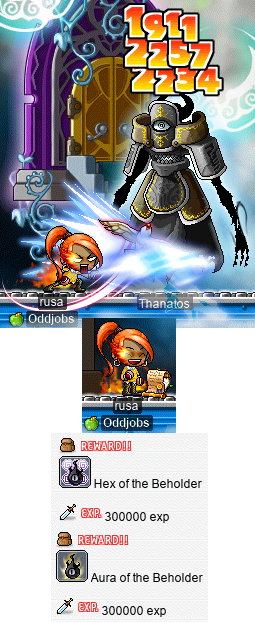

Hooray for unlocking skills that I will never have enough SP to actually put points into! But that’s not all; by collecting hundreds of [Binding Bridles](https://maplelegends.com/lib/etc?id=4000148) from [MDT](https://maplelegends.com/lib/monster?id=7130300)s, and hundreds of [Viking Sails](https://maplelegends.com/lib/etc?id=4000134) from [Spirit Vikings](https://maplelegends.com/lib/monster?id=8141000), I could increase the caps on the levels of these skills. Now, with these skills being effectively unattainable for me, the cap doesn’t actually matter, but I did start working on one of the quests, just to see if it gives some EXP as well:

Zzzzzzerk!

## Behold, these tripartite knives forged in the image of the Shadowknights’ ancient recipe: the Balanced Fury

So, I’ve been collecting [Black Crystal Ores](https://maplelegends.com/lib/etc?id=4020008) for a long time now, in the hopes of crafting my own set of [Balanced Fury](https://maplelegends.com/lib/use?id=2070018). I get most of these ores, as you would expect, from [CD](https://maplelegends.com/lib/monster?id=9410030)s, although I’ve also got some from other monster drops, as well as from PQ rewards. With the sudden changes to throwing stars in the anniversary patch, Balanced Furies are considerably more expensive now, including the [taos](https://maplelegends.com/lib/etc?search=tao) necessary to craft them. This was a bit unfortunate for me, but I was determined to follow through and finish the craft, so I refined the ores that I had:

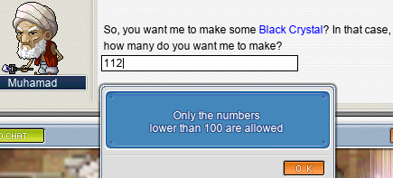

And I hunted for 30(!) [Typhon Feathers](https://maplelegends.com/lib/etc?id=4032005), which is really more annoying than could possibly be warranted. But I did get all 30 myself, and with a [Tao of Shadows](https://maplelegends.com/lib/etc?id=4032015) gifted to me from Noam (**OmokTeacher**, **Slime**), plus one of each of the other taos purchased on the FM, I forged the stars myself:

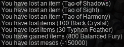

:O

Now, that being crafted, I must say that I don’t have any characters who can really use it yet, besides my I/L [magelet](https://oddjobs.codeberg.page/odd-jobs.html#magelet) **cervine** (who is now in possession of a [Sweet Fork Cake](https://maplelegends.com/lib/equip?id=01472088), yay!!). The Balanced Fury has a minimum level requirement of 70, but I can nearly promise that I will be seriously using these stars in the future! And, in any case, these are stars worth sharing; both mae (as her [permarogue](https://oddjobs.codeberg.page/odd-jobs.html#permarogue), **xX17Xx**) and Kelsey (as her [STRmit](https://oddjobs.codeberg.page/odd-jobs.html#lukless-assassin), **Boymoder**) can make very good use of these things already!

[element]: https://en.wikipedia.org/wiki/Element_(mathematics)
[set]: https://en.wikipedia.org/wiki/Set_(mathematics)
