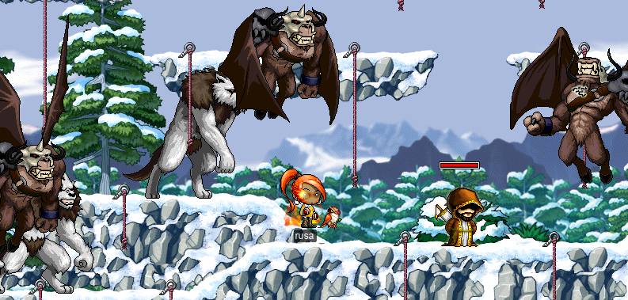
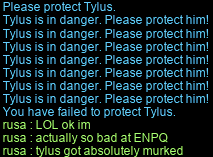
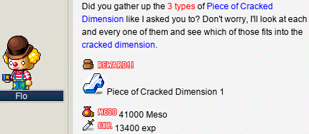
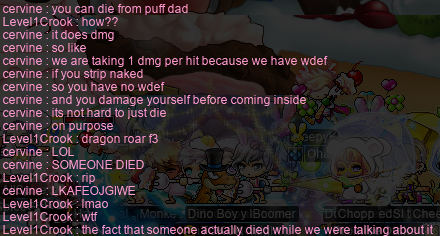
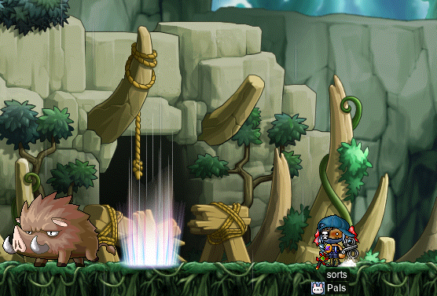
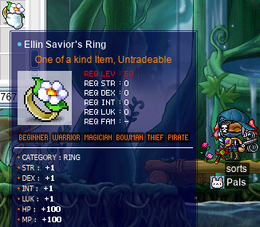
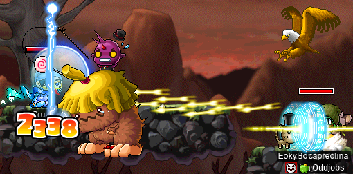
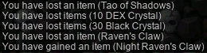
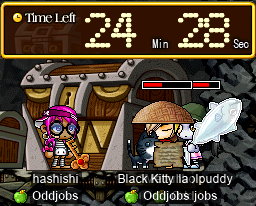
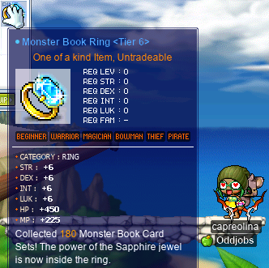

# rangifer’s diary: pt. liii

## Taxonomising odd jobs, pt. i: What even _is_ an odd job, tho? §4

So, in a previous diary entry (in §2 of this part), I came up with a list of some things that I wanted to say about my conception of what an “odd job” is:

> - Defining a particular odd job (e.g. [permawarrior](https://oddjobs.codeberg.page/odd-jobs.html#permawarrior)) is **simple**.
> - Insofar as an odd job is “odd”, it is **pure** in its “odd” aspect.
> - Each particular odd job satisfies some intuitive notion of **natural**.
> - The name that we are choosing to use here, “odd job”, is simultaneously fortunate and unfortunate. The “simplicity”, “purity”, and “naturalness” of odd jobs (as listed previously) > justifies the use of the word “job” in the phrase “odd job”.
> - Odd jobs are, to the extent possible, **atemporal**. I’m leaving the use of this word intentionally vague, for now.

And, so far, I’ve elaborated on the first three of these five items. Here, I want to elaborate on the remaining two.

### The name that we are choosing to use here, “odd job”, is simultaneously fortunate and unfortunate

On the one hand, the term “odd **job**” correctly emphasises that _odd jobs are **jobs** in their own right_. Odd jobs have their own restrictions ­— just like the jobs laid out by Wizet/Neckson place restrictions on what equipment you can wear, what your base stats are (e.g. warriors must have ≥35 base STR), etc. — they have their own playstyles, they have their own unique interactions with the game mechanics, and so on.

But, on the other hand, the use of [the English word “odd”](https://en.wiktionary.org/wiki/odd#English) is perhaps unfortunate; “odd” is a pretty general word that can apply to just about anything that is perceived as being “off the beaten path” by any degree, slight or otherwise. From elaborating on the previous three points, it should be somewhat clear now that what we mean by “odd job” is quite a bit narrower than “any build which might be considered unusual”. I’ve received, over time, a number of (usually joking) applications to the Oddjobs guild that play on the nebulousness of the word “odd” — can I join if I’m a [pure INT assassin](https://maplelegends.com/lib/cash?id=5050000)? Or perhaps if I’m an INT mage, with >4 base LUK in order to wear [jobbed equipment](https://maplelegends.com/lib/equip?id=01382051)? Or perhaps if I’m a paladin? You know, just a STR paladin, nothing like a [blood paladin](https://oddjobs.codeberg.page/odd-jobs.html#hp-warrior) or [DEXadin](https://oddjobs.codeberg.page/odd-jobs.html#dex-warrior), or anything like that.

What I want to emphasise is that the perceived “oddness” of odd jobs is, in many ways, _incidental_. An odd job arises when a **simple** and **natural** approach to building/playing a character is taken to its logical conclusion, _and_ that approach _just so happens_ to be clearly suboptimal in one way or another. This suboptimality is _not_ a defining feature of the odd job; as discussed in §3, it is essentially impossible to define oddness in terms of “power”/“optimality”/whatever. Rather, the reason that I mention this perceived suboptimality is because it inevitably leads to the job becoming “odd” in the general sense of the word — odd, because the vast majority of players just don’t play it, because it’s “bad”. Usually, it takes a special kind of player (or in some cases, a special series of happy accidents) to actually play these jobs, rather than just playing something that is “better at the game” and “actually how the game was designed to be played”. As a result, they become oddities.

### Odd jobs are, to the extent possible, atemporal

As mentioned in the original list, I left this point intentionally vague (as it’s not clear what “atemporal” might mean). The reason for this is that I want to unpack two different timelines here:

1. The timeline of a character’s life, from level 1 onwards.
2. The timeline of MapleStory’s history, from the KMS beta onwards.

With respect to (1.), it’s already clear that we can scarcely call character builds “odd” across their _entire_ lifespans. In particular, we would usually consider level 8 to be the earliest point at which a character’s build can reasonably be considered properly odd; [STR mages](https://oddjobs.codeberg.page/odd-jobs.html#str-mage) (along with some other odd-jobbed mage builds) are already odd as soon as they take first class advancement, and they can take this advancement as early as level 8. Arguably, statless builds could (at least, in principle) be odd as early as level 1. For example, character whose base stats are 4/4/4/4 from level 1 onwards would seem to be deeply stat-restricted already, even from level 1. But even our most timeless and classic odd jobs, like STR mages, [STRginners](https://oddjobs.codeberg.page/odd-jobs.html#str-beginner), [blood warriors](https://oddjobs.codeberg.page/odd-jobs.html#hp-warrior), [islanders](https://oddjobs.codeberg.page/odd-jobs.html#islander), etc., tend to only become truly odd at the early grade 1 levels (regardless of whether or not they actually _take_ first class advancement), at the earliest.

So, if virtually any odd build takes some time to actually “become odd”, so to speak, then what exactly does “atemporal” mean in this (1.) sense? To answer this question, I want to appeal to (2.), as well as to a separate notion: that of a character’s “maturity”, and of “endgame”. By appealing to MapleStory’s history, we can say that the latest a build can reasonably become odd _in general_ (including versions of the game from before grade 3 classes — that is, “third job” — existed) would be during the _early grade 2 levels_. Because we cannot assume the existence of grades beyond the second, any character who has taken second class advancement has already completed their class progression, so any oddity beyond the earliest levels of this class must just be a simple quirk of grade 2 SP allocation.

This threshold — “early grade 2 levels” — coincides rather conveniently with the kind of threshold we might arrive at by appealing to the aforementioned notion of “maturity” & “endgame”. In MapleLegends, for example, a character who is playing in a mainstream way (which includes, among other things, playing an optimal or nearly-optimal build) is usually considered to have reached “maturity” somewhere around the 150~160 level range. Somewhere around this point, the character has attained enough SP in the highest attainable grade (grade 4) that they have maxed out (or at least gotten to critical thresholds) their important grade 4 skills, and they are high-level enough to effectively fight (and gain EXP from) most or all of the bosses/PQs/etc. that are considered “relevant” at the highest levels of the game (“endgame”). This is not a hard cap on the character’s progression; it is possible to attain levels as high as 200. On the other hand, as you can expect from the general suboptimality of odd builds, odd-jobbed characters cannot reasonably be expected to “mature” at such a high level as 150~160. Instead, odd jobs have wildly varying levels of ability to progress through the game (read: level up) — this is a reflection of the fact that “power”/“optimality” is not a unifying aspect of odd jobs. That being said, even the odd jobs that have — relative to other odd jobs — a quite good ability to level up cannot be expected to mature as late as characters with (near-)optimal builds. This soft upper bound _is_, in at least some sense, a unifying theme of odd builds, even if quite obviously pessimal odd jobs ([camper](https://oddjobs.codeberg.page/odd-jobs.html#camper), [claw-puncher](https://oddjobs.codeberg.page/odd-jobs.html#claw-puncher), you name it) are not expected to actually _get_ close to this soft upper bound. And it seems to me, again speaking particularly about MapleLegends or similar, that the place where off-island odd-jobbed characters _tend to_ mature is around when grade 3 classes tend to mature. Again, obviously not all odd jobs are capable of attaining grade 3 (as many are [permenently grade 0](https://oddjobs.codeberg.page/odd-jobs.html#str-beginner), or [permanently grade 1](https://oddjobs.codeberg.page/odd-jobs.html#permawarrior)), but I just mean the level range where this grade-3-maturity usually occurs. This level range is probably something like level 80~90, although obviously the exact range in question is slightly nebulous. Another way of phrasing this would be “the first half of grade 3 / early grade 3 levels”, and this phrasing should remind you of the “early grade 2 levels” threshold mentioned in the previous paragraph. A build that only becomes “odd” starting circa the early grade 3 levels _only becomes “odd” after almost all of its hypothetical lifespan has already elapsed_. Again, obviously “maturity” is a soft cap; even odd-jobbed characters observe the same hard level-200 limit that non-odd characters do. But in this (“odd”) case, the possibility of attaining level 200 really is merely hypothetical — odd-jobbed characters just don’t have the power necessary to achieve levels nearly as high as 200 in anything resembling a human (or [cervine](https://en.wiktionary.org/wiki/cervine#English), as the case may be) timescale.

All of this ends up excluding certain builds which are certainly _suboptimal_, but retain optimality or near-optimality for so long that we cannot reasonably call them “_odd_ (sub)jobs”. This excludes, for example, perma-2nds (permanently grade 2 builds), perma-3rds (permanently grade 3 builds), sindits (particularly, sindits who retain their sindit nature even beyond grade 2), etc. All of these are very worthwhile and interesting builds, which are — at least, in the context of a MapleStory version that has grade 4 — suboptimal and often experimental in nature, but fail to fit the conception of oddness that I want to put forward here.

## Attending a rave

I was invited by mae (**xX17Xx**, **drainer**, **attackattack**, **strainer**, **maebee**) to a virtual rave taking place in MapleLegends. mae (better known as technopagan, in this context) was starring as a DJ in the lineup for this rave (“PartyQuest”), hosted by IGN **zkgui** (who you can see — although mostly obscured so that only the nametag is really visible — in the image below) on [datafruits\.fm](https://datafruits.fm/). datafruits\.fm (which I saw referred to multiple times as simply “df”) is an online radio station (or perhaps more broadly, multimedia art collective), including audio (“radio”) streaming and video streaming (all based in [FLOSS](https://en.wikipedia.org/wiki/Free_software)), and also serves as a small label/imprint for some [electronic music](https://en.wikipedia.org/wiki/Electronic_music) releases.

The rave was planned well in advance, but with it being pushed back half an hour for scheduling reasons, many attendees not being MapleLegends players (and thus having to download and figure out how to play the game, at least far enough to get to the [FM](https://maplelegends.com/lib/map?id=910000000)), and with some technical issues here and there, the rave started some 60 minutes or so after the originally planned time. But it most definitely got going:

I attended as my [daggermit](https://oddjobs.codeberg.page/odd-jobs.html#dagger-assassin) **alces**, and I was in a party with the host so that I could [Haste](https://maplelegends.com/lib/skill?id=4101004) them the entire time. The folks raving seemed to be having quite a lot of fun, and it was interesting to me, as I’d honestly never attended the virtual equivalent of a live event before. There was some weird drama in the middle of the rave, as it took place in 4-20 (channel 4, [FM room 20](https://maplelegends.com/lib/map?id=910000020)), where there were already shops set up, and a guild had claimed the room as their “guild HQ”. They were already trying to fend off non-guildies who were setting up shop in 4-20, and this drama ended up seeping into the party, as some of the guild members came in to set up shops on top of where we were partying.

I admit the music style wasn’t really adjacent to my own tastes, but I listened through much of it (particularly technopagan’s set), and I admired the [clever mashups](https://en.wikipedia.org/wiki/Plunderphonics) and commitment (in the music and the party as a whole) to evoking nostalgia for the 2000s.

## Questin’ wif woosa

I did some more fourth job skill quests, and the [Papulatus](https://maplelegends.com/lib/monster?id=8500001) prequests, on my [darksterity knight](https://oddjobs.codeberg.page/odd-jobs.html#dex-warrior) **rusa**~

Questin’ wif woosa

First off, I finished up the first quest to upgrade the master level of [Aura of the Beholder](https://maplelegends.com/lib/skill?id=1320008), which required farming for 200 [Binding Bridles](https://maplelegends.com/lib/etc?id=4000148) from [MDT](https://maplelegends.com/lib/monster?id=7130300)s:

The next and final upgrade requires _500_ of these ETCs, and upgrading the master level on the [Hex of the Beholder](https://maplelegends.com/lib/skill?id=1320009) requires 700 [Viking Sails](https://maplelegends.com/lib/etc?id=4000134) instead (200 at first, and 500 more later), so I decided to skip out on finishing these quests up for now :P

Another fourth job skill quest (for [Stance](https://maplelegends.com/lib/skill?id=1321002)) brought me to [Leafre](https://maplelegends.com/lib/map?id=240000000), so while I was there, I took the chance to turn in a quest that I forgot to turn in before. There is a quest in Leafre that just asks you to slay [the Horned Tail](https://maplelegends.com/lib/monster?id=8810018), and it just so happens that when I bought an [HTP](https://maplelegends.com/lib/equip?id=01122000) for her, she got credit for a Horntail kill :P

“Have you really defeated the Horntail?” Well, no. The SKIZZY crew did that for me! But I did cower in the corner, quivering in fear, so I will graciously accept these 240k EXP (displayed as 80k in the above screenshot, but MapleLegends multiplies quest EXP rewards by three). Which, by the way, is 0.8% EXP at level 120… I’ll take the free EXP, but I can’t imagine actually completing this quest myself at an appropriate level (155+) and getting such a sad EXP reward (more like 0.1% EXP at level 155). But I suppose the real prize is the EXP from HT itself, and of course, [the lootz](https://maplelegends.com/lib/use?id=2290096).

Back to the Stance quest: [Harmonia](https://maplelegends.com/lib/npc?id=2081100) told me that my mission was to protect [Tylus](https://maplelegends.com/lib/npc?id=2020008)!:

Now, I read the NPC dialogue, and I’m still not entirely sure why Tylus needs protecting so badly — after all, we’re talking about the guy who taught me [so](https://maplelegends.com/lib/skill?id=1311006) many [incredibly](https://maplelegends.com/lib/skill?id=1311001) powerful [third](https://maplelegends.com/lib/skill?id=1310000) job [skills](https://maplelegends.com/lib/skill?id=1311004). Surely, Tylus is capable of defending himself from a couple of chumps come down from the perilous peaks of the [El Nath](https://maplelegends.com/lib/map?id=211000000) mountains…

And so I arrived at El Nath. As a side note (I’m not sure where else to put this lol), the MapleStory toponym _El Nath_ is [Arabic](https://en.wikipedia.org/wiki/Arabic) in origin. Because the name is [romanised](https://en.wikipedia.org/wiki/Romanization) ([transliterated](https://en.wikipedia.org/wiki/Transliteration) into a writing system based on [the Latin alphabet](https://en.wikipedia.org/wiki/Latin_alphabet), from its native [Arabic script](https://en.wikipedia.org/wiki/Arabic_script)) as “El Nath”, some MapleStory players have confused the “el” with [the Spanish word _el_](https://en.wiktionary.org/wiki/el#Spanish), which is — seemingly appropriately — a singular definite [article][article]. I’ve been asked if “nath” means anything in Spanish — it doesn’t. The spelling isn’t even [orthographically valid in Spanish](https://en.wikipedia.org/wiki/Spanish_orthography), although it could be [phonotactically](https://en.wikipedia.org/wiki/Phonotactics) valid, depending on how you choose to pronounce it. Some [multilingual](https://en.wikipedia.org/wiki/Multilingualism) [hispanophones](https://en.wikipedia.org/wiki/Hispanophone) even render the toponym, when speaking entirely or mostly in [English](https://en.wikipedia.org/wiki/English_language), as “the Nath”. This is not _entirely_ incorrect, although it _is_ confused.

El Nath (the location in MapleStory) is named after [_β Tauri_](https://en.wikipedia.org/wiki/Beta_Tauri), which is the second-brightest [star](https://en.wikipedia.org/wiki/Star) in the widely-recognised [constellation](https://en.wikipedia.org/wiki/Constellation) of [_Taurus_][taurus]. This name may(??) have been chosen because Taurus is part of [the Northern celestial hemisphere](https://en.wikipedia.org/wiki/Northern_celestial_hemisphere), which is most visible from higher-latitude regions of [the Northern hemisphere](https://en.wikipedia.org/wiki/Northern_Hemisphere); such mid-to-high-latitude regions are home to some [snowy mountain climates](https://en.wikipedia.org/wiki/Alpine_climate) that El Nath is likely based off of. Or they just picked it because it sounded cool or some shit, idk. You may recognise the name _Taurus_ as descending from the Ancient [Greek](https://en.wikipedia.org/wiki/Greek_language) _ταῦρος_, meaning “[bull](https://en.wikipedia.org/wiki/Bull), ox” — the constellation is named for its supposed resemblance to a male [cow](https://en.wikipedia.org/wiki/Cattle). (Side note within a side note lmfao: the MapleStory toponym [_Ellinia_](https://maplelegends.com/lib/map?id=101000000) probably comes from the Greek word for, uhm, Greek: _Ελληνικά_. Ellinia was the first MapleStory location to feature their barely-even-[transliteration](https://en.wikipedia.org/wiki/Transliteration) [substitution-cipher](https://en.wikipedia.org/wiki/Substitution_cipher)-based writing of English words into [the Modern Greek alphabet](https://en.wikipedia.org/wiki/Greek_alphabet), with the later addition of _Ossyria_ featuring a locale with all of its text written this way: [_Orbis_](https://maplelegends.com/lib/map?id=200000000).) So, with β Tauri located on the “head” region of this supposed bull, the star became known in Arabic as _النطح_, meaning “butting, headbutting”, from the notion of being the crux of the bull’s horns.

This Arabic name is usually transliterated as “Elnath”, “El Nath”, or “Alnath”. The “el-”/“al-” portion of this phrase is indeed [the definite article in Arabic](https://en.wikipedia.org/wiki/Arabic_definite_article), much like _el_ is one of the definite articles in Spanish. It should be noted that in Arabic, the definite article is not really its own word; it only appears as a [particle](https://en.wikipedia.org/wiki/Grammatical_particle) attached to the prefix of nouns that are definite. This is why a transliteration like “Al Nath” is often, instead, “Alnath” or “al-Nath”. Because of [the historical Muslim rule of Iberia](https://en.wikipedia.org/wiki/Al-Andalus), you might think that this is a case of [Arabic influencing Spanish](https://en.wikipedia.org/wiki/Arabic_language_influence_on_the_Spanish_language), but you would be wrong. [Consulting a Spanish etymological dictionary (this entry is actually for the word _él_, but it has the same etymology as _el_ anyways)](https://www.spanishetym.com/terms/el-2-el) reveals that the _el_ article in Spanish is, as you would otherwise expect, indeed of [PIE](https://en.wikipedia.org/wiki/Proto-Indo-European_language) origin, ultimately from the PIE root _\*h₂el-_ (more directly, from the [Latin](https://en.wikipedia.org/wiki/Latin) _ille_). Arabic is, of course, unrelated, being itself an [Afroasiatic](https://en.wikipedia.org/wiki/Afroasiatic_languages) language (ultimately descending instead from [PAA](https://en.wikipedia.org/wiki/Proto-Afroasiatic_language)).

SO ANYWAYS (dear lord), I arrived at El Nath. And I tried my hand at the so-called El Nath PQ (ENPQ):

y i k e s .

Okay, maybe I see why Tylus needed some help. That being said, Tylus did not move a single inch throughout the entire PQ, which is less self-defence than I expected from none other than the third job warrior instructor. And it seems I was not enough help either:

But that’s okay, because I was secretly not even there to protect Tylus at all. I know, I know, kinda rude. But the special thing about ENPQ is that the monsters that spawn in it (indeed, the only moving parts of the PQ; you just sit there for a few minutes and kill stuff) drop special skillbooks that you cannot get anywhere else. So, rather than succeeding at the PQ and getting access to Stance — a skill I’m not sure I can even get high enough level to actually spend SP on — I failed multiple (many multiple) times in the pursuit of a single [Infinity skillbook](https://maplelegends.com/lib/use?id=2280004). Of course, skillbooks are always untradeable, so fourth-jobbers who want access to these special skills (which also include [Taunt](https://maplelegends.com/lib/skill?id=4221003) and [Dragon’s Breath](https://maplelegends.com/lib/skill?id=3121003)) rely on being able to ENPQ, which means partying with a stanceless fourth-job warrior like rusa.

And eventually, I did get **cervid** (my pure [STR bishop](https://oddjobs.codeberg.page/odd-jobs.html#str-mage)) an Infinity skillbook!:

And with that, I headed to deep loodi to do the Papu prequests:

MDTs drop cards?? Shocking!

And here is rusa, on the last quest in the prequest chain, fighting some [GPW](https://maplelegends.com/lib/monster?id=8143000)s to get some pieces of crack. “GPW” stands for “Grim Phantom Watch”, but I prefer to think of it as “Goofy Pocket Watch”, to make them less intimidating:

And, now that I had goofed on the pocket watches hard enough to get the crack pieces A, B, and C, I was ready to fight Papu~!

## capreolina approaches the big 120

My [woodswoman](https://oddjobs.codeberg.page/odd-jobs.html#woodsman), **capreolina**, is on the journey to become woodsmaster~

As I was sadgrinding [at CDs](https://maplelegends.com/lib/map?id=742010203), I bumped into **Level1Crook**, **yumfinite**, and **BustyBreast**, who were taking a break from [PPQ](https://maplelegends.com/lib/map?id=251010404)ing to try out some CD grinding. So I joined them in a chaotic party of haphazard compact disc murder:

And, during that session, capre hit level 119!!:

On another day, I ran into a paladin by the name of **Ale8**, who asked to party with me — between partying with Ale8, and some solo grinding I did as well, I got just about ⅔ of an entire level that day :OOO

Thanks for the party, Ale8!

## Goofin’ wif cervine

Goofin’

When yumfinite and BustyBreast left the CDs party, it was not too long before I hit the 250 anniversary points cap placed on grinding points, and so I switched over to my I/L [magelet](https://oddjobs.codeberg.page/odd-jobs.html#magelet) **cervine** to continue grinding with Level1Crook:

And while we were grinding, [Poof Dad](https://maplelegends.com/lib/monster?id=9400569) filled up, so we headed to the event map to stab/eat/slay/serve the Poof Dad himself. But not before Poof Dad would do some slaying of his own:

Speaking of Poof Dad, now that cervine has [a claw](https://maplelegends.com/lib/equip?id=01472088) of her very own, I set out to test the damage:

Here are some of the joocy deets:

Base stats: 4/4/20/527.

- **Claw:** 10 WATK.
- **Stars:** 30 WATK.
- **Gloves:** 12 WATK.
- **Cape:** 4 WATK, 6 DEX.
- **Armour:** 19 LUK.
- **Shoe:** 5 STR, 6 DEX, 5 LUK.
- **Pendant:** 5 STR, 5 DEX, 5 LUK.
- **Earring:** 9 LUK.
- **Glasses:** 1 STR, 1 DEX, 1 LUK.
- **Face:** 1 WATK.
- **Hat:** 17 STR, 18 DEX, 17 LUK.
- **Ring of Passion:** 3 STR, 3 DEX, 3 LUK.
- **T1 ring:** 1 STR, 1 DEX, 1 LUK.
- **Ellin ring:** 1 STR, 1 DEX, 1 LUK.

Clean range: 155~1253.

[MW](https://maplelegends.com/lib/skill?id=2321000)5 range: 158~1284.

Cider range: 209~1693.

MW5 + [Cider](https://maplelegends.com/lib/use?id=2022002) range: 213~1734.

## Pap prequests wif cervid

Papu preqs wiff cervidddd

Now that I had done the Papu pre-Q’s on rusa, I wanted to also do the same on my [STR bishop](https://oddjobs.codeberg.page/odd-jobs.html#str-mage) **cervid**:

Naturally, this was a good bit more painstaking than it was on rusa, who does a good deal more DPS (and has mobbing attacks lol):

And this was even _more_ apparent when it came to fighting the Goofy Pocket Watches:

It took me quite a while of standing on the same platform and whacking GPWs to death, one gentle (really, nearly unnoticable) slap after another, over the course of two sessions, before they finally coughed up all three pieces of crack:

P H E W F .

## sorts does the Ellin ring questline

With my [DEX brawler](https://oddjobs.codeberg.page/odd-jobs.html#dex-brawler) [LPQ](https://maplelegends.com/lib/map?id=221024500) mule, **sorts**, reaching her final level (50), it was time to do the [Ellin ring](https://maplelegends.com/lib/equip?id=01119001) questline for her! This was my first time seeing the new Ellin forest redesign :o

sorts explores the new Ellin forest~

Well, first things first: I needed to farm the ETCs that I didn’t already have for the final quest in the chain.

And I witnessed not one, but _two_, of the fabled [Wild Kargo cards](https://maplelegends.com/lib/use?id=2384001)!:

Eventually, I had 75 [eyes](https://maplelegends.com/lib/etc?id=4000027), so it was time to head to the sauna:

100 or so [Firebomb Flames](https://maplelegends.com/lib/etc?id=4000081) (and, a lot of pesky and useless [Red Slimes](https://maplelegends.com/lib/monster?id=9400204)) cleared out of the way…) later, I had stocked up everything I needed. So I headed to Ellin forest for realz:

Unfortuntately, there are still a few hiccups to be worked out with the Ellin forest overhaul; none of it made the questline impossible or anything like that, but one part in particular is now a lot harder. There is no good map for farming [Tree Rods](https://maplelegends.com/lib/monster?id=4250001) (correct me if I’m wrong here), so killing 150 Tree Rods (and collecting 100 of [their ETCs](https://maplelegends.com/lib/etc?id=4000438), which is optional, but I like to do it anyways) proved to be a little more painstaking. But the map I chose had [Stone Buggoes](https://maplelegends.com/lib/monster?id=5250001) as well, so at least that gave me somewhat of a head start on the [Rubbles](https://maplelegends.com/lib/etc?id=4000439) that I would need later:

And I gave the [oversized prehistoric mushrooms](https://maplelegends.com/lib/monster?id=5250000) a taste of my new [Maple Storm Pistol](https://maplelegends.com/lib/equip?id=01492021):

When I went to do the [Primitive-Boar](https://maplelegends.com/lib/monster?id=5250002)-killing quest, I noticed that this map was not just larger than before (like many of the other maps), but also had a very pretty backdrop terminating with a mountainside cave:

With the portal into the cave staring me in the face, I decided to check it out. And died immediately, having taken some >6k damage in one hit. What? **Medulla** (**Cerebellum**, **Cortical**, **GishGallop**, **Subcortical**, **WizetWizard**) came to check it out as well, when I mentioned it in alliance chat:

It seemed to me that these boars (who look identical to the harmless ones outside) might be invincible monsters guarding the portal at the other end of the map. When I had attacked one on my first entry, I only missed, and sorts obviously has extremely high WACC for her level (being a DEX brawler and all that). Using [Oak Barrel](https://maplelegends.com/lib/skill?id=5101007), I was able to sneak my way to the portal on the other side of the map, which unfortunately did not react in any way when I attempted to enter it.

Medulla took their [blood fighter](https://oddjobs.codeberg.page/odd-jobs.html#hp-warrior), **Cerebellum**, to this map, to see if they could kill these beasts:

Turns out [PG](https://maplelegends.com/lib/skill?id=1101007) did the trick, and Cerebellum managed to slay one of these [Violent Primitive Boars](https://maplestory.fandom.com/wiki/Primitive_Boar#Violent). We were curious if these boars really were intended to be invincible, or if maybe sorts was just not powerful enough to damage them. So I went there on my [darksterity knight](https://oddjobs.codeberg.page/odd-jobs.html#dex-warrior) **rusa**:

Okay, ya, they are definitely not invincible at all. Turns out, they are just level 99 (with 126k HP each)! They actually have the same stats (level, HP, EXP, WDEF, MDEF, SPEED, etc.) as their normal (not Violent) Primitive Boar counterparts… in the version of MapleStory that they are from. Because these monsters (and this Rocky Mountain Cave map in general) are plucked from a far future post-BB version of MapleStory, they are very overpowered when retrofitted onto version 62 of GMS. Apparently, if this map were to function identically to the same map in the version it’s plucked from, the portal at the end would lead to the lair of [Chao](https://maplestory.fandom.com/wiki/Chao), a level 100 boss with 4.25M HP. Sounds fun (comparable to [HH](https://maplelegends.com/lib/monster?id=9400549), maybe), but alas no.

In any case, I went back to finish up the Primitive Boar kill quest:

And sorts now has her Ellin ring ^^

## Assorted bosses & PQs~

This section is the dumping ground for PQ/boss runs that didn’t fit in the other sections! Wow~!

Assorted bosses & PQs~

I did another [Bigfoot](https://maplelegends.com/lib/monster?id=9400575) hunt with **Gruzz** and **xBowtjuhNL**! This time, xBowtjuhNL was kind enough to donate an entire [apple](https://maplelegends.com/lib/use?id=2022179)(!) to me for the purpose of the fight; once both of our apples had elapsed, we had already taken down some ⅔ or so of BF’s HP :o And then the rest was a lil slower, with [Ciders](https://maplelegends.com/lib/use?id=2022002)…

**Skateboard** (**Melokie**, **Alrightyo**) invited me to do a [Ravana](https://maplelegends.com/lib/monster?id=9420014) duo with her, after we did some [HPQ](https://maplelegends.com/lib/map?id=100000200)s with **Pasta**. Of course, I was happy to, and we had two pretty smooth runs, with Skateboard’s stronk [Hurricane](https://maplelegends.com/lib/skill?id=3121004) keeping Ravana largely pinned to the left, and with me feebly [Rush](https://maplelegends.com/lib/skill?id=1321003)ing as needed and trying my damnedest to contribute DPS with [Crusher](https://maplelegends.com/lib/skill?id=1311001)!:

I also did some [Capt. Lat](https://maplelegends.com/lib/monster?id=9420513) runs on my [STR bishop](https://oddjobs.codeberg.page/odd-jobs.html#str-mage) with [STRginners](https://oddjobs.codeberg.page/odd-jobs.html#str-beginner) **Cortical** (**Medulla**, **GishGallop**, **Subcortical**, **MageFP**, **dendrite**, **WizetWizard**, **Amygdala**) and **OmokTeacher** (**Slime**, **JumpQuest**, **Slimu**). As you can see, OmokTeacher had JumpQuest parked in the corner of the map to keep up [HB](https://maplelegends.com/lib/skill?id=1301007) on the ‘ginners; there was one death between the two runs that we did, where Cortical went down, but I was able to successfully [resurrect](https://maplelegends.com/lib/skill?id=2321006) them and so we finished the run completely intact!:

Also with OmokTeacher, and this time joined by fellow STRginner **justbegin** (**Stayinghere**, **Kalezus**), we did three HPQs. At the end of the last one, I realised that I could use [Doom](https://maplelegends.com/lib/skill?id=2311005) to great effect:

And finally, here is my [DEX brawler](https://oddjobs.codeberg.page/odd-jobs.html#dex-brawler) [LPQ](https://maplelegends.com/lib/map?id=221024500) mule **sorts** testing out her new [Maple Storm Pistol](https://maplelegends.com/lib/equip?id=01492021) on [Alishar](https://maplelegends.com/lib/monster?id=9300012) for the first time!:

Pewpewpewpew~!

## Makin’ items & bein’ sad about it

I snagged a cheap [Raven’s Claw](https://maplelegends.com/lib/equip?id=01472072) off of the [FM](https://maplelegends.com/lib/map?id=910000000), and set out to craft my very own [Night Raven’s Claw (NRC)](https://maplelegends.com/lib/equip?id=01472073) with it, using materials that I collected myself.

Besides the need for this Raven’s Claw to start out with (which is a random exchange prize that you can get from one of the exchanges, I’m not sure which), crafting the NRC requires 30 [Black Crystals](https://maplelegends.com/lib/etc?id=4021008), 10 [DEX Crystals](https://maplelegends.com/lib/etc?id=4005002), and a [Tao of Shadows](https://maplelegends.com/lib/etc?id=4032015). I actually already had a Tao of Shadows, which **OmokTeacher** kindly donated to me when my [STR priest](https://oddjobs.codeberg.page/odd-jobs.html#str-mage) **cervid** advanced to STR bishop. And I hoard a lot of dumb shit for some reason, including _way_ more than 10 DEX crystals — so I was already set there, as well. I would have had the Black Crystals ready as well, except that I used 100 of mine to make a set of [Balanced Fury](https://maplelegends.com/lib/use?id=2070018) (see the previous diary entry). So I still had some left over, but I needed to farm more to get 30 for this NRC craft.

After lots more [CD killing](https://maplelegends.com/lib/map?id=742010203) in lieu of getting my [woodswoman](https://oddjobs.codeberg.page/odd-jobs.html#woodsman) **capreolina** some EXP, I had farmed enough extra [Black Crystal Ores](https://maplelegends.com/lib/etc?id=4020008) to do the craft:

It turned out below average, unfortunately, although at least it wasn’t that below average; 39 WATK and 3 LUK clean, which is one below average for WATK, and 1 ABOVE average for LUK. I won’t be scrolling this thing yet; I want to wait until after the event ends, so that I know how my [Maple Skanda](https://maplelegends.com/lib/equip?id=01472055) situation is looking :)

You might wonder why I bothered crafting an NRC; after all, no one really uses these things, since higher-level claws are pretty much always better for nightlords. The reason is that the NRC is perhaps the best endgame weapon for [L7](https://maplelegends.com/lib/skill?id=4001344)-using [permarogues](https://oddjobs.codeberg.page/odd-jobs.html#permarogue). The NRC is the most powerful speed 3 claw in the game; this doesn’t matter at all for assassins/hermits/nightlords, because they have [Claw Booster](https://maplelegends.com/lib/skill?id=4101003) anyways, so all claws in the game end up being the same speed (viz. 2) for them (with the exception of the [Garnier](https://maplelegends.com/lib/equip?id=01472000)). But permarogues, of course, do not have access to Claw Booster. Furthermore, permarogues simply have less capacity to level up when compared to ordinary non-odd rogues, which means that staying DEXless for life makes a lot more sense, and the NRC also happens to be the most powerful DEXless claw in the game. When it comes to dagger-using, it should be noted that the most powerful speed 3 _dagger_ in the game is also, like the NRC, lacking in real stat requirements (35 STR is not a big deal): the [Fan](https://maplelegends.com/lib/equip?id=01332030). All of this, in combination, means that the standard route for permarogues is to stay STRless & DEXless, and make use of weapons like the Fan, NRC, Maple Skanda, and [Maple Dark Mate](https://maplelegends.com/lib/equip?id=01332055) (all of these weapons are speed 3 clean).

I also crafted some [Maple Storm Pistols](https://maplelegends.com/lib/equip?id=01492021) and [Maple Storm Fingers](https://maplelegends.com/lib/equip?id=01482021) for my [DEX brawler](https://oddjobs.codeberg.page/odd-jobs.html#dex-brawler) [LPQ](https://maplelegends.com/lib/map?id=221024500) mule **sorts**, and after booming a few here and there, I managed to make one of each that is purple glowing (62 and 61 WATK, respectively, iirc)!

And, most of all, I have been feverishly crafting [Maple Kandiva Bows](https://maplelegends.com/lib/equip?id=01452045) to try to upgrade the bow that my [woodswoman](https://oddjobs.codeberg.page/odd-jobs.html#woodsman) **capreolina** has been using as her only ranged weapon since level 64. Being DEXless, the Maple Kandiva Bow is actually the best possible ranged weapon that I’m even capable of equipping; in second place would be the [Bow of Magical Destruction (BoMD)](https://maplelegends.com/lib/equip?id=01452018), but unfortunately the BoMD is an entire speed category slower (6 > 5), and furthermore, means losing out on an entire 100 HP on average. I have been using a 93 WATK Kandiva that I bought pre-scrolled back when capreolina was probably level 62 or so… It has served me very well, but with the anniversary event, I thought it may behoove me to upgrade while the time is ripe. It is, after all, my endgame ranged weapon. Unfortunately, so far it has just been a flurry of very poor crafts (under-average clean Kandivas that I now have very little to do with), and booming bows after spending a whopping three-or-so million mesos per [scroll](https://maplelegends.com/lib/use?id=2044505) >.<

## hashishi, Gambolpuddy, & Medulla do the Zakum prequests

After having planned this… months ago, I think, we finally got a trio of odd-jobbers together to do the [Zakum](https://maplelegends.com/lib/monster?id=8800000) prequests — for great [zhelm](https://maplelegends.com/lib/equip?id=01002357) buying!! It was me as **hashishi**, my [besinner](https://oddjobs.codeberg.page/odd-jobs.html#besinner), Kels (**Taima**, **Tacgnol**, **Boymoder**, **Numidium**, **Nyanners**, **Hanyou**, **Inugami**, **Yotsubachan**) as **Gambolpuddy** the [DEXginner](https://oddjobs.codeberg.page/odd-jobs.html#dex-beginner), and Cort as **Medulla**!

Oddjobs trio @ Zak pre-Q’s~!

We may or may not have spent an hour just doing this little JQ [in El Nath](https://maplelegends.com/lib/map?id=211000000):

Great practice for the second Zakum prequest, maybe… There are actually essentially three routes here; the rightmost one is the easiest, and it gets considerably harder as you go to the middle one, and then to the leftmost and most difficult route. All three of us were able to conquer the easy route. After some difficulty, Gambolpuddy and I were able to do the middle route as well. Poor Medulla was only ever able to do the easy route, but, Gambolpuddy was the only one of the three of us who managed the hard route:

All three routes. Wow. Surely, the El Nath job instructors will finally find Gambolpuddy worth of job advancement…

Speaking of job advancement, as a LUK-based claw-wielding beginner, I wanted to advance to my rightful title and position of rogue. Or assassin, or whatever. Nightlord would be great. So I talked to the thief job instructor in El Nath: [Arec](https://maplelegends.com/lib/npc?id=2020011). He give me the blessing to complete the Zakum prequests:

Although I’m still a beginner, it seems. :X

Maybe if I get a zhelm and come back, Arec might find me worthy? We shall see…

We speedran the first prequest:

And raced in the second prequest: the dreaded Zakum JQ.

I was worried that I might take too long on the JQ, and Gambolpuddy would have to go to sleep before I could finish. But with some slow and steady patience, I actually finished (sort of) in second place! Really, I would have been last, except that Gambolpuddy accidentally died to the lava and had to get [door](https://maplelegends.com/lib/skill?id=2311002)ed back:

Yay~! I can’t wait to see hashishi with the extra DPS and defences from a sweet zhelm~

## Getting the T6 ring for capre

I haven’t been card-hunting on my [woodswoman](https://oddjobs.codeberg.page/odd-jobs.html#woodsman) **capreolina** in a while, as I’ve been focussing on getting EXP, and on working on other characters. But the time is now, to upgrade that ring one more time before I advance to the rank of woodsmaster!

Carrrd huntin’~

All of the sets I worked on here were in [Orbis](https://maplelegends.com/lib/map?id=200000000). First things first, to finish off the last smol cat set that I hadn’t finished already:

And then, it was time to hunt [the](https://maplelegends.com/lib/monster?filter=1&order=1&sort=1&search=pixie) [pixies][pixies]:

And then it was time to farm these [pesky immobile-but-extremely-aggressive plants](https://maplelegends.com/lib/monster?id=4230105):

Those with eagle eyes might notice, in some of these screenshots, that the background is all shitty because I have the graphics level turned down to the lowest setting. For some reason, Orbis maps just absolutely loathe my CPU, and it sometimes becomes an issue when [OPQ](https://maplelegends.com/lib/map?id=200080101)ing, particularly when multiclienting. The only other region of the game that does this (that I can think of off the top of my head) is the [Fantasy Theme Park](https://maplelegends.com/lib/map?id=551010000) region of [Malaysia](https://maplelegends.com/lib/map?id=551000000) o\_0

Next up was the big cats (starting with [Cellions](https://maplelegends.com/lib/monster?id=5120001)), but while I was there, I thought I might check for any [Eliza](https://maplelegends.com/lib/monster?id=8220000)s. Now, I had already done [the Eliza quest](https://bbb.hidden-street.net/quest/el-nath-mt-aquaroad/goddess-pet) on capreolina, and I have long since vowed to never kill area bosses that are necessary for quests — unless I actually need them for a quest. Getting area boss card sets is nice, but I believe it not to be worth stealing these area bosses from players who actually need them for a quest. However, there was something that I could do with Eliza that did not involve killing her: getting the [Jr. Lucida](https://maplelegends.com/lib/monster?id=6230401) card set! Sources that I found online, and people who have told me about this personally, claim that one simply needs to bring Eliza to ≤50% HP, and keep her there without killing her, and she will spawn Jr. Lucidas indefinitely.

It seems that this is somewhat mistaken, or perhaps Eliza’s behaviour has been changed by MapleLegends at some point. I found that Eliza’s HP need not be ≤50% in order to start spawning Jr. Lucidas; in fact, she seemed to start spawning them somewhere around the 85% HP mark. And furthermore, she does not seem to spawn the Jr. Lucidas indefinitely, even if held well below the 50% HP mark for prolonged periods of time. So, in the end, I actually had to find **three** separate Elizas in order to get the Jr. Lucidas that I needed to complete this set. The card drop rate wasn’t all _that_ great, after all, especially considering the kind of manipulation necessary to even fight these monsters in bulk…

But I did finish the set! And so I went off to get the Cellion set:

And that was enough to take me to 180 sets overall…

Yay~!! [T6](https://maplelegends.com/lib/equip?id=01119008) acquired!!! :D

[article]: https://en.wikipedia.org/wiki/Article_(grammar)
[taurus]: https://en.wikipedia.org/wiki/Taurus_(constellation)
[pixies]: https://en.wikipedia.org/wiki/Pixies_(band)
