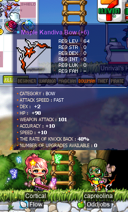
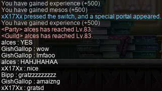
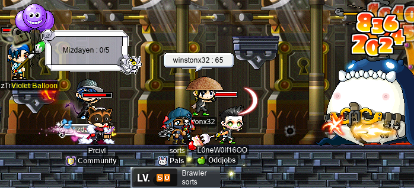
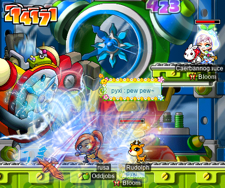
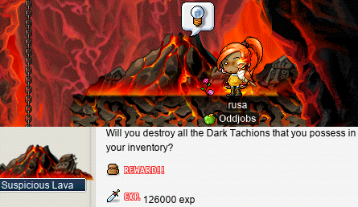
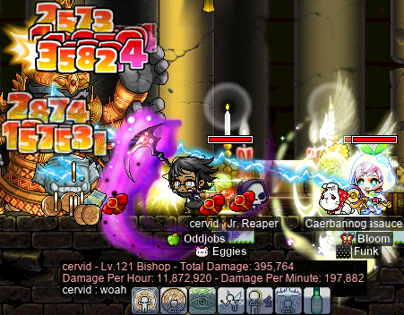
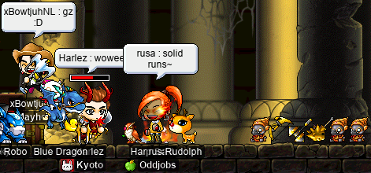
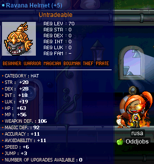
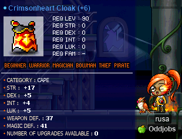

# rangifer’s diary: pt. liv

## Taxonomising odd jobs, pt. i: What even _is_ an odd job, tho? §5

### A note on atemporality

In the previous section of this part (§4), I elaborated on the statement from §2 that “\[o\]dd jobs are, to the extent possible, **atemporal**”. I was asked by **Gruzz** about what I thought of _pirates_ w.r.t. this part of my conception of “odd jobs”. After all, pirates were added relatively late in MapleStory’s life; I don’t remember exactly when, but I’m pretty sure they were added after the addition of the 3rd grade (“3rd job”), and probably after the addition of 4th grade as well. This stands in contrast with the other four (or five, if you count beginners) archetypes that contain the original classes of the game. The original classes of the game (pre-Cygnus) are now collectively referred to as “Explorers” (although, see below for an exception to the confusing “Explorer” terminology), although it should be noted that even in the latest versions of MapleStory, every class (including any non-Explorer class) is _still_ singularly associated with one of these five pre-BB archetypes: warrior, mage, archer, rogue, pirate.

Because pirates were added so late, it seems reasonable to suppose that any pirate-based odd job is inherently “less atemporal” than other odd jobs, e.g. a warrior-based odd job like [blood warrior](https://oddjobs.codeberg.page/odd-jobs.html#hp-warrior). In _some_ sense, this is obviously true, but I want to clarify that this is _not_ the kind of “atemporality” that I’m concerned with here.

In particular, I only care about atemporality **with respect to the aspects of a build that make it “odd”**. I will use the [swashbuckler](https://oddjobs.codeberg.page/odd-jobs.html#swashbuckler) as a toy example of a pirate-based odd job here, but this obviously applies to any pirate-based odd job. The swashbuckler is, by definition, associated with the {gunslinger, outlaw, corsair} throughclass. Given this throughclass, what makes the swashbuckler odd is simply that they are defined as being DEXless (base DEX of exactly 20). This is very similar to (and indeed, defined by analogy with) the older odd job of [woods(wo)man](https://oddjobs.codeberg.page/odd-jobs.html#woodsman). The woods(wo)man is not odd simply because the are an archer (although they are archers by definition), but because they are a **DEXless** archer. I have emphasised the word “DEXless” here for obvious reasons — this is the key term that makes our definition of “woods(wo)man” odd. By analogy, the same applies to the swashbuckler, and this DEXless nature of the swashbuckler _does not require any relation to time (temporality)_, but rather, is odd simply because it is paired with our throughclass of choice ({gunslinger, outlaw, corsair}).

One of the tacit assumptions that we have made (or rather, that _I_ have made) about odd jobs so far is that **any** given class (beginner, rogue, gunslinger, white knight, bishop; you name it) has at least one way — often many ways — in which it can be built to make it represent an authentic odd job (i.e. to make it an odd build). The same thing can be said, then, about any given throughclass, as well. Just like this applies to the throughclasses that have been with us since version 1 of the game (all warrior, mage, archer, and rogue throughclasses that are considered “Explorers”, with the exception of [dual blade](https://bbb.hidden-street.net/character/class/blade-recruit) and other so-called “special” Explorers (lmfao? Necksawn why??)), we would expect this to also apply to pirate-based odd jobs. It is perfectly conceivable to apply everything that we understand about these “original” odd jobs to pirate-based odd jobs, by simple analogy. The above example of a swashbuckler is one example, but a more to-the-point example would be the [permapirate](https://oddjobs.codeberg.page/odd-jobs.html#permapirate), who is defined by analogy with the original perma-firsts, e.g. [permawarrior](https://oddjobs.codeberg.page/odd-jobs.html#permawarrior) or [permamagician](https://oddjobs.codeberg.page/odd-jobs.html#permamagician). It is very conceivable, in fact, to imagine permapirates being odd-jobbers in version 1 of MapleStory — all we need to suppose is that pirates were added this early in the game, and that they were thus limited to the 2nd grade (gunslinger and brawler thus being the highest possible grade of pirates in the game). With the 2nd-grade pirate classes (gunslinger and brawler) being designed very closely to their warrior/mage/archer/rogue counterparts, this hypothetical is not difficult to imagine. On the other hand, it is much more difficult to imagine the 3rd and 4th grades (in general, not just of pirates) having existed since version 1 of the game. There was simply not enough power ([player-character](https://en.wikipedia.org/wiki/Player_character)-wise, and also in terms of what areas/items existed in-game) within the MapleStory community combined to justify far-flung “job advancements” (and their respective areas & monsters of the game). Furthermore, 2nd-grade classes (in general, again including pirates alongside warriors, mages, etc.) are, in a deep sense, functionally complete; 2nd grade is the first grade at which classes have completely specialised what weapon type they use. For example, advancing from rogue → assassin fully specialises the character’s skills in _claw_-using; mages specialise their _elements_, rather than their weapon type, but the process is analogous there.

Oh, and just to — hopefully — avoid confusion, I should _remind_ the reader that the “atemporality” in question here is not _just_ w.r.t. MapleStory’s life (the history of the game), but also w.r.t. the character’s/build’s own life.

### A non-note on terminology, and the fragile concepts associated with said terms

I realise that the terminology that I’m using in this series is likely to lead to some confusion and misconceptions, among those who actually bother to read this shit (hi! I love you!!). In particular, I expect this to be for two reasons:

1. Many of the terms that I use here are somewhat exotic, or far-removed from the way that we normally talk about the game.
2. Perhaps more importantly, much of the terminology that I’m throwing around here refers to some very technical and precisely-defined concepts that can be difficult to keep separate within one’s mind. This is often the case with technical writing, and the fact that we don’t normally think about MapleStory builds/jobs/classes/whatever in this much detail is, again, not a boon.

The fact of (1.) is that I have had to invent and/or enforce some terminology (an obvious example being “throughclass”, a word that I made up for the specific purpose of writing this series) in order to have a way to talk about this stuff. Exotic names are perhaps unfortunate, but if you can get used to them, they should hopefully keep things as clear and unambiguous as possible.

The fact of (2.) is very similar; if we want to talk about this stuff, we have to face the fact that there are some delicate concepts at play. But these delicate and subtle concepts are, I hope, what underlie the concept of “odd job” that is (mostly) shared among those of us who care about such things.

So, in the future, I will likely not bother writing more notes and asides in the (perhaps vain) hope of clarifying things further. Hopefully, terminology that I define will be reasonably clear and unambiguous from initial definition onwards (and hopefully I am not too sloppy in my usage of these terms!).

### Summarising pt. i

So, once again, in §2 of this part, I came up with a list of some things that I wanted to say about my conception of what an “odd job” is:

> - Defining a particular odd job (e.g. [permawarrior](https://oddjobs.codeberg.page/odd-jobs.html#permawarrior)) is **simple**.
> - Insofar as an odd job is “odd”, it is **pure** in its “odd” aspect.
> - Each particular odd job satisfies some intuitive notion of **natural**.
> - The name that we are choosing to use here, “odd job”, is simultaneously fortunate and unfortunate. The “simplicity”, “purity”, and “naturalness” of odd jobs (as listed previously) justifies the use of the word “job” in the phrase “odd job”.
> - Odd jobs are, to the extent possible, **atemporal**. I’m leaving the use of this word intentionally vague, for now.

And by now, I’ve elaborated on all five of these items. As usual, there are a lot of subtleties here, so I recommend drudging through the actual past four sections. But, for those who have already read them, or those who want an executive summary, I will (hopefully…) conclude this first part with a little recap:

- Defining a particular odd job is **simple**. In general, there is a single “hook” that defines a given odd job. For example, a [woods(wo)man](https://oddjobs.codeberg.page/odd-jobs.html#woodsman) is a **pure STR archer**. A particular odd _build_ might be more elaborate, but that build inherits its oddness from its base odd _job_. For example, a plumber [brigand](https://oddjobs.codeberg.page/odd-jobs.html#brigand) is defined in terms of a brigand — but _also_ restricts the weapon choices to an arbitrary set of particular melee weapons, based on those weapons’ aesthetic conformance to the “plumber”/“janitor” aethetic.
- Insofar as an odd job is “odd”, it is **pure** in its “odd” aspect. All builds (even optimal ones) have some restrictions placed on them; some of these are imposed directly by the game, and others are imposed by the players in one way or another. But when it comes to defining an odd job, we expect any defining restriction to be **pure**; that is, taken to a logical conclusion. For example, an archer who is _mostly_ DEXless (say, <50 base DEX by definition) is not _really_ a [woods(wo)man](https://oddjobs.codeberg.page/odd-jobs.html#woodsman). And an assassin who _mostly_ (but perhaps not always) attacks using daggers is not _really_ a [stab sin](https://oddjobs.codeberg.page/odd-jobs.html#dagger-assassin).
- Each particular odd job satisfies some intuitive notion of **natural**. We expect that the definition of a given odd job is, somehow, _suggested to us by the game itself_. For example, pirate classes are the only classes that are capable of attacking while in the nude. Hence, the [pugilist](https://oddjobs.codeberg.page/odd-jobs.html#pugilist).
- The name that we are choosing to use here, “odd job”, is simultaneously fortunate and unfortunate. The “simplicity”, “purity”, and “naturalness” of odd jobs (as listed previously) justifies the use of the word “job” in the phrase “odd job”; the term “odd **job**” correctly emphasises that _odd jobs are **jobs** in their own right_. On the other hand, the use of [the English word “odd”](https://en.wiktionary.org/wiki/odd#English) is perhaps unfortunate; “odd” is a pretty general word that can apply to just about anything that is perceived as being “off the beaten path” by any degree, slight or otherwise. From the previous three points, it should be somewhat clear that what we mean by “odd job” is quite a bit narrower than “any build which might be considered unusual”. The perceived “oddness” of odd jobs is, in many ways, _incidental_. An odd job arises when a **simple** and **natural** approach to building/playing a character is taken to its logical conclusion, and that approach _just so happens_ to be clearly suboptimal in one way or another. This suboptimality is _not_ a defining feature of the odd job, but _incidentally_ leads to it becoming odd, simply because it causes less players to choose to play it.
- Odd jobs are, to the extent possible, **atemporal**. Really, when we say this, we mean that _the aspects of a build that make it “odd”_ are, to the extent possible, atemporal. The temporalities that we have in mind here are basically two: the timeline of a character’s life, from level 1 onwards; and the timeline of MapleStory’s history, from the KMS beta onwards. Because odd-jobbed characters tend to reach the beginning of some kind of “endgame region” (at least, their version of it) around the turn of the 3rd grade (early 3rd-grade levels, regardless of whether or not the odd job actually takes 3rd grade advancement), and because the 2nd grade was the highest possible grade in the original version of the game, we have a shared liminal point after which we consider an odd job to be completely “mature”. We thus want to _exclude_ jobs that are only really “““odd””” starting at this point (or after it), from being truly “odd jobs” in our sense. Builds that are excluded by this principle can still definitely be suboptimal, but suboptimal is not the same as our notion of odd.

## Points. Points. Points.

The theme of this diary entry is “points.”. Not just any points; anniversary points. For the first 2 weeks (actually a bit more than 2 weeks) of the anniversary event, I decided that I only wanted to spend my points on two things: maple equipment boxes (a raffle for maple weapons, maple bandanas, maple throwing stars, maple shields of all kinds, and maple washing flags), and [Magic Crystals](https://maplelegends.com/lib/etc?id=4032056) (for upgrading maple weapons). The reason for this is that there were a lot of maple weapons that I wanted (including some just to have for the guild, as odd-jobbed characters have a special need for many maple weapons, even at “endgame”), as well as mesos to be had. I was not going to try my hand at any of the other raffles, and I didn’t want some OP equipments that would just scam me when they expired and made all my characters weak again!

But, well, a few things made me change my mind. Mostly, I just got a lot of the weapons that I wanted, including the pirate ones that I crafted and scrolled (with some success) for my [DEX brawler](https://oddjobs.codeberg.page/odd-jobs.html#dex-brawler) [LPQ](https://maplelegends.com/lib/map?id=221024500) mule **sorts**. Or something like that; see the next section. Once I had crossed off much of what I wanted, the main thing that I was looking for was [Maple Claws](https://maplelegends.com/lib/equip?id=01472030); but entering this 50-point raffle that gives any one of a zillion items — only one of which is a Maple Claw — seemed less appealing. Oh, and did I mention the event equipment is OP?

And so, my focus is shifted away from the maple raffle, and towards the expiring equipment with scrolls that supposedly succeed 90% of the time. And a little late, I might add. There is just no way for me to generate the kind of points that I need to outfit all 137,666,808 of my peepee poopoo garbo odd-jobbed characters with full event gear. But, uhm, better late than never.

As a testament to how many braincells I am losing as a result of my poor decision-making, here is my [daggermit](https://oddjobs.codeberg.page/odd-jobs.html#dagger-assassin) **alces**, having somehow completed the anniversary WQ (wait quest) five times in one session:

That was the only time that I’ve been able to complete the WQ more than one or two times. This diary entry does _not_ include a heated, multi-paragraph rant about how much I hate the anniversary WQ, but suffice it to say that this diary entry very well _could_ include such a thing.

## The Kandivaning

Welcome back to another episode of “Cort casually tries one time at scrolling a weapon and instantly outclasses all of the garbage that I boomed through protracted effort and resource-expenditure in an attempt to make something that’s not even as good as what they just made”. I know, it’s a bit of a long title, but we’re only on episode 2 so far, so I’m still ironing out the kinks here.

Readers of this diary may remember pt. xlvii, in which Cort crushed my very-long-awaited and painfully-won triumph, by making a [Toy of 101](https://maplelegends.com/lib/equip?id=01402038) that was considerably better than the one that I had _finally_ made less than 24 hours prior. Well, it happened again. With countless pricey [bow 30%](https://maplelegends.com/lib/use?id=2044505)s and (usually below-average; I didn’t even bother scrolling the abysmal ones) [Kandivas](https://maplelegends.com/lib/equip?id=01452045) wasted, I had nothing to show for it at this point; all I wanted to do was beat the 93 WATK Kandiva that my [woodswoman](https://oddjobs.codeberg.page/odd-jobs.html#woodsman) **capreolina** has been using since level 64. Cort (**Cortical**, **GishGallop**, **Bowerstrike**, **Amygdala**, **WizetWizard**, **Medulla**, **Subcortical**) had two spare [Maple Bow](https://maplelegends.com/lib/equip?id=01452016)s on hand that they had raffled, so they decided to give a shot at crafting these bows into Kandivas for the purpose of scrolling. And, as you would expect by now, this happened:

So… yep. :\]

This is, of course, not my bow. Cort creating this bow led directly to the development of their [bow-whacker](https://oddjobs.codeberg.page/odd-jobs.html#bow-whacker) **Bowerstrike** (who we will see later in this entry). But Cort said I could borrow it, at least until Bowerstrike gets to level 64+; or maybe, since the bow is more important for capreolina, Bowerstrike could just use capreolina’s old Kandiva (it is, after all, quite good still). So, this has killed my motivation to waste even more resources on the creation of my own Kandiva… I had been thinking that shooting for 96+ WATK might be too greedy…

## Empy queue

I did some more [MPQ](https://maplelegends.com/lib/map?id=261000021)ing with the gang (including mae; **xX17Xx**, **drainer**, **maebee**, **strainer**), on my [daggermit](https://oddjobs.codeberg.page/odd-jobs.html#dagger-assassin) **alces**! Here I am, leveling up during the first stage of MPQ:

And I even got to do some MPQs with **Bipp**, the chief bandit (not odd-jobbed) of **Celim** (**Copo**, **Sommer**, **Fino**):

MUAHAHAHA~ :)

## Elpy queue

And I also got to do some [LPQ](https://maplelegends.com/lib/map?id=221024500)s with **LoneWolf1600**’s [besinner](https://oddjobs.codeberg.page/odd-jobs.html#besinner), **L0neW0lf16OO**!:

And now, **sorts**, my [DEX brawler](https://oddjobs.codeberg.page/odd-jobs.html#dex-brawler) LPQ mule, has reached the highest level in the (LPQ) game: 50!! With [dep star](https://maplelegends.com/lib/equip?id=01122014) on chest, and [Ellin ring](https://maplelegends.com/lib/equip?id=01119001) on finger, I just need to get her a [PAC](https://maplelegends.com/lib/equip?id=01102041) (a bit pricey these days, unfortunately) and a [zhelm](https://maplelegends.com/lib/equip?id=01002357) to complete her equipment!

## capre does the Papu pre-Q’s

Now that I had done the [Papu](https://maplelegends.com/lib/monster?id=8500001) prequests on my [STR bishop](https://oddjobs.codeberg.page/odd-jobs.html#str-mage) **cervid** and my [darksterity knight](https://oddjobs.codeberg.page/odd-jobs.html#dex-warrior) **rusa**, it was time to also complete them on my [woodswoman](https://oddjobs.codeberg.page/odd-jobs.html#woodsman) **capreolina**:

capreolina @ Papu pre-Q’s

I got a few nifty cards along the way:

Fought some [MDT](https://maplelegends.com/lib/monster?id=7130300)s for their [mysterious golden powders](https://maplelegends.com/lib/etc?id=4031171):

I found out that [Goofy Pocket Watches](https://maplelegends.com/lib/monster?id=8143000) do, in fact, drop cards:

And in just about no time flat, was done getting those pieces of crack!:

Speedy~ Maybe we will see capreolina in an all-odd-jobbed Papu run in the future…?

## Gruzz & Harlez’s level 100 party!!

I was honoured to attend the level 100 party of chief bandit **Harlez** and I/L mage **Gruzz**, both of whom I met while [MPQ](https://maplelegends.com/lib/map?id=261000021)ing on my [darksterity knight](https://oddjobs.codeberg.page/odd-jobs.html#dex-warrior) **rusa**!

The plan was for the two of them to level up to 100 by killing a [crog](https://maplelegends.com/lib/monster?id=8150000) on the ship from [Ellinia](https://maplelegends.com/lib/map?id=101000300) to [Orbis](https://maplelegends.com/lib/map?id=200000100). Also attending were **ducklings** and **Suppress**, and we took many a ship in the hopes of catching a crog or two. But, alas, the crogs were either too shy, or, when they weren’t, we had technical issues that caused part of our party to disconnect. It took so long that Suppress had to leave, but we did eventually get there:

Unfortunately, ducklings, being fragile as [permabeginner](https://oddjobs.codeberg.page/odd-jobs.html#str-beginner)s are, had to spectate from the grave. But congrats to Harlez & Gruzz again on the big triple digits!!

## 4-man Big Puff Daddy

Some people may know that I do a lot of hanging around in channel 8. Channel 8 is where I put my shop. It is commonly understood (just trust me) that channel 8 is _the_ coolest channel, because it is the last channel; there is no channel 9, but there is a channel 8.

So, one time when [Big Puff Daddy](https://maplelegends.com/lib/monster?id=9400569) (sometimes also known as Sizable Strudel Sire, Colossal Confection Custodian, Broad-shouldered Papa Cobbler, Prodigious Patisserie Pappy, or simply P. Diddy) was summoned, I headed over to [Cake Town](https://maplelegends.com/lib/map?id=749020910) on my I/L [magelet](https://oddjobs.codeberg.page/odd-jobs.html#magelet) **cervine** to participate in the fight for cake justice. I was already on channel 8 (of course), so I ended up going into the channel 8 fight.

Unfortunately, there was a bit of a complication: there were only four of us, myself included. Now, four people might _sound_ like a party, but rest assured that this large pastry father is much _too_ large for such a wee band of adventurers. There is a 45-minute time limit on the fight, and usually Rotund Frosting Father fights do not get anywhere close to taking this long. But for us, it was going to be a challenge to even finish in time. But we did it anyways. For great cake justice, and the sake of channel 8 as a whole:

It took us right around 40 minutes from start to finish. Somewhat disappointingly, we got the same 15-point reward that anyone gets for fighting this copious cake creator. But we got way more points than that… in my heart.

## Trying out Papu for the first time~

Having never actually fought the [Papulatus](https://maplelegends.com/lib/monster?id=8500001) myself in my entire Maple career, and with the intent to plan an all-odd-jobbed Papu run sometime in the future, I have been somewhat anxious to finally fight the big bad clock man myself. And the opportunity presented itself earlier than I expected, as **Jule** (**pyxi**, **jinkx**, **quakken**) and **Pasta** (**Pastasauce**, **HolyWafer**, **KingCrab**) invited me to do a Papu with them. Pasta kindly introduced me to how the fight works, and off we went:

The fights (we ran twice) went quite well, and I was pleased to see that Papu didn’t seem much more “difficult” in any particular way, when compared to [Ravana](https://maplelegends.com/lib/monster?id=9420014) — other than being more annoying… It was a really cool experience to fight a boss that I had always envisioned as one of the biggest bad guys of MapleStory — the biggest bad guy in all of Ludus Lake. Squirmy blue clock robot guy.

And with that, I was able to complete the Papulatus questline for 30 fame and [a sweet cape](https://maplelegends.com/lib/equip?id=01102057):

And it seems that Papu drops these [Dark Tachyons](https://maplelegends.com/lib/etc?id=4031196); they are just ordinary ETC items (tradeable, not OoaK). But, interestingly, their description instructs the reader to throw them into the lava in the deepest part of El Nath. As it turns out, there is [a quest](https://bbb.hidden-street.net/quest/el-nath-mt-aquaroad/destroying-the-power-of-evil) that involves doing just this. If you fall into a certain part of the lava in [The Cave of Trial II](https://maplelegends.com/lib/map?id=211042100), you end up in a hidden map called [Cave Within the Cave](https://maplelegends.com/lib/map?id=211042101) that contains an NPC by the name of [Suspicious Lava](https://maplelegends.com/lib/npc?id=2032004):

Woah, nice. You know, I think I remember something in the NPC dialogue for 4th job advancement that talks about the connection between the depths of El Nath and the depths of the Ludibrium Clocktower…

## Assorted bossing (Yeah, points! Woooow~)

Cool bossing wow~

I did some [Capt. Lat](https://maplelegends.com/lib/monster?id=9420513)s, including some very special ones, like these runs that I did with [STRginner](https://oddjobs.codeberg.page/odd-jobs.html#str-beginner) **Taima** (**Tacgnol**, **Boymoder**, **Hanyou**, **Nyanners**, **Numidium**, **Gambolpuddy**, **Inugami**, **Yotsubachan**), STRginner **OmokTeacher** (**Slime**, **Slimu**, **JumpQuest**), and STRginner **LoneW0lf1600** (LoneWolf1600), while on my [STR bishop](https://oddjobs.codeberg.page/odd-jobs.html#str-mage) **cervid**!:

:D

And we did some more odd-jobbed runs as well, like this one with STRginner **Celim**, [permarogue](https://oddjobs.codeberg.page/odd-jobs.html#permarogue) **xX17Xx**, STRginner **Cortical**, and OmokTeacher:

In the first one of these runs, I was able to successfully [resurrect](https://maplelegends.com/lib/skill?id=2321006) xX17Xx, although this unfortunately proved fatal for Celim, as my Resurrection has a 57-minute cooldown, and we found out later that Celim is _just_ shy of the HP (with [HB](https://maplelegends.com/lib/skill?id=1301007) provided by JumpQuest) necessary to not get one-shot by Capt. Lat’s magical attacks.

And I got to do plenty of [Ravana](https://maplelegends.com/lib/monster?id=9420014)s! Here I am on my [darksterity knight](https://oddjobs.codeberg.page/odd-jobs.html#dex-warrior) **rusa** with **Harlez**, **Gruzz**, and **xBowtjuhNL** of the [MPQ](https://maplelegends.com/lib/map?id=261000021) gang:

And again, with Jule and Pasta, as well as Kim (**Skateboard**, **Melokie**)! This time I was running cervid, and with [SE](https://maplelegends.com/lib/skill?id=3121002), [MW](https://maplelegends.com/lib/skill?id=2321000)20, [Echo of Hero](https://maplelegends.com/lib/skill?id=0001005), and a [Cider](https://maplelegends.com/lib/use?id=2022002), I was doing some pretty insane DPS (for a STR bishop, at least):

I even got to see myself crit for a >10k line on a [red diaper goblin](https://maplelegends.com/lib/monster?id=9420013)!!

And here is one of the two Rav runs that I did with just Jule and Pasta, before we went to Papu:

And finally for Ravana, a pair of trio Rav runs that I was able to squeeze in just before reset with xBowtjuhNL and Harlez!:

Thanks to Bow being so willing to pop the [apples](https://maplelegends.com/lib/use?id=2022179) that he gets from [APQ](https://maplelegends.com/lib/map?id=670010000), we were able to tidy up Ravana quite swiftly, even as a party of 3 :O

And, again with Bow, and joined by Gruzz and the hermit **Poffy** (who I had not met before, but whom Bow had MPQ’d with some levels ago), I hunted some [BF](https://maplelegends.com/lib/monster?id=9400575)s:

We fought two, actually; the first was at [FP](https://maplelegends.com/lib/map?id=610010005), which was the usual easy location to fight BF. But the above fight is just at [one of the Twisted Paths maps](https://maplelegends.com/lib/map?id=610010104), which is simply flat and full of [Jr. Wraiths](https://maplelegends.com/lib/monster?id=3230101). It was tougher, and took longer, but with some perseverance, some use of [Rush](https://maplelegends.com/lib/skill?id=1321003), and one or two deaths (R.I.P.), we were able to take this one down as well.

And, after I tried Papu for the first time, I went with Gruzz & xBowtjuhNL to their first time trying Papu:

And again, it went well; I was the only one actually close to the dumb thing, so I took all of the dispels and all of the 1/1s…

And I did a number of solo Capt. Lats on rusa, for the pointz. And at this point, she is actually 4/5 on Capt. Lat cards :O

Also, Bowerstrike died to Pink Bean.

R.I.P. Bowerstrike, 2021~2021.

## cervine is an INTless I/L mage.

I did some points farming on my I/L [magelet](https://oddjobs.codeberg.page/odd-jobs.html#magelet) **cervine**, as well~ And hit level 107!!

And at one point, I even soloed Capt. Lat for a not-so-quick 10 points…:

As you can see, cervine is wearing something a little different these days. I have too many accounts, clearly, and this one was NX-starved enough that I just kinda threw on whatever I had lying around in my Cash Shop inventory once her normal NX clothing expired.

## Farming teefs w/ rusa

I took rusa to [the Dead Mine](https://maplelegends.com/lib/map?id=211041600) to farm some [teefs](https://maplelegends.com/lib/etc?id=4000082), as there are still some [zhelm](https://maplelegends.com/lib/equip?id=01002357)s in order for some of my characters. This was a good excuse to farm to 5/5 [Flyeye](https://maplelegends.com/lib/monster?id=4230107) cards, and 5/5 [Miner Zombie](https://maplelegends.com/lib/monster?id=5130108) cards. But first… I ran into [Riche](https://maplelegends.com/lib/monster?id=6090000). When I had ran into this spooky scary skeleton before, I never understood what it was there for, but this time, I thought I remembered that [an ETC item](https://maplelegends.com/lib/etc?id=4000069) needed to be dropped on the tombstone to weaken Riche. This allows killing the Riche, and there is a smol chance that it can even drop [a card](https://maplelegends.com/lib/use?id=2384010)! So I killed like 20 of them:

…And that was enough to take me from 0/5 Riche cards to 2/5 Riche cards! I guess I’ll have to come back later, as I couldn’t find any more Riches after that.

But, by contrast, getting from 0/5 to 5/5 on Flyeye and Miner Zombie cards was no problem:

And I got 24 or so teefs~!

## woosa got some noo gear!

And finally, a section where I can show off some of my gear that actually turned out well (or at least, decent). I have been using this hat for a while now on rusa, but only recently have I actually [scrolled](https://maplelegends.com/lib/use?id=2040029) the thing:

Pretty good! I’ll take 5/7 any day!! Just don’t make me waste all my helm DEX 60%s ever again!!! Please & thank you!!!!

And, after some careful consideration, I came to the conclusion that the [Crimsonheart Cloak](https://maplelegends.com/lib/equip?id=01102205) is actually the best possible cape for rusa. Similar to the [HTP](https://maplelegends.com/lib/equip?id=01122000) being superior to even a 5 WATK [MoN](https://maplelegends.com/lib/equip?id=01122059) for rusa, the sheer number of stats — particularly STR — that I can get on this bad boy makes it better than my current 4 WATK 6 DEX [PGC](https://maplelegends.com/lib/equip?id=01102084). And even better than a similar (probably more like 3 WATK) PGC scrolled for STR! I did in fact work out the mathematics here, but all of the heavy lifting was done by my [damage calculator](https://oddjobs.codeberg.page/dmg-calc/), so it didn’t take too long to figure out.

And so I bought one of these things and threw some [60%](https://maplelegends.com/lib/use?id=2041013)s/[70%](https://maplelegends.com/lib/use?id=2041034)s at it!:

Very nice! Fancy cloak swag~
