# rangifer’s diary: pt. lv

## Taxonomising odd jobs, pt. ii: Building up a modern perspective. §1

In the previous part (i) of this series, we asked a seemingly simple question: What even _is_ an “odd job”? And I tried to answer this question in a way that hopefully codifies the way that odd-jobbed characters are typically thought of now. But, at the time of writing, the year is 2021; odd-jobbed MapleStory characters have been with us since at least 2003, and it would be truly surprising if this “modern” perspective was an accurate reflection of attitudes towards odd-jobbed characters even from the very beginning. Indeed, we will find that our approach in part i of this series was (intentionally) _anachronistic_. We have in mind two tenets, in particular, that were expounded in part i:

> - Insofar as an odd job is “odd”, it is **pure** in its “odd” aspect.
> - Odd jobs are, to the extent possible, **atemporal**.

These two tenets help to produce a conception of “odd job” that is _highly [idealised](https://en.wikipedia.org/wiki/Theory_of_forms)_. As such, we expect concrete manifestations of these ideas to be simultaneously less perfect, and more nuanced, than their corresponding “platonic ideal(s)”, so to speak. In much the same way, the concept of “an ordinary fighter/crusader/hero” appears simple: the character is STR-based, chooses to either use swords or axes, and follows the {fighter, crusader, hero} throughclass. In actual reality, things are a little more complex; each player has a different idea of what they want their character to be and to be capable of, each has a particular implementation of the game that they are working within (including various versions of KMS, of GMS, of MapleSEA, of EMS, etc., as well as various versions of private servers), each has their own in-game resources that they have to work with (including, among other things, how “funded” they are, what time-limited items they have access to, etc.), and each has [their own knowledge and understanding](https://en.wikipedia.org/wiki/Mental_model) of [the game-world](https://en.wikipedia.org/wiki/Diegesis) and its [mechanics](https://en.wikipedia.org/wiki/Game_mechanics). As a result, each concrete realisation of such an “ordinary fighter/crusader/hero” may differ from another in many ways. Skill builds, AP builds, equipment choices, and so on, can all vary in trivial ways — e.g. minute and usually unimportant details of SP allocation, or extra points in INT and/or LUK due to the initial roll of the dice at character creation — as well as nontrivial ways, e.g. hybrid sword/axe builds, specialisation in a particular handedness (one-handed vs. two-handed), and even “mixed”/“confused”/“bloodwashed”/“bluewashed” AP builds that intentionally allocate a nonzero minority of acquired AP outside of STR/DEX.

Concerns about “knowledge and understanding of the game-world and its mechanics” are particularly relevant for what we want to do here: building up a modern perspective. This process of “building up” means taking a serious look at the history of odd (and more generally, experimental) MapleStory character builds, and in doing so, we will need to reconcile — and, more importantly, incorporate — antiquated views of MapleStory character builds within our so-called “modern perspective”, to create a synthesis onto which we can impose a taxonomy. In the previous paragraph, I hyperlinked to [the English Wikipedia article on “diegesis”](https://en.wikipedia.org/wiki/Diegesis) when writing “the game-world”; but this is actually misleading. MapleStory, as a video game, does include some truly diegetic (read: narrative) elements; but, these elements are largely fragmentary (and often lacking in [consistency][continuity]), and furthermore, are not generally considered to be the main focus of the game. MapleStory, as the [MMORPG](https://en.wikipedia.org/wiki/Massively_multiplayer_online_role-playing_game) that it is, is characterised neither by diegesis nor [mimesis](https://en.wikipedia.org/wiki/Mimesis); rather, it is a _[social](https://en.wikipedia.org/wiki/Social)_ game that is most largely characterised by the social interactions of the people who play it. As a result, _the culture of the game informs what character builds are conceivable_, and it is our highly advanced and optimised pre-Big-Bang (pre-BB) culture — which permeates the existing pre-BB MapleStory private servers (e.g. MapleLegends) — that allows for the highly-idealised concept of “odd job” that was put forth in pt. i of this series.

As part of this pt. ii (“Building up a modern perspective.”), I want to take a walk through some historical (or perhaps, archaeological…) artefacts of MapleStory odd-jobbed gameplay from the past. Doing so will allow us to build up a modern synthetic perspective by not only comparing & contrasting past MapleStory cultures with our present one(s) — although this is extremely important — but also by giving us an idea of what odd jobs and odd concepts could be considered historically… primordial. It is easy enough (or rather, _difficult_ enough…) to impose a taxonomy from scratch, relying on our modern understanding of individual odd jobs, but it might (or might not, who knows!) be useful to us to come from a _historical_ perspective when we start arbitrarily drawing the lines that separate our [taxa](https://en.wikipedia.org/wiki/Taxon).

## capreolina’s 120 party!!!

My [woodswoman](https://oddjobs.codeberg.page/odd-jobs.html#woodsman) **capreolina** has, at very long last, achieved the most prestigious rank of bow-specialised woods(wo)men: _woods[master](https://bbb.hidden-street.net/character/class/bow-master)_. And like my pure [STR bishop](https://oddjobs.codeberg.page/odd-jobs.html#str-mage) **cervid** and my [darksterity knight](https://oddjobs.codeberg.page/odd-jobs.html#dex-warrior) **rusa** before her, I held a special level 120 party for her. You can **[watch a video of the party on the Oddjobs YouTube channel](https://www.youtube.com/watch?v=yhiDKaDJNJI)**!!

And along with the video comes [capreolina’s Theme](https://capreolina.bandcamp.com/album/capreolina-s-theme), which you can obtain a score for (compatible with [MuseScore](https://musescore.org/) 3+) here: <https://codeberg.org/deer/gists/raw/branch/master/capreolina-s_Theme.mscz> :)

## capre getting in on some of that 4th-job goodness

By the end of the party, capreolina was a woodsmaster, but only had a single fourth-job skill: level 1 [Bow Expert](https://maplelegends.com/lib/skill?id=3120005). This is a nice little passive damage boost for just one SP, but not exactly exciting yet. In order to get to the juicy stuff, I needed to embark on some 4th-job skill quests:

4th-job skill quests for capre~

First was the [Hurricane](https://maplelegends.com/lib/skill?id=3121004) quest, which asked of me that I hunt [Kentauruses](https://maplelegends.com/lib/monster?filter=1&order=1&sort=1&search=kentaurus) in search of [Helena’s Old Gloves](https://maplelegends.com/lib/etc?id=4031465). These, according to my fourth job instructor [Legor](https://maplelegends.com/lib/npc?id=2081300), would be the gloves that the archery instructor [in Henesys](https://maplelegends.com/lib/map?id=100000201) bestowed upon Legor when he was a fledgeling archer seeking to learn the ways of archery despite being blind from a very young age. Players of MapleSEA, GMS, and EMS will now be asking the question: who is this “Helena”? And what do her gloves have to do with anything?

The answer is that the name of the first-job archery instructor in MapleStory is inconsistently localised into English. In KMS, JMS, TMS, and CMS, this NPC is known as _Helena_ (e.g. _ヘレナ_ in JMS; for KMS in particular, see [transcription into Korean](https://en.wikipedia.org/wiki/Transcription_into_Korean)), but this name was ported into English as _Athena (Pierce)_. This is a little odd, although in [classical Greek mythology](https://en.wikipedia.org/wiki/Greek_mythology), [Helena (of Troy)](https://en.wikipedia.org/wiki/Helen_of_Troy) and [Athena](https://en.wikipedia.org/wiki/Athena) are technically siblings, as they both share [Zeus](https://en.wikipedia.org/wiki/Zeus) as their father. That being said, Zeus was [the father of, uhm, a lot of various mythological figures](https://en.wikipedia.org/wiki/Zeus#Family), so perhaps the relation is not as close as it sounds. More to the point, Helena and Athena are two very different figures: Helena is best known for [starting a war that culminated in](https://en.wikipedia.org/wiki/Iliad) [the fall of Troy][tfot] due to simply being the most beautiful woman in the world. Athena, on the other hand, is the goddess of wisdom, craftsmanship, and warfare; indeed, the wisest figure in classical Greek canon. Using Athena’s name for the first-job archery instructor makes a good deal more sense, considering that Athena is associated with the more deliberate and strategic elements of warfare — as opposed to her violent and untamed brother _[Ares](https://en.wikipedia.org/wiki/Ares)_, better associated with warrior skills like [Rage](https://maplelegends.com/lib/skill?id=1101006) and [Berserk](https://maplelegends.com/lib/skill?id=1320006). The connection with Athena even suggests a skew towards the woods(wo)man; Athena is usually depicted with a [spear](https://maplelegends.com/lib/equip?id=01432001), and is also symbolised with [olive trees](https://en.wikipedia.org/wiki/Olive). (Side note: Athena was also associated with owls, and [romanised][romanisation] as _[Minerva](https://en.wikipedia.org/wiki/Minerva)_, hence the “_[owl of Minerva](https://en.wikipedia.org/wiki/Owl_of_Athena)_” [in MapleStory](https://maplelegends.com/lib/cash?id=5230000).) It is possible to suggest that the KMS/JMS/TMS/CMS name of _Helena_ is from _[Hellen](https://en.wikipedia.org/wiki/Hellen)_, the progenitor of [the Greeks](https://en.wikipedia.org/wiki/Greeks), but this leaves the final vowel _-a_ unexplained (it would be [phonotactically](https://en.wikipedia.org/wiki/Phonotactics) valid in Korean to leave it off, as far as I know, as the syllable structure in Korean is (C)(G)V(C)), and Helena & Hellen are actually understood to be etymologically unrelated. And naming the job instructor after Hellen makes, still, less sense than naming her after Athena. It should be noted that, in any case, the basis in Greek antiquity is clear & intentional; two of the first-job archer skills ([The Blessing of Amazon](https://maplelegends.com/lib/skill?id=3000000) and [The Eye of Amazon](https://maplelegends.com/lib/skill?id=3000002)) are named for the [Amazons](https://en.wikipedia.org/wiki/Amazons), female-only bow-wielding warrior-hunters renowned in ancient Greek and Latin literature for their combat expertise (particularly in archery) and strictly female society (interacting with men only briefly, strictly for the purpose of reproduction). It seems likely to me that the KMS/JMS/TMS/CMS name was chosen simply to make her “sound Greek”, rather than in reference to any particular figure.

In any case, I went off to kill some random Kentauruses in hopes of finding this stinky old pair of gloves:

And lo, there they were!:

I took these old gloves back to Athena, much to her surprise, and realising that this meant I had Legor’s blessing, she decided to give me a new skill: [Hurricane](https://maplelegends.com/lib/skill?id=3121004).

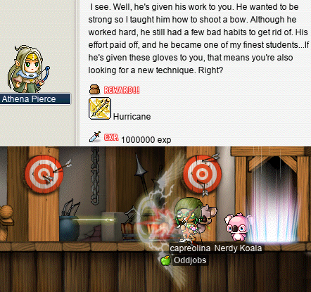

Now, at level 1, Hurricane isn’t all that useful compared to my level 30 [Strafe](https://maplelegends.com/lib/skill?id=3111006); the DPS just doesn’t match up. However, it is _really fucken cool_, and there’s some neato things you can do with it, like feathering it while you walk to get attacks that don’t actually interrupt your walking at all!

And then I went to get [my birdy](https://maplelegends.com/lib/skill?id=3121006), which was honestly the skill I was looking forward to the most. For this, I had to travel into the depths of El Nath. First, up the mountain:

…got some [Riche](https://maplelegends.com/lib/monster?id=6090000) cards along the way…

Into the [Caves of Trial](https://maplelegends.com/lib/map?id=211042200):

And in there, [a special map](https://maplelegends.com/lib/map?id=921100200) where the [Phoenix][phoenix] keeps its nest. I stole(?!) an item from there and brought it back to Leafre, where I used it to summon [the Phoenix itself](https://maplelegends.com/lib/monster?id=9300089):

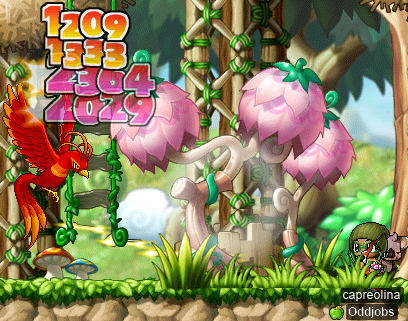

I had to subdue the Phoenix, which is no trivial task; the Phoenix is a proper boss, with 1.35M HP and all that. But after a little while, I claimed victory, and in turn, the Phoenix swore to follow me wherever I go:

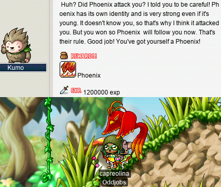

That is “its rule”, apparently. Kind of a weird rule, but sure. I appreciate my firey birdy taking out the trash for me:

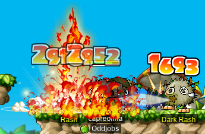

## General, undifferentiated, all-inclusive, generic bossing section

Bossinggggg~

I did a few quick boss runs with **Harlez**, **xBowtjuhNL**, and **Eoka** before capre’s 120 party:

We were joined by a nightlord by the name of **Manneqquin** when we did [Papu](https://maplelegends.com/lib/monster?id=8500001), which made that run quite a bit more swift:

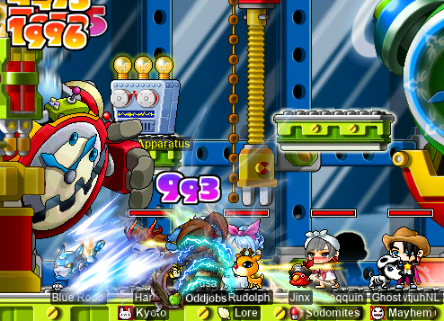

And I did a trio [Rav](https://maplelegends.com/lib/monster?id=9420014) run with Harl and Bow:

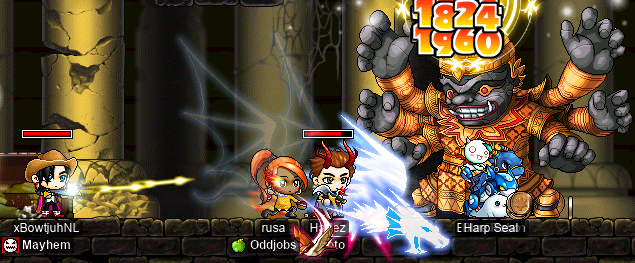

Later, after capre ascended to woodsmaster, I hunted down a [BF](https://maplelegends.com/lib/monster?id=9400575) with Bow, and we were considering duoing it (not sure that would have went too well…), but ran into **Matchy** along the way, and partied with them to take down a BF:

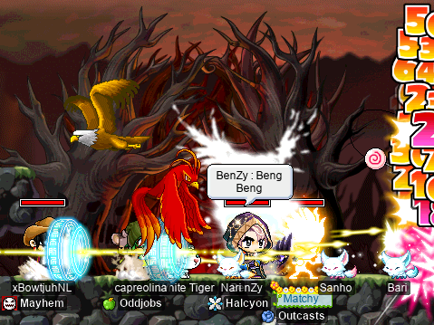

I had actually met Matchy back when I was playing capre at [LPQ](https://maplelegends.com/lib/map?id=221024500), when they were playing their then-[page](https://bbb.hidden-street.net/character/class/page) (now pally) **Nobless**! So it was nice to bump into them in a random bit of the Crimsonwood forest~

I actually finished the [Capt. Latanica](https://maplelegends.com/lib/monster?id=9420513) card set on my [darksterity knight](https://oddjobs.codeberg.page/odd-jobs.html#dex-warrior) **rusa**:

And, in my quest for points, I actually started soloing Capt. Lat on rusa while taking along my [STR bishop](https://oddjobs.codeberg.page/odd-jobs.html#str-mage) **cervid** and my I/L [magelet](https://oddjobs.codeberg.page/odd-jobs.html#magelet) for the ride, just for the points…

Thanks for the free points, pet autopot!

And I also have been soloing Capt. Lat on capreolina, for the points:

The final Capt. Lat of the (unextended\*\*\*) event, I did with **ducklings**, [STRginner](https://oddjobs.codeberg.page/odd-jobs.html#str-beginner) of **DuckNation**:

The first go-around, ducklings unfortunately didn’t make it (it’s imperative that she stay inside the boss, otherwise she risks getting one-shot by any of the magical attacks), but during this last one, she successfully made it through and got those sweet, sweet bossing points :)

## cervine does some more card-hunting!

I decided to do a little card-hunting on my I/L [magelet](https://oddjobs.codeberg.page/odd-jobs.html#magelet) **cervine**, and get some event coins along the way~

Card-hunting, I/L magelet style~

Being only [T1](https://maplelegends.com/lib/equip?id=01119003) so far, I am still grinding for cards on cervine exclusively in Victoria Island. Going through my monster book partly in order, and partly by location, I went first for [Axe Stumps](https://maplelegends.com/lib/monster?id=1130100):

And then I headed to [Golem’s Temple I](https://maplelegends.com/lib/map?id=106010103) to hunt [Blue Mushrooms](https://maplelegends.com/lib/monster?id=2220100) and [Stone Golems](https://maplelegends.com/lib/monster?id=5130101) at the same time:

And then to [Line 1 \<Area 2\>](https://maplelegends.com/lib/map?id=103000103) to hunt [Jr. Wraiths](https://maplelegends.com/lib/monster?id=3230101) and [Stirges](https://maplelegends.com/lib/monster?id=2300100) at the same time:

By the time that I had gotten to 5/5 Jr. Wraiths, though, I was still 0/5 Stirges… so I headed to the [Transfer Area](https://maplelegends.com/lib/map?id=103000102) to finish off the Stirge set:

And with that many more event coins in hand, I finished cervine’s first event ring:

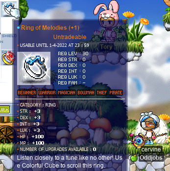

Ouch. The [Colorful Cube](https://maplelegends.com/lib/use?id=2049106) scrolls have a 90% success rate, but I managed to fail quite a large proportion of mine, including two of them on this one ring. This is particularly bad for cervine, as she is arguably my most stat-starved character of all, so every single point of INT (more generally, TMA) counts for a lot. Thankfully, I was later able to perfect a ring, so I prefer to think of it as equivalent to two slightly-scuffed (“(+2)” and 0 slots) rings :)

## 70%

70% is the success rate for [\[Mastery Book 20\] Berserk](https://maplelegends.com/lib/use?id=2290022), the first mastery book that I have ever actually used in my Maple career… and I passed it!!:

As punishment for my crime of actually passing something that involves [RNG](https://en.wikipedia.org/wiki/Pseudorandom_number_generator), I failed two [70%](https://maplelegends.com/lib/use?id=2044004)s on the first two slots of the [Aluminum Bat](https://maplelegends.com/lib/equip?id=01402029) (not to be confused with the [Aluminum Baseball Bat](https://maplelegends.com/lib/equip?id=01402010), which is also a two-handed sword that lacks job requirements and stat requirements) that I was gifted during capreolina’s 120 party:

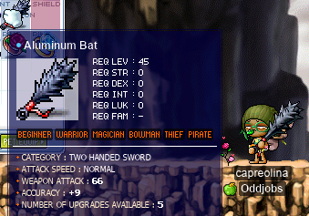

**Harlez** kindly gave me the 70%s that I needed to keep going, at which point I proceeded to fail the next slot as well, and then boom the thing on the slot after that (the fourth slot, in total). Wow~

## EPQing with Numidium and Medulla

I did some nifty [EPQ](https://maplelegends.com/lib/map?id=300030100)s with fellow odd-jobbed friends, pure [STR cleric](https://oddjobs.codeberg.page/odd-jobs.html#str-mage) **Numidium** (**Taima**, **Tacgnol**, **Boymoder**, **Hanyou**, **Nyanners**, **Gambolpuddy**, **Inugami**, **Yotsubachan**) and [dagger fighter](https://oddjobs.codeberg.page/odd-jobs.html#dagger-warrior) **Medulla** (**Cortical**, **GishGallop**, **BowerStrike**, **WizetWizard**, **Amygdala**, **Subcortical**, **MageFP**), on my [DEX brawler](https://oddjobs.codeberg.page/odd-jobs.html#dex-brawler) [LPQ](https://maplelegends.com/lib/map?id=221024500) mule **sorts**!:

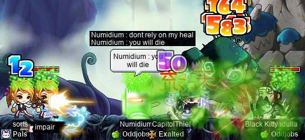

As it turns out, sorts makes a pretty good EPQ mule as well; besides being quite capable of DPSing down the boss (Big Bad Rock Man, or BBRM), I can use [CSB](https://maplelegends.com/lib/skill?id=5101004) during stage 2 to corral the [stone buggos](https://maplelegends.com/lib/monster?id=9300173) towards the centre of the map:

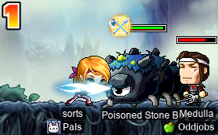

All in all, we did a full **17** EPQs, enough to get sorts form 0/250 party points to 250/250 party points in that one session! Whew~

## A few more MPQs to wrap up alces’s points~

And, finally, I needed to top off some of the points that I was saving up for temporary event gear. For my [daggermit](https://oddjobs.codeberg.page/odd-jobs.html#dagger-assassin) **alces**, the best way to do this was [MPQ](https://maplelegends.com/lib/map?id=261000021)ing my way into another completed (read: zero slot) event ring. Here is ome screenshot of an [Angy Fanky](https://maplelegends.com/lib/monster?id=9300140) fight that I had in one of my MPQ groups:

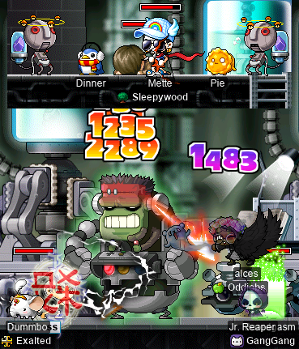

alces is, actually, already “done” with MPQ; I have long since finished a quite nice [Horus’ Eye](https://maplelegends.com/lib/equip?id=01122010), and completed the Franken Lloyd card set. And by now, I have far too many excess [pink marbles](https://maplelegends.com/lib/etc?id=4001160)… But now that alces is level 85, it will be just one more levelup before she graduates MPQ forever~

[continuity]: https://en.wikipedia.org/wiki/Continuity_(fiction)
[tfot]: https://en.wikipedia.org/wiki/The_Fall_of_Troy_(band)
[romanisation]: https://en.wikipedia.org/wiki/Romanization_(cultural)
[phoenix]: https://en.wikipedia.org/wiki/Phoenix_%28mythology%29
