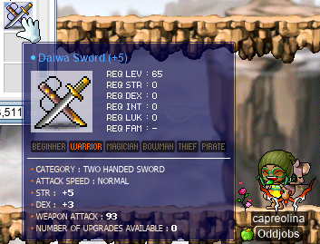

# rangifer’s diary: pt. lvi

Anniversary event extension~ Wow~

## Taxonomising odd jobs, pt. ii: Building up a modern perspective. §2

In the previous section of this part (§1), I said that “I want to take a walk through some historical (or perhaps, archaeological…) artefacts of MapleStory odd-jobbed gameplay from the past”. So I want to take a look at [the archive which I maintain on the Oddjobs website](https://oddjobs.codeberg.page/archive/). This archive is, as of yet, exclusively [English](https://en.wikipedia.org/wiki/English_language) material, but there are still some fairly old entries that we might find useful in our quest to build up a modern perspective of odd jobs.

### A Guide for an HP Warrior!

The oldest (as far as I know; many of the dates are somewhat tentative, as many entries are likely to be reposts or to lack proper dating) entry on the archive so far is “[A Guide for an HP Warrior!](https://web.archive.org/web/20120614133139/http://sleepywood.net/forum/showthread.php?t=891610)”, by **ShurikenRonan**, which is dated at 2006-05-07 (although as you can see on the post, it was updated continuously until 2007-08-14). This entry is what it says on the tin: a guide to [HP warriors](https://oddjobs.codeberg.page/odd-jobs.html#hp-warrior).

The guide starts off (after some images) with the following:

> Read this quote before you do anything else. It's in response to the many uncalled for replies in this thread.
>
>> I really wish you had read the thread before you contributed to it, then I wouldn't be making this post. In fact, I don't think you even read the first post by ShurikenRonan or you'd have some inkling of why people make HP warriors and why "ur dmg blows" is a grossly inappropriate comment.
>>
>> Throughout the months I and the others on this thread have made MANY posts in this thread explaining the point of HP warriors and defending them from comments like yours, over and over again, because no one reads the posts gone before. I don't feel like repeating myself yet again; your post borders on spam. If you want to comment further, please read the original post at the very least.
>
> luminaire's point here is read the thread before posting about how useless HP Warriors are. We KNOW these things already, we don't need to be told them time and time again. If you don't read anything, at least read the Why make an HP Warrior? section below. Wow, it's a whole paragraph long. That's a huge waste of a couple minutes of your life, right? Well, why did you click on this thread in the first place?
>
> I'm not trying to be a complete moron about this, but luminaire and other people in this thread are sick and tired of reading useless replies. By not reading something that wastes a little bit of your time, you selfishly waste the time of others that actively view this thread. Heck, it probably took me ten to fifteen minutes to write these couple paragraphs.

You can find similar themes in the context of other odd jobs ([permabeginners](https://oddjobs.codeberg.page/odd-jobs.html#str-beginner), [STR mages](https://oddjobs.codeberg.page/odd-jobs.html#str-mage), etc.), but it might be somewhat surprising (or, maybe not…) to modern readers that odd and experimental jobs often got a lot of hate in the early days. It seems that, somewhat ironically, as the game got older and highly-optimised characters became the norm, odd-jobbed characters became more clearly defined and clearly intentional. Instead of an HP warrior (or any other odd job) looking like someone screwing up the game, the playerbase has matured to see them as legitimate ways for players to challenge themselves and play the game in a new way. I remember (albeit vaguely) my experience playing a STRginner in ye olden days, when I decided to accumulate defames (e.g. by asking the other person to defame me when trading fame) partly because I expected to be defamed simply for not taking first job advancement.

Indeed, the guide goes on to explain the existence of HP warriors:

> HP Warriors aren't exactly a class that everyone would want to play. It is mainly an experiment that people play just to have fun on MapleStory, instead of always obsessing over equips, level, damage, etc. HP Warriors are meant to train with Priest to enjoy things that other classes cannot, such as going to Zakum at Level 50 with a party. HP Warriors are not only rather easy to level (at least to Level 50 or so) with a party at Grim Phantom Watches, they also are beneficial to Priests by giving them a lot of EXP for healing the large amount of damage the HP Warrior has taken. Overall, the HP Warrior seems to be a sort of an indirect support class for Priests; it doesn't help the Priest directly with skills or buffs, (unless you are an HP Spearman) but it helps a Priest level faster, while leveling itself as well. Try making one sometime if you want a fun experiment.

This more or less outlines our modern concept of HP warrior; they are capable of doing PG training on monsters far above their level for fairly efficient experience (particularly during the first half of second job), and they are capable of going places that other jobs cannot, simply due to their immense HP. Interestingly, ShurikenRonan emphasises the symbiotic relationship between an HP warrior and a priest; the HP warrior gets lots of EXP from monster deaths, while the priest gets extra EXP for healing the HP warrior. EXP from Healing is usually not (at least, not in MapleLegends particularly) considered a large part of EXP intake for clerics/priests. And furthermore, as you can see in the quotation above, even HP spear(wo)men are considered. Normally, nowadays we think of HP warriors as being either {page, white knight, paladin} or {fighter, crusader, hero}, but this guide suggests HP spear(wo)man as a way to make what is effectively an [HB](https://maplelegends.com/lib/skill?id=1301007)/[IW](https://maplelegends.com/lib/skill?id=1301006) mule. This would have made more sense back then, as characters were generally lower level, HP washing was not a thing, and bossing strategies were not as highly-developed (especially with the complete lack of grade 4 skills) — so being able to reliably and efficiently take any hit (even from, say, [Zakum](https://maplelegends.com/lib/monster?id=8800002) touch damage) without dying would have made for a great HB mule.

Other than that, this ancient guide pretty much upholds our modern concept of HP warrior. They really are pure HP, other than the 35 base STR needed for first grade advancement.

### LUK Warrior

The second-to-oldest entry in the archive is a little funkier: “[LUK Warrior](https://www.hidden-street.net/forum/threads/13250-LUK-Warrior)”, by **Dareka**, dated at 2007-02-06. The thread starter suggests making a warrior that swaps out DEX for LUK, with the advantage being higher AVOID (in exchange for lower WACC). This thread gets slightly derailed here and there by users who are unfamiliar with the game mechanics, but are still confident that they understand. If you thought that this was too long ago for people to have a good understanding, though, you would be wrong. Already on the first page, **kholdstare62** and **zedster** correctly point out that each point of DEX gives 0.8 WACC, whereas each point of LUK gives 0.5 WACC. And **zedster** and **MagicalBow** are able to correctly surmise that each point of DEX gives 0.25 AVOID, whereas each point of LUK gives 0.5 AVOID. On the second page, **Sir Sigmund Freud** points out a [pure DEX warrior](https://oddjobs.codeberg.page/odd-jobs.html#dex-warrior) with the IGN **MitGas**, and says that they are personally planning on making a kind of [dagger warrior](https://oddjobs.codeberg.page/odd-jobs.html#dagger-warrior)/dex warrior hybrid, whose STR is capped at a maximum of 65 simply to be capable of equipping warrior-rogue daggers (like e.g. the [Cursayer](https://maplelegends.com/lib/equip?id=01332026)).

However, it’s pretty clear from the start of the thread, and reading onwards, that the suggestion of making a “LUK warrior” is not exactly [the LUK warrior that we know now](https://oddjobs.codeberg.page/odd-jobs.html#luk-warrior); Dareka intends on adding STR, and just adding LUK when needed for WACC and/or AVOID. On page 3 (the final page) of the thread, **SpiraeaKozak** confuses the original poster’s intent (thinking that they really want a pure LUK warrior), and confuses the game mechanics as well, thinking that daggers use LUK as their primary stat (this is true only for rogues; other classes do not factor LUK into their damage with daggers). But Dareka corrects them:

> It doesn't and I don't need to use Daggers. If i use regular warrior weapons nothing will be different except my minimum damage which can be slightly remedied with Mastery and you don't need DEX to wear armour. Only STR.

This lack of purity (still STR-based, not actually pure LUK) would disqualify this version of “LUK warrior” from being “odd” in the sense defined in pt. i, although this would still be an experimental build. I would hazard a guess that part of what made this make sense back then, was warriors actually being seriously WACC-starved. In, say, MapleLegends, it is not difficult for ordinary warriors to go pure STR (read: DEXless & LUKless) and still have the accuracy that they need. Therefore, “LUK warrior” would only make sense in the context of an odd build, in which case we expect it to be truly LUK-based (rather than being STR-based in actuality). But the replies to this thread (particularly that from Sir Sigmund Freud) indicate that players were still taking these kinds of experimental builds seriously, trying to apply game-mechanical knowledge to them, and even experimented with builds that would be considered truly “odd” even today, like DEX warrior and dagger warrior.

### STR Mage v3

Okay, one last one for now.

Going one entry further down the chronological list, we have “[STR Mage v3](https://www.hidden-street.net/forum/threads/14161-STR-Mage-v3)”, by **Hyperhal**, dated at 2007-03-04. The “v3” is due to this being the third time that Hyperhal posted a [STR mage](https://oddjobs.codeberg.page/odd-jobs.html#str-mage) thread, as the older versions are unfortunately lost to the ages due to Hidden Street suffering some sort of database issues (although v1 is included at the end of v3). Again, like the HP warrior guide that we looked at above, this thread starts by pushing back against haters:

> \[…\] This topic was made to not only show you what my character is capable of, but to also give you a different point of view other than the "STR Mages are pointless" comments.
>
> I'll make you want to create a STR Mage, one way or another.

Hyperhal explains why she made a STR mage in the first place, saying that she originally started out by simply trying to make a mage in the most wrong way possible, adding AP into all 4 stats, maxing the skills that were considered the worse grade 1 mage skills, etc.:

> Things like maxing both claw & bolt, getting armor instead of guard, and not even touching increasing max MP were some of my workings. But sometime around level 16, I realized I was doing a very stupid experiment that was most likely going to fail. So I create another new character with a STR Mage in mind. I had always liked Uber-Beginners, but I never had the patience for them. I thought, "Hey, maybe this class'll be kinda like the Uber-Beginner class, but fun." At around level 24 is when I made my first topic about my mage, and man was I happy to tell people I had such a character.

And here we have it: the STR mage is like a [permabeginner](https://oddjobs.codeberg.page/odd-jobs.html#str-beginner), but with more skills (this notion will become important later). HyperHal points out that STR mages lack access to the beginner-only weapons like [Frozen Tuna](https://maplelegends.com/lib/equip?id=01442018), [Sake Bottle](https://maplelegends.com/lib/equip?id=01422011), and [Maroon Mop](https://maplelegends.com/lib/equip?id=01442023): “So by sacrificing your godly beginner weapons, you gain a class that is much more durable than your average uber-beginner.”.

Hyperhal goes the STR F/P mage route, although their reasoning is somewhat unusual. Usually, when we think of STR F/Ps, we consider [Poison Mist](https://maplelegends.com/lib/skill?id=2111003) to be their main skill, at least when compared to the other STR mage routes. But Hyperhal has a different idea:

> My character, GreenMidori, is currently a f/p STR Mage. When people think of STR Mages, they usually think of the cleric path. However, I felt that I did not want to do something so expected. Instead, I wanted to try out the f/p path to see what advantages I could dig up going this way. The first thing I've noticed, is that you gain access to slow. Slow could be one of the best skills in the game, as it assures the user that monsters will NOT get away from you, and that you can escape just incase the situation gets a little dangerous. Combined with your meleeing and teleport, it's almost as if you'll never suffer a death. These three things make up one of the most deadly combinations you can think of, and by going f/p, you allow yourself to tap into that power.

It gets even more interesting when we get to the AP builds outlined by this guide. Hyperhal considers three kinds of AP builds: the “Warrior Build”, the “Hybrid Build”, and the “Everything and Anything” build. The warrior build is what we associate with STR mages: STR-based, with possibly some DEX to make up for missing WACC. But the other builds very much go into [gish](https://oddjobs.codeberg.page/odd-jobs.html#gish) territory. This is a common theme that is seen with odd mages in general; there are not usually terms that allow people to distinguish different kinds of odd mage builds, so any build that adds any significant amount of STR goes under the “STR mage” umbrella, even if they are not actually STR mages in the usual sense.

## woooosa is my highest-level character now

First off, I did a little more sadsadgrinding [at CDs](https://maplelegends.com/lib/map?id=742010203), with my [STR bishop](https://oddjobs.codeberg.page/odd-jobs.html#str-mage) **cervid** and my [darksterity knight](https://oddjobs.codeberg.page/odd-jobs.html#dex-warrior) **rusa**. This was enough to get rusa to level 123(!!):

Wowie. Every level, I get a little more HP and 3 more SP to spend on [zerk](https://maplelegends.com/lib/skill?id=1320006), and so now my zerk threshold is just above the 4.6k HP mark. Now, that’s not exactly impressive, but every little bit counts! Maybe soon, I would try zerking at a boss (like [Capt. Latanica](https://maplelegends.com/lib/monster?id=9420513)) for the first time! But I’m just not there yet.

## A quick MPQ with mae and Cort

I did a quick [MPQ](https://maplelegends.com/lib/map?id=261000021) with mae (**xX17Xx**, **attackattack**, **drainer**, **strainer**) and Cort (**GishGallop**, **Cortical**, **Medulla**, **Amygdala**, **Subcortical**, **MageFP**, **WizetWizard**, **BowerStrike**); we were joined by **CharKoayTeow**, who mae met while [LPQ](https://maplelegends.com/lib/map?id=221024500)ing on her [DEX page](https://oddjobs.codeberg.page/odd-jobs.html#dex-warrior), attackattack.

Here, you can see us; with me, as my [daggermit](https://oddjobs.codeberg.page/odd-jobs.html#dagger-assassin) **alces**, mae as her [permarogue](https://oddjobs.codeberg.page/odd-jobs.html#permarogue) xX17Xx, and Cort as their I/L [gish](https://oddjobs.codeberg.page/odd-jobs.html#gish) GishGallop. We have been trying to get xX17Xx a [Horus’ Eye](https://maplelegends.com/lib/equip?id=01122010), as the massive buff to it has made it extremely appealing for a low-HP job like permarogue.

## SE???

I was doing some solo grinding (again, [at CDs](https://maplelegends.com/lib/map?id=742010203)) on my [woodsmaster](https://oddjobs.codeberg.page/odd-jobs.html#woodsman) **capreolina**, and was joined by **Flow** member **Level1Crook** who was there to see me level up to 121 :O

Which meant putting my first points into [SE](https://maplelegends.com/lib/skill?id=3121002)!!:

SE is… pretty broken for classes who already have passive critical-granting skills (read: assassins, archers). Even with level 3 SE (which unfortunately only lasts 30 seconds, as the duration is 10 times the skill level), capre suddenly starts hitting like a truck with her bow as soon as I cast it. Here is a `@dpm` test that I did while fighting [Capt. Latanica](https://maplelegends.com/lib/monster?id=9420513) with self-casted buffs, [Echo](https://maplelegends.com/lib/skill?id=0001005), and [Cider](https://maplelegends.com/lib/use?id=2022002):

63.6M DPH. _Y I K E S ._

## Bossin’ wif da krew

On rusa, I joined **ducklings**, **Sockzz** (also a DK), **Harlez**, and **xBowtjuhNL** for a pair of [Capt. Lat](https://maplelegends.com/lib/monster?id=9420513)s, of which I think ducklings did actually survive one!:

Later, the same crew tried [Ravana](https://maplelegends.com/lib/monster?id=9420014):

The runs were otherwise fine, but poor ducklings didn’t make it :x It’s definitely possible for her to make it, even without me bringing cervid to have the ability to [Resurrect](https://maplelegends.com/lib/skill?id=2321006) her, but it takes a lot of dilligence about when exactly I can and cannot [Rush](https://maplelegends.com/lib/skill?id=1321003) Ravana, as well as a healthy heaping of luck, for it to work out.

I duoed Capt. Lat with **Gruzz** (who unfortunately did not make it through the first run, thanks to **Cool Frog** fumbling a potion or two):

And we then went on to fight a [BF](https://maplelegends.com/lib/monster?id=9400575) with Harlez and xBowtjuhNL:

Which went quite quickly; with my [HB](https://maplelegends.com/lib/skill?id=1301007) and his own [MG](https://maplelegends.com/lib/skill?id=4211005), Harlez was able to survive BF’s touch attacks and contribute extra DPS with [SB](https://maplelegends.com/lib/skill?id=4201005) and [ME](https://maplelegends.com/lib/skill?id=4211006)!

## Meet d33r

Oh no! Not another one of deer’s peepee poopoo garbo odd jobbers!!

But actually, yes, and this time we’re talking even more peepee poopoo than normal.

Meet **d33r** (I was originally going to call her “XXXdeerXXX”, but that proved to be too unreadable), my vicloc [clericlet](https://oddjobs.codeberg.page/odd-jobs.html#magelet):

### What is “vicloc”?

What is “vicloc”, you ask? Well, it was not my idea (the idea was brainstormed by Cort and Kels), but I did write up the rules here: <https://codeberg.org/deer/gists/src/branch/master/vicloc/README.md>. Basically, “vicloc” stands for “Victoria-locked”, and it’s kind of like [islanding](https://oddjobs.codeberg.page/odd-jobs.html#islander), except instead of _Maple_ Island, it’s _Victoria_ Island. Another inspiration is [sleepylock](https://forum.maplelegends.com/index.php?threads/sleepywood-locked-challenge.29843/). This recalls earlier versions of MapleStory, before Ossyria was added into the game. But it’s a little more complicated than that; in particular, because Victoria Island is not as isolated as Maple Island is, we needed a few extra restrictions besides “just don’t leave the island”. Vicloc characters are disallowed from operating [gachapon machines](https://maplelegends.com/lib/npc?id=9100100), so the only thing that they can do with [gachapon tickets](https://maplelegends.com/lib/cash?id=5220000) is transfer them to non-islander, non-vicloc characters through the Cash Shop inventory. Vicloc characters are allowed to party with non-vicloc characters, but cannot receive items/mesos from non-vicloc characters for any reason. This makes vicloc characters (by our definition) kind of steelman-esque; they lack the ironman-esque requirement of isolating themselves from parties (besides vicloc-character-only parties), but retain the isolation from non-vicloc sources of mesos and items. Vicloc characters also, notably, cannot make use of Cash Shop items ([Myo Myo the Traveling Salesman](https://maplelegends.com/lib/cash?id=5450000) and [weather effects that grant game-mechanical buffs](https://maplelegends.com/lib/cash?id=5122000)) that affect the game mechanics and affect what items are available for purchase. This is actually a stricter requirement than normal islanding (on Maple Island), as the Cash Shop is always available, even to characters who have never left Maple Island.

Some may be surprised to see that, besides areas that are obviously part of Victoria Island (Lith Harbour, Perion, Ellinia, Henesys, Kerning City, Nautilus Harbour, Sleepywood), we also include Amoria and Florina Beach in our definition of “Victoria Island”. We actually had a difficult time trying to figure out what exactly “Victoria Island” is, with three areas in particular being uncertain:

- Amoria
- Florina Beach
- Coke Town

The basic arguments in favour of, and against, each of these areas being part of Victoria Island are basically as follows:

Note: “Transport” is defined as any travel that absolutely requires a cost (in terms of mesos and/or items, e.g. [Magic Seed](https://maplelegends.com/lib/etc?id=4031346) must be consumed to travel directly from Victoria Island to Leafre), and/or takes time to travel (e.g. the flight from Victoria Island to Orbis takes five minutes). So, non-transport methods of travel are effectively the same as just going through a normal teleporter, which suggests geographic contiguousness.

#### Amoria

##### In favour

- Amoria is only accessible through Henesys (which is obviously part of Victoria Island), and does not require transport to go between Amoria and Henesys.
- One map that is part of Amoria, namely [Meet the Parents](https://maplelegends.com/lib/map?id=680000004), is accessible from [HHGIII](https://maplelegends.com/lib/map?id=104040002) via a normal teleporter at the top of the map.
- Amoria is apparently thematically similar to Henesys, and features some of the same monsters as on Victoria Island.

##### Against

- [NLC return scrolls](https://maplelegends.com/lib/use?id=2030020) are only usable from locations that are obviously part of Masteria, with the exception that they function normally in Amoria. This might suggest that Amoria is part of Masteria, not Victoria Island.
- Amoria is not referenced in the Victoria Island world map.
- <https://bbb.hidden-street.net/> lists Amoria separately in their categorisation of “Maps” into nine categories (Amoria, Ellin, Ereve, Maple Island, Masteria, Ossyria, Rien, Victoria Island, World Tour).
- Amoria has maps that spawn [Sakura Cellions](https://maplelegends.com/lib/monster?id=9400509), but cellions are a genus of creature that is normally associated with Ossyria, being otherwise entirely absent from Victoria Island.
- The Amorian mainland (i.e. everything except Meet the Parents) is reachable from Henesys with no transport, _but_ still requires talking to a special NPC ([Thomas Swift](https://maplelegends.com/lib/npc?id=9201022)).

#### Florina Beach

##### In favour

- NPC dialogue suggests that Florina Beach is geographically contiguous with, or at least very close to, mainland Victoria Island (“Have you heard of the beach with a spectacular view of the ocean called Florina Beach, located near Lith Harbor?”).
- <https://bbb.hidden-street.net/> lists Florina Beach as part of Victoria Island, and you can [see here](https://bbb.hidden-street.net/map/victoria-island) that they provide a map of Victoria Island from a more advanced version of MapleStory, which includes Florina Beach directly on the Victoria Island world map.

##### Against

- Going to Florina Beach requires transport.
- While Florina Beach is accessible via transport from Lith Harbour (Victoria Island), it is _also_ accessible via transport from Orbis (Ossyria) and Ludibrium (Ludus Lake).

#### Coke Town

##### In favour

- Coke Town is only accessible from Victoria Island towns, and going to/from it is done without transport.
- Coke Town is apparently thematically similar to Victoria Island, at least insofar as most of the monsters are simply Coke-themed or icy versions of Victoria Island monsters.

##### Against

- Coke Town was originally an event-only region, and is thus unlikely to have any intended geography at all.
- Coke Town is not referenced in the Victoria Island world map.
- Coke Town includes a monster known as [Yeti and Coketump](https://maplelegends.com/lib/monster?id=9500147), which is modelled after an Ossyrian monster.
- Coke Town was a paid promotion by [Coca-Cola](https://en.wikipedia.org/wiki/Coca-Cola), and is thus unlikely to have any intended geography at all.
- Going to Coke Town does not require transport, _but_ still requires talking to a special NPC ([Cokebear Administrator](https://maplelegends.com/lib/npc?id=9001000)).

Based on the above considerations, we decided that the former two are in fact part of Victoria Island, and that the latter is not.

### My vicloc adventures so far

In any case, you can imagine that I’ve really set myself up for a tough time here. Vicloc is already a pretty severe challenge when we’re the first ones on the server to do it — there is no “economy”, so besides the three PQs that we technically have access to (HPQ, KPQ, APQ), it’s basically just ironmanning. But in addition, I have decided to play an odd job, and in particular, one that tends not to fare very well without good equipment: the [magelet](https://oddjobs.codeberg.page/odd-jobs.html#magelet). So, when reading about my vicloc adventures, keep in mind that I’m not complaining: I did this to myself on purpose!

**xXcorticalXx** (Cort’s vicloc [STRginner](https://oddjobs.codeberg.page/odd-jobs.html#str-beginner)) and I decided to do a few [HPQ](https://maplelegends.com/lib/map?id=100000200)s, to get ourselves some [rice cake hat](https://maplelegends.com/lib/equip?id=01002798)s. We found out very quickly, however, that we were simply incapable of killing the monsters that spawn in HPQ. So, in order to defend our bunny friend, we were forced to lure the monsters away by aggroing them with our single-target attacks:

This turned out to, thankfully, be very effective; we were able to farm up a rice cake hat for each of us. I refer to my rice cake hat as my “safety hat”, as its whopping 22 WDEF saves me a huge amount of potions. Oh yeah — about that… I literally cannot afford potions! I only use potions given to me by quests, and for a long while I couldn’t even buy myself gear like a [Stolen Fence](https://maplelegends.com/lib/equip?id=01092003) or set of [Subis](https://maplelegends.com/lib/use?id=2070000) (my [Sweet Fork Cake](https://maplelegends.com/lib/equip?id=01472088) is quite useful against monsters with relatively high MDEF, as I am pure LUK after all).

My first big break was not actually mesos or potions. Instead, as the event was about to end, I scraped up enough points for exactly one (1) maple equipment box:

And I got a 4/2/2/2 [dana](https://maplelegends.com/lib/equip?id=01002602)!! This is actually pretty much the worst possible blue dana for d33r, but really all I was asking for was a dana with \>0 INT, and that’s exactly what I got!

And with that (and spending my leftover 5 points on some goofy glasses), I put together d33r’s look:

I already have an odd-jobbed cleric/priest/bishop (**cervid**), and her look is quite dark; so for d33r, I went with the polar opposite. Normally, outfits of this kind are [traditionally associated with tragedy](https://en.wikipedia.org/wiki/White_Lady), but that was not my inspiration here.

And I went off to do some quests. Being vicloc means that I very nearly have an obligation to complete every (or almost every) quest that is completable by vicloc characters. Annoyingly, some quests that are classified as “Victoria Island” are actually not doable by viclockers. But I went off to do the early [Stump](https://maplelegends.com/lib/monster?id=0130100) and [Slime](https://maplelegends.com/lib/monster?id=0210100) quests like [The Stump Horror Story](https://bbb.hidden-street.net/quest/victoria-island/the-stump-horror-story), [Beauty or Beast](https://bbb.hidden-street.net/quest/world-tour/beauty-or-beast), my first job training quests from [Grendel the Really Old](https://maplelegends.com/lib/npc?id=1032001), [I’m Bored](https://bbb.hidden-street.net/quest/victoria-island/im-bored), and [I Need Help On My Homework!](https://bbb.hidden-street.net/quest/victoria-island/i-need-help-on-my-homework):

Along the way (not a lot of return scroll use, and no taxi use, thanks to my nonexistent mesos) I ran into a sad gachapon ticket:

Well, I’ll just have to redeem that one on another character…

Here I am, doing [Fixing Blackbull’s House](https://bbb.hidden-street.net/quest/victoria-island/fixing-blackbulls-house) and collecting some [Leaves](https://maplelegends.com/lib/etc?id=4000005) for [Maya and the Weird Medicine](https://bbb.hidden-street.net/quest/victoria-island/maya-and-the-weird-medicine) later on:

And then I came to the realisation that doing Victoria Island quests would mean doing some JQs… I’m not exactly a JQer myself, but thankfully this first one ([John’s Pink Flower Basket](https://bbb.hidden-street.net/quest/victoria-island/johns-pink-flower-basket)) was doable after some frustration:

And then I went to kill a bunch of [Green Mushroom](https://maplelegends.com/lib/monster?id=1110100)s for [Arwen and Ellinia](https://bbb.hidden-street.net/quest/victoria-island/arwen-and-ellinia) and [DANGER! \<1-G. Mushroom\>](https://bbb.hidden-street.net/quest/victoria-island/danger-1-g-mushroom):

Which brings me, along with some other quests, all the way to level 21~ Next for d33r is a lot of KPQing, and I’ve already (finally) bought some actual gear in preparation: a [Pink Starry Shirt](https://maplelegends.com/lib/equip?id=01041004), some [Ice Jeans](https://maplelegends.com/lib/equip?id=01062000), and a [Stolen Fence](https://maplelegends.com/lib/equip?id=01092003)!

## cervid working towards getting Genesis~

On my pure [STR bishop](https://oddjobs.codeberg.page/odd-jobs.html#str-mage), **cervid**, I have a spare SP laying around that I’ve not spent on [MW](https://maplelegends.com/lib/skill?id=2321000), as level 8 of the skill would only increase the duration. So I suppose it’s high time, then, that I get [Genesis](https://maplelegends.com/lib/skill?id=2321008). As a party trick, I guess. Who doesn’t want to see 15 **MISS**es at the same time, from a single spell?

Anyways, I had not started the quest yet, as I knew it meant farming up the ETC items necessary to [enter the Cave of Life](https://maplelegends.com/lib/map?id=240040700). And those monsters are _tough_. But I was determined to try it anyways, and **Gruzz** and **xBowtjuhNL** offered to help, so I went around to a bunch of NPCs to start the quest off:

Oh, Wiz… if only you knew how STRong I really am.

The crux of this quest is that [Shammos](https://maplelegends.com/lib/npc?id=2022003) is actually an incredibly powerful magician — so powerful in fact, that when he threatened to annihilate the Maple World as we know it, [Grendel the Really Old](https://maplelegends.com/lib/npc?id=1032001) and [Robeira](https://maplelegends.com/lib/npc?id=2020009) agreed to lock Shammos, once their friend, into a dungeon below the [Chief’s Residence](https://maplelegends.com/lib/map?id=211000001) in El Nath. They claim to only have spared Shammos’s life because Shammos was such a dear friend to them; but Shammos has, through self-corruption by the incredible and uncontrollable power of his own magic, and through years of isolation in the dungeon, become a creature barely resembling his original form at all. Shammos’s memory is foggy and distorted, and not everything that he says is coherent, but he insists that Grendel and Robeira did this to him out of jealousy for his magical power. If I could bring back one last sacred artefact necessary to unlock a new magical power — that artefact being the [Life Roots](https://maplelegends.com/lib/etc?id=4031461) — Shammos might teach me to wield this power myself.

Sounds just slightly evil, but OK — unfortunately for me, I would need to enter the cave of the Horned Tail to even recover this artefact.

I found [Doom](https://maplelegends.com/lib/skill?id=2311005) to be quite effective on these tank-like beasts:

And we were fortunate enough to come across a [Manon](https://maplelegends.com/lib/monster?id=8180000) not too long after beginning to look for one:

And so, not too long after starting — thanks to the help of Bow and Gruzz — I had all of the ETCs that I needed to enter the Cave of Life! Now, just to find someone selling HTPQ services…

## A few PPQs

I did a handful of [PPQ](https://maplelegends.com/lib/map?id=251010404)s with **Boymoder** (**Taima**, **Tacgnol**, **Hanyou**, **Nyanners**, **Gambolpuddy**, **Numidium**, **Yotsubachan**) the [STRmit](https://oddjobs.codeberg.page/odd-jobs.html#lukless-assassin), on my [swashbuckler](https://oddjobs.codeberg.page/odd-jobs.html#swashbuckler) **hydropotina**:

Above, you can see us trioing the [Lord Pirate](https://maplelegends.com/lib/monster?id=9300119) with **LinusSosa** the hermit. Along the way, Boymoder leveled up to 86!! Goodbye [MPQ](https://maplelegends.com/lib/map?id=261000021)~

Oh, and this was enough PPQs for hydro to get her first [PPQ hat](https://maplelegends.com/lib/equip?id=01002571):

Nice! I’m finally a real pirate now!!

## Items!

It’s time to talk about some equipment. Here’s a [Daiwa Sword](https://maplelegends.com/lib/equip?id=01402017) that I scrolled after getting it from gachapon (thankfully didn’t boom on the final slot due to [a 70%](https://maplelegends.com/lib/use?id=2044004) this time):

Cool!! A great weapon for [DEX](https://oddjobs.codeberg.page/odd-jobs.html#dex-warrior)/[LUK](https://oddjobs.codeberg.page/odd-jobs.html#luk-warrior) pages, white knights, fighters, and crusaders, like **attackattack** and **Hanyou**!

And I crafted another [NRC](https://maplelegends.com/lib/equip?id=01472073)!!:

Wow, really nice this time (only got 39 WATK clean last time). And I actually managed to scroll it very well, passing six [60%](https://maplelegends.com/lib/use?id=2044701)s on it!!! 55 WATK, woweeeeeeeeeeeee~

Speaking of nice changes of pace from my usual abyssmal crafting/scrolling luck, I bought up four(!) 2 STR clean [Navy Christmas Sock](https://maplelegends.com/lib/equip?id=01072429)s in anticipation of my precious [Green Christmas Sock](https://maplelegends.com/lib/equip?id=01072428) expiring. This sock is going to be shared between quite a few of my characters (**cervid**, **capreolina**, **hydropotina**, **rusa**, **alces**, **hashishi**, **dama**), so I really want a nice 2 STR one with high DEX. Having bought four clean ones, the very first one that I attempted to scroll came out quite well!!:

Now I guess I just gotta farm up more [30%](https://maplelegends.com/lib/use?id=2040715)s to try for 9+ DEX :o Unfortunately, not doing well so far, as I failed a 30% (but did not boom) on the first slot of one of the other sox. But hopefully I can make an even cooler one, and if not, this is already very nice!

And finally, **OmokTeacher** (**Slime**, **Slimu**) actually managed to scroll an even more amazing [Crimson Arcglaive](https://maplelegends.com/lib/equip?id=01442068) than the one that he made before — this time with an insane 128 WATK and 15 STR!!! And he extremely kindly gifted me his old one, a legendary weapon in its own right, for use by my pure [STR bishop](https://oddjobs.codeberg.page/odd-jobs.html#str-mage) **cervid**!!!!:

Thank you so much Noam, again, for this incredible weapon as a gift!!! I’ve never been gifted anything like this in my Maple career <33333…
