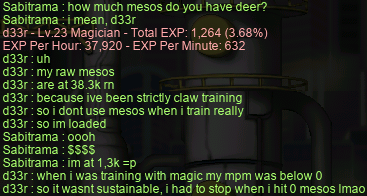
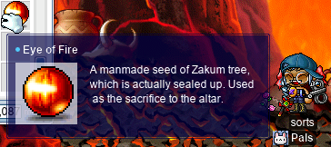
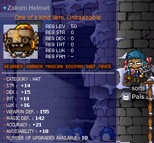
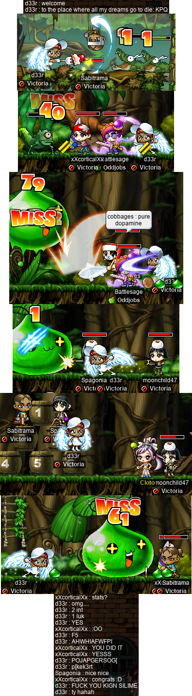
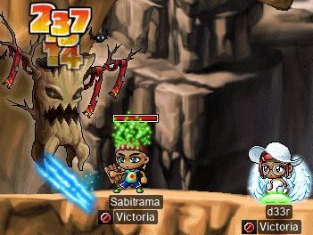
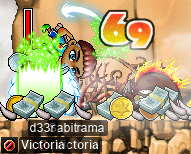
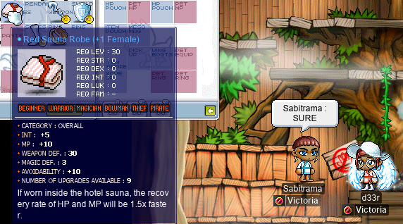
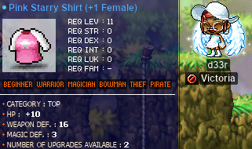
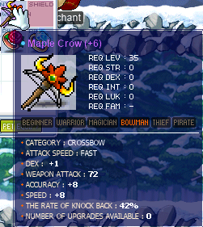
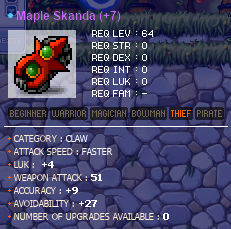

# rangifer’s diary: pt. lvii

## Taxonomising odd jobs, pt. ii: Building up a modern perspective. §3

### Woodsmen

The next artefact in our archive, and the next one I want to look at, is “[Woodsmen](https://www.hidden-street.net/forum/threads/21249-Woodsmen)”, posted by **Zambies** on the Hidden Street forums on 2007-08-12. The original post, in full, is as follows:

> Alright so here goes. I've always liked beginners and I've had more than a few, but lately I've been wanting to try some jobbed beginners, I have a str mage already and thats going pretty well but I wanted to try a woodsmen, but alas I cannot find a guide or really anything other than "use a bow for knockback and get buff your accuracy" I need something more detailed or at least some help with AP assignment

Already in the second sentence, we see the term “jobbed beginner” used. This term will be important to keep in mind when creating our taxonomy, as it accurately reflects how certain odd jobs have been traditionally conceptualised and grouped together. Zambies goes on to imply that [STR mages](https://oddjobs.codeberg.page/odd-jobs.html#str-mage) are part of this group. Based on the use of the term “jobbed beginner”, it seems that what Zambies has in mind is very similar to what are still known as [woods(wo)men](https://oddjobs.codeberg.page/odd-jobs.html#woodsman) today.

The first two responses to the thread are somewhat confused, not understanding the original post, and **Sevin** asking what a “woodsman” even is. **Majal** goes on to define woodsman as “Perma begginer that is a Bowman. They dont shoot. They just take advantage of the acc.”. This conception of woodsmen (and indeed, most jobbed beginners in general) as being essentially [permabeginners](https://oddjobs.codeberg.page/odd-jobs.html#str-beginner) who take advantage of some minor, but significant, benefits of their chosen class — usually passive skills and buff skills — is reflective of traditional attitudes towards these jobbed beginners. The worry here is about WACC; STRginners have obvious WACC issues, as they want to put as much of their AP into STR as possible, but at the same time have nothing built into their class that helps them with WACC (unlike e.g. warriors, who can passively gain +20 WACC just from mastery skills). The bowman class would seem to help solve this problem: [The Blessing of Amazon](https://maplelegends.com/lib/skill?id=3000000) passively grants WACC, and [Focus](https://maplelegends.com/lib/skill?id=3001003) gives a hefty WACC (and AVOID, for that matter) buff on top of that. Unfortunately for the woodsman, archers gain less WACC per point of DEX, and per point of LUK, than a beginner does: 0.6 WACC instead of 0.8 per point of DEX, and 0.3 WACC instead of 0.5 per point of LUK. But this mechanic is not even mentioned in the thread, as its effect is quite minor at lower levels and with lower-powered gear (read: less DEX and LUK from gear), in comparison to the large constant effects of The Blessing of Amazon & Focus.

[My guide to woods(wo)men](https://oddjobs.codeberg.page/guides/woodsman/) is based on a more hybrid view of this odd job: one that is proficient in _both_ melee and archery. But, looking at a more primitive attestation of the woods(wo)man odd job suggests that this hybrid view is more modern — or maybe not. One of the replies that I referred to as “confused” earlier, by **pso\_kik**, mentions what they call a “strength bowman”: “Other than a strength bowmen (which means much less damage, but more stable), there's not much you can do with the archer class in terms of novelty builds.” The last part of this statement [proves to be mistaken](https://oddjobs.codeberg.page/odd-jobs.html), but their description of a “strength bowman” as having much less damage, but more stable damage, is basically accurate to the ranged fighting style of woods(wo)men. But, at least when looking at this thread, there is no evidence of really putting two & two together here, and thinking of woods(wo)men as a hybrid melee & ranged job.

**Argentin** makes the last reply in the thread, explaining what a woods(wo)man is, and how to allocate AP for one:

> Well a woodsman is a jobbed beginner.A jobbed beginner is a beginner that takes advantage of a class skill.so a woodsman is just a beginner with bowman skills.you will only need 25 DEX so you can get the first job and the rest you put into STR.you will only need DEX to fight other monsters but not to much.you can try adding twice DEX as you characters level or 4 STR and 1 DEX or 1STR and 2DEX.Your starting stats should be
>
> STR #
>
> DEX #
>
> INT 4
>
> LUK 4/5

The sentence “you will only need 25 DEX so you can get the first job and the rest you put into STR” is particularly notable here, for reflecting our modern conception of woods(wo)men as being pure STR archers. But again, similar to the “LUK Warrior” entry that we considered in §2, the emphasis is not on purity; it is accepted that any archer will need at least some DEX in order to get the WACC that they need to hit monsters.

### Brandini's Islander Guide

Finally, I want to look at the next entry in chronological order: “[Brandini's Islander Guide](https://forums.mapletip.com/index.php?/topic/111589-brandinis-islander-guide/)”, by **Cacophobia** (IGN **MrBrandini**), first published on 2007-11-05. This guide is a fairly straightforward guide to [islanding](https://oddjobs.codeberg.page/odd-jobs.html#islander) (unfortunately somewhat uprooted by the later changes to Maple Island), but I want to focus on the “Builds” section.

The section starts by saying that “Most people assume there is only one build all Islanders follow which is going Pure Strength, they are wrong.”, and goes on to list five different builds: strength islander, dex islander, hybrid islander, [magelander](https://oddjobs.codeberg.page/odd-jobs.html#magelander), and luck islander. The classification of usual types of islanders has been done many times, in various somewhat different ways, but this basically captures the kinds of distinctions that are usually made. This will become important later on, when trying to fit islanders into a taxonomy of odd jobs. These different “flavours” of islander, if you will, would almost certainly be considered subjobs by the definitions laid out in pt. i, but because islanders are such a primitive and core odd job, the classification of at least some of these subjobs proves to be an important task. And, furthermore, magelander in particular is so distinct from other islander flavours — and so old — that it is worth mentioning separately.

## d33r prepares to take on KPQ anew

I tried doing a KPQ on my [vicloc](https://forum.maplelegends.com/index.php?threads/victoria-the-victoria-island-locked-guild.41605/) [magelet](https://oddjobs.codeberg.page/odd-jobs.html#magelet) **d33r** at level 21, and pretty much instantly regretted it. I felt so utterly useless that I set a task for myself: to level up and come back!

So I went to a nearby map ([Caution Falling Down](https://maplelegends.com/lib/map?id=103010001)) to grind:

Having hit rock bottom, I was indeed forced to train with my [anniversary event claw](https://maplelegends.com/lib/equip?id=01472088):

After grinding out a level or two, I thought I might make some progress on quests (without actually turning them in, as I wanted to save that for after KPQ, i.e. level 31+). Hopefully this would give me a nice break from the [Octopus](https://maplelegends.com/lib/monster?id=1120100) grind. So I went to collect ETCs for a level 15 quest, [Don Hwang’s Request](https://bbb.hidden-street.net/quest/victoria-island/nella-kerning-city-citizens-request-1). Unfortunately for d33r, this didn’t turn out so well:

So I went back to the g-g-grind:

And eventually, I hit a much healthier level of 24!:

Maybe now, I’m good enough for KPQ…?

## sorts gets a zhelm!

I wanted to get a [zhelm](https://maplelegends.com/lib/equip?id=01002357) for my [LPQ](https://maplelegends.com/lib/map?id=221024500) mule and [DEX brawler](https://oddjobs.codeberg.page/odd-jobs.html#dex-brawler) **sorts** — after all, what LPQ mule doesn’t have a zhelm? So I went to collect some [gold teeth](https://maplelegends.com/lib/etc?id=4000082) for the Zakum prequests, on my [darksterity knight](https://oddjobs.codeberg.page/odd-jobs.html#dex-warrior) **rusa**. Along the way, I got quite lucky, and was able to quickly finish up my [Riche](https://maplelegends.com/lib/monster?id=6090000) card set!:

Once I had the teeth that I needed, sorts was off to the [Door to Zakum](https://maplelegends.com/lib/map?id=211042300):

Not pictured here is me soloing the first prequest (yawn), and also not pictured is me doing the second prequest, in order to save myself the embarrassment. But rest assured that I eventually did complete both, and got my five [EoF](https://maplelegends.com/lib/etc?id=4001017) (not to be confused with [EOF](https://en.wikipedia.org/wiki/End-of-file)):

And I bought an AFK [Zakum](https://maplelegends.com/lib/monster?id=8800000) run for her, and ended up with this slightly underwhelming helm, with no chance to reloot:

…But hey, it’s not so bad. At least the stats aren’t 13/13/x/y or something!

## Doin’ woodsmaster stuffs

I did some [woodsmaster](https://oddjobs.codeberg.page/odd-jobs.html#woodsman)ing with my woodsmaster **capreolina**!

woodsmaster stuffs~

The first order of business was to get capre access to some of the skills that don’t come as default skills for bowmasters. First off was [Dragon’s Breath](https://maplelegends.com/lib/skill?id=3121003) — this skill is only attainable by using [a skillbook](https://maplelegends.com/lib/use?id=2280005), but that skillbook can only be acquired in [the El Nath PQ (ENPQ)](https://maplelegends.com/lib/map?id=921100300), and is untradeable. Again, this is a little weird, considering that ENPQ is supposedly just a quest that 4th-job warriors need to do to get [Stance](https://maplelegends.com/lib/skill?id=1321002), but thankfully I have a warrior of my own who lacks access to Stance: **rusa**, my [darksterity knight](https://oddjobs.codeberg.page/odd-jobs.html#dex-warrior). So I failed to save poor [Tylus](https://maplelegends.com/lib/npc?id=2020008) (who, apparently, can never catch a break) once again:

And I got quite lucky this time, getting the skillbook on only the second ENPQ that I tried:

With that done, there was only one bowmaster skill left for me at master level 0: [Concentrate](https://maplelegends.com/lib/skill?id=3121008). Starting this quest requires a handful of ETC items, one of which is the [Ancient Book](https://maplelegends.com/lib/etc?id=4161018), which is a somewhat rare drop from [Cold Sharks](https://maplelegends.com/lib/monster?id=8150101). I really didn’t feel like swimming around and farming these absolute tanks until I got lucky enough for it to drop, but thankfully for me, there was one on the [FM](https://maplelegends.com/lib/map?id=910000000) for reasonably cheap, so I went ahead and took the shortcut there.

But I did have to farm up some [Ink Bottles](https://maplelegends.com/lib/etc?id=4000183) from [Squids](https://maplelegends.com/lib/monster?id=8141300) (thankfully, these are not rare drops at all):

And I took these ETC items (also including 30 [Magic Rox](https://maplelegends.com/lib/etc?id=4006000) and a USE item, [Pure Water](https://maplelegends.com/lib/use?id=2022000)) to [Wiz](https://maplelegends.com/lib/npc?id=2040052) for inspection. Wiz said that I could use the materials to reveal hidden ink in the Ancient Book, and upon reading the [invisible ink](https://en.wikipedia.org/wiki/Invisible_ink), he directed me to [Athena Pierce](https://maplelegends.com/lib/npc?id=1012100):

Athena Pierce told me that I’m a bowman. Excellent. So I tried talking to my third job archery instructor, [Rene](https://maplelegends.com/lib/npc?id=2020010):

Rene also agrees that I am definitely a bowman. Very well then.

So I went to the [Insignificant Being](https://maplelegends.com/lib/npc?id=1061012), who told me that I am a bowman. Just kidding — he told me that there is an ancient archery training ground built by the most powerful archer of legend, housed near the Insignificant Being’s location in deep Sleepywood. This training ground would allow me to train to be strong enough for the skill taught by this Ancient Book. But I would need something special in order to enter the training ground.

It was at this point that I got confused; I was misled by the short guide (for 4th job skills) that I found online, and also misled by the entry in my quest journal in-game. I thought that, at this point, I just needed to party with another 4th-job archer and go in. I [smega](https://maplelegends.com/lib/cash?id=5072000)’d, asking if any 4th-job archers wanted to do the quest with me, and a new bowmaster by the name of **wires** responded and kindly agreed to help. I found that it was still impossible to enter, and eventually realised that I was mistaken about what I needed to do next in the quest. The 50 dark marbles that I needed to collect were not dropped by the monsters inside of the training ground; they were dropped by ordinary monsters in deep Sleepywood.

Unfortunately, these dark marbles had a fairly low drop rate, I needed 50 of them, and they only dropped from [Taurospears](https://maplelegends.com/lib/monster?id=7130101), [Tauromacis](https://maplelegends.com/lib/monster?id=7130100), and [Jr. Balrog](https://maplelegends.com/lib/monster?id=8130100). So wires said we could try the quest the next day. I hunted the marbles:

And later, the next day, wires came back to assist!:

Thank you wires!! And with that — 300 Jr. Balrogs killed — I was awarded access to the Concentrate skill:

After that, I did some sadgrinding [at CDs](https://maplelegends.com/lib/map?id=742010203) to get to level 122!:

Cool~ Now my [SE](https://maplelegends.com/lib/skill?id=3121002) lasts for a whole 60 seconds :3

## d33r does KPQ

Now that d33r was level 24, it was time to head back to KPQ much stronger than before. Well, okay, maybe not much stronger…

KPQ w/ d33r

In the image below, you may notice an abundance of “**1**”s and “**MISS**”es. This is where the **Victoria** guild gets their motto: “Killing KPQ gators, 1 damage at a time”.

By the end, I was having to kill myself many times in order to stubbornly retry for the last item that I wanted from this PQ. I had gotten 5/5 on my [King Slime](https://maplelegends.com/lib/monster?id=9300003) set fairly quickly, but besides that, I just wanted a pair of 2 INT [Squishy Shoes](https://maplelegends.com/lib/equip?id=01072369). I wasn’t prepared to be any pickier than that, so I would even have accepted x/y/2/0 shoes. But my luck in winning `@roll`s was just nonexistent for a long time. Eventually, after many deaths, and many miserable KPQs in which I was still nearly useless, I won a roll. And it was then that I just about lost my shit, because I actually got x/y/2/1 shoes!!! Free from KPQ at last…

## cervid gets Genesis

In the previous diary entry, we saw **cervid**, my pure [STR bishop](https://oddjobs.codeberg.page/odd-jobs.html#str-mage), working towards getting [Genesis](https://maplelegends.com/lib/skill?id=2321008), with help from **Gruzz** and **xBowtjuhNL**. The only thing that was left to do was the Horned Tail Party Quest (HTPQ), in order to get a special quest item ([Life Roots](https://maplelegends.com/lib/etc?id=4031461)) that drops from the monsters in the PQ.

STR bishop Genesis

I saw someone [smega](https://maplelegends.com/lib/cash?id=5072000) selling service for just this: HTPQ for Life Roots. So I took cervid into the Cave of Life, and was guided through the HTPQ by **PaiKia**:

It was actually very quick, and much easier than I expected! Thank you, PaiKia. And with the Life Roots, [Shammos](https://maplelegends.com/lib/npc?id=2022003) was pleased:

I had a skillpoint at the ready, so I [rock](https://maplelegends.com/lib/cash?id=5041000)ed back to Victoria Island to test my newfound power. I was joined by [viclockers](https://forum.maplelegends.com/index.php?threads/victoria-the-victoria-island-locked-guild.41605/) **Naganohara** the [clawpuncher](https://oddjobs.codeberg.page/odd-jobs.html#claw-puncher) (**Spanolia**, **Taima**, **Tacgnol**, **Boymoder**, **Hanyou**, **Numidium**, **Gambolpuddy**, **Inugami**, **Yotsubachan**) and **xXcorticalXx** the [STRginner](https://oddjobs.codeberg.page/odd-jobs.html#str-beginner) (**moonchild47**, **Cortical**, **GishGallop**, **Medulla**, **BowerStrike**), who got to witness cervid’s first ever (and possibly the first ever for STR mages in general?) Genesis:

## Questing with d33r

Now that d33r graduated KPQ, it was time for some questing~

Questing w/ d33r~

The first order of business, as far as quests go, is a very special quest: the quest to advance to the rank of cleric! This would be my last ever job advancement, as 3rd and 4th job do not exist in a vicloc context.

Eventually, I accrued 30 of those precious [Dark Marbles](https://maplelegends.com/lib/etc?id=4031013), and was able to take the advancement!:

Woweee~! Time to be really cautious about [Teleport](https://maplelegends.com/lib/skill?id=2301001)ing so that I don’t waste my mesos!!

I went and did the first part of the [Mystery of Niora Hospital](https://bbb.hidden-street.net/quest/victoria-island/mystery-of-niora-hospital) quest:

I did the first two of [Shumi](https://maplelegends.com/lib/npc?id=1052102)’s jump quests. The first one, I was already somewhat familiar with. The second one… well, I’d probably done it once before, but that was a long time ago…

But I managed (after some pretty severe laser burns, ow) to recover Shumi’s fat stack of cash. The first time, I was sympathetic. But Shumi really needs to stop leaving her money littered around these dangerous industrial booby traps!!

I headed to Sleepywood to do some of the 99-kill quests, particularly the [Evil Eye](https://maplelegends.com/lib/monster?id=2230100) one, so that I would have [tails](https://maplelegends.com/lib/etc?id=4000007) for other quests like [Strange Dish](https://bbb.hidden-street.net/quest/victoria-island/strange-dish) or [Alex the Runaway Kid](https://bbb.hidden-street.net/quest/victoria-island/alex-the-runaway-kid):

I did the quest for 99 Evil Eye kills:

And it took me every single potion in my inventory (including the HP, MP, and [Magic Potions](https://maplelegends.com/lib/use?id=2002002)) over the course of roughly 35–40 minutes to get these 99 kills. Yikes… but I was determined to do it myself, crappy [Magic Claw](https://maplelegends.com/lib/skill?id=2001005) damage and all.

I went and did some of [Winston](https://maplelegends.com/lib/npc?id=1022006)’s quests, including [Planting Trees](https://bbb.hidden-street.net/quest/victoria-island/planting-trees) and [Shawn the Excavator’s Request](https://bbb.hidden-street.net/quest/victoria-island/shawn-the-excavators-request):

And [Winston’s Fossil Dig-up](https://bbb.hidden-street.net/quest/victoria-island/winstons-fossil-dig-up):

A quaint little quest by the name of [A Way to Fight Off Sleep](https://bbb.hidden-street.net/quest/victoria-island/a-way-to-fight-off-sleep):

Mike, I hate to break it to you, but…

And I was able to [give Maya her medicine](https://bbb.hidden-street.net/quest/victoria-island/maya-and-the-weird-medicine) after getting some [Charms of the Undead](https://maplelegends.com/lib/etc?id=4000008) while I was doing the 99-kill quests:

While I was in Henesys, I hit up the [Camila’s Gem](https://bbb.hidden-street.net/quest/victoria-island/camilas-gem) quest:

Thx Utah. Little known fact\*: every page in the [Pig Illustrated](https://maplelegends.com/lib/equip?id=01322031) is just another image of the same exact pig. There are no words.

And I farmed at the mini-dungon attached to the [Rain-Forest East of Henesys](https://maplelegends.com/lib/map?id=100020000) for 200(!) [Pig Ribbons](https://maplelegends.com/lib/etc?id=4000002) that I needed for [Mrs. Ming Ming’s First Worry](https://bbb.hidden-street.net/quest/victoria-island/mrs-ming-mings-first-worry) and Alex the Runaway Kid. Along the way, I somehow got no [Ribbon Pig](https://maplelegends.com/lib/monster?id=1210101) cards and 4 [Pig](https://maplelegends.com/lib/monster?id=1210100) cards:

It was around this time that I started to get seriously worried about d33r. I knew that clericlet life was gonna be rough as a viclocker, and so I was unfazed by my rough experiences with the KPQ levels. But as I began to play her more in the post-KPQ levels, things didn’t seem to be shaping up quickly enough. Of course, I accepted my fate of always being very weak against non-undeads, but my original vision for this character was that I would be able to effectively — not nearly as effectively as a normal cleric, but still effectively — farm/grind on undeads across Victoria Island, like [Zombie Mushrooms](https://maplelegends.com/lib/monster?id=2230101), [Zombie Lupins](https://maplelegends.com/lib/monster?id=4230101), [Jr. Wraiths](https://maplelegends.com/lib/monster?id=3230101), [Wraiths](https://maplelegends.com/lib/monster?id=4230102), [Mummydogs](https://maplelegends.com/lib/monster?id=4230126), etc.

So, to get an idea of whether or not this would really be possible once I got some good gear and maxed out my [Heal](https://maplelegends.com/lib/skill?id=2301002) skill, I did some calculations with [my damage calculator](https://oddjobs.codeberg.page/dmg-calc/). Without going into the details, let’s just say that things didn’t look that impressive when I imagined a hypothetical level 41 d33r with godly (theoretically possible for vicloc, but not reasonably obtainable in the near future) gear fighting Jr. Wraiths (a level 35 monster) with Heal. So, with realistic gear, things were going to look much worse than even that. When I initially did these calculations and thought about what they meant, I’m not gonna lie, I was pretty brokenhearted.

You might say: “deer, you have a damage calculator; why didn’t you do these kinds of calculations before making the character?”. The answer is simple:

1. I already knew for a fact (and I knew this from my experience making the damage calculator) that Heal damage scales with LUK. In particular, the damage (after controlling for variables that we don’t care as much about, like skill level, MDEF, and target count) scales as essentially [Θ](https://en.wikipedia.org/wiki/Big_O_notation#Family_of_Bachmann%E2%80%93Landau_notations)((LUK + INT) ⋅ TMA). Obviously, my TMA would be quite low, and looking at the Heal damage formula, we can tell that the way to do the most Heal damage is to be pure INT (or close to pure INT) — but I was okay with that. Obviously, I expected to do less damage than a normal INT-based cleric. The point is that it wasn’t completely absurd to expect my Heal damage, as a pure LUK (and therefore INTless) cleric, to be workable.
2. d33r was inspired by another character of the same build (clericlet) on another server, JoblessMS. **Holy** was (and still is) the highest-ranked character on the entire server, and that server is based on the same version of GMS (v62) as MapleLegends, so the Heal skill functions identically. Furthermore, JoblessMS had a lower EXP rate at the time (1x) and lower quest exp rate (2x), as well as far fewer functioning quests than MapleLegends. So I figured that if Holy could get to #1 as a clericlet/priestlet under those conditions, then I could do an okay job as a vicloc clericlet on MapleLegends. Being vicloc obviously makes it harder, but the much higher EXP rate would balance that out, right?

Wrong, unfortunately. It seems that Holy has so much access to TMA gear that he would simply blow any character like d33r out of the water. So, for a bit, I was somewhat confused about what to do, as I felt quite demotivated by this realisation. But it is still true that d33r can function well as a _supportive_ character, between her Heal, her [Bless](https://maplelegends.com/lib/skill?id=2301004) (not actually there yet), survivability due to [MG](https://maplelegends.com/lib/skill?id=2001002), and mobility due to [Teleport](https://maplelegends.com/lib/skill?id=2301001). So I tried that out:

Here I am, fighting [Stumpy](https://maplelegends.com/lib/monster?id=3220000) with **Sabitrama** (**Celim**, **Sommer**, **Copo**, **Fino**, **Vicloc**, **Bipp**) the vicloc brawler. Sabitrama was kind enough to give me quite a few Stumpy cards, as they were hunting Stumpies and had already gotten 5/5:

I think I’m 4/5 now or something? And I did some farming of quest ETCs with Sabitrama, including many monsters that I was incapable of reasonably taking on by myself:

And we both finished up [the Sauna Robe quest](https://bbb.hidden-street.net/quest/victoria-island/mr-wetbottoms-secret-book) at the same time, as Sabitrama donated a few extra [Diamond Ores](https://maplelegends.com/lib/etc?id=4020007) to me that I needed to finish crafting a [Diamond](https://maplelegends.com/lib/etc?id=4021007). I had four [overall INT 10%](https://maplelegends.com/lib/use?id=2040514) scrolls at the ready (the [Sauna Robe](https://maplelegends.com/lib/equip?id=01051017) is the only overall in vicloc that d33r is capable of equipping… well, besides [the Amorian ones that have no slots and no stats](https://maplelegends.com/lib/equip?id=01051150)!), and to my (and everyone else’s) extreme surprise, the first one landed!!!!!:

_Y O W Z A ._

I decided against throwing any more OA INT 10%s at it, and the other 3 leftover ones can go to other vicloc mages. For this very special robe, I plan on very slowly & gradually finishing it as [OA INT 60%](https://maplelegends.com/lib/use?id=2040513)s get generated in the vicloc world (it is only available as a drop from [King Clang](https://maplelegends.com/lib/monster?id=5220000)). 10%s and 60%s are the only OA INT scrolls that exist in vicloc, so this is the best I can do.

And with that, we went to the Ant Tunnel nearby to farm some more ETCs for quests like [Dr. Faymus’ Request](https://bbb.hidden-street.net/quest/victoria-island/nella-kerning-city-citizens-request-2) and [Jane and the Wild Boar](https://bbb.hidden-street.net/quest/victoria-island/jane-and-the-wild-boar):

\*Not actually a fact.

## Capt. Lat w/ OmokTeacher and Cortical

I also did a fun pair of [Capt. Lat](https://maplelegends.com/lib/monster?id=9420513)s with [STRginners](https://oddjobs.codeberg.page/odd-jobs.html#str-beginner) **OmokTeacher** (**Slime**, **Slimu**, **JumpQuest**) and **Cortical**:

In which, during the second run, I was reminded just how difficult it can be to make [Resurrection](https://maplelegends.com/lib/skill?id=2321006) work. It appears that recipients of the effect get no temporary invincibility period whatsoever, and are of course dispelled upon death, making the resurrection very likely to result in an immediate second death… 🪦

## In which I am actually able to scroll items for some reason

So, usually, when I scroll/craft things, I get horrible results and often omit them from my diary entries. The ones that I do include have given me a reputation for being just awfully unlucky at scrolling, for no apparent reason… But today I have a slightly different story to tell.

Besides the 5/9 INT robe that I showed above, here are some other nifty 10%s that I managed to land on d33r:

Not quite as impressive, and not impressive at all by outlander standards, but still pretty sweet.

And I scrolled this [Maple Crow](https://maplelegends.com/lib/equip?id=01462014), which I had leftover from a box that I opened during the anniversary event, and didn’t want to upgrade because it was already perfect clean:

I have absolutely no personal use for it, but **Yotsubachan** made quite good use of it in [LPQ](https://maplelegends.com/lib/map?id=221024500)!

I also forgot to mention in a previous diary entry that I made some [Cursayer](https://maplelegends.com/lib/equip?id=01332026)s for my [daggermit](https://oddjobs.codeberg.page/odd-jobs.html#dagger-assassin) **alces**, and wound up making a 107 WATK one and a 108 WATK one! **Bipp** borrowed the 108 WATK one for a bit before he hit level 100 ([GDK](https://maplelegends.com/lib/equip?id=01332051) time!), and other than that, it has been waiting for alces to become unstuck from [MPQ](https://maplelegends.com/lib/map?id=261000021) and hit level 90.

And last, but not least: The [Skanda](https://maplelegends.com/lib/equip?id=01472055). I had, through my efforts during the anniversary event, gotten my hands on half a dozen clean Skandas, with a certain one of my characters in mind (I haven’t revealed her yet for a special reason, and she is not revealed in this entry for another, less special, reason: I’m too lazy), as well as **Boymoder** in mind, as she is a [STRmit](https://oddjobs.codeberg.page/odd-jobs.html#lukless-assassin).

Now, [CFA 30%](https://maplelegends.com/lib/use?id=2044705)s don’t come cheap, so I was prepared to pay a smol fortune to scroll these bad boys. As expected, the first two boomed on the first slot, and another one just failed the first slot without booming. Then I scrolled this one:

Yayyyyy~!! Now that is quite the Skanda!!! So good, it makes up for booming yet another Skanda on the first slot afterwards.

## Meet d34r

Alright, before you accuse me of making this character just because d33r didn’t turn out the way I envisioned, I will have you know that I was already planning and discussing this character before d33r even hit level 30…

Meet **d34r**, the [dagger warrior](https://oddjobs.codeberg.page/odd-jobs.html#dagger-warrior). Cheesy as it may be, her name is actually two puns in one (d34r as in “[dear](https://en.wikipedia.org/wiki/Leet#Orthography)”, but also as in “d33r+1”), so I couldn’t resist. Here she is, [HPQ](https://maplelegends.com/lib/map?id=100000200)ing with fellow viclockers **phloem** (**Jule**) and **Hailong**:

Once I had hit level 21, I headed towards [Kerning City](https://maplelegends.com/lib/map?id=103000000) for the ol’ KPQ. Along the way, I took a slight detour to see if [Mano](https://maplelegends.com/lib/monster?id=2220000) existed:

Very nice. That will make the Mano quest a lot easier when I do it at level 31 or so.

d34r’s look is based off of two of my non-vicloc characters: my [darksterity knight](https://oddjobs.codeberg.page/odd-jobs.html#dex-warrior) **rusa** and my [daggermit](https://oddjobs.codeberg.page/odd-jobs.html#dagger-assassin) **alces**. As my only other warrior, d34r inherits from rusa the face accessory, eye accessory (albeit in a different colour), and gloves — and as my only other dagger-only character, d34r inherits from alces the wings and generally dark look.

And I did do some KPQs, like these ones with fellow viclockers **SeaThief** and **Daggington** (**cobbages**; also a vicloc dagger warrior, so I wasn’t very original this time :P), as well as **Lv1Crook** (**Level1Crook**; non-odd, non-vicloc baby corsair):

I’m still very weak, but as expected, d34r is already turning out much more promising damage-wise in comparison to d33r… Right now, I plan on advancing to spearwoman so that we [may](https://maplelegends.com/lib/skill?id=1301007) one day go toe-to-toe with the biggest bad guy in Victoria Island, [Ergoth](https://maplelegends.com/lib/monster?id=9300028). But Daggington is also going that route, so who knows. I may do [fighter](https://maplelegends.com/lib/skill?id=1101006) instead? :o
