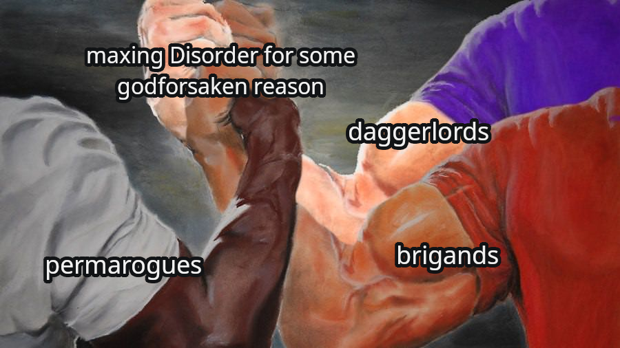
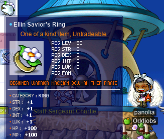
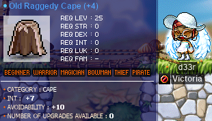
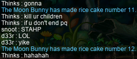
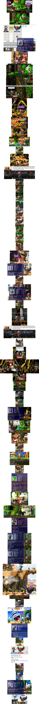

# rangifer’s diary: pt. lviii

technical note for nerds only. you can just skip this if you want

Every entry in this diary, up until (but not including) this one, has handled images in the same way. I used the most widespread losslessly-compressed raster image format available: [PNG](https://en.wikipedia.org/wiki/Portable_Network_Graphics). As such, the screenshots are perfectly accurate (other than some minor edits that I do by hand in [GIMP](https://www.gimp.org/), usually just [cropping][cropping]) to the frames that were actually rendered by the MapleLegends client itself. To save on [bandwidth][bandwidth] (and [memory](https://en.wikipedia.org/wiki/Random-access_memory), but mostly bandwidth), I aggressively optimise all PNG files before [committing](https://en.wikipedia.org/wiki/Git), by using [zopflipng](https://github.com/google/zopfli) with the `-m` flag. zopfli is basically just a [DEFLATE](https://en.wikipedia.org/wiki/Deflate) implementation written by some folks at [Google](https://en.wikipedia.org/wiki/Google). Using zopflipng with the aggressive `-m` flag essentially just takes a very long time (the README claims something like 2 or 3 orders of magnitude more time than [libpng](https://en.wikipedia.org/wiki/Libpng); probably more with `-m` tbh) to re-DEFLATE in more or less the most optimal way possible (or something like that).

One of the images in this diary entry is very large, and I considered actually just putting a URL to it into the diary entry (rather than directly embedding it), requiring readers to manually navigate to the image with their web browser of choice, rather than having it automatically loaded. This kind of workaround is unfortunately necessary (in the case that I really wanted the loading to be [lazy](https://en.wikipedia.org/wiki/Lazy_evaluation)) because I don’t just push commits of this diary to [the Codeberg repo](https://codeberg.org/deer/rangifer_diary) — I also post to [the **Oddjobs** forums](https://oddjobs.flarum.cloud/) as well as [the MapleLegends forums](https://forum.maplelegends.com/index.php). With the Oddjobs forums, [`
`](https://developer.mozilla.org/docs/Web/HTML/Element/details) elements are not supported, so all images are loaded upon loading the page; furthermore, [Flarum](https://flarum.org/) does not [paginate](https://en.wikipedia.org/wiki/Pagination) threads, which makes for a particularly unpleasant & wasteful experience with lengthy & image-heavy threads like the rangifer’s diary one. The MapleLegends forums do support the [BBCode](https://en.wikipedia.org/wiki/BBCode) equivalent (or at least, the [XenForo](https://en.wikipedia.org/wiki/XenForo)-flavoured BBCode equivalent) of `
`: `[spoiler]`. Unfortunately, a certain [truly awful web browser](https://en.wikipedia.org/wiki/Internet_Explorer) does not support the `
` element, which means that if XenForo wants to support masochistic users of said browser, they cannot translate `[spoiler]` elements into `
` elements — instead, a handful of [`
`](https://developer.mozilla.org/docs/Web/HTML/Element/div)s and some clever [CSS](https://en.wikipedia.org/wiki/CSS) has to emulate this functionality. The problem is that this only works _visually_; the content within the `
` is still loaded normally. Reasonable web browser implementations will be _lazy_ about loading the content of true `
` elements, because the content is not used at all, until the user explicitly interacts by opening the element up.

I also considered if my use of zopflipng was aggressive enough. Maybe, by using some less common image format, I could achieve even smaller image sizes without losing any quality (i.e. still lossless). I already had in mind [FLIF](https://flif.info/), which is, as far as I know, basically the cutting edge for lossless raster image formats in general. The FLIF website promises me a roughly 33% decrease in file size when compared to my old method (brute-forcing PNGs with zopflipng), which is pretty damn impressive, considering how aggressive zopflipng is. Unfortunately, FLIF has almost no web browser support whatsoever (see e.g. [this issue](https://bugzilla.mozilla.org/show_bug.cgi?id=1240692) w.r.t. implementing support in [Firefox](https://www.mozilla.org/firefox/), which raises concerns about decode performance), so that’s basically enough to just throw it out of the window. However, I noticed that the FLIF website also compares to [WebP](https://en.wikipedia.org/wiki/WebP), another image format which can support lossless (as well as lossy) compression. Because WebP was developed by Google, I guess they were able to push support for it on the web (thanks to their ownership of [Google Chrome](https://en.wikipedia.org/wiki/Google_Chrome)), and [caniuse claims](https://caniuse.com/webp) that WebP is supported by basically every major browser… again, except for IE. So, with WebP also promising me smaller file sizes than my old approach (although by a smaller margin than FLIF; the zopfli README quotes a 26% reduction), I am now switching to exclusively using lossless WebP for the images in this diary.

If you encounter issues with this change, like not being able to view the images in the diary, I recommend switching to a supported version of a modern web browser like [Firefox](https://www.mozilla.org/firefox/).

## Taxonomising odd jobs, pt. ii: Building up a modern perspective. §4

### dorangpuppy

The last entry I want to talk about here is actually a series of three screenshots by BasilMarket user **dorangpuppy**. dorangpuppy was a KMS player, and posted some screenshots of old pre-BB odd-jobbed KMS characters on BasilMarket, saying the following:

> Hello, I'm Korean maplestory user.(2006~2017)
>
> I'd like to talk about funny character like STR mage, islander, permanent beginner(before big bang)
>
> I have many KMS screenshot of them.

And these “funny characters” are indeed odd-jobbers in our sense, although unfortunately dorangpuppy never posted any screenshots of the second item on this list ([islander](https://oddjobs.codeberg.page/odd-jobs.html#islander)).

[Here](https://web.archive.org/web/20180320175401/http://www.basilmarket.com/KMS-permanent-beginner-ranker-2003-2005--Screen-bbZzP) is one such screenshot, of a level 66 [permabeginner](https://oddjobs.codeberg.page/odd-jobs.html#str-beginner) wielding a [Blood Snowboard](https://maplelegends.com/lib/equip?id=01442017) at [Tree Dungeon, Forest Up North IX](https://maplelegends.com/lib/map?id=101020010). As can be seen from the old-style GUI, this is from a relatively early version of KMS before the GUI was revamped some time in 2005.

And then we have two images ([\[1\]](https://web.archive.org/web/20170809123316/http://www.basilmarket.com/The-pioneer-of-poison-mist-str-mage-KMS--Screen-bbZzQ), [\[2\]](https://web.archive.org/web/20180311145509/https://www.basilmarket.com/KMS-STR-Mage-Screen-bbZzO)) of what dorangpuppy refers to as a “[STR mage](https://oddjobs.codeberg.page/odd-jobs.html#str-mage)”, although upon closer inspection it seems that this F/P archmage is actually a [gish](https://oddjobs.codeberg.page/odd-jobs.html#gish), or perhaps [gishlet](https://oddjobs.codeberg.page/odd-jobs.html#gishlet), of some kind. In the first screenshot, we can see this level 125 mage hitting a [Skelegon](https://maplelegends.com/lib/monster?id=8190003) with their [Elquines](https://maplelegends.com/lib/skill?id=2121005) — this would require _at least_ a combined total of 160 INT+LUK, probably more. For a STR mage, who has 20 base INT and about 4 base LUK, this would be more or less impossible. dorangpuppy gives a rough date on this “STR mage” (2007) and claims that they are the first ever F/P mage of this kind (at least, in KMS).

As mentioned in an earlier installment, I have been focussing on just [English-language](https://en.wikipedia.org/wiki/English_language) resources for this part. So it is fortunate that dorangpuppy, a [Korean](https://en.wikipedia.org/wiki/Korean_language) speaker of KMS, has posted these screenshots on an anglophone site (BasilMarket) for us to see. This is also a testament to just how old odd-jobbed characters are in the history of MapleStory.

### So what?

Well, let’s take a look at some of the odd jobs that have been explored, or at least mentioned, in the archive entries that we’ve looked over in this part:

- [HP warrior](https://oddjobs.codeberg.page/odd-jobs.html#hp-warrior)
- [LUK warrior](https://oddjobs.codeberg.page/odd-jobs.html#luk-warrior)
- [DEX warrior](https://oddjobs.codeberg.page/odd-jobs.html#dex-warrior)
- [STR mage](https://oddjobs.codeberg.page/odd-jobs.html#str-mage)
- [Gish](https://oddjobs.codeberg.page/odd-jobs.html#gish)([let](https://oddjobs.codeberg.page/odd-jobs.html#gishlet)?)
- [Woods(wo)man](https://oddjobs.codeberg.page/odd-jobs.html#woodsman)
- [Islander](https://oddjobs.codeberg.page/odd-jobs.html#islander)
- [STRginner](https://oddjobs.codeberg.page/odd-jobs.html#str-beginner)

This would seem to outline some of the most primitive odd jobs: we have our permabeginners (both on-island and off), our weird-statted mages, our “jobbed beginners”, our weird-statted warriors, and last but not least, our blood warriors.

Along the way, we learned some interesting things that might be surprising when coming from a more rigid modern perspective:

- Unlike our modern notion of HP warrior only including fighters/crusaders/heroes and pages/WKs/paladins, HP spear(wo)men actually used to be a thing.
- The idea of a LUK-based warrior is actually older than you might think, although our evidence for that suggests a much looser definition, that still has a sizable amount of base STR. Similarly, pure DEX warriors are also older than you might think.
- The term “STR mage” has historically been used to collectively refer to any mage job that uses STR, including very different jobs like gish and gishlet.
- The distinction between “woods(wo)man” and a mostly-STR archer has historically been a bit wishy-washy.
- The colourful classification of various varieties of islanders has been with us for a very long time.
- STRginners are about as old as MapleStory itself.

Does this wisdom help us in making a(n) taxonom(y/ies) for odd jobs? Well, I hoped it might, but I will leave it as an exercise to the reader to figure out how useful this will really turn out to be :)

## I’m a rogue

In the previous diary entry, I mentioned in a parenthetical: “I haven’t revealed her yet for a special reason, and she is not revealed in this entry for another, less special, reason: I’m too lazy”. Well, this time, I am forcing myself to be at least un-lazy enough to finally reveal this character in a diary entry. Many who know me in-game already know this character, and at this point she is already level 68! I can reveal this character to you in the same way that I revealed her to **mae** (**technopagan**, **xX17Xx**, **drainer**, **attackattack**, **partyrock**, **maebee**, **strainer**), who is the very person from whom this character was kept a secret, for this entire time. But first, a little context.

mae plays a [permarogue](https://oddjobs.codeberg.page/odd-jobs.html#permarogue) by the name of **xX17Xx**. This character has been around for a while now, and mae has often lamented that no one else plays permarogue — even though it’s obviously the ideal job. A while back, I had floated the idea of trying to get her hands on an [NRC](https://maplelegends.com/lib/equip?id=01472073), but later, Cort (**Cortical**, **xXcorticalXx**, **GishGallop**, **Medulla**, **Subcortical**, **MageFP**) and I decided to do this, but keep it a secret so that we could eventually give it to mae as a surprise present. Cort also had the idea to make matching permarogues named **xX16Xx** and **xX18Xx** who would get to level 35 to meet mae at [LPQ](https://maplelegends.com/lib/map?id=221024500) (where she was PQing with her [DEX page](https://oddjobs.codeberg.page/odd-jobs.html#dex-warrior) **attackattack** at the time) and surprise her there.

After a _lot_ of effort and money poured into getting an NRC (and some 1M(?) mesos or so put towards a minimum WATK NRC with 0 slots left, to use as a joke) that would be suitable as a gift — NRCs are very rare and tend to be egregiously expensive, and I actually personally crafted two of them myself — we eventually got to the point where we were ready for the reveal. Except we were a little too slow and lazy to get very far past level 31… but oh well, at least 31 is high enough to be a true permarogue. Rather than do the reveal at LPQ (mae had moved on to [EPQ](https://maplelegends.com/lib/map?id=300030100) with attackattack by this point), we just did it in the [FM](https://maplelegends.com/lib/map?id=910000000). Oh, and also, I wanted to play a permarogue seriously as well, and I didn’t want to steal mae’s name instead of using my own personal nomenclature, so I had created not one, but two permarogues by this point.

You can watch the reveal here:

**[mae meets the permarogues \[YouTube\]](https://youtu.be/dLYOGLywibU)**

So, you won’t be seeing any more of xX18Xx (other than in the above video), but you will be seeing more of **panolia**:

You can see panolia throwing some [MTK](https://maplelegends.com/lib/use?id=2070019)s in the above image; the MTKs are not actually mine, but were lent to me by Cort. In any case, readers of this diary already know my [daggermit](https://oddjobs.codeberg.page/odd-jobs.html#dagger-assassin) **alces**; daggerlords tend to play a little like dagger-only permarogues insofar as they are stuck with [Double Stab](https://maplelegends.com/lib/skill?id=4001334) for life. So with panolia, I have been focussing more on the other side of the first-job rogue arsenal: claw usage with [L7](https://maplelegends.com/lib/skill?id=4001344). It is also time that I reveal these shitty memes I made one day for no real reason… maybe I just wanted an excuse to use [GIMP](https://www.gimp.org/) or something…

shitty maymays that are much too niche

Here is a smol screenshot of a usual interaction with [OPQ](https://maplelegends.com/lib/map?id=200080101) randoms:

Usually, when people ask “why”, I inform them that it’s really quite simple: I steal shit, and I beat people up. I’m a rogue. What else would I need to be?

The screenshot further above, of panolia taking on a [Wild Kargo](https://maplelegends.com/lib/monster?id=6230100), was taken while panolia was hunting for her [Ellin ring](https://maplelegends.com/lib/equip?id=01119001). Here I am, farming the [Firebombs](https://maplelegends.com/lib/monster?id=5100002) for [their ETC](https://maplelegends.com/lib/etc?id=4000081)s:

And with the ETCs collected for the final bit of the questline, I headed back in time to do the questline proper:

Easily done, for panolia, shredding these poor old creatures to a fine pulp with Lucky Seven… And there it is! The ring~!

The ring is known for its +1 allstat and its +100 MAXHP, and that +100 MAXHP is quite juicy for panolia. When using a claw, the +1 allstat only really matters because of the +1 LUK (as panolia is DEXless, and L7 does not take STR/DEX into account when calculating damage) — but actually, getting the ring at this time was quite crucial for another reason: HP [washing](https://maplelegends.com/lib/cash?id=5050000).

“Le gasp!!”, I hear you say. “deer, I thought you hated washing! Plus, isn’t it disallowed in your guild anyways?” Well, the short answer is: yes, and sort of. **Oddjobs** has pretty much always allowed washing, but only for permabeginners, as [they are extremely squishy](https://forum.maplelegends.com/index.php?threads/nises-hp-washing-formula-compilation.38558/) even when compared to an unwashed, but otherwise completely normal, archer/rogue character. I have never once prevented, nor even discouraged, any permabeginners from HP washing. Personally, my permabeginner (**hashishi**) is completely unwashed, and I intend to keep her that way for various reasons. However, it wasn’t until a bit later that I instituted another exception to the “no washing” rule, specifically for [permarchers](https://oddjobs.codeberg.page/odd-jobs.html#permarcher), [permarogues](https://oddjobs.codeberg.page/odd-jobs.html#permarogue), and [permapirates](https://oddjobs.codeberg.page/odd-jobs.html#permapirate). The reason for this was that I found out that, again when compared to a normal but unwashed archer/rogue, these perma-first-jobbers in particular (not [permawarrior](https://oddjobs.codeberg.page/odd-jobs.html#permawarrior) nor [permamagician](https://oddjobs.codeberg.page/odd-jobs.html#permamagician), for reasons that are perhaps obvious) were at a defensive disadvantage. At the time, two of the perma-1sts in the guild (**xX17Xx** and **gogigagagigo**) expressed some interest in experimenting with HP washing, so I decided to simply allow them to do it (after all, they are mechanically at a disadvantage), and lend some INT gear (borrowed from my I/L [magelet](https://oddjobs.codeberg.page/odd-jobs.html#magelet) **cervine**) to help out as well.

When Cort encouraged me to make a permarogue (at this time, just xX18Xx), we discussed the possibility of doing some light HP washing (keep in mind that the no-leech rule is, and has always been, a hard rule for Oddjobs, so HP washing to a high degree is difficult or impossible anyways). xX18Xx (and xX16Xx) actually still, to this day, have 40 base INT each. Partly, we just wanted our characters to be more similar to xX17Xx (who has done some amount of washing as well), and I had never actually done HP washing in my entire Maple career, so I figured I may as well try it at least once — after all, I play in a server that is dominated by this mechanic, and I already incidentally have a bunch of INT gear anyways.

So I taught myself the finer details of how HP washing actually works. I quickly realised that, in addition to HP washing obviously scaling with character level (more levelups with ≥10 total INT → more excess MP & fresh AP → more washes are possible to perform), which I knew already, the HP disadvantage of the three perma-1st-jobs listed above does _not_ scale with character level at all. The advantage is simply a constant (albeit [somewhat random](https://en.wikipedia.org/wiki/Discrete_uniform_distribution)) boost that is awarded at the point of second job advancement. Further job advancements (3rd, 4th) do not award any such boost. So I knew that, in the long run, simply allowing these perma-1sts in particular to wash arbitrarily would be kinda broken. Running some of the actual concrete numbers myself, I realised that I would be able to fairly easily (and at a reasonably low level, i.e. not having to get a very high level like 100+) meet the number of washes necessary to recoup the MAXHP lost from never taking 2nd job advancement. So part of my experimenting with washing on panolia is to show that my own guild rules are horribly broken: panolia has gone for 40 base INT, and with some of my own already-existing INT gear (plus a random INT cape I picked up for 3M mesos), I intend to prove this brokenness. It seems that (perhaps unsurprisingly…), no matter what way you slice it — the way that we are slicing it here being that we use unwashed non-odd archers/rogues as a baseline — the “washing problem”, if you will, is also impossible to really solve even if you institute self-imposed restrictions. Our guild rules are, of course, followed merely on an [honour-system](https://en.wikipedia.org/wiki/Honor_system) basis.

So, anyways. I needed this +1 INT from the Ellin ring, plus my INT gear and some temporary equips from this past anniversary event, to achieve exactly 90 INT from gear (and thus 130 INT total) when in full washing mode at level 65+.

One of the running jokes about permarogues is that, much like permamagicians mysteriously lacking [Teleport](https://maplelegends.com/lib/skill?id=2101002) despite all 2nd-job mages possessing it, permarogues mysteriously lack [Haste](https://maplelegends.com/lib/skill?id=4201003), despite all 2nd-job rogues possessing it. So I get a lot of “haste plz”, some genuine and some sarcastic… Luckily for panolia, she has an in-game macro called “Haste” that seems to do the trick — for me, at least:

(It’s slightly tricky to spot in this image, but the macro is just a macro for [Nimble Feet](https://maplelegends.com/lib/skill?id=0001002).)

And in OPQ particularly, now that I have hit level 65 and can use alces’s [Fan](https://maplelegends.com/lib/equip?id=01332030), I like to switch between claw and dagger, depending on which one is more suitable for that stage (or that particular part of the stage):

And here I am, fighting [Papa Pixie](https://maplelegends.com/lib/monster?id=9300039) with fellow odd-jobbers **Hanyou** (**Taima**, **Tacgnol**, **Boymoder**, **Gambolpuddy**, **Numidium**, **Inugami**) the [DEX WK](https://oddjobs.codeberg.page/odd-jobs.html#dex-warrior) and **Medulla** (**Cortical**) the [dagger fighter](https://oddjobs.codeberg.page/odd-jobs.html#dagger-warrior):

Now that panolia is level 65 — and thus able to use the [Skanda](https://maplelegends.com/lib/equip?id=01472055) shown in the previous diary entry, as well as my [PGC](https://maplelegends.com/lib/equip?id=01102084) and Cort’s MTKs — she does absolutely too much DPS to poor papa pixel. One of the folks I OPQed with was shocked to see me consistently knocking papa pixel back, even when I was the only one on papa’s left-hand side, and horrified to see me level up upon completion of the PQ… I only grow stronger!!! We shall see how panolia performs once she hits level 86 and I wash away 36 of her base INT…

## d33r

Iiiiiit’s [vicloc](https://forum.maplelegends.com/index.php?threads/victoria-the-victoria-island-locked-guild.41605/) time~!

I’ve been playing my vicloc [clericlet](https://oddjobs.codeberg.page/odd-jobs.html#magelet) **d33r** a bit, while focussing on my vicloc [dagger spearwoman](https://oddjobs.codeberg.page/odd-jobs.html#dagger-warrior) **d34r**~ Here are some of the things d33r has been up to:

Here is d33r, duoing a [stumpers](https://maplelegends.com/lib/monster?id=3220000) with fellow odd-jobbed viclocker, the [bullet brawler](https://oddjobs.codeberg.page/odd-jobs.html#bullet-bucc) **SeaThief**!

And I managed to run across a [Mano](https://maplelegends.com/lib/monster?id=2220000) somehow, who was generous enough to drop a card for me:

Later, I ran across another stumpers and was forced to solo it:

Not gonna lie, that fight was a _real_ struggle, especially because stumpers can heal itself! Speaking of stuggles, here I am with the usual face that I make when I’m trying to complete a JQ for the rewards:

This is the second Sleepywood JQ, I think, and I actually was unable to complete it on my first series of attempts. Later, though, **xXCrookXx** helped me out with it, and with that I was actually able to finish this bad boy:

Wowie~ And I scrolled myself a very nice cape!!:

Not pictured here is me failing the first [OA INT 60%](https://maplelegends.com/lib/use?id=2040513) that I was able to finally find (there is only one source of this scroll in vicloc: [King Clang](https://maplelegends.com/lib/monster?id=5220000), a.k.a. KC or Casey). :(

And finally, the following image I leave without any context whatsoever:

## d34r

By the end of the previous diary entry, my vicloc [dagger spearwoman](https://oddjobs.codeberg.page/odd-jobs.html#dagger-warrior) **d34r** was level 23 or so. Well, I’ve been a tad bit lazy to write another diary entry, and in the meantime, I’ve been playing d34r a little. Okay, maybe “a little” is an understatement — she’s level 48 now :) No small increase in levels, especially for an odd-jobbed viclocker!!

Also at the end of the previous diary entry, I was debating whether to go the [fighter](https://maplelegends.com/lib/skill?id=1101006) route or the [spearwoman](https://maplelegends.com/lib/skill?id=1301007) route. I was leaning towards the latter, and **Daggington** (**cobbages**, **snoot**; also a dagger warrior) sealed the deal for me:

Rather than walk through the journey verbally, I want to try something slightly different here: I’ve composed many of the screenshots that I took while playing d34r into a linear collage. This is not really the first composition of this kind that I’ve done in this diary, but this one is quite large, and traces d34r’s journey from level 23 to level 48 more or less chronologically:

d34r’s journey~

As you can see, d34r takes after my other odd spearwoman (**rusa**, my [darksterity knight](https://oddjobs.codeberg.page/odd-jobs.html#dex-warrior)) — soloing [King Slime](https://maplelegends.com/lib/monster?id=9300003), [Stumpy](https://maplelegends.com/lib/monster?id=3220000), [Faust](https://maplelegends.com/lib/monster?id=5220002), and even [King Clang](https://maplelegends.com/lib/monster?id=5220000)! I also participated in the first-ever vicloc [ZMM](https://maplelegends.com/lib/monster?id=6300005) kill! Admittedly, I did none of the actual DPS (at least not to ZMM herself; I was mostly killing her [Zombie Mushroom](https://maplelegends.com/lib/monster?id=2230101) and [Jr. Booger](https://maplelegends.com/lib/monster?id=3230301) minions), for lack of WACC, but I did help support with [Hyper Body](https://maplelegends.com/lib/skill?id=1301007)!!

I’ve gradually grown into a partial-NX look for d34r. All of my NX gear is designed around the original look that I made for her, but I’m really liking the exposed helmet, gloves, shield, and armour! It makes me feel tuff!!! My only real gripe is that [the armour](https://maplelegends.com/lib/equip?id=01051001) only actually looks good when I’m standing still or walking normally. A closer inspection (e.g. when attacking or jumping) reveals that it’s, bizarrely, actually a one-piece swimsuit — my shoes only _appear_ to meet directly with my armour because of my dagger obscuring the bare part where my upper thighs show… \>.\<

As you can also see, d34r is very str0nk now. But I hope to make her even str0nker!! There are still some things that I want to do that lie out of my reach for my vicloc characters at the moment. My next big milestone will be level 50, not least because I can finally shed my old level 30 [Cass](https://maplelegends.com/lib/equip?id=01332009) in favour of the sleek [Sai](https://maplelegends.com/lib/equip?id=01332016)~ I actually have one already, that **Thinks** (**OmokTeacher**, **Slime**) kindly traded to me, but it’s unfortunately only 61 WATK… I have been killing more [Copper Drakes](https://maplelegends.com/lib/monster?id=4130100) and [Skeledogs](https://maplelegends.com/lib/monster?id=4230125) (both of which drop the Sai) than I ever thought possible, and still have not actually seen a single one drop with my own eyes. If a get to level 50 without another Sai drop, I will just have to [100%](https://maplelegends.com/lib/use?id=2043300) the 61 WATK one!

## alces is stuck

Some readers (maybe, I dunno) might be wondering why my [daggermit](https://oddjobs.codeberg.page/odd-jobs.html#dagger-assassin) **alces** is still level 85. The answer is that alces, **xX17Xx**, and **GishGallop** are collectively stuck at level 85 in an attempt to get xX17Xx her [Horus’ Eye](https://maplelegends.com/lib/equip?id=01122010) from [MPQ](https://maplelegends.com/lib/map?id=261000021). Here we are, with a priest by the name of **MartijnHS**, in stage 3 of the PQ:

…In which you can see xX17Xx also throwing the same MTKs from earlier.

So, for now, alces is in MPQ+suicide hell, but in the future, I hope to put on some real rogue gear!!

\<3

[cropping]: https://en.wikipedia.org/wiki/Cropping_(image)
[bandwidth]: https://en.wikipedia.org/wiki/Bandwidth_(computing)
