# rangifer’s diary: pt. lix

## Taxonomising odd jobs, pt. iii: Exploring the space of possible taxonomies. §1

- In pt. i of this series, “What even _is_ an odd job, tho?”, we defined some terminology that is used throughout this entire series. And then we explored an answer (specifically, my answer) to the question that gives the part its name. This can be summarised in the following checklist of items that every “proper” odd job (i.e. an odd job that is not a subjob of any other odd job) must satisfy all items of, on our view:
    - Defining a particular odd job (e.g. [permawarrior](https://oddjobs.codeberg.page/odd-jobs.html#permawarrior)) is **simple**.
    - Insofar as an odd job is “odd”, it is **pure** in its “odd” aspect.
    - Each particular odd job satisfies some intuitive notion of **natural**.
    - The name that we are choosing to use here, “odd job”, is simultaneously fortunate and unfortunate. The “simplicity”, “purity”, and “naturalness” of odd jobs (as listed previously) justifies the use of the word “job” in the phrase “odd job”.
    - Odd jobs are, to the extent possible, **atemporal**.
- In pt. ii of this series, “Building up a modern perspective.”, we considered that — depending upon a large number of various factors — one’s perspective/view/conceptualisation of what “odd jobs” are in particular, might differ significantly enough that we want to dedicate some time to other perspectives as well. In particular, we went through and analysed a number of entries in [the archive](https://oddjobs.codeberg.page/archive/), trying to reconstruct something resembling a historied perspective.

In this part (pt. iii) of the “Taxonomising odd jobs” series, I want to (try to) get into the meat of it. After all, ultimately the point of this series is to do as the name says — to taxonomise odd jobs. I strongly suspect that **the taxonom(y/ies) that we arrive at in this series will only be a few in a large space of possible reasonable taxonomies**. So, with this in mind, it’s time to do a bit of exploration.

### Phenetics vs. cladistics

I thought a little bit about what starting points one might have for a taxonomy of odd jobs. By “starting point”, I mean a guiding principle that outlines the basic structure of the taxonomy. Maybe I didn’t think about it hard enough, but in any case, what I came up with vaguely aligns with a dichotomy often touted in [biological taxonomy][taxonomy-bio]: that of [phenetics](https://en.wikipedia.org/wiki/Phenetics) vs. [cladistics](https://en.wikipedia.org/wiki/Cladistics). For readers who are not biologists, a brief overview of these terms is in order.

Modern biological taxonomy is based on cladistics. Cladistics is deeply rooted in [evolutionary biology](https://en.wikipedia.org/wiki/Evolutionary_biology). Cladistics organises species into “clades”, where each clade is [rooted][tree] in a single [common ancestor](https://en.wikipedia.org/wiki/Common_ancestry), and additionally **contains every descendent of that common ancestor** (which might be zero descendants, in which case the clade is an isolate, having just one member). It does not contain anything else; this means that clades are [monophyletic](https://en.wikipedia.org/wiki/Monophyly) by definition (indeed, “clade” and “monophyletic group” are usually used synonymously). As you can see, this makes cladistics fundamentally based on _decendancy_.

On the other hand, phenetics reflects an older (and, in a biological context, largely outdated, save for some [numerical](https://en.wikipedia.org/wiki/Numerical_analysis) methods that can sometimes be useful in cladistics) approach. Rather than having anything to do with evolutionary biology, phenetics classifies its subjects based on their _observable properties_. In the biological case, this means [morphological][morphology]/[physiological](https://en.wikipedia.org/wiki/Physiology)/[genotypical](https://en.wikipedia.org/wiki/Genotype)/[ethological](https://en.wikipedia.org/wiki/Ethology) concerns. The phenetician’s job, then, is essentially to catalogue the properties of various species, and then determine a way of clustering them — based on some notion of similarity — to form groups. From an evolutionary perspective, phenetic methods fail to distinguish between — for example — a distinguishing trait shared between two species that is the result of [synapomorphy](https://en.wikipedia.org/wiki/Synapomorphy_and_apomorphy), and one that is the result of [homoplasy](https://en.wikipedia.org/wiki/Homoplasy). More simply put, a shared trait that is shared as the result of both species _inheriting_ the trait from a shared common ancestor, is indistinguishable from that shared trait being the result of _separate innovations_ that just so happened to innovate the same thing (kinda similar to [multiple discovery](https://en.wikipedia.org/wiki/Multiple_discovery)). From an evolutionary perspective, this is a fatal flaw of phenetics, as it makes phenetics largely blind to evolutionary relationships.

The analogy between the biological phenetics-versus-cladistics dichotomy, and the subject matter that we have at hand (MapleStory odd jobs), is maybe not super clear. A more phenetics-oriented approach is the obvious way forward here. This isn’t biology; there is no evolutionary process _per se_, and thus no clear notion of decendancy. But, nevertheless, it appears possible to me, at first blush, to fabricate some kind of hierarchy that may hope to (vaguely) resemble a [phylogenetic tree](https://en.wikipedia.org/wiki/Phylogenetic_tree) (or perhaps a forest of such trees). As we explored in pt. ii of this series, some odd jobs can be thought of as more “primitive” than others, and may have occurred (i.e. were actually invented and played) earlier. Furthermore, the _subjob_ relation could come into play here as well — sometimes, jobs give way to subjobs, and these cases might look like decendancy as well.

On the phenetics-y side of things, I want to investigate some kind of “bag of [properties](https://plato.stanford.edu/entries/properties/)” approach(es). I’m borrowing the phrase “bag of properties” (sometimes also “property bag”) from obscure [programming](https://en.wikipedia.org/wiki/Computer_programming) jargon, where the pattern in question is commonly used in languages like [ECMAScript](https://en.wikipedia.org/wiki/ECMAScript) that combine a [structural-typing](https://en.wikipedia.org/wiki/Structural_type_system)-inspired approach (as in e.g. [OCaml](https://en.wikipedia.org/wiki/OCaml)) with a [complete lack of types](https://en.wikipedia.org/wiki/Type_system#Dynamic_type_checking_and_runtime_type_information)\*. This bag of properties view, where each object (viz. each job, in our view; or each (sub)species, in the biological view) is merely a bag of properties, and objects are compared simply by pairwise comparing their properties against one another, distills down the ontology of the phenetics(-inspired) approach. Of course, one issue is deciding what properties exist — as we will see, there are many possible properties that can potentially be assigned to a single job, so our bags will perhaps look a bit larger than you expect. And perhaps even more of an issue is deciding which properties are relevant, and how relevant.

Footnotes for “Phenetics vs. cladistics”

\*Some of you are currently yelling at your screens: “What do you mean, ‘complete lack of types’? If it’s dynamically _typed_, then surely it has types, they are just dynamic!”. Unfortunately, you are all mistaken!! The form of an object’s in-[memory](https://en.wikipedia.org/wiki/Random-access_memory) representation, and its [type](https://en.wikipedia.org/wiki/Type_theory), are never the same thing. To conflate them is a [category error](https://en.wikipedia.org/wiki/Category_mistake) — the former is physically manifested, and relevant only to [code generation][code-generation] and runtime behaviour, whereas the latter is merely an abstract mathematical construct, relevant only to the [proofs](https://en.wikipedia.org/wiki/Mathematical_proof) that a [translator][translator] generates when [typechecking](https://en.wikipedia.org/wiki/Type_system#Type_checking) an otherwise [well-formed](https://en.wikipedia.org/wiki/Well-formedness) program. That’s right, there is no such thing as so-called “dynamic typing”!! Fight me about it!!! (don’t actually. or do.)

## PQ2

## The adventures of d34r

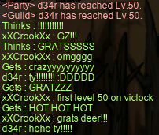

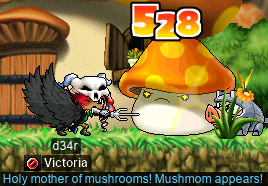

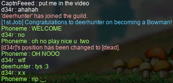

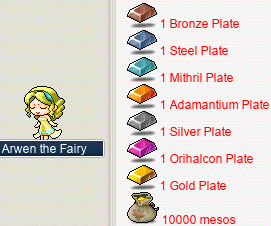

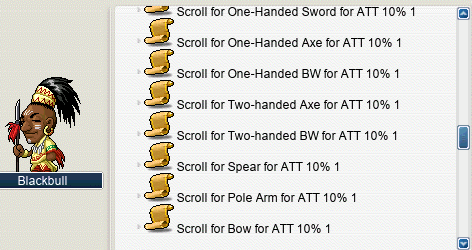

Hunting for d34r’s T1~!

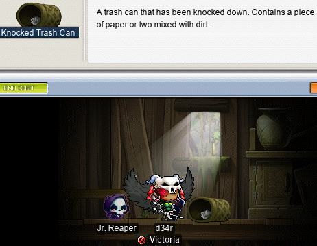

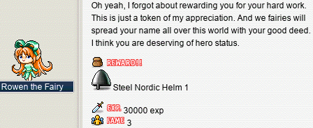

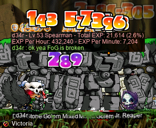

## The adventures of d33r

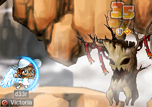

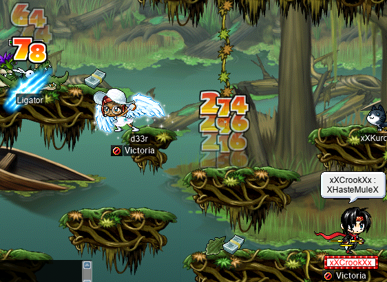

## Doing NLC quests w/ Boymoder

NLC quests wif BOIMOUDO

## pan oiler

## alces is free at last~

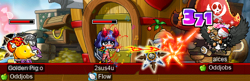

## These bosses are not on Victoria Island! Bah, humbug!!

Big bad boss guys within!

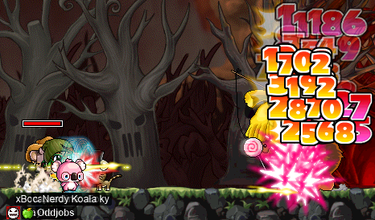

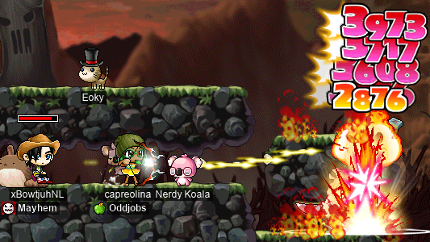

## Gun!!

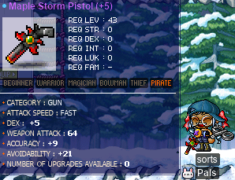

[taxonomy-bio]: https://en.wikipedia.org/wiki/Taxonomy_(biology)
[tree]: https://en.wikipedia.org/wiki/Tree_(graph_theory)
[morphology]: https://en.wikipedia.org/wiki/Morphology_(biology)
[translator]: https://en.wikipedia.org/wiki/Translator_(computing)
[code-generation]: https://en.wikipedia.org/wiki/Code_generation_(compiler)
