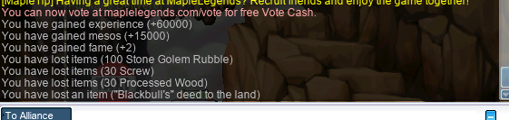
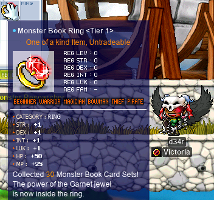
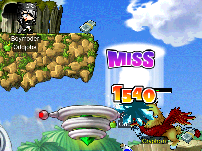
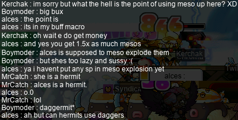
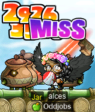

# rangifer’s diary: pt. lix

## Taxonomising odd jobs, pt. iii: Exploring the space of possible taxonomies. §1

- In pt. i of this series, “What even _is_ an odd job, tho?”, we defined some terminology that is used throughout this entire series. And then we explored an answer (specifically, my answer) to the question that gives the part its name. This can be summarised in the following checklist of items that every “proper” odd job (i.e. an odd job that is not a subjob of any other odd job) must satisfy all items of, on our view:
    - Defining a particular odd job (e.g. [permawarrior](https://oddjobs.codeberg.page/odd-jobs.html#permawarrior)) is **simple**.
    - Insofar as an odd job is “odd”, it is **pure** in its “odd” aspect.
    - Each particular odd job satisfies some intuitive notion of **natural**.
    - The name that we are choosing to use here, “odd job”, is simultaneously fortunate and unfortunate. The “simplicity”, “purity”, and “naturalness” of odd jobs (as listed previously) justifies the use of the word “job” in the phrase “odd job”.
    - Odd jobs are, to the extent possible, **atemporal**.
- In pt. ii of this series, “Building up a modern perspective.”, we considered that — depending upon a large number of various factors — one’s perspective/view/conceptualisation of what “odd jobs” are in particular, might differ significantly enough that we want to dedicate some time to other perspectives as well. In particular, we went through and analysed a number of entries in [the archive](https://oddjobs.codeberg.page/archive/), trying to reconstruct something resembling a historied perspective.

In this part (pt. iii) of the “Taxonomising odd jobs” series, I want to (try to) get into the meat of it. After all, ultimately the point of this series is to do as the name says — to taxonomise odd jobs. I strongly suspect that **the taxonom(y/ies) that we arrive at in this series will only be a few in a large space of possible reasonable taxonomies**. So, with this in mind, it’s time to do a bit of exploration.

### Phenetics vs. cladistics

I thought a little bit about what starting points one might have for a taxonomy of odd jobs. By “starting point”, I mean a guiding principle that outlines the basic structure of the taxonomy. Maybe I didn’t think about it hard enough, but in any case, what I came up with vaguely aligns with a dichotomy often touted in [biological taxonomy][taxonomy-bio]: that of [phenetics](https://en.wikipedia.org/wiki/Phenetics) vs. [cladistics](https://en.wikipedia.org/wiki/Cladistics). For readers who are not biologists, a brief overview of these terms is in order.

Modern biological taxonomy is based on cladistics. Cladistics is deeply rooted in [evolutionary biology](https://en.wikipedia.org/wiki/Evolutionary_biology). Cladistics organises species into “clades”, where each clade is [rooted][tree] in a single [common ancestor](https://en.wikipedia.org/wiki/Common_ancestry), and additionally **contains every descendent of that common ancestor** (which might be zero descendants, in which case the clade is an isolate, having just one member). It does not contain anything else; this means that clades are [monophyletic](https://en.wikipedia.org/wiki/Monophyly) by definition (indeed, “clade” and “monophyletic group” are usually used synonymously). As you can see, this makes cladistics fundamentally based on _decendancy_.

On the other hand, phenetics reflects an older (and, in a biological context, largely outdated, save for some [numerical](https://en.wikipedia.org/wiki/Numerical_analysis) methods that can sometimes be useful in cladistics) approach. Rather than having anything to do with evolutionary biology, phenetics classifies its subjects based on their _observable properties_. In the biological case, this means [morphological][morphology]/[physiological](https://en.wikipedia.org/wiki/Physiology)/[genotypical](https://en.wikipedia.org/wiki/Genotype)/[ethological](https://en.wikipedia.org/wiki/Ethology) concerns. The phenetician’s job, then, is essentially to catalogue the properties of various species, and then determine a way of clustering them — based on some notion of similarity — to form groups. From an evolutionary perspective, phenetic methods fail to distinguish between — for example — a distinguishing trait shared between two species that is the result of [synapomorphy](https://en.wikipedia.org/wiki/Synapomorphy_and_apomorphy), and one that is the result of [homoplasy](https://en.wikipedia.org/wiki/Homoplasy). More simply put, a shared trait that is shared as the result of both species _inheriting_ the trait from a shared common ancestor, is indistinguishable from that shared trait being the result of _separate innovations_ that just so happened to innovate the same thing (kinda similar to [multiple discovery](https://en.wikipedia.org/wiki/Multiple_discovery)). From an evolutionary perspective, this is a fatal flaw of phenetics, as it makes phenetics largely blind to evolutionary relationships.

The analogy between the biological phenetics-versus-cladistics dichotomy, and the subject matter that we have at hand (MapleStory odd jobs), is maybe not super clear. A more phenetics-oriented approach is the obvious way forward here. This isn’t biology; there is no evolutionary process _per se_, and thus no clear notion of decendancy. But, nevertheless, it appears possible to me, at first blush, to fabricate some kind of hierarchy that may hope to (vaguely) resemble a [phylogenetic tree](https://en.wikipedia.org/wiki/Phylogenetic_tree) (or perhaps a forest of such trees). As we explored in pt. ii of this series, some odd jobs can be thought of as more “primitive” than others, and may have occurred (i.e. were actually invented and played) earlier. Furthermore, the _subjob_ relation could come into play here as well — sometimes, jobs give way to subjobs, and these cases might look like decendancy as well.

On the phenetics-y side of things, I want to investigate some kind of “bag of [properties](https://plato.stanford.edu/entries/properties/)” approach(es). I’m borrowing the phrase “bag of properties” (sometimes also “property bag”) from obscure [programming](https://en.wikipedia.org/wiki/Computer_programming) jargon, where the pattern in question is commonly used in languages like [ECMAScript](https://en.wikipedia.org/wiki/ECMAScript) that combine a [structural-typing](https://en.wikipedia.org/wiki/Structural_type_system)-inspired approach (as in e.g. [OCaml](https://en.wikipedia.org/wiki/OCaml)) with a [complete lack of types](https://en.wikipedia.org/wiki/Type_system#Dynamic_type_checking_and_runtime_type_information)\*. This bag of properties view, where each object (viz. each job, in our view; or each (sub)species, in the biological view) is merely a bag of properties, and objects are compared simply by pairwise comparing their properties against one another, distills down the ontology of the phenetics(-inspired) approach. Of course, one issue is deciding what properties exist — as we will see, there are many possible properties that can potentially be assigned to a single job, so our bags will perhaps look a bit larger than you expect. And perhaps even more of an issue is deciding which properties are relevant, and how relevant.

Footnotes for “Phenetics vs. cladistics”

\*Some of you are currently yelling at your screens: “What do you mean, ‘complete lack of types’? If it’s dynamically _typed_, then surely it has types, they are just dynamic!”. Unfortunately, you are all mistaken!! The form of an object’s in-[memory](https://en.wikipedia.org/wiki/Random-access_memory) representation, and its [type](https://en.wikipedia.org/wiki/Type_theory), are never the same thing. To conflate them is a [category error](https://en.wikipedia.org/wiki/Category_mistake) — the former is physically manifested, and relevant only to [code generation][code-generation] and runtime behaviour, whereas the latter is merely an abstract mathematical construct, relevant only to the [proofs](https://en.wikipedia.org/wiki/Mathematical_proof) that a [translator][translator] generates when [typechecking](https://en.wikipedia.org/wiki/Type_system#Type_checking) an otherwise [well-formed](https://en.wikipedia.org/wiki/Well-formedness) program. That’s right, there is no such thing as so-called “dynamic typing”!! Fight me about it!!! (don’t actually. or do.)

## PQ2

In pt. liii of this diary, I attended a virtual rave (as my [daggermit](https://oddjobs.codeberg.page/odd-jobs.html#dagger-assassin) **alces**) at [FM 4-20](https://maplelegends.com/lib/map?id=910000020), called “PartyQuest”. The rave was hosted by **osmanthus** (IGN **zkgui**) on [datafruits\.fm](https://datafruits.fm/), and featured **technopagan** (mae; **xX17Xx**, **drainer**, **attackattack**, **strainer**, **partyrock**, **maebee**) DJing as one of the main acts! I attended the sequel this time — PartyQuest 2 — which was set up similarly, except that it was hosted in channel 1 of [Maya’s House](https://maplelegends.com/lib/map?id=100000001) (actually called “Henesys Townstreet” in-game for some reason). I attended as my I/L [magelet](https://oddjobs.codeberg.page/odd-jobs.html#magelet) **cervine**, and later as my [besinner](https://oddjobs.codeberg.page/odd-jobs.html#besinner) **hashishi**. You can see me as cervine in the screenshot below, which features [permabeginners](https://oddjobs.codeberg.page/odd-jobs.html#str-beginner) drainer, **Cowbelle**, and **Cortical**, as well as **Monologue** (you can’t see the nametag, as he is the bottom-left-most character in the screenshot), who (as I found out during the rave) was a major active figure in the permabeginner scene of GMS:

The above screenshot was not taken by me — credit for the screenshot goes to @Cowbelle!

## The adventures of d34r

That’s right, it’s time for more vicloc adventures!! My vicloc [dagger spearwoman](https://oddjobs.codeberg.page/odd-jobs.html#dagger-warrior), **d34r**, hit level 50 :O

To celebrate this milestone, an outlander by the name of **Boymoder** (**Taima**, **Tacgnol**, **Hanyou**, **Numidium**, **Gambolpuddy**, **Nyanners**, **Spagonia**, **Naganohara**) taunted me with [forbidden juice](https://maplelegends.com/lib/use?id=2022002):

Where the outlanders get these horrible corrupting substances, I do not know. But fear not — I resisted all temptation.

I’m keenly aware that, now, I have not one, but _two_, odd DKs. Okay, technically one of them is not (and can never be) a “DK” _per se_ (as 3rd and 4th jobs do not exist in vicloc), but you know what I mean. So I brought my [darksterity knight](https://oddjobs.codeberg.page/odd-jobs.html#dex-warrior) **rusa** to meet with d34r:

F6 indeed.

I needed a [Mushmom ETC](https://maplelegends.com/lib/etc?id=4000040) in order to complete a level 40 questline by the name of [Jane the Alchemist](https://bbb.hidden-street.net/quest/victoria-island/jane-the-alchemist). I wanted to complete the quest earlier, as the main reward is access to Jane’s shop, which offers discounted(!) [Unagis](https://maplelegends.com/lib/use?id=2022003) and [Pure Waters](https://maplelegends.com/lib/use?id=2022000), but I needed to be at least level 50 to be able to hold mapowner for [the Mushmom map](https://maplelegends.com/lib/map?id=100000005). Now that I was level 50, I picked a channel and camped out waiting for [Mushmom](https://maplelegends.com/lib/monster?id=6130101):

Eventually, a mushroom mother did appear!:

At this point, I would still have some serious issues hitting Mushmom — she was 10 levels higher than me, has 27 AVOID, and I am merely a masteryless vicloc warrior. But I was able to defeat her, after not too much trouble:

Yay! The ETC dropped!! With this, I had all that I needed for my quest, but I figured I would check some other mushroom mother channels in case I could get a second ETC for other questers (including my [clericlet](https://oddjobs.codeberg.page/odd-jobs.html#magelet) **d33r**). Along the way, I was unexpectedly slain:

x\.x

**deerhunter** turned out to be the [woodswoman](https://oddjobs.codeberg.page/odd-jobs.html#woodsman) of Spagonia/Naganohara, and the pun of her name is three-pronged:

1. Because deerhunter is a woodswoman going the bow-using (hunter) route, she will actually permanently be a _hunter_, as 3rd and 4th job do not exist in vicloc, so there is no advancement to ranger nor bowmaster.
2. She actually enjoys the music of the American band, [Deerhunter](https://en.wikipedia.org/wiki/Deerhunter).
3. I am deer, the one being hunted. ;~;

My search for other Mushmoms turned out to be shockingly successful. In just two generations of Mushmom, I was able to go from 0/5 Mushmom cards to 5/5!!:

And with a third generation, I managed to find a rare and powerful artefact… the legendary [Ilbi](https://maplelegends.com/lib/use?id=2070006):

Wowee~

I later went on to do the [Building a New House For Blackbull](https://bbb.hidden-street.net/quest/victoria-island/building-a-new-house-for-blackbull) quest, which meant collecting some rubble from [Stone Golems](https://maplelegends.com/lib/monster?id=5130101):

I already had the other ETC items on hand, so I went to complete the quest, only to find that it is bugged:

For some reason, I was offered a [Bow WATK 10%](https://maplelegends.com/lib/use?id=2044502) as one of the possible rewards, and, figuring this would be more useful than the others (as I was not offered a [Dagger WATK 10%](https://maplelegends.com/lib/use?id=2043302)), I selected it… only to end up receiving no scrolls at all. I [reported this on the MapleLegends forums](https://forum.maplelegends.com/index.php?threads/building-a-new-house-for-blackbull-quest-reward.21526/), replying to a bug report on this quest from over three years ago, 2018-05-13!

In any case, I continued on with the Jane the Alchemist questline. I needed some [Drake’s Blood](https://maplelegends.com/lib/use?id=2012000), so I headed to deep Sleepywood and tried grinding on [some](https://maplelegends.com/lib/map?id=105080000) Drake [maps](https://maplelegends.com/lib/map?id=105090300):

And in the process, I finished the first part of the [A Spell That Seals Up a Critical Danger](https://bbb.hidden-street.net/quest/victoria-island/a-spell-that-seals-up-a-critical-danger) questline:

Also for Jane the Alchemist, I needed a [Moon Rock](https://maplelegends.com/lib/etc?id=4011007). My only way of obtaining one was to ask [Arwen](https://maplelegends.com/lib/npc?id=1032100) to craft it for me, but Arwen needed a lot of ingredients for that:

Fortunately, thanks to my hoarding ways, I was only shy of a [Gold Ore](https://maplelegends.com/lib/etc?id=4010006) or two, so after a bit of hunting [Blue Mushrooms](https://maplelegends.com/lib/monster?id=2220100) for that, I was able to complete that final part of the questline! Yay for sweet potion discounts~

It was now time to farm some cards. In vicloc, there are a grand total of [69 possible card sets that can be obtained](https://codeberg.org/Victoria/resources/src/branch/master/cards.md), meaning that [the tier 2 Monster Book Ring](https://maplelegends.com/lib/equip?id=01119004) is the highest attainable Monster Book Ring. Getting to T2 means getting at least 60 out of the 69 total possible sets, which is much more easily said than done — not every monster in Victoria Island is easily farmed, and some, like [Jr. Balrog](https://maplelegends.com/lib/monster?id=8130100) or [Ergoth](https://maplelegends.com/lib/monster?id=9300028), are hard to defeat at all. But T1, requiring only 30 sets, shouldn’t be too hard. So I went to fill out some of the easiest sets in the book:

Hunting for d34r’s T1~!

And with that, [the T1 ring](https://maplelegends.com/lib/equip?id=01119003)!:

I actually went and did the 2,300 [dolls](https://maplelegends.com/lib/etc?id=4000031) questline, [Rowen the Fairy and the Cursed Dolls](https://bbb.hidden-street.net/quest/victoria-island/rowen-the-fairy-and-the-cursed-dolls). For this, my farming location of choice was [Monkey Swamp III](https://maplelegends.com/lib/map?id=107000403):

Throughout my [zlupin](https://maplelegends.com/lib/monster?id=4230101) grind, I came across [a map](https://maplelegends.com/lib/map?id=107000301) that I wasn’t even aware existed:

Very mysterious. It appears that this map was never made use of in pre-BB MapleStory, although later versions [included](https://maplestory.fandom.com/wiki/Quests/30/Examine_the_Hut_in_the_Swamp) some [quests](https://global.hidden-street.net/quest/victoria-island/find-the-crumpled-piece-of-paper-again) involving [JM From tha Streetz](https://maplelegends.com/lib/npc?id=1052002) and the [Knocked Trash Can](https://maplelegends.com/lib/npc?id=1052108) inside of this map.

Eventually, after countless zlupins slain, I finished the infamous questline!!:

Oh, and I hit 5k HP w/ [HB](https://maplelegends.com/lib/skill?id=1301007) too :))

Now that I was getting into the 5X levels, it was time to try out [FoG (or, if you prefer, “TfoG”…)](https://maplelegends.com/lib/map?id=105040306):

Wowee. Some extremely impressive solo EPH… but at what cost? The answer is: absolutely way too many Unagis. The main issue here is that, at this point, my [PDD](https://forum.maplelegends.com/index.php?threads/nises-formula-compilation.36234/) has outpaced my ability to gear up. Even with the +60 WDEF buff from [Iron Body](https://maplelegends.com/lib/skill?id=1001003), warrior PDD scales so swiftly with level, that I cannot hope to keep up at this point. So I take a lot more damage from monsters in general (even lower-level ones), now that I am getting higher in level.

I did the [Faust](https://maplelegends.com/lib/monster?id=5220002) questline:

Which, like the other area boss questlines, gives some quite good rewards!

The gist of the questline is that, in his younger days, [Grendel](https://maplelegends.com/lib/npc?id=1032001) was more greedy and reckless with his learning and usage of magic. So reckless in fact, that he created a mysterious dark evil in the southern forests of Ellinia which was responsible for magically corrupting the mind of his disciple, [Reef](https://maplelegends.com/lib/npc?id=1032108). Reef was known by Grendel to be a sweet fellow, but with the corrupting influence of Grendel’s magic-gone-wrong, Reef became obsessed with [Arwen](https://maplelegends.com/lib/npc?id=1032100), and grew jealous and vengeful when Arwen didn’t reciprocate his obsession. Arwen is where the questline begins, and she attributes Reef’s rash and awful behaviour to him being a mortal (unlike Arwen, who is a fairy). Later, Grendel admits his wrongdoing and assures us that Reef had always been a perfectly good and upstanding person before the magic got to him. Somewhere in there, [big monke](https://en.wikipedia.org/wiki/Faust) gets involved, with the straw puppet controlling our big monke guy being in need of defeating. With big monke and its puppeteer defeated, Reef’s spirit is finally freed forever.

(The quest shown in the screenshot above, which is catalogued separately from the rest of the questline in the Quest Journal, is entirely wordless, and simply awards the fame seen above.)

I also finally got the NX I needed for a pet with some autoloot. I had never noticed it before, but there is a smol level 10 Victoria Island quest that only shows up in your Quest Journal if you possess a pet:

I went and did [The Alligators at the Swamp](https://bbb.hidden-street.net/quest/victoria-island/the-alligators-at-the-swamp) questline:

And with that, I went to Florina Beach ([Clang and Lorang](https://maplelegends.com/lib/map?id=110030001) in particular) to farm [Clangs](https://maplelegends.com/lib/monster?id=4230104) for that sweet, sweet [Yellow Umbrella](https://maplelegends.com/lib/equip?id=1302016). The Yellow Umbrella is perhaps the main item that I really need to rehabilitate d33r… with 52 MATK on average, and no stat requirements to wear it, it is the best possible weapon for d33r, besides the level 54 Heart [Wand](https://maplelegends.com/lib/equip?id=01372033)/[Staff](https://maplelegends.com/lib/equip?id=01372031).

After many (many) Clangs killed, I was able to finally find one of these precious items (after, of course, finding just about every other equipment item available in Florina Beach, including the [Colorful Tube](https://maplelegends.com/lib/equip?id=01322026))!! Somewhat underwhelmingly, it is 3 MATK below average (49 MATK), but hey, that’s a whole lot better than nothing!!

I was able to do some duo FoG with **Thinks** (**OmokTeacher**, **Slime**, **Slimu**), to excellent results:

Aaaand I did [the](https://bbb.hidden-street.net/quest/victoria-island/defeat-king-clang) King [Clang](https://bbb.hidden-street.net/sub_quest/victoria-island/a-brave-warrior-to-defeat-king-clang-appears) questline, as well! The end of the questline has you begrudgingly roleplaying through a heroic [damsel in distress](https://en.wikipedia.org/wiki/Damsel_in_distress) sequence fabricated by [Riel](https://maplelegends.com/lib/npc?id=1081100):

Glad to be of service, I guess…

## The adventures of d33r

## Doing NLC quests w/ Boymoder

NLC quests wif BOIMOUDO

## pan oiler

## alces is free at last~

## These bosses are not on Victoria Island! Bah, humbug!!

Big bad boss guys within!

## Gun!!

[taxonomy-bio]: https://en.wikipedia.org/wiki/Taxonomy_(biology)
[tree]: https://en.wikipedia.org/wiki/Tree_(graph_theory)
[morphology]: https://en.wikipedia.org/wiki/Morphology_(biology)
[translator]: https://en.wikipedia.org/wiki/Translator_(computing)
[code-generation]: https://en.wikipedia.org/wiki/Code_generation_(compiler)
