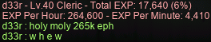

# rangifer’s diary: pt. lx

## Taxonomising odd jobs, pt. iii: Exploring the space of possible taxonomies. §2

In the previous section (§1) of this part (pt. iii), we mostly talked about a distinction between [phenetics](https://en.wikipedia.org/wiki/Phenetics)-based and [cladistics](https://en.wikipedia.org/wiki/Cladistics)-based approaches to taxonomy. This distinction is borrowed from biology, and nowadays serves a mostly historical purpose. However, the objects that we are dealing with here are not biological at all — in many ways, they are very much conceptual/virtual. This will tend to confound our quest for an odd-jobbed taxonomy, as reference to other taxonomies and taxonomical methods can only take us so far.

However, if we keep our phenetics-versus-cladistics approach in mind, it seems that any cladistic-esque method that we might use will be more strongly a matter of personal interpretation of the history of odd jobs. While we do, of course, have some written evidence that might allow us to reconstruct a (shoddy) history of odd jobs (see e.g. [the archive on the Oddjobs website](https://oddjobs.codeberg.page/archive/)), much historical evidence is actually (somewhat ironically, considering that MapleStory is a game played over the internet, so you would think that there would be more written history left behind…) lost to the ages. This is perhaps to be _expected_, as playing odd jobs has obviously never been very popular, but it does mean that any historical reconstruction that could be used to inform a taxonomy of all odd jobs will need to fill in a lot of gaps. Furthermore, pseudo-cladistic methods will need to decide on how to flesh out “decendancy” — it’s obviously not enough to come up with a simplistic history of “which odd job came first?” and call it a day.

On the other hand, taking a phenetics-oriented approach invites the use of mathematical methods. The issue, of course, is that there are still a huge number of possible approaches, and in the end, we must use our own judgement to decide which one(s) to use, which ones are “better”, and so on.

In either case, however, we probably are looking to end up with a [dendrogram](https://en.wikipedia.org/wiki/Dendrogram) representing our taxonomy. A dendrogram is a visual way of representing a [tree][tree], which is a [graph-theoretical](https://en.wikipedia.org/wiki/Graph_theory) construct… This section will focus on a discussion of (just a small number of) mathematical constructs, like trees for example, that may turn out to be relevant for us.

### Vectors

If you’ve taken a [linear algebra](https://en.wikipedia.org/wiki/Linear_algebra) course before, you are already somewhat familiar with what so-called “[vectors][vector]” are. However, if your idea of vectors includes vectors always having constituent “elements”, or includes vectors always being finite-dimensional, then you should know that vectors are much more abstract than that — a vector is literally any object that is a member of any [vector space](https://en.wikipedia.org/wiki/Vector_space). This is pretty abstract, and only includes the ability to add two vectors together, and to [multiply a vector by something called a “scalar”](https://en.wikipedia.org/wiki/Scalar_multiplication) (note that the scalar type need not be a “constituent” type of the vectors, although in same cases — e.g. vectors in ℝ³ — it is) — subject to some axioms like e.g. the [associativity](https://en.wikipedia.org/wiki/Associativity) of vector addition. An example of a vector space whose vectors behave much more abstractly than they do in, for example, ℝ³, would be the [function space](https://en.wikipedia.org/wiki/Function_space) between any [domain](https://en.wikipedia.org/wiki/Domain_of_a_function) & [codomain](https://en.wikipedia.org/wiki/Codomain) that naturally impart a vector-space structure upon their corresponding function space.

The [objects](https://en.wikipedia.org/wiki/Mathematical_object)/[points][point]/[members/elements][element]/whatever that we are going to be dealing with in this part (pt. iii) are going to basically all be vectors. The reason for this is that, in order to allow us to mathematically reason about them, we need them to be members of a [linear](https://en.wikipedia.org/wiki/Linear_map) space; [nonlinearity](https://en.wikipedia.org/wiki/Nonlinear_system) just won’t do! And maintaining the abstractness allows us to apply more general mathematical techniques to the stuff that we’re working with here, regardless of how we encode it.

For our purposes, you can just think of these vectors as being, uhm, _things_. Each odd job is a vector.

### Metric spaces

All taxonomies must deal with and express, explicitly or implicitly, how “close together” or “far apart” their members are. There might be more than one notion of distance, but in any case, imposing a notion of distance onto any vector space generates a [metric space](https://en.wikipedia.org/wiki/Metric_space) — the notion of distance is called a “[metric][metric]”. Indeed, imposing a metric onto any [set][set] is enough to produce a metric space (metric spaces, in general, are more within the realm of [topology](https://en.wikipedia.org/wiki/Topology)), but because we are dealing with linear spaces, all of our metric spaces are going to be vector spaces as well! Not any arbitrary function that looks like a metric because of its domain & codomain is actually a metric, though. Metrics have to satisfy the following properties (for any three elements of the metric space 𝐴, 𝐵, and 𝐶):

- If the distance from 𝐴 to 𝐵 is zero, then 𝐴 = 𝐵, and vice versa. (identity of indiscernibles)
- The distance from 𝐴 to 𝐵 is the same as the distance from 𝐵 to 𝐴. (symmetry)
- The distance from 𝐴 to 𝐵 is at least zero. (non-negativity)\*
- The distance from 𝐴 to 𝐵 is less than or equal to the distance from 𝐴 to 𝐵 via 𝐶. ([triangle inequality](https://en.wikipedia.org/wiki/Triangle_inequality))

The last one is the most complicated, but you can think of the triangle inequality in terms of triangles. Because every triangle has exactly 3 corners, if you choose any 2 distinct corners on the same triangle, they are necessarily adjacent to one another (i.e. directly connected by a single edge of the triangle). If you want to travel from one corner of the triangle to another corner, the fastest (read: shortest distance) way to do that should be to go directly from one to the other via the edge that connects them. You _could_ go via the third point of the triangle (thus traversing not 1, but 2 edges of the triangle), but that detour would just take longer (read: larger distance traveled). The only exception would be in the case of a [degenerate][degeneracy] triangle, in which case the distance traveled via the “detour” (not really a detour in this case because the path is the same anyways, but virtually a detour) would be the same as that of directly traveling. This possibility of a degenerate triangle is the reason why the last axiom uses the phrasing “less than or equal” instead of “less than”.

The reason why I bother to spell out the axioms here is because they might become important later on.

Some metrics that we might consider making use of are as follows:

- **[𝐿ᵖ space](https://en.wikipedia.org/wiki/Lp_space) metrics**
    - [Taxicab distance](https://en.wikipedia.org/wiki/Taxicab_geometry)
    - [Euclidean distance](https://en.wikipedia.org/wiki/Euclidean_space)†
    - [ℓₙᵖ metric (0 \< 𝑝 \< 1, e.g. 𝑝 = ½ or 𝑝 = ⅓)](https://en.wikipedia.org/wiki/Lp_space#When_0_%3C_p_%3C_1)
    - [ℓ∞-norm](https://en.wikipedia.org/wiki/L-infinity)
- **[String metrics](https://en.wikipedia.org/wiki/String_metric)**
    - [Hamming distance](https://en.wikipedia.org/wiki/Hamming_distance)
    - [Levenshtein distance](https://en.wikipedia.org/wiki/Levenshtein_distance)
    - [Damerau-Levenshtein distance](https://en.wikipedia.org/wiki/Damerau%E2%80%93Levenshtein_distance)
- **[Distribution](https://en.wikipedia.org/wiki/Probability_distribution) similarity metrics**
    - [Jensen-Shannon distance](https://en.wikipedia.org/wiki/Jensen%E2%80%93Shannon_divergence)
    - [Hellinger distance](https://en.wikipedia.org/wiki/Hellinger_distance)
- **[Genetic distances](https://en.wikipedia.org/wiki/Genetic_distance)**
    - Nei’s standard genetic distance
    - Cavalli-Sforza chord distance
    - Reynolds-Weir-Cockerham genetic distance
    - Nei’s 𝐷ₐ distance
- **Other metrics**
    - [Mahalanobis distance](https://en.wikipedia.org/wiki/Mahalanobis_distance)
    - [Jaccard distance](https://en.wikipedia.org/wiki/Jaccard_index)

_Whew._ That’s too many metrics, if you ask me! Or maybe it’s not enough… After all, if one metric doesn’t work, just uhm… try another? That’s science!! :)

The metrics listed under “Genetic distances” are ones that are designed _specifically_ for [genetics](https://en.wikipedia.org/wiki/Genetics). These metrics (_because_ they are designed specifically for genetics) tend to have evolutionary [mathematical models](https://en.wikipedia.org/wiki/Mathematical_and_theoretical_biology) — e.g. the [Wright-Fisher model](https://en.wikipedia.org/wiki/Genetic_drift#Wright%E2%80%93Fisher_model) — baked into them. For this reason, it’s somewhat unlikely that we will make use of any of these metrics; they are still listed here, in case they prove to be useful (who knows?).

Footnotes for “Metric spaces”

\*This axiom (non-negativity) is technically redundant; you can derive it from the other three axioms.

†We won’t be considering the squared Euclidean distance (viz. [∑](https://en.wikipedia.org/wiki/Summation)(𝑎ᵢ − 𝑏ᵢ)²), mostly because it’s not a metric at all. Consider the triangle inequality 𝑑(𝐴, 𝐵) ≤ 𝑑(𝐴, 𝐶) + 𝑑(𝐶, 𝐵) over ℝ¹ where 𝐴 = 0, 𝐵 = 2, and 𝐶 = 1.

### Weighting

When aggregating together the properties of our objects into our vector representation of choice, we might want to apply [weighting](https://en.wikipedia.org/wiki/Weighting). Some properties are more important than others, and furthermore, some properties may have a naturally larger [range][image] than others. Ultimately, the weightings that we use will be arbitrary. However, it is possible to use mathematical methods to inform the way that properties are weighted.

In particular, any of a number of [tf⋅idf](https://en.wikipedia.org/wiki/Tf%E2%80%93idf) variants might be useful. tf⋅idf is designed for textual documents, where the terms are generally words (or phrases) within the text. But, if we have a situation where there are some properties that might, _or might not_, be “present” in any given vector (lacking presence might be due to the property having some kind of [null](https://en.wikipedia.org/wiki/Nullable_type) value, or some similarly trivial/“falsy” value, whenever the property doesn’t apply), we might:

- Treat our collection of vectors as a corpus of documents;
- Treat the presence of a property as the presence of a term, and then compute 𝑡𝑓 either…
    - In the case of just a single property being under consideration: with a binary (𝑡𝑓 ∈ {0, 1}) weighting scheme;
    - In the case of a set of related properties: with some other weighting scheme — every member of the set would correspond to the same “term”, but the number of members of the set that are present would be, by definition, the raw count of that “term” in the “document”.

Or not. Just spitballing here. I actually just made up “tf⋅idf” right now; that’s not a real thing. All of the references on the Wikipedia article just [link to the Oddjobs website](https://oddjobs.codeberg.page/). Is anyone reading this? [Are we alone in the universe](https://en.wikipedia.org/wiki/Drake_equation)? Is it possible for someone to hate [me](https://en.wikipedia.org/wiki/Anonymity) as much as [I hate myself](https://en.wikipedia.org/wiki/Melancholic_depression)? [uxFmhKx3EEJw34dG][noise]??

### Ok, that’s enough for now

Ok, that’s enough for now. But, for better or worse, there’s still more mathematical gobbledygook to be touched upon! Wow! Cool!! :))

## You hear a growl… an evil creature begins to appear

In the world of vicloc, we have been wishing for a while now to slay the first truly big, bad boss of Victoria Island: [Jr. Balrog](https://maplelegends.com/lib/monster?id=8130100). Jr. Rog may “only” have 50k HP, but being level 80, having 30 AVOID, and being capable of hitting for over 2.9k damage with a single magic attack makes Jr. Rog quite the opponent for viclockers.

**Thinks** (**OmokTeacher**, **Slime**, **Slimu**), a vicloc crossbowman, had already attempted soloing the beast by taking furtive shots and trying ro simply avoid the beast’s attacks entirely. Unfortunately, as of yet, this had not panned out. But, because I was online at the time, we decided to give it a shot by using the tankiness of my [dagger spearwoman](https://oddjobs.codeberg.page/odd-jobs.html#dagger-warrior) **d34r** to manipulate the aggro of Jr. Rog…

This proved to be rather difficult; the changes to the monster aggro system that were put into place some months ago make it very unlikely to produce any effect on monster aggro by “**MISS**”ing. And “**MISS**”ing was just about all I was good for… a masteryless vicloc warrior fighting a monster with 30 AVOID and a 25-level advantage is just too difficult. Luckily, some of the “**MISS**”es _do_ actually produce a change in aggro, which meant that we had some mechanism for taking on the beast:

Now, this fight could neither be described as “quick” nor as “easy”, but we did prevail!! Hoo-rah for the first ever vicloc Jr. Balrog kill~!

We decided to do some more of the channels… along the way, we got a [Balrog Chair](https://maplelegends.com/lib/setup?id=3010126) :O

Here is Thinks, fighting with the chair on his back:

After roughly 3 hours(!) of Jr. Rog fighting (coincidentally, 3 hours is about the respawn time for Jr. Rog…), we managed to clear all 8 channels! But not without me shoving thousands(!) of [Unagi](https://maplelegends.com/lib/use?id=2022003)s into my face, and not without Thinks biting the dust quite a few times. By the end of it, I was 2/5 on Jr. Rog cards~:

w h e w ~

## Peepy cue

Folks… I am not the biggest fan of [PPQ](https://maplelegends.com/lib/map?id=251010404). If any PQ were actually just grinding in disguise, it would be peepy cue.

Nevertheless, I had done more PPQs than I previously thought possible, as my undead [daggermit](https://oddjobs.codeberg.page/odd-jobs.html#dagger-assassin) **alces**. At this point, I believe I have completed just over 90(!) PPQs on alces…

Above, you can see me fighting [Lord Pirate](https://maplelegends.com/lib/monster?id=9300119) alongside F/P mage **2sus4u** and fellow odd hermit, **Boymoder** (**Taima**, **Tacgnol**, **Hanyou**, **Gambolpuddy**, **Numidium**, **Inugami**) the [STRmit](https://oddjobs.codeberg.page/odd-jobs.html#lukless-assassin). My aim was to “finish” PPQ and then only come back if someone wanted to PPQ with me and I was still in level range. By “finish”, I basically mean finishing all associated quests, and finishing the [Lord Pirate card](https://maplelegends.com/lib/use?id=2388011) set. The new-and-improved [LPH](https://maplelegends.com/lib/equip?id=01002574)s are nice, but I already had a [zhelm](https://maplelegends.com/lib/equip?id=01002357) anyways. After about 45(!) PPQs, though, I was still at 0/5 cards… I figured, sure, out of all of my characters, alces would be the one to consider the Lord Pirate card set most valuable. But it is just _one_ card set, after all. It’s best if I simply give up on it (at least for now) and focus on just completing the associated quests, and then proceed to gtfo.

After 60 PPQs, I did attain the highest tier (IV) of LPH! In the past, I’ve only ever had the patience for the first tier, so this is a first for me…

")

And I did a few PPQs with Boymoder’s [DEX WK](https://oddjobs.codeberg.page/odd-jobs.html#dex-warrior), **Hanyou**:

I started PPQing with [STRginner](https://oddjobs.codeberg.page/odd-jobs.html#str-beginner) **Permanovice** (**Battlesage**, **Dreamscapes**, **Hanger**), along with some of his alliance members of the **Kaleidoscope** alliance, and they helped me to finish my Lord Pirate card set!! During one of the times that we did stage 5, Permanovice recounted an anecdote in which his failed stage 5 despite having two [DK](https://maplelegends.com/lib/skill?id=1311006)s and two [priest](https://maplelegends.com/lib/skill?id=2301002)s. The key drops from the monsters in stage 5 are random, so it is entirely possible (albeit unlikely) that fewer than 4 keys have dropped by the time that the timer runs out, thus failing the PQ due to dumb luck alone. Unfortunately for us, it seemed that [RNG](https://en.wikipedia.org/wiki/Pseudorandom_number_generator)sus heard Permanovice tell the anecdote, and thought it would be funny to re-enact the tale:

R.I.P. **Paulshungry**, who died so that we could live.

**IceGrinder**, an [I/L mage](https://maplelegends.com/lib/skill?id=2211002) who helped carry many of our Kaleidoscope-oriented PPQ runs, was fond of the 4th key drop in stage 5 dropping onto a door. This would automatically close the door, which is convenient when we already have enough keys to close the other three doors ourselves. IceGrinder would ask for an “auto” every time:

Thankfully, no crying occurred — both because I wasn’t actually going to cry (it just so happens that “cry” and “guy” rhyme), and because [auto](https://en.wikipedia.org/wiki/Otto) did it! Thanx [Otto](https://en.wikipedia.org/wiki/Car).

And I did finish all of the PPQ quests!:

Not shown here is the quest to kill one of each of the three types of Lord Pirate (normal, angy, enraged) — I had already turned that one in. I had to go back for the Lord Pirate’s Treasure one, as I forgot that you have to get a travel diary out of the chests in the PQ before you can even start the quest.

And with that, alces is officially finished with everything that PPQ has to offer! Although the EXP is really not so bad…

## Firey feather

As it turns out, I had not one, but two quests on my vicloc [dagger spearwoman](https://oddjobs.codeberg.page/odd-jobs.html#dagger-warrior) **d34r** that required a [Flaming Feather](https://maplelegends.com/lib/etc?id=4001006): [Manji’s Old Gladius](https://bbb.hidden-street.net/quest/victoria-island/manjis-old-gladius) and [Luke the Security Man’s Wish to Travel](https://bbb.hidden-street.net/quest/victoria-island/luke-the-security-mans-wish-to-travel-warrior-only). Unfortunately, the only source of Flaming Feathers for viclockers is [Red Drakes](https://maplelegends.com/lib/monster?id=6130100)… so, now that I was actually powerful enough to kill them reasonably efficiently, I headed to [Dangerous Valley II](https://maplelegends.com/lib/map?id=106000002) to try to farm some Flaming Feathers of my own:

Red Drakes are more annoying than their weaker [copper counterparts](https://maplelegends.com/lib/monster?id=4130100), but not just because of their superior level and stats:

I was here grinding Red Drakes for quite a while; although their drop rate is not all that good (at least, not nearly as good as that of their coppery counterparts), I ended up with 9 of their cards (enough to get my vicloc [clericlet](https://oddjobs.codeberg.page/odd-jobs.html#magelet) **d33r** to 4/5)…

And so, after 9 Red Drake cards, and 3 pairs of [Arwen’s Glass Shoes](https://maplelegends.com/lib/etc?id=4001000) farmed on this map, I finally got a feather \>w\<

Yowza… I haven’t gone back since then. Eventually, when I do decide that I’m ready for Luke the Security Man’s Wish to Travel (which, mind you, requires three [Taurospear ETC](https://maplelegends.com/lib/etc?id=4000046)s!), I will have to come back here…

## GM boofs on the island

I duoed [TfoG](https://maplelegends.com/lib/map?id=105040306) with **xXCrookXx** to make good use of the GM buffs that we got… And let me tell ya, these boofz are ridiculously powerful:

y i k e s .

For comparison, here’s a screenshot from before that, when we were with **Thinks**, trioing TfoG:

We joked that Thinks was actually giving us leech, because of how powerful he is, although it seems the EXP split was actually about equal x)

## The hunt for YWG

When it comes to equipping my vicloc [clericlet](https://oddjobs.codeberg.page/odd-jobs.html#magelet) **d33r**, the best glove that I can possibly get is a [YWG](https://maplelegends.com/lib/equip?id=01082145). Furthermore, there are no glove scrolls in vicloc that are really relevant to magelets (although [scrolling for DEX](https://maplelegends.com/lib/use?id=2040801) is good, the additional AVOID is very slight), so just throwing on a clean pair of YWG would have d33r’s glove slot set for life.

The problem, of course, was not having a YWG at all. The only source of YWGs for viclockers is from the [Protect Lucas’s Farm](https://www.hidden-street.net/gms/quest/protect-lucass-farm) quest, which meant making a new character so that I could complete the Maple Island quest in hopes of a YWG. Unfortunately, while the YWG _is_ one of the six(!) colours of WG offered by the quest, the awarded colour is not determined by the player at all — it’s random. But I figured, heck, assuming that the reward is [uniformly distributed](https://en.wikipedia.org/wiki/Discrete_uniform_distribution) (big assumption, but OK), it should only take me half a dozen tries on average to get the YWG that I want. So I set out to hunt down this YWG:

Along the way of my first trip to [Amherst](https://maplelegends.com/lib/map?id=1010000), I came across a bizarre clustering of monsters:

…Which I should have more quickly realised were just the result of a vac hacker — **xXCrookXx** had just been awarded vote NX not too much earlier, for reporting a similar hacker to the GMs. I suppose I was just thrown off by the bizarreness of the entire map being barren, save the bottom-right corner.

Unfortunately, my first run of Protect Lucas’s Farm yielded not a YWG, but rather a [PWG](https://maplelegends.com/lib/equip?id=01082148). During the same session, I did four more runs (for a total of five), still yielding a total of zero YWGs. I decided to stop there, and limit myself to exactly 5 runs per day until I got the YWG that I wanted. I did three full days of runs (15 runs in total), and still had a total of zero YWGs to my name. At this point, it was looking pretty dire, considering that when sampling 15 times from a uniform distribution where 𝑛 = 6, and resulting in just zero of the particular outcome that you wanted beforehand has an _a priori_ probability of just ⅚¹⁵ ≈ 6.5%.

There doesn’t seem to be any reason to make the distribution very nonuniform — four of the six colours give +1 to a primary stat (STR, DEX, INT, LUK) anyways, so at least those 4 should be basically equivalent… That is, assuming that the colour selection is actually [independent][independence] of other events! Maybe the quest reward inspects the stats of the player-character, in order to adjust the probabilities to match what might actually be useful for them. After all, this would be the only real way for the quest to thoughtfully tune its reward (other than the obvious strategy of just allowing the player to pick which colour they want), considering that anyone who completes this quest must still be a beginner (so class-based rewards don’t make sense). So, I tweaked my strategy from being pure STR, to adding enough INT that INT would be my highest stat by the time that I finished the quest. And then the rest would be STR. Here are my results:

| day | result | time | build   |
| --: | :----- | ---: | :------ |
|   1 | PWG    |      | STR     |
|   1 | BWG    |      | STR     |
|   1 | PWG    |      | STR     |
|   1 | PWG    |      | STR     |
|   1 | WWG    |      | STR     |
|   2 | GWG    | 7:32 | STR     |
|   2 | BWG    | 7:26 | STR     |
|   2 | RWG    | 7:40 | STR     |
|   2 | GWG    | 6:54 | STR     |
|   2 | PWG    | 7:20 | STR     |
|   3 | RWG    | 6:53 | STR     |
|   3 | GWG    | 7:29 | STR     |
|   3 | WWG    | 6:30 | STR     |
|   3 | WWG    | 6:43 | STR     |
|   3 | GWG    | 6:47 | STR     |
|   4 | GWG    | 7:48 | INT+STR |
|   4 | PWG    | 7:39 | INT+STR |
|   4 | YWG    | 7:34 | INT+STR |

As you can see, I started timing my runs from day 2 onwards. The timing was done from the first time that my character actually has to move (i.e. the very beginning of the first training camp map), so that I can freely set up keybindings etc. before starting, and then stopped as the WG actually entered my inventory. As you can also see, my best time was 6 minutes & 30 seconds. It took 3 tries of the INT+STR build (18 tries overall) to get my YWG, finally!:

Just for fun, we can test this modest amount of data against an assumed totally-independent and uniform distribution of the colour of the WG reward (i.e. our [null hypothesis](https://en.wikipedia.org/wiki/Null_hypothesis)). We’ll just look for the usual run-of-the-mill 𝑝-value threshold of 𝑝 \< 0.05, because… who cares. The obvious choice of test is just [Pearson’s χ² test](https://en.wikipedia.org/wiki/Pearson%27s_chi-squared_test). We can calculate the [test statistic](https://en.wikipedia.org/wiki/Test_statistic) ([χ²](https://en.wikipedia.org/wiki/Chi-squared_test)) by summing up the values of the following formula for each colour of WG:

> (𝑂 − 𝐸)² ÷ 𝐸

…where 𝑂 is the number of observations of that colour, and 𝐸 is the expected number of observations of that colour, assuming that our null hypothesis is true.

Performing the calculations with our data, we obtain χ² = 4.666… But, we also need to know how many [degrees of freedom][dof] (ν) we have — the English Wikipedia article on Pearson’s χ² test has this to say:

> For a test of goodness-of-fit, df = Cats − Parms, where _Cats_ is the number of observation categories recognized by the model, and _Parms_ is the number of parameters in the model adjusted to make the model best fit the observations: The number of categories reduced by the number of fitted parameters in the distribution.

In our case, it is obvious that _Cats_ = 6. _Parms_ is a little trickier, but because our model is just a uniform [categorical](https://en.wikipedia.org/wiki/Categorical_distribution) distribution, there is actually just one parameter: the established number of categories/colours (𝑛 = 6). So we should get ν = _Cats_ − _Parms_ = 6 − 1 = 5.

The same Wikipedia article conveniently provides us with a table of upper-tail critical values of the χ² distribution. For ν = 5 and 𝑝 = 0.05 (or 0.95, whatever), the critical value is χ² ≈ 11.070. Our χ² value (4.666…) is considerably less than that, so we’re definitely not rejecting the null here. That much should be obvious, but in case someone wants to “well, actually…” me and say that χ² tests like Pearson’s are horribly under[power](https://en.wikipedia.org/wiki/Power_of_a_test)ed, you should know that performing a [𝐺-test](https://en.wikipedia.org/wiki/G-test) on the same data gets us 𝐺 ≈ 4.776. Wow, so powerful. Cool. :)

I didn’t start saving them until after a number of runs, so I didn’t save that many, but I did save some of the WGs that I got (in addition to the wonderful YWG, of course):

And I even “boomed” one of the [RWG](https://maplelegends.com/lib/equip?id=01082146)s with a [GFA10](https://maplelegends.com/lib/use?id=2040805) already! Wow. Cool. :)

## Jay queues

Any avid reader of this diary already knows just how much I love JQs. Here I am, in the middle of several giant and violently-swinging axes, enjoying my stay [at the third and final Sleepywood JQ](https://maplelegends.com/lib/map?id=105040316):

Wow. Cool. I sure do love being assailed by a multitude of oversized & terrifying blades! :)

After becoming one with the blade myself — by which, I do of course mean repeatedly running haphazardly through the blades whilst desperately hoping that I don’t get knocked off — I did emerge victorious after not too long:

And I was rewarded with a [very stronk pair of earrings](https://maplelegends.com/lib/equip?id=01032014)~!

Because one JQ was just not enough for me, I hopped onto **d33r** to have a go at the third Kerning City JQ:

Thankfully, no oversized blades hurtling towards my face at breakneck speeds this time. Just a bunch of overpowered lasers and some [casual electrostatic discharge](https://en.wikipedia.org/wiki/Lightning)s! Great fun.

But never fear — I passed a physics class once (I think). So I was quite adept at running headfirst through the [industrial-cutting](https://en.wikipedia.org/wiki/Laser_cutting)-strength lasers and the [unexplained squirty-lightning phenomena](https://en.wikipedia.org/wiki/Ball_lightning) so that I could retrieve yet another of [Shumi](https://maplelegends.com/lib/npc?id=1052102)’s misplaced lumps of cash, which seem to always be stuck behind some bizarre and lethal industrial obstacle course!:

And for that, my just reward: a [Shoe SPEED 60%](https://maplelegends.com/lib/use?id=2040707)! Wow. Cool. :)

## The marriage of kookietann & Battlesage

I was invited to the wedding of **kookietann** (**kookiechan**) and F/P [gish](https://oddjobs.codeberg.page/odd-jobs.html#gish) **Battlesage** (**Permanovice**, **Dreamscapes**), and attended alongside other members of **Suboptimal** and of **Kaleidoscope**!

Inside the cathedral~

Here’s a screenshot that I took from inside of the cathedral, for the actual marriage event itself… Well, actually, this was just the first attempt. For some unknown reason, the game kicked all of us out of the cathedral before the marriage could be completed, so we had to get everyone back together to try again:

My presence here is a little difficult to spot; I’m on the far right of the middle row, with my visage obscured by **bloobloo**’s nametag & guild tag. I made sure to buy a [Bridesmaid’s Dress](https://maplelegends.com/lib/equip?id=01051150) so that I would have appropriate attire for the main event…

The second attempt did the trick — here we are at the photo stage:

And this was a premium wedding, so we all got to open Onyx Chests for our own goodies. Personally, I got a delectable 100 [Watermelon](https://maplelegends.com/lib/use?id=2001000)s!

## Cardz

At some point, I’m going to want ≥60 completed card sets on **d34r**, so I figured that I may as well get started on the ones with timers that I haven’t already completed. So I hit up [the lair](https://maplelegends.com/lib/map?id=103000105) of the elusive [Shade](https://maplelegends.com/lib/monster?id=5090000):

Boom. 5/5. Easy!!

I hit up [the lair](https://maplelegends.com/lib/map?id=105070002) of [everyone’s favourite undead mushroom mother](https://maplelegends.com/lib/monster?id=6300005) as well. You may remember my encounter with ZMM from pt. lviii of this diary; well, now d34r is a whole lot stronger, and can take on this resurrected fungal matriarch single-handedly!!:

5/5!!!! E A S Y .

Speaking of bosses that I never used to be capable of fighting, I tried fighting [Dyle](https://maplelegends.com/lib/monster?id=6220000) for the first time:

And with not too much trouble:

5/5. EZ PZ~!!!!!

## Tablecloth ghosts

As readers of this diary will know, I have been trying to empower my vicloc [clericlet](https://oddjobs.codeberg.page/odd-jobs.html#magelet) to be, uhm, more useful, I guess… With help from vicloc gunslinger **Clinks** (**cobbages**, **Daggington**), who donated 2,300(!) [zlupin dolls](https://maplelegends.com/lib/etc?id=4000031) to me as they were training at [Monke Forest II](https://maplelegends.com/lib/map?id=100040103), I was able to complete the [Rowen the Fairy and the Cursed Dolls](https://bbb.hidden-street.net/quest/victoria-island/rowen-the-fairy-and-the-cursed-dolls) questline on d33r (I had already completed it myself on **d34r**)!

I also completed some other quests — as seen in the “Jay queues” section above, I completed the level 40 Kerning City JQ ([Shumi’s Lost Sack of Money](https://bbb.hidden-street.net/quest/victoria-island/shumis-lost-sack-of-money)) for a lil EXP boost. But in order to get to that point, I had to get to level 40! Completing the 2,300 Cursed Doll questline helped heaps, but I still needed to go further to hit the level 40 milestone that would unlock a few more quests (including the JQ), as well as a new weapon: the [Yellow Umbrella](https://maplelegends.com/lib/equip?id=01302016)!

Speaking of the Yellow Umbrella, in the previous diary entry I talked about grinding my ass off to get one for myself. Underwhelmingly, although I did get one(!), it was rather below average. The WATK was good (53 is better than the average of 52), but the part that actually matters to me, the MATK, was quite below average (49 \< 52)… Luckily for me, **xXCrookXx** (**Level1Crook**, **Lv1Crook**) found another one while card-hunting at Florina Beach!! And this one was a considerable improvement, with a whopping 53 MATK!!

YAY~!! Now I was _really_ motivated to get that level 40…

On my way to level 40, I wanted to do the [Icarus and the Balloon](https://bbb.hidden-street.net/quest/victoria-island/icarus-and-the-balloon) quest, which was the last quest that I had remaining before I had no choice but to grind. As shown in the previous entry, I partied with xXCrookXx to make the [Alligator Skin Pouch](https://maplelegends.com/lib/etc?id=4031164) collecting a little easier, and then collected the rest by myself. Then, I wanted to get the [Tablecloth](https://maplelegends.com/lib/etc?id=4000035)s myself from [smol tablecloth ghosties](https://maplelegends.com/lib/monster?id=3230101) by [Heal](https://maplelegends.com/lib/skill?id=2301002)ing them to death:

Not exactly impressive damage numbers, but it did the trick!:

Now that Jr. Wraiths are d33r’s main spot, I have gotten 5/5 of their cards. Also, in contrast to the usual situation of d34r giving her excess cards to d33r, I have given the excess Jr. Wraith cards to d34r until she got 5/5 as well!:

And after a healthy bit of grinding, I did it. Level 40!!:

So str0nk!!!:

## The serpents and arrows of outrageous fortune: The Serpent’s Coil

By the time that my vicloc [dagger spearwoman](https://oddjobs.codeberg.page/odd-jobs.html#dagger-warrior) **d34r** had finished much of the quests that I wanted to do (and was capable of doing at the time), she was level 59 and nearing in on level 60! But I was still without a level 60 weapon… My only choice here is, of course, the [Serpent’s Coil](https://maplelegends.com/lib/equip?id=01332017) — the level 60 warrior-thief dagger which, for viclockers, is only available from a single source: [Officer Skeleton](https://maplelegends.com/lib/monster?id=6230602)s.

And I grinded my way to level 60, without a Serpent’s Coil in sight:

I accumulated nearly two dozen Officer Skeleton cards before getting my first Serpent’s Coil, which is saying something, considering that their card drop rate is not all that impressive (not to mention the roughly one dozen [Skeleton Soldier](https://maplelegends.com/lib/monster?id=5150001) cards):

Along the way, because I had just hit level 60, I wanted to do the [Notice from the Excavation Team](https://bbb.hidden-street.net/quest/victoria-island/notice-from-the-excavation-team) quest~ This quest already overlapped pretty heavily with what I was doing anyways (viz. degen grinding at [Camp 3](https://maplelegends.com/lib/map?id=101030112)), but there was one part that didn’t overlap: hunting [Commander Skeletons](https://maplelegends.com/lib/monster?id=7130103). Unfortunately for me, Commander Skeletons are actually some of the most powerful monsters in vicloc: level 73, 32 AVOID, 15.3k HP, 330 WDEF, 300 MATK, and a nasty poison cloud that deals 200 damage per tick while ignoring iframes…

Ooof. I killed 4 of them on my own, but it honestly was so difficult that it seemed like a waste of time and [money](https://maplelegends.com/lib/use?id=2022003). So for now, I gave up on the quest.

Later, I was joined by fellow **Suboptimal** members **2sus4u** and **xXCrookXx**:

And with their help, I was able to complete the Notice from the Excavation Team quest in a shorter time, and while only spending a smol fortune’s worth of HP potions~! To be honest, I was a little underwhelmed by the reward that it gave, considering how difficult the quest is for its level… at level 60, it gave me slightly over 6% EXP and a useless 10% scroll \>w\<

But that’s OK; I’m glad to have completed it!!

And then, finally, after countless hours of degen grinding at Camp 3, I found the fabled dagger… my first Serpent’s Coil:

Wow. Cool. :)) For those following along at home, 70 WATK is the minimum possible WATK. This thing was so bad, in fact, that the only way to make it materially better than my current weapon (a [Sai](https://maplelegends.com/lib/equip?id=01332016) that is, frankly, fairly average) was to pass a [10%](https://maplelegends.com/lib/use?id=2043302) on the first slot. So that is exactly what I set out to do:

Fantastic. So, rather than let RNGsus win in its months-long battle to destroy my spirit, I continued in my soul-crushing degen grinding at Camp 3.

Eventually, lo and behold: I found another coil. This time, it was better, right? After all, 70 WATK is the worst possible outcome — any other random clean Serpent’s Coil has a 10 ÷ 11 ≈ 90.91% chance of being strictly better. Nope. Another 70 WATK coil!!!!!!!!! AAAAAAAAAAAAAAAAAAAAAAAAAAAAAAAAAAAAAAAAAAAAAAAAAAAAAAAAAAAAAAAAAAAAAAAAAAAAAA**AAAAAAAAAAAAAAAAAAAAAAAAAAAAAAAAAAAAAAAAAAAAAAAAAAAAAAAAAAAAAA** ahem\*

And if you thought my soul was finally crushed to smithereens by that point, oh no no no. I kept going. After even more depressing degen grinding at Camp 3, I did eventually find another coil. And this one was better! only 2 WATK below average this time: 73 WATK. K—kind of underwhelming, but, uhm, better than getting another 70 WATK one?

Pictured above: xXCrookXx and I are both so traumatised by the Serpent’s Coil grind that we have reverted to using [kfan](https://maplelegends.com/lib/equip?id=01332020)s.

Yeah, I [100%](https://maplelegends.com/lib/use?id=2043300)ed it. Frankly, [60%](https://maplelegends.com/lib/use?id=2043301)s are just not abundant enough for me to justify using them on this thing, nevermind the very, very real chance that I have shite luck with any 60%s/10%s that I use. For now, this is at least good enough to be my main dagger when I don’t need the 3 LUK (read: 1.5 WACC) that my Sai provides.

Footnotes for “The serpents and arrows of outrageous fortune: The Serpent’s Coil”

\*pls help.

[noise]: https://en.wikipedia.org/wiki/Noise_(electronics)
[image]: https://en.wikipedia.org/wiki/Image_(mathematics)
[degeneracy]: https://en.wikipedia.org/wiki/Degeneracy_(mathematics)#Triangle
[set]: https://en.wikipedia.org/wiki/Set_(mathematics)
[metric]: https://en.wikipedia.org/wiki/Metric_(mathematics)
[vector]: https://en.wikipedia.org/wiki/Vector_(mathematics_and_physics)
[element]: https://en.wikipedia.org/wiki/Element_(mathematics)
[tree]: https://en.wikipedia.org/wiki/Tree_(graph_theory)
[point]: https://en.wikipedia.org/wiki/Point_(geometry)
[independence]: https://en.wikipedia.org/wiki/Independence_(probability_theory)
[dof]: https://en.wikipedia.org/wiki/Degrees_of_freedom_(statistics)
