# rangifer’s diary: pt. lx

## Taxonomising odd jobs, pt. iii: Exploring the space of possible taxonomies. §3

### Huh?

Good question. In the previous section of this part (pt. iii, §2), I talked about [a whole lot of abstract garbage](https://en.wikipedia.org/wiki/Waste) and didn’t have much of a point. In lieu of excusing my own [poor writing](https://en.wikipedia.org/wiki/Nonsense) and the generally [soup-like consistency][sol] of my [brain matter](https://en.wikipedia.org/wiki/Grey_matter), I offer this quotation of myself from pt. i, §1:

> I do not have the contents of this entire “Taxonomising odd jobs” series already written or planned out. This is in my diary (serialised as sections, with one section per diary entry) because of the informal, stream-of-consciousness nature of the series.

My intent is not _really_ to bog down something seemingly simple (taxonomising a handful of MapleStory jobs) with a bunch of garbage, and to turn this into a maths lesson for some god-forsaken reason. But, for better or worse, there’s heaps of garbage floating around in my mind, and [so that’s what comes out](https://en.wikipedia.org/wiki/Garbage_in,_garbage_out). Applying some mathematical methods might(‽) turn out to be interesting, and because there’s obviously no single/unique way to encode odd jobs into our desired ontology (some kind of vaguely linear space, with a metric, yadda yadda &c.), there’s a lot of abstract garbage that may (or may not) turn out to be useful. Lazily encoding things into something that [looks like](https://en.wikipedia.org/wiki/Bullshit) a linear space with a metric (even if the space is… mAyBE not actually a [vector space](https://en.wikipedia.org/wiki/Vector_space), and/or the distance function is maYbE not actually a [metric][metric]…) is pretty standard stuff in [data-mining](https://en.wikipedia.org/wiki/Data_mining)/[machine-learning](https://en.wikipedia.org/wiki/Machine_learning) contexts, as far as [I know](https://en.wikipedia.org/wiki/Hubris). In any case, it’s good enough for our purposes, and when it turns out horribly, I will be the only one to blame.

However, I like to give at least _some_ reasonable explanation, and keep things accessible to any readers who are confident enough in their [English](https://en.wikipedia.org/wiki/English_language) skills. Even in the main body of my diary entries (you know, the actual diary part…), I try to put in some redundant information to help out readers (I suspect — but cannot prove — that at least one person who isn’t me does read some of my diary entries) who aren’t scrutinising every single word that I’ve ever written in any diary entry. And, furthermore, I try to keep myself to a reasonably high standard of [accuracy](https://en.wikipedia.org/wiki/Truth). Sometimes, all of these things conspire to produce [too many words](https://en.wikipedia.org/wiki/Verbosity)!

### “““Vector space”””

So, about the whole “accuracy” thing… When I introduced vector spaces in the previous section (§2), I kind of glossed over what vector spaces actually are, and that was intentional — getting caught up in a [linear algebra](https://en.wikipedia.org/wiki/Linear_algebra) course\* is very much besides the point here. But also, I feel a little bad because I made it sound like a vector space _only_ needs vector addition and [scalar multiplication](https://en.wikipedia.org/wiki/Scalar_multiplication), subject to some constraints on how these operations work. But, to be a bit more precise, the set of scalars needs to form a [field][field] in order for the space to actually be a vector space. A field is basically† just a [set][set] whose elements can be added, subtracted, multiplied, and divided by one another in the same way that [rational numbers](https://en.wikipedia.org/wiki/Rational_number) and [real numbers](https://en.wikipedia.org/wiki/Real_number) can.

There are weaker (i.e. more general) versions of vector spaces, though. [Modules][module] are like vector spaces, except instead of being over a field, they are over a [ring][ring] — so multiplication doesn’t have to [commute](https://en.wikipedia.org/wiki/Commutative_property), and [division][division] doesn’t have to be possible (i.e. multiplicative inverses are not required). And you can generalise further by generalising the ring, e.g. to a [semiring](https://en.wikipedia.org/wiki/Semiring) (thus a [semimodule](https://en.wikipedia.org/wiki/Semimodule)). Will we have to use these more general versions at some point? Iunno.

Footnotes for “‘‘‘Vector space’’’”

\*Linear algebra forms the basic core of… probably _most_ mathematics, and most mathematically-inclined scientific/engineering disciplines as well. As a result, you could find approximately 6 gazillion perfectly good linear algebra textbooks lying around the WWW, if you were not already familiar with it, and actually did want to learn about it. Like [this one](https://personal.math.ubc.ca/~carrell/NB.pdf), for example, which I just found in roughly 1.5 seconds by searching the WWW for “linear algebra textbook”.

†bASiCalLy

### Clustering

So, basically the entire point of defining some kind of space (hopefully linear) that has a distance function (hopefully a metric) is so that we can measure the distance between our objects (our odd jobs), and then _cluster_ them in some way, to produce our taxonomy. Or rather, one of our taxonomies.

So let’s look at just a few (I promise — just a few, there’s a ton of stuff out there…) different methods, ya?

#### Neighbour-joining

One way of producing our desired [dendrogram](https://en.wikipedia.org/wiki/Dendrogram) is with [neighbour-joining](https://en.wikipedia.org/wiki/Neighbor-joining). This method is bottom-up (“agglomerative”) because it effectively starts with each object in its own cluster, and then starts joining the objects together until it materialises a fully-resolved [tree][tree] of those objects.

The algorithm starts with all of the objects connected to a central node (that is, in a star formation). Then, we calculate a special [matrix][matrix] that gives us a kind of “relative distance”, if you will, between each pair of objects — this “relative distance” takes into account not just the raw distance (defined by our handy-dandy distance function) between the two objects, but also how far the two objects are from the rest of the objects in the set. Then, we choose the pair of objects that has the lowest “relative distance”; this pair gets connected to its own brand-new node, and the new node is connected to the central node (instead of the two objects each individually being connected to the central node). Then we just rinse & repeat, calculating our special-sauce “relative distance” matrix by ignoring our newly-paired objects themselves, and instead considering their new node as effectively a new object (for the purpose of calculating the matrix). This process repeats until the tree is “fully resolved”, meaning that every object has actually been paired at some point (i.e. no objects remain connected to the unnamed “central node”).

It’s not super clear to me how to make a dendrogram out of the resulting tree, but the result _is_ definitely a tree (and one with weighted edges, to boot, because each edge traverses a well-defined distance), so it’s probably sufficient to keep track of the order in which pairs are formed, and then use edge weights to space out the dendrogram’s objects, once their arrangement reflects the order.

This algorithm has to calculate the “relative distance” value for each pair of 𝑘 objects/nodes (and there are, of course, 𝑘² such pairs)\*. This is for each pair-joining, but we have to perform 𝑛 − 3 (or 𝑛 − 2? I dunno, 𝑛 minus some constant, it doesn’t matter) such joins where 𝑛 is the number of objects. And while 𝑘 does shrink by 1 after each iteration (as each joined pair effectively gets replaced by just one new node), this basically just means that 𝑘 is roughly 𝑛 ÷ 2 on average, which means that 𝑘 = [Θ][big-small](𝑛). As a result, running the algorithm as described results in a runtime of Θ(𝑘² ⋅ 𝑛) = Θ(𝑛³). This is [polynomial][p], which [is good](https://en.wikipedia.org/wiki/Cobham%27s_thesis), although [cubic](https://en.wikipedia.org/wiki/Cubic_function) isn’t _stellar_. There are less naïve ways of doing this that run significantly faster in practice, by using heuristics, but just knowing that the naïve implementation runs in 𝑂(𝑛³) is good enough for us — it’s not like our 𝑛 is going to be all that large!

One advantage of neighbour-joining is that, while it is primarily used in biology, it doesn’t really have any evolutionary assumptions/model(s) baked in — only one distance function (one between the objects of study) is required, and that function doesn’t even have to be a metric! One weird thing, though, is that it seems to be possible for an edge to get assigned a negative weight(?)

Footnotes for “Neighbour-joining”

\*At first glance, it might look like this makes each iteration have a runtime of Θ(𝑘³), rather than Θ(𝑘²) (and thus the entire algorithm would have a runtime of Θ(𝑛⁴)). Calculating the “relative distance” between two objects/nodes 𝐚 and 𝐛 means calculating the distance between 𝐚 and _every_ object/node, and the same for 𝐛 as well — thus, each “relative distance” calculation itself should run in Θ(𝑘), yes? Well, no, because we can calculate the distance-from-every-object/node for each object/node beforehand, which takes Θ(𝑘²) time, _and then_ calculate all pairwise “relative distances” in Θ(𝑘²). So we do indeed have Θ(𝑘² + 𝑘²) = Θ(𝑘²). Hooray for [memoisation](https://en.wikipedia.org/wiki/Memoization)!

#### Linkage-based clustering

Yet another way to obtain our desired dendrogram is to look at more general [hierarchical clustering](https://en.wikipedia.org/wiki/Hierarchical_clustering) methods that rely on generic notions of “linkage”. Linkage is basically a way of deciding which clusters to merge together (or how a cluster should be split, if taking a top-down/divisive approach). We already assume that we can supply some distance function between the objects of study. But when we want to merge clusters, it seems that we need some kind of distance function between clusters, too, so that we can find the two clusters that are the “closest” to each other and merge them! In reality, what we need is not necessarily a distance function _per se_, but is referred to as a “linkage criterion”. Once we decide on our distance function, and our linkage criterion, performing the clustering (and thus generating what we need for our dendrogram) is pretty simple, in principle. Assuming we take a bottom-up approach, every object starts in its own cluster of size 1. Then, at each iteration, we merge the pair of clusters that has the strongest linkage of all cluster pairs. And we just keep doing this until everything is in one big cluster! If we keep track of all of the clusters that we generated along the way, we can arrange them into our dendrogram.

One of the downsides of these linkage-based clustering methods, in general, is that they can have a hard time dealing with [noise][noise] in the dataset. Noisy objects (i.e. [outliers](https://en.wikipedia.org/wiki/Outlier)) tend to get grouped into their own clusters, and there is no way to incorporate them as outliers of a larger cluster without inadvertently linking the desirably large clusters into undesirably coarse (very large) clusters. For our purposes, though, this likely isn’t actually a problem at all, because we are not necessarily trying to classify data into a single, crisp [partition](https://en.wikipedia.org/wiki/Partition_of_a_set) — a dendrogram may already be good enough for our purposes. Neighbour-joining is similar enough to theoretically have this problem as well, but again, the point of neighbour-joining is not to produce a single partition anyways.

The computational complexity is similar to neighbour-joining, which is perhaps unsurprising. We get a time complexity of Θ(𝑛³) in the general naïve case; this can, apparently, be improved to Θ(𝑛² log 𝑛) (which is [*Õ*][o~](𝑛²)) via the use of a [heap][heap], at the cost of considerably higher memory usage. There are two special cases (two special linkage criteria) in which more efficient algorithms are known, with Θ(𝑛²) runtimes.

Luckily for us, the English Wikipedia article for hierarchical clustering has a handy-dandy table of common linkage criteria! Let’s check some of them out.

##### Single-linkage

Perhaps the simplest linkage criterion is [single-linkage clustering](https://en.wikipedia.org/wiki/Single-linkage_clustering), which simply looks at pairs of objects — one from each cluster — and chooses the one that has the smallest (i.e. [minimum](https://en.wikipedia.org/wiki/Maxima_and_minima)) distance. This distance is then used as the “distance” between the clusters. Pretty simple, right? The main problem with this linkage criterion is that it tends to produce long & thin clusters, where clusters get grouped together just because they get close to each other at _some point_, regardless of how distant the clusters might be in other regions.

This type of linkage is one of the two linkages with a special-sauce efficient Θ(𝑛²) runtime. The algorithm for this is called SLINK.

##### Complete-linkage

A similarly simple linkage criterion is defined [dually][dual] to single-linkage clustering: [complete-linkage clustering](https://en.wikipedia.org/wiki/Complete-linkage_clustering). This is the same as single-linkage clustering, except that we replace the minimum with the maximum. So the “distance” between two clusters is simply the distance between the furthest pair of members between them. This avoids the long & thin chain clusters that single-linkage clustering produces! Instead, complete-linkage clustering tends to produce similar-looking and basically “round”-ish clusters — complete-linkage always picks the clustering that has the smallest [diameter](https://en.wikipedia.org/wiki/Diameter). This is nice, although it makes complete-linkage far more sensitive to outliers; single-linkage clustering is (for better or worse) quite unaffected by outliers, as it only looks at the closest possible point of contact, whereas complete-linkage clustering will tend to _only_ look at outliers when they are present, since the outliers will tend to produce the largest distances!

This type of linkage is one of the two linkages with a special-sauce efficient Θ(𝑛²) runtime. The algorithm for this is called CLINK.

##### WPGMA

**W**eighted **P**air **G**roup **M**ethod with **A**rithmetic mean (a.k.a. [WPGMA](https://en.wikipedia.org/wiki/WPGMA)) goes beyond the aforementioned two linkage criteria by taking into account not just one pair of objects between two clusters, but all such pairs. The WPGMA distance between two clusters that both have a size of 1 is obvious, and the same as the previous two linkage criteria: it’s just the distance between the two objects. Then, when we want the distance between a larger (≥2 objects) cluster 𝐂₁ [∪][union] 𝐂₂, and some other cluster 𝐂₃, we just take the [arithmetic mean](https://en.wikipedia.org/wiki/Arithmetic_mean) of the distance between 𝐂₁ and 𝐂₃, and the distance between 𝐂₂ and 𝐂₃. That is, \[𝑑(𝐂₁, 𝐂₃) + 𝑑(𝐂₂, 𝐂₃)\] ÷ 2, where 𝑑 is the WPGMA distance. Basically, the WPGMA distance between two clusters is the (arithmetic) average inter-cluster (i.e. _not_ within a cluster, but only across clusters) distance between their members.

Although this seems like an obvious linkage criterion to try, it leans somewhat more towards the realm of biology. The reason for this is that WPGMA always generates so-called “[ultrametric](https://en.wikipedia.org/wiki/Ultrametric_space) trees”, which are trees in which the distance from the root to any leaf is always the same. In particular, the term “ultrametric” has to do with the fact that any triple of [vertices][vertex] (𝑟, 𝑙₁, 𝑙₂), where 𝑟 is the root and 𝑙 is a leaf, forms an [isosceles triangle](https://en.wikipedia.org/wiki/Isosceles_triangle). Indeed, 𝑟 can more generally be any vertex such that 𝑟 is a “common ancestor” (or whatever you want to call it, in general) of 𝑙₁ and 𝑙₂. In a [phylogenetic](https://en.wikipedia.org/wiki/Phylogenetics) context, this models a [molecular clock hypothesis](https://en.wikipedia.org/wiki/Molecular_clock), in which changes to a particular [character][character] (or [gene](https://en.wikipedia.org/wiki/Gene), whatever) happen at a constant rate across all lineages.

WPGMA has the obvious advantage over single- or complete-linkage that it takes all pairwise distances between the clusters into account, instead of just one. This largely avoids the long & thin clusters of single-linkage, and the over-sensitivity to outliers of complete-linkage. But having the ultrametricity assumption built-in could potentially be a blessing… or a curse.

##### UPGMA

**U**nweighted **P**air **G**roup **M**ethod with **A**rithmetic mean (a.k.a. [UPGMA](https://en.wikipedia.org/wiki/UPGMA)) is, as the name implies, very similar to WPGMA. It shares the following characteristics with WPGMA:

- It operates via arithmetic average inter-cluster distances.
- It produces ultrametric trees.
- It does not suffer from the downfalls of single- nor complete-linkage, although it does not necessarily possess the strengths of either.

The difference with UPGMA is that, in the explanation of WPGMA above, the averaging was very simple:

> 𝑑(𝐂₁ ∪ 𝐂₂, 𝐂₃) = \[𝑑(𝐂₁, 𝐂₃) + 𝑑(𝐂₂, 𝐂₃)\] ÷ 2

But with UPGMA, we take into account the cluster sizes when performing the average:

> 𝑑(𝐂₁ ∪ 𝐂₂, 𝐂₃) = \[[|](https://en.wikipedia.org/wiki/Cardinality)𝐂₁[|](https://en.wikipedia.org/wiki/Cardinality) ⋅ 𝑑(𝐂₁, 𝐂₃) + |𝐂₂| ⋅ 𝑑(𝐂₂, 𝐂₃)\] ÷ (|𝐂₁| + |𝐂₂|)

So, it would seem at first glance that “WPGMA” and “UPGMA” are misnomers… WPGMA is “**w**eighted”, and yet it does not weight the average — instead it just adds the two cluster distances and divides by two. UPGMA is “**u**nweighted”, and yet it _does_ weight the average. But these terms are actually named for their results, not the methods by which they are achieved; because UPGMA weights its averages, the resulting linkages give equal weight (hence, unweighted) to all distances among objects.

In any case, it is unlikely that we will use WPGMA at all, because UPGMA exists. I’m not aware of any real advantages of WPGMA over UPGMA in particular, but, they are both usually mentioned alongside one another, and UPGMA can be(?) thought of as a more sophisticated WPGMA, so I thought I would introduce WPGMA first.

## foggers

If you’ll remember, in the previous diary entry, I was pulling my hair out grinding for the level 60 warrior-thief dagger: the [Serpent’s Coil](https://maplelegends.com/lib/equip?id=01332017). This thing is only available in vicloc via [Officer Skeleton](https://maplelegends.com/lib/monster?id=6230602) drops, so believe me when I say that I spent many an hour at [Camp 3](https://maplelegends.com/lib/map?id=101030112), [Slash Blast](https://maplelegends.com/lib/skill?id=1001005)ing those bad boys into oblivion. So perhaps you can imagine my excitement when **xXCrookXx** (**Level1Crook**, **Lv1Crook**) showed me this:

A Serpent’s Coil that’s actually good?? 78 WATK clean??? And a sweet [Green Ice Queen Skirt](https://maplelegends.com/lib/equip?id=01061090) to help put together a WDEF outfit! \<3 I scrolled both of the equips you see above, [100%](https://maplelegends.com/lib/use?id=2043300)ing the dagger (for a total of 85 WATK) and [10%](https://maplelegends.com/lib/use?id=2040602)ing the skirt for DEF! Unfortunately, I managed to fail 6 of the 7 slots on the skirt with some combination of 10%s and [60%](https://maplelegends.com/lib/use?id=2040601)s… but I did pass a 10%, so that’s nice~

And so, with this excellent coil in-hand, I headed back to [FoG](https://maplelegends.com/lib/map?id=105040306). I did some duo grinding there with **Thinks** (**OmokTeacher**, **Slime**, **Slimu**), to excellent results:

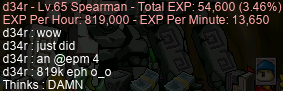

FoGgers. For comparison, here I am, two levels later, solo grinding at FoG:

Oh, and speaking of killing Sleepywood monsters… I vanquished the oversized undead fungus known as [ZMM](https://maplelegends.com/lib/monster?id=6300005), and as a result, produced the first-ever vicloc set of [Hwabi](https://maplelegends.com/lib/use?id=2070007)s:

Cool!! All of our (extremely plentiful) level 70+ assassins will be fighting over this bad boy for sure!!!

## Bossing with NZPally

Speaking of vicloc assassins, vicloc assassin **LoveIslander** (**NZIslander**, **NZPally**) offered to help out with outland bossing, for anyone who was interested — one of his other characters, NZPally, is a level 16X paladin! I mentioned that I’ve been interested in running the lower-level of the level ≥120-oriented bosses (i.e. [Ravana](https://maplelegends.com/lib/monster?id=9420014) & [Papulatus](https://maplelegends.com/lib/monster?id=8500001)), as I have some low-level 4th-jobbers of my own: my pure [STR bishop](https://oddjobs.codeberg.page/odd-jobs.html#str-mage) **cervid**, my [woodsmaster](https://oddjobs.codeberg.page/odd-jobs.html#woodsman) **capreolina**, & my [darksterity knight](https://oddjobs.codeberg.page/odd-jobs.html#dex-warrior) **rusa**! For better or worse, out of those three of my characters, capre probably has the hardest time here — her low MAXHP, and low defences in general, make her an easy target for, say, Ravana to send her immediately to her grave. But NZPally said that he was perfectly capable of disabling Ravana by pinning it to the left side of the map, so I made sure I had my [Safety Charm](https://maplelegends.com/lib/cash?id=5130000)s ready, and we gave it a whirl!:

Sweet!! I made it through both runs, as NZPally did a great job of pinning Ravana. My [SE](https://maplelegends.com/lib/skill?id=3121002) caused it to look like (at least, to third-person observers) NZPally was critting on every single hit. In actuality, this is just a visual bug; my SE only grants a 3% crit rate.

We also did Papu, as well! Papulatus is a little easier in some ways: I have no problems surviving the [0th](https://maplelegends.com/lib/monster?id=8500000) and [1st](https://maplelegends.com/lib/monster?id=8500001) bodies, although the [2nd](https://maplelegends.com/lib/monster?id=8500002) body is still capable of one-shotting me if it gets too close. Thankfully, the 2nd body has a lot less HP (1.59M \< 23.0M), and NZPally was capable of pinning it as well (although pinning it appears somewhat more difficult than pinning Ravana, if only because Papu’s 2nd body flies around at extreme speeds).

One unfortunate effect that I noticed with Papulatus is that the far left wall seems to often “eat” my arrows before they actually hit Papu’s 1st body. This seems to happen if Papu is pushed quite far to the left, and changing my position (e.g. going from the upper platform to just standing on the ground) seemed to make no difference. I didn’t expect this to happen, although my only prior experience fighing Papu was as cervid and as rusa, both of whom are melee-only anyways. But both runs went just fine, otherwise.

And with capre’s first Papu kills under her belt, she finished the questline!:

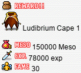

And I went back to Thailand to do the Ravana repeatable quest (the one that gives 2 [Sunburst](https://maplelegends.com/lib/etc?id=4031722)s). While I was there, I noticed that [She Long](https://maplelegends.com/lib/npc?id=9250041) had a quest for me. I completed it concurrently with the Ravana repeatable, and was pleasantly surprised to receive 20 [Guava](https://maplelegends.com/lib/use?id=2022230)s!:

I’ll take it!!

## d34r, questing

For my vicloc [dagger spearwoman](https://oddjobs.codeberg.page/odd-jobs.html#dagger-warrior) **d34r**, it is time for [big gator](https://maplelegends.com/lib/monster?id=6220000) quest. It seems that [someone](https://maplelegends.com/lib/npc?id=9020000) has been leaving magical growing powder around the Kerning City swamps(‽), and a healthy dose for one of our [Ligator](https://maplelegends.com/lib/monster?id=3110100) friends has created something of a monster! It seems that only d34r is brave enough to venture into the swamps and investigate!!

Take that, [random sewer reptile](https://maplelegends.com/lib/monster?id=5130103)s\*!

I pointed out this strange hut in the swamp in the previous diary entry, which **Slime** pointed out is indeed used in MapleLegends… for none other than big gator quest:

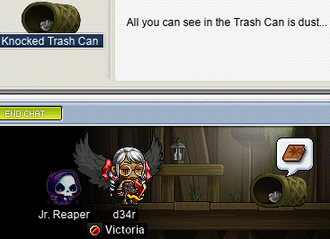

Oh, oops. It seems that, while this NPC _is_ used for the big gator quest, it only functions during a three hour(!) window each day: [17:00–20:00](https://en.wikipedia.org/wiki/Coordinated_Universal_Time). So much for anyone who is asleep during that time :)))

In any case, I did eventually manage to get a hold of our [Knocked Trash Can](https://maplelegends.com/lib/npc?id=1052108) here, and [the trash can personally told me to kill big gator](https://en.wikipedia.org/wiki/Anthropomorphism). Well, actually, the can just had a piece of paper in it, which I took to [JM](https://maplelegends.com/lib/npc?id=1052002), who told me to kill big gator.

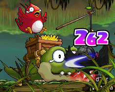

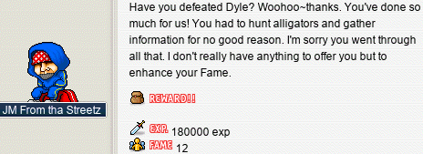

The big gator has been vanquished!! Huzzah.

In other news, [Muirhat](https://maplelegends.com/lib/npc?id=1092007) needed me to take care of some more terrible creatures. This time, my enemy is the [Ice Drake](https://maplelegends.com/lib/monster?id=6230600):

[The best map for farming Ice Drakes](https://maplelegends.com/lib/map?id=105090311) also has [Dark Drakes](https://maplelegends.com/lib/monster?id=6230601), which are some real tuff guys: level 68, with a whopping 13k HP a piece! The three-level gap and the 27 AVOID was giving me a tad bit of a hard time, but swapping to my WACC gloves and popping a handy-dandy [Sniper Potion](https://maplelegends.com/lib/use?id=2002005) did the trick, for the most part. And along the way, I got a sneaky Ice Drake card :o

Footnotes for “d34r, questing”

\*[Reptiles](https://en.wikipedia.org/wiki/Reptile) are funny. “Reptiles” in the usual sense is actually not a [clade](https://en.wikipedia.org/wiki/Clade) at all; because [_Aves_](https://en.wikipedia.org/wiki/Bird) is excluded, this makes _Reptilia_ (in the older, more usual sense) a [paraphyletic](https://en.wikipedia.org/wiki/Paraphyletic) group. More correct treatments of reptiles and birds make birds a strict subset of the set of all reptiles, in which case it makes sense to use phrases like “non-bird reptiles”; the proper clade version of _Reptilia_ (whatever clade that may be) is sometimes called [_Sauropsida_](https://en.wikipedia.org/wiki/Sauropsida). Speaking of birds, [_Crocodilia_](https://en.wikipedia.org/wiki/Crocodilia) comprises the non-bird reptiles who are most closely related to birds; in fact, the crocodilians are far more closely related to birds than they are to, say, [lizards](https://en.wikipedia.org/wiki/Lizard). Both [crocodiles](https://en.wikipedia.org/wiki/Crocodile) (Croco) and [alligators](https://en.wikipedia.org/wiki/Alligator) (Ligator) are crocodilians, although they aren’t any more closely related than that, making them not nearly as closely related as they appear. [English](https://en.wikipedia.org/wiki/English_language) “crocodile” is ultimately from [Ancient Greek](https://en.wikipedia.org/wiki/Ancient_Greek) _κροκόδειλος_, although the English version originally took on a lot of different forms like _cocodril_, _cokadrill_, etc., and was later respelled to look more like the Greek and [Latin](https://en.wikipedia.org/wiki/Latin) versions. English “alligator”, however, has a slightly more oblique origin, due to alligators being largely a [New World](https://en.wikipedia.org/wiki/New_World) genus. All known species of alligator (extant or extinct) are native to the modern [United States](https://en.wikipedia.org/wiki/United_States) and northeastern [Mexico](https://en.wikipedia.org/wiki/Mexico), with the exception of the [Chinese alligator](https://en.wikipedia.org/wiki/Chinese_alligator) (_Alligator sinensis_), which has a limited range in modern [China](https://en.wikipedia.org/wiki/China), mostly in [Anhui](https://en.wikipedia.org/wiki/Anhui). “Alligator” is an [anglicisation](https://en.wikipedia.org/wiki/Anglicisation) of the [Spanish](https://en.wikipedia.org/wiki/Spanish_language) _el lagarto_, literally meaning “the lizard” (the Spanish _lagarto_ is from Latin _lacertus_, which is also the source of English “lizard”). The “-r” at the end of “alligator” is an English innovation.

## Balrog, Junior

As a vicloc [dagger warrior](https://oddjobs.codeberg.page/odd-jobs.html#dagger-warrior), d34r’s endgame weapon is none other than the [Golden River](https://maplelegends.com/lib/equip?id=01332019), the level 70 warrior-thief dagger. Somewhat regrettably, the sole source of the Golden River in vicloc is [Jr. Balrog](https://maplelegends.com/lib/monster?id=8130100). Outlanders might think that Jr. Rog is kinda a chump, because he has 50k HP, but as far as I’m concerned, this rog ain’t no chump. Being level 80 and with 30 AVOID, I have accuracy issues against him, as usual. And, of course, he is capable of hitting over 2.9k damage with a single magic attack. But, as many [Unagi](https://maplelegends.com/lib/use?id=2022003)s and [Elixir](https://maplelegends.com/lib/use?id=2000004)s as it may take (hint: very many), I am determined to wrest a Golden River from Jr. Balrog’s evil claws. On that note, you can [watch a video of my first attempt at soloing Jr. Balrog on the **Oddjobs** YouTube channel](https://www.youtube.com/watch?v=M0MpIp84A2M)!

I also had some help from **xXCrookXx**, who is now capable of taking hits from this guy, provided some [HB](https://maplelegends.com/lib/skill?id=1301007):

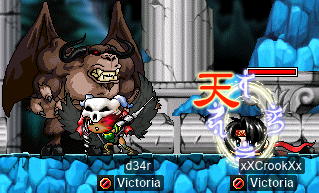

And we were assailed by a random outlander, but thankfully Jr. Rog took care of them for us:

I got up to 5/5 Jr. Rog cards pretty quickly:

And, with cards still popping out of Jr. Rog and no Golden Rivers in sight, I started looting the cards with my other characters, like **alces**, my undead [daggermit](https://oddjobs.codeberg.page/odd-jobs.html#dagger-assassin):

And I even got a chair o\_o

Yay for a chair that fits my outfit a lil more than ye olde [Relaxer](https://maplelegends.com/lib/setup?id=3010000)~ Still no Golden Rivers, though…

## Icarus teaches d33r how to fly

On my vicloc [clericlet](https://oddjobs.codeberg.page/odd-jobs.html#magelet) **d33r**, I was excited to finish one of the most rewarding questlines in vicloc: the legend of [Icarus](https://maplelegends.com/lib/npc?id=1052106). While this questline does revolve around Icarus, it does not end in quite the same way as the old [mythological](https://en.wikipedia.org/wiki/Greek_mythology) tale (at least, I hope not…). I had already helped Icarus put together a [hang glider](https://en.wikipedia.org/wiki/Hang_gliding) and a [balloon](https://en.wikipedia.org/wiki/Hot-air_balloon); this time, a magical flying pill! But, well, first I had to hit level 42:

With that out of the way, I went to [Wing the Fairy](https://maplelegends.com/lib/npc?id=1032106) to ask how to make the flying pill. I accidentally clicked on the wrong quest, and was reminded of the dialogue that starts another Wing the Fairy quest (which is unfortunately not doable for viclockers, for obvious reasons):

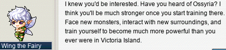

More powerful than I ever was on Victoria Island? Not likely. I know perfectly well that Ossyria is a hoax, fabricated to help feed the [crog](https://maplelegends.com/lib/monster?id=8150000)s!!

In any case, I had to gather up some [Medicines With Weird Vibes](https://maplelegends.com/lib/etc?id=4000036), so I headed over to the subway to kill some [chunky tablecloth ghosts](https://maplelegends.com/lib/monster?id=4230102):

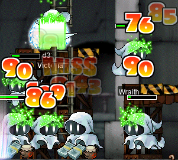

I still “**MISS**” them sometimes, but my [Heal](https://maplelegends.com/lib/skill?id=2301002) damage was more than good enough to get me the weird vibes that I needed for this quest.

I was really hoping to get an [Icarus Cape (1)](https://maplelegends.com/lib/equip?id=01102054) (d33r could really use the AVOID!) or an [Icarus Cape (2)](https://maplelegends.com/lib/equip?id=01102055) (d34r could really use the SPEED!). Unfortunately for me, I got the only one of the three capes that I was not looking forward to: the [Icarus Cape (3)](https://maplelegends.com/lib/equip?id=01102056). Oh well, that’s still another level 42 cape! Capes (particularly of such a low level) are not all that easy to come by on Victoria Island…

## Home Taping Is Killing CDs (And It’s Illegal)

I went back [to CDs](https://maplelegends.com/lib/map?id=742010203) (ugh, I know) on my I/L [magelet](https://oddjobs.codeberg.page/odd-jobs.html#magelet) **cervine** for some EXP. cervine’s next big milestone is level 110, at which point she is capable of equipping the [MoN](https://maplelegends.com/lib/equip?id=01122059). Normally, the MoN is not considered to be all that good for mages (well, except for [STR mages](https://oddjobs.codeberg.page/odd-jobs.html#str-mage)), as the [Horntail Necklace (HTP)](https://maplelegends.com/lib/equip?id=01122000), when [egg](https://maplelegends.com/lib/use?id=2041200)ed, gives 7 more TMA on average. Plus, the LUK can help normal mages equip jobbed gear, and the extremely high WDEF, MDEF, and AVOID don’t exactly hurt either. However, in the case of cervine, she kinda needs any help she can get when it comes to TMA. The HTP is a full 10 levels higher than the MoN, and by the time that I’m high level enough to buy and wear an HTP, I will have already essentially hit my ultimate goal: level 120. The problem, of course, is actually getting there. So I believe the MoN to be more than worth the investment, even if it “only” lasts me for 10 levels.

I started out somewhere around 70% EXP, and killed CDs until I was just over 90% of the way from level 107 to level 108. Then, in my next grinding session, I was joined by sniper **Level1Crook**, and I hit level 108!!:

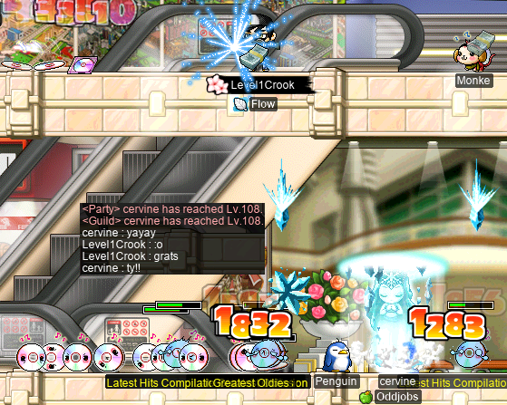

Hooray for 5 more LUK and 3 more [Partial Resistance](https://maplelegends.com/lib/skill?id=2210000)! Every little bit of EXP helps :)

And, I went back to my old ways of sadsadgrinding with my pure [STR bishop](https://oddjobs.codeberg.page/odd-jobs.html#str-mage) **cervid** and my [darksterity knight](https://oddjobs.codeberg.page/odd-jobs.html#dex-warrior) **rusa**, mostly just to get cervid to level 123 so that I could get [MW](https://maplelegends.com/lib/skill?id=2321000)9 and a spare SP! cervid was already pretty close to leveling up to 123 — and rusa pretty close to leveling up to 124~ But, at this point, it took me some 45 minutes of grinding to get roughly 10% EXP on cervid… After getting cervid past the 90% mark, and rusa to level 124(!!), I gave it a rest. And again, I was joined by Level1Crook for when I leveled cervid up:

And now cervid is level 123!! With an extra 2 SP in MW, and an extra 5 AP in STR, the upper part of my raw damage range equal to **6060**(!!!) with greedy damage gear + self-buffs + [Cider](https://maplelegends.com/lib/use?id=2022002). :O

## panolia tries MPQ for the first time

Now that my [permarogue](https://oddjobs.codeberg.page/odd-jobs.html#permarogue), **panolia**, already graduated from [OPQ](https://maplelegends.com/lib/map?id=200080101), we all know what that means: ‘tis [empy queue](https://maplelegends.com/lib/map?id=261000021) time! Here is panolia, facing off against [Franken Lloyd](https://maplelegends.com/lib/monster?id=9300139) for the very first time:

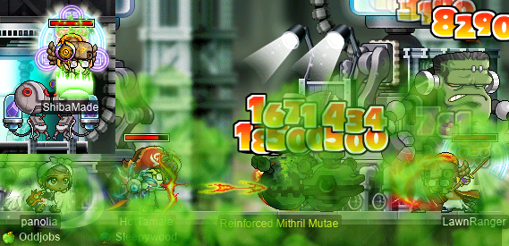

And here she is, doing the “thief” portal (so called because _ONLY_ thieves are allowed in\*; being a rogue myself, this portal is made for me!!!) for the very first time:

I did a number of MPQs with sniper **SadboySolari**, during most of which I dragged along my MPQ mule **potpan** to fill a spot, and usually to do the mage portal as well:

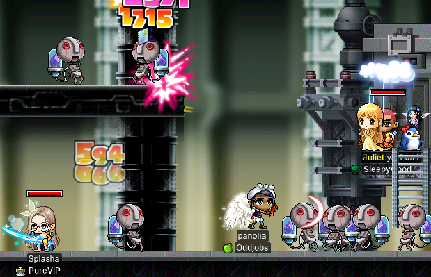

And it was also during stage 4 of MPQ that I experienced the v tragic loss of a single excess MAXMP:

I know; heartbreaking. After that PQ, I went to [the FM entrance](https://maplelegends.com/lib/map?id=910000000) to `/trade` myself the earrings from another character, and just as I was about to complete the trade, both of my MapleLegends clients simultaneously [crashed][crash]. I thought this to be rather unusual, and upon logging back in, I found the FM entrance to be much emptier than before, with someone complaining in all-chat that something had crashed everyone in the map. Thankfully for me, I had properly used `/trade` to attempt to trade to myself a valuable item… if I had drop-traded, I would have likely lost my earrings forever. I was reminded of a conversation that I had before with **Cortical**, in which I remarked that drop-trading vs. `/trade`-ing is a good illustration of [race conditions](https://en.wikipedia.org/wiki/Race_condition). Because using `/trade` either means that the transaction goes through entirely and all at once, or that nothing happens at all, it is not possible for a `/trade` to be cut off prematurely and result in item/meso loss or an erroneous/unwanted trade (assuming that the game server is implemented reasonably well). That is, because `/trade` is [atomic][atomic], it is not subject to race conditions that could arise as a result of racing with other undesirable events. On the other hand, drop-trading is **non**atomic; for example, it is possible to drop the item that is being traded, and then somewhere in between the item being dropped and the item being looted, one or more of the participants in the trade crash. Many other unfortunate races are also possible, of course: the server itself could crash, another character could loot the item before the intended recipient loots it, etc. And these races are made worse by the possibility of a full inventory. These unfortunate races may seem unlikely — but apparently, not unlikely enough, as we have seen here…

Footnotes for “panolia tries MPQ for the first time”

\*Not actually true at all.

## woosa~

After hitting level 124 on my [darksterity knight](https://oddjobs.codeberg.page/odd-jobs.html#dex-warrior) **rusa**, I was in [Taipei 101 proper](https://maplelegends.com/lib/map?id=742000000) and was reminded that I had a Taipei 101 quest (technically, a [Night Market](https://maplelegends.com/lib/map?id=741000000) quest, I think; but both are part of [Taiwan](https://en.wikipedia.org/wiki/Taiwan), in any case) in progress: collecting [Lubricating Eye Drops](https://maplelegends.com/lib/quest?id=8689) for [Bi Bi](https://maplelegends.com/lib/npc?id=9330019). I actually started [a thread on the MapleLegends forums](https://forum.maplelegends.com/index.php?threads/remove-the-boxes-crates-in-taipei-101.38051/) related to this quest; this quest is responsible for the wooden crates scattered around almost every Taipei 101 map. I headed to [Fashion Avenue East Section](https://maplelegends.com/lib/map?id=742010000), the map immediately adjacent to Taipei 101 proper, and started breaking the boxes there:

I was able to complete the entire quest quite quickly within this single map alone — just surfing through 6 or 7 channels did the trick:

Not the most amazing quest reward of all time — but still a bit better than I expected, to be honest. Those [Metal Silver Earrings](https://maplelegends.com/lib/equip?id=01032015) sell at an NPC for a healthy 125k mesos :)

And later, I headed to deep Ludibrium to hang out with **MPQ GANG** (including sniper **xBowtjuhNL**, chief bandit **Harlez**, and [STRginner](https://oddjobs.codeberg.page/odd-jobs.html#str-beginner) **ducklings**; unfortunately **Gruzz** was not present):

After ducklings had finished up some of the quests around Ludi (including the [Papu](https://maplelegends.com/lib/monster?id=8500001) prequests~), we headed over to [KFT](https://maplelegends.com/lib/map?id=222000000) to do the 333 [foxtails](https://maplelegends.com/lib/etc?id=4000172) quest together. While we were [there](https://maplelegends.com/lib/map?id=222010310), was experienced the v tragic loss of a single meso coin, eaten whole by the boundaries of the map:

The one that got away~!!

## alces is on the quest again

As some readers of this diary may remember, I took a kind of hybrid approach with my undead [daggermit](https://oddjobs.codeberg.page/odd-jobs.html#dagger-assassin) **alces** when leveling her, particularly through the [OPQ](https://maplelegends.com/lib/map?id=200080101) levels: PQing and questing at the same time. Once I hit level 71, though, I went full PQ mode, greedily saving my quests until after I graduated [MPQ](https://maplelegends.com/lib/map?id=261000021). The reasoning here was that alces is exclusively a single-target attacker for life, her only real attack being [Double Stab](https://maplelegends.com/lib/skill?id=4001334). And while my damage is certainly impressive (by my own standards lol), it isn’t exactly massive enough to make grinding very eficient at all. So saving quests for a while will hopefully help to stretch out alces’s longevity just a little bit.

Now, however, alces is certainly graduated from MPQ — and essentially graduated from [PPQ](https://maplelegends.com/lib/map?id=251010404), as well, even though she isn’t level \>100! So alces can return to questing once again~

It should be noted that my methodology with questing on alces is extremely arbitrary. I am not a quest completionist (if I wanted to try my hand at that, I would plan for it before even creating my character), and MapleLegends contains so many areas and quests that I can’t say I’m very familiar with all that many of them. Instead, I keep a little text file on my hard drive with some brief and skeletal notes, mostly just containing lists of some quests — effectively my own quest journal. I decide to put quests into this text file by browsing around (via in-game quest journal, usually) and briefly researching quests (see [\[1\]](https://bbb.hidden-street.net/), [\[2\]](https://global.hidden-street.net/), and occasionally [\[3\]](https://mapletip.com/)) to see if they look appealing to me. So, I am picky about the quests that I do, and I absolutely do care about the rewards that the quests give me, but my approach, in practice, is not very refined. Mostly I just kinda wander around and do random stuff, although there’s always something in my brain loudly nagging at me to plan more carefully, so that I don’t spend half of my time just _travelling_ around…

I was already in Victoria Island (mostly to steal cards from **d34r** lol), so I headed to [Perion](https://maplelegends.com/lib/map?id=102000000), and then to the [Kerning City](https://maplelegends.com/lib/map?id=103000000) swamps, to do both [The Alligators at the Swamp](https://bbb.hidden-street.net/quest/victoria-island/the-alligators-at-the-swamp) and [big gator](https://maplelegends.com/lib/monster?id=6220000) quest:

And took on the big gator!:

Big gator is no match for alces’s dagger~

And I started [Muirhat](https://maplelegends.com/lib/npc?id=1092007)’s kill quests, which asked me to take on all three types of Stone Golem:

…And then asked me to take on some of the undeads around Perion’s excavation camp. On the way there, I stopped by [Winston](https://maplelegends.com/lib/npc?id=1022006) and accepted [Winston’s Fossil Dig-up](https://bbb.hidden-street.net/quest/victoria-island/winstons-fossil-dig-up) and [Eliminate Monsters from the Site](https://bbb.hidden-street.net/quest/victoria-island/eliminate-monsters-from-the-site). I completed the latter on the way to the deeper portions of the excavation camp:

And once I got to the camp proper, I accepted [Notice from the Excavation Team](https://bbb.hidden-street.net/quest/victoria-island/notice-from-the-excavation-team), which overlaps with the Muirhat quest that I was on.

You may remember, from the previous diary entry, how hard of a time I had on d34r when trying to complete the “Notice from the Excavation Team” quest. In particular, the hard part is killing the [Commander Skeleton](https://maplelegends.com/lib/monster?id=7130103)s — at the time, d34r was just level 60, and these guys are level 73, with 32 AVOID and some very hard-hitting attacks. Luckily, I had some help from allies, which made it much easier than it would have otherwise been. For alces, though, the level 89 daggermit that she is, this was no problem:

And I started the [big monke](https://maplelegends.com/lib/monster?id=5220002) quest in [Ellinia](https://maplelegends.com/lib/map?id=101000000), as well. Here I am, killing [Maladies](https://maplelegends.com/lib/monster?id=5300100) for their [Cursing Nail](https://maplelegends.com/lib/etc?id=4031925)s:

Also in Ellinia, I killed some [Green Mushies](https://maplelegends.com/lib/monster?id=1110100) for their [Animal Fossil](https://maplelegends.com/lib/etc?id=4031146)s. Then [some stumps](https://maplelegends.com/lib/map?id=101030402) for their [Plant Fossil](https://maplelegends.com/lib/etc?id=4031147)s:

Once I delivered the [Fossil Box](https://maplelegends.com/lib/etc?id=4031149) to [Betty](https://maplelegends.com/lib/npc?id=1032104), I continued on to the [Dr. Betty’s Research on Animal Fossils](https://bbb.hidden-street.net/quest/victoria-island/dr-bettys-research-on-animal-fossils) and [Dr. Betty’s Research on Plants](https://bbb.hidden-street.net/quest/victoria-island/dr-bettys-research-on-plants) quests:

And got my handy-dandy [Leaf Earrings](https://maplelegends.com/lib/equip?id=01032025) :)

## A lil pea pea cue

I was invited to [PPQ](https://maplelegends.com/lib/map?id=251010404) by [STRginner](https://oddjobs.codeberg.page/odd-jobs.html#str-beginner) **Permanovice** (**Battlesage**, **Dreamscapes**, **Hanger**), and because my [swashbuckler](https://oddjobs.codeberg.page/odd-jobs.html#swashbuckler) **hydropotina** was already in Mu Lung Gardens, I headed there as hydro:

Not gonna lie, using [Wings](https://maplelegends.com/lib/skill?id=5201005) to hop directly from one large platform to the next during the [Through the Deck](https://maplelegends.com/lib/map?id=925100200) stages is pretty fun.

And here is hydro, with Permanovice, **Yukinoumi**, & **LadyDemeter**, fiercely battling the [Lord Pirate](https://maplelegends.com/lib/monster?id=9300119):

And later, I swapped over to my [permarogue](https://oddjobs.codeberg.page/odd-jobs.html#permarogue) **panolia** so that panolia could try her hand at PPQ for the very first time~:

And thanks to Permanovice and **IceGrinder** for kindly helping panolia do the PPQ quests~! \<3

[sol]: https://en.wikipedia.org/wiki/Sol_(colloid)
[metric]: https://en.wikipedia.org/wiki/Metric_(mathematics)
[field]: https://en.wikipedia.org/wiki/Field_(mathematics)
[set]: https://en.wikipedia.org/wiki/Set_(mathematics)
[module]: https://en.wikipedia.org/wiki/Module_(mathematics)
[ring]: https://en.wikipedia.org/wiki/Ring_(mathematics)
[division]: https://en.wikipedia.org/wiki/Division_(mathematics)
[tree]: https://en.wikipedia.org/wiki/Tree_(graph_theory)
[matrix]: https://en.wikipedia.org/wiki/Matrix_(mathematics)
[big-small]: https://en.wikipedia.org/wiki/Big_O_notation#Family_of_Bachmann%E2%80%93Landau_notations
[p]: https://en.wikipedia.org/wiki/P_(complexity)
[heap]: https://en.wikipedia.org/wiki/Heap_(data_structure)
[o~]: https://en.wikipedia.org/wiki/Big_O_notation#Extensions_to_the_Bachmann%E2%80%93Landau_notations
[noise]: https://en.wikipedia.org/wiki/Noise_(signal_processing)
[dual]: https://en.wikipedia.org/wiki/Duality_(mathematics)
[union]: https://en.wikipedia.org/wiki/Union_(set_theory)
[vertex]: https://en.wikipedia.org/wiki/Vertex_(graph_theory)
[character]: https://en.wikipedia.org/wiki/Character_(biology)
[crash]: https://en.wikipedia.org/wiki/Crash_(computing)
[atomic]: https://en.wikipedia.org/wiki/Atomicity_(database_systems)
